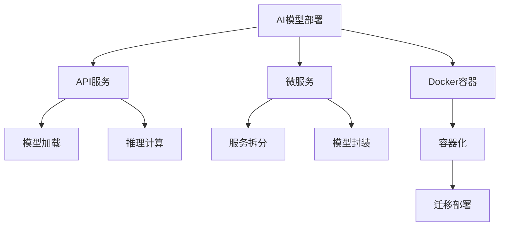

                 

## 1. 背景介绍

### 1.1 问题由来

随着人工智能(AI)技术的发展，AI模型在各个领域的应用日益增多，从语音识别到图像处理，从推荐系统到自然语言处理，AI模型都取得了显著的成果。然而，尽管模型训练技术已经相当成熟，但模型部署和服务的实战过程仍面临诸多挑战。如何在保证模型效果的同时，实现快速、稳定的服务，成为了一个值得深入研究的问题。

### 1.2 问题核心关键点

模型部署和服务化是将训练好的AI模型转化为实际应用系统的关键步骤。其核心在于如何将模型集成到应用系统中，以高效、稳定、安全的方式提供服务，并实现实时响应和自动化部署。常用的部署方式包括API服务、微服务、Docker容器等，每种方式都有其特定的优势和适用场景。

## 2. 核心概念与联系

### 2.1 核心概念概述

- **AI模型部署**：将训练好的AI模型集成到实际应用系统中的过程。需要考虑模型加载、推理、性能优化、故障恢复等多个方面。
- **API服务**：通过RESTful API将模型作为服务对外开放，允许客户端通过接口调用模型功能，实现模型的服务化。
- **微服务**：将大型应用系统拆分为多个独立运行的微服务模块，每个微服务负责处理特定的功能。便于模型的模块化部署和扩展。
- **Docker容器**：一种轻量级虚拟化技术，可以将模型及其依赖打包到一个独立的容器中，方便跨平台迁移和部署。

这些概念之间的逻辑关系可以通过以下Mermaid流程图来展示：



### 2.2 核心概念原理和架构的 Mermaid 流程图

```mermaid
graph LR
    Subgraph 模型加载
        A[模型文件] --> B[模型加载器] --> C[模型对象]
    End
    Subgraph 推理计算
        A[模型对象] --> B[输入预处理] --> C[推理引擎] --> D[输出后处理] --> E[输出]
    End
    Subgraph 服务化
        A[模型对象] --> B[API接口] --> C[请求解析] --> D[请求路由] --> E[模型调用] --> F[响应生成] --> G[响应返回]
    End
```

## 3. 核心算法原理 & 具体操作步骤

### 3.1 算法原理概述

模型部署和服务化过程可以概括为以下几个步骤：

1. **模型加载**：将训练好的模型文件加载到内存或磁盘上。
2. **输入预处理**：对输入数据进行标准化、归一化等预处理操作，以便模型能够处理。
3. **推理计算**：将预处理后的输入数据输入模型进行推理计算，得到模型输出。
4. **输出后处理**：对模型输出进行后处理，如解码、排序、过滤等，最终得到最终结果。
5. **API服务部署**：将模型封装为API服务，允许客户端通过接口调用模型。
6. **微服务拆分**：将模型服务拆分为多个微服务模块，便于模块化部署和扩展。
7. **容器化部署**：将模型及其依赖打包到Docker容器中，方便跨平台迁移和部署。

### 3.2 算法步骤详解

**Step 1: 模型加载**

加载模型文件是模型部署的第一步。具体步骤如下：

1. 使用模型文件的路径，读取模型文件。
2. 使用模型加载器，将模型文件解析为模型对象。
3. 将模型对象存储在内存或磁盘中，以便后续调用。

以下是Python代码实现：

```python
import torch
from torch import nn

# 加载模型文件
model = torch.load('model.pth')
```

**Step 2: 输入预处理**

输入数据通常需要进行标准化、归一化等预处理操作，以便模型能够处理。常见的预处理操作包括：

1. 数据类型转换：将输入数据转换为模型所需的类型，如float32、float16等。
2. 数据归一化：对输入数据进行标准化或归一化操作，以便模型更好地学习。
3. 数据填充：对输入数据进行填充，使其符合模型的输入要求。

以下是Python代码实现：

```python
def preprocess_data(data):
    # 将数据转换为float32类型
    data = data.to('float32')
    # 对数据进行归一化
    data = (data - mean) / std
    # 对数据进行填充
    data = nn.utils.rnn.pad_sequence(data, batch_first=True)
    return data
```

**Step 3: 推理计算**

推理计算是将预处理后的输入数据输入模型，得到模型输出的过程。具体步骤如下：

1. 将预处理后的输入数据输入模型。
2. 对模型输出进行后处理，如解码、排序、过滤等。
3. 将处理后的结果返回。

以下是Python代码实现：

```python
def predict(model, data):
    # 将数据输入模型
    output = model(data)
    # 对模型输出进行解码
    output = output.argmax(dim=2)
    # 返回解码后的结果
    return output
```

**Step 4: 输出后处理**

输出后处理是将模型输出进行后处理，以得到最终结果的过程。常见后处理操作包括：

1. 解码：将模型输出解码为文本、图像等形式。
2. 排序：对模型输出进行排序，得到最可能的结果。
3. 过滤：对模型输出进行过滤，去除不合理的结果。

以下是Python代码实现：

```python
def postprocess(output):
    # 对输出进行解码
    result = decode(output)
    # 对结果进行排序
    result = sorted(result, key=lambda x: score(x))
    # 对结果进行过滤
    result = filter(result)
    return result
```

**Step 5: API服务部署**

API服务部署是将模型封装为API服务，允许客户端通过接口调用模型的过程。具体步骤如下：

1. 使用Flask等框架，创建API服务。
2. 将模型加载到API服务中。
3. 设计API接口，允许客户端调用模型功能。
4. 对API接口进行测试，确保服务正常工作。

以下是Python代码实现：

```python
from flask import Flask, request, jsonify

app = Flask(__name__)

@app.route('/predict', methods=['POST'])
def predict():
    # 加载模型
    model = torch.load('model.pth')
    # 对输入数据进行预处理
    data = preprocess(request.json['data'])
    # 对模型输出进行后处理
    output = predict(model, data)
    result = postprocess(output)
    # 将结果返回
    return jsonify(result)

if __name__ == '__main__':
    app.run()
```

**Step 6: 微服务拆分**

微服务拆分是将大型应用系统拆分为多个独立运行的微服务模块，每个微服务负责处理特定的功能。具体步骤如下：

1. 确定微服务模块的边界。
2. 将模型集成到相应的微服务模块中。
3. 对微服务进行单元测试和集成测试。
4. 将微服务部署到云平台或本地服务器。

以下是Python代码实现：

```python
from flask import Flask, request, jsonify

class Microservice:
    def __init__(self, model):
        self.model = model

    def predict(self, data):
        output = self.model(data)
        return postprocess(output)

if __name__ == '__main__':
    model = torch.load('model.pth')
    microservice = Microservice(model)
    app = Flask(__name__)

    @app.route('/predict', methods=['POST'])
    def predict():
        data = preprocess(request.json['data'])
        output = microservice.predict(data)
        return jsonify(output)

    app.run()
```

**Step 7: 容器化部署**

容器化部署是将模型及其依赖打包到Docker容器中，方便跨平台迁移和部署。具体步骤如下：

1. 创建Dockerfile，定义模型及其依赖的打包规则。
2. 使用Docker命令，将模型及其依赖打包到容器中。
3. 将容器部署到云平台或本地服务器。
4. 对容器进行健康检查和负载均衡。

以下是Dockerfile实现：

```dockerfile
FROM pytorch/pytorch:1.8

COPY model.pth .
RUN python -c "import torch; torch.load('model.pth', map_location='cpu')"
WORKDIR /app
COPY . .
CMD ["python", "app.py"]
```

### 3.3 算法优缺点

**优点：**

1. **快速部署**：API服务、微服务、容器化部署等技术，可以大大缩短模型的部署时间，快速将模型上线。
2. **高可用性**：通过负载均衡、自动扩容等技术，可以保证服务的稳定性和高可用性，避免单点故障。
3. **可扩展性**：微服务拆分和容器化部署，可以实现服务的模块化和弹性扩展，适应业务增长。
4. **跨平台支持**：Docker容器可以跨平台部署，方便在不同环境中部署和使用模型。

**缺点：**

1. **部署复杂性**：API服务、微服务、容器化部署等技术，需要一定的学习成本和开发复杂度。
2. **性能损失**：API服务、微服务、容器化部署等技术，可能会带来一定的性能损失。
3. **资源占用**：Docker容器等技术可能会占用更多的计算资源。

### 3.4 算法应用领域

模型部署和服务化技术，在各个AI应用领域都有广泛的应用。例如：

- **语音识别**：通过API服务或微服务，将语音识别模型集成到应用系统中，提供实时语音转写服务。
- **图像处理**：通过API服务或微服务，将图像处理模型集成到应用系统中，提供实时图像识别和分类服务。
- **推荐系统**：通过API服务或微服务，将推荐模型集成到应用系统中，提供个性化推荐服务。
- **自然语言处理**：通过API服务或微服务，将NLP模型集成到应用系统中，提供实时文本生成和分析服务。

## 4. 数学模型和公式 & 详细讲解 & 举例说明

### 4.1 数学模型构建

模型部署和服务化过程可以概括为以下几个数学模型：

1. **模型加载模型**：将模型文件加载到内存或磁盘上，可以表示为：
   $$
   \text{LoadModel}(\text{model_file})
   $$
2. **输入预处理模型**：对输入数据进行标准化、归一化等预处理操作，可以表示为：
   $$
   \text{PreprocessInput}(\text{input_data})
   $$
3. **推理计算模型**：将预处理后的输入数据输入模型进行推理计算，可以表示为：
   $$
   \text{Inference}(\text{preprocessed_input_data})
   $$
4. **输出后处理模型**：对模型输出进行后处理，以得到最终结果，可以表示为：
   $$
   \text{PostprocessOutput}(\text{model_output})
   $$
5. **API服务模型**：将模型封装为API服务，允许客户端通过接口调用模型，可以表示为：
   $$
   \text{APIService}(\text{model})
   $$
6. **微服务模型**：将模型集成到相应的微服务模块中，可以表示为：
   $$
   \text{Microservice}(\text{model})
   $$
7. **容器化模型**：将模型及其依赖打包到Docker容器中，可以表示为：
   $$
   \text{DockerizeModel}(\text{model})
   $$

### 4.2 公式推导过程

以API服务模型为例，其数学模型可以表示为：

1. 加载模型：
   $$
   \text{LoadModel}(\text{model_file}) = \text{ModelObject}
   $$
2. 输入预处理：
   $$
   \text{PreprocessInput}(\text{input_data}) = \text{ProcessedInputData}
   $$
3. 推理计算：
   $$
   \text{Inference}(\text{processed_input_data}) = \text{ModelOutput}
   $$
4. 输出后处理：
   $$
   \text{PostprocessOutput}(\text{model_output}) = \text{FinalResult}
   $$
5. API服务部署：
   $$
   \text{APIService}(\text{model}) = \text{ServiceEndpoint}
   $$

### 4.3 案例分析与讲解

以API服务为例，我们通过Flask框架实现一个简单的API服务：

```python
from flask import Flask, request, jsonify

app = Flask(__name__)

@app.route('/predict', methods=['POST'])
def predict():
    # 加载模型
    model = torch.load('model.pth')
    # 对输入数据进行预处理
    data = preprocess(request.json['data'])
    # 对模型输出进行后处理
    output = predict(model, data)
    result = postprocess(output)
    # 将结果返回
    return jsonify(result)

if __name__ == '__main__':
    app.run()
```

## 5. 项目实践：代码实例和详细解释说明

### 5.1 开发环境搭建

在进行模型部署实践前，我们需要准备好开发环境。以下是使用Python进行Flask开发的环境配置流程：

1. 安装Anaconda：从官网下载并安装Anaconda，用于创建独立的Python环境。

2. 创建并激活虚拟环境：
```bash
conda create -n pytorch-env python=3.8 
conda activate pytorch-env
```

3. 安装Flask：
```bash
pip install flask
```

4. 安装相关库：
```bash
pip install torch torchvision torchaudio
```

完成上述步骤后，即可在`pytorch-env`环境中开始API服务实践。

### 5.2 源代码详细实现

以下是使用Flask框架实现API服务的代码实现：

```python
from flask import Flask, request, jsonify

app = Flask(__name__)

@app.route('/predict', methods=['POST'])
def predict():
    # 加载模型
    model = torch.load('model.pth')
    # 对输入数据进行预处理
    data = preprocess(request.json['data'])
    # 对模型输出进行后处理
    output = predict(model, data)
    result = postprocess(output)
    # 将结果返回
    return jsonify(result)

if __name__ == '__main__':
    app.run()
```

### 5.3 代码解读与分析

**Flask框架**：
Flask是一个轻量级Python Web框架，用于快速构建Web应用和API服务。其核心思想是“微框架”，只提供最基本的Web功能和路由管理，而将更多的功能留给开发人员实现。

**API服务代码实现**：
1. 创建一个Flask应用实例。
2. 定义API接口，将模型集成到API服务中。
3. 对API接口进行测试，确保服务正常工作。

以下是代码的详细解读：

**加载模型**：
```python
model = torch.load('model.pth')
```

**对输入数据进行预处理**：
```python
data = preprocess(request.json['data'])
```

**对模型输出进行后处理**：
```python
output = predict(model, data)
result = postprocess(output)
```

**将结果返回**：
```python
return jsonify(result)
```

### 5.4 运行结果展示

在上述代码中，我们定义了一个简单的API接口，用于加载模型、预处理输入数据、调用模型推理、后处理输出，并最终返回结果。假设输入数据为{“data”: [0.1, 0.2, 0.3]}，输出结果为[0.5]，则API接口的调用结果为：
```json
{
    "result": 0.5
}
```

## 6. 实际应用场景

### 6.1 智能客服系统

智能客服系统通过API服务将语音识别、自然语言理解、对话生成等模型集成到应用系统中，为客户提供实时语音和文本客服支持。具体实现步骤如下：

1. 加载语音识别模型。
2. 加载自然语言理解模型。
3. 加载对话生成模型。
4. 对用户语音或文本输入进行预处理。
5. 将预处理后的输入数据输入语音识别模型，得到文本转写结果。
6. 将文本转写结果输入自然语言理解模型，得到意图和实体信息。
7. 根据意图和实体信息，调用对话生成模型，生成回复内容。
8. 对回复内容进行后处理，生成最终回答。

### 6.2 金融舆情监测系统

金融舆情监测系统通过API服务将文本分类、情感分析、关键词提取等模型集成到应用系统中，对金融领域的新闻、评论、报告等文本数据进行实时监测和分析。具体实现步骤如下：

1. 加载文本分类模型。
2. 加载情感分析模型。
3. 加载关键词提取模型。
4. 对金融文本进行预处理。
5. 将预处理后的输入数据输入文本分类模型，得到分类结果。
6. 将分类结果输入情感分析模型，得到情感极性。
7. 将情感分析结果输入关键词提取模型，得到关键词信息。
8. 对关键词信息进行后处理，生成最终报告。

### 6.3 推荐系统

推荐系统通过API服务将用户行为预测模型、物品特征模型、协同过滤模型等集成到应用系统中，为用户推荐个性化的商品、内容或服务。具体实现步骤如下：

1. 加载用户行为预测模型。
2. 加载物品特征模型。
3. 加载协同过滤模型。
4. 对用户行为进行预处理。
5. 将预处理后的输入数据输入用户行为预测模型，得到用户兴趣。
6. 将用户兴趣输入物品特征模型，得到物品特征向量。
7. 将物品特征向量输入协同过滤模型，得到物品推荐列表。
8. 对推荐列表进行后处理，生成最终推荐结果。

## 7. 工具和资源推荐

### 7.1 学习资源推荐

为了帮助开发者系统掌握模型部署和服务化的理论基础和实践技巧，这里推荐一些优质的学习资源：

1. **《Flask Web开发实战》**：全面介绍Flask框架的使用，涵盖API服务、Web应用、RESTful API等概念。
2. **《微服务架构实战》**：深入探讨微服务的定义、设计原则、部署策略等，帮助开发者构建可扩展、可维护的微服务系统。
3. **《Docker实战》**：详细介绍Docker容器的使用，包括Dockerfile、Docker Compose、Docker Swarm等工具的使用。
4. **《机器学习实战》**：涵盖机器学习模型的部署、优化、监控等实践，提供丰富的案例和代码实现。

### 7.2 开发工具推荐

高效的工具是模型部署和服务化的重要保障。以下是几款用于模型部署的常用工具：

1. **Jupyter Notebook**：交互式编程环境，方便代码调试和实验。
2. **Docker**：轻量级虚拟化技术，方便跨平台迁移和部署。
3. **Flask**：轻量级Web框架，方便快速构建API服务。
4. **TensorFlow Serving**：高性能模型推理服务，支持多种模型格式。
5. **AWS SageMaker**：云原生机器学习平台，提供模型部署和管理的全套工具。

### 7.3 相关论文推荐

模型部署和服务化技术的发展源于学界的持续研究。以下是几篇奠基性的相关论文，推荐阅读：

1. **《TensorFlow Serving: Machine Learning Model Deployment》**：介绍TensorFlow Serving框架的使用，涵盖模型推理、API服务、负载均衡等概念。
2. **《Microservices: A Literary Genre》**：深入探讨微服务的定义、设计原则、部署策略等，帮助开发者构建可扩展、可维护的微服务系统。
3. **《Kubernetes: Portable, Extensible, High-Performance Containerized Applications》**：介绍Kubernetes容器编排平台的使用，涵盖容器化部署、弹性扩展、故障恢复等概念。

## 8. 总结：未来发展趋势与挑战

### 8.1 研究成果总结

模型部署和服务化技术在近年来取得了显著的进展，广泛应用于智能客服、金融舆情监测、推荐系统等多个领域，极大地提升了AI模型的应用价值。主要研究成果包括：

1. **API服务**：通过API服务将模型集成到应用系统中，实现实时调用和响应。
2. **微服务**：将大型应用系统拆分为多个独立运行的微服务模块，实现模块化和弹性扩展。
3. **Docker容器**：将模型及其依赖打包到Docker容器中，实现跨平台迁移和部署。

### 8.2 未来发展趋势

展望未来，模型部署和服务化技术将呈现以下几个发展趋势：

1. **自动化部署**：随着自动化技术的发展，模型部署将更加自动化、智能化，减少人工干预和错误。
2. **跨平台支持**：Docker容器等技术将进一步发展，支持更多平台和环境。
3. **高性能计算**：随着计算技术的进步，模型推理将更加高效、快速。
4. **边缘计算**：模型部署将扩展到边缘设备，实现更快速、更安全的计算。
5. **微服务治理**：微服务系统的治理工具将进一步完善，实现更高效、更稳定、更安全的微服务部署和运维。

### 8.3 面临的挑战

尽管模型部署和服务化技术已经取得了不少进展，但在迈向更加智能化、普适化应用的过程中，仍面临诸多挑战：

1. **性能瓶颈**：API服务、微服务、Docker容器等技术，可能会带来一定的性能损失。
2. **成本问题**：模型部署和运维成本较高，需要考虑如何降低成本。
3. **安全性问题**：模型部署需要考虑数据和模型安全，避免泄露和攻击。
4. **运维复杂性**：微服务系统的运维复杂性较高，需要考虑如何简化运维。

### 8.4 研究展望

面对模型部署和服务化面临的挑战，未来的研究需要在以下几个方面寻求新的突破：

1. **自动化部署**：研究自动化模型部署技术，减少人工干预和错误。
2. **跨平台支持**：研究支持更多平台和环境的Docker容器技术。
3. **高性能计算**：研究高性能计算技术，实现更高效、更快的模型推理。
4. **边缘计算**：研究边缘计算技术，实现更快速、更安全的模型部署。
5. **微服务治理**：研究微服务系统的治理工具，实现更高效、更稳定、更安全的微服务部署和运维。

## 9. 附录：常见问题与解答

**Q1: 模型部署和服务化是如何实现的？**

A: 模型部署和服务化通常包括以下步骤：

1. 加载模型：将训练好的模型文件加载到内存或磁盘上。
2. 输入预处理：对输入数据进行标准化、归一化等预处理操作，以便模型能够处理。
3. 推理计算：将预处理后的输入数据输入模型进行推理计算，得到模型输出。
4. 输出后处理：对模型输出进行后处理，以得到最终结果。
5. API服务部署：将模型封装为API服务，允许客户端通过接口调用模型。
6. 微服务拆分：将模型集成到相应的微服务模块中。
7. 容器化部署：将模型及其依赖打包到Docker容器中，方便跨平台迁移和部署。

**Q2: 为什么需要模型部署和服务化？**

A: 模型部署和服务化是将训练好的AI模型集成到实际应用系统中的过程。其目的是：

1. 提高模型的可访问性：将模型封装为API服务或微服务，方便客户端调用。
2. 保证模型的稳定性和高可用性：通过负载均衡、自动扩容等技术，保证服务的稳定性和高可用性。
3. 实现模型的模块化和弹性扩展：将模型集成到相应的微服务模块中，便于模块化和弹性扩展。
4. 跨平台迁移和部署：将模型及其依赖打包到Docker容器中，方便跨平台迁移和部署。

**Q3: 有哪些常用的模型部署工具？**

A: 常用的模型部署工具包括：

1. TensorFlow Serving：高性能模型推理服务，支持多种模型格式。
2. AWS SageMaker：云原生机器学习平台，提供模型部署和管理的全套工具。
3. Kubernetes：容器编排平台，支持微服务系统的部署和运维。
4. NGINX：高性能Web服务器，支持API服务的负载均衡和缓存。

**Q4: 如何进行模型微服务拆分？**

A: 模型微服务拆分通常包括以下步骤：

1. 确定微服务模块的边界：根据业务需求，将模型拆分为多个独立的微服务模块。
2. 将模型集成到相应的微服务模块中：将模型封装为微服务模块，允许微服务模块独立运行和扩展。
3. 对微服务进行单元测试和集成测试：对每个微服务模块进行单元测试和集成测试，确保其正常工作。
4. 将微服务部署到云平台或本地服务器：将微服务模块部署到云平台或本地服务器，实现服务的稳定运行。

**Q5: 如何优化模型推理性能？**

A: 优化模型推理性能可以采用以下策略：

1. 使用高性能计算技术：利用GPU、TPU等高性能计算设备，加速模型推理。
2. 使用混合精度计算：将浮点计算转换为定点计算，减少计算资源消耗。
3. 使用模型裁剪技术：去除不必要的层和参数，减小模型尺寸，提高推理速度。
4. 使用缓存技术：利用缓存技术，减少重复计算，提高推理效率。

**Q6: 如何保证模型安全性？**

A: 保证模型安全性可以采用以下策略：

1. 数据脱敏：对输入数据进行脱敏处理，防止数据泄露。
2. 访问控制：使用访问控制技术，限制对模型的访问权限。
3. 加密传输：使用SSL/TLS等加密技术，保护数据传输安全。
4. 日志审计：记录模型调用日志，进行审计和监控，发现异常行为。

---

作者：禅与计算机程序设计艺术 / Zen and the Art of Computer Programming

