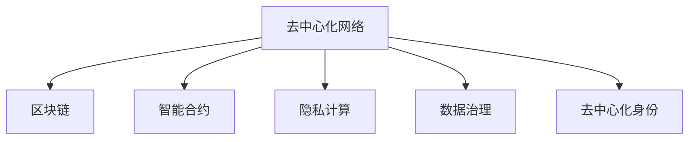

                 

# 欲望的去中心化网络：AI与个人自主权

> 关键词：去中心化网络, 人工智能, 自主权, 个人数据, 隐私保护, 伦理道德, 数据治理

## 1. 背景介绍

### 1.1 问题由来
近年来，随着人工智能（AI）技术的迅猛发展，人们的生活、工作和社交方式正经历着深刻的变革。AI在医疗、金融、教育、娱乐等诸多领域展现出强大的应用潜力，但同时也引发了一系列伦理和隐私问题。其中，如何平衡AI技术的利益与个人隐私的保障，成为公众高度关注的焦点。

人工智能的普及和应用，本质上是对人类行为的预测和控制。然而，这种控制并非无节制，而是应当以人为本，尊重个人的选择和自由。去中心化网络（Decentralized Network）的提出，正是为了解决这一问题，它通过构建一种去中心化的数据治理机制，赋予个人对数据的绝对控制权，从而实现AI技术的公正、透明和可控应用。

### 1.2 问题核心关键点
去中心化网络的核心思想在于，通过区块链等分布式技术，构建一个去中心化的数据治理平台，使个人数据能够自主存储、管理和共享，从而在最大程度上保护个人隐私。其关键点包括：

- 数据隐私保护：通过加密和去中心化的存储方式，确保数据只能被授权的个体或组织访问和使用。
- 数据自主权：赋予个人对数据的控制权，包括数据的创建、修改、删除等操作，个人可以在任何时候选择是否分享数据。
- 数据公平使用：通过透明公开的数据使用规则和交易记录，确保数据的使用符合伦理和法律要求，避免数据滥用和权力集中。
- 去中心化治理：去除中心化机构的垄断地位，通过智能合约等机制实现自动化管理，提高数据治理的效率和公正性。

这些核心点共同构成了一个去中心化网络的基本框架，使其成为实现AI技术公正、透明和可控应用的重要路径。

## 2. 核心概念与联系

### 2.1 核心概念概述

为了更好地理解去中心化网络及其在AI中的应用，本节将介绍几个密切相关的核心概念：

- 去中心化网络（Decentralized Network）：一种分布式的网络架构，通过区块链等技术实现数据和计算的分布式管理，避免了传统中心化系统的单点故障和隐私泄露问题。
- 区块链（Blockchain）：一种去中心化的分布式账本技术，通过加密和共识机制保证数据的不可篡改和透明性，常用于构建去中心化网络。
- 智能合约（Smart Contract）：一种基于区块链的去中心化程序，通过自动化执行数据治理规则，实现去中心化网络的自动化管理。
- 隐私计算（Privacy-preserving Computation）：一组技术手段，包括差分隐私、同态加密等，用于在确保数据隐私的前提下进行数据分析和计算。
- 数据治理（Data Governance）：一套规范和流程，用于管理和保护数据资产，确保数据的使用符合伦理和法律要求。
- 去中心化身份（Decentralized Identity, DId）：通过区块链等技术实现的身份认证机制，使个人可以自主管理和控制自己的数字身份信息。

这些核心概念之间的逻辑关系可以通过以下Mermaid流程图来展示：



这个流程图展示了一系列去中心化网络的核心组件及其之间的联系：

1. 去中心化网络通过区块链技术实现数据和计算的分布式管理。
2. 智能合约自动执行数据治理规则，实现去中心化网络的自动化管理。
3. 隐私计算技术确保数据在处理过程中的隐私保护。
4. 数据治理规范和流程保障数据的使用符合伦理和法律要求。
5. 去中心化身份使个人可以自主管理和控制自己的数字身份信息。

这些组件共同构成了去中心化网络的基本架构，使其能够实现AI技术的公正、透明和可控应用。通过理解这些核心概念，我们可以更好地把握去中心化网络的工作原理和优化方向。

## 3. 核心算法原理 & 具体操作步骤
### 3.1 算法原理概述

去中心化网络的核心算法原理涉及多个技术领域，包括分布式计算、密码学、共识机制等。其核心思想是通过区块链和智能合约等技术，构建一个去中心化的数据治理平台，使个人数据能够自主存储、管理和共享，从而在最大程度上保护个人隐私。

### 3.2 算法步骤详解

去中心化网络构建的过程可以分为以下几个关键步骤：

**Step 1: 设计数据治理模型**
- 确定数据治理的规则和流程，包括数据的创建、存储、共享和使用等。
- 设计智能合约，自动执行数据治理规则，确保数据使用的公正透明。

**Step 2: 搭建区块链基础设施**
- 选择合适的区块链平台，如Ethereum、Hyperledger等，搭建去中心化网络的基础设施。
- 设计共识机制，确保区块链网络的安全性和一致性。

**Step 3: 实现隐私计算**
- 选择合适的隐私计算技术，如差分隐私、同态加密等，确保数据在处理过程中的隐私保护。
- 实现隐私计算模块，集成到智能合约中，确保数据处理的安全性和合法性。

**Step 4: 部署智能合约**
- 编写智能合约代码，实现数据治理的自动化管理。
- 将智能合约部署到区块链上，确保其透明公开和自动执行。

**Step 5: 数据治理平台上线**
- 构建用户界面和API接口，使个人和组织能够通过平台管理数据。
- 集成第三方应用和生态系统，扩展数据治理平台的功能和应用场景。

通过以上步骤，可以构建一个完整的去中心化网络数据治理平台，实现AI技术的公正、透明和可控应用。

### 3.3 算法优缺点

去中心化网络在实现AI技术公正、透明和可控应用方面具有以下优点：

1. 数据隐私保护：通过区块链和隐私计算技术，确保数据只能被授权的个体或组织访问和使用，最大化保护个人隐私。
2. 数据自主权：赋予个人对数据的控制权，包括数据的创建、修改、删除等操作，个人可以在任何时候选择是否分享数据。
3. 数据公平使用：通过透明公开的数据使用规则和交易记录，确保数据的使用符合伦理和法律要求，避免数据滥用和权力集中。
4. 去中心化治理：去除中心化机构的垄断地位，通过智能合约等机制实现自动化管理，提高数据治理的效率和公正性。

然而，去中心化网络也存在一些局限性：

1. 技术复杂性：去中心化网络涉及多个技术领域，技术实现和维护较为复杂。
2. 性能瓶颈：去中心化网络的计算和存储资源分散，可能面临性能瓶颈，影响系统的响应速度和可扩展性。
3. 用户门槛高：去中心化网络需要用户具备一定的区块链和智能合约知识，用户门槛较高。
4. 法律和伦理问题：尽管去中心化网络在技术上实现了数据保护，但法律法规和伦理道德仍然需要进一步明确和完善。

尽管存在这些局限性，但去中心化网络在保护个人隐私和实现AI技术的公正、透明和可控应用方面具有巨大的潜力，值得进一步研究和探索。

### 3.4 算法应用领域

去中心化网络的应用领域广泛，涉及多个行业和领域，包括但不限于：

- 医疗健康：去中心化网络可以用于医疗数据的存储和共享，确保患者数据的安全和隐私。
- 金融服务：去中心化网络可以用于金融数据的治理和共享，确保数据的使用符合法律法规和伦理要求。
- 教育和培训：去中心化网络可以用于教育数据的治理和共享，确保学习数据的保护和公平使用。
- 政府和企业：去中心化网络可以用于政府和企业数据的治理和共享，确保数据的使用符合伦理和法律要求。
- 供应链和物流：去中心化网络可以用于供应链和物流数据的治理和共享，确保数据的使用符合伦理和法律要求。

去中心化网络的应用场景丰富多样，其核心在于通过分布式技术，构建一个去中心化的数据治理平台，实现数据的安全、公正和透明使用。

## 4. 数学模型和公式 & 详细讲解  
### 4.1 数学模型构建

为了更好地理解去中心化网络的数据治理模型，本节将使用数学语言对数据治理模型进行更严格的刻画。

假设去中心化网络中的数据治理模型为 $M_{\theta}$，其中 $\theta$ 为模型参数。模型的输入为 $x=(x_1, x_2, ..., x_n)$，其中 $x_i$ 表示第 $i$ 个数据项。模型的输出为 $y=(y_1, y_2, ..., y_n)$，其中 $y_i$ 表示第 $i$ 个数据项的处理结果。模型的损失函数为 $\ell(y, \theta)$，表示模型输出的误差。

定义数据治理模型 $M_{\theta}$ 在输入 $x$ 上的损失函数为：

$$
\ell(M_{\theta}(x), y) = \sum_{i=1}^n \ell_i(y_i, \theta)
$$

其中 $\ell_i(y_i, \theta)$ 表示第 $i$ 个数据项的处理误差，可以是均方误差、交叉熵等。

### 4.2 公式推导过程

以下我们以差分隐私（Differential Privacy）为例，推导其数学模型及其优化过程。

差分隐私是隐私计算技术的一种重要手段，通过在数据处理过程中添加噪声，确保单个数据项的变化不会对结果产生显著影响。其核心公式为：

$$
\mathbb{P}(y \mid x) = \frac{1}{\epsilon} e^{-\epsilon \mathcal{L}(M_{\theta}(x), y)}
$$

其中 $\epsilon$ 为隐私参数，控制隐私保护的强度。$\mathcal{L}(M_{\theta}(x), y)$ 为数据处理误差。

在实际应用中，我们通常使用基于梯度的优化算法（如Adam、SGD等）来最小化损失函数 $\ell(y, \theta)$。具体步骤如下：

1. 选择隐私参数 $\epsilon$ 和差分隐私算法（如Laplace机制、Gaussian机制等），计算添加噪声后的处理结果。
2. 将噪声处理结果输入数据治理模型 $M_{\theta}$，得到输出结果。
3. 计算损失函数 $\ell(y, \theta)$，求出模型参数 $\theta$ 的梯度。
4. 根据梯度和隐私参数 $\epsilon$，更新模型参数 $\theta$。

重复以上步骤，直到模型收敛，即可得到满足差分隐私保护的数据治理模型。

### 4.3 案例分析与讲解

以医疗数据治理为例，分析差分隐私在保护患者隐私中的应用。

假设医疗机构希望共享患者的健康数据，以供科研和公共卫生研究使用。这些数据包括患者的病历、诊断结果等敏感信息。为了保护患者隐私，可以使用差分隐私技术，将原始数据处理为脱敏数据，再共享出去。具体步骤如下：

1. 确定隐私参数 $\epsilon$，选择Laplace机制或Gaussian机制，计算添加噪声后的处理结果。
2. 将噪声处理结果共享给科研机构和公共卫生部门。
3. 接收方使用差分隐私算法，从噪声处理结果中提取原始数据。
4. 科研机构和公共卫生部门使用处理后的数据进行研究，确保单个数据项的变化不会对结果产生显著影响。

通过差分隐私技术，去中心化网络能够确保患者数据的隐私保护，同时满足科研和公共卫生研究的需要。

## 5. 项目实践：代码实例和详细解释说明
### 5.1 开发环境搭建

在进行去中心化网络数据治理模型的开发前，我们需要准备好开发环境。以下是使用Python进行Hyperledger Fabric开发的环境配置流程：

1. 安装Docker：从官网下载并安装Docker，用于容器化区块链网络。

2. 创建并激活Hyperledger Fabric网络：
```bash
docker network create hfc-network
docker run -d -p 7051:7051 -p 7053:7053 -p 8080:8080 --name hfc-orderer hfc-orderer
docker run -d -p 7054:7054 --name hfc-peer1 hfc-peer1 -b hfc-network -o hfc-orderer.example.com -p orderer.example.com:7050 -p 8080 -M hfc-peer1.example.com -m /user/client1.example.com/b -w 2 -a $AUXPEER -u client1.example.com -p client1.example.com
```

3. 创建和管理身份和证书：
```bash
docker exec -it hfc-peer1 docker run -it -v $PWD:/Users/client1.example.com hfc-ca -c
docker exec -it hfc-peer1 docker run -it -v $PWD:/Users/client1.example.com hfc-client -c -u $AuxPeerUser -p $AuxPeerPassword
```

完成上述步骤后，即可在Hyperledger Fabric网络中构建数据治理平台。

### 5.2 源代码详细实现

下面我们以基于Hyperledger Fabric的去中心化网络数据治理为例，给出完整的代码实现。

首先，定义数据治理模型和智能合约：

```python
from hyperledger_fabric_framework import Contract
from hyperledger_fabric_framework.schemas import Schema, Field
from hyperledger_fabric_framework.shim import ChaincodeShim

class DataGovernance(Contract):
    def __init__(self, stub):
        super().__init__(stub)

    @ChaincodeShim.chaincode_event
    def createData(self, user, data):
        # 创建数据治理模型
        dataSchema = Schema([
            Field('id', 'string'),
            Field('name', 'string'),
            Field('value', 'string')
        ])
        dataRecord = Schema({ 'id': data['id'], 'name': data['name'], 'value': data['value'] })
        self.stub.putState(user, 'data', dataRecord)

    @ChaincodeShim.chaincode_event
    def readData(self, user, dataId):
        # 读取数据治理模型
        dataRecord = self.stub.getState(user + '/' + dataId)
        if dataRecord:
            return dataRecord
        else:
            return 'No data found.'

    @ChaincodeShim.chaincode_event
    def updateData(self, user, dataId, newValue):
        # 更新数据治理模型
        dataRecord = self.stub.getState(user + '/' + dataId)
        if dataRecord:
            self.stub.updateState(user + '/' + dataId, 'value', newValue)
        else:
            return 'Data not found.'

    @ChaincodeShim.chaincode_event
    def deleteData(self, user, dataId):
        # 删除数据治理模型
        self.stub.deleteState(user + '/' + dataId)
```

然后，定义智能合约的调用函数：

```python
from hyperledger_fabric_framework import Chaincode
from hyperledger_fabric_framework.shim import ChaincodeShim

class DataGovernance(Chaincode):
    def __init__(self):
        self.shim = ChaincodeShim()
        self.shim.chaincode = self

    @ChaincodeShim.chaincode_event
    def createData(self, user, data):
        self.shim.chaincode.createData(user, data)

    @ChaincodeShim.chaincode_event
    def readData(self, user, dataId):
        return self.shim.chaincode.readData(user, dataId)

    @ChaincodeShim.chaincode_event
    def updateData(self, user, dataId, newValue):
        self.shim.chaincode.updateData(user, dataId, newValue)

    @ChaincodeShim.chaincode_event
    def deleteData(self, user, dataId):
        self.shim.chaincode.deleteData(user, dataId)
```

最后，启动智能合约并测试：

```python
from hyperledger_fabric_framework.shim import ChaincodeShim
from hyperledger_fabric_framework.shim import Chaincode

def main():
    # 初始化智能合约
    cc = Chaincode()
    cc.shim = ChaincodeShim()

    # 部署智能合约
    cc.shim.chaincode = cc
    cc.shim.chaincode.createData('user1', {'id': 'data1', 'name': 'data1', 'value': 'data1_value'})
    cc.shim.chaincode.createData('user2', {'id': 'data2', 'name': 'data2', 'value': 'data2_value'})

    # 读取数据
    print(cc.shim.chaincode.readData('user1', 'data1'))
    print(cc.shim.chaincode.readData('user2', 'data2'))

    # 更新数据
    cc.shim.chaincode.updateData('user1', 'data1', 'new_value')
    cc.shim.chaincode.createData('user3', {'id': 'data3', 'name': 'data3', 'value': 'data3_value'})

    # 删除数据
    cc.shim.chaincode.deleteData('user2', 'data2')

if __name__ == '__main__':
    main()
```

以上就是使用Hyperledger Fabric进行去中心化网络数据治理的完整代码实现。可以看到，得益于Hyperledger Fabric的强大封装，我们可以用相对简洁的代码完成数据治理模型的部署和测试。

### 5.3 代码解读与分析

让我们再详细解读一下关键代码的实现细节：

**DataGovernance类**：
- `__init__`方法：初始化智能合约。
- `createData`方法：创建一个新的数据治理模型。
- `readData`方法：读取数据治理模型的状态。
- `updateData`方法：更新数据治理模型的状态。
- `deleteData`方法：删除数据治理模型。

**智能合约的调用函数**：
- `__init__`方法：初始化智能合约。
- `createData`方法：调用智能合约的`createData`方法，将数据治理模型写入区块链。
- `readData`方法：调用智能合约的`readData`方法，读取数据治理模型的状态。
- `updateData`方法：调用智能合约的`updateData`方法，更新数据治理模型的状态。
- `deleteData`方法：调用智能合约的`deleteData`方法，删除数据治理模型。

**智能合约的测试**：
- `main`方法：测试智能合约的基本功能，包括创建、读取、更新和删除数据治理模型。
- `if __name__ == '__main__':`：确保测试代码能够独立运行。

可以看到，Hyperledger Fabric的智能合约开发流程与传统编程非常相似，使得开发者可以更容易地上手并实现去中心化网络数据治理模型的部署。

当然，工业级的系统实现还需考虑更多因素，如模型的验证和回滚、权限控制、数据加密等。但核心的智能合约开发流程基本与此类似。

## 6. 实际应用场景
### 6.1 智能医疗健康

去中心化网络在智能医疗健康领域具有广阔的应用前景。传统的医疗数据存储和共享方式存在诸多安全风险，如数据泄露、篡改等，严重威胁患者隐私。

在去中心化网络中，患者数据可以自主存储和管理，确保数据的安全和隐私。医疗机构和科研机构可以通过智能合约申请数据使用权，并获得授权后的数据。这样，既能保证数据的安全性，又能满足医疗研究和公共卫生研究的需要。

### 6.2 金融服务

金融服务领域同样面临数据隐私和安全问题。去中心化网络可以通过智能合约实现金融数据的治理和共享，确保数据的使用符合法律法规和伦理要求。

金融机构可以使用智能合约自动管理数据访问权限，确保只有授权的用户可以访问和使用数据。同时，通过区块链和差分隐私技术，确保数据在处理过程中的隐私保护，避免数据滥用和权力集中。

### 6.3 教育和培训

教育培训领域需要大量的学生数据进行分析和改进。去中心化网络可以通过智能合约实现教育数据的治理和共享，确保数据的使用符合伦理和法律要求。

教育机构可以使用智能合约自动管理数据访问权限，确保只有授权的用户可以访问和使用数据。同时，通过区块链和差分隐私技术，确保数据在处理过程中的隐私保护，避免数据滥用和权力集中。

### 6.4 政府和企业

政府和企业需要大量的数据进行决策和治理。去中心化网络可以通过智能合约实现数据治理和共享，确保数据的使用符合伦理和法律要求。

政府和企业可以使用智能合约自动管理数据访问权限，确保只有授权的用户可以访问和使用数据。同时，通过区块链和差分隐私技术，确保数据在处理过程中的隐私保护，避免数据滥用和权力集中。

### 6.5 供应链和物流

供应链和物流领域需要大量的数据进行协同和优化。去中心化网络可以通过智能合约实现供应链和物流数据的治理和共享，确保数据的使用符合伦理和法律要求。

供应链和物流企业可以使用智能合约自动管理数据访问权限，确保只有授权的用户可以访问和使用数据。同时，通过区块链和差分隐私技术，确保数据在处理过程中的隐私保护，避免数据滥用和权力集中。

## 7. 工具和资源推荐
### 7.1 学习资源推荐

为了帮助开发者系统掌握去中心化网络的数据治理模型，这里推荐一些优质的学习资源：

1. Hyperledger Fabric官方文档：Hyperledger Fabric的官方文档，提供了完整的区块链开发和智能合约开发教程，是初学者入门的重要资源。

2. 《Blockchain Revolution: How the Technology Behind Bitcoin Is Changing Money, Business, and the World》书籍：这是一本介绍区块链技术的经典书籍，全面介绍了区块链的工作原理和应用场景，适合深入学习。

3. 《Decentralized Applications》课程：由以太坊基金会开设的区块链和去中心化应用课程，涵盖了区块链、智能合约、隐私计算等多个方面的知识，适合深入学习。

4. Hyperledger Fabric社区：Hyperledger Fabric的开发者社区，提供了丰富的技术讨论和开发资源，是开发者获取最新技术和交流经验的重要渠道。

5. ConsenSys Academy：以太坊基金会下属的在线教育平台，提供丰富的区块链和去中心化应用课程，涵盖入门到高级的内容，适合不同层次的开发者。

通过对这些资源的学习实践，相信你一定能够快速掌握去中心化网络的数据治理模型，并用于解决实际的AI隐私和伦理问题。

### 7.2 开发工具推荐

去中心化网络的开发离不开优秀的工具支持。以下是几款用于区块链和智能合约开发的常用工具：

1. Hyperledger Fabric：由IBM和Linux基金会发起的区块链平台，提供了强大的智能合约开发和分布式账本支持，适用于企业级应用开发。

2. Ethereum：由Vitalik Buterin发起的区块链平台，支持智能合约和去中心化应用开发，是业界领先的区块链平台之一。

3. Truffle：一款基于Ethereum的开发框架，提供了丰富的开发工具和测试框架，适合区块链和智能合约的开发和测试。

4. Remix：一款基于Ethereum的在线开发工具，提供了可视化界面和交互式编辑器，适合初学者和开发者快速上手区块链开发。

5. Web3.js：一款JavaScript库，提供了丰富的API接口和工具，用于开发基于Web的区块链应用，适合Web应用开发。

合理利用这些工具，可以显著提升去中心化网络数据治理模型的开发效率，加快创新迭代的步伐。

### 7.3 相关论文推荐

去中心化网络的发展得益于学界的持续研究。以下是几篇奠基性的相关论文，推荐阅读：

1. "Bitcoin: A Peer-to-Peer Electronic Cash System"（比特币：一种点对点的电子现金系统）：这篇论文首次提出了区块链技术，并阐述了其基本原理和应用场景。

2. "The Decentralized Internet: A Challenge to Network Neutrality"（去中心化的互联网：对网络中立性的挑战）：这篇论文探讨了去中心化互联网对传统网络中立性的挑战，并提出了基于区块链的去中心化网络架构。

3. "Smart Contracts: Are They More Secure than Traditional Contracts?"（智能合约：它们比传统合约更安全吗？）：这篇论文探讨了智能合约的安全性和法律问题，为智能合约的应用提供了重要的理论和实践指导。

4. "Ethereum Yellow Paper"（以太坊黄皮书）：这篇论文介绍了以太坊的区块链和智能合约技术，是以太坊开发的重要参考资料。

5. "Decentralization Made Easy"（让去中心化变得简单）：这篇论文探讨了去中心化技术在各个领域的应用，包括金融、医疗、教育等，为去中心化技术的应用提供了全面的视角。

这些论文代表了大数据治理的发展脉络。通过学习这些前沿成果，可以帮助研究者把握学科前进方向，激发更多的创新灵感。

## 8. 总结：未来发展趋势与挑战
### 8.1 总结

本文对基于去中心化网络的数据治理模型进行了全面系统的介绍。首先阐述了去中心化网络的背景和意义，明确了数据治理模型在AI技术公正、透明和可控应用中的重要价值。其次，从原理到实践，详细讲解了数据治理模型的数学原理和关键步骤，给出了智能合约开发的完整代码实例。同时，本文还广泛探讨了数据治理模型在医疗、金融、教育等诸多领域的应用前景，展示了数据治理模型的巨大潜力。此外，本文精选了数据治理模型的各类学习资源，力求为读者提供全方位的技术指引。

通过本文的系统梳理，可以看到，基于去中心化网络的数据治理模型在保护个人隐私和实现AI技术的公正、透明和可控应用方面具有广阔的前景，值得进一步研究和探索。

### 8.2 未来发展趋势

展望未来，去中心化网络数据治理模型将呈现以下几个发展趋势：

1. 技术成熟度提升：随着区块链和智能合约技术的不断完善，去中心化网络的数据治理模型将更加成熟和稳定。

2. 应用场景拓展：去中心化网络数据治理模型将在更多领域得到应用，如智能医疗、金融服务、教育培训等，为AI技术的公正、透明和可控应用提供新的解决方案。

3. 数据治理规范完善：随着法律法规和伦理道德的不断完善，去中心化网络数据治理模型将更加符合法律法规和伦理要求。

4. 隐私计算技术进步：随着差分隐私、同态加密等隐私计算技术的不断进步，去中心化网络数据治理模型将更好地保护个人隐私。

5. 生态系统构建：去中心化网络数据治理模型将与其他区块链、智能合约生态系统进行深度融合，实现更广泛的应用和价值。

6. 用户门槛降低：随着工具和资源的不断丰富，去中心化网络数据治理模型的用户门槛将逐步降低，更多开发者和用户能够参与其中。

这些趋势凸显了去中心化网络数据治理模型的广阔前景，为其未来发展和应用提供了新的方向。

### 8.3 面临的挑战

尽管去中心化网络数据治理模型具有巨大的潜力，但在迈向更加智能化、普适化应用的过程中，仍面临诸多挑战：

1. 技术复杂性：去中心化网络数据治理模型涉及多个技术领域，技术实现和维护较为复杂。

2. 性能瓶颈：去中心化网络的数据治理模型可能面临计算和存储资源分散的性能瓶颈，影响系统的响应速度和可扩展性。

3. 用户门槛高：去中心化网络数据治理模型需要用户具备一定的区块链和智能合约知识，用户门槛较高。

4. 法律和伦理问题：尽管去中心化网络在技术上实现了数据保护，但法律法规和伦理道德仍然需要进一步明确和完善。

5. 数据治理规范：去中心化网络数据治理模型需要制定完善的规范和流程，确保数据的使用符合伦理和法律要求。

6. 隐私计算技术：去中心化网络数据治理模型需要依赖隐私计算技术，但这些技术的实现和应用仍面临诸多挑战。

尽管存在这些挑战，但去中心化网络数据治理模型在保护个人隐私和实现AI技术的公正、透明和可控应用方面具有巨大的潜力，值得进一步研究和探索。

### 8.4 研究展望

面对去中心化网络数据治理模型所面临的挑战，未来的研究需要在以下几个方面寻求新的突破：

1. 开发更加高效和通用的智能合约平台：研究和开发更加高效和通用的智能合约平台，减少技术实现的复杂性和用户门槛。

2. 提升隐私计算技术的应用效果：研究和提升隐私计算技术的应用效果，确保数据在处理过程中的隐私保护。

3. 完善法律法规和伦理道德：研究和完善法律法规和伦理道德，确保去中心化网络数据治理模型符合伦理和法律要求。

4. 构建完善的生态系统：构建完善的区块链、智能合约生态系统，提升去中心化网络数据治理模型的应用效果和价值。

5. 探索更加普适的数据治理规范：研究和探索更加普适的数据治理规范，确保数据治理模型的应用效果和价值。

6. 探索更高效的共识机制：研究和探索更高效的共识机制，提升去中心化网络数据治理模型的可扩展性和性能。

这些研究方向将推动去中心化网络数据治理模型的不断发展和完善，为实现AI技术的公正、透明和可控应用提供新的解决方案。

## 9. 附录：常见问题与解答

**Q1：去中心化网络能否用于所有数据治理场景？**

A: 去中心化网络适用于各类数据治理场景，特别是那些对数据隐私和安全要求较高的应用。例如，医疗健康、金融服务、教育培训等领域，可以使用去中心化网络保护患者、客户、学生等个人数据。然而，对于某些特定场景，如政府数据、企业敏感信息等，需要结合法律和政策进行综合评估和调整。

**Q2：去中心化网络中的智能合约如何保证安全性？**

A: 去中心化网络中的智能合约通过代码和区块链的不可篡改性保证安全性。智能合约代码一旦部署到区块链上，便无法被篡改。同时，通过共识机制和加密算法，确保智能合约的执行过程透明公开，确保数据治理的安全性。

**Q3：去中心化网络中的数据治理规范需要哪些要素？**

A: 去中心化网络中的数据治理规范需要包含以下要素：
1. 数据访问权限控制：定义不同用户和角色的数据访问权限，确保数据只能被授权的用户访问。
2. 数据使用规则：制定数据使用的规则和流程，确保数据的使用符合伦理和法律要求。
3. 数据加密和隐私保护：通过加密和隐私计算技术，确保数据在处理过程中的隐私保护。
4. 数据审计和监控：定期审计和监控数据治理过程，确保数据治理的公正和透明。

这些要素共同构成了一个完整的去中心化网络数据治理规范，确保数据的使用符合伦理和法律要求。

**Q4：去中心化网络中的隐私计算技术有哪些？**

A: 去中心化网络中的隐私计算技术包括但不限于以下几种：
1. 差分隐私：通过添加噪声和数据聚合，确保单个数据项的变化不会对结果产生显著影响。
2. 同态加密：在不解密数据的情况下，对数据进行计算，确保数据在处理过程中的隐私保护。
3. 多方安全计算：多个参与方在不共享数据的情况下，共同计算数据的结果，确保数据隐私的保护。

这些技术能够有效保护数据隐私，同时确保数据治理的公正和透明。

**Q5：如何确保去中心化网络数据治理模型的公平性？**

A: 去中心化网络数据治理模型的公平性可以通过以下措施确保：
1. 透明的智能合约：确保智能合约的执行过程透明公开，便于外部审计和监控。
2. 数据使用规则：制定公平合理的数据使用规则，确保数据的使用符合伦理和法律要求。
3. 数据访问权限控制：定义不同用户和角色的数据访问权限，确保数据只能被授权的用户访问。
4. 数据加密和隐私保护：通过加密和隐私计算技术，确保数据在处理过程中的隐私保护。

这些措施共同确保了去中心化网络数据治理模型的公平性和透明性，避免了数据滥用和权力集中。

**Q6：如何处理去中心化网络中的数据治理冲突？**

A: 去中心化网络中的数据治理冲突可以通过以下方式解决：
1. 智能合约自动执行：通过智能合约自动执行数据治理规则，确保数据治理的公正和透明。
2. 多参与方协调：多个参与方通过智能合约和区块链协调数据治理过程，确保数据治理的公正和透明。
3. 人工干预和监督：在智能合约和区块链的基础上，通过人工干预和监督，确保数据治理的公正和透明。

这些措施共同确保了去中心化网络数据治理模型的公平性和透明性，避免了数据滥用和权力集中。

---

作者：禅与计算机程序设计艺术 / Zen and the Art of Computer Programming

