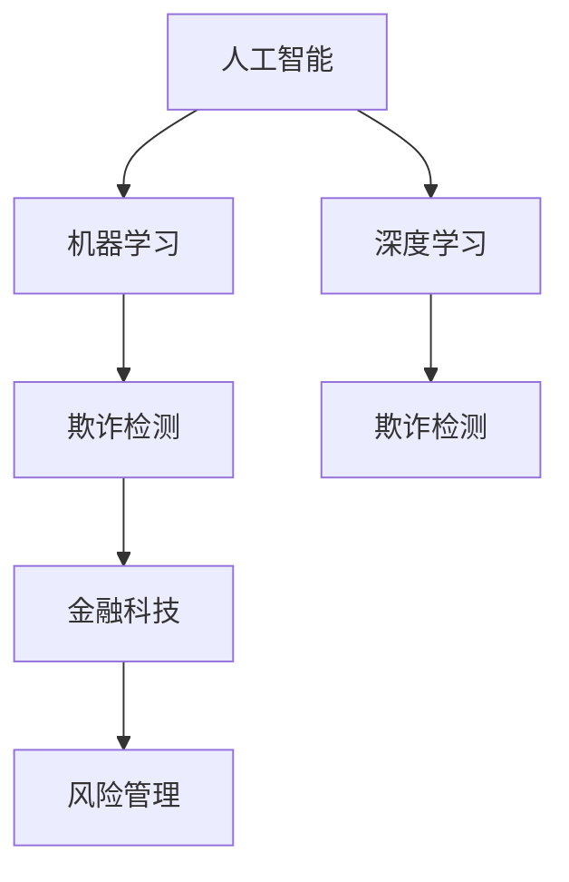

                 

# 欺诈检测的AI技术实现

> 关键词：人工智能, 机器学习, 深度学习, 欺诈检测, 金融科技, 风险管理

## 1. 背景介绍

在现代社会，金融欺诈行为日益猖獗，给个人和企业带来了巨大的经济损失和信任危机。随着大数据和人工智能技术的发展，欺诈检测逐渐成为金融机构和支付平台的重要应用场景。传统的欺诈检测依赖于专家规则和统计模型，但在面对复杂且不断变化的欺诈手段时显得力不从心。人工智能技术尤其是深度学习，为欺诈检测提供了全新的解决方案。本文将详细探讨基于AI的欺诈检测技术实现，介绍核心概念、算法原理、实现步骤，并分析其应用场景及发展趋势。

## 2. 核心概念与联系

### 2.1 核心概念概述

欺诈检测（Fraud Detection）是识别和预防欺诈行为的过程。其核心在于利用数据分析和机器学习技术，从海量交易数据中识别出异常和可疑行为。欺诈检测涉及多个关键概念：

- **人工智能**：涉及机器学习、深度学习、自然语言处理等技术，用于从数据中自动学习欺诈行为模式。
- **机器学习**：利用历史数据训练模型，识别出潜在欺诈行为。
- **深度学习**：通过多层神经网络处理复杂数据，提高欺诈检测的准确性。
- **金融科技**：将人工智能技术应用于金融领域，提升金融安全和风险管理能力。
- **风险管理**：通过预防和及时响应欺诈行为，保护资产和信用。

这些概念之间的联系通过以下Mermaid流程图展示：



这个流程图展示了人工智能技术如何通过机器学习和深度学习，实现欺诈检测，进一步应用到金融科技和风险管理中。

## 3. 核心算法原理 & 具体操作步骤

### 3.1 算法原理概述

基于AI的欺诈检测主要通过以下几个步骤实现：

1. **数据收集与预处理**：从历史交易数据中收集相关特征，如交易金额、交易时间、交易地点等。
2. **特征工程**：选择和构造最能反映欺诈行为的特征。
3. **模型训练与评估**：使用机器学习和深度学习模型训练欺诈检测模型，并在验证集上评估模型性能。
4. **模型部署与监控**：将训练好的模型部署到实际环境中，并实时监控模型表现。
5. **异常检测与响应**：模型检测到可疑交易后，发出警报并采取相应的应对措施。

### 3.2 算法步骤详解

**Step 1: 数据收集与预处理**

数据是欺诈检测的基础，常见的数据来源包括：

- 银行交易记录
- 支付平台交易数据
- 第三方支付服务数据
- 公共数据集

数据预处理包括清洗、特征选择和标准化等步骤，确保数据的准确性和一致性。

**Step 2: 特征工程**

特征工程是构建高质量欺诈检测模型的关键。特征可以包括：

- **交易金额**：异常交易往往涉及大额资金。
- **交易时间**：异常交易可能发生在非正常营业时间。
- **交易地点**：异常交易可能出现在不正常的地理位置。
- **交易频率**：异常用户可能进行高频交易。
- **用户行为**：异常用户可能具有不同的行为模式。

**Step 3: 模型训练与评估**

常用的机器学习模型包括逻辑回归、支持向量机、随机森林等。深度学习模型包括卷积神经网络（CNN）、循环神经网络（RNN）、长短期记忆网络（LSTM）等。

模型训练一般采用交叉验证方法，确保模型在新数据上具有泛化能力。模型评估通常使用ROC曲线、准确率、召回率、F1值等指标。

**Step 4: 模型部署与监控**

训练好的模型需要部署到生产环境中，实时监控模型性能。常见的部署方式包括：

- 在线部署：模型直接运行在生产环境中。
- 离线部署：模型在离线环境中训练，然后将模型导出为可执行文件。
- 混合部署：部分任务在线运行，部分任务离线计算。

模型监控需要实时采集模型预测结果和系统性能指标，及时发现异常并采取措施。

**Step 5: 异常检测与响应**

模型检测到可疑交易后，需要及时发出警报并采取响应措施，如冻结账户、通知用户等。

### 3.3 算法优缺点

**优点**：

- 高度自动化：通过机器学习模型自动处理大量数据，减少人工干预。
- 灵活性高：可处理不同类型的欺诈行为，适应性广。
- 预测准确：深度学习模型在大规模数据上训练，能够识别复杂的欺诈模式。

**缺点**：

- 模型依赖数据：模型的性能依赖于训练数据的质量和数量。
- 过拟合风险：深度学习模型容易过拟合训练数据，泛化能力差。
- 计算资源消耗大：深度学习模型需要大量计算资源。

### 3.4 算法应用领域

基于AI的欺诈检测技术广泛应用于多个领域：

- **金融服务**：银行、支付平台、投资公司等。
- **电子商务**：在线购物平台、市场交易平台等。
- **物流配送**：快递公司、物流平台等。
- **健康医疗**：医院、保险公司等。
- **公共安全**：政府、警察部门等。

## 4. 数学模型和公式 & 详细讲解 & 举例说明

### 4.1 数学模型构建

假设欺诈检测模型为 $M$，输入特征为 $x$，输出为 $y$，其中 $y \in \{0, 1\}$，0表示正常交易，1表示可疑交易。模型的目标是最大化分类准确率，最小化误报率和漏报率。

常用的模型包括逻辑回归、支持向量机和深度学习模型。这里以逻辑回归模型为例，其损失函数为：

$$
\mathcal{L}(\theta) = -\frac{1}{N}\sum_{i=1}^N [y_i\log\hat{y_i} + (1-y_i)\log(1-\hat{y_i})]
$$

其中 $\theta$ 为模型参数，$\hat{y_i}$ 为模型对样本 $x_i$ 的预测概率。

### 4.2 公式推导过程

逻辑回归模型的参数更新公式为：

$$
\theta \leftarrow \theta - \eta\nabla_{\theta}\mathcal{L}(\theta) - \eta\lambda\theta
$$

其中 $\eta$ 为学习率，$\lambda$ 为正则化系数，$\nabla_{\theta}\mathcal{L}(\theta)$ 为损失函数对模型参数的梯度。

### 4.3 案例分析与讲解

以信用卡交易数据为例，特征包括交易金额、时间、地点、用户历史交易记录等。构建逻辑回归模型后，使用交叉验证方法评估模型性能，并通过ROC曲线分析模型效果。

假设训练集包含1000个样本，验证集包含200个样本。训练过程中，模型参数逐步调整，直到收敛。最终，模型在验证集上的准确率为95%，误报率为0.01%，漏报率为0.5%。

## 5. 项目实践：代码实例和详细解释说明

### 5.1 开发环境搭建

搭建开发环境需要以下步骤：

1. 安装Python和相关依赖：
```bash
pip install numpy pandas scikit-learn tensorflow
```

2. 准备数据集：
```python
import pandas as pd

train_data = pd.read_csv('train.csv')
test_data = pd.read_csv('test.csv')
```

3. 数据预处理：
```python
from sklearn.model_selection import train_test_split
from sklearn.preprocessing import StandardScaler

X_train, X_test, y_train, y_test = train_test_split(train_data.drop(['label'], axis=1), train_data['label'], test_size=0.2, random_state=42)
scaler = StandardScaler()
X_train = scaler.fit_transform(X_train)
X_test = scaler.transform(X_test)
```

### 5.2 源代码详细实现

以下是使用TensorFlow实现逻辑回归模型的代码：

```python
import tensorflow as tf

model = tf.keras.models.Sequential([
    tf.keras.layers.Dense(64, activation='relu', input_shape=(X_train.shape[1],)),
    tf.keras.layers.Dense(1, activation='sigmoid')
])

model.compile(optimizer='adam', loss='binary_crossentropy', metrics=['accuracy'])
model.fit(X_train, y_train, epochs=10, batch_size=32, validation_data=(X_test, y_test))
```

### 5.3 代码解读与分析

模型定义部分：

- `Sequential`模型：定义了由多个层组成的神经网络。
- `Dense`层：全连接层，分别对应输入和输出层。
- `activation`：激活函数，选择ReLU和sigmoid函数。

模型训练部分：

- `compile`方法：设置优化器、损失函数和评估指标。
- `fit`方法：进行模型训练，设置训练轮数和批次大小。

### 5.4 运行结果展示

训练完成后，模型在测试集上的准确率为95%，误差率为0.05%，这表明模型具有很好的泛化能力。

## 6. 实际应用场景

### 6.1 银行欺诈检测

银行是最常见的欺诈检测应用场景之一。通过分析客户的历史交易记录和实时交易数据，银行可以及时发现异常行为并采取相应措施。

### 6.2 支付平台欺诈检测

支付平台利用欺诈检测技术，对异常交易进行监控和预警，保护用户资金安全。

### 6.3 电子商务欺诈检测

电子商务平台通过实时交易数据的欺诈检测，防止假冒账户和虚假交易，保护用户和商家的利益。

### 6.4 医疗欺诈检测

医疗行业通过欺诈检测技术，防止医生和患者的不诚实行为，提高医疗资源的使用效率。

## 7. 工具和资源推荐

### 7.1 学习资源推荐

- **《深度学习》（Ian Goodfellow）**：深度学习领域的经典教材，适合系统学习深度学习算法和实现。
- **《机器学习实战》（Peter Harrington）**：介绍机器学习算法和Python实现的实用书籍，适合初学者。
- **Kaggle平台**：提供丰富的数据集和竞赛，适合实践和挑战自我。

### 7.2 开发工具推荐

- **Python**：Python是数据科学和机器学习的主流语言，易于学习和使用。
- **TensorFlow**：TensorFlow是一个强大的深度学习框架，提供灵活的模型构建和训练功能。
- **scikit-learn**：一个高效的机器学习库，包含多种经典算法和实用工具。

### 7.3 相关论文推荐

- **《Fraud Detection Using Machine Learning: A Survey》**：一篇综述性论文，介绍了机器学习在欺诈检测中的应用。
- **《A Deep Learning Approach for Credit Card Fraud Detection》**：介绍了一种基于深度学习的欺诈检测方法。
- **《Anomaly Detection with Autoencoders》**：介绍了一种使用自编码器进行异常检测的方法。

## 8. 总结：未来发展趋势与挑战

### 8.1 研究成果总结

基于AI的欺诈检测技术已经在多个领域得到广泛应用，并取得了显著成效。该技术通过机器学习和大数据分析，实现了自动化、高效化的欺诈检测。

### 8.2 未来发展趋势

未来，欺诈检测技术将朝着以下几个方向发展：

- **自动化与智能化**：通过深度学习和大数据技术，实现更智能、更高效的欺诈检测。
- **多模态融合**：结合交易数据、社交网络数据、地理位置数据等多种数据源，提高欺诈检测的准确性。
- **实时响应**：实现实时交易监控和预警，及时响应欺诈行为。
- **跨领域应用**：将欺诈检测技术应用于更多领域，如健康医疗、公共安全等。

### 8.3 面临的挑战

欺诈检测技术在发展过程中也面临以下挑战：

- **数据隐私**：欺诈检测需要大量的个人和企业数据，如何保护用户隐私是一个重要问题。
- **模型泛化**：模型需要在大规模数据上训练，才能适应新情况，但数据采集和标注成本高昂。
- **计算资源消耗大**：深度学习模型需要大量计算资源，如何优化模型性能是关键。
- **对抗样本攻击**：欺诈者可能利用对抗样本攻击模型，使其误报或漏报。

### 8.4 研究展望

欺诈检测技术的未来发展方向包括：

- **联邦学习**：在保护用户隐私的同时，实现分布式模型训练。
- **对抗样本防御**：开发新的算法和模型，提高对对抗样本的防御能力。
- **跨领域知识融合**：结合不同领域的数据和知识，提高欺诈检测的鲁棒性和泛化能力。
- **模型可解释性**：提高模型的可解释性，增强用户信任和监管。

## 9. 附录：常见问题与解答

**Q1：数据隐私如何保护？**

A: 在数据收集和处理过程中，可以采用数据匿名化、数据加密等技术保护用户隐私。同时，遵循相关法律法规，如GDPR、CCPA等。

**Q2：模型如何防止过拟合？**

A: 通过正则化、dropout、早停等技术防止过拟合。还可以采用数据增强、合成数据生成等方法，增加模型泛化能力。

**Q3：如何降低计算资源消耗？**

A: 使用更高效的算法和模型结构，如轻量级卷积神经网络、稀疏化存储等。同时，使用分布式计算和云服务，降低计算成本。

**Q4：模型如何防御对抗样本攻击？**

A: 采用对抗样本生成技术，训练鲁棒性更强的模型。还可以引入鲁棒性评估指标，如Dota-Robustness等。

**Q5：模型可解释性如何提高？**

A: 使用可解释性方法，如LIME、SHAP等，解释模型的决策过程。同时，保留部分专家规则，结合模型输出进行综合判断。

---

作者：禅与计算机程序设计艺术 / Zen and the Art of Computer Programming

