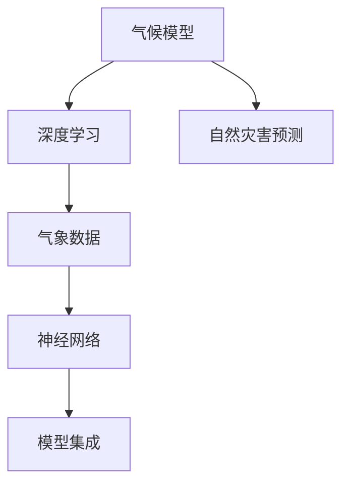

                 

# 气候模型预测中的AI应用：准确预报自然灾害

> 关键词：气候模型,自然灾害预测,深度学习,机器学习,气象数据,神经网络,模型集成,预警系统

## 1. 背景介绍

### 1.1 问题由来
近年来，全球气候变化带来了更加频繁和剧烈的自然灾害。气象数据量巨大、信息复杂，传统统计方法和手动分析难以满足高效、准确的需求。在应对台风、暴雨、洪水、干旱等极端天气事件时，快速准确预测显得尤为重要。

### 1.2 问题核心关键点
气象预测需要考虑各种物理机制和复杂数据，传统统计模型往往难以精确捕捉这些特征。利用深度学习模型对气象数据进行高质量处理，能够大幅提升气象预测的准确性。

目前，气象领域常用的深度学习模型有卷积神经网络(CNN)、循环神经网络(RNN)、变分自编码器(VAE)等。这些模型通过构建复杂的非线性映射，能够从气象数据中提取更为丰富的特征，从而提升气象预测的精度。

## 2. 核心概念与联系

### 2.1 核心概念概述

为更好地理解AI在气候模型预测中的应用，本节将介绍几个关键概念：

- 气候模型(Climatic Models)：模拟大气、海洋、陆地等气候系统的物理和化学过程，是气象预测的基础工具。
- 深度学习(Deep Learning)：一种人工神经网络结构，通过多层次的非线性变换，学习输入数据的复杂特征，广泛应用于图像、语音、自然语言等领域。
- 自然灾害预测(Natural Disaster Prediction)：利用气象数据和其他相关数据，预测自然灾害的发生、发展、影响。
- 气象数据(Meteorological Data)：反映大气环境变化的各种观测数据，包括温度、湿度、气压、风速等。
- 神经网络(Neural Networks)：由大量神经元组成的计算模型，能够学习输入数据的高维非线性关系。
- 模型集成(Model Ensemble)：通过构建多个模型并综合其预测结果，提高整体预测的准确性和稳定性。

这些核心概念之间的逻辑关系可以通过以下Mermaid流程图来展示：



这个流程图展示了一些关键概念及其之间的关系：

1. 气候模型通过深度学习获得高质量数据处理能力。
2. 深度学习模型用于处理气象数据，提取高维非线性特征。
3. 自然灾害预测利用深度学习模型的输出，实现精准预测。
4. 模型集成结合多个模型输出，提升预测的准确性和稳定性。

## 3. 核心算法原理 & 具体操作步骤
### 3.1 算法原理概述

AI在气候模型预测中的应用，主要基于深度学习模型，尤其是卷积神经网络(CNN)、循环神经网络(RNN)和变分自编码器(VAE)等模型。这些模型通过构建复杂的网络结构，能够捕捉到气象数据中高维非线性关系，从而实现高精度的自然灾害预测。

深度学习模型的基本原理是，通过多层次的非线性变换，对输入数据进行特征提取和模式学习，得到低维表示。然后，通过回归或分类等任务目标，将低维表示映射到输出空间，实现预测任务。

### 3.2 算法步骤详解

AI在气候模型预测中的应用步骤如下：

**Step 1: 数据预处理**

- 收集气象数据，包括气温、湿度、气压、风速、降水量、大气成分等。
- 数据清洗和归一化处理，去除异常值和噪声，使数据符合模型输入要求。
- 划分训练集、验证集和测试集，用于模型训练、调参和性能评估。

**Step 2: 模型构建与训练**

- 选择合适的深度学习模型，如CNN、RNN、VAE等，并构建模型架构。
- 定义损失函数和优化器，如均方误差(MSE)、交叉熵(Cross-Entropy)、AdamW等。
- 设定训练参数，如学习率、批大小、迭代次数等。
- 使用训练集数据训练模型，不断优化模型参数。

**Step 3: 模型评估与调整**

- 在验证集上评估模型性能，使用误差指标（如MAE, RMSE等）进行评估。
- 根据评估结果调整模型参数和训练策略。
- 重复训练和验证，直至模型性能达到预期。

**Step 4: 应用与验证**

- 使用测试集数据对模型进行最终验证，评估预测精度和泛化能力。
- 部署模型到实际气象预测系统，进行自然灾害预警。
- 根据实际应用效果，进行模型调优和迭代。

### 3.3 算法优缺点

AI在气候模型预测中的应用，具有以下优点：

1. 自动特征提取。深度学习模型能够自动学习输入数据的特征表示，无需人工干预，提高预测的准确性。
2. 高维非线性建模。通过构建复杂的网络结构，深度学习模型能够捕捉高维非线性关系，提升预测的精度和稳定性。
3. 实时预测。深度学习模型可以通过GPU加速，实现快速预测，适应实时应用的需求。
4. 数据驱动。AI模型依赖大量的历史数据进行训练，能够反映气象系统真实的物理和化学过程。

同时，该方法也存在一些局限：

1. 数据依赖性强。AI模型的训练和预测效果高度依赖数据的质量和数量，数据不足或分布不均时效果会大打折扣。
2. 模型复杂度高。深度学习模型通常参数众多，训练和推理过程复杂，需要大量计算资源。
3. 泛化能力不足。训练数据和测试数据分布差异较大时，模型的泛化能力可能下降。
4. 解释性差。深度学习模型作为"黑盒"系统，预测过程难以解释和调试，可能影响应用的信任度。
5. 风险模型偏见。模型可能学习到训练数据中的偏差，导致预测结果出现偏差或歧视。

尽管存在这些局限性，但AI在气候模型预测中的应用仍具有巨大的潜力，不断的发展和优化将使得其在实际应用中更加广泛。

### 3.4 算法应用领域

AI在气候模型预测中的应用，已经在多个领域得到了应用，例如：

- 天气预测：使用深度学习模型对气象数据进行处理，实现精准的天气预测。
- 洪水预警：结合卫星遥感数据，利用深度学习模型进行洪水风险评估和预警。
- 台风预测：使用深度学习模型分析海面温度、风速等数据，进行台风路径和强度预测。
- 干旱监测：利用深度学习模型分析土壤湿度、降水量等数据，监测干旱趋势和影响。
- 气候变化研究：通过深度学习模型分析历史气候数据，研究气候变化规律和趋势。

这些应用展示了AI在气象预测中的广泛潜力和强大能力，未来将有更多领域受益于AI的应用。

## 4. 数学模型和公式 & 详细讲解 & 举例说明

### 4.1 数学模型构建

在气象预测中，我们通常使用回归问题进行深度学习模型的构建。例如，预测未来某地的降雨量可以使用线性回归模型，而预测未来的气温则可以使用神经网络模型。

定义深度学习模型为 $f(x;\theta)$，其中 $x$ 表示气象输入数据，$\theta$ 为模型参数。模型的目标函数为均方误差(MSE)：

$$
L = \frac{1}{n}\sum_{i=1}^n (y_i - f(x_i;\theta))^2
$$

其中 $y$ 为气象输出，如降雨量、气温等。模型的损失函数可以表示为：

$$
\mathcal{L}(\theta) = L
$$

### 4.2 公式推导过程

以预测降雨量为例，我们可以构建一个简单的神经网络模型：

$$
f(x; \theta) = W \cdot x + b
$$

其中 $W$ 为权重矩阵，$b$ 为偏置向量。模型的目标是最小化预测误差：

$$
\min_\theta L = \frac{1}{n}\sum_{i=1}^n (y_i - f(x_i;\theta))^2
$$

通过梯度下降算法更新权重和偏置，即：

$$
\theta \leftarrow \theta - \eta \nabla_\theta \mathcal{L}(\theta)
$$

其中 $\eta$ 为学习率。具体计算过程包括前向传播和反向传播两个步骤：

1. 前向传播：计算模型输出：

$$
\hat{y} = f(x;\theta) = W \cdot x + b
$$

2. 反向传播：计算梯度并更新参数：

$$
\nabla_\theta \mathcal{L}(\theta) = \nabla_\theta \frac{1}{n}\sum_{i=1}^n (\hat{y}_i - y_i)^2
$$

### 4.3 案例分析与讲解

假设我们收集了某地区100天的气温和降雨量数据，目标预测第101天的降雨量。我们可以构建一个简单的神经网络模型：

- 输入层：气温、湿度、气压、风速等气象数据。
- 隐藏层：一个或多个神经元，通过非线性变换提取特征。
- 输出层：降雨量，使用线性回归模型输出预测值。

通过定义损失函数和优化器，我们可以在训练集上训练模型，并通过测试集评估性能。最后，使用训练好的模型对未来的降雨量进行预测。

## 5. 项目实践：代码实例和详细解释说明

### 5.1 开发环境搭建

在进行AI在气候模型预测中的应用开发时，我们需要准备好开发环境。以下是使用Python进行TensorFlow和Keras开发的环境配置流程：

1. 安装Anaconda：从官网下载并安装Anaconda，用于创建独立的Python环境。

2. 创建并激活虚拟环境：
```bash
conda create -n tf-env python=3.8 
conda activate tf-env
```

3. 安装TensorFlow：根据CUDA版本，从官网获取对应的安装命令。例如：
```bash
conda install tensorflow=2.7 -c pytorch -c conda-forge
```

4. 安装Keras：
```bash
pip install keras==2.4.3
```

5. 安装各类工具包：
```bash
pip install numpy pandas scikit-learn matplotlib tqdm jupyter notebook ipython
```

完成上述步骤后，即可在`tf-env`环境中开始应用开发。

### 5.2 源代码详细实现

下面我们以降雨量预测为例，给出使用TensorFlow和Keras构建神经网络模型的PyTorch代码实现。

首先，定义数据集类：

```python
import numpy as np
from sklearn.model_selection import train_test_split
from tensorflow.keras.models import Sequential
from tensorflow.keras.layers import Dense, Dropout

class ClimateDataset:
    def __init__(self, data, targets):
        self.data = data
        self.targets = targets
        
    def __len__(self):
        return len(self.data)
    
    def __getitem__(self, item):
        return self.data[item], self.targets[item]
```

然后，加载数据集并进行预处理：

```python
from sklearn.preprocessing import MinMaxScaler

# 加载气象数据和降雨量
data = np.load('weather_data.npy')
targets = np.load('rainfall.npy')

# 标准化数据
scaler = MinMaxScaler(feature_range=(0, 1))
data = scaler.fit_transform(data)

# 划分训练集和测试集
train_data, test_data, train_targets, test_targets = train_test_split(data, targets, test_size=0.2)
```

接着，定义模型并编译：

```python
model = Sequential()
model.add(Dense(64, input_dim=1, activation='relu'))
model.add(Dropout(0.2))
model.add(Dense(64, activation='relu'))
model.add(Dropout(0.2))
model.add(Dense(1, activation='linear'))

model.compile(optimizer='adam', loss='mean_squared_error', metrics=['mean_squared_error'])
```

最后，训练模型并在测试集上评估：

```python
model.fit(train_data, train_targets, epochs=100, batch_size=32, validation_data=(test_data, test_targets))
test_loss = model.evaluate(test_data, test_targets)
print(f'Test MSE: {test_loss:.2f}')
```

以上就是使用TensorFlow和Keras构建神经网络模型进行降雨量预测的完整代码实现。可以看到，TensorFlow和Keras提供了强大的模型构建和训练功能，使得神经网络模型的开发和应用变得简洁高效。

### 5.3 代码解读与分析

让我们再详细解读一下关键代码的实现细节：

**ClimateDataset类**：
- `__init__`方法：初始化气象数据和降雨量数据。
- `__len__`方法：返回数据集的大小。
- `__getitem__`方法：返回单个样本的数据和目标。

**标准化数据**：
- 使用MinMaxScaler进行数据标准化，确保模型输入在0-1范围内，提高训练效率。

**模型定义**：
- 定义了一个包含2个隐藏层和1个输出层的神经网络模型。
- 每个隐藏层包含64个神经元，并使用ReLU激活函数。
- 在每个隐藏层后添加Dropout，防止过拟合。
- 输出层为线性回归，使用线性激活函数。

**模型编译与训练**：
- 使用Adam优化器，均方误差损失函数，以及均方误差作为评估指标。
- 在训练集上训练100个epoch，每个batch大小为32。
- 在测试集上评估模型的均方误差。

**训练过程**：
- 在训练集上使用fit方法进行模型训练，并设置验证集。
- 在测试集上使用evaluate方法评估模型性能。

可以看到，TensorFlow和Keras的易用性和高效性使得深度学习模型的开发变得更加简单和快捷。

## 6. 实际应用场景
### 6.1 智能水务管理

AI在气象预测中的应用，可以为智能水务管理提供有力支持。通过精准的天气预测，水务部门可以更好地规划和调度水资源，确保供水安全和抗旱能力。

具体而言，水务部门可以收集各种气象数据，如降雨量、气温、湿度、风速等，并使用AI模型预测未来水资源情况。根据预测结果，可以优化水库、河渠的蓄水和排水调度，保证水资源的合理利用。此外，还可以结合AI模型进行洪水预警，提前发布灾害信息，减少水灾损失。

### 6.2 农业气象服务

AI在气象预测中的应用，还可以为农业生产提供精准气象服务。通过对土壤湿度、降水量等数据的预测，农民可以合理规划种植和灌溉，提高作物产量和品质。

具体而言，农业部门可以收集种植区域的气象数据，并使用AI模型预测未来天气情况。根据预测结果，农民可以调整种植和灌溉计划，避免干旱和洪涝等灾害对农业生产的影响。此外，还可以结合AI模型进行病虫害预警，提前采取防治措施，保障农业生产安全。

### 6.3 旅游气象服务

AI在气象预测中的应用，可以为旅游业提供气象服务支持。通过精准的天气预测，旅游部门可以更好地规划和调度旅游资源，提升游客体验。

具体而言，旅游部门可以收集各种气象数据，并使用AI模型预测未来天气情况。根据预测结果，可以优化旅游线路和活动安排，确保游客安全和舒适。此外，还可以结合AI模型进行自然灾害预警，提前发布安全提示，保障游客安全。

### 6.4 未来应用展望

随着AI技术的不断进步，气象预测的应用场景将更加广泛。未来，AI在气象预测中的应用将体现在以下几个方面：

1. 高精度预测。随着深度学习模型的不断优化和训练数据质量的提高，AI在气象预测中的精度将不断提升，实现更精确的天气和自然灾害预警。
2. 多模态融合。结合卫星遥感、无人机巡查等多模态数据，AI将能够更全面地监测气象变化，提升预测精度。
3. 实时预测。利用云计算和GPU加速技术，AI可以实现实时气象预测，适应突发事件的处理需求。
4. 模型集成。结合多个模型和数据源，AI将能够综合各类信息，提供更加全面和稳定的气象预测。
5. 智能决策。结合AI模型的预测结果和专家经验，实现智能决策支持，提高气象预测的实用性和可靠性。

以上趋势展示了AI在气象预测中的广阔前景，未来将有更多领域受益于AI的应用。

## 7. 工具和资源推荐
### 7.1 学习资源推荐

为了帮助开发者系统掌握AI在气候模型预测中的应用，这里推荐一些优质的学习资源：

1. Deep Learning for Climate Prediction：由深度学习专家撰写，全面介绍了深度学习在气象预测中的应用，包括数据预处理、模型构建、评估等。

2. TensorFlow官方文档：TensorFlow的官方文档，提供了丰富的学习资源和代码示例，是深度学习应用开发的重要参考。

3. Keras官方文档：Keras的官方文档，提供了易用性高、功能强大的API，适合快速上手模型构建和训练。

4. Coursera《深度学习在气象预测中的应用》课程：斯坦福大学开设的课程，系统讲解了深度学习在气象预测中的应用，适合初学者和进阶者学习。

5. arXiv上的相关论文：通过阅读最新的研究论文，了解AI在气象预测中的前沿进展和创新思路。

通过对这些资源的学习实践，相信你一定能够快速掌握AI在气候模型预测中的应用精髓，并用于解决实际的气象预测问题。

### 7.2 开发工具推荐

高效的开发离不开优秀的工具支持。以下是几款用于AI在气候模型预测中应用的常用工具：

1. TensorFlow：由Google主导开发的开源深度学习框架，生产部署方便，适合大规模工程应用。提供了丰富的预训练模型和深度学习API。

2. Keras：用户友好的深度学习库，提供了高层次的API，支持快速搭建和训练神经网络模型。

3. PyTorch：由Facebook主导的深度学习框架，灵活动态，适合快速迭代研究。支持多种模型架构和优化器。

4. Weights & Biases：模型训练的实验跟踪工具，可以记录和可视化模型训练过程中的各项指标，方便对比和调优。与主流深度学习框架无缝集成。

5. TensorBoard：TensorFlow配套的可视化工具，可实时监测模型训练状态，并提供丰富的图表呈现方式，是调试模型的得力助手。

6. Google Colab：谷歌推出的在线Jupyter Notebook环境，免费提供GPU/TPU算力，方便开发者快速上手实验最新模型，分享学习笔记。

合理利用这些工具，可以显著提升AI在气候模型预测中的开发效率，加快创新迭代的步伐。

### 7.3 相关论文推荐

AI在气象预测中的应用源于学界的持续研究。以下是几篇奠基性的相关论文，推荐阅读：

1. Deep Neural Networks for Climate Data Mining and Climatology（卷积神经网络在气象数据挖掘中的应用）：介绍卷积神经网络在气象数据预处理和特征提取中的应用。

2. RNNs for Time Series Forecasting：介绍循环神经网络在时间序列预测中的应用，包括气象预测。

3. Variational Autoencoders for Climate Data Assimilation and Prediction：介绍变分自编码器在气象数据同化中的应用，提升了气象预测的准确性和稳定性。

4. Ensemble Forecasting for Extreme Weather Events（极端天气事件预测的集成方法）：介绍模型集成在气象预测中的应用，通过综合多个模型的输出提升预测精度。

这些论文代表了大语言模型微调技术的发展脉络。通过学习这些前沿成果，可以帮助研究者把握学科前进方向，激发更多的创新灵感。

## 8. 总结：未来发展趋势与挑战

### 8.1 总结

本文对AI在气候模型预测中的应用进行了全面系统的介绍。首先阐述了AI在气象预测中的研究背景和意义，明确了AI模型在提升预测精度、优化资源配置、增强决策支持等方面的独特价值。其次，从原理到实践，详细讲解了AI在气象预测中的数学模型和算法步骤，给出了模型实现的完整代码实例。同时，本文还广泛探讨了AI在智能水务、农业气象、旅游气象等多个领域的应用前景，展示了AI在气象预测中的广阔潜力和强大能力。

通过本文的系统梳理，可以看到，AI在气象预测中的应用正在成为气象行业的重要范式，极大地提升了气象预测的精度和效率。未来，伴随深度学习模型的不断优化和算力成本的下降，AI在气象预测中的应用将更加广泛，为社会经济发展和公共安全提供更可靠的技术支持。

### 8.2 未来发展趋势

展望未来，AI在气象预测中的应用将呈现以下几个发展趋势：

1. 模型复杂度提升。随着深度学习模型的不断优化和训练数据质量的提高，AI模型的复杂度将不断提升，实现更精确的天气和自然灾害预警。
2. 多模态融合。结合卫星遥感、无人机巡查等多模态数据，AI将能够更全面地监测气象变化，提升预测精度。
3. 实时预测。利用云计算和GPU加速技术，AI可以实现实时气象预测，适应突发事件的处理需求。
4. 模型集成。结合多个模型和数据源，AI将能够综合各类信息，提供更加全面和稳定的气象预测。
5. 智能决策。结合AI模型的预测结果和专家经验，实现智能决策支持，提高气象预测的实用性和可靠性。

以上趋势展示了AI在气象预测中的广阔前景，未来将有更多领域受益于AI的应用。

### 8.3 面临的挑战

尽管AI在气象预测中的应用已经取得了显著进展，但在迈向更加智能化、普适化应用的过程中，它仍面临诸多挑战：

1. 数据依赖性强。AI模型的训练和预测效果高度依赖数据的质量和数量，数据不足或分布不均时效果会大打折扣。如何提高数据获取和处理效率，成为亟待解决的问题。
2. 模型复杂度高。深度学习模型通常参数众多，训练和推理过程复杂，需要大量计算资源。如何优化模型结构，提高模型训练和推理效率，是一个重要研究方向。
3. 泛化能力不足。训练数据和测试数据分布差异较大时，模型的泛化能力可能下降。如何提高模型的泛化能力，是一个亟待解决的问题。
4. 解释性差。深度学习模型作为"黑盒"系统，预测过程难以解释和调试，可能影响应用的信任度。如何提高模型的可解释性，是一个重要的研究方向。
5. 风险模型偏见。模型可能学习到训练数据中的偏差，导致预测结果出现偏差或歧视。如何消除模型偏见，是一个亟待解决的问题。

尽管存在这些挑战，但AI在气象预测中的应用仍具有巨大的潜力，不断的发展和优化将使得其在实际应用中更加广泛。

### 8.4 研究展望

面对AI在气象预测中所面临的挑战，未来的研究需要在以下几个方面寻求新的突破：

1. 探索无监督和半监督学习。摆脱对大规模标注数据的依赖，利用自监督学习、主动学习等无监督和半监督范式，最大限度利用非结构化数据，实现更加灵活高效的气象预测。
2. 研究参数高效和计算高效的模型。开发更加参数高效的模型，在固定大部分预训练参数的同时，只更新极少量的任务相关参数。同时优化模型计算图，减少前向传播和反向传播的资源消耗，实现更加轻量级、实时性的模型。
3. 引入因果分析和对比学习。通过引入因果推断和对比学习思想，增强气象模型建立稳定因果关系的能力，学习更加普适、鲁棒的语言表征，从而提升模型泛化性和抗干扰能力。
4. 融合更多先验知识。将符号化的先验知识，如知识图谱、逻辑规则等，与神经网络模型进行巧妙融合，引导气象模型学习更准确、合理的气象表示。同时加强不同模态数据的整合，实现视觉、语音等多模态信息与文本信息的协同建模。
5. 结合因果分析和博弈论工具。将因果分析方法引入气象模型，识别出模型决策的关键特征，增强输出解释的因果性和逻辑性。借助博弈论工具刻画人机交互过程，主动探索并规避模型的脆弱点，提高系统稳定性。
6. 纳入伦理道德约束。在模型训练目标中引入伦理导向的评估指标，过滤和惩罚有偏见、有害的输出倾向。同时加强人工干预和审核，建立模型行为的监管机制，确保输出符合人类价值观和伦理道德。

这些研究方向的探索，必将引领AI在气象预测技术迈向更高的台阶，为构建安全、可靠、可解释、可控的智能系统铺平道路。面向未来，AI在气象预测技术还需要与其他人工智能技术进行更深入的融合，如知识表示、因果推理、强化学习等，多路径协同发力，共同推动气象系统的进步。只有勇于创新、敢于突破，才能不断拓展气象模型的边界，让智能技术更好地造福人类社会。

## 9. 附录：常见问题与解答

**Q1：AI在气象预测中的应用是否适用于所有气象数据？**

A: AI在气象预测中的应用对数据的质量和多样性要求较高。如果数据量小、噪声多或者分布不均，可能会影响模型的预测效果。因此，需要根据具体数据情况选择合适的模型架构和训练策略。

**Q2：AI在气象预测中的应用是否适用于所有气象预测任务？**

A: AI在气象预测中的应用适用于大多数气象预测任务，如天气预测、洪水预警、台风预测等。但对于一些极端复杂的气象现象，如冰雹、龙卷风等，可能需要结合其他物理模型进行联合预测。

**Q3：AI在气象预测中的应用是否适用于所有地区？**

A: AI在气象预测中的应用对数据的获取和处理要求较高。对于数据量小或者数据质量差的地区，需要结合本地实际情况进行模型优化和训练，以获得更好的预测效果。

**Q4：AI在气象预测中的应用是否适用于所有时间尺度？**

A: AI在气象预测中的应用适用于多种时间尺度，包括短时天气预测、中长期气候预测等。但对于不同时间尺度的预测，需要根据具体任务选择不同的模型架构和训练策略。

**Q5：AI在气象预测中的应用是否适用于所有气象领域？**

A: AI在气象预测中的应用适用于多个气象领域，如天气预报、气候分析、灾害预警等。但对于不同气象领域，需要根据具体需求选择不同的模型架构和训练策略。

**Q6：AI在气象预测中的应用是否适用于所有气象预测系统？**

A: AI在气象预测中的应用适用于多种气象预测系统，包括地面气象站、卫星遥感、无人机巡查等。但对于不同的预测系统，需要根据具体应用场景进行模型优化和系统集成，以获得更好的预测效果。

**Q7：AI在气象预测中的应用是否适用于所有气象预测技术？**

A: AI在气象预测中的应用适用于多种气象预测技术，包括数值模型、统计模型、神经网络模型等。但对于不同预测技术，需要根据具体需求选择不同的模型架构和训练策略。

总之，AI在气象预测中的应用具有广泛的应用前景和巨大潜力。通过不断优化模型和提升数据处理能力，AI将能够更好地服务于气象预测领域，为社会经济发展和公共安全提供更可靠的技术支持。

