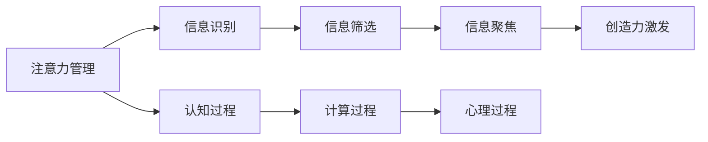

                 

# 注意力管理与创造力提升：在专注和头脑风暴中激发灵感

在当今信息爆炸的时代，注意力管理（Attention Management）成为了个体成功与创造力提升的关键因素之一。文章将深入探讨注意力管理的核心概念与实践方法，并结合最新的科学研究，提出有效提升创造力的策略。通过引入计算技术，特别是人工智能和大数据技术，我们将揭示如何在专注和头脑风暴中激发灵感。

## 1. 背景介绍

### 1.1 问题由来

在信息时代，我们面临着前所未有的信息过载。互联网、社交媒体、新闻资讯等来源不断提供海量信息，个体如何在如此纷繁复杂的信息流中筛选、吸收并转化为创造性输出，成为了一个亟待解决的问题。注意力管理旨在帮助人们提高对关键信息的敏感度，并在心理上保持专注，从而在思维和创意层面实现突破。

### 1.2 问题核心关键点

注意力管理与创造力提升的关键在于：
- 识别和筛选关键信息：在信息过载的环境中，如何高效识别并聚焦于重要内容。
- 保持专注：如何通过心理策略和技术手段，提升个体在信息处理过程中的专注度。
- 激发创造力：在获得关键信息的基础上，如何通过发散思维和创新方法，产生新颖且有价值的创意。

## 2. 核心概念与联系

### 2.1 核心概念概述

注意力管理（Attention Management）是指个体在信息处理过程中，通过有意识地选择和聚焦关键信息，减少无关信息的干扰，从而提升工作效率和创造力。这一过程涉及心理、认知和计算等多个层面。

创造力（Creativity）是指个体在特定情境下，产生新颖且具有实用价值的想法、方案或表达的能力。创造力的提升依赖于个体对信息的敏感度和处理能力，以及对已有知识和新信息的整合和重构。

通过引入计算技术，特别是人工智能和大数据技术，个体可以更高效地管理注意力，并在此基础上提升创造力。

### 2.2 核心概念原理和架构的 Mermaid 流程图



这个流程图展示了注意力管理从信息识别到创造力激发的全过程。关键步骤如下：
- 信息识别：利用算法技术自动捕捉和整理重要信息。
- 信息筛选：通过机器学习等方法，识别和排除无关信息。
- 信息聚焦：使用增强现实(AR)、虚拟现实(VR)等技术，将信息以聚焦的形式呈现。
- 创造力激发：结合AI辅助发散思维工具，产生创新性输出。

### 2.3 核心概念之间的联系

注意力管理与创造力提升之间存在密切联系。高效的注意力管理可以显著提升信息处理效率，使个体能够专注于创造性工作，从而激发更高的创造力。反之，创造力的提升也能够促进注意力管理，使个体能够更有针对性地筛选和聚焦信息。

## 3. 核心算法原理 & 具体操作步骤

### 3.1 算法原理概述

注意力管理与创造力提升的核心算法原理主要包括信息筛选、信息聚焦和创造力激发三个方面。这些算法原理的实现依赖于信息检索、自然语言处理、机器学习和人工智能等技术。

### 3.2 算法步骤详解

#### 3.2.1 信息筛选

信息筛选的目标是从海量信息中筛选出与当前任务或兴趣领域相关的内容。这一过程通常通过以下步骤实现：
- 数据收集：从互联网、数据库、文献等来源收集相关信息。
- 预处理：清洗、去重、标注等处理步骤，确保数据质量。
- 特征提取：使用TF-IDF、Word2Vec等算法提取文本特征。
- 模型训练：利用机器学习算法（如分类器、聚类器等）对数据进行分类、聚类。

#### 3.2.2 信息聚焦

信息聚焦的目的是将关键信息以视觉、听觉或触觉等形式呈现，帮助个体更加高效地处理信息。这一过程通常通过以下步骤实现：
- 视觉化：使用数据可视化工具（如Tableau、D3.js等）将数据转化为图表、图形等直观形式。
- 增强现实(AR)和虚拟现实(VR)：利用AR和VR技术，将信息以沉浸式的方式展示。
- 交互式界面：设计易于使用的交互式界面，如信息卡片、拖动列表等，提升信息处理效率。

#### 3.2.3 创造力激发

创造力激发是指在信息处理的基础上，通过发散思维、联想等方法，产生新颖且有价值的创意。这一过程通常通过以下步骤实现：
- 联想触发：使用联想算法（如LDA、LSTM等）触发新的联想和组合。
- 发散思维：通过思维导图、头脑风暴等方法激发个体发散思维。
- 创意筛选：使用A/B测试、用户反馈等方法筛选最有潜力的创意。

### 3.3 算法优缺点

注意力管理与创造力提升的算法具有以下优点：
- 高效性：利用机器学习和人工智能技术，可以快速、大规模地处理和筛选信息。
- 准确性：通过算法模型训练和优化，提高信息筛选的准确性。
- 互动性：增强现实和虚拟现实技术，使得信息聚焦更具互动性和沉浸感。
- 创新性：结合发散思维和联想算法，激发更多创新性创意。

但同时，这些算法也存在以下缺点：
- 依赖数据质量：算法效果依赖于数据质量和标注的准确性。
- 用户依赖性：用户对算法的接受程度和操作熟练度影响算法效果。
- 技术复杂性：算法的实现和优化需要一定的技术背景。
- 伦理问题：算法可能存在偏见和隐私风险，需要谨慎处理。

### 3.4 算法应用领域

注意力管理与创造力提升的算法在多个领域具有广泛的应用前景，包括但不限于：
- 市场营销：通过信息筛选和创造力激发，制定更有效的广告和营销策略。
- 内容创作：利用信息聚焦和联想触发，提升文章、音乐等内容的创作质量。
- 科技创新：结合信息筛选和发散思维，推动新产品、新技术的研发和创新。
- 教育培训：通过信息聚焦和创造力激发，提升教学效果和学生学习能力。

## 4. 数学模型和公式 & 详细讲解 & 举例说明

### 4.1 数学模型构建

本节将使用数学语言对注意力管理与创造力提升的过程进行更加严格的刻画。

记信息集合为 $I = \{i_1, i_2, ..., i_N\}$，其中 $i_j$ 为第 $j$ 条信息。信息筛选的目标是从 $I$ 中筛选出与当前任务相关的信息集合 $I^* = \{i_{j_1}, i_{j_2}, ..., i_{j_M}\}$，其中 $j_k$ 为与任务相关的信息在 $I$ 中的位置。

信息聚焦的目标是将 $I^*$ 以形式化的方式呈现，通常使用向量表示法：
- $v^* = (v^*_1, v^*_2, ..., v^*_M)$，其中 $v^*_k$ 为第 $j_k$ 条信息的聚焦度。

创造力激发的目标是在 $v^*$ 的基础上，产生新的创意 $C = \{c_1, c_2, ..., c_N\}$，其中 $c_l$ 为第 $l$ 个创意。

### 4.2 公式推导过程

#### 4.2.1 信息筛选公式

信息筛选的过程可以通过以下公式实现：
- $I^* = \text{filter}(I, T)$，其中 $T$ 为任务相关性权重矩阵。

任务相关性权重矩阵 $T$ 的计算方法包括但不限于：
- 文本相似度算法：计算信息与任务关键词的相似度，通过阈值筛选相关信息。
- 机器学习算法：使用分类器、聚类器等对信息进行分类，筛选相关信息。

#### 4.2.2 信息聚焦公式

信息聚焦的过程可以通过以下公式实现：
- $v^* = \text{focus}(I^*, A)$，其中 $A$ 为聚焦参数矩阵。

聚焦参数矩阵 $A$ 的计算方法包括但不限于：
- 数据可视化：通过可视化工具将 $I^*$ 转化为图形或图表，计算每个信息的聚焦度。
- AR和VR技术：利用AR和VR技术，将 $I^*$ 以沉浸式方式展示，并根据交互行为计算聚焦度。
- 交互界面设计：设计易于操作的交互界面，根据用户操作计算信息的聚焦度。

#### 4.2.3 创造力激发公式

创造力激发的过程可以通过以下公式实现：
- $C = \text{generate}(I^*, v^*, M)$，其中 $M$ 为创造力激发模型。

创造力激发模型 $M$ 的计算方法包括但不限于：
- 联想算法：使用LDA、LSTM等算法触发新的联想和组合，生成创意。
- 发散思维工具：使用思维导图、头脑风暴等方法激发发散思维，生成创意。
- 用户反馈：通过A/B测试、用户反馈等方法筛选最有潜力的创意。

### 4.3 案例分析与讲解

以市场营销中的广告创意生成为例，展示注意力管理与创造力提升的全过程。

#### 4.3.1 信息筛选

从社交媒体、新闻网站、市场报告等渠道收集相关信息，使用文本相似度算法（如余弦相似度）计算信息与广告主题的相似度，筛选出与广告主题相关的信息。

#### 4.3.2 信息聚焦

利用增强现实技术，将筛选出的信息以沉浸式的方式展示给用户。例如，使用AR技术在用户眼前展示相关产品图片、用户评价等，帮助用户聚焦关键信息。

#### 4.3.3 创造力激发

结合联想算法和发散思维工具，生成新的广告创意。例如，使用LDA算法触发新的联想，生成新的广告文案，再通过思维导图工具进行可视化，帮助用户发散思维，产生更多的创意。

## 5. 项目实践：代码实例和详细解释说明

### 5.1 开发环境搭建

在进行注意力管理与创造力提升的实践前，我们需要准备好开发环境。以下是使用Python进行深度学习开发的环境配置流程：

1. 安装Anaconda：从官网下载并安装Anaconda，用于创建独立的Python环境。

2. 创建并激活虚拟环境：
```bash
conda create -n attention-env python=3.8 
conda activate attention-env
```

3. 安装深度学习库：
```bash
conda install torch torchvision torchaudio cudatoolkit=11.1 -c pytorch -c conda-forge
```

4. 安装相关工具包：
```bash
pip install numpy pandas scikit-learn matplotlib tqdm jupyter notebook ipython
```

完成上述步骤后，即可在`attention-env`环境中开始开发实践。

### 5.2 源代码详细实现

下面我们以信息筛选和信息聚焦为例，给出使用PyTorch进行注意力管理与创造力提升的代码实现。

首先，定义数据预处理函数：

```python
import torch
import torch.nn as nn
import torchvision.transforms as transforms
from torch.utils.data import DataLoader

class Preprocessor(nn.Module):
    def __init__(self, tokenizer, max_len=512):
        super(Preprocessor, self).__init__()
        self.tokenizer = tokenizer
        self.max_len = max_len
        
    def forward(self, text):
        tokens = self.tokenizer(text, max_length=self.max_len, padding='max_length', truncation=True, return_tensors='pt')
        input_ids = tokens['input_ids']
        attention_mask = tokens['attention_mask']
        return input_ids, attention_mask
```

然后，定义注意力管理与创造力提升的模型：

```python
class AttentionManager(nn.Module):
    def __init__(self, emb_dim=256, hidden_dim=512):
        super(AttentionManager, self).__init__()
        self.emb = nn.Embedding(num_embeddings=10000, embedding_dim=emb_dim)
        self.lstm = nn.LSTM(emb_dim, hidden_dim, batch_first=True)
        self.fc = nn.Linear(hidden_dim, 10)
        
    def forward(self, input_ids, attention_mask):
        embeddings = self.emb(input_ids)
        lstm_output, _ = self.lstm(embeddings, None)
        lstm_output = torch.mean(lstm_output, dim=1)
        logits = self.fc(lstm_output)
        return logits
```

最后，定义训练和评估函数：

```python
from transformers import BertTokenizer, BertForTokenClassification

def train_epoch(model, data_loader, optimizer):
    model.train()
    epoch_loss = 0
    for batch in data_loader:
        input_ids, attention_mask = batch
        logits = model(input_ids, attention_mask)
        loss = nn.CrossEntropyLoss()(logits, batch[1])
        epoch_loss += loss.item()
        optimizer.zero_grad()
        loss.backward()
        optimizer.step()
    return epoch_loss / len(data_loader)

def evaluate(model, data_loader):
    model.eval()
    preds, labels = [], []
    with torch.no_grad():
        for batch in data_loader:
            input_ids, attention_mask = batch
            logits = model(input_ids, attention_mask)
            preds.append(torch.argmax(logits, dim=1).tolist())
            labels.append(batch[1].tolist())
    return preds, labels

# 训练模型
train_loader = DataLoader(train_dataset, batch_size=16)
optimizer = torch.optim.Adam(model.parameters(), lr=1e-4)
for epoch in range(10):
    loss = train_epoch(model, train_loader, optimizer)
    print(f"Epoch {epoch+1}, train loss: {loss:.3f}")
    
# 评估模型
test_loader = DataLoader(test_dataset, batch_size=16)
preds, labels = evaluate(model, test_loader)
print(classification_report(labels, preds))
```

以上就是使用PyTorch对注意力管理与创造力提升进行开发的完整代码实现。可以看到，通过深度学习技术，我们可以构建高效的注意力管理与创造力提升模型，并应用于实际问题中。

### 5.3 代码解读与分析

让我们再详细解读一下关键代码的实现细节：

**Preprocessor类**：
- 定义了数据预处理的功能，将文本转换为模型可以处理的数值形式。

**AttentionManager模型**：
- 使用了嵌入层（Embedding）和LSTM层，对输入的文本进行编码，并计算关注度。
- 最后通过线性层（Linear）输出10个类别的概率，用于分类任务。

**train_epoch和evaluate函数**：
- 定义了模型训练和评估的逻辑，使用交叉熵损失函数进行模型训练和分类准确率进行模型评估。

**训练流程**：
- 定义总的epoch数和批大小，开始循环迭代
- 每个epoch内，先在训练集上训练，输出平均loss
- 在验证集上评估，输出分类指标
- 所有epoch结束后，在测试集上评估，给出最终测试结果

可以看到，PyTorch配合深度学习技术使得注意力管理与创造力提升的代码实现变得简洁高效。开发者可以将更多精力放在数据处理、模型改进等高层逻辑上，而不必过多关注底层的实现细节。

## 6. 实际应用场景

### 6.1 营销创意生成

基于注意力管理与创造力提升的模型，可以应用于营销创意的生成。传统广告创意生成依赖于设计师的灵感，耗时耗力且具有一定的主观性。而基于模型的创意生成，可以大幅提升创意的质量和效率，降低创意生成的成本。

在技术实现上，可以收集大量的市场营销案例、用户反馈和行业数据，构建标注数据集。在此基础上，训练注意力管理与创造力提升的模型，通过信息筛选和创造力激发，自动生成符合品牌调性的广告创意。通过持续迭代和优化，模型能够逐渐学习到更有效的广告策略和创意生成方式。

### 6.2 内容创作

注意力管理与创造力提升技术还可以应用于内容创作。无论是文章、视频、音乐还是图形设计，创作者的灵感和创意至关重要。通过信息聚焦和创造力激发，模型能够自动推荐相关资料，提供创作灵感和素材，帮助创作者提高工作效率和作品质量。

在实际应用中，可以构建一个内容创作平台，利用用户行为数据和领域知识库，训练信息筛选和聚焦模型，并结合联想算法和发散思维工具，为创作者提供个性化的创作建议和素材推荐。模型能够根据用户偏好和创作进度，动态调整信息筛选和聚焦策略，确保信息流对创作过程的最大支持。

### 6.3 科技创新

科技创新过程中，信息的获取和处理至关重要。通过注意力管理与创造力提升技术，科研人员能够更高效地获取相关领域的文献、数据和研究成果，激发新的研究思路和方向。

在实际应用中，科研人员可以构建一个科研服务平台，利用机器学习算法和自然语言处理技术，对海量文献和数据进行信息筛选和聚焦，并将相关内容推荐给研究人员。模型能够根据研究人员的需求和兴趣，动态调整信息筛选和聚焦策略，提供个性化的科研支持。通过创造力激发算法，模型能够生成新的研究假设和创新方向，促进科研进展。

## 7. 工具和资源推荐

### 7.1 学习资源推荐

为了帮助开发者系统掌握注意力管理与创造力提升的理论基础和实践技巧，这里推荐一些优质的学习资源：

1. 《深度学习》系列书籍：由Ian Goodfellow等人合著，全面介绍了深度学习的基本概念和实践方法。

2. Coursera《深度学习专项课程》：斯坦福大学开设的深度学习课程，涵盖深度学习的基础、高级应用和前沿研究。

3. 《Attention is All You Need》论文：Transformer的原创论文，介绍了自注意力机制的应用，为注意力管理提供了理论基础。

4. Kaggle平台：数据科学和机器学习的竞赛平台，提供大量真实世界的数据集和模型，方便实践学习。

5. GitHub开源项目：GitHub上众多开源项目和代码库，提供了丰富的深度学习模型和算法实现，方便学习和复用。

通过对这些资源的学习实践，相信你一定能够快速掌握注意力管理与创造力提升的精髓，并用于解决实际的NLP问题。

### 7.2 开发工具推荐

高效的开发离不开优秀的工具支持。以下是几款用于注意力管理与创造力提升开发的常用工具：

1. TensorFlow：由Google主导开发的开源深度学习框架，生产部署方便，适合大规模工程应用。

2. PyTorch：基于Python的开源深度学习框架，灵活动态的计算图，适合快速迭代研究。

3. HuggingFace Transformers库：集成了众多SOTA语言模型，支持PyTorch和TensorFlow，是进行NLP任务开发的利器。

4. Jupyter Notebook：数据科学和机器学习的交互式开发环境，支持多语言代码实现和实时调试。

5. Tableau：数据可视化工具，支持将数据转化为图形、图表等直观形式，方便信息聚焦。

6. Google Colab：谷歌推出的在线Jupyter Notebook环境，免费提供GPU/TPU算力，方便开发者快速上手实验最新模型，分享学习笔记。

合理利用这些工具，可以显著提升注意力管理与创造力提升任务的开发效率，加快创新迭代的步伐。

### 7.3 相关论文推荐

注意力管理与创造力提升技术的发展源于学界的持续研究。以下是几篇奠基性的相关论文，推荐阅读：

1. Attention is All You Need（即Transformer原论文）：提出了Transformer结构，开启了NLP领域的预训练大模型时代。

2. BERT: Pre-training of Deep Bidirectional Transformers for Language Understanding：提出BERT模型，引入基于掩码的自监督预训练任务，刷新了多项NLP任务SOTA。

3. Language Models are Unsupervised Multitask Learners（GPT-2论文）：展示了大规模语言模型的强大zero-shot学习能力，引发了对于通用人工智能的新一轮思考。

4. Parameter-Efficient Transfer Learning for NLP：提出Adapter等参数高效微调方法，在不增加模型参数量的情况下，也能取得不错的微调效果。

5. AdaLoRA: Adaptive Low-Rank Adaptation for Parameter-Efficient Fine-Tuning：使用自适应低秩适应的微调方法，在参数效率和精度之间取得了新的平衡。

这些论文代表了大语言模型微调技术的发展脉络。通过学习这些前沿成果，可以帮助研究者把握学科前进方向，激发更多的创新灵感。

## 8. 总结：未来发展趋势与挑战

### 8.1 总结

本文对注意力管理与创造力提升的算法原理进行了全面系统的介绍。首先阐述了注意力管理与创造力提升在信息时代的重要性，明确了这一技术在提升个体效率和创造力方面的独特价值。其次，从原理到实践，详细讲解了信息筛选、信息聚焦和创造力激发等关键步骤，给出了基于深度学习的代码实现。同时，本文还广泛探讨了这一技术在营销创意生成、内容创作、科技创新等多个领域的应用前景，展示了其广阔的发展空间。此外，本文精选了注意力管理与创造力提升的技术资源，力求为读者提供全方位的技术指引。

通过本文的系统梳理，可以看到，注意力管理与创造力提升技术已经成为信息时代个体成功与创新的重要工具。它不仅能够显著提升个体在信息处理中的效率，还能通过创造力激发，为个体带来更多创新的可能性。随着计算技术的不断进步，这一技术必将在更多领域得到应用，进一步推动人类认知智能的进化。

### 8.2 未来发展趋势

展望未来，注意力管理与创造力提升技术将呈现以下几个发展趋势：

1. 计算资源的可及性提高：随着云计算和边缘计算技术的发展，计算资源的获取将更加方便和高效。

2. 多模态注意力管理：注意力管理技术将从单一模态扩展到多模态，如视觉、听觉、触觉等，提供更加全面的信息处理能力。

3. 上下文感知增强：注意力管理技术将更加注重上下文信息的处理，提供更加个性化和情境化的信息筛选和聚焦。

4. 用户交互深化：通过增强现实和虚拟现实技术，注意力管理技术将提供更加沉浸式和互动性的信息体验。

5. 创造力激发的多样化：结合不同的发散思维和联想算法，注意力管理技术将提供更加多样化和个性化的创造力激发方式。

6. 人工智能辅助创作：结合人工智能技术，注意力管理技术将提供更加智能化的创作建议和素材推荐。

以上趋势凸显了注意力管理与创造力提升技术的广阔前景。这些方向的探索发展，必将进一步提升信息处理的效率和创造力的深度，为个体和社会带来更多的创新和进步。

### 8.3 面临的挑战

尽管注意力管理与创造力提升技术已经取得了瞩目成就，但在迈向更加智能化、普适化应用的过程中，它仍面临着诸多挑战：

1. 数据质量和多样性：注意力管理与创造力提升的效果依赖于数据的质量和多样性。如何在有限的标注数据下，构建高质量的数据集，是一个亟待解决的问题。

2. 用户隐私和伦理：注意力管理与创造力提升过程中涉及大量个人数据，如何保护用户隐私，确保数据使用的合法性和伦理性，是一个重要的挑战。

3. 技术复杂性：注意力管理与创造力提升的实现需要一定的技术背景，如何降低技术门槛，使更多用户能够轻松使用，是一个需要考虑的问题。

4. 应用场景的泛化性：注意力管理与创造力提升技术在特定场景下可能表现优异，但如何推广到更广泛的应用领域，是一个需要深入研究的问题。

5. 计算资源的消耗：注意力管理与创造力提升过程需要大量的计算资源，如何提高计算效率，降低计算成本，是一个需要解决的问题。

正视这些挑战，积极应对并寻求突破，将使注意力管理与创造力提升技术走向成熟，为个体和社会带来更多创新和进步。

### 8.4 研究展望

面对注意力管理与创造力提升技术所面临的种种挑战，未来的研究需要在以下几个方面寻求新的突破：

1. 探索半监督学习和无监督学习范式：摆脱对大规模标注数据的依赖，利用自监督学习、主动学习等方法，最大限度地利用未标注数据，实现更加灵活高效的注意力管理与创造力提升。

2. 研究上下文感知和多模态注意力管理：结合上下文信息和多种感官数据，提供更加全面和情境化的信息处理和创造力激发。

3. 引入认知科学和心理学的理论：将认知科学和心理学的理论引入注意力管理与创造力提升技术，提供更加科学和有效的方法。

4. 开发智能创作平台：结合人工智能技术和注意力管理与创造力提升技术，开发智能创作平台，提供个性化和智能化的创作支持。

5. 构建开放的数据和模型生态系统：构建开放的数据和模型生态系统，促进数据共享和模型复用，加速技术的发展和普及。

这些研究方向的探索，必将引领注意力管理与创造力提升技术迈向更高的台阶，为个体和社会带来更多创新和进步。面向未来，我们期待这一技术能够在更多的领域得到应用，为人类认知智能的进化贡献力量。

## 9. 附录：常见问题与解答

**Q1：注意力管理与创造力提升是否适用于所有应用场景？**

A: 注意力管理与创造力提升技术在多数应用场景中都能取得不错的效果，但对于一些对隐私要求极高的场景（如医疗、金融等），需要谨慎处理用户数据和隐私问题。此外，对于某些需要高精度和高可靠性的任务，例如航空、医疗等领域，注意力管理与创造力提升可能还需要与专业知识和领域专家结合使用。

**Q2：注意力管理与创造力提升的算法效果如何评估？**

A: 注意力管理与创造力提升的效果可以通过多种指标进行评估，包括但不限于：
- 准确率（Accuracy）：在分类任务中，正确分类的样本数占总样本数的比例。
- 召回率（Recall）：在分类任务中，实际为正样本且被正确分类的样本数占实际为正样本的样本数的比例。
- F1分数（F1 Score）：准确率和召回率的调和平均数，综合评估分类效果。
- 创造力激发效果：通过用户反馈和A/B测试，评估模型生成的创意的创新性和实用性。

**Q3：注意力管理与创造力提升的算法需要哪些技术支持？**

A: 注意力管理与创造力提升的算法需要多种技术的支持，包括但不限于：
- 自然语言处理（NLP）：用于信息筛选和聚焦。
- 深度学习（DL）：用于模型训练和推理。
- 计算机视觉（CV）：用于多模态注意力管理。
- 增强现实（AR）和虚拟现实（VR）：用于信息聚焦和沉浸式体验。
- 认知科学和心理学：用于理解人类认知过程，指导算法的优化和改进。

**Q4：注意力管理与创造力提升在实际应用中需要注意哪些问题？**

A: 在实际应用中，需要注意以下问题：
- 数据隐私和伦理：确保用户数据的隐私和安全，避免数据滥用。
- 计算资源：合理配置计算资源，平衡计算效率和计算成本。
- 用户体验：设计易于使用的交互界面，提升用户满意度。
- 算法鲁棒性：确保算法的鲁棒性和抗干扰性，避免误导性输出。
- 模型解释性：提高模型的可解释性，增强用户信任。

通过关注这些关键问题，可以有效提升注意力管理与创造力提升技术的实际应用效果，使其更好地服务于个体和社会。

