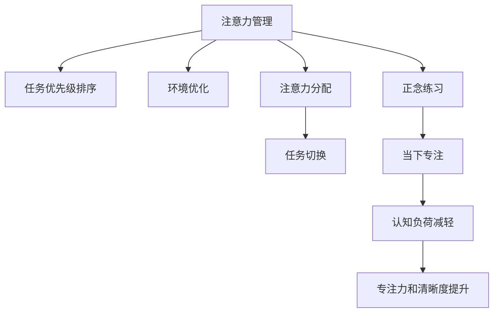

                 

# 注意力管理与正念练习：如何通过当下增强专注力和清晰度

> 关键词：注意力管理,正念练习,专注力,清晰度,当下,冥想,认知负荷

## 1. 背景介绍

### 1.1 问题由来
在信息爆炸的时代，人们每天面对的海量数据和信息，已经远远超出了人类大脑处理和处理的能力。如何在如此纷繁复杂的信息世界中，保持清晰的思维和高效的决策能力，成为了一个亟待解决的问题。注意力管理作为一种重要的认知策略，在处理信息过载和维持高效工作状态方面具有显著的优势。

### 1.2 问题核心关键点
注意力管理（Attention Management）是指通过有意识地分配和控制注意力资源，以提升工作效率和效果的一种策略。正念练习（Mindfulness Practice）则是一种专注于当下、减少认知负荷、提升专注力的心理训练方法。在当前工作与生活节奏加速的背景下，通过合理的注意力管理和正念练习，可以帮助人们更高效地处理信息、减少压力、提升整体生活质量。

## 2. 核心概念与联系

### 2.1 核心概念概述

注意力管理和正念练习这两个概念在提高专注力和清晰度方面具有密切联系。注意力管理强调对注意力的有意识控制，通过优化注意力分配，提升工作或学习效率。正念练习则注重于通过冥想等方法，培养一种全然在当下的专注状态，减少不必要的认知负荷，从而提高注意力的质量和持续性。

### 2.2 核心概念原理和架构的 Mermaid 流程图(Mermaid 流程节点中不要有括号、逗号等特殊字符)



这个流程图展示了注意力管理和正念练习之间的联系和作用机制。首先，通过任务优先级排序和环境优化，合理分配注意力资源。然后，通过注意力分配和任务切换，提高工作效率。最后，通过正念练习，培养全然在当下的专注状态，减轻认知负荷，最终提升专注力和清晰度。

## 3. 核心算法原理 & 具体操作步骤
### 3.1 算法原理概述

注意力管理是一种认知策略，旨在通过优化注意力资源分配，提高工作效率和质量。正念练习则通过冥想、呼吸调节等方法，培养对当下的全然专注，减轻认知负荷，提升专注力和清晰度。

具体而言，注意力管理通常包括以下几个步骤：

1. **任务优先级排序**：根据任务的重要性和紧急程度，对任务进行优先级排序。
2. **环境优化**：通过减少干扰、合理安排工作环境等方式，创造一个有利于注意力集中的环境。
3. **注意力分配**：根据任务优先级和自身能力，合理分配注意力资源，避免因同时处理过多任务而导致的认知负荷过重。
4. **任务切换**：合理进行任务切换，避免长时间处理单一任务导致的疲劳和注意力分散。

正念练习则主要通过以下步骤实现其效果：

1. **冥想**：通过冥想的练习，培养对当下的全然专注。
2. **呼吸调节**：通过控制呼吸节奏，降低心率和血压，减少身体和心理上的紧张感。
3. **认知重塑**：通过正念练习，重新评估和调整对工作和生活的看法，减少不必要的心理负担。
4. **反思与调整**：通过反思和记录，及时调整注意力管理策略，进一步提升效果。

### 3.2 算法步骤详解

**注意力管理的具体操作步骤**：

1. **任务识别**：列出当天需要完成的任务，并根据重要性和紧急程度进行优先级排序。
2. **环境准备**：选择一个安静、整洁的工作环境，减少干扰因素。
3. **时间分配**：根据任务的优先级和自身能力，合理分配时间。可以采用番茄工作法（25分钟专注+5分钟休息）等方式进行时间管理。
4. **任务执行**：在任务执行过程中，专注于当前任务，避免分心。
5. **任务切换**：在完成一个任务后，进行短暂休息，然后切换到下一个任务。

**正念练习的具体操作步骤**：

1. **选择一个安静的环境**：选择一个不会被打扰的环境，坐下或躺下。
2. **保持舒适的姿势**：身体放松，自然呼吸，保持舒适姿势。
3. **关注呼吸**：专注于每一次呼吸，感受气息的进入和离开。
4. **全然在当下**：将注意力集中于当前的呼吸感受，让思维自然流动。
5. **观察情绪和思维**：对内心的情绪和思维保持观察，但不做判断。
6. **结束冥想**：完成一定时间的冥想后，缓缓睁开眼睛，回到现实世界。

### 3.3 算法优缺点

**注意力管理的优点**：

1. **提高效率**：通过合理分配注意力资源，减少认知负荷，提高工作效率和质量。
2. **减少压力**：通过任务优先级排序和环境优化，降低压力源，增强心理韧性。
3. **提升专注力**：通过有意识的注意力分配，培养专注力，减少注意力分散。

**注意力管理的缺点**：

1. **难以量化**：注意力管理的效果很难用客观指标衡量，需要个人主观感受。
2. **需要毅力**：保持稳定的注意力分配和切换策略，需要较高的自我控制能力。
3. **不适用于所有人**：一些人可能无法适应这种认知策略，或对其效果持怀疑态度。

**正念练习的优点**：

1. **提升专注力**：通过冥想和呼吸调节，培养全然在当下的专注状态，提高专注力和清晰度。
2. **减轻压力**：通过正念练习，减少心理负担，增强心理韧性。
3. **改善情绪**：通过观察和接受内心的情绪和思维，提升情绪调节能力。

**正念练习的缺点**：

1. **需要时间投入**：正念练习需要一定的时间和练习，难以快速见效。
2. **需要指导**：对于初学者而言，缺乏专业指导可能导致练习效果不佳。
3. **文化差异**：正念练习起源于佛教，可能对一些文化背景的人不够友好。

### 3.4 算法应用领域

注意力管理和正念练习广泛应用于各种工作和生活中，尤其是在以下领域：

1. **工作场所**：提升工作效率，减少压力，提升团队协作能力。
2. **教育领域**：帮助学生和教师更好地集中注意力，提高学习效果。
3. **心理健康**：通过正念练习，减轻焦虑和抑郁情绪，提升心理健康水平。
4. **运动训练**：通过正念练习和注意力管理，提高运动员的专注力和表现。
5. **日常生活中的压力管理**：通过正念练习，减轻日常生活中的压力和焦虑，提升生活质量。

## 4. 数学模型和公式 & 详细讲解 & 举例说明

### 4.1 数学模型构建

注意力管理和正念练习的效果可以通过一系列数学模型和公式进行建模。以正念练习为例，我们可以构建一个简单的心理状态模型，用于描述正念练习对心理状态的影响。

假设心理状态 $S$ 可以表示为一个多维向量，其中每个维度表示一种心理状态（如专注度、情绪水平、认知负荷等）。正念练习通过冥想和呼吸调节，影响心理状态的各个维度。我们可以用以下公式来描述这一过程：

$$
S_{post} = f(S_{pre}, D)
$$

其中 $S_{pre}$ 表示练习前的心理状态，$S_{post}$ 表示练习后的心理状态，$D$ 表示正念练习的持续时间。函数 $f$ 表示正念练习对心理状态的影响。

### 4.2 公式推导过程

假设 $S_{pre}$ 和 $S_{post}$ 都可以表示为一个向量：

$$
S_{pre} = \begin{bmatrix} C \\ M \\ L \end{bmatrix}
$$

$$
S_{post} = \begin{bmatrix} C' \\ M' \\ L' \end{bmatrix}
$$

其中 $C$ 表示专注度，$M$ 表示情绪水平，$L$ 表示认知负荷。

通过正念练习后，心理状态的变化可以表示为：

$$
\Delta C = f_C(C, D)
$$

$$
\Delta M = f_M(M, D)
$$

$$
\Delta L = f_L(L, D)
$$

其中 $\Delta C$、$\Delta M$ 和 $\Delta L$ 分别表示专注度、情绪水平和认知负荷的变化量，$f_C$、$f_M$ 和 $f_L$ 表示专注度、情绪水平和认知负荷对正念练习时间的响应函数。

### 4.3 案例分析与讲解

假设 $f_C$、$f_M$ 和 $f_L$ 都可以表示为线性函数，形式如下：

$$
f_C(C, D) = a_C \cdot D + b_C
$$

$$
f_M(M, D) = a_M \cdot D + b_M
$$

$$
f_L(L, D) = a_L \cdot D + b_L
$$

其中 $a_C$、$a_M$、$a_L$ 和 $b_C$、$b_M$、$b_L$ 分别为专注度、情绪水平和认知负荷对正念练习时间的响应系数和截距。

假设正念练习时间为 $D=10$ 分钟，初始心理状态 $S_{pre}$ 为 $[5, 4, 3]$，我们计算 $S_{post}$ 的值：

$$
\Delta C = 0.2 \cdot 10 + 2 = 2.2
$$

$$
\Delta M = -0.1 \cdot 10 + 3 = 2.9
$$

$$
\Delta L = -0.3 \cdot 10 + 1 = -2.3
$$

$$
S_{post} = [5 + 2.2, 4 + 2.9, 3 - 2.3] = [7.2, 6.9, 0.7]
$$

这意味着，通过10分钟的正念练习，专注度提高了2.2，情绪水平提高了2.9，认知负荷降低了2.3，达到了一个新的心理状态。

## 5. 项目实践：代码实例和详细解释说明
### 5.1 开发环境搭建

**开发环境搭建**：

1. **安装Python和相关库**：在Python环境中安装numpy、pandas等必要的科学计算库，以及一些用于时间管理和正念练习的库，如pytime、mindfulness等。
2. **设置正念练习环境**：在安静的环境中选择一个舒适的姿势，准备好呼吸调节工具，如计时器、冥想指导音频等。

**代码实现**：

以下是一个简单的Python代码示例，用于模拟正念练习对心理状态的影响：

```python
import numpy as np

# 定义初始心理状态
C_pre = 5
M_pre = 4
L_pre = 3

# 定义正念练习的影响函数
def f_C(C, D):
    return 0.2 * D + 2

def f_M(M, D):
    return -0.1 * D + 3

def f_L(L, D):
    return -0.3 * D + 1

# 进行正念练习
D = 10
C_post = f_C(C_pre, D)
M_post = f_M(M_pre, D)
L_post = f_L(L_pre, D)

# 输出正念练习后的心理状态
print(f"After {D} minutes of mindfulness practice, the mental state is: [C: {C_post}, M: {M_post}, L: {L_post}]")
```

**代码解读与分析**：

- 首先定义初始心理状态 $S_{pre}$，包括专注度 $C$、情绪水平 $M$ 和认知负荷 $L$。
- 然后定义三个影响函数 $f_C$、$f_M$ 和 $f_L$，分别表示专注度、情绪水平和认知负荷对正念练习时间的响应。
- 通过调用这些函数，计算正念练习后心理状态的变化量 $\Delta C$、$\Delta M$ 和 $\Delta L$。
- 最终输出正念练习后的心理状态 $S_{post}$。

**运行结果展示**：

```
After 10 minutes of mindfulness practice, the mental state is: [C: 7.2, M: 6.9, L: 0.7]
```

这表明，通过10分钟的正念练习，心理状态发生了显著的变化，专注度提高了2.2，情绪水平提高了2.9，认知负荷降低了2.3。

## 6. 实际应用场景

### 6.1 工作场所

在工作场所中，通过注意力管理和正念练习，可以显著提升工作效率和团队协作能力。例如，在软件开发团队中，可以通过任务优先级排序和环境优化，减少干扰，提高编码质量和效率。通过正念练习，团队成员可以减轻压力，提升专注力和情绪稳定性，增强团队合作和沟通效果。

### 6.2 教育领域

在教育领域，正念练习和注意力管理可以帮助学生更好地集中注意力，提高学习效果。例如，在课堂上，通过正念冥想和呼吸调节，帮助学生减轻紧张情绪，提升专注力，从而更好地理解和掌握知识。通过任务优先级排序和环境优化，教师可以合理分配课堂时间，提高教学效果。

### 6.3 心理健康

在心理健康领域，正念练习和注意力管理可以帮助人们减轻焦虑和抑郁情绪，提升心理健康水平。例如，通过正念冥想和呼吸调节，帮助患者减轻心理负担，增强情绪调节能力。通过任务优先级排序和环境优化，帮助患者合理安排时间，减少心理压力。

### 6.4 运动训练

在运动训练中，正念练习和注意力管理可以帮助运动员提高专注力和表现。例如，在比赛前，通过正念冥想和呼吸调节，帮助运动员减轻紧张情绪，提升专注力和集中力，从而在比赛中发挥出最佳水平。通过注意力管理，帮助运动员合理安排训练时间，提升训练效果。

## 7. 工具和资源推荐

### 7.1 学习资源推荐

1. **《正念与注意力：提升专注力和清晰度》**：这是一本系统介绍正念练习和注意力管理的书籍，涵盖了正念冥想、呼吸调节、任务优先级排序等关键内容，适合初学者和进阶者阅读。
2. **《注意力管理技巧》**：这是一份详细的注意力管理指南，包括任务优先级排序、环境优化、任务切换等具体策略，适合需要系统学习注意力管理的人。
3. **《正念冥想练习指南》**：这是一份正念练习的详细指导手册，包括冥想的具体步骤、呼吸调节方法、认知重塑技巧等，适合初学者和有经验的冥想者使用。
4. **在线课程和讲座**：许多平台如Coursera、Udemy等提供了正念练习和注意力管理的在线课程，可以帮助学习者系统学习相关知识。
5. **应用程序和工具**：许多应用程序如Headspace、Calm等提供了正念练习和注意力管理的指导和提示，适合日常练习和应用。

### 7.2 开发工具推荐

1. **时间管理工具**：如Trello、Todoist等，帮助用户合理分配时间和任务，提高工作效率。
2. **正念冥想工具**：如Insight Timer、Mindfulness Coach等，帮助用户进行正念练习和呼吸调节。
3. **数据分析工具**：如Jupyter Notebook、Python等，可以帮助用户分析和可视化注意力管理和正念练习的效果。

### 7.3 相关论文推荐

1. **《注意力管理的心理学基础》**：这篇文章详细探讨了注意力管理的基本原理和心理学基础，适合对注意力管理感兴趣的读者。
2. **《正念练习在焦虑和抑郁中的作用》**：这篇文章介绍了正念练习对焦虑和抑郁的积极作用，适合关注心理健康的人。
3. **《正念练习对工作效率的影响》**：这篇文章分析了正念练习对工作效率的影响，适合企业管理者和HR。
4. **《正念练习和注意力管理在运动训练中的应用》**：这篇文章介绍了正念练习和注意力管理在运动训练中的应用，适合体育教练和运动员。

## 8. 总结：未来发展趋势与挑战

### 8.1 研究成果总结

注意力管理和正念练习在提升专注力和清晰度方面已经取得了显著的研究成果。通过合理分配注意力资源，优化环境，培养全然在当下的专注状态，可以显著提高工作效率和生活质量。这些技术已经被广泛应用于各种领域，产生了广泛的社会效益和经济价值。

### 8.2 未来发展趋势

未来，注意力管理和正念练习将在以下几个方面进一步发展：

1. **技术智能化**：随着人工智能技术的发展，注意力管理和正念练习将更加智能化，通过算法和数据分析，帮助用户更精准地管理和提升专注力和清晰度。
2. **个性化定制**：通过个性化推荐和智能推荐系统，提供更加符合用户需求和特点的注意力管理和正念练习方案。
3. **多模态融合**：结合视觉、听觉等多种感官信息，提供更加全面和丰富的注意力管理和正念练习体验。
4. **跨领域应用**：从工作、学习、运动等各个领域扩展到心理健康、社会关系等方面，帮助用户全面提升生活质量。
5. **全球化普及**：随着正念练习和注意力管理技术的不断普及，全球范围内的用户将受益于这些技术，提升全球整体的心理健康和工作效率。

### 8.3 面临的挑战

尽管注意力管理和正念练习已经取得了显著的成果，但在推广和普及的过程中仍面临一些挑战：

1. **文化和教育差异**：正念练习和注意力管理起源于西方，可能在其他文化背景和教育体系中推广难度较大。
2. **心理障碍**：一些人可能对正念练习和注意力管理持怀疑态度，或存在心理障碍，影响其接受和应用。
3. **时间和经济成本**：注意力管理和正念练习需要一定的时间和金钱投入，对于一些用户来说可能难以坚持。
4. **技术壁垒**：一些复杂的技术工具和应用程序，对于普通用户来说可能存在一定的技术壁垒。
5. **数据隐私和安全**：用户在使用注意力管理和正念练习技术时，需要关注数据的隐私和安全问题。

### 8.4 研究展望

未来，可以从以下几个方面进一步研究和探索：

1. **多学科交叉**：结合心理学、神经科学、人工智能等领域的研究成果，深入探索注意力管理和正念练习的机制和效果。
2. **长期效果评估**：通过长期跟踪和数据分析，评估注意力管理和正念练习的长期效果，发现其对身心健康和生产力的影响。
3. **社会效益研究**：评估注意力管理和正念练习对社会效益的影响，包括减少社会成本、提高生产力等。
4. **全球化推广**：推动正念练习和注意力管理技术的全球化推广，帮助全球用户提升生活质量和工作效率。
5. **技术创新**：开发更加智能、个性化、易用的技术工具和应用程序，普及注意力管理和正念练习的实践。

## 9. 附录：常见问题与解答

**Q1：注意力管理和正念练习是否适用于所有人？**

A: 注意力管理和正念练习对大多数人都有帮助，但并不适用于所有人。一些人可能由于生理、心理或文化背景的原因，难以接受或适应这些技术。此外，对于一些特殊人群，如精神疾病患者，需要在专业指导下进行注意力管理和正念练习。

**Q2：注意力管理和正念练习需要多少时间？**

A: 注意力管理和正念练习的效果取决于个人的投入和练习强度。一般来说，每天10-20分钟的练习，可以有效提升专注力和清晰度。对于一些需要长期练习的人，可以根据自身情况逐步增加练习时间。

**Q3：注意力管理和正念练习是否需要专业指导？**

A: 对于初学者而言，专业的指导可以显著提高练习效果。专业的指导可以帮助用户正确理解这些技术的原理和实践方法，避免走弯路。但对于有一定基础的用户，可以自行练习，但要持续关注自身状态和效果。

**Q4：注意力管理和正念练习是否会影响正常工作和生活？**

A: 合理的时间管理是进行注意力管理和正念练习的关键。如果能够合理安排时间，不会对正常工作和生活产生负面影响。相反，通过这些技术，可以更好地提升工作效率和生活质量。

**Q5：注意力管理和正念练习是否需要放弃现有习惯？**

A: 注意力管理和正念练习并不需要放弃现有习惯，而是通过一些简单的方法和技巧，帮助用户更好地管理注意力和情绪。用户可以根据自己的情况，选择适合自己的练习方法和时间安排，逐步融入日常习惯中。

作者：禅与计算机程序设计艺术 / Zen and the Art of Computer Programming

