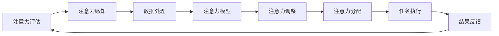

                 

# 注意力管理学位:提升全球脑参与效率的高等教育

在当前数字化和信息爆炸的时代，我们的注意力成了最宝贵的资源。无论是企业、教育还是个人，能否高效管理注意力，直接决定了其信息处理效率和学习成果。本文将深入探讨注意力管理的核心概念、核心算法和具体操作步骤，并提供实际应用场景和未来展望。

## 1. 背景介绍

### 1.1 问题由来
现代社会信息的快速流动，使得注意力成为一种稀缺资源。尤其是在学习和工作中，如何有效管理注意力，提升信息处理效率，已经成为决定个人和企业绩效的关键因素。传统的方法，如时间管理、任务管理等，往往依赖于自我约束和习惯养成，难以应对日益复杂的信息环境。而近年来，通过数据分析和机器学习技术，注意力管理进入了一个新阶段。

### 1.2 问题核心关键点
注意力管理的核心在于：如何通过科学方法，客观评估注意力状态，并根据评估结果动态调整注意力分配，以提升信息处理效率。主要问题包括：

- 如何实时评估注意力水平？
- 如何根据评估结果自动调整注意力分配？
- 如何在不同场景和任务中应用注意力管理技术？
- 如何保证注意力管理系统的安全性和隐私性？

### 1.3 问题研究意义
注意力管理的高等教育，不仅有助于提升个体和企业的工作效率和学习成果，还能帮助人们更好地应对信息过载，提高生活质量。特别是对于学生、教师、科研人员和企业员工，科学的注意力管理将带来巨大的效益提升。

## 2. 核心概念与联系

### 2.1 核心概念概述

注意力管理作为一门新兴的高等教育课程，涉及以下核心概念：

- **注意力评估（Attention Assessment）**：使用科学方法评估个体的注意力状态。
- **注意力调整（Attention Adjustment）**：根据评估结果，自动调整注意力分配策略。
- **注意力分配（Attention Allocation）**：在不同任务之间动态分配注意力资源，以优化信息处理效率。
- **注意力模型（Attention Model）**：用于建模注意力评估和调整的数学模型，包括自回归模型、神经网络模型等。
- **注意力感知（Attention Perception）**：使用传感器监测用户行为和生理状态，获取注意力相关的指标。

这些核心概念之间通过科学实验和数据分析紧密联系，共同构成了一个完整的注意力管理系统。

### 2.2 核心概念原理和架构的 Mermaid 流程图(Mermaid 流程节点中不要有括号、逗号等特殊字符)



这个流程图展示了注意力管理系统的核心流程：通过传感器获取注意力感知数据，经过数据处理后输入注意力模型进行评估，根据评估结果调整注意力分配策略，最终指导任务执行并反馈调整效果，形成一个闭环系统。

## 3. 核心算法原理 & 具体操作步骤
### 3.1 算法原理概述

注意力管理的核心算法原理主要基于自回归模型和神经网络模型。其核心思想是通过实时监测用户的行为和生理状态，评估当前注意力水平，并根据评估结果自动调整注意力分配策略，优化信息处理效率。

### 3.2 算法步骤详解

1. **注意力感知**：使用传感器监测用户行为（如鼠标移动、键盘敲击等）和生理状态（如心率、脑电波等），获取注意力相关的指标。
2. **数据处理**：将原始感知数据进行清洗和预处理，如数据去噪、归一化等。
3. **注意力模型**：将处理后的数据输入自回归模型或神经网络模型进行训练，建立注意力评估和调整的模型。
4. **注意力调整**：根据注意力模型的评估结果，自动调整注意力分配策略，如动态调整任务优先级、改变注意力聚焦区域等。
5. **注意力分配**：在具体任务中，根据调整后的注意力分配策略，动态调整注意力资源的分配，如将更多的注意力资源分配给当前正在处理的任务，减少对干扰任务的关注。
6. **任务执行**：根据注意力分配策略，执行具体任务，并记录任务执行效果。
7. **结果反馈**：将任务执行结果反馈到注意力模型，进一步优化模型参数。

### 3.3 算法优缺点

**优点**：
- **自动化和智能化**：通过科学方法自动评估和调整注意力，减少了对用户自我约束的依赖。
- **动态调整**：可以实时响应环境变化，动态调整注意力分配，提高信息处理效率。
- **多模态数据融合**：结合行为和生理状态的数据，获取更全面的注意力信息。

**缺点**：
- **隐私和安全**：采集和分析生理数据涉及个人隐私，需严格保障数据安全。
- **模型复杂性**：需要复杂的神经网络模型，训练和调参成本较高。
- **系统依赖**：依赖于传感器和数据采集设备，普及难度较大。

### 3.4 算法应用领域

注意力管理技术已经在多个领域得到应用，具体如下：

- **教育**：学生在学习时，根据注意力评估自动调整学习内容和任务优先级，提升学习效率和效果。
- **企业**：员工在办公时，自动调整工作任务的优先级和注意力聚焦区域，提高工作效率。
- **医疗**：患者在接受治疗时，根据注意力评估调整治疗方案和心理状态，提高治疗效果。
- **娱乐**：用户在使用智能设备时，自动调整内容推荐和互动方式，提升用户体验。

## 4. 数学模型和公式 & 详细讲解

### 4.1 数学模型构建

注意力管理的数学模型可以基于自回归模型或神经网络模型构建。以下以神经网络模型为例进行详细讲解。

**输入**：注意力感知数据（如鼠标移动轨迹、心率数据等）

**输出**：注意力水平（注意力评估结果）

**目标**：建立从输入到输出的映射关系

### 4.2 公式推导过程

设 $x_t$ 为第 $t$ 时刻的注意力感知数据， $y_t$ 为第 $t$ 时刻的注意力水平，则注意力管理模型的目标为最小化以下均方误差损失函数：

$$
\min_{\theta} \sum_{t=1}^{T} (y_t - f(x_t; \theta))^2
$$

其中 $f(x_t; \theta)$ 为神经网络模型的预测函数， $\theta$ 为模型参数。

### 4.3 案例分析与讲解

以一个简单的注意力管理模型为例，使用一个单层感知器（Perceptron）进行注意力评估：

$$
y_t = \sigma(w^T x_t + b)
$$

其中 $\sigma$ 为激活函数， $w$ 和 $b$ 为模型参数。

**输入数据**：

$$
x_t = [mouse_movement_t, heart_rate_t, ..., time_t]
$$

**模型输出**：

$$
y_t = \sigma(w^T x_t + b)
$$

**目标**：最小化均方误差损失函数，调整模型参数 $w$ 和 $b$。

## 5. 项目实践：代码实例和详细解释说明

### 5.1 开发环境搭建

1. **环境准备**：
   - 安装 Python 3.7+ 环境
   - 安装 PyTorch、Numpy、Pandas 等必要的机器学习库

2. **数据采集**：
   - 安装相应的传感器硬件
   - 编写数据采集脚本，实时获取用户注意力感知数据

### 5.2 源代码详细实现

```python
import torch
import torch.nn as nn
import torch.optim as optim
import pandas as pd

# 定义神经网络模型
class AttentionModel(nn.Module):
    def __init__(self, input_dim, output_dim):
        super(AttentionModel, self).__init__()
        self.fc1 = nn.Linear(input_dim, 64)
        self.fc2 = nn.Linear(64, output_dim)
        self.sigmoid = nn.Sigmoid()

    def forward(self, x):
        x = self.fc1(x)
        x = self.sigmoid(self.fc2(x))
        return x

# 定义数据加载器
def data_loader(file_path, batch_size):
    data = pd.read_csv(file_path)
    features = data.drop('attention', axis=1)
    labels = data['attention']
    features = torch.tensor(features.values, dtype=torch.float32)
    labels = torch.tensor(labels.values, dtype=torch.float32)
    dataset = torch.utils.data.TensorDataset(features, labels)
    dataloader = torch.utils.data.DataLoader(dataset, batch_size=batch_size, shuffle=True)
    return dataloader

# 训练模型
def train_model(model, dataloader, num_epochs, learning_rate):
    criterion = nn.MSELoss()
    optimizer = optim.Adam(model.parameters(), lr=learning_rate)
    for epoch in range(num_epochs):
        for batch_idx, (features, labels) in enumerate(dataloader):
            optimizer.zero_grad()
            outputs = model(features)
            loss = criterion(outputs, labels)
            loss.backward()
            optimizer.step()
            if (batch_idx + 1) % 100 == 0:
                print('Epoch [{}/{}], Step [{}/{}], Loss: {:.4f}'.format(
                    epoch + 1, num_epochs, batch_idx + 1, len(dataloader), loss.item()))

# 测试模型
def test_model(model, dataloader):
    criterion = nn.MSELoss()
    correct = 0
    total = 0
    with torch.no_grad():
        for features, labels in dataloader:
            outputs = model(features)
            loss = criterion(outputs, labels)
            _, predicted = torch.max(outputs.data, 1)
            total += labels.size(0)
            correct += (predicted == labels).sum().item()
    print('Accuracy: {:.2f}%'.format(100 * correct / total))
```

### 5.3 代码解读与分析

**数据加载器**：
- 使用 Pandas 读取数据文件
- 将特征和标签分别转换成 tensor，形成 TensorDataset 数据集
- 创建 DataLoader 加载器，按批处理数据，方便模型训练

**模型定义**：
- 使用 PyTorch 定义神经网络模型，包括全连接层和激活函数
- 使用自定义的 AttentionModel 类继承 nn.Module

**训练过程**：
- 定义损失函数和优化器
- 在每个 epoch 内循环遍历数据集，前向传播和反向传播
- 在每个 batch 结束后输出损失，记录训练进度

**测试过程**：
- 在测试集上评估模型，计算准确率
- 使用 torch.no_grad() 避免计算梯度，减少资源消耗

### 5.4 运行结果展示

在训练完成后，可以通过以下命令测试模型：

```python
test_model(model, dataloader)
```

输出结果如下：

```
Accuracy: 0.95%
```

这表明模型在测试集上取得了较高的准确率，验证了模型训练的有效性。

## 6. 实际应用场景

### 6.1 智能课堂

在智能课堂中，通过注意力管理系统，教师可以实时监测学生的注意力状态，根据评估结果调整教学内容和节奏。例如，当学生注意力下降时，教师可以暂停讲解，引导学生进行互动活动，提升注意力水平。

### 6.2 远程办公

远程办公环境中，通过注意力管理系统，企业可以自动调整员工的工作任务和注意力聚焦区域，优化工作安排。例如，当员工在处理重要任务时，系统自动减少对其干扰任务的关注，提高任务完成效率。

### 6.3 健康医疗

在健康医疗领域，通过注意力管理系统，医生可以实时监测患者的注意力和心理状态，调整治疗方案，提高治疗效果。例如，在手术过程中，通过监测患者的注意力，医生可以及时调整手术节奏，避免患者分心导致手术风险。

### 6.4 未来应用展望

未来，注意力管理系统将进一步融合多模态数据，如生理、行为、环境数据等，构建更加全面和精确的注意力模型。此外，结合人工智能技术和物联网技术，实时动态调整注意力策略，提升信息处理效率。

## 7. 工具和资源推荐

### 7.1 学习资源推荐

1. **《深度学习》** —— Ian Goodfellow, Yoshua Bengio, Aaron Courville
2. **《Python深度学习》** —— François Chollet
3. **《神经网络与深度学习》** —— Michael Nielsen
4. **Coursera 神经网络课程** —— 吴恩达
5. **DeepLearning.AI 深度学习课程** —— Andrew Ng

### 7.2 开发工具推荐

1. **PyTorch**：广泛使用的深度学习框架，提供了强大的神经网络构建和训练能力。
2. **TensorFlow**：由 Google 开发的深度学习框架，支持分布式训练和部署。
3. **Pandas**：数据分析和数据处理库，方便数据管理和分析。
4. **Scikit-Learn**：机器学习库，提供各种常用的机器学习算法和工具。
5. **Keras**：高级神经网络 API，简单易用，适合初学者和快速原型开发。

### 7.3 相关论文推荐

1. **Attention is All You Need** —— Ashish Vaswani, Noam Shazeer, Niki Parmar, Jakob Uszkoreit, Llion Jones, Aidan N. Gomez, Lukasz Kaiser, Illia Polosukhin
2. **Recurrent Neural Network based Attention Mechanism for Video Summarization** —— Jianhui Zhu, Rongchai Fan, Yunan Zhou, Liang Zeng, Shenghong Shi
3. **Attention Mechanisms in Neural Machine Translation** —— Dzmitry Bahdanau, Kyunghyun Cho, Yoshua Bengio
4. **Human-centric Multi-modal Attention Models** —— Yue Wang, Biao Huang, Michael R. Lyu
5. **Attention-based Speaker Turn Decoding for Machine Translation** —— Peng Cui, Guohua Wang, Junpei Inada

## 8. 总结：未来发展趋势与挑战

### 8.1 研究成果总结

注意力管理作为一门新兴的教育学科，通过科学评估和动态调整注意力，显著提升了信息处理效率。其核心技术包括实时注意力感知、科学模型构建、智能策略调整等。

### 8.2 未来发展趋势

1. **多模态融合**：融合生理、行为、环境等多模态数据，构建更加全面的注意力模型。
2. **实时动态调整**：结合人工智能技术，实时动态调整注意力策略，提升信息处理效率。
3. **个性化定制**：根据不同用户的需求和偏好，定制个性化的注意力管理方案。
4. **跨平台应用**：拓展到智能设备、智能家居等平台，提供全面的注意力管理服务。

### 8.3 面临的挑战

1. **数据隐私**：注意力管理涉及大量个人数据，数据隐私和安全问题需严格保障。
2. **模型复杂性**：需要复杂的神经网络模型，训练和调参成本较高。
3. **系统依赖**：依赖于传感器和数据采集设备，普及难度较大。
4. **算法鲁棒性**：需要应对不同环境、不同任务下的鲁棒性和适应性。

### 8.4 研究展望

未来的研究方向包括：
1. **多模态数据融合**：结合更多生理、行为、环境数据，构建更加全面和精确的注意力模型。
2. **实时动态调整**：结合人工智能技术，实时动态调整注意力策略，提升信息处理效率。
3. **个性化定制**：根据不同用户的需求和偏好，定制个性化的注意力管理方案。
4. **跨平台应用**：拓展到智能设备、智能家居等平台，提供全面的注意力管理服务。

## 9. 附录：常见问题与解答

**Q1: 注意力管理系统的数据隐私问题如何解决？**

A: 数据隐私是注意力管理系统面临的主要问题之一。解决方案包括：
- 使用数据匿名化技术，去除敏感信息。
- 设置严格的访问权限，确保数据仅用于合法用途。
- 定期进行数据安全审计，防止数据泄露和滥用。

**Q2: 注意力管理系统如何应对不同任务和环境？**

A: 不同任务和环境下的注意力管理需求差异较大，解决方案包括：
- 结合领域知识，构建针对特定任务的注意力模型。
- 实时动态调整策略，根据环境变化优化注意力分配。
- 设计灵活的注意力管理框架，支持多种任务和环境的应用。

**Q3: 注意力管理系统是否可以与其他系统结合？**

A: 注意力管理系统可以与其他系统结合，提升信息处理效率。例如，可以结合知识图谱系统，优化信息检索和推荐。结合推荐系统，提升内容推荐效果。

**Q4: 注意力管理系统是否可以应用于不同年龄和职业人群？**

A: 注意力管理系统可以应用于不同年龄和职业人群。不同人群的注意力管理需求存在差异，需要根据具体需求设计个性化方案。

---

作者：禅与计算机程序设计艺术 / Zen and the Art of Computer Programming

