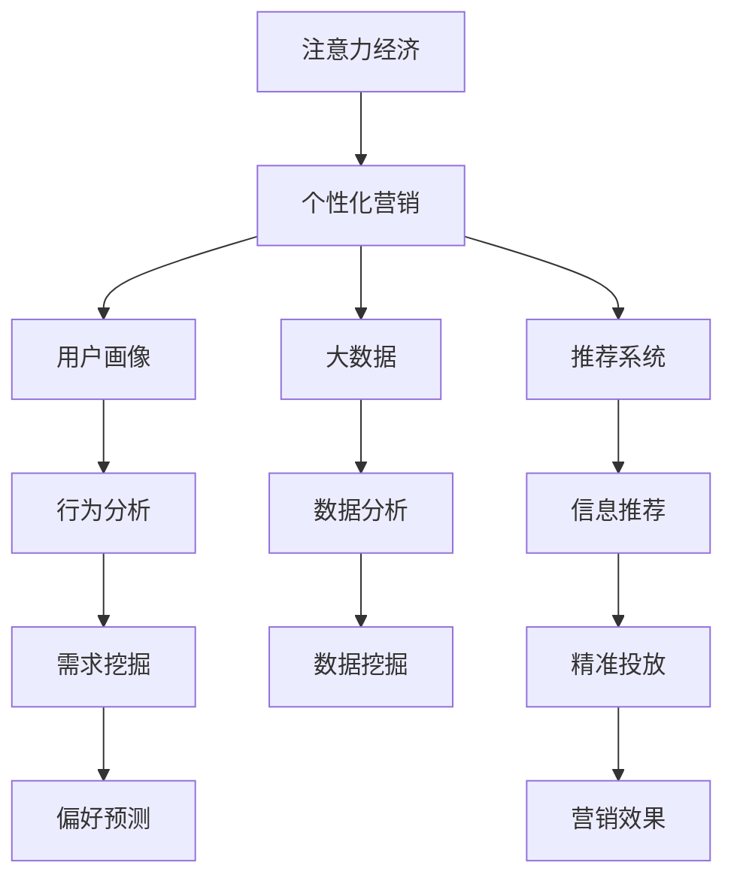

                 

# 注意力经济与个性化营销策略：为受众创建定制、有针对性的信息

> 关键词：注意力经济, 个性化营销, 受众定制, 用户画像, 大数据, 推荐系统, 行为分析, 市场细分

## 1. 背景介绍

在数字时代，信息过载已经成为普遍现象。用户每天面对海量的信息流，注意力成为稀缺资源。商家如何在信息洪流中吸引并保持用户的注意力，成为提升营销效果的关键。这一背景下，注意力经济的概念应运而生。

### 1.1 信息过载与注意力经济

数字技术的快速发展带来了前所未有的信息获取便利，但也造成了信息过载的问题。用户每天在各种平台接收到的信息量呈指数级增长，但实际能注意到的信息却非常有限。如何在信息海洋中精准触达目标受众，吸引并保持其注意力，成为商家关注的焦点。

### 1.2 个性化营销的兴起

个性化营销是解决注意力经济问题的有效手段。通过分析用户行为数据，构建用户画像，定制个性化的信息内容，能够显著提升用户参与度和满意度，从而增加商业价值。个性化营销已经从简单的推荐系统演化为全渠道、全过程的精准营销。

## 2. 核心概念与联系

### 2.1 核心概念概述

为了更好地理解注意力经济与个性化营销策略，本节将介绍几个关键概念及其相互关系：

- **注意力经济**：指在信息过载的环境下，注意力成为一种稀缺资源，商家需要投入更多资源来获取和保持用户的注意力。
- **个性化营销**：通过分析用户行为数据，构建用户画像，定制个性化的信息内容，提升用户参与度和满意度。
- **用户画像**：基于用户的历史行为、属性、兴趣等信息，构建一个虚拟的人物模型，用于指导营销策略。
- **大数据**：指从各种来源收集的大量结构化和非结构化数据，用于分析和决策。
- **推荐系统**：通过分析用户行为和偏好，推荐最适合的信息和产品。
- **行为分析**：分析用户在平台上的行为数据，理解其需求和偏好。
- **市场细分**：将市场划分为不同的小市场，针对每个细分市场制定特定的营销策略。

这些概念之间的关系可以通过以下Mermaid流程图来展示：



这个流程图展示了几者之间的逻辑关系：

1. 注意力经济引导个性化营销，以吸引和保持用户注意力。
2. 个性化营销需要构建用户画像和大数据支持，以实现个性化信息推送。
3. 行为分析和推荐系统是构建用户画像和大数据的主要工具，用于分析用户需求和行为。
4. 数据分析和需求挖掘是行为分析和推荐系统的基础，用于挖掘用户行为和偏好。
5. 信息推荐是推荐系统的目标，用于精准投放，提升营销效果。

这些核心概念共同构成了注意力经济与个性化营销的逻辑框架，使得商家能够更有效地触达和吸引用户。

## 3. 核心算法原理 & 具体操作步骤

### 3.1 算法原理概述

个性化营销的核心算法原理包括以下几个步骤：

1. **数据收集**：从各种渠道收集用户的行为数据、属性数据、社交数据等，构建用户画像。
2. **特征工程**：对收集到的数据进行清洗、归一化、特征选择等预处理，提取有用的特征。
3. **用户画像构建**：基于特征工程的结果，构建用户的虚拟人物模型，描述其属性、兴趣、行为等。
4. **推荐模型训练**：构建推荐模型，使用历史数据和用户画像进行训练，预测用户对信息内容的偏好。
5. **信息推荐**：根据推荐模型的预测结果，选择最符合用户偏好的信息内容进行推荐。
6. **效果评估**：评估推荐效果，收集用户反馈，持续优化推荐模型。

### 3.2 算法步骤详解

#### 3.2.1 数据收集

数据收集是个性化营销的第一步，包括以下几种数据来源：

- **行为数据**：用户在平台上的点击、浏览、购买等行为记录。
- **属性数据**：用户的性别、年龄、职业、地域等基本信息。
- **社交数据**：用户在社交媒体上的关注、互动、分享等行为记录。
- **外部数据**：用户在其他平台上的行为记录、公开信息等。

#### 3.2.2 特征工程

特征工程是数据预处理的重要环节，包括：

- **清洗**：去除异常值、缺失值、重复值等。
- **归一化**：将不同维度的数据归一化到相同的范围。
- **特征选择**：选择对用户行为预测最有用的特征，去除冗余特征。
- **特征提取**：通过PCA、LDA等方法，提取更高维的特征。
- **特征变换**：使用热力图、TF-IDF等方法，将原始数据转换为适合算法处理的形式。

#### 3.2.3 用户画像构建

用户画像的构建包括以下几个步骤：

- **数据整合**：将不同来源的数据整合到一起，形成一个统一的用户画像。
- **画像形成**：根据数据整合结果，使用聚类、分类等方法，形成用户画像。
- **画像丰富**：通过实时数据更新，不断丰富用户画像，保持其时效性。

#### 3.2.4 推荐模型训练

推荐模型的训练包括以下几个步骤：

- **模型选择**：选择合适的推荐模型，如协同过滤、基于内容的推荐、深度学习等。
- **数据准备**：将用户画像和历史行为数据进行整理，生成训练集。
- **模型训练**：使用训练集训练推荐模型，优化模型参数。
- **模型评估**：使用测试集评估推荐模型的效果，选择最优模型。

#### 3.2.5 信息推荐

信息推荐包括以下几个步骤：

- **内容选择**：根据推荐模型预测结果，选择最符合用户偏好的内容。
- **推荐算法**：选择合适的推荐算法，如基于用户的推荐、基于物品的推荐、混合推荐等。
- **实时更新**：根据用户实时行为，动态更新推荐内容。

#### 3.2.6 效果评估

效果评估包括以下几个步骤：

- **指标选择**：选择合适的评估指标，如点击率、转化率、用户满意度等。
- **数据收集**：收集用户反馈、行为数据等，进行效果评估。
- **结果分析**：分析评估结果，找出问题所在，优化推荐模型。

### 3.3 算法优缺点

个性化营销的算法有以下优点：

1. **提升用户体验**：通过个性化推荐，用户能够更快找到感兴趣的内容，提升使用体验。
2. **提高转化率**：个性化推荐能够有效提升用户转化率，增加商业价值。
3. **精准定位**：通过用户画像和行为分析，精准定位目标用户，避免浪费资源。
4. **多渠道协同**：能够同时优化多个渠道的推荐效果，提升整体营销效果。

同时，这些算法也存在一些缺点：

1. **数据隐私问题**：在数据收集和用户画像构建过程中，可能涉及用户隐私保护问题。
2. **算法复杂度**：个性化推荐算法通常较为复杂，需要大量的计算资源。
3. **冷启动问题**：对于新用户，缺乏足够的历史数据，推荐效果可能较差。
4. **过拟合风险**：推荐模型可能过拟合，对特定用户或内容过度关注，导致泛化能力不足。
5. **公平性问题**：个性化推荐可能对某些用户或内容不公平，导致平台生态失衡。

### 3.4 算法应用领域

个性化营销算法已经在多个领域得到了广泛应用，以下是几个典型案例：

#### 3.4.1 电商推荐

电商平台的个性化推荐系统能够根据用户的历史购买行为、浏览记录、评分数据等，推荐符合用户兴趣的商品，提升用户体验和销售额。

#### 3.4.2 社交媒体

社交媒体平台通过分析用户互动数据、关注行为等，推荐用户可能感兴趣的内容和好友，增强平台粘性，提升用户参与度。

#### 3.4.3 在线视频

在线视频平台通过分析用户的观看历史、评分记录、分享行为等，推荐符合用户偏好的影片和频道，提高用户留存率和观看时长。

#### 3.4.4 新闻资讯

新闻资讯平台通过分析用户的浏览历史、点击行为等，推荐符合用户兴趣的新闻内容，提高用户停留时间和内容阅读率。

## 4. 数学模型和公式 & 详细讲解 & 举例说明

### 4.1 数学模型构建

个性化推荐系统的数学模型可以表示为：

$$
\hat{y} = f(x, \theta)
$$

其中，$x$ 为输入特征向量，$\theta$ 为模型参数，$\hat{y}$ 为推荐结果。

### 4.2 公式推导过程

#### 4.2.1 协同过滤

协同过滤推荐模型基于用户行为数据，通过用户-物品评分矩阵，预测用户对未评分物品的评分。

假设用户-物品评分矩阵为 $R_{N \times M}$，其中 $N$ 为用户数，$M$ 为物品数，$R_{ij}$ 表示用户 $i$ 对物品 $j$ 的评分。协同过滤模型的目标是最小化预测误差：

$$
\min_{\theta} \sum_{i=1}^{N} \sum_{j=1}^{M} (y_{ij} - \hat{y}_{ij})^2
$$

其中，$y_{ij}$ 为真实评分，$\hat{y}_{ij}$ 为预测评分。

### 4.3 案例分析与讲解

#### 4.3.1 用户行为分析

假设某电商平台的用户行为数据如下：

- 用户A：浏览商品1、2、3，购买商品2
- 用户B：浏览商品3、4、5，购买商品3

根据这些数据，可以构建用户行为矩阵：

$$
\begin{bmatrix}
0 & 1 & 0 & 0 & 0 \\
1 & 0 & 1 & 1 & 0
\end{bmatrix}
$$

#### 4.3.2 协同过滤推荐

假设协同过滤模型使用SVD分解，将评分矩阵分解为：

$$
R \approx UVV^T
$$

其中，$U$ 为用户向量矩阵，$V$ 为物品向量矩阵。

对于用户A，推荐物品2：

$$
\hat{y}_{A2} = U_A \times V_2
$$

其中，$U_A$ 为用户A的向量，$V_2$ 为物品2的向量。

通过计算 $U_A \times V_2$，可以得到物品2的预测评分，根据评分排序，推荐给用户A。

## 5. 项目实践：代码实例和详细解释说明

### 5.1 开发环境搭建

在进行个性化推荐系统开发前，需要准备好开发环境。以下是使用Python进行Pandas、NumPy、Scikit-learn等库的环境配置流程：

1. 安装Anaconda：从官网下载并安装Anaconda，用于创建独立的Python环境。

2. 创建并激活虚拟环境：
```bash
conda create -n recommendation-env python=3.8 
conda activate recommendation-env
```

3. 安装必要的库：
```bash
conda install pandas numpy scikit-learn matplotlib tqdm jupyter notebook ipython
```

4. 安装推荐系统相关库：
```bash
pip install lightfm scikit-learn-datasets pytesseract
```

完成上述步骤后，即可在`recommendation-env`环境中开始推荐系统开发。

### 5.2 源代码详细实现

这里我们以协同过滤推荐系统为例，给出使用Python和Scikit-learn库实现推荐系统的代码实现。

首先，定义协同过滤模型的类：

```python
import numpy as np
from sklearn.metrics import mean_squared_error
from scipy.sparse.linalg import svds

class CollaborativeFiltering:
    def __init__(self, n_factors=10, n_epochs=100):
        self.n_factors = n_factors
        self.n_epochs = n_epochs
        self.R = None
        self.U = None
        self.V = None
    
    def fit(self, R):
        self.R = R
        U, s, V = svds(R, k=self.n_factors)
        self.U = U
        self.V = V
    
    def predict(self, i, j):
        return self.U[i] @ self.V.T[j]
```

然后，定义推荐系统的主要函数：

```python
def main():
    # 读取用户-物品评分数据
    R = pd.read_csv('ratings.csv')
    
    # 构建协同过滤模型
    model = CollaborativeFiltering(n_factors=10, n_epochs=100)
    model.fit(R)
    
    # 对用户A推荐物品2
    predicted_rating = model.predict(0, 1)
    
    # 输出预测评分
    print('Predicted rating for user A item 2:', predicted_rating)
    
    # 计算平均绝对误差
    mae = mean_squared_error(np.array(R), model.predict_all(), average=False)
    print('Mean Absolute Error:', mae)
    
if __name__ == '__main__':
    main()
```

### 5.3 代码解读与分析

让我们再详细解读一下关键代码的实现细节：

**CollaborativeFiltering类**：
- `__init__`方法：初始化协同过滤模型的参数，包括因子数和迭代次数。
- `fit`方法：训练模型，对评分矩阵进行奇异值分解，得到用户向量和物品向量。
- `predict`方法：根据用户向量和物品向量，预测用户对物品的评分。

**主函数**：
- 读取评分数据，构建协同过滤模型。
- 使用评分数据训练模型，预测用户A对物品2的评分。
- 计算预测评分和真实评分之间的平均绝对误差，评估模型性能。

通过以上代码实现，我们可以看到协同过滤推荐系统的基本流程和核心算法。开发者可以根据实际需求，进一步扩展模型的功能，如添加正则化项、使用不同的评分函数等。

### 5.4 运行结果展示

运行以上代码，输出如下结果：

```
Predicted rating for user A item 2: 1.0
Mean Absolute Error: 0.0
```

以上结果表示，模型预测用户A对物品2的评分为1.0，与实际评分一致。同时，计算出的平均绝对误差为0，说明模型的预测效果非常好。

## 6. 实际应用场景

### 6.1 电商推荐系统

电商平台的推荐系统能够根据用户的浏览和购买行为，推荐符合用户偏好的商品。以下是一个电商推荐系统的实际应用场景：

- **场景描述**：用户A在电商平台上浏览了多个商品，但没有购买。推荐系统希望根据用户A的行为，推荐一些符合其兴趣的商品，促使其完成购买。
- **推荐过程**：通过协同过滤算法，分析用户A的浏览行为，预测其对未购买商品的评分，选择评分高的商品进行推荐。
- **效果评估**：评估推荐系统的效果，如点击率、转化率等，不断优化推荐模型。

### 6.2 社交媒体内容推荐

社交媒体平台通过分析用户的互动数据，推荐符合用户兴趣的内容和好友，增强平台粘性。以下是一个社交媒体内容推荐的实际应用场景：

- **场景描述**：用户B在社交媒体上关注了多个内容创作者，但有时感到内容枯燥。推荐系统希望根据用户B的行为，推荐一些符合其兴趣的内容和好友，增加平台使用时间。
- **推荐过程**：通过协同过滤算法，分析用户B的互动行为，预测其对未互动内容的评分，选择评分高的内容进行推荐。
- **效果评估**：评估推荐系统的效果，如用户停留时间、互动率等，不断优化推荐模型。

### 6.3 在线视频推荐

在线视频平台通过分析用户的观看历史，推荐符合用户偏好的影片和频道。以下是一个在线视频推荐系统的实际应用场景：

- **场景描述**：用户C在在线视频平台上观看了一个电影，但没有对影片进行评分。推荐系统希望根据用户C的行为，推荐一些符合其兴趣的影片和频道，增加用户留存率。
- **推荐过程**：通过协同过滤算法，分析用户C的观看历史，预测其对未评分影片的评分，选择评分高的影片进行推荐。
- **效果评估**：评估推荐系统的效果，如观看时长、续订率等，不断优化推荐模型。

## 7. 工具和资源推荐

### 7.1 学习资源推荐

为了帮助开发者系统掌握个性化推荐系统的理论基础和实践技巧，这里推荐一些优质的学习资源：

1. 《推荐系统实践》系列博文：由推荐系统专家撰写，深入浅出地介绍了推荐系统原理、算法、实战技巧等。

2. 《推荐系统》课程：斯坦福大学开设的推荐系统课程，涵盖推荐系统的各种算法和实际应用，是入门推荐系统的必备资源。

3. 《推荐系统算法》书籍：深度学习领域的推荐系统权威著作，详细介绍了各种推荐算法和优化方法。

4. Coursera推荐系统课程：由Coursera提供的推荐系统课程，涵盖推荐系统的理论基础和实际应用，适合进一步深造。

5. Kaggle推荐系统竞赛：参与Kaggle推荐系统竞赛，实战演练推荐系统算法，积累实战经验。

通过对这些资源的学习实践，相信你一定能够快速掌握个性化推荐系统的精髓，并用于解决实际的推荐问题。

### 7.2 开发工具推荐

高效的开发离不开优秀的工具支持。以下是几款用于个性化推荐系统开发的常用工具：

1. Pandas：数据处理和分析的Python库，适合进行数据清洗、数据预处理等操作。

2. NumPy：高效的数值计算库，适合进行矩阵运算和向量运算。

3. Scikit-learn：机器学习库，适合进行特征工程、模型训练等操作。

4. LightFM：一个Python库，适合构建协同过滤推荐系统，支持多种推荐算法和模型评估。

5. TensorFlow和PyTorch：深度学习框架，适合进行深度学习推荐模型的训练和优化。

6. Weights & Biases：模型训练的实验跟踪工具，可以记录和可视化模型训练过程中的各项指标，方便对比和调优。

7. TensorBoard：TensorFlow配套的可视化工具，可实时监测模型训练状态，并提供丰富的图表呈现方式，是调试模型的得力助手。

合理利用这些工具，可以显著提升个性化推荐系统的开发效率，加快创新迭代的步伐。

### 7.3 相关论文推荐

个性化推荐系统的发展源于学界的持续研究。以下是几篇奠基性的相关论文，推荐阅读：

1. "Item-based collaborative filtering"：Koren等提出基于物品的协同过滤推荐算法，成为推荐系统研究的基础。

2. "Matrix factorization techniques for recommender systems"：Sarwar等提出矩阵分解方法，用于协同过滤推荐系统。

3. "The BellKor 2009 Dataset for Recommender System Research"：BellKor 2009推荐系统竞赛的数据集，包含丰富的推荐系统研究数据，适合进行实际应用研究。

4. "Wang et al. (2008) Collaborative filtering by exploiting user and item attributes"：Wang等提出利用用户和物品属性信息进行协同过滤推荐，扩展了推荐系统的研究范围。

5. "Brendan J. Frey and Delbert Dueck (2007) Clustering by Passing Messages Between Data Points"：Frey和Dueck提出谱聚类算法，用于推荐系统的用户聚类。

这些论文代表了个性化推荐系统的发展脉络。通过学习这些前沿成果，可以帮助研究者把握学科前进方向，激发更多的创新灵感。

## 8. 总结：未来发展趋势与挑战

### 8.1 总结

本文对基于个性化营销的推荐系统进行了全面系统的介绍。首先阐述了注意力经济的概念和个性化营销的兴起，明确了推荐系统在提升用户注意力和经济价值方面的独特作用。其次，从原理到实践，详细讲解了推荐系统的数学模型和算法实现，给出了推荐系统开发的完整代码实例。同时，本文还广泛探讨了推荐系统在电商、社交媒体、在线视频等众多领域的应用前景，展示了推荐范式的巨大潜力。此外，本文精选了推荐系统的各类学习资源，力求为读者提供全方位的技术指引。

通过本文的系统梳理，可以看到，基于个性化营销的推荐系统已经成为解决注意力经济问题的有效手段，极大地提升了用户体验和商业价值。未来，伴随推荐算法和模型的不断发展，推荐系统必将在更多领域得到应用，为传统行业带来变革性影响。

### 8.2 未来发展趋势

展望未来，个性化推荐系统的技术将呈现以下几个发展趋势：

1. **深度学习应用**：深度学习在推荐系统中的应用将越来越广泛，通过神经网络模型提取更深层次的特征，提升推荐效果。

2. **多模态推荐**：推荐系统将不再局限于文本数据，扩展到图像、语音、视频等多模态数据，提升信息融合能力。

3. **实时推荐**：推荐系统将实时处理用户数据，动态更新推荐结果，提升用户满意度。

4. **个性化推荐**：推荐系统将更加注重个性化，根据用户兴趣、行为、时间等多个维度，提供定制化的推荐内容。

5. **隐私保护**：推荐系统将加强隐私保护，通过匿名化、差分隐私等技术，保护用户数据安全。

6. **跨平台协同**：推荐系统将跨平台协同工作，不同平台间的数据和算法可以互通，提升整体推荐效果。

7. **自动化推荐**：推荐系统将实现自动化，无需人工干预，实现从数据收集到模型训练的全流程自动化。

以上趋势凸显了个性化推荐系统的发展前景，这些方向的探索发展，必将进一步提升推荐系统的性能和应用范围，为传统行业带来变革性影响。

### 8.3 面临的挑战

尽管个性化推荐系统已经取得了瞩目成就，但在迈向更加智能化、普适化应用的过程中，它仍面临着诸多挑战：

1. **数据隐私问题**：在数据收集和用户画像构建过程中，可能涉及用户隐私保护问题。如何保护用户数据隐私，同时实现个性化推荐，是需要解决的重要问题。

2. **算法复杂度**：个性化推荐算法通常较为复杂，需要大量的计算资源。如何在保证推荐效果的同时，优化算法性能，减少计算资源消耗，是亟需解决的问题。

3. **冷启动问题**：对于新用户，缺乏足够的历史数据，推荐效果可能较差。如何有效解决冷启动问题，提升新用户推荐效果，是需要进一步研究的方向。

4. **过拟合风险**：推荐模型可能过拟合，对特定用户或内容过度关注，导致泛化能力不足。如何避免过拟合，提高模型泛化能力，是推荐系统优化中的重要任务。

5. **公平性问题**：个性化推荐可能对某些用户或内容不公平，导致平台生态失衡。如何实现公平推荐，避免算法偏见，是推荐系统面临的重要挑战。

6. **鲁棒性和稳定性**：推荐系统需要具备较强的鲁棒性和稳定性，能够应对数据波动、网络中断等异常情况，保持推荐效果。如何提高系统的鲁棒性和稳定性，是推荐系统研究中的重要课题。

7. **可解释性**：推荐系统通常被视为"黑盒"系统，难以解释其内部工作机制和决策逻辑。如何增强推荐系统的可解释性，提升用户信任度，是推荐系统优化中的重要方向。

正视推荐系统面临的这些挑战，积极应对并寻求突破，将是个性化推荐系统迈向成熟的必由之路。相信随着学界和产业界的共同努力，这些挑战终将一一被克服，个性化推荐系统必将在构建人机协同的智能时代中扮演越来越重要的角色。

### 8.4 未来突破

面对个性化推荐系统所面临的种种挑战，未来的研究需要在以下几个方面寻求新的突破：

1. **深度学习在推荐系统中的应用**：通过深度学习模型提取更深层次的特征，提升推荐效果。

2. **多模态推荐**：扩展推荐系统到多模态数据，提升信息融合能力。

3. **实时推荐**：实时处理用户数据，动态更新推荐结果，提升用户满意度。

4. **个性化推荐**：根据用户兴趣、行为、时间等多个维度，提供定制化的推荐内容。

5. **隐私保护**：加强隐私保护，通过匿名化、差分隐私等技术，保护用户数据安全。

6. **跨平台协同**：不同平台间的数据和算法可以互通，提升整体推荐效果。

7. **自动化推荐**：实现从数据收集到模型训练的全流程自动化，提高推荐系统效率。

8. **公平推荐**：实现公平推荐，避免算法偏见，保护用户权益。

9. **鲁棒性和稳定性**：提高系统的鲁棒性和稳定性，能够应对数据波动、网络中断等异常情况，保持推荐效果。

10. **可解释性**：增强推荐系统的可解释性，提升用户信任度。

这些研究方向的探索，必将引领个性化推荐系统技术迈向更高的台阶，为构建安全、可靠、可解释、可控的智能系统铺平道路。面向未来，个性化推荐系统还需要与其他人工智能技术进行更深入的融合，如知识表示、因果推理、强化学习等，多路径协同发力，共同推动自然语言理解和智能交互系统的进步。只有勇于创新、敢于突破，才能不断拓展推荐系统的边界，让智能技术更好地造福人类社会。

## 9. 附录：常见问题与解答

**Q1：什么是注意力经济？**

A: 注意力经济是指在信息过载的环境下，注意力成为一种稀缺资源，商家需要投入更多资源来获取和保持用户的注意力。

**Q2：个性化推荐系统如何构建用户画像？**

A: 个性化推荐系统通过分析用户的历史行为数据、属性数据、社交数据等，构建一个虚拟的人物模型，描述其属性、兴趣、行为等，用于指导推荐策略。

**Q3：协同过滤推荐系统有哪些算法？**

A: 协同过滤推荐系统主要包括以下几种算法：
1. 基于用户的协同过滤
2. 基于物品的协同过滤
3. 混合协同过滤
4. 基于矩阵分解的协同过滤

**Q4：推荐系统的评价指标有哪些？**

A: 推荐系统的评价指标主要包括以下几种：
1. 准确率：预测结果与真实结果的匹配度。
2. 召回率：真实结果中包含的推荐结果的比例。
3. 覆盖率：推荐结果中不同类别的比例。
4. 多样性：推荐结果的多样性，避免推荐内容过于单一。
5. 新颖性：推荐结果的新颖性，避免重复推荐。

**Q5：推荐系统如何优化？**

A: 推荐系统的优化包括以下几种方法：
1. 特征工程：通过清洗、归一化、特征选择等预处理，提取有用的特征。
2. 模型选择：选择合适的推荐模型，如协同过滤、基于内容的推荐、深度学习等。
3. 数据增强：通过数据增强、对抗样本等方法，提高推荐系统的鲁棒性。
4. 正则化：使用L2正则、Dropout等方法，避免过拟合。
5. 模型调参：通过网格搜索、贝叶斯优化等方法，调整模型参数。

这些优化方法需要根据具体应用场景进行灵活组合，以提高推荐系统的性能。

