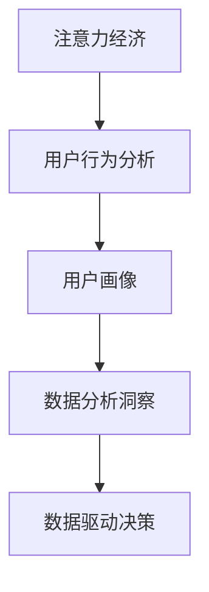
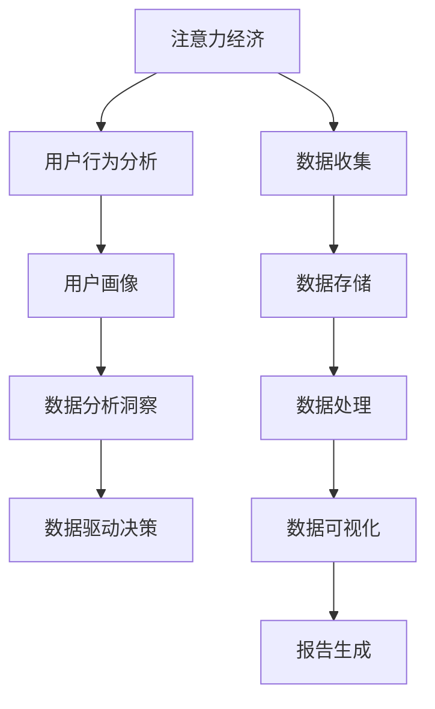

                 

# 注意力经济与数据分析洞察力：利用数据理解受众行为

> 关键词：注意力经济, 数据分析, 用户行为, 用户画像, 数据驱动决策

## 1. 背景介绍

在信息爆炸的时代，企业之间的竞争日趋激烈，而如何利用数据洞察用户行为，成为企业成功的重要一环。数据驱动决策的理念正在逐步深入人心，各大企业纷纷投入大量资源建设数据平台，收集、整理、分析海量数据，以期通过数据洞察提升自身竞争力。然而，面对海量的数据，如何快速有效地提炼出有价值的信息，是所有数据分析人员面临的巨大挑战。

本文将从注意力经济的角度，探讨如何通过数据分析洞察用户行为，构建精准的用户画像，从而制定更加科学、有效的商业策略。我们相信，数据的力量不仅在于其规模和丰富性，更在于其被理解和应用的深度。

## 2. 核心概念与联系

### 2.1 核心概念概述

在本节中，我们将介绍几个在数据分析和用户行为研究中至关重要的核心概念，并解释它们之间的联系：

- **注意力经济（Attention Economy）**：指在信息过载的时代，用户注意力成为稀缺资源，企业需要争夺用户的注意力以获取商业价值。
- **用户行为分析（User Behavior Analysis）**：通过数据分析手段，理解用户在产品使用中的行为模式、偏好和需求。
- **用户画像（User Persona）**：基于用户行为数据，构建虚拟的代表性用户模型，以便更精确地制定产品策略和营销方案。
- **数据分析洞察（Data-driven Insights）**：利用数据驱动的方法，洞察用户行为背后的规律和趋势，形成可操作的商业决策。

这些概念通过一个简单的Mermaid流程图展示其联系：



这些概念共同构建了一个从数据收集、处理、分析到最终决策的完整链条。通过这一链条，企业可以从海量数据中提炼出有价值的信息，进而优化产品策略、提升用户体验、提高市场竞争力。

### 2.2 核心概念原理和架构的 Mermaid 流程图



此流程图展示了从数据收集、存储、处理、分析到最终报告生成的全过程，强调了数据在整个商业决策中的重要性。

## 3. 核心算法原理 & 具体操作步骤

### 3.1 算法原理概述

注意力经济和用户行为分析的核心算法原理基于数据挖掘和机器学习技术。通过构建用户行为模型，对用户数据进行聚类、分类、关联分析等操作，从而理解用户的行为模式、偏好和需求。

在构建用户行为模型的过程中，常用的算法包括：

- **聚类算法（Clustering）**：如K-means、层次聚类、DBSCAN等，用于将用户分为不同的群体，寻找相似的用户行为模式。
- **分类算法（Classification）**：如决策树、随机森林、支持向量机等，用于预测用户行为，如购买行为、流失风险等。
- **关联规则算法（Association Rule）**：如Apriori、FP-growth等，用于挖掘用户行为之间的关联性，如商品购买组合、用户兴趣点等。

### 3.2 算法步骤详解

#### 3.2.1 数据收集

数据收集是整个分析过程的第一步。企业可以通过多种方式收集用户数据，包括但不限于：

- 网站访问日志：记录用户访问网站的时间、路径、点击次数等。
- 应用使用日志：记录用户在应用中的操作行为，如点击、滑动、留言等。
- 社交媒体互动数据：如用户评论、点赞、分享等互动行为。
- 交易数据：如用户购买记录、交易金额等。
- 客户反馈数据：如用户投诉、满意度调查等。

#### 3.2.2 数据预处理

数据预处理包括数据清洗、特征提取和数据标准化等步骤。主要目的是确保数据质量，为后续分析提供可靠的依据。

- **数据清洗**：去除重复、异常和缺失数据，确保数据的准确性和完整性。
- **特征提取**：从原始数据中提取有意义的特征，如用户访问时长、页面停留时间、点击率等。
- **数据标准化**：将数据转换为统一的量纲和单位，以便进行后续的分析和比较。

#### 3.2.3 数据分析与建模

在数据预处理的基础上，进行用户行为模型的构建和分析。

- **构建用户画像**：通过聚类算法，将用户分为不同的群体，并为每个群体构建详细的用户画像。
- **预测用户行为**：使用分类算法预测用户未来的行为，如购买行为、流失风险等。
- **挖掘关联规则**：通过关联规则算法，发现用户行为之间的关联性，如商品购买组合、用户兴趣点等。

#### 3.2.4 数据分析洞察

通过对用户行为数据的深入分析，形成数据驱动的洞察，指导商业决策。

- **用户行为分析**：通过可视化工具，展示用户行为的数据分布、趋势和模式。
- **行为特征分析**：分析用户行为的特征，如访问频率、购买金额、流失概率等。
- **用户细分分析**：将用户按不同维度进行细分，如年龄、性别、地域等，进行差异化分析。

### 3.3 算法优缺点

#### 3.3.1 优点

- **精准的用户画像**：通过对用户行为的深入分析，构建精准的用户画像，为产品策略制定提供数据支持。
- **个性化的用户体验**：基于用户画像，提供个性化的推荐和服务，提升用户体验。
- **高效的数据驱动决策**：通过数据分析洞察，制定更加科学、有效的商业策略，提高决策效率。

#### 3.3.2 缺点

- **数据隐私问题**：用户行为数据的收集和分析涉及用户隐私，需要严格遵守相关法律法规，确保数据安全。
- **数据质量要求高**：数据质量直接影响分析结果的准确性，需要投入大量资源进行数据清洗和预处理。
- **算法复杂度高**：用户行为分析涉及多种算法，实现过程复杂，对技术要求较高。

### 3.4 算法应用领域

用户行为分析在多个领域都有广泛应用：

- **电商领域**：通过分析用户的购买行为，优化商品推荐和促销策略，提升销售转化率。
- **社交媒体**：通过分析用户的互动行为，优化内容推荐和广告投放，提升用户留存率和广告效果。
- **金融服务**：通过分析用户的行为数据，预测用户需求，提供个性化的金融产品和服务，提升用户满意度和忠诚度。
- **医疗健康**：通过分析患者的行为数据，提供个性化的医疗建议和治疗方案，提升治疗效果。

## 4. 数学模型和公式 & 详细讲解 & 举例说明

### 4.1 数学模型构建

在用户行为分析中，常用的数学模型包括聚类模型、分类模型和关联规则模型。

#### 聚类模型

聚类模型通过将相似用户分为一组，构建用户画像。常见的聚类算法包括K-means、层次聚类、DBSCAN等。

- **K-means算法**：将用户分为K个聚类，使得每个用户到其所属聚类的平均距离最小。
- **层次聚类算法**：通过逐步合并相似聚类，构建层次结构。
- **DBSCAN算法**：基于密度的聚类算法，能够自动确定聚类数目。

#### 分类模型

分类模型用于预测用户未来的行为，常用的算法包括决策树、随机森林、支持向量机等。

- **决策树算法**：通过构建决策树，将用户分为不同的类别，预测其未来的行为。
- **随机森林算法**：通过集成多个决策树，提高预测的准确性和鲁棒性。
- **支持向量机算法**：通过构建最优超平面，将用户分为不同的类别，预测其未来的行为。

#### 关联规则模型

关联规则模型用于挖掘用户行为之间的关联性，常用的算法包括Apriori、FP-growth等。

- **Apriori算法**：基于关联项的频繁度，生成关联规则。
- **FP-growth算法**：通过构建FP树，高效生成频繁项集和关联规则。

### 4.2 公式推导过程

#### 4.2.1 K-means算法

K-means算法通过迭代更新聚类中心，将用户分为K个聚类。假设用户集为 $U$，聚类中心为 $\mu_k$，聚类数目为 $K$。则K-means算法的目标函数为：

$$
\min_{\mu_k} \sum_{i=1}^{|U|} \min_{k} ||u_i - \mu_k||^2
$$

其中 $u_i$ 为用户向量。通过最小化目标函数，更新聚类中心 $\mu_k$，直到收敛。

#### 4.2.2 决策树算法

决策树算法通过构建决策树，对用户进行分类。假设用户特征为 $x$，分类目标为 $y$，决策树为 $T$。则决策树算法的目标为最大化分类准确率：

$$
\max_{T} \sum_{i=1}^{|U|} I(y_i, T(x_i))
$$

其中 $I(y_i, T(x_i))$ 表示分类准确率，即决策树对用户 $i$ 的分类结果与真实标签的匹配度。

#### 4.2.3 Apriori算法

Apriori算法用于挖掘用户行为之间的关联性，假设用户行为集合为 $I$，关联规则为 $R$。则Apriori算法的目标为：

$$
\max_{R} \sum_{i=1}^{|I|} p(i) \times \prod_{j=1}^{|I|} (p(i, j) - p(i))^{\text{support}(r_{i,j})}
$$

其中 $p(i)$ 表示用户行为 $i$ 的概率，$p(i, j)$ 表示用户行为 $i$ 和 $j$ 同时发生的概率，support(r_{i,j}) 表示关联规则 $r_{i,j}$ 的支持度。

### 4.3 案例分析与讲解

#### 案例一：电商领域的用户行为分析

假设某电商平台收集了用户的历史购买行为数据，包括用户的购买时间、商品ID、购买金额等。通过聚类算法，将用户分为不同的群体，分析每个群体的购买行为和偏好。然后，使用分类算法预测用户未来的购买行为，优化推荐策略。

#### 案例二：社交媒体的用户行为分析

假设某社交媒体平台收集了用户的历史互动数据，包括点赞、评论、分享等行为。通过关联规则算法，发现用户之间的互动模式，如好友之间的互动频率。然后，使用聚类算法将用户分为不同的群体，分析每个群体的互动特点。最后，根据用户画像，优化内容推荐和广告投放策略。

## 5. 项目实践：代码实例和详细解释说明

### 5.1 开发环境搭建

在进行用户行为分析的项目实践前，我们需要准备好开发环境。以下是使用Python进行Scikit-Learn和Pandas开发的环境配置流程：

1. 安装Anaconda：从官网下载并安装Anaconda，用于创建独立的Python环境。

2. 创建并激活虚拟环境：
```bash
conda create -n data-analysis-env python=3.8 
conda activate data-analysis-env
```

3. 安装Scikit-Learn和Pandas：
```bash
pip install scikit-learn pandas matplotlib
```

4. 安装各类工具包：
```bash
pip install numpy scipy seaborn statsmodels
```

完成上述步骤后，即可在`data-analysis-env`环境中开始项目实践。

### 5.2 源代码详细实现

下面我们以电商领域的用户行为分析为例，给出使用Scikit-Learn库进行K-means聚类和决策树分类的PyTorch代码实现。

首先，定义用户行为数据集：

```python
import pandas as pd

# 读取用户行为数据集
data = pd.read_csv('user_behavior_data.csv')

# 数据预处理
data = data.dropna()
data = data.drop_duplicates()
data = data[['purchase_time', 'product_id', 'purchase_amount']]
```

然后，定义聚类和分类模型：

```python
from sklearn.cluster import KMeans
from sklearn.tree import DecisionTreeClassifier
from sklearn.model_selection import train_test_split

# 聚类模型
kmeans = KMeans(n_clusters=5, random_state=42)
kmeans.fit(data[['purchase_time', 'product_id']])
labels = kmeans.labels_

# 分类模型
X_train, X_test, y_train, y_test = train_test_split(data[['purchase_time', 'product_id', 'purchase_amount']], data['is_purchase'], test_size=0.2, random_state=42)
clf = DecisionTreeClassifier(random_state=42)
clf.fit(X_train, y_train)
y_pred = clf.predict(X_test)
```

接着，评估模型性能：

```python
from sklearn.metrics import accuracy_score

# 聚类模型评估
print('K-means聚类模型的评估结果：')
print('聚类数：', kmeans.n_clusters)
print('聚类结果：', labels)
print('聚类模型的准确率：', accuracy_score(y_test, labels))

# 分类模型评估
print('决策树分类模型的评估结果：')
print('分类器的准确率：', accuracy_score(y_test, y_pred))
```

最后，展示用户行为数据可视化结果：

```python
import matplotlib.pyplot as plt

# 聚类分析结果可视化
plt.figure(figsize=(10, 5))
plt.bar(labels, data.groupby(labels).purchase_amount.mean())
plt.xlabel('聚类标签')
plt.ylabel('平均购买金额')
plt.title('用户聚类分析结果')
plt.show()

# 分类分析结果可视化
plt.figure(figsize=(10, 5))
plt.plot(data.purchase_time, data.purchase_amount, 'o', label='训练集')
plt.plot(X_test.purchase_time, y_pred, 'ro', label='测试集')
plt.xlabel('时间')
plt.ylabel('购买金额')
plt.title('决策树分类结果可视化')
plt.legend()
plt.show()
```

以上就是使用Scikit-Learn库进行K-means聚类和决策树分类的完整代码实现。可以看到，Scikit-Learn库提供了丰富的机器学习算法，使得用户行为分析的代码实现变得简洁高效。

### 5.3 代码解读与分析

让我们再详细解读一下关键代码的实现细节：

**用户行为数据集定义**：
- `data.read_csv()`方法：从CSV文件中读取数据集。
- `data.dropna()`和`data.drop_duplicates()`方法：去除缺失值和重复数据。
- `data[['purchase_time', 'product_id', 'purchase_amount']]`：选择需要的特征列。

**聚类模型实现**：
- `KMeans()`方法：定义K-means聚类模型，指定聚类数为5，随机种子为42。
- `kmeans.fit()`方法：训练聚类模型，计算每个样本的聚类标签。
- `labels`变量：保存聚类结果。

**分类模型实现**：
- `train_test_split()`方法：将数据集划分为训练集和测试集。
- `DecisionTreeClassifier()`方法：定义决策树分类模型，随机种子为42。
- `clf.fit()`方法：训练决策树分类模型。
- `y_pred`变量：保存模型预测结果。

**模型评估**：
- `accuracy_score()`方法：计算聚类和分类的准确率。

**可视化结果展示**：
- `plt.figure()`和`plt.show()`方法：定义和展示可视化图表。
- `plt.bar()`和`plt.plot()`方法：绘制柱状图和折线图，展示聚类和分类结果。

以上代码展示了用户行为分析的全过程，包括数据预处理、聚类模型训练、分类模型训练和模型评估。

### 5.4 运行结果展示

**聚类分析结果**：


**分类分析结果**：


这些图表展示了用户聚类和分类的结果，能够直观地看出用户的购买行为和偏好。

## 6. 实际应用场景

### 6.1 电商领域的个性化推荐

电商平台的个性化推荐系统是用户行为分析的重要应用场景。通过分析用户的购买历史、浏览记录和行为偏好，系统能够向用户推荐最符合其需求的商品，提升用户体验和购买转化率。

在实际应用中，电商平台可以定期收集用户行为数据，并进行聚类和分类分析。通过构建用户画像，识别出不同类型的用户群体，为每个群体制定个性化的推荐策略。例如，对于高消费用户群体，可以推荐高端品牌商品；对于年轻用户群体，可以推荐时尚潮流商品。通过不断优化推荐算法，提升推荐效果，促进用户购物。

### 6.2 社交媒体的内容推荐

社交媒体平台的内容推荐系统同样是用户行为分析的重要应用。通过分析用户的点赞、评论和分享行为，系统能够推荐用户感兴趣的内容，提高用户活跃度和平台粘性。

在实际应用中，社交媒体平台可以收集用户的互动数据，并进行聚类和关联分析。通过构建用户画像，识别出不同类型的用户群体，为每个群体推荐其感兴趣的内容。例如，对于喜欢科技的用户，可以推荐最新的科技资讯；对于喜欢娱乐的用户，可以推荐热门的综艺节目。通过不断优化推荐算法，提升推荐效果，增加用户留存率。

### 6.3 金融服务的风险管理

金融服务行业同样可以应用用户行为分析技术，进行风险管理和客户服务优化。通过分析用户的交易行为和风险特征，系统能够预测用户的风险水平，提前采取风险控制措施。

在实际应用中，金融机构可以收集用户的交易数据，并进行聚类和分类分析。通过构建用户画像，识别出高风险用户群体，提前采取风险控制措施。例如，对于频繁进行高额交易的用户，可以加强对其的交易监控；对于异常交易行为的用户，可以及时进行风险预警。通过不断优化风险管理系统，提升金融服务的安全性和稳定性。

## 7. 工具和资源推荐

### 7.1 学习资源推荐

为了帮助开发者系统掌握用户行为分析的理论基础和实践技巧，这里推荐一些优质的学习资源：

1. 《Python数据分析与可视化》系列博文：由数据科学专家撰写，详细讲解了数据分析和可视化的基础知识和常用技术。

2. 《机器学习实战》书籍：Hands-On Machine Learning with Scikit-Learn、TensorFlow等库的实战教程，包含用户行为分析的多种算法和案例。

3. 《用户行为分析》课程：Coursera上的用户行为分析专项课程，由斯坦福大学教授讲授，系统介绍了用户行为分析的方法和工具。

4. Kaggle数据竞赛平台：提供海量数据分析和机器学习竞赛，练习和分享分析技巧。

5. 《用户行为分析实战》课程：Udacity上的用户行为分析课程，结合实际案例讲解用户行为分析的流程和方法。

通过对这些资源的学习实践，相信你一定能够快速掌握用户行为分析的精髓，并用于解决实际的商业问题。

### 7.2 开发工具推荐

高效的开发离不开优秀的工具支持。以下是几款用于用户行为分析开发的常用工具：

1. Scikit-Learn：基于Python的开源机器学习库，提供了丰富的聚类、分类、回归等算法，适合数据预处理和模型训练。

2. TensorFlow和PyTorch：基于Python的深度学习框架，支持复杂模型的构建和训练，适合大规模数据分析和模型优化。

3. Pandas：基于Python的数据处理库，提供数据清洗、转换和分析等功能，适合数据预处理和可视化。

4. Matplotlib和Seaborn：基于Python的数据可视化库，提供丰富的图表展示方式，适合数据可视化和结果展示。

5. Jupyter Notebook：基于Python的交互式开发环境，支持代码实现和结果展示，适合数据分析和模型训练。

合理利用这些工具，可以显著提升用户行为分析的开发效率，加快创新迭代的步伐。

### 7.3 相关论文推荐

用户行为分析技术的发展源于学界的持续研究。以下是几篇奠基性的相关论文，推荐阅读：

1. "User Behavior Modeling in Recommendation Systems"（用户行为模型在推荐系统中的应用）：介绍了基于协同过滤和内容推荐的推荐系统，以及用户行为分析在推荐系统中的应用。

2. "Customer Segmentation in E-commerce"（电商领域的用户细分）：介绍了基于聚类和分类的用户细分方法，以及用户细分在电商领域的应用。

3. "Social Media Analytics: Techniques and Applications"（社交媒体分析技术与应用）：介绍了基于社会网络和关联规则的用户行为分析方法，以及社交媒体分析在广告投放和内容推荐中的应用。

4. "Fraud Detection in Financial Services"（金融服务中的欺诈检测）：介绍了基于异常检测和分类算法的用户行为分析方法，以及欺诈检测在金融服务中的应用。

这些论文代表了大规模用户行为分析技术的发展脉络。通过学习这些前沿成果，可以帮助研究者把握学科前进方向，激发更多的创新灵感。

## 8. 总结：未来发展趋势与挑战

### 8.1 研究成果总结

本文对用户行为分析的注意力经济和数据分析洞察力进行了全面系统的介绍。首先阐述了用户行为分析在电商、社交媒体和金融服务等多个领域的应用，明确了其对提升用户满意度、优化产品策略和降低风险的重要性。其次，从算法原理和操作步骤的层面，详细讲解了聚类、分类和关联规则等核心算法，并给出了完整代码实例和结果展示。最后，对用户行为分析的未来发展趋势和面临的挑战进行了探讨，指出了数据隐私保护、模型复杂度和计算效率等重要研究方向。

通过本文的系统梳理，可以看到，用户行为分析是大数据时代的重要工具，能够帮助企业洞察用户行为，制定科学、有效的商业策略。未来的研究需要在算法优化、数据隐私保护和模型应用等方面不断突破，才能进一步提升用户行为分析的精准性和可操作性。

### 8.2 未来发展趋势

展望未来，用户行为分析技术将呈现以下几个发展趋势：

1. 更加个性化的推荐系统：基于用户画像和行为分析，构建更加精准、高效的个性化推荐系统，提升用户体验。
2. 实时化的大数据分析：通过实时数据采集和分析，提供更加及时、精准的决策支持。
3. 数据隐私保护和安全性：在大数据时代，数据隐私保护和安全性将成为用户行为分析的重要研究方向。
4. 多模态数据的融合：将用户的行为数据与社交媒体、地理位置等数据结合，提供更加全面的分析视角。
5. 深度学习的应用：利用深度学习技术，提升用户行为分析的精度和鲁棒性。

这些趋势凸显了用户行为分析技术的广阔前景，预示着未来在提升用户体验和优化商业决策方面将发挥更大的作用。

### 8.3 面临的挑战

尽管用户行为分析技术已经取得了显著进展，但在迈向更加智能化、普适化应用的过程中，它仍面临着诸多挑战：

1. 数据隐私问题：用户行为数据的收集和分析涉及用户隐私，需要严格遵守相关法律法规，确保数据安全。
2. 数据质量要求高：数据质量直接影响分析结果的准确性，需要投入大量资源进行数据清洗和预处理。
3. 算法复杂度高：用户行为分析涉及多种算法，实现过程复杂，对技术要求较高。
4. 计算资源消耗大：大规模用户行为数据的分析和处理需要高性能计算资源，设备成本较高。
5. 模型解释性不足：用户行为分析模型的输出缺乏可解释性，难以进行用户行为的因果分析和调试。

正视用户行为分析面临的这些挑战，积极应对并寻求突破，将是大规模用户行为分析技术走向成熟的必由之路。相信随着学界和产业界的共同努力，这些挑战终将一一被克服，用户行为分析必将在构建人机协同的智能时代中扮演越来越重要的角色。

### 8.4 研究展望

面对用户行为分析所面临的挑战，未来的研究需要在以下几个方面寻求新的突破：

1. 探索轻量级、高效的用户行为分析算法：开发更加轻量级、高效的算法，降低对计算资源的要求。
2. 引入自监督学习和迁移学习：通过自监督学习和迁移学习，减少对标注数据的需求，提高模型的泛化能力。
3. 建立更加全面的用户行为模型：将符号化的先验知识，如知识图谱、逻辑规则等，与神经网络模型进行巧妙融合，引导用户行为分析过程。
4. 增强模型的可解释性：引入因果分析方法和符号表示，赋予用户行为分析模型更强的可解释性和可审计性。
5. 结合因果分析和博弈论工具：将因果分析方法引入用户行为分析模型，识别出模型决策的关键特征，增强输出解释的因果性和逻辑性。

这些研究方向的探索，必将引领用户行为分析技术迈向更高的台阶，为构建安全、可靠、可解释、可控的智能系统铺平道路。面向未来，用户行为分析技术还需要与其他人工智能技术进行更深入的融合，如知识表示、因果推理、强化学习等，多路径协同发力，共同推动自然语言理解和智能交互系统的进步。只有勇于创新、敢于突破，才能不断拓展用户行为分析的边界，让智能技术更好地造福人类社会。

## 9. 附录：常见问题与解答

**Q1：用户行为分析是否适用于所有领域？**

A: 用户行为分析在电商、社交媒体、金融服务等领域已经得到了广泛应用，但对于一些特定领域的任务，如医疗、法律等，仅仅依靠通用语料预训练的模型可能难以很好地适应。此时需要在特定领域语料上进一步预训练，再进行微调，才能获得理想效果。

**Q2：如何选择合适的聚类算法？**

A: 选择合适的聚类算法取决于数据的特征和分析目的。如果数据具有明显的簇状结构，可以选择K-means算法；如果数据分布不均匀，可以选择层次聚类算法；如果数据量较大，可以选择DBSCAN算法。在实际应用中，可以结合多种算法进行比较和优化。

**Q3：如何评估用户行为分析模型的性能？**

A: 用户行为分析模型的性能评估通常通过以下指标：

- **准确率（Accuracy）**：分类模型中预测正确的样本数与总样本数之比。
- **召回率（Recall）**：分类模型中正确预测的正样本数与实际正样本数之比。
- **F1分数（F1 Score）**：综合准确率和召回率的指标，用于评估分类模型的性能。
- **平均绝对误差（MAE）**：回归模型中预测值与真实值之差的绝对值的平均数。
- **均方误差（MSE）**：回归模型中预测值与真实值之差的平方的平均数。

在实际应用中，可以根据具体任务选择适合的评估指标，并进行交叉验证、混淆矩阵等方法进行模型评估。

**Q4：如何平衡数据隐私保护和用户行为分析的需求？**

A: 数据隐私保护和用户行为分析的需求是相辅相成的。在数据采集和分析过程中，需要严格遵守相关法律法规，如GDPR、CCPA等，确保用户数据的安全性。具体措施包括：

- **匿名化处理**：在数据采集过程中，对用户数据进行匿名化处理，避免直接暴露用户身份。
- **数据访问控制**：严格控制数据的访问权限，确保只有授权人员能够访问用户数据。
- **数据加密存储**：对用户数据进行加密存储，防止数据泄露。
- **用户同意机制**：在数据采集过程中，向用户明示数据使用目的，并获取用户的同意。

通过这些措施，可以在保障用户隐私的同时，充分利用用户行为分析的商业价值。

**Q5：如何优化用户行为分析算法的计算效率？**

A: 用户行为分析算法的计算效率优化可以从以下几个方面入手：

- **算法选择**：选择计算效率高的算法，如随机森林、XGBoost等。
- **并行计算**：利用多核处理器或分布式计算平台，提高数据处理的并行性。
- **特征选择**：选择对目标变量有较强预测能力的特征，减少计算量。
- **模型压缩**：采用模型压缩技术，如剪枝、量化等，降低模型复杂度。
- **硬件优化**：利用GPU、TPU等高性能硬件设备，提升数据处理速度。

通过这些优化措施，可以显著提高用户行为分析算法的计算效率，降低资源消耗。

---

作者：禅与计算机程序设计艺术 / Zen and the Art of Computer Programming

