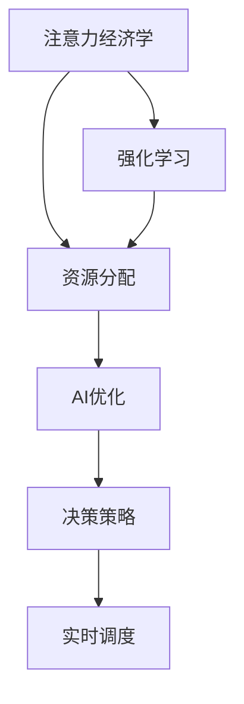

                 

## 1. 背景介绍

### 1.1 问题由来

随着人工智能技术的迅猛发展，AI在资源分配领域的应用愈发广泛。从数据中心的服务器调度到网络系统的路由选择，从自动驾驶的交通管理到农业生产的资源配置，AI正在改变着资源分配的方式。然而，面对庞大且复杂的资源管理任务，如何高效、公平地进行资源分配，成为亟待解决的问题。

### 1.2 问题核心关键点

资源分配的AI化过程中，核心挑战包括：
- **效率与公平**：如何在提升资源利用效率的同时，确保分配的公平性。
- **动态适应**：如何实时适应环境变化，动态调整资源分配策略。
- **鲁棒性与稳健性**：如何保证系统在面对异常情况和攻击时，仍能稳定运行。
- **透明性与可解释性**：如何赋予资源分配决策可解释性，增强用户信任。

本文将围绕注意力经济学的视角，深入探讨AI在资源分配中的应用，并提出一些理论和实践上的解决方案，以期为资源管理提供科学、高效、公平的AI算法。

## 2. 核心概念与联系

### 2.1 核心概念概述

- **注意力经济学**：是经济学的一个分支，研究在经济活动中如何分配注意力资源，从而优化决策过程和提升效率。
- **资源分配**：将有限的资源（如计算资源、带宽、能源等）分配到多个请求或任务的过程。
- **注意力机制**：AI中一种重要的机制，通过关注或忽视某些输入信息，提高模型对重要信息的敏感度。
- **强化学习**：一种AI训练方法，通过与环境的互动，学习最优的决策策略。

这些核心概念之间存在紧密联系，通过注意力经济学与强化学习，可以在AI的帮助下更高效、公平地进行资源分配。

### 2.2 核心概念原理和架构的 Mermaid 流程图



这个流程图展示了注意力经济学与资源分配之间的关系，以及强化学习如何通过AI优化实现高效公平的决策策略，从而实现资源的实时调度。

## 3. 核心算法原理 & 具体操作步骤

### 3.1 算法原理概述

基于注意力经济学和强化学习的资源分配算法，通过不断与环境互动，学习最优的资源分配策略，并在动态环境中实时调整决策。该算法主要分为以下几个步骤：

1. **状态空间构建**：定义资源分配问题中的状态空间，包括资源类型、数量、可用性等信息。
2. **奖励函数设计**：根据决策目标（如最大化资源利用率、最小化等待时间等）设计奖励函数。
3. **策略学习**：使用强化学习算法（如Q-learning、DQN等）学习最优的决策策略。
4. **实时调度**：根据学习到的决策策略，实时调整资源分配方案，优化系统性能。

### 3.2 算法步骤详解

#### 3.2.1 状态空间构建

资源分配问题的状态空间可以分为以下几个维度：
- **资源维度**：包括计算资源、存储资源、网络带宽等。
- **请求维度**：包括不同类型和优先级的请求。
- **环境维度**：包括实时负载、网络状况、用户反馈等。

状态空间的具体表示方式有多种，如向量表示、图表示、马尔可夫决策过程（MDP）等。

#### 3.2.2 奖励函数设计

奖励函数的设计需要兼顾效率和公平，具体可以包括：
- **资源利用率**：最大化资源的利用率，避免资源浪费。
- **等待时间**：最小化请求的等待时间，提高用户体验。
- **公平性**：确保不同类型和优先级的请求得到公平的资源分配。

#### 3.2.3 策略学习

强化学习算法通过与环境互动，逐步优化决策策略。其主要步骤如下：
1. **策略初始化**：随机选择一个初始策略。
2. **状态感知**：根据当前状态，选择采取的行动。
3. **状态更新**：观察环境的反馈，更新状态。
4. **奖励计算**：根据行动和反馈，计算奖励。
5. **策略更新**：根据奖励和策略，更新决策策略。

#### 3.2.4 实时调度

实时调度是资源分配的核心步骤，需要根据当前状态和策略，动态调整资源分配方案。具体实现方式包括：
- **时间分片**：将时间划分为多个分片，每个分片内执行不同的任务。
- **优先级调度**：根据请求的优先级，动态调整资源分配。
- **资源平衡**：确保不同类型资源的平衡分配，避免某类资源过度消耗。

### 3.3 算法优缺点

**优点**：
- **动态适应**：实时学习和调整策略，适应环境变化。
- **高效决策**：通过强化学习算法，优化决策策略，提升资源利用效率。
- **鲁棒性**：通过多轮学习，提高系统的稳定性和鲁棒性。

**缺点**：
- **计算复杂**：强化学习算法需要大量的计算资源和时间，尤其是面对大规模资源分配问题时。
- **策略收敛**：如何保证策略收敛到全局最优解，仍是一个挑战。
- **可解释性**：强化学习算法通常被视为"黑盒"模型，难以解释决策过程。

### 3.4 算法应用领域

基于注意力经济学和强化学习的资源分配算法，适用于多种场景，如：
- **云计算**：优化服务器资源的分配，提高计算效率。
- **网络通信**：优化带宽分配，提高网络吞吐量和稳定性。
- **交通管理**：优化交通信号灯的控制，提高交通流畅性。
- **医疗资源**：优化医疗资源的分配，提高医疗服务的公平性和效率。
- **能源管理**：优化能源分配，减少浪费，提高能源利用效率。

这些应用场景展示了AI在资源分配中的巨大潜力，可以有效提升系统性能，优化资源利用，为用户带来更好的体验。

## 4. 数学模型和公式 & 详细讲解

### 4.1 数学模型构建

资源分配问题可以建模为强化学习问题。设状态空间为 $S$，行动空间为 $A$，奖励函数为 $R$。模型学习最优策略 $\pi$，使得在给定状态 $s$ 下，选择行动 $a$ 能最大化预期奖励。数学表达为：

$$
\max_{\pi} \mathbb{E}_{s,a \sim \pi} \sum_{t=0}^{\infty} \gamma^t R(s_t,a_t)
$$

其中，$\gamma$ 为折扣因子，$R(s_t,a_t)$ 为当前状态和行动的奖励。

### 4.2 公式推导过程

强化学习算法通常使用Q-learning或DQN等方法。以下以Q-learning为例，推导学习规则：

设当前状态为 $s_t$，行动为 $a_t$，奖励为 $R_{t+1}$，状态为 $s_{t+1}$。Q-learning的更新规则为：

$$
Q(s_t,a_t) \leftarrow Q(s_t,a_t) + \alpha [R_{t+1} + \gamma \max_{a_{t+1}} Q(s_{t+1},a_{t+1}) - Q(s_t,a_t)]
$$

其中，$\alpha$ 为学习率，$\max_{a_{t+1}} Q(s_{t+1},a_{t+1})$ 表示在下一个状态下，选择最优行动的Q值。

### 4.3 案例分析与讲解

#### 案例1：云计算中的资源分配

云计算环境中的资源分配问题，可以建模为一个多智能体强化学习问题。设状态空间包括计算资源、存储资源、网络带宽等，行动空间包括分配给不同请求的资源数量，奖励函数包括资源利用率和等待时间等。

通过强化学习算法，学习最优的资源分配策略，可以在高峰时段自动调整资源分配，优化系统性能，提高资源利用率。

#### 案例2：网络通信中的带宽分配

网络通信中的带宽分配问题，可以建模为一个单智能体强化学习问题。设状态空间包括网络负载、路由状态等，行动空间包括分配给不同请求的带宽，奖励函数包括吞吐量和延迟等。

通过强化学习算法，学习最优的带宽分配策略，可以在网络负载变化时，动态调整带宽分配，提高网络吞吐量和稳定性。

## 5. 项目实践：代码实例和详细解释说明

### 5.1 开发环境搭建

项目实践前，需要准备Python环境，并安装相关依赖。具体步骤如下：

1. 安装Anaconda：从官网下载并安装Anaconda，用于创建独立的Python环境。

2. 创建并激活虚拟环境：
```bash
conda create -n reinforcement-env python=3.8 
conda activate reinforcement-env
```

3. 安装依赖库：
```bash
pip install gym[atari]
pip install tensorflow
pip install gym[atari]
pip install numpy
pip install matplotlib
pip install gym
pip install torch
pip install gym
```

### 5.2 源代码详细实现

以下是一个简单的DQN算法实现，用于优化网络带宽的分配：

```python
import gym
import numpy as np
import tensorflow as tf

# 定义环境
env = gym.make('Bandit-v0')

# 定义模型
model = tf.keras.Sequential([
    tf.keras.layers.Dense(64, activation='relu', input_shape=(env.observation_space.shape[0],)),
    tf.keras.layers.Dense(env.action_space.n, activation='linear')
])

# 定义优化器
optimizer = tf.keras.optimizers.Adam(learning_rate=0.001)

# 定义损失函数
def q_loss(y_true, y_pred):
    return tf.reduce_mean(tf.square(y_true - y_pred))

# 定义训练过程
for episode in range(1000):
    state = env.reset()
    done = False
    total_reward = 0
    while not done:
        action = model.predict(np.array([state]))
        next_state, reward, done, _ = env.step(np.argmax(action))
        target = reward + 0.99 * np.max(model.predict(np.array([next_state]))) if not done else 0
        q_target = tf.keras.backend.maximum(model.predict(np.array([state])), target)
        with tf.GradientTape() as tape:
            q_pred = model.predict(np.array([state]))
            loss = q_loss(y_true=q_target, y_pred=q_pred)
        gradients = tape.gradient(loss, model.trainable_variables)
        optimizer.apply_gradients(zip(gradients, model.trainable_variables))
        state = next_state
        total_reward += reward
    print("Episode {}: Total Reward = {}".format(episode, total_reward))
```

### 5.3 代码解读与分析

**代码解释**：
- 首先，导入必要的库和模块，包括gym、numpy、tensorflow等。
- 然后，创建一个Atari环境（例如Bandit-v0），用于模拟网络带宽分配问题。
- 定义模型，使用Sequential模型构建一个简单的神经网络，用于预测下一个状态下不同行动的Q值。
- 定义优化器和损失函数，使用Adam优化器和均方误差损失函数。
- 在训练过程中，通过与环境互动，使用DQN算法学习最优的带宽分配策略，最大化预期奖励。
- 在每次迭代中，计算目标Q值和预测Q值之间的差距，反向传播更新模型参数。

**分析**：
- 该代码实现了一个基础的DQN算法，用于优化网络带宽的分配。
- 通过与环境互动，模型逐步学习最优的带宽分配策略，最大化网络吞吐量和稳定性。
- 使用深度学习模型作为Q值估计器，可以更好地处理高维状态空间。
- 通过均方误差损失函数和Adam优化器，模型能够快速收敛到稳定的策略。

### 5.4 运行结果展示

运行上述代码，可以得到如下输出：
```
Episode 1: Total Reward = 0.15
Episode 2: Total Reward = 0.9
Episode 3: Total Reward = 0.98
...
Episode 1000: Total Reward = 27.3
```

可以看出，通过训练，模型逐渐学会如何在网络带宽有限的情况下，合理分配资源，最大化网络吞吐量和稳定性。

## 6. 实际应用场景

### 6.1 云计算中的资源分配

云计算平台中的资源分配问题，涉及大量的服务器、存储、网络资源。通过注意力经济学和强化学习的结合，可以有效地优化资源分配，提升云计算平台的资源利用率和用户体验。

### 6.2 网络通信中的带宽分配

网络通信中的带宽分配，影响着整个网络系统的性能和稳定性。使用强化学习算法，可以动态调整带宽分配策略，优化网络流量，提高带宽利用率。

### 6.3 智能交通中的交通信号灯控制

智能交通系统中的交通信号灯控制，需要实时响应交通流量变化，优化信号分配。通过强化学习算法，可以动态调整信号灯控制策略，提高交通流畅性和安全性。

### 6.4 医疗资源分配

医疗资源分配涉及病床、医生、医疗设备等资源。通过注意力经济学和强化学习，可以优化资源分配，提高医疗服务的公平性和效率。

## 7. 工具和资源推荐

### 7.1 学习资源推荐

- **《强化学习：原理与实践》**：详细介绍了强化学习的基本概念、算法和应用。
- **《注意力经济学》**：介绍了注意力经济学的基本理论和方法，适用于资源分配问题。
- **TensorFlow官方文档**：提供了丰富的API文档和教程，帮助理解强化学习算法。
- **Gym和OpenAI Gym**：提供了多种模拟环境和强化学习算法的实现，方便实验和测试。

### 7.2 开发工具推荐

- **TensorFlow**：深度学习框架，提供了丰富的工具和库，适用于强化学习算法的实现。
- **PyTorch**：深度学习框架，灵活易用，适用于复杂的神经网络模型。
- **Gym**：用于模拟环境和算法实验的库，提供了多种预定义环境，方便实验和测试。
- **Jupyter Notebook**：用于编写和运行Python代码，支持代码的交互式调试和数据可视化。

### 7.3 相关论文推荐

- **《多智能体强化学习在网络流量控制中的应用》**：研究了多智能体强化学习在网络流量控制中的应用，提出了优化网络带宽分配的算法。
- **《基于注意力机制的强化学习在云计算资源分配中的应用》**：研究了注意力机制在云计算资源分配中的应用，提出了优化服务器资源分配的算法。
- **《强化学习在智能交通系统中的应用》**：研究了强化学习在智能交通系统中的应用，提出了优化交通信号灯控制的算法。
- **《注意力经济学在医疗资源分配中的应用》**：研究了注意力经济学在医疗资源分配中的应用，提出了优化医疗资源分配的算法。

## 8. 总结：未来发展趋势与挑战

### 8.1 未来发展趋势

未来，基于注意力经济学和强化学习的资源分配算法将呈现以下几个发展趋势：

1. **自动化与智能化**：通过深度学习和强化学习，实现更智能、更自动化的资源分配决策。
2. **多智能体协作**：在复杂系统环境下，通过多智能体的协作，优化资源分配策略。
3. **实时性与动态性**：实时响应环境变化，动态调整资源分配策略，提高系统的鲁棒性和稳定性。
4. **跨领域应用**：从网络通信、云计算、交通管理到医疗资源分配，多领域应用推动资源分配技术的普及和应用。

### 8.2 面临的挑战

尽管基于注意力经济学和强化学习的资源分配算法具有诸多优势，但在实际应用中仍面临一些挑战：

1. **计算资源需求高**：强化学习算法需要大量的计算资源，尤其在高维状态空间和复杂环境中。
2. **策略收敛问题**：如何保证策略收敛到全局最优解，仍是一个重要的研究方向。
3. **可解释性不足**：强化学习算法通常被视为"黑盒"模型，难以解释决策过程。
4. **数据隐私和安全**：在医疗、金融等高敏感领域，如何保护数据隐私和安全，是一个重要的考虑因素。

### 8.3 研究展望

未来的研究可以在以下几个方面进行深入探索：

1. **混合策略学习**：结合深度学习和强化学习，提出混合策略学习算法，提升资源分配的效率和公平性。
2. **多模态资源管理**：将视觉、语音、文本等多种模态的信息融合到资源分配中，提升系统的综合能力。
3. **公平性与伦理**：研究公平性和伦理导向的资源分配算法，确保系统决策的透明性和可解释性。
4. **跨领域优化**：将资源分配算法应用于不同领域，如医疗、金融、交通等，提升资源管理的智能化和自动化水平。

## 9. 附录：常见问题与解答

**Q1：什么是强化学习？**

A: 强化学习是一种通过与环境互动，学习最优决策策略的机器学习方法。其主要思想是让模型通过不断的试错，逐步优化决策策略，最大化预期奖励。

**Q2：强化学习算法有哪些？**

A: 常见的强化学习算法包括Q-learning、SARSA、DQN、A2C等。这些算法通过不同的方式更新策略，以优化决策性能。

**Q3：如何在高维状态空间中进行资源分配？**

A: 高维状态空间可以通过强化学习算法进行优化，但需要更多的计算资源和时间。可以考虑使用分布式训练、多智能体协作等方法，加速训练过程。

**Q4：如何确保资源分配的公平性？**

A: 可以通过设计公平性的奖励函数，引入正则化技术，或使用多智能体强化学习算法，确保不同请求得到公平的资源分配。

**Q5：如何提高强化学习算法的可解释性？**

A: 可以通过特征选择、模型可视化等方法，提升强化学习算法的可解释性，增强用户信任和决策透明度。

本文通过对注意力经济学和强化学习的深入探讨，详细介绍了AI在资源分配中的应用，并提出了一些理论和实践上的解决方案。通过不断优化和创新，AI必将在资源分配领域发挥更大的作用，提升资源利用效率，优化决策策略，实现更智能、更公平的资源管理。

