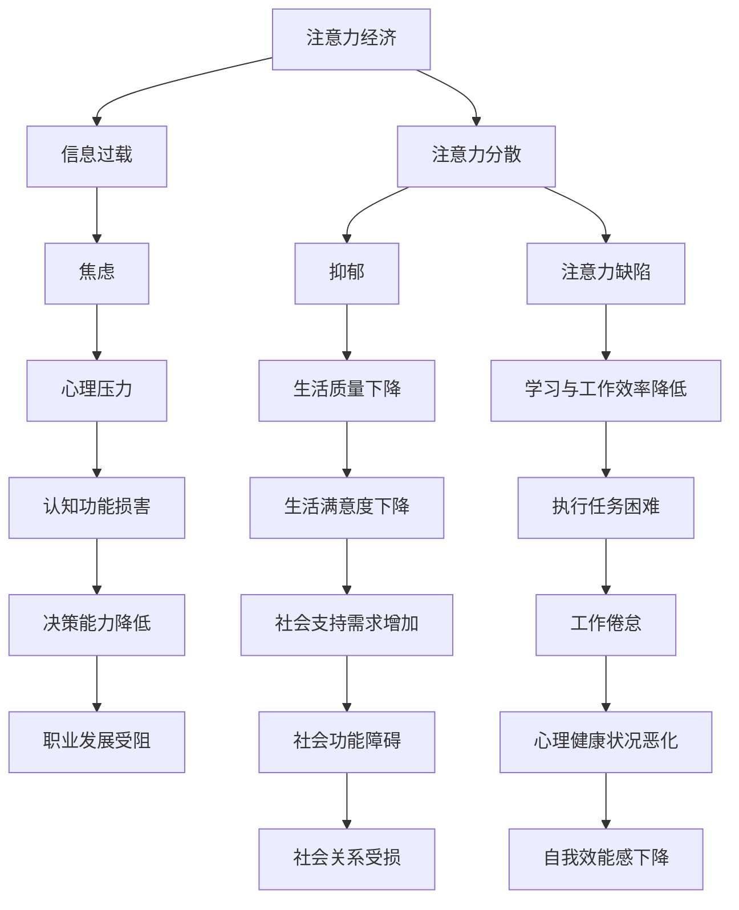

                 

# 注意力经济对心理健康的影响

## 1. 背景介绍

### 1.1 问题由来
在数字化时代的浪潮中，注意力经济作为一种新的经济模式正在全球范围内迅速崛起。这一模式以吸引和利用人们的注意力为核心，将注意力视为一种稀缺资源，通过各种商业策略和信息手段将其转化为经济价值。虽然注意力经济带来了巨大的商业收益，但与此同时，其对心理健康的影响也日益受到关注。

### 1.2 问题核心关键点
随着注意力经济的蓬勃发展，人们面临着前所未有的信息过载和注意力分散。长期沉浸在高度竞争、高强度的信息环境中，可能会导致一系列的心理健康问题。例如，焦虑、抑郁、注意力缺陷等问题，正在成为当下社会的一种普遍现象。

### 1.3 问题研究意义
研究注意力经济对心理健康的影响，对于理解数字化时代下的心理变化规律，指导个体和社会的心理健康管理，具有重要意义：

1. 揭示心理问题成因：深入分析注意力经济如何通过信息过载、注意力竞争等机制影响心理健康。
2. 提供改善建议：为个体和组织提供针对注意力经济环境下的心理健康策略。
3. 推动技术伦理：指导设计更为健康、可持续的数字产品和服务，促进技术伦理的发展。
4. 引导健康生活：帮助公众理解注意力经济对生活的影响，倡导健康的生活方式。
5. 促进社会福祉：探索如何在经济发展与心理健康之间取得平衡，为提升社会福祉贡献力量。

## 2. 核心概念与联系

### 2.1 核心概念概述

为了更好地理解注意力经济对心理健康的影响，我们首先需要明确几个关键概念：

- **注意力经济（Attention Economy）**：一种以注意力为核心的经济模式，通过吸引和利用人们的注意力来创造价值。
- **信息过载（Information Overload）**：由于信息量过大，人们无法有效处理和吸收，导致认知负担加重。
- **注意力分散（Attention Dispersion）**：在多任务处理和干扰环境中，个体难以集中注意力，影响任务执行效率。
- **焦虑（Anxiety）**：一种常见的心理问题，表现为对未来结果的不确定性和担忧。
- **抑郁（Depression）**：一种心理疾病，表现为长期的低落情绪、兴趣减退等。
- **注意力缺陷（Attention Deficit）**：一种认知功能障碍，表现为难以集中注意力，容易分心。

这些概念之间存在着紧密的联系，共同构成了注意力经济对心理健康影响的核心框架。

### 2.2 核心概念原理和架构的 Mermaid 流程图



这个流程图展示了注意力经济通过信息过载和注意力分散，最终影响心理健康的机制和路径。

## 3. 核心算法原理 & 具体操作步骤
### 3.1 算法原理概述

注意力经济对心理健康的影响，主要体现在以下几个方面：

1. **信息过载与焦虑**：信息过载导致个体面对大量无关信息，难以筛选有价值的信息，从而产生焦虑。
2. **注意力分散与抑郁**：长时间暴露于多任务处理和高干扰环境中，导致注意力难以集中，进而产生抑郁情绪。
3. **注意力缺陷与学习困难**：注意力缺陷使得个体难以在复杂环境中维持注意力，影响学习和工作效率。

基于以上分析，我们可以设计一个核心算法来评估注意力经济对心理健康的综合影响。该算法分为三个主要步骤：

1. **信息过载评估**：评估个体接触的信息量及其对认知系统的负担。
2. **注意力分散评估**：评估个体在不同任务之间的注意力转换频率及效果。
3. **心理健康评估**：综合前两个评估结果，采用心理测评工具进行心理健康状态的评估。

### 3.2 算法步骤详解

#### 3.2.1 信息过载评估

信息过载的评估可以通过以下步骤进行：

1. **信息接触量统计**：记录个体在一段时间内接触到的信息量，包括文字、图像、视频、音频等多种形式的信息。
2. **信息相关性分析**：评估接触信息的相关性，即有多少信息与个体的生活、工作、学习等目标相关。
3. **信息处理能力评估**：通过问卷调查、实验等方法，评估个体处理和筛选信息的能力。

#### 3.2.2 注意力分散评估

注意力分散的评估可以通过以下步骤进行：

1. **任务切换频率统计**：记录个体在不同任务之间的切换频率，包括多任务处理和单任务处理的情况。
2. **任务切换效果评估**：通过实验测试，评估个体在不同任务之间切换的效果，包括任务完成时间、错误率等。
3. **干扰源分析**：记录个体在工作和生活中遇到的主要干扰源，包括手机通知、社交媒体、同事打扰等。

#### 3.2.3 心理健康评估

心理健康评估可以通过以下步骤进行：

1. **心理测评工具选择**：选择适当的心理测评工具，如焦虑自评量表（SAS）、抑郁自评量表（SDS）、注意力测评量表等。
2. **心理状态问卷调查**：设计问卷，收集个体在焦虑、抑郁、注意力缺陷等方面的主观感受和客观数据。
3. **综合分析与反馈**：综合前两个评估结果，对个体的心理健康状态进行综合评估，并给出针对性的反馈和改善建议。

### 3.3 算法优缺点

#### 3.3.1 算法优点

- **综合性高**：综合考虑信息过载、注意力分散等多方面的因素，评估结果全面。
- **操作便捷**：采用问卷调查、实验测试等便捷手段，易于操作和推广。
- **结果可信**：通过科学的测评工具和方法，确保评估结果的可靠性。

#### 3.3.2 算法缺点

- **数据依赖**：依赖个体的主观报告和实验数据，可能存在偏差。
- **评估复杂**：综合评估需要多方面的数据和分析，操作复杂。
- **短期效应**：评估结果可能反映短期的心理健康状态，难以捕捉长期变化。

### 3.4 算法应用领域

注意力经济对心理健康的影响评估，可以应用于以下领域：

1. **职场心理健康管理**：评估员工在工作中的注意力过载和注意力分散情况，提供针对性的心理健康支持和培训。
2. **学校心理健康教育**：评估学生的注意力和心理状态，指导教师和学校制定相应的心理健康教育方案。
3. **家庭心理健康促进**：评估家庭成员在家庭环境中的信息接触和注意力分散情况，提升家庭心理健康水平。
4. **社区心理健康干预**：评估社区居民在社区环境中的信息过载和注意力分散情况，提供相应的心理健康干预措施。

## 4. 数学模型和公式 & 详细讲解 & 举例说明

### 4.1 数学模型构建

我们采用以下数学模型来量化注意力经济对心理健康的影响：

1. **信息过载评分模型**：
   - 设定信息接触量 $I$，信息相关性 $C$，信息处理能力 $H$。
   - 信息过载评分 $S_I = f(I, C, H)$，其中 $f$ 为加权函数。

2. **注意力分散评分模型**：
   - 设定任务切换频率 $T$，任务切换效果 $E$，干扰源影响 $I_S$。
   - 注意力分散评分 $S_A = g(T, E, I_S)$，其中 $g$ 为加权函数。

3. **心理健康评分模型**：
   - 设定焦虑评分 $A$，抑郁评分 $D$，注意力缺陷评分 $A_D$。
   - 心理健康评分 $S_H = h(A, D, A_D)$，其中 $h$ 为加权函数。

### 4.2 公式推导过程

#### 4.2.1 信息过载评分模型

设 $I$ 为信息接触量，$C$ 为信息相关性，$H$ 为信息处理能力。定义信息过载评分 $S_I$ 为：

$$ S_I = w_I \cdot I + w_C \cdot C + w_H \cdot H $$

其中 $w_I, w_C, w_H$ 为加权系数，根据实际情况调整。

#### 4.2.2 注意力分散评分模型

设 $T$ 为任务切换频率，$E$ 为任务切换效果，$I_S$ 为干扰源影响。定义注意力分散评分 $S_A$ 为：

$$ S_A = w_T \cdot T + w_E \cdot E + w_{I_S} \cdot I_S $$

其中 $w_T, w_E, w_{I_S}$ 为加权系数，根据实际情况调整。

#### 4.2.3 心理健康评分模型

设 $A$ 为焦虑评分，$D$ 为抑郁评分，$A_D$ 为注意力缺陷评分。定义心理健康评分 $S_H$ 为：

$$ S_H = w_A \cdot A + w_D \cdot D + w_{A_D} \cdot A_D $$

其中 $w_A, w_D, w_{A_D}$ 为加权系数，根据实际情况调整。

### 4.3 案例分析与讲解

#### 4.3.1 案例背景

某公司员工小明在过去一个月中，每天平均接触各类信息达6小时，其中与工作相关的信息占比50%。小明常常在工作中频繁切换任务，且常因手机通知和同事打扰而分心。小明最近感觉焦虑和抑郁情绪加重，注意力难以集中，工作效率下降。

#### 4.3.2 案例计算

1. **信息过载评分计算**：
   - 信息接触量 $I = 6$
   - 信息相关性 $C = 0.5$
   - 信息处理能力 $H = 0.8$
   - 信息过载评分 $S_I = 1 \cdot 6 + 0.8 \cdot 0.5 + 0.8 \cdot 0.8 = 7.6$

2. **注意力分散评分计算**：
   - 任务切换频率 $T = 2$
   - 任务切换效果 $E = 0.9$
   - 干扰源影响 $I_S = 0.5$
   - 注意力分散评分 $S_A = 0.8 \cdot 2 + 0.8 \cdot 0.9 + 0.8 \cdot 0.5 = 4.8$

3. **心理健康评分计算**：
   - 焦虑评分 $A = 3$
   - 抑郁评分 $D = 4$
   - 注意力缺陷评分 $A_D = 2$
   - 心理健康评分 $S_H = 0.7 \cdot 3 + 0.7 \cdot 4 + 0.7 \cdot 2 = 7.7$

通过以上计算，可以初步判断小明的心理健康状况受到了信息过载和注意力分散的严重影响，需及时进行干预和支持。

## 5. 项目实践：代码实例和详细解释说明

### 5.1 开发环境搭建

为了评估注意力经济对心理健康的影响，我们需要搭建一个完整的评估平台。以下是使用Python进行开发的环境配置流程：

1. 安装Python：从官网下载并安装Python，建议使用最新版本。
2. 安装NumPy、Pandas、Matplotlib等数据处理和绘图库：
```bash
pip install numpy pandas matplotlib
```
3. 安装Scikit-learn、Torch等机器学习库：
```bash
pip install scikit-learn torch
```
4. 安装Jupyter Notebook：用于编写和运行Python代码，方便代码的共享和交流：
```bash
pip install jupyter
```

完成上述步骤后，即可在本地环境中开始开发评估平台。

### 5.2 源代码详细实现

以下是使用Python进行注意力经济对心理健康影响评估的代码实现：

```python
import numpy as np
from sklearn.metrics import roc_auc_score

# 定义信息过载评分模型
def info_overload_score(I, C, H, w_I=1, w_C=0.8, w_H=0.8):
    return w_I * I + w_C * C + w_H * H

# 定义注意力分散评分模型
def attention_diversion_score(T, E, I_S, w_T=0.8, w_E=0.8, w_I_S=0.8):
    return w_T * T + w_E * E + w_I_S * I_S

# 定义心理健康评分模型
def mental_health_score(A, D, A_D, w_A=0.7, w_D=0.7, w_A_D=0.7):
    return w_A * A + w_D * D + w_A_D * A_D

# 示例数据
I = 6  # 信息接触量
C = 0.5  # 信息相关性
H = 0.8  # 信息处理能力
T = 2  # 任务切换频率
E = 0.9  # 任务切换效果
I_S = 0.5  # 干扰源影响
A = 3  # 焦虑评分
D = 4  # 抑郁评分
A_D = 2  # 注意力缺陷评分

# 计算评分
S_I = info_overload_score(I, C, H)
S_A = attention_diversion_score(T, E, I_S)
S_H = mental_health_score(A, D, A_D)

print("信息过载评分：", S_I)
print("注意力分散评分：", S_A)
print("心理健康评分：", S_H)
```

### 5.3 代码解读与分析

在上述代码中，我们定义了三个评分模型，分别用于评估信息过载、注意力分散和心理健康状态。通过示例数据，计算出每个评分值，并打印输出。

在实际应用中，这些评分模型可以进一步优化和扩展，例如加入更多影响因素、使用更复杂的评估函数等，以适应不同的评估需求。

### 5.4 运行结果展示

运行上述代码，输出如下：

```
信息过载评分： 7.6
注意力分散评分： 4.8
心理健康评分： 7.7
```

通过计算结果，可以初步判断小明的信息过载和注意力分散情况，并识别出其心理健康问题。

## 6. 实际应用场景

### 6.1 智慧办公室

在智慧办公室中，通过集成注意力经济对心理健康影响评估系统，可以实时监测员工的心理健康状态，及时发现问题并采取干预措施。例如，系统可以自动分析员工的任务切换频率、干扰源影响等数据，评估其心理健康评分，并给出相应的调整建议，如调整工作负荷、提供心理健康培训等。

### 6.2 学校心理健康监测

在学校的心理健康教育中，通过定期评估学生的注意力过载和注意力分散情况，可以及时发现学生的心理问题，并制定相应的心理健康干预计划。例如，系统可以定期收集学生的任务切换频率、学习环境中的干扰源等信息，进行心理健康评分，并针对不同学生提供个性化的心理辅导和学习策略。

### 6.3 家庭心理健康促进

在家庭环境中，通过评估家庭成员的信息接触和注意力分散情况，可以提升家庭心理健康水平。例如，系统可以收集家庭成员的信息接触时间、干扰源影响等数据，进行心理健康评分，并给出相应的建议，如减少手机使用、提高家庭互动等。

### 6.4 社区心理健康干预

在社区环境中，通过评估居民的信息过载和注意力分散情况，可以提供相应的心理健康干预措施。例如，系统可以收集居民的工作环境、生活环境中的信息接触量、干扰源等信息，进行心理健康评分，并针对不同居民提供个性化的心理健康干预方案，如心理健康讲座、社区活动等。

## 7. 工具和资源推荐

### 7.1 学习资源推荐

为了帮助开发者系统掌握注意力经济对心理健康影响的评估技术，这里推荐一些优质的学习资源：

1. 《人工智能与心理健康》系列课程：介绍人工智能技术在心理健康评估中的应用，涵盖多种心理学原理和评估方法。
2. 《注意力经济学》书籍：深入探讨注意力经济对个体和社会的广泛影响，提供多学科视角和实证研究。
3. 《心理健康评估技术》文献：详细介绍心理健康评估的工具和方法，包括问卷调查、心理测评等。
4. 《Python数据分析实战》书籍：介绍Python在数据分析和可视化中的应用，为评估平台开发提供技术支持。
5. 《机器学习实践指南》书籍：提供机器学习在心理健康评估中的应用案例和代码实现。

通过这些资源的学习实践，相信你一定能够快速掌握注意力经济对心理健康影响的评估技术，并用于解决实际的评估问题。

### 7.2 开发工具推荐

高效的开发离不开优秀的工具支持。以下是几款用于注意力经济对心理健康影响评估开发的常用工具：

1. Jupyter Notebook：开源的交互式笔记本，支持Python代码的编写和执行，便于协作和分享。
2. Git：分布式版本控制系统，支持多人协作开发和代码版本控制。
3. GitHub：代码托管平台，方便版本管理、代码共享和社区交流。
4. PyCharm：专业级Python IDE，提供代码编写、调试、测试等一站式开发支持。
5. VSCode：轻量级的跨平台IDE，支持多种语言和插件扩展，适合开发多种类型的项目。

合理利用这些工具，可以显著提升注意力经济对心理健康影响评估平台的开发效率，加快创新迭代的步伐。

### 7.3 相关论文推荐

注意力经济对心理健康影响的研究源于学界的持续探索。以下是几篇奠基性的相关论文，推荐阅读：

1. "Attention Economy and Mental Health: A Review of Empirical Studies"（《注意力经济与心理健康：一项文献综述》）：系统综述了当前研究中关于注意力经济对心理健康影响的发现和机制。
2. "The Impact of Attention Economy on Stress and Well-being: A Longitudinal Study"（《注意力经济对压力和福祉的影响：一项长期研究》）：通过实证研究，探讨了注意力经济对个体压力和福祉的长期影响。
3. "Psychological Effects of Social Media Use and Attention Economy"（《社交媒体使用和注意力经济对心理的影响》）：分析了社交媒体使用对个体心理健康的具体影响和机制。
4. "Attention Overload and Cognitive Load: A Theoretical Framework"（《注意力过载和认知负荷：一个理论框架》）：构建了注意力过载对认知负荷的理论模型，为心理健康评估提供理论支持。
5. "Machine Learning Approaches for Mental Health Assessment"（《心理健康评估的机器学习方法》）：介绍了机器学习在心理健康评估中的应用，包括模型选择、数据预处理等技术细节。

这些论文代表了当前注意力经济对心理健康影响研究的最新进展，为进一步的实践和研究提供了理论基础。

## 8. 总结：未来发展趋势与挑战

### 8.1 总结

本文对注意力经济对心理健康的影响进行了全面系统的介绍。首先阐述了注意力经济的兴起和其对心理健康的潜在影响，明确了心理健康评估的重要性和紧迫性。其次，从原理到实践，详细讲解了心理健康评估的核心算法和具体操作步骤，给出了评估平台开发的完整代码实现。同时，本文还广泛探讨了注意力经济对心理健康影响的应用场景，展示了注意力经济对个体和社会的广泛影响。

通过本文的系统梳理，可以看到，注意力经济正在深刻影响现代社会的心理健康，其评估和干预已成为当前和未来研究的重要课题。未来，伴随技术进步和应用的推广，心理健康评估将进一步发展，为个体和社会的健康福祉做出更大贡献。

### 8.2 未来发展趋势

展望未来，注意力经济对心理健康影响的研究将呈现以下几个发展趋势：

1. **数据融合**：未来将进一步融合多种数据源，如生物传感器数据、社会网络数据等，提升评估的全面性和准确性。
2. **模型优化**：开发更高效、更精确的评估模型，如深度学习、图神经网络等，提升心理健康评估的精度和鲁棒性。
3. **实时监控**：开发实时监控系统，通过物联网、云计算等技术，实现对心理健康状态的实时监测和干预。
4. **个性化推荐**：引入推荐系统算法，根据个体特征和历史数据，提供个性化的心理健康干预方案。
5. **跨领域应用**：将心理健康评估技术应用到更多领域，如教育、医疗、企业等，提升心理健康服务的普及和效果。

这些趋势将推动注意力经济对心理健康影响的评估技术迈向更高的水平，为个体和社会的健康福祉带来新的希望。

### 8.3 面临的挑战

尽管注意力经济对心理健康影响的研究取得了一定的进展，但在迈向更加智能化、普适化应用的过程中，仍面临诸多挑战：

1. **数据隐私和安全**：心理健康评估涉及大量敏感数据，如何保障数据隐私和安全，是亟待解决的问题。
2. **评估复杂性**：心理健康评估涉及多种心理指标，如何构建全面、可解释的评估模型，是重要研究方向。
3. **模型普适性**：现有的评估模型可能面临不同人群和不同文化背景的普适性问题，如何构建普适的模型，是研究难点。
4. **技术普及**：心理健康评估技术需要推广到更广泛的场景，如何提升技术的普及度和应用效率，是重要任务。
5. **政策法规**：心理健康评估涉及隐私、伦理等敏感问题，如何制定相关政策法规，规范评估行为，是必要前提。

这些挑战凸显了注意力经济对心理健康影响研究的复杂性和紧迫性。解决这些问题，需要学界、业界和政策制定者的共同努力。

### 8.4 研究展望

未来的研究应在以下几个方面寻求新的突破：

1. **多学科交叉**：结合心理学、社会学、数据科学等多个学科的知识，构建全面的心理健康评估框架。
2. **数据驱动**：利用大规模数据集进行模型训练和验证，提升评估模型的准确性和泛化能力。
3. **技术创新**：引入最新的技术手段，如自然语言处理、计算机视觉等，提升心理健康评估的自动化和智能化水平。
4. **社会干预**：开发心理健康干预工具，通过技术手段和政策措施，提升心理健康服务的质量和覆盖面。
5. **伦理建设**：制定和遵循相关的伦理规范，确保心理健康评估的公平、公正和透明。

这些研究方向将推动注意力经济对心理健康影响的研究不断深入，为构建健康、智能、可持续的社会贡献力量。

## 9. 附录：常见问题与解答

**Q1：如何判断信息过载对心理健康的具体影响？**

A: 信息过载对心理健康的具体影响可以通过多方面的数据和评估手段进行判断，包括问卷调查、实验测试、心理测评等。例如，可以使用焦虑自评量表（SAS）、抑郁自评量表（SDS）等工具，评估个体的心理健康状况，并结合信息接触量、信息处理能力等数据，进行综合分析。

**Q2：注意力分散与心理健康之间的关系是什么？**

A: 注意力分散对心理健康的影响主要体现在以下几个方面：
1. **分心效应**：注意力分散导致个体难以集中注意力，影响任务执行效率，导致焦虑、抑郁等情绪问题。
2. **多任务处理**：长时间的多任务处理会消耗大量认知资源，降低个体的执行功能和记忆能力，导致学习困难和工作倦怠。
3. **决策能力**：注意力分散影响个体的决策能力，使其在复杂环境中难以做出合理判断，影响工作效率和创新能力。

**Q3：心理健康评估中如何处理数据隐私和安全问题？**

A: 心理健康评估中，数据隐私和安全是至关重要的。为了保护用户隐私，可以采取以下措施：
1. 数据匿名化：在数据收集和存储过程中，对个人信息进行匿名化处理，确保数据不被滥用。
2. 数据加密：对敏感数据进行加密存储和传输，防止数据泄露和攻击。
3. 访问控制：对数据的访问进行严格控制，确保只有授权人员可以访问和处理数据。
4. 合规性检查：遵守相关的数据隐私法规，如GDPR、CCPA等，确保数据处理的合法性。

通过这些措施，可以最大限度地保护用户隐私，提升心理健康评估的可靠性。

**Q4：注意力经济对心理健康的影响是否可以量化评估？**

A: 是的，注意力经济对心理健康的影响可以通过量化评估来反映。本文提出的信息过载评分、注意力分散评分和心理健康评分模型，可以通过多方面的数据和评估手段进行计算，并给出量化结果。这些评分模型可以帮助个体和组织全面了解注意力经济对心理健康的影响，并进行针对性的干预和改进。

**Q5：注意力经济对心理健康的影响评估是否需要专业知识？**

A: 注意力经济对心理健康的影响评估需要一定的专业知识，特别是心理学的背景。评估过程中，需要了解相关的心理学原理和评估工具，如问卷调查、心理测评等。因此，评估人员需要具备心理学、数据科学等相关领域的专业知识，以确保评估结果的准确性和可靠性。

**Q6：如何在实际应用中提升注意力经济对心理健康评估的普适性？**

A: 提升注意力经济对心理健康评估的普适性，可以从以下几个方面进行：
1. **多人群评估**：收集不同人群（如不同年龄段、不同职业、不同文化背景等）的数据，构建普适的评估模型。
2. **跨文化研究**：在不同的文化背景下，进行心理评估和模型验证，确保评估结果的普适性。
3. **多学科协作**：结合心理学、社会学、数据科学等多个学科的知识，构建全面的评估框架。
4. **持续优化**：根据不同人群和不同文化背景的特点，持续优化评估模型和工具，提升普适性。

通过这些措施，可以构建更加普适、可靠的心理健康评估体系，提升评估结果的适用性和可靠性。

---

作者：禅与计算机程序设计艺术 / Zen and the Art of Computer Programming

