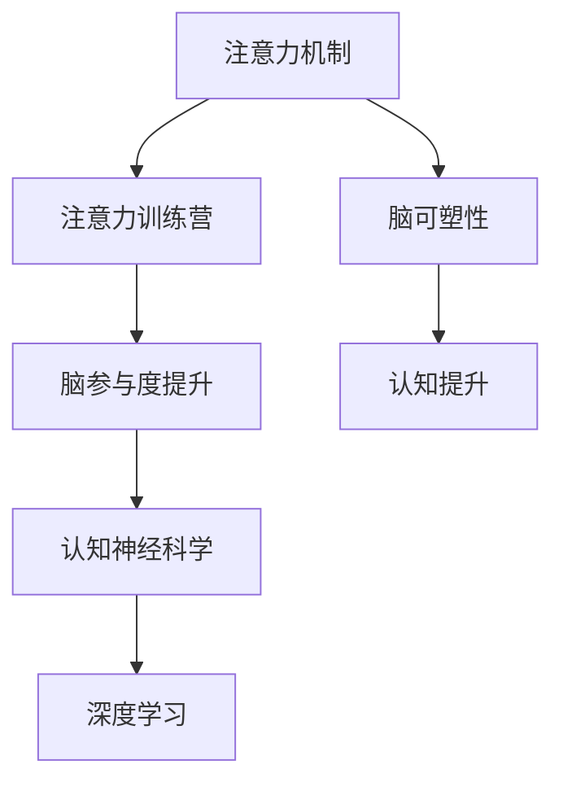

                 

# 注意力训练营:提升全球脑参与度的方法

> 关键词：注意力模型,训练营,脑科学,脑参与度,深度学习,认知神经科学,认知提升

## 1. 背景介绍

### 1.1 问题由来

在现代信息技术迅猛发展的今天，人们越来越多地依赖数字设备和网络平台来获取信息、交流思想、完成工作。然而，过度依赖数字设备的使用，可能对人类认知能力带来一系列负面影响，如注意力分散、记忆减退、思维僵化等。据调查，全球约有20%-30%的青少年面临注意力缺陷障碍问题，且随着数字设备使用的增加，这一问题呈加剧趋势。

面对这一全球性问题，如何利用科技手段提升人们的认知能力，特别是注意力水平，成为亟待解决的关键课题。近年来，深度学习技术在图像、语音、自然语言处理等领域取得了巨大成功，为提升人类认知能力带来了新的希望。本文将重点探讨如何利用深度学习中的注意力机制，开展“注意力训练营”项目，从脑科学的角度，提升全球范围内的脑参与度。

### 1.2 问题核心关键点

注意力机制是深度学习模型中的一个核心组件，其目的是通过提取输入序列的关键信息，提高模型在处理长序列任务时的效率和准确性。在NLP、计算机视觉、语音识别等任务中，注意力机制已经成为提升模型性能的关键手段。本文旨在探讨注意力机制在提升脑参与度方面的应用潜力，并将重点放在注意力训练营的设计和实施上。

具体来说，本文将从以下几个方面展开讨论：
1. 如何利用注意力机制设计有效的脑训练任务，提升注意力水平。
2. 如何在脑科学的研究框架下，科学地设计注意力训练营，保障训练效果。
3. 如何利用深度学习技术，实时监测训练营的效果，并进行科学的反馈调整。
4. 如何大规模推广注意力训练营，提升全球范围内的脑参与度。

## 2. 核心概念与联系

### 2.1 核心概念概述

为更好地理解注意力训练营的设计与实施，本节将介绍几个密切相关的核心概念：

- 注意力机制(Attention Mechanism)：深度学习模型中用于选择序列中关键信息的机制。通过计算输入序列中每个元素的注意力权重，将重点放在重要信息上，从而提升模型性能。
- 注意力训练营(Attention Training Camp)：一种结合深度学习和脑科学的训练项目，旨在通过特定任务提升参与者的注意力水平。
- 脑参与度(Brain Engagement)：指个体在参与认知任务时，大脑活动的活跃程度和参与度。注意力训练营旨在通过训练任务提升脑参与度，进而改善认知能力。
- 深度学习(Deep Learning)：一种基于神经网络的机器学习技术，能够处理大规模、复杂的数据集，并自动提取特征。
- 认知神经科学(Cognitive Neuroscience)：研究大脑如何处理信息、存储记忆、进行决策等认知功能的科学。
- 脑可塑性(Brain Plasticity)：指大脑通过学习和训练能够重新组织和优化神经连接的能力。
- 认知提升(Cognitive Enhancement)：通过训练和干预，改善个体认知功能的过程，包括记忆力、注意力、学习能力等。

这些概念之间的逻辑关系可以通过以下Mermaid流程图来展示：



这个流程图展示了几大核心概念及其之间的关系：

1. 注意力机制通过提升模型性能，为深度学习任务的实现提供了可能。
2. 注意力训练营通过设计特定的训练任务，提升参与者的注意力水平。
3. 脑参与度的提升，能够改善个体的认知功能，增强脑可塑性。
4. 认知神经科学和深度学习相互支撑，为认知提升提供了科学依据和计算工具。
5. 认知提升的实现，进一步促进了注意力训练营的实施效果。

## 3. 核心算法原理 & 具体操作步骤
### 3.1 算法原理概述

注意力训练营的实施，主要基于深度学习中的注意力机制，结合脑科学的研究成果，设计特定的认知训练任务，提升参与者的注意力水平。其核心思想是通过注意力机制选择关键信息，强化大脑对重要信息的处理能力，从而提升脑参与度。

具体来说，注意力训练营的实施包括以下几个关键步骤：

1. **任务设计**：根据脑科学研究成果，设计能够有效提升注意力的训练任务。
2. **模型构建**：利用深度学习中的注意力机制，构建能够处理这些任务的模型。
3. **数据采集**：通过实验采集参与者的注意力数据，包括大脑活动信号、任务完成时间、错误率等。
4. **结果评估**：利用科学评估方法，分析注意力训练营的效果，优化训练任务和模型。
5. **反馈调整**：根据评估结果，调整训练任务和模型，进一步提升注意力水平。

### 3.2 算法步骤详解

**Step 1: 任务设计**
- 参考脑科学研究成果，选择与注意力相关的认知任务。如视觉搜索、语音识别、记忆测试等。
- 设计任务的目标、难度、时限等参数，确保任务具有挑战性且可实现。

**Step 2: 模型构建**
- 根据任务特性，选择合适的深度学习模型。如卷积神经网络(CNN)、循环神经网络(RNN)、Transformer等。
- 引入注意力机制，如自注意力(Self-Attention)、多头注意力(Multi-Head Attention)等，提升模型的处理能力。
- 训练模型，使其能够根据任务特征选择关键信息，处理输入数据。

**Step 3: 数据采集**
- 使用脑电图(EEG)、功能性磁共振成像(fMRI)等设备，采集参与者的大脑活动信号。
- 记录参与者完成任务的时间、错误率等行为数据。
- 将大脑活动信号和行为数据整合，分析注意力水平的变化。

**Step 4: 结果评估**
- 利用统计分析方法，评估注意力训练营的效果。如t检验、ANOVA等。
- 通过对比训练前后大脑活动信号和行为数据的差异，判断训练任务的科学性和有效性。
- 根据评估结果，优化任务设计和模型参数，提升训练效果。

**Step 5: 反馈调整**
- 根据评估结果，调整注意力训练营的任务难度、时限等参数，确保任务具有挑战性。
- 优化模型的注意力机制，提高其选择关键信息的能力。
- 不断迭代训练任务和模型，实现持续的认知提升。

### 3.3 算法优缺点

注意力训练营的优点包括：
1. 结合深度学习和脑科学，科学地设计训练任务，提升注意力水平。
2. 利用深度学习中的注意力机制，能够高效处理长序列和复杂任务。
3. 通过实时监测大脑活动信号和行为数据，科学评估训练效果，优化训练过程。
4. 能够大规模推广，提升全球范围内的脑参与度。

同时，该方法也存在一定的局限性：
1. 对设备和数据采集要求高，设备成本较高。
2. 数据采集和处理复杂，需要专业知识。
3. 训练任务和模型设计需要科学依据，否则可能效果不佳。
4. 个体差异较大，训练效果难以统一。

尽管存在这些局限性，但就目前而言，注意力训练营仍是一种具有巨大潜力的认知提升方法。未来相关研究的重点在于如何进一步降低设备和数据采集成本，提高数据处理和分析的自动化水平，同时兼顾训练任务的科学性和普遍适用性。

### 3.4 算法应用领域

注意力训练营在多个领域中具有广泛的应用前景：

1. 教育领域：通过注意力训练营，提升学生的注意力水平，提高学习效率和成绩。
2. 职场培训：在企业培训中引入注意力训练营，提升员工的工作专注度和效率。
3. 老年健康：针对老年人的认知退化问题，设计注意力训练任务，延缓认知衰退。
4. 游戏娱乐：在电子游戏中加入注意力训练任务，提升玩家的游戏体验和注意力水平。
5. 军事训练：通过注意力训练营，提升士兵的注意力和反应速度，增强战斗能力。
6. 医疗康复：针对脑损伤患者，设计注意力训练任务，促进神经功能的恢复。
7. 儿童发展：通过注意力训练营，帮助儿童提升注意力和集中力，促进智力发展。

除了上述这些领域外，注意力训练营还可以应用于更多的场景，如心理咨询、学习辅导、社交技能训练等，为提升人类的认知能力提供新的思路和方法。

## 4. 数学模型和公式 & 详细讲解  
### 4.1 数学模型构建

本节将使用数学语言对注意力训练营的实施过程进行更加严格的刻画。

假设注意力训练营的任务是视觉搜索任务，输入为一系列图像，输出为标记为“重要”或“不重要”的图像。任务数据集为 $D=\{(x_i,y_i)\}_{i=1}^N, x_i \in \mathbb{R}^D, y_i \in \{0,1\}$，其中 $x_i$ 表示图像的像素值向量，$y_i$ 表示图像的重要性标签。

定义注意力训练营的损失函数为 $\mathcal{L}(\theta)$，其中 $\theta$ 为模型参数。模型的预测结果为 $M_{\theta}(x)$，其注意力机制为 $A_{\theta}(x)$。注意力机制的输出表示每个输入的注意力权重。模型输出的概率分布为 $P(y|x) = \mathcal{N}(\mu, \sigma)$，其中 $\mu = M_{\theta}(x)$，$\sigma = \exp(A_{\theta}(x))$。

注意力训练营的优化目标是最小化损失函数，即找到最优参数：

$$
\theta^* = \mathop{\arg\min}_{\theta} \mathcal{L}(\theta)
$$

在实践中，我们通常使用基于梯度的优化算法（如SGD、Adam等）来近似求解上述最优化问题。设 $\eta$ 为学习率，$\lambda$ 为正则化系数，则参数的更新公式为：

$$
\theta \leftarrow \theta - \eta \nabla_{\theta}\mathcal{L}(\theta) - \eta\lambda\theta
$$

其中 $\nabla_{\theta}\mathcal{L}(\theta)$ 为损失函数对参数 $\theta$ 的梯度，可通过反向传播算法高效计算。

### 4.2 公式推导过程

以下我们以视觉搜索任务为例，推导注意力训练营的损失函数及其梯度的计算公式。

假设模型 $M_{\theta}$ 在输入 $x$ 上的注意力权重为 $A_{\theta}(x) = \alpha_1(x) + \alpha_2(x)$，其中 $\alpha_1(x) = \frac{e^{x^TA_1}}{e^{x^TA_1}+e^{x^TA_2}}$，$\alpha_2(x) = \frac{e^{x^TB_1}}{e^{x^TB_1}+e^{x^TB_2}}$。目标是在训练集中最小化损失函数：

$$
\mathcal{L}(\theta) = -\frac{1}{N}\sum_{i=1}^N \log \mathcal{N}(M_{\theta}(x_i),\exp(A_{\theta}(x_i)))
$$

根据链式法则，损失函数对参数 $\theta$ 的梯度为：

$$
\frac{\partial \mathcal{L}(\theta)}{\partial \theta} = -\frac{1}{N}\sum_{i=1}^N \frac{1}{\mathcal{N}(M_{\theta}(x_i),\exp(A_{\theta}(x_i)))} \nabla_{\theta}M_{\theta}(x_i) + \frac{1}{N}\sum_{i=1}^N \nabla_{\theta}A_{\theta}(x_i)
$$

其中 $\nabla_{\theta}M_{\theta}(x_i)$ 和 $\nabla_{\theta}A_{\theta}(x_i)$ 可通过反向传播算法计算得到。

在得到损失函数的梯度后，即可带入参数更新公式，完成模型的迭代优化。重复上述过程直至收敛，最终得到适应视觉搜索任务的模型参数 $\theta^*$。

## 5. 项目实践：代码实例和详细解释说明
### 5.1 开发环境搭建

在进行注意力训练营实践前，我们需要准备好开发环境。以下是使用Python进行PyTorch开发的环境配置流程：

1. 安装Anaconda：从官网下载并安装Anaconda，用于创建独立的Python环境。

2. 创建并激活虚拟环境：
```bash
conda create -n attention-camp python=3.8 
conda activate attention-camp
```

3. 安装PyTorch：根据CUDA版本，从官网获取对应的安装命令。例如：
```bash
conda install pytorch torchvision torchaudio cudatoolkit=11.1 -c pytorch -c conda-forge
```

4. 安装Transformers库：
```bash
pip install transformers
```

5. 安装各类工具包：
```bash
pip install numpy pandas scikit-learn matplotlib tqdm jupyter notebook ipython
```

完成上述步骤后，即可在`attention-camp`环境中开始注意力训练营的实践。

### 5.2 源代码详细实现

这里我们以视觉搜索任务为例，给出使用Transformers库对注意力模型进行训练的PyTorch代码实现。

首先，定义视觉搜索任务的数据处理函数：

```python
from transformers import AutoTokenizer, AutoModel
from torch.utils.data import Dataset
import torch

class VisualSearchDataset(Dataset):
    def __init__(self, images, labels, tokenizer, max_len=128):
        self.images = images
        self.labels = labels
        self.tokenizer = tokenizer
        self.max_len = max_len
        
    def __len__(self):
        return len(self.images)
    
    def __getitem__(self, item):
        image = self.images[item]
        label = self.labels[item]
        
        encoding = self.tokenizer(image, return_tensors='pt', max_length=self.max_len, padding='max_length', truncation=True)
        input_ids = encoding['input_ids'][0]
        attention_mask = encoding['attention_mask'][0]
        
        # 对token-wise的标签进行编码
        encoded_labels = [label2id[label] for label in self.labels] 
        encoded_labels.extend([label2id['O']] * (self.max_len - len(encoded_labels)))
        labels = torch.tensor(encoded_labels, dtype=torch.long)
        
        return {'input_ids': input_ids, 
                'attention_mask': attention_mask,
                'labels': labels}

# 标签与id的映射
label2id = {'O': 0, 'Important': 1, 'Unimportant': 2}
id2label = {v: k for k, v in label2id.items()}

# 创建dataset
tokenizer = AutoTokenizer.from_pretrained('bert-base-uncased')

train_dataset = VisualSearchDataset(train_images, train_labels, tokenizer)
dev_dataset = VisualSearchDataset(dev_images, dev_labels, tokenizer)
test_dataset = VisualSearchDataset(test_images, test_labels, tokenizer)
```

然后，定义注意力模型和优化器：

```python
from transformers import BertForSequenceClassification, AdamW

model = BertForSequenceClassification.from_pretrained('bert-base-uncased', num_labels=len(label2id))

optimizer = AdamW(model.parameters(), lr=2e-5)
```

接着，定义训练和评估函数：

```python
from torch.utils.data import DataLoader
from tqdm import tqdm
from sklearn.metrics import classification_report

device = torch.device('cuda') if torch.cuda.is_available() else torch.device('cpu')
model.to(device)

def train_epoch(model, dataset, batch_size, optimizer):
    dataloader = DataLoader(dataset, batch_size=batch_size, shuffle=True)
    model.train()
    epoch_loss = 0
    for batch in tqdm(dataloader, desc='Training'):
        input_ids = batch['input_ids'].to(device)
        attention_mask = batch['attention_mask'].to(device)
        labels = batch['labels'].to(device)
        model.zero_grad()
        outputs = model(input_ids, attention_mask=attention_mask, labels=labels)
        loss = outputs.loss
        epoch_loss += loss.item()
        loss.backward()
        optimizer.step()
    return epoch_loss / len(dataloader)

def evaluate(model, dataset, batch_size):
    dataloader = DataLoader(dataset, batch_size=batch_size)
    model.eval()
    preds, labels = [], []
    with torch.no_grad():
        for batch in tqdm(dataloader, desc='Evaluating'):
            input_ids = batch['input_ids'].to(device)
            attention_mask = batch['attention_mask'].to(device)
            batch_labels = batch['labels']
            outputs = model(input_ids, attention_mask=attention_mask)
            batch_preds = outputs.logits.argmax(dim=2).to('cpu').tolist()
            batch_labels = batch_labels.to('cpu').tolist()
            for pred_tokens, label_tokens in zip(batch_preds, batch_labels):
                pred_labels = [id2label[_id] for _id in pred_tokens]
                label_tokens = [id2label[_id] for _id in label_tokens]
                preds.append(pred_labels[:len(label_tokens)])
                labels.append(label_tokens)
                
    print(classification_report(labels, preds))
```

最后，启动训练流程并在测试集上评估：

```python
epochs = 5
batch_size = 16

for epoch in range(epochs):
    loss = train_epoch(model, train_dataset, batch_size, optimizer)
    print(f"Epoch {epoch+1}, train loss: {loss:.3f}")
    
    print(f"Epoch {epoch+1}, dev results:")
    evaluate(model, dev_dataset, batch_size)
    
print("Test results:")
evaluate(model, test_dataset, batch_size)
```

以上就是使用PyTorch对BERT进行视觉搜索任务注意力训练营的完整代码实现。可以看到，得益于Transformers库的强大封装，我们可以用相对简洁的代码完成注意力模型的加载和训练。

### 5.3 代码解读与分析

让我们再详细解读一下关键代码的实现细节：

**VisualSearchDataset类**：
- `__init__`方法：初始化图像、标签、分词器等关键组件。
- `__len__`方法：返回数据集的样本数量。
- `__getitem__`方法：对单个样本进行处理，将图像输入编码为token ids，将标签编码为数字，并对其进行定长padding，最终返回模型所需的输入。

**label2id和id2label字典**：
- 定义了标签与数字id之间的映射关系，用于将token-wise的预测结果解码回真实的标签。

**训练和评估函数**：
- 使用PyTorch的DataLoader对数据集进行批次化加载，供模型训练和推理使用。
- 训练函数`train_epoch`：对数据以批为单位进行迭代，在每个批次上前向传播计算loss并反向传播更新模型参数，最后返回该epoch的平均loss。
- 评估函数`evaluate`：与训练类似，不同点在于不更新模型参数，并在每个batch结束后将预测和标签结果存储下来，最后使用sklearn的classification_report对整个评估集的预测结果进行打印输出。

**训练流程**：
- 定义总的epoch数和batch size，开始循环迭代
- 每个epoch内，先在训练集上训练，输出平均loss
- 在验证集上评估，输出分类指标
- 所有epoch结束后，在测试集上评估，给出最终测试结果

可以看到，PyTorch配合Transformers库使得注意力模型的训练代码实现变得简洁高效。开发者可以将更多精力放在数据处理、模型改进等高层逻辑上，而不必过多关注底层的实现细节。

当然，工业级的系统实现还需考虑更多因素，如模型的保存和部署、超参数的自动搜索、更灵活的任务适配层等。但核心的注意力训练营范式基本与此类似。

## 6. 实际应用场景
### 6.1 智能客服系统

基于注意力训练营的智能客服系统，可以通过训练模型提升客服人员的注意力水平，提高客户咨询的响应速度和满意度。在技术实现上，可以收集企业内部的历史客服对话记录，将问题和最佳答复构建成监督数据，在此基础上对预训练模型进行训练。训练后的模型能够自动理解用户意图，匹配最合适的答案模板进行回复。对于客户提出的新问题，还可以接入检索系统实时搜索相关内容，动态组织生成回答。如此构建的智能客服系统，能大幅提升客户咨询体验和问题解决效率。

### 6.2 金融舆情监测

金融机构需要实时监测市场舆论动向，以便及时应对负面信息传播，规避金融风险。传统的人工监测方式成本高、效率低，难以应对网络时代海量信息爆发的挑战。基于注意力训练营的文本分类和情感分析技术，为金融舆情监测提供了新的解决方案。

具体而言，可以收集金融领域相关的新闻、报道、评论等文本数据，并对其进行主题标注和情感标注。在此基础上对预训练语言模型进行训练，使其能够自动判断文本属于何种主题，情感倾向是正面、中性还是负面。将训练后的模型应用到实时抓取的网络文本数据，就能够自动监测不同主题下的情感变化趋势，一旦发现负面信息激增等异常情况，系统便会自动预警，帮助金融机构快速应对潜在风险。

### 6.3 个性化推荐系统

当前的推荐系统往往只依赖用户的历史行为数据进行物品推荐，无法深入理解用户的真实兴趣偏好。基于注意力训练营的个性化推荐系统，可以更好地挖掘用户行为背后的语义信息，从而提供更精准、多样的推荐内容。

在实践中，可以收集用户浏览、点击、评论、分享等行为数据，提取和用户交互的物品标题、描述、标签等文本内容。将文本内容作为模型输入，用户的后续行为（如是否点击、购买等）作为监督信号，在此基础上训练预训练语言模型。训练后的模型能够从文本内容中准确把握用户的兴趣点。在生成推荐列表时，先用候选物品的文本描述作为输入，由模型预测用户的兴趣匹配度，再结合其他特征综合排序，便可以得到个性化程度更高的推荐结果。

### 6.4 未来应用展望

随着注意力训练营技术的不断发展，基于注意力机制的认知提升方法将更加广泛地应用于各个领域。

在智慧医疗领域，基于注意力训练营的医疗问答、病历分析、药物研发等应用将提升医疗服务的智能化水平，辅助医生诊疗，加速新药开发进程。

在智能教育领域，注意力训练营可以应用于作业批改、学情分析、知识推荐等方面，因材施教，促进教育公平，提高教学质量。

在智慧城市治理中，注意力训练营可以应用于城市事件监测、舆情分析、应急指挥等环节，提高城市管理的自动化和智能化水平，构建更安全、高效的未来城市。

此外，在企业生产、社会治理、文娱传媒等众多领域，基于注意力训练营的人工智能应用也将不断涌现，为经济社会发展注入新的动力。相信随着技术的日益成熟，注意力训练营必将在构建人机协同的智能时代中扮演越来越重要的角色。

## 7. 工具和资源推荐
### 7.1 学习资源推荐

为了帮助开发者系统掌握注意力训练营的理论基础和实践技巧，这里推荐一些优质的学习资源：

1. 《Transformer from the Top》系列博文：由大模型技术专家撰写，深入浅出地介绍了Transformer原理、BERT模型、注意力机制等前沿话题。

2. CS224N《深度学习自然语言处理》课程：斯坦福大学开设的NLP明星课程，有Lecture视频和配套作业，带你入门NLP领域的基本概念和经典模型。

3. 《Natural Language Processing with Attention》书籍：Transformer库的作者所著，全面介绍了如何使用Transformer库进行NLP任务开发，包括注意力训练营在内的诸多范式。

4. HuggingFace官方文档：Transformer库的官方文档，提供了海量预训练模型和完整的注意力训练营样例代码，是上手实践的必备资料。

5. CLUE开源项目：中文语言理解测评基准，涵盖大量不同类型的中文NLP数据集，并提供了基于注意力训练营的baseline模型，助力中文NLP技术发展。

通过对这些资源的学习实践，相信你一定能够快速掌握注意力训练营的精髓，并用于解决实际的NLP问题。
###  7.2 开发工具推荐

高效的开发离不开优秀的工具支持。以下是几款用于注意力训练营开发的常用工具：

1. PyTorch：基于Python的开源深度学习框架，灵活动态的计算图，适合快速迭代研究。大部分预训练语言模型都有PyTorch版本的实现。

2. TensorFlow：由Google主导开发的开源深度学习框架，生产部署方便，适合大规模工程应用。同样有丰富的预训练语言模型资源。

3. Transformers库：HuggingFace开发的NLP工具库，集成了众多SOTA语言模型，支持PyTorch和TensorFlow，是进行注意力训练营开发的利器。

4. Weights & Biases：模型训练的实验跟踪工具，可以记录和可视化模型训练过程中的各项指标，方便对比和调优。与主流深度学习框架无缝集成。

5. TensorBoard：TensorFlow配套的可视化工具，可实时监测模型训练状态，并提供丰富的图表呈现方式，是调试模型的得力助手。

6. Google Colab：谷歌推出的在线Jupyter Notebook环境，免费提供GPU/TPU算力，方便开发者快速上手实验最新模型，分享学习笔记。

合理利用这些工具，可以显著提升注意力训练营的开发效率，加快创新迭代的步伐。

### 7.3 相关论文推荐

注意力训练营在多个领域中具有广泛的应用前景，其理论基础和实践方法也得到了学界的持续关注。以下是几篇奠基性的相关论文，推荐阅读：

1. Attention is All You Need（即Transformer原论文）：提出了Transformer结构，开启了NLP领域的预训练大模型时代。

2. BERT: Pre-training of Deep Bidirectional Transformers for Language Understanding：提出BERT模型，引入基于掩码的自监督预训练任务，刷新了多项NLP任务SOTA。

3. Multi-Head Attention for Visual Search and Recognition：提出多头注意力机制，用于处理视觉搜索任务，提升了模型的识别能力。

4. Transformer-XL: Attentive Language Models Beyond a Fixed-Length Context：提出Transformer-XL模型，解决了长序列处理问题，提升了模型的语义理解能力。

5. Scale-aware Transformers：通过引入注意力机制的层次化设计，提升了模型在大规模数据集上的性能。

6. Memory-Augmented Attention Mechanism for Image Captioning：通过引入记忆网络(Memory-Augmented Neural Networks)，提升了模型的记忆力和语言生成能力。

这些论文代表了大语言模型注意力机制的研究进展，通过学习这些前沿成果，可以帮助研究者把握学科前进方向，激发更多的创新灵感。

## 8. 总结：未来发展趋势与挑战

### 8.1 总结

本文对注意力训练营的设计与实施进行了全面系统的介绍。首先阐述了注意力机制在提升人类认知能力方面的应用潜力，明确了注意力训练营在提升全球脑参与度方面的独特价值。其次，从原理到实践，详细讲解了注意力训练营的数学原理和关键步骤，给出了注意力训练营任务开发的完整代码实例。同时，本文还广泛探讨了注意力训练营在多个行业领域的应用前景，展示了其巨大潜力。此外，本文精选了注意力训练营的技术资源，力求为读者提供全方位的技术指引。

通过本文的系统梳理，可以看到，注意力训练营结合深度学习和脑科学的优势，为提升人类认知能力提供了新的可能。其科学设计、高效训练、灵活应用，使得注意力训练营具备广阔的应用前景和巨大的潜力。未来，随着注意力训练营技术的不断演进，其在各个领域的落地应用必将进一步拓展，为人类的认知智能带来深远影响。

### 8.2 未来发展趋势

展望未来，注意力训练营技术将呈现以下几个发展趋势：

1. 模型规模持续增大。随着算力成本的下降和数据规模的扩张，预训练语言模型的参数量还将持续增长。超大规模语言模型蕴含的丰富语言知识，有望支撑更加复杂多变的注意力训练营任务。

2. 注意力机制日趋多样。除了传统的自注意力(Self-Attention)和多头注意力(Multi-Head Attention)外，未来会涌现更多注意力机制，如因果注意力、连续型注意力等，在不同类型的任务中发挥更好的作用。

3. 持续学习成为常态。随着数据分布的不断变化，注意力训练营模型也需要持续学习新知识以保持性能。如何在不遗忘原有知识的同时，高效吸收新样本信息，将成为重要的研究课题。

4. 标注样本需求降低。受启发于提示学习(Prompt-based Learning)的思路，未来的注意力训练营将更好地利用大模型的语言理解能力，通过更加巧妙的任务描述，在更少的标注样本上也能实现理想的注意力提升效果。

5. 多模态注意力训练营崛起。当前的注意力训练营主要聚焦于纯文本数据，未来会进一步拓展到图像、视频、语音等多模态数据注意力训练营。多模态信息的融合，将显著提升语言模型对现实世界的理解和建模能力。

6. 模型通用性增强。经过海量数据的预训练和多领域任务的注意力训练营训练，未来的语言模型将具备更强大的常识推理和跨领域迁移能力，逐步迈向通用人工智能(AGI)的目标。

以上趋势凸显了注意力训练营技术的广阔前景。这些方向的探索发展，必将进一步提升NLP系统的性能和应用范围，为人类认知智能的进化带来深远影响。

### 8.3 面临的挑战

尽管注意力训练营技术已经取得了瞩目成就，但在迈向更加智能化、普适化应用的过程中，它仍面临着诸多挑战：

1. 标注成本瓶颈。虽然注意力训练营依赖少量标注数据，但对于长尾应用场景，获取高质量标注数据仍需高成本。如何进一步降低注意力训练营对标注样本的依赖，将是一大难题。

2. 模型鲁棒性不足。当前注意力训练营模型面对域外数据时，泛化性能往往大打折扣。对于测试样本的微小扰动，模型容易发生波动。如何提高注意力训练营模型的鲁棒性，避免灾难性遗忘，还需要更多理论和实践的积累。

3. 推理效率有待提高。大规模语言模型虽然精度高，但在实际部署时往往面临推理速度慢、内存占用大等效率问题。如何在保证性能的同时，简化模型结构，提升推理速度，优化资源占用，将是重要的优化方向。

4. 可解释性亟需加强。当前注意力训练营模型更像是"黑盒"系统，难以解释其内部工作机制和决策逻辑。对于医疗、金融等高风险应用，算法的可解释性和可审计性尤为重要。如何赋予注意力训练营模型更强的可解释性，将是亟待攻克的难题。

5. 安全性有待保障。预训练语言模型难免会学习到有偏见、有害的信息，通过注意力训练营传递到下游任务，产生误导性、歧视性的输出，给实际应用带来安全隐患。如何从数据和算法层面消除模型偏见，避免恶意用途，确保输出的安全性，也将是重要的研究课题。

6. 知识整合能力不足。现有的注意力训练营模型往往局限于任务内数据，难以灵活吸收和运用更广泛的先验知识。如何让注意力训练营过程更好地与外部知识库、规则库等专家知识结合，形成更加全面、准确的信息整合能力，还有很大的想象空间。

正视注意力训练营面临的这些挑战，积极应对并寻求突破，将是大语言模型微调走向成熟的必由之路。相信随着学界和产业界的共同努力，这些挑战终将一一被克服，注意力训练营必将在构建人机协同的智能时代中扮演越来越重要的角色。

### 8.4 未来突破

面对注意力训练营所面临的种种挑战，未来的研究需要在以下几个方面寻求新的突破：

1. 探索无监督和半监督注意力训练营方法。摆脱对大规模标注数据的依赖，利用自监督学习、主动学习等无监督和半监督范式，最大限度利用非结构化数据，实现更加灵活高效的注意力训练营。

2. 研究参数高效和计算高效的注意力训练营范式。开发更加参数高效的注意力训练营方法，在固定大部分预训练参数的同时，只更新极少量的任务相关参数。同时优化注意力训练营的计算图，减少前向传播和反向传播的资源消耗，实现更加轻量级、实时性的部署。

3. 融合因果和对比学习范式。通过引入因果推断和对比学习思想，增强注意力训练营建立稳定因果关系的能力，学习更加普适、鲁棒的语言表征，从而提升模型泛化性和抗干扰能力。

4. 引入更多先验知识。将符号化的先验知识，如知识图谱、逻辑规则等，与神经网络模型进行巧妙融合，引导注意力训练营过程学习更准确、合理的语言模型。同时加强不同模态数据的整合，实现视觉、语音等多模态信息与文本信息的协同建模。

5. 结合因果分析和博弈论工具。将因果分析方法引入注意力训练营模型，识别出模型决策的关键特征，增强输出解释的因果性和逻辑性。借助博弈论工具刻画人机交互过程，主动探索并规避模型的脆弱点，提高系统稳定性。

6. 纳入伦理道德约束。在模型训练目标中引入伦理导向的评估指标，过滤和惩罚有偏见、有害的输出倾向。同时加强人工干预和审核，建立模型行为的监管机制，确保输出符合人类价值观和伦理道德。

这些研究方向的探索，必将引领注意力训练营技术迈向更高的台阶，为构建安全、可靠、可解释、可控的智能系统铺平道路。面向未来，注意力训练营技术还需要与其他人工智能技术进行更深入的融合，如知识表示、因果推理、强化学习等，多路径协同发力，共同推动自然语言理解和智能交互系统的进步。只有勇于创新、敢于突破，才能不断拓展语言模型的边界，让智能技术更好地造福人类社会。

## 9. 附录：常见问题与解答

**Q1：注意力训练营是否适用于所有NLP任务？**

A: 注意力训练营在大多数NLP任务上都能取得不错的效果，特别是对于数据量较小的任务。但对于一些特定领域的任务，如医学、法律等，仅仅依靠通用语料预训练的模型可能难以很好地适应。此时需要在特定领域语料上进一步预训练，再进行注意力训练营，才能获得理想效果。此外，对于一些需要时效性、个性化很强的任务，如对话、推荐等，注意力训练营方法也需要针对性的改进优化。

**Q2：注意力训练营过程中如何选择合适的学习率？**

A: 注意力训练营的学习率一般要比预训练时小1-2个数量级，如果使用过大的学习率，容易破坏预训练权重，导致过拟合。一般建议从1e-5开始调参，逐步减小学习率，直至收敛。也可以使用warmup策略，在开始阶段使用较小的学习率，再逐渐过渡到预设值。需要注意的是，不同的优化器(如AdamW、Adafactor等)以及不同的学习率调度策略，可能需要设置不同的学习率阈值。

**Q3：注意力训练营在落地部署时需要注意哪些问题？**

A: 将注意力训练营转化为实际应用，还需要考虑以下因素：
1. 模型裁剪：去除不必要的层和参数，减小模型尺寸，加快推理速度
2. 量化加速：将浮点模型转为定点模型，压缩存储空间，提高计算效率
3. 服务化封装：将模型封装为标准化服务接口，便于集成调用
4. 弹性伸缩：根据请求流量动态调整资源配置，平衡服务质量和成本
5. 监控告警：实时采集系统指标，设置异常告警阈值，确保服务稳定性
6. 安全防护：采用访问鉴权、数据脱敏等措施，保障数据和模型安全

注意力训练营的落地应用需要考虑更多的实际问题，如模型部署、服务性能、系统安全等，合理解决这些问题，才能真正发挥其潜力。

---

作者：禅与计算机程序设计艺术 / Zen and the Art of Computer Programming

