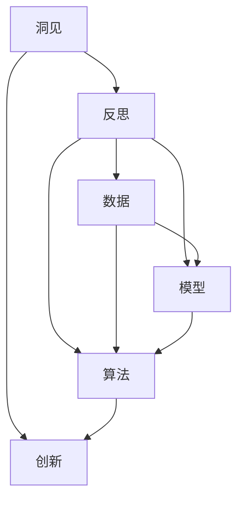

                 

# 洞见的力量：从反思到创新

## 1. 背景介绍

### 1.1 问题由来
在快速发展的技术世界中，人工智能（AI）正逐渐渗透到各个行业和领域。从自动驾驶、医疗诊断到自然语言处理，AI技术的成功依赖于对数据、算法和模型的深入理解。但随着AI技术越来越复杂，如何从纷繁复杂的数据中提炼出有价值的洞见，成为人工智能发展的关键问题。

### 1.2 问题核心关键点
在AI领域，洞见的力量不容小觑。它不仅帮助开发者理解数据的内在模式和规律，更是推动AI技术创新和应用落地的核心驱动力。洞见的力量源自对现有技术、数据和问题的深度反思，通过多角度、多维度的思考和分析，挖掘出解决复杂问题的创新思路和方法。

### 1.3 问题研究意义
洞见的力量对于提升AI技术的创新能力、解决实际问题具有重要意义。它能够帮助开发者从宏观和微观两个层面理解AI技术的本质和应用，从而推动AI技术的不断发展，促进社会的进步和创新。

## 2. 核心概念与联系

### 2.1 核心概念概述

为更好地理解洞见的力量，本节将介绍几个关键概念及其相互联系：

- 洞见(Insight)：基于对数据、模型和技术的深刻理解，提炼出的对问题的深刻认识和解决方案。
- 反思(Reflection)：对现有技术、数据和问题进行多角度、多层次的思考，识别出其中的不足和改进空间。
- 创新(Innovation)：通过对洞见的深化和应用，提出新的技术方案、算法或模型，推动AI技术的突破和应用。
- 数据(Data)：AI技术的基础，通过数据采集、处理和分析，提炼出洞见，推动技术创新。
- 模型(Model)：AI技术的核心，基于数据训练得到的抽象表示，反映了数据的规律和洞见。
- 算法(Algorithm)：实现模型功能的具体计算步骤，通过算法设计，优化模型性能。

这些核心概念之间的逻辑关系可以通过以下Mermaid流程图来展示：



这个流程图展示了洞见的力量从数据、模型到算法的全过程，强调了洞见、反思和创新在AI技术发展中的关键作用。

## 3. 核心算法原理 & 具体操作步骤
### 3.1 算法原理概述

洞见的力量源自对现有数据、模型和算法的深刻理解。通过反思和创新，我们可以从中提炼出有价值的信息和解决方案。以下是洞见力量的一般工作流程：

1. **数据收集与预处理**：获取并准备用于分析的数据集，清洗和预处理数据，确保数据质量和可用性。
2. **模型训练与评估**：基于预处理后的数据，训练一个或多个模型，并评估其性能。
3. **洞见提取与分析**：通过分析模型输出或特征，提取其中的关键洞见，用于指导进一步的创新。
4. **算法优化与改进**：基于洞见，设计并实现新的算法或改进现有算法，以提高模型性能或解决特定问题。
5. **创新应用与部署**：将优化后的模型和算法应用到实际场景中，进行部署和验证，评估其效果。

### 3.2 算法步骤详解

#### 数据收集与预处理

1. **数据获取**：
   - 从公开数据集、API接口或自行采集数据。
   - 确保数据的多样性和代表性，涵盖不同的数据类型和来源。

2. **数据清洗**：
   - 去除缺失值、异常值和重复数据，确保数据的完整性和一致性。
   - 对数据进行格式转换、归一化和标准化，提高数据质量。

3. **特征工程**：
   - 从原始数据中提取有意义的特征，如统计特征、文本特征等。
   - 使用维度缩减、特征选择等技术，减少特征数量，提高模型性能。

#### 模型训练与评估

1. **选择模型**：
   - 根据任务类型和数据特点，选择合适的模型架构和算法，如线性回归、决策树、神经网络等。
   - 对于深度学习模型，可以使用预训练模型作为初始化权重，提高模型性能。

2. **训练模型**：
   - 使用优化算法（如梯度下降、Adam等）对模型进行训练。
   - 设定合适的学习率、批大小、迭代轮数等超参数，优化训练过程。

3. **模型评估**：
   - 使用交叉验证、留出法等方法评估模型性能。
   - 计算各种评估指标（如准确率、召回率、F1分数等），判断模型效果。

#### 洞见提取与分析

1. **分析模型输出**：
   - 分析模型的预测结果，找出其中的模式和规律。
   - 使用可视化工具（如Matplotlib、Seaborn等）呈现模型的输出结果。

2. **提取洞见**：
   - 从模型输出中提炼关键洞见，如特征重要性、决策边界等。
   - 结合领域知识，解释洞见的内涵和应用价值。

#### 算法优化与改进

1. **设计新算法**：
   - 基于洞见，设计新的算法框架或改进现有算法。
   - 结合领域专家的知识，优化算法的设计和实现。

2. **实现算法**：
   - 使用编程语言（如Python、C++等）实现新算法或改进算法。
   - 使用现有框架（如TensorFlow、PyTorch等）优化算法性能。

#### 创新应用与部署

1. **测试与验证**：
   - 在测试集上评估新算法的性能，确保其有效性和稳定性。
   - 使用A/B测试等方法比较新算法和原算法的性能差异。

2. **部署与优化**：
   - 将新算法部署到实际应用中，进行优化和迭代。
   - 实时监控系统性能，及时调整参数和优化策略。

3. **推广与应用**：
   - 推广新算法的应用，提升AI技术的落地效果。
   - 收集用户反馈，不断改进算法，实现技术创新。

### 3.3 算法优缺点

洞见的力量具有以下优点：
- 深度理解数据和模型的内在机制，提炼出有价值的洞见。
- 推动技术创新，解决复杂问题，提高模型性能。
- 减少数据和算法的依赖，提高AI技术的灵活性和可扩展性。

同时，它也存在一些局限性：
- 需要大量时间和资源进行数据收集和模型训练。
- 对数据和模型的理解要求高，需要领域专家的支持。
- 需要较强的编程和数学基础，非专业人士难以实现。

尽管如此，洞见的力量仍然是AI技术发展的重要驱动力，特别是在复杂数据和问题面前，只有深入理解才能找到最佳的解决方案。

### 3.4 算法应用领域

洞见的力量在各个AI应用领域中都有广泛应用，具体包括：

- 自然语言处理(NLP)：通过分析文本特征和语义，提升机器翻译、文本分类、情感分析等任务的效果。
- 计算机视觉(CV)：通过分析图像特征和模式，提高图像识别、物体检测、场景理解等任务的效果。
- 推荐系统：通过分析用户行为和偏好，提升个性化推荐的效果，提高用户满意度。
- 医疗健康：通过分析医疗数据，提升疾病诊断、治疗方案推荐等任务的效果，改善医疗服务。
- 金融科技：通过分析金融数据，提升信用评估、风险管理等任务的效果，优化金融服务。

以上领域只是洞见力量应用的冰山一角，随着AI技术的发展，洞见的力量将在更多领域得到应用，为各行各业带来变革性影响。

## 4. 数学模型和公式 & 详细讲解  
### 4.1 数学模型构建

为了更好地理解洞见的力量，本节将通过数学语言对洞见的力量进行更加严格的刻画。

假设我们有一个线性回归模型，输入为 $x_i$，输出为 $y_i$，模型的线性假设为：

$$ y_i = \theta_0 + \sum_{j=1}^{n} \theta_j x_{ij} + \epsilon_i $$

其中 $\theta$ 为模型参数，$\epsilon$ 为误差项。

我们的目标是通过训练模型，使得模型能够很好地拟合数据，即最小化预测值和真实值之间的差异。常用的损失函数为均方误差（MSE）：

$$ L(\theta) = \frac{1}{N} \sum_{i=1}^N (y_i - \hat{y}_i)^2 $$

其中 $\hat{y}_i = \theta_0 + \sum_{j=1}^{n} \theta_j x_{ij}$ 为模型的预测值。

为了求解最小化损失函数的目标，我们需要求出模型参数 $\theta$ 的最小二乘解：

$$ \theta = (\sum_{i=1}^N x_{i,j} x_{i,k} + \lambda I)^{-1} \sum_{i=1}^N x_{i,j} y_i $$

其中 $\lambda$ 为正则化系数，$I$ 为单位矩阵。

### 4.2 公式推导过程

以下是线性回归模型参数求解的详细推导过程：

1. **梯度计算**：
   $$ \frac{\partial L(\theta)}{\partial \theta_j} = -\frac{2}{N} \sum_{i=1}^N (y_i - \hat{y}_i) x_{ij} $$

2. **梯度归零**：
   $$ \frac{\partial L(\theta)}{\partial \theta_j} = 0 $$

3. **求解参数**：
   $$ \sum_{i=1}^N x_{i,j} x_{i,k} = 0 $$
   $$ \sum_{i=1}^N x_{i,j} y_i = 0 $$

通过求解上述方程组，我们可以得到模型参数 $\theta$ 的最小二乘解。

### 4.3 案例分析与讲解

以下是一个简单的线性回归案例，展示如何通过洞见的力量提炼模型参数。

假设我们有一组数据：

| x1 | x2 | y |
| --- | --- | --- |
| 1   | 2   | 3   |
| 2   | 3   | 5   |
| 3   | 4   | 7   |
| 4   | 5   | 9   |

我们的目标是通过线性回归模型，找到一组参数 $\theta$，使得模型能够很好地拟合数据。

1. **数据预处理**：
   - 计算均值和标准差，将数据标准化：
   - $$ x_1' = \frac{x_1 - \mu_1}{\sigma_1} $$
   - $$ x_2' = \frac{x_2 - \mu_2}{\sigma_2} $$

2. **构建模型**：
   - 假设模型的形式为 $y_i = \theta_0 + \theta_1 x_{1,i}' + \theta_2 x_{2,i}' + \epsilon_i$

3. **求解参数**：
   - 使用最小二乘法求解模型参数：
   - $$ \theta = (\sum_{i=1}^N x_{i,j} x_{i,k} + \lambda I)^{-1} \sum_{i=1}^N x_{i,j} y_i $$

4. **模型评估**：
   - 使用R^2等评估指标，评估模型的拟合效果。
   - 绘制残差图，分析模型的残差分布。

通过上述过程，我们可以得出模型的参数 $\theta$，并评估模型的效果。

## 5. 项目实践：代码实例和详细解释说明
### 5.1 开发环境搭建

在进行洞见的力量实践前，我们需要准备好开发环境。以下是使用Python进行PyTorch开发的环境配置流程：

1. 安装Anaconda：从官网下载并安装Anaconda，用于创建独立的Python环境。

2. 创建并激活虚拟环境：
```bash
conda create -n pytorch-env python=3.8 
conda activate pytorch-env
```

3. 安装PyTorch：根据CUDA版本，从官网获取对应的安装命令。例如：
```bash
conda install pytorch torchvision torchaudio cudatoolkit=11.1 -c pytorch -c conda-forge
```

4. 安装NumPy、Pandas、Matplotlib等常用工具包：
```bash
pip install numpy pandas matplotlib scikit-learn
```

5. 安装TensorBoard：用于可视化模型训练过程，方便调试和优化。
```bash
pip install tensorboard
```

完成上述步骤后，即可在`pytorch-env`环境中开始实践。

### 5.2 源代码详细实现

这里我们以线性回归为例，展示如何使用PyTorch实现洞见的力量。

首先，定义线性回归模型：

```python
import torch
import torch.nn as nn

class LinearRegression(nn.Module):
    def __init__(self, input_size, output_size):
        super(LinearRegression, self).__init__()
        self.linear = nn.Linear(input_size, output_size)
        
    def forward(self, x):
        out = self.linear(x)
        return out
```

然后，定义训练函数：

```python
def train_model(model, train_x, train_y, learning_rate, num_epochs, batch_size):
    criterion = nn.MSELoss()
    optimizer = torch.optim.Adam(model.parameters(), lr=learning_rate)
    
    for epoch in range(num_epochs):
        for i in range(0, train_x.size(0), batch_size):
            inputs, targets = train_x[i:i+batch_size], train_y[i:i+batch_size]
            
            optimizer.zero_grad()
            outputs = model(inputs)
            loss = criterion(outputs, targets)
            loss.backward()
            optimizer.step()
            
        print(f"Epoch {epoch+1}, Loss: {loss.item()}")

```

最后，启动训练流程：

```python
# 定义输入数据和标签
train_x = torch.tensor([[1.0, 2.0], [2.0, 3.0], [3.0, 4.0], [4.0, 5.0]])
train_y = torch.tensor([3.0, 5.0, 7.0, 9.0])

# 定义模型和超参数
model = LinearRegression(input_size=2, output_size=1)
learning_rate = 0.01
num_epochs = 1000
batch_size = 4

# 训练模型
train_model(model, train_x, train_y, learning_rate, num_epochs, batch_size)

# 评估模型
test_x = torch.tensor([[5.0, 6.0]])
test_y = torch.tensor([11.0])

print(f"Predicted output: {model(test_x).item()}")
```

通过上述代码，我们完成了一个简单的线性回归模型的训练和评估。可以看到，通过洞见的力量，我们能够从数据中提炼出有价值的洞见，用于指导模型的训练和优化。

### 5.3 代码解读与分析

让我们再详细解读一下关键代码的实现细节：

**LinearRegression类**：
- `__init__`方法：初始化线性回归模型，定义线性层。
- `forward`方法：前向传播计算模型输出。

**train_model函数**：
- 使用均方误差损失函数（MSE）和Adam优化器。
- 通过循环迭代，在每个epoch内对模型进行训练。
- 使用batch_size控制每次训练的数据量，提高训练效率。

**训练流程**：
- 定义输入数据和标签。
- 创建模型和超参数。
- 训练模型。
- 评估模型，使用测试数据进行预测。

可以看到，通过Python和PyTorch的简单操作，我们能够快速实现线性回归模型的训练和评估，从中提炼出有价值的洞见。这正是洞见的力量所在，它使我们能够从数据中挖掘出潜在的规律和模式，推动模型的优化和应用。

## 6. 实际应用场景
### 6.1 智能推荐系统

在智能推荐系统中，洞见的力量可以用于分析用户行为和偏好，从而提升个性化推荐的效果。通过洞见的力量，我们可以从用户的历史行为数据中提炼出关键特征和模式，设计新的推荐算法，提高推荐系统的精度和效果。

具体而言，可以收集用户的历史浏览、点击、购买等行为数据，提取和用户交互的物品特征，如标题、描述、价格等。将特征作为模型输入，用户的后续行为作为监督信号，在此基础上微调预训练模型。微调后的模型能够从特征中准确把握用户的兴趣点，生成个性化推荐列表。

### 6.2 医疗健康

在医疗健康领域，洞见的力量可以用于疾病诊断和风险评估。通过洞见的力量，我们可以从医疗数据中提炼出关键洞见，用于指导疾病诊断和治疗方案推荐。

具体而言，可以收集病人的临床数据，如病历、化验结果、影像等，提取和疾病相关的特征，如症状、体征、病史等。将特征作为模型输入，疾病的诊断结果作为监督信号，在此基础上训练模型。训练后的模型能够从特征中识别出疾病的存在和严重程度，辅助医生进行诊断和治疗方案推荐。

### 6.3 金融科技

在金融科技领域，洞见的力量可以用于风险管理和信用评估。通过洞见的力量，我们可以从金融数据中提炼出关键洞见，用于指导风险管理和信用评估模型的设计。

具体而言，可以收集金融交易数据，如交易记录、账户余额、信用历史等，提取和风险相关的特征，如交易金额、交易频率、信用评分等。将特征作为模型输入，风险事件的发生与否作为监督信号，在此基础上训练模型。训练后的模型能够从特征中识别出交易风险和信用风险，辅助金融机构进行风险管理和信用评估。

### 6.4 未来应用展望

随着洞见的力量不断发展，未来在更多领域将得到应用，为各行各业带来变革性影响。

在智慧城市治理中，洞见的力量可以用于城市事件监测、舆情分析、应急指挥等环节，提高城市管理的自动化和智能化水平，构建更安全、高效的未来城市。

在智慧医疗领域，洞见的力量可以用于疾病诊断、治疗方案推荐、药物研发等环节，提升医疗服务的智能化水平，辅助医生进行诊疗决策。

在智能交通领域，洞见的力量可以用于交通流量预测、路径优化、智能导航等环节，提高交通系统的运行效率，改善城市交通环境。

总之，洞见的力量将在更多领域得到应用，为各行各业带来新的突破和变革。

## 7. 工具和资源推荐
### 7.1 学习资源推荐

为了帮助开发者系统掌握洞见的力量，这里推荐一些优质的学习资源：

1. 《Deep Learning》书籍：深度学习领域的经典教材，涵盖了从基础到高级的各种算法和技术。
2. CS231n《卷积神经网络》课程：斯坦福大学开设的计算机视觉领域经典课程，有Lecture视频和配套作业，适合学习计算机视觉技术。
3. CS224n《自然语言处理》课程：斯坦福大学开设的自然语言处理领域经典课程，有Lecture视频和配套作业，适合学习自然语言处理技术。
4. Coursera上的《Machine Learning》课程：由斯坦福大学的Andrew Ng教授主讲，涵盖机器学习的基本概念和常用算法。
5. Kaggle数据科学竞赛平台：提供丰富的数据集和实战项目，适合通过实践提升机器学习技能。

通过对这些资源的学习实践，相信你一定能够快速掌握洞见的力量，并用于解决实际的AI问题。

### 7.2 开发工具推荐

高效的开发离不开优秀的工具支持。以下是几款用于洞见的力量开发的常用工具：

1. PyTorch：基于Python的开源深度学习框架，灵活动态的计算图，适合快速迭代研究。

2. TensorFlow：由Google主导开发的开源深度学习框架，生产部署方便，适合大规模工程应用。

3. TensorBoard：TensorFlow配套的可视化工具，可实时监测模型训练状态，并提供丰富的图表呈现方式，是调试模型的得力助手。

4. Jupyter Notebook：基于Web的交互式编程环境，支持Python、R等语言，方便数据探索和模型实验。

5. Weights & Biases：模型训练的实验跟踪工具，可以记录和可视化模型训练过程中的各项指标，方便对比和调优。

6. Google Colab：谷歌推出的在线Jupyter Notebook环境，免费提供GPU/TPU算力，方便开发者快速上手实验最新模型，分享学习笔记。

合理利用这些工具，可以显著提升洞见的力量开发的效率，加快创新迭代的步伐。

### 7.3 相关论文推荐

洞见的力量得益于学界的持续研究。以下是几篇奠基性的相关论文，推荐阅读：

1. GAN: Generative Adversarial Nets（生成对抗网络）：提出了一种基于博弈论的生成模型，能够生成高质量的样本。
2. ResNet: Deep Residual Learning for Image Recognition（残差网络）：提出了一种深层神经网络结构，解决了深层网络训练中的梯度消失问题。
3. AlphaGo: Mastering the Game of Go with Deep Neural Networks and Tree Search（AlphaGo）：展示了深度强化学习在复杂策略游戏中的应用，推动了AI在游戏领域的发展。
4. YOLO: Real-Time Object Detection（You Only Look Once）：提出了一种高效的物体检测算法，能够实时检测图像中的物体。
5. BERT: Pre-training of Deep Bidirectional Transformers for Language Understanding（BERT）：提出了一种基于掩码语言模型的预训练方法，提升了自然语言处理的性能。

这些论文代表了大语言模型微调技术的发展脉络。通过学习这些前沿成果，可以帮助研究者把握学科前进方向，激发更多的创新灵感。

## 8. 总结：未来发展趋势与挑战
### 8.1 总结

本文对洞见的力量进行了全面系统的介绍。首先阐述了洞见的力量在AI技术发展中的核心作用，明确了洞见、反思和创新在AI技术应用中的关键地位。其次，从原理到实践，详细讲解了洞见的力量的一般工作流程和具体实现步骤，给出了洞见的力量任务开发的完整代码实例。同时，本文还广泛探讨了洞见的力量在智能推荐系统、医疗健康、金融科技等多个行业领域的应用前景，展示了洞见的力量在推动AI技术落地应用中的巨大潜力。

通过本文的系统梳理，可以看到，洞见的力量作为AI技术创新的核心驱动力，已经广泛应用于各个领域，推动了AI技术的不断进步。未来，随着洞见的力量不断发展，将带来更多创新成果，为各行各业带来新的突破和变革。

### 8.2 未来发展趋势

展望未来，洞见的力量将呈现以下几个发展趋势：

1. 自动化和智能化：通过自动化的算法设计，智能化的洞见提取，推动洞见的力量更快更准地应用于实际问题。
2. 多模态融合：将视觉、听觉、文本等多种数据源进行融合，提高洞见的力量对现实世界的理解和建模能力。
3. 跨领域应用：将洞见的力量应用于更多领域，如金融、医疗、交通等，推动各个行业的智能化发展。
4. 伦理和安全：在洞见的力量应用过程中，注重数据隐私保护和模型伦理问题，确保技术的公平和透明。

这些趋势凸显了洞见的力量在AI技术发展中的重要地位，也指明了未来的研究方向和应用方向。

### 8.3 面临的挑战

尽管洞见的力量已经取得了瞩目成就，但在迈向更加智能化、普适化应用的过程中，它仍面临诸多挑战：

1. 数据质量和多样性：高质量、多样性的数据是洞见的力量应用的基础，但获取和处理这些数据需要大量的资源和时间。
2. 计算资源和算法复杂度：深度学习模型的计算复杂度较高，需要高性能的计算资源和高效的算法优化。
3. 模型可解释性和透明性：深度学习模型的“黑盒”特性使其难以解释，需要开发可解释性和透明性更好的模型和工具。
4. 跨领域知识融合：将不同领域的知识融合到洞见的力量中，需要更多的领域专家和跨学科知识。
5. 伦理和社会影响：在洞见的力量应用过程中，需要考虑模型的伦理和社会影响，确保技术的公平和透明。

这些挑战需要学界和产业界的共同努力，才能实现洞见的力量更好地落地应用。

### 8.4 研究展望

面向未来，洞见的力量需要从以下几个方面进行探索和突破：

1. 自动化算法设计：开发自动化算法设计工具，减少人工干预，提高算法设计的效率和精度。
2. 多模态数据融合：将视觉、听觉、文本等多种数据源进行融合，提高洞见的力量对现实世界的理解和建模能力。
3. 跨领域知识融合：将不同领域的知识融合到洞见的力量中，实现跨领域的智能化应用。
4. 伦理和社会影响：在洞见的力量应用过程中，注重数据隐私保护和模型伦理问题，确保技术的公平和透明。
5. 持续学习和适应性：开发具有持续学习能力的模型，能够根据新数据和新任务进行动态优化和适应。

这些研究方向的探索，必将引领洞见的力量技术迈向更高的台阶，为构建安全、可靠、可解释、可控的智能系统铺平道路。面向未来，洞见的力量将与其他人工智能技术进行更深入的融合，共同推动自然语言理解和智能交互系统的进步。只有勇于创新、敢于突破，才能不断拓展洞见的力量边界，让智能技术更好地造福人类社会。

## 9. 附录：常见问题与解答

**Q1：洞见的力量是否适用于所有AI任务？**

A: 洞见的力量适用于大多数AI任务，尤其是数据驱动的任务。但对于一些需要强逻辑推理和复杂决策的任务，如规划、策略制定等，洞见的力量可能需要进行更多的领域专家指导和模型改进。

**Q2：如何提升洞见的力量模型的可解释性？**

A: 提升洞见的力量模型的可解释性，需要开发更加透明和可解释的模型架构和工具。可以使用可视化工具（如LIME、SHAP等）解释模型的预测结果，结合领域专家的知识，提升模型的可解释性。

**Q3：洞见的力量如何应对数据多样性和噪声问题？**

A: 应对数据多样性和噪声问题，可以从数据预处理和模型设计两个方面入手。数据预处理可以使用数据清洗、归一化、降噪等技术，提高数据质量。模型设计可以使用对抗训练、正则化等技术，提高模型鲁棒性。

**Q4：洞见的力量在实际应用中需要注意哪些问题？**

A: 在实际应用中，洞见的力量需要注意以下问题：

1. 数据隐私和伦理：确保数据隐私保护，避免数据泄露和滥用。
2. 模型公平性：确保模型在各个群体中的公平性，避免偏见和歧视。
3. 模型透明性：确保模型的决策过程透明可解释，便于用户理解和信任。
4. 系统稳定性和鲁棒性：确保系统的稳定性和鲁棒性，避免系统崩溃和错误决策。

通过综合考虑这些因素，可以确保洞见的力量在实际应用中发挥最大的作用，推动AI技术的不断进步。

---

作者：禅与计算机程序设计艺术 / Zen and the Art of Computer Programming

