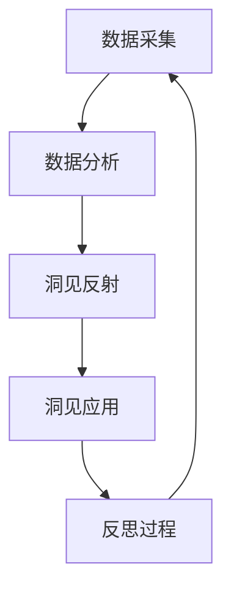

                 

# 洞见的力量：从反思到升华

> 关键词：洞见反射,反思过程,洞察力,决策优化,技术内省

## 1. 背景介绍

### 1.1 问题由来
在信息化、数字化高度发达的今天，我们每天都在处理着海量数据，也面临着来自各个方向的信息冲击。如何从这些纷繁复杂的信息中，抽取有价值的洞见，指导我们的决策和行动，成为个体和组织面临的重要挑战。传统的经验法则、直觉判断、数据分析等方法，虽然有效，但难以完全应对信息时代的复杂性。

### 1.2 问题核心关键点
洞见（Insight），即通过深度思考和分析，揭示事物本质和规律的认知。在信息技术高速发展的今天，洞见的力量变得尤为重要。它不仅帮助我们应对快速变化的环境，还能提升决策质量，驱动技术创新和业务增长。

洞见的力量主要体现在以下几个方面：

1. **决策优化**：通过数据驱动的洞见，我们能够更准确地预判市场趋势、客户需求，优化业务决策。
2. **技术内省**：洞见不仅能指导技术应用，还能促使我们反思技术局限、寻找改进空间。
3. **战略布局**：洞察行业的长期趋势和短期的竞争动态，制定更为合理的战略计划。

本博客旨在通过剖析洞见的本质，揭示洞见从形成到应用的全过程，并探讨如何利用技术手段，提升个体和组织获取和应用洞见的能力。

## 2. 核心概念与联系

### 2.1 核心概念概述

在探讨洞见的力量之前，首先需要明确几个核心概念：

- **数据采集**：收集、整理、清洗数据的过程。数据的质量直接影响洞见的准确性和有效性。
- **数据分析**：使用统计学、机器学习等方法，对数据进行分析和挖掘，揭示隐藏的模式和规律。
- **洞见反射**：通过深度思考和逻辑推理，对数据分析结果进行归纳总结，形成具有指导意义的洞见。
- **洞见应用**：将洞见转化为具体的行动方案，实现决策优化、技术改进、战略调整等目标。
- **反思过程**：洞见获取后的持续优化过程，包括对洞见效果的评估、对方法论的迭代改进等。

这些概念之间相互联系，共同构成了洞见的力量体系。

### 2.2 核心概念原理和架构的 Mermaid 流程图(Mermaid 流程节点中不要有括号、逗号等特殊字符)



这个流程图展示了洞见的力量从数据采集、数据分析、洞见反射、洞见应用到反思过程的全链条。数据采集为洞见提供了物质基础，数据分析揭示了数据的内在规律，洞见反射形成了具有指导意义的洞见，洞见应用实现了洞见的价值转化，反思过程则不断优化洞见质量，形成良性循环。

## 3. 核心算法原理 & 具体操作步骤

### 3.1 算法原理概述

洞见的力量，本质上是数据驱动的决策过程。通过数据采集、数据分析、洞见反射、洞见应用等步骤，实现从数据到洞见再到行动的闭环管理。以下是核心算法原理的概述：

1. **数据采集**：使用爬虫、API接口、数据库等方式，从不同来源获取结构化和非结构化数据。
2. **数据分析**：应用统计学、机器学习、深度学习等技术，对数据进行特征提取、模型训练、模式识别等操作，挖掘数据的潜在价值。
3. **洞见反射**：结合业务知识和领域专家的经验，对数据分析结果进行深入分析和逻辑推理，形成具有指导意义的洞见。
4. **洞见应用**：将洞见应用于实际的决策、技术、战略等场景中，实现问题解决和业务改进。
5. **反思过程**：评估洞见应用效果，总结经验教训，优化洞见获取和应用的方法论，形成持续改进的循环。

### 3.2 算法步骤详解

#### 3.2.1 数据采集

数据采集是洞见获取的第一步，通常包括以下几个关键步骤：

1. **数据源确定**：明确需要采集的数据类型和来源，如社交媒体、日志文件、传感器数据等。
2. **数据采集工具选择**：根据数据类型选择合适的采集工具，如Web爬虫、API接口、数据库查询等。
3. **数据清洗**：去除数据中的噪声、异常值、重复数据等，确保数据的质量和完整性。

#### 3.2.2 数据分析

数据分析是洞见形成的核心环节，通过模型和算法对数据进行深度挖掘，揭示数据背后的模式和规律。以下是常见的数据分析方法：

1. **统计分析**：使用均值、中位数、方差等统计量对数据进行描述和总结。
2. **机器学习**：应用回归、分类、聚类等算法，从数据中提取特征和规律。
3. **深度学习**：使用神经网络等模型，对数据进行更复杂的非线性映射和模式识别。

#### 3.2.3 洞见反射

洞见反射是将数据分析结果转化为具有指导意义的洞见，主要包括以下几个步骤：

1. **数据可视化**：通过图表、仪表盘等方式，直观展示数据的关键指标和趋势。
2. **假设验证**：结合业务背景和专家经验，对数据中的现象和规律进行假设，并通过进一步的数据分析验证假设的正确性。
3. **逻辑推理**：通过逻辑推理和因果分析，将数据分析结果转化为具体的洞见，形成业务指导。

#### 3.2.4 洞见应用

洞见应用是将洞见转化为具体行动的过程，涉及以下步骤：

1. **策略制定**：根据洞见结果，制定具体的业务策略和行动计划。
2. **执行与监控**：将策略和计划落实到具体的执行中，并实时监控执行效果和进展。
3. **效果评估**：评估策略实施后的效果和影响，根据评估结果进行调整和优化。

#### 3.2.5 反思过程

反思过程是对洞见获取和应用效果的持续优化，主要包括以下几个方面：

1. **效果评估**：对洞见应用的效果进行评估，包括业务目标的达成情况、策略实施的难易度等。
2. **方法改进**：总结洞见获取和应用过程中的经验和教训，优化数据分析方法和业务策略。
3. **知识积累**：将洞见获取和应用过程中的关键知识和经验，形成系统的知识库和操作指南。

### 3.3 算法优缺点

洞见的力量，具有以下优点和局限性：

**优点**：

1. **决策支持**：数据驱动的洞见能够提供更准确、全面的决策支持，提升决策质量和效率。
2. **问题解决**：通过深度分析和逻辑推理，洞见能够揭示问题的本质和根源，提出更有效的解决方案。
3. **持续改进**：洞见获取和应用的反思过程，能够持续优化洞见质量，形成良性循环。

**局限性**：

1. **数据依赖**：洞见的力量高度依赖于数据的质量和数量，数据不全或不准确会严重影响洞见的准确性。
2. **技术门槛**：数据分析和洞见反射需要较强的技术能力，技术门槛较高。
3. **方法局限**：现有的数据分析和洞见反射方法存在一定的局限性，难以应对复杂多变的数据和业务场景。

### 3.4 算法应用领域

洞见的力量不仅适用于商业决策和业务优化，还广泛应用于以下几个领域：

1. **金融风险管理**：通过数据分析和洞见反射，评估金融产品的风险和市场趋势，制定风险控制策略。
2. **医疗健康管理**：利用患者数据和医疗记录，分析疾病趋势和患者行为，提升诊疗效果和健康管理。
3. **供应链优化**：通过数据分析和洞见反射，优化供应链的各个环节，提升运营效率和成本控制。
4. **市场营销策略**：分析用户行为数据和市场反馈，制定更精准的市场营销策略，提升品牌影响力和市场份额。
5. **人力资源管理**：通过员工数据和绩效分析，优化人才招聘、培训和发展策略，提升企业竞争力。

## 4. 数学模型和公式 & 详细讲解 & 举例说明

### 4.1 数学模型构建

本节将使用数学语言对洞见的力量进行更加严格的刻画。

设数据集为 $D=\{(x_i, y_i)\}_{i=1}^N$，其中 $x_i$ 为输入，$y_i$ 为输出，假设 $y_i$ 服从分布 $p(y_i|x_i;\theta)$，其中 $\theta$ 为模型参数。洞见的形成过程可以通过以下数学模型表示：

1. **数据采集**：收集 $N$ 个样本 $(x_i, y_i)$，形成数据集 $D$。
2. **数据分析**：构建模型 $p(y_i|x_i;\theta)$，使用数据 $D$ 进行模型训练，得到参数 $\theta$。
3. **洞见反射**：通过逻辑推理和假设验证，对模型 $p(y_i|x_i;\theta)$ 进行假设 $H$，通过数据分析结果验证假设 $H$ 的准确性。
4. **洞见应用**：将假设 $H$ 转化为具体的业务策略，应用于实际场景中。
5. **反思过程**：评估策略效果，优化模型参数 $\theta$ 和假设 $H$，形成持续改进的循环。

### 4.2 公式推导过程

以下是基于上述模型的详细公式推导过程：

#### 4.2.1 数据采集和模型训练

设数据集 $D=\{(x_i, y_i)\}_{i=1}^N$，通过数据采集工具获取数据后，使用机器学习模型进行训练，得到参数 $\theta$。假设使用的模型为线性回归模型，则参数 $\theta$ 的训练过程为：

$$
\theta = \mathop{\arg\min}_{\theta} \frac{1}{N}\sum_{i=1}^N (y_i - \hat{y}_i)^2
$$

其中 $\hat{y}_i = \theta x_i$ 为模型预测值。

#### 4.2.2 洞见反射和假设验证

假设通过数据分析得到模型 $p(y_i|x_i;\theta)$，需要对其进行假设验证和逻辑推理，形成洞见。假设 $H$ 为：

$$
H: \exists \alpha, \beta, \gamma, \delta \in \mathbb{R}, s.t. p(y_i|x_i;\theta) = \alpha \exp(-\beta (x_i - \gamma)^2) + \delta
$$

假设验证过程为：

$$
H': \forall (x_i, y_i) \in D, p(y_i|x_i;\theta) = \alpha \exp(-\beta (x_i - \gamma)^2) + \delta
$$

通过计算假设 $H'$ 的似然函数，评估假设 $H'$ 与真实数据的拟合度。

#### 4.2.3 洞见应用和策略制定

根据假设 $H$，制定具体的业务策略。例如，在金融风险管理中，根据模型 $p(y_i|x_i;\theta)$ 预测的风险概率，制定相应的风险控制策略。

#### 4.2.4 反思过程和持续改进

评估策略效果，通过数据分析和逻辑推理，形成新的假设 $H'$，优化模型参数 $\theta$ 和假设 $H'$，形成持续改进的循环。

### 4.3 案例分析与讲解

#### 案例一：金融风险管理

在金融领域，通过数据采集和数据分析，可以构建风险评估模型。假设收集了贷款申请者的个人信息和历史还款记录，构建模型 $p(y_i|x_i;\theta)$ 评估每个贷款申请者的违约概率。

1. **数据采集**：收集贷款申请者的个人信息、历史还款记录等数据。
2. **数据分析**：构建线性回归模型 $p(y_i|x_i;\theta)$，训练得到参数 $\theta$。
3. **洞见反射**：假设 $H$：贷款申请者的收入、信用记录等因素与违约概率相关。通过数据分析结果验证假设 $H$ 的准确性。
4. **洞见应用**：根据模型 $p(y_i|x_i;\theta)$ 预测每个贷款申请者的违约概率，制定风险控制策略，如贷款审批、信用评分等。
5. **反思过程**：评估策略效果，通过数据分析和逻辑推理，形成新的假设 $H'$，优化模型参数 $\theta$ 和假设 $H'$，形成持续改进的循环。

#### 案例二：市场营销策略

在市场营销领域，通过数据采集和数据分析，可以分析客户行为和市场趋势。假设收集了客户的浏览记录、购买记录等数据，构建模型 $p(y_i|x_i;\theta)$ 分析客户行为。

1. **数据采集**：收集客户的浏览记录、购买记录等数据。
2. **数据分析**：构建决策树模型 $p(y_i|x_i;\theta)$，训练得到参数 $\theta$。
3. **洞见反射**：假设 $H$：客户的浏览行为与购买意愿相关。通过数据分析结果验证假设 $H$ 的准确性。
4. **洞见应用**：根据模型 $p(y_i|x_i;\theta)$ 预测客户的购买意愿，制定个性化营销策略。
5. **反思过程**：评估策略效果，通过数据分析和逻辑推理，形成新的假设 $H'$，优化模型参数 $\theta$ 和假设 $H'$，形成持续改进的循环。

## 5. 项目实践：代码实例和详细解释说明

### 5.1 开发环境搭建

在进行洞见的力量实践前，我们需要准备好开发环境。以下是使用Python进行TensorFlow和Keras开发的环境配置流程：

1. 安装Anaconda：从官网下载并安装Anaconda，用于创建独立的Python环境。

2. 创建并激活虚拟环境：
```bash
conda create -n insight-env python=3.8 
conda activate insight-env
```

3. 安装TensorFlow和Keras：
```bash
conda install tensorflow keras
```

4. 安装各类工具包：
```bash
pip install numpy pandas scikit-learn matplotlib tqdm jupyter notebook ipython
```

完成上述步骤后，即可在`insight-env`环境中开始洞见的力量实践。

### 5.2 源代码详细实现

我们以金融风险管理为例，给出使用TensorFlow和Keras进行数据分析和洞见反思的Python代码实现。

首先，定义数据处理函数：

```python
import pandas as pd
import tensorflow as tf

def load_data(path):
    data = pd.read_csv(path)
    x = data[['income', 'credit_score', 'loan_amount']]
    y = data['default']
    return x, y
```

然后，定义模型和损失函数：

```python
def build_model():
    model = tf.keras.Sequential([
        tf.keras.layers.Dense(64, activation='relu', input_shape=(3,)),
        tf.keras.layers.Dense(1, activation='sigmoid')
    ])
    loss = tf.keras.losses.BinaryCrossentropy()
    optimizer = tf.keras.optimizers.Adam()
    return model, loss, optimizer
```

接着，定义训练和评估函数：

```python
def train_model(model, x, y, batch_size, epochs):
    model.compile(optimizer=optimizer, loss=loss, metrics=['accuracy'])
    model.fit(x, y, batch_size=batch_size, epochs=epochs, validation_split=0.2)
    return model

def evaluate_model(model, x, y, batch_size):
    model.evaluate(x, y, batch_size=batch_size)
```

最后，启动训练流程并在测试集上评估：

```python
x_train, x_test, y_train, y_test = load_data('data.csv')
x_train, x_val, y_train, y_val = x_train[:80], x_train[80:], y_train[:80], y_train[80:]

model, loss, optimizer = build_model()
train_model(model, x_train, y_train, batch_size=32, epochs=10)
evaluate_model(model, x_test, y_test, batch_size=32)
```

以上就是使用TensorFlow和Keras进行金融风险管理数据分析的完整代码实现。可以看到，通过TensorFlow和Keras，我们可以用相对简洁的代码完成模型的构建、训练和评估。

### 5.3 代码解读与分析

让我们再详细解读一下关键代码的实现细节：

**load_data函数**：
- 定义了数据加载函数，从指定路径读取CSV格式的数据文件，并将其转换为Pandas DataFrame格式。

**build_model函数**：
- 定义了金融风险管理模型的构建过程，包括输入层、隐藏层和输出层，使用ReLU激活函数和sigmoid激活函数。
- 定义了损失函数BinaryCrossentropy，用于二分类问题的训练。

**train_model函数**：
- 定义了模型的编译过程，包括优化器Adam和损失函数BinaryCrossentropy。
- 使用fit方法对模型进行训练，指定批次大小和迭代轮数，并使用验证集进行性能评估。

**evaluate_model函数**：
- 定义了模型的评估过程，使用evaluate方法在测试集上计算模型精度。

**训练流程**：
- 从数据文件中加载训练集和测试集。
- 将训练集分为训练集和验证集，使用训练集训练模型，并在验证集上评估模型性能。
- 输出训练集和测试集上的模型精度。

可以看到，TensorFlow和Keras的强大封装使得数据分析和模型构建的过程变得简洁高效。开发者可以将更多精力放在业务逻辑和模型改进上，而不必过多关注底层实现细节。

当然，工业级的系统实现还需考虑更多因素，如模型的保存和部署、超参数的自动搜索、更灵活的模型设计等。但核心的洞见获取和应用过程基本与此类似。

## 6. 实际应用场景

### 6.1 智能客服系统

基于洞见的力量，智能客服系统可以更加精准地理解和回复用户咨询。通过数据分析和洞见反思，智能客服系统能够自动提取用户行为模式，预测用户需求，提升客服效率和用户满意度。

在技术实现上，可以收集用户的历史互动数据，分析用户的常见问题、情绪变化等行为模式。将分析结果反馈到智能客服系统中，动态调整对话策略，生成更个性化和精准的回复。同时，系统可以根据用户反馈，持续优化对话模型，提升客服系统的智能化水平。

### 6.2 金融舆情监测

在金融领域，洞见的力量可以帮助机构及时监测市场动态，防范风险。通过数据分析和洞见反思，金融机构能够实时跟踪舆情变化，预测市场趋势，及时调整投资策略。

具体而言，可以收集金融市场的各类新闻、评论、交易数据，分析其中的关键信息。将分析结果转化为具体的风险预警指标，实时监测市场动向。一旦发现异常情况，系统便自动预警，帮助金融机构及时应对市场风险。

### 6.3 个性化推荐系统

在电商、视频、音乐等平台，洞见的力量可以帮助系统推荐更加符合用户喜好的内容。通过数据分析和洞见反思，推荐系统能够深入理解用户兴趣，动态调整推荐策略，提升用户体验。

具体实现上，可以收集用户的历史浏览记录、评价数据等，分析用户的兴趣偏好。将分析结果转化为具体的推荐算法，实时推荐用户可能感兴趣的商品、视频、文章等内容。同时，系统可以根据用户反馈，持续优化推荐算法，提升推荐效果。

### 6.4 未来应用展望

展望未来，洞见的力量将在更多领域得到应用，为各行各业带来新的变革。

在智慧医疗领域，洞见的力量可以帮助医疗机构提升诊疗效果。通过数据分析和洞见反思，医疗机构能够深入理解患者病历数据，优化诊疗流程，提升医疗服务质量。

在智能制造领域，洞见的力量可以帮助企业优化生产过程。通过数据分析和洞见反思，企业能够深入理解生产数据，优化生产参数，提升生产效率和产品质量。

在智慧城市治理中，洞见的力量可以帮助城市管理者提升管理效率。通过数据分析和洞见反思，城市管理者能够深入理解城市运行数据，优化资源配置，提升城市治理水平。

此外，在教育、交通、环境保护等众多领域，洞见的力量也将不断拓展，为各行各业带来新的突破。相信随着技术的不断演进，洞见的力量将引领人工智能技术迈向更高的台阶，为构建智能社会提供新的动力。

## 7. 工具和资源推荐

### 7.1 学习资源推荐

为了帮助开发者系统掌握洞见的力量，这里推荐一些优质的学习资源：

1. 《数据科学导论》系列课程：由斯坦福大学开设，涵盖数据采集、数据分析、洞见反思等核心内容，适合初学者入门。
2. Kaggle平台：数据科学竞赛平台，提供丰富的数据集和社区讨论，帮助开发者实战练习。
3. Coursera《深度学习》课程：由深度学习专家Andrew Ng主讲，涵盖神经网络、卷积神经网络、循环神经网络等核心内容。
4. 《Python数据科学手册》书籍：介绍Python在数据分析和机器学习中的应用，适合中高级开发者深入学习。
5. TensorFlow官方文档：TensorFlow的详细文档，提供丰富的示例和API接口，适合深入学习和实践。

通过对这些资源的学习实践，相信你一定能够快速掌握洞见的力量，并用于解决实际的业务问题。

### 7.2 开发工具推荐

高效的开发离不开优秀的工具支持。以下是几款用于洞见力量开发的常用工具：

1. TensorFlow：由Google主导开发的深度学习框架，支持GPU/TPU加速，适合大规模工程应用。
2. Keras：基于TensorFlow的高级API，提供简单易用的模型构建接口，适合快速原型开发。
3. Pandas：数据分析库，提供丰富的数据处理和分析功能，适合数据预处理和探索性分析。
4. Matplotlib和Seaborn：数据可视化库，提供丰富的图表和绘图功能，适合数据可视化。
5. Jupyter Notebook：交互式笔记本环境，支持多种编程语言和数据科学库，适合快速迭代实验。

合理利用这些工具，可以显著提升洞见的力量开发效率，加快创新迭代的步伐。

### 7.3 相关论文推荐

洞见的力量源自学界的持续研究。以下是几篇奠基性的相关论文，推荐阅读：

1. 《统计学习基础》：由李航著，介绍统计学习的基本概念和常用方法，适合初学者入门。
2. 《深度学习》：由Ian Goodfellow、Yoshua Bengio、Aaron Courville合著，涵盖深度学习的基本原理和应用。
3. 《数据科学导论》：由Jake VanderPlas著，介绍数据科学的基本流程和常用工具，适合初学者入门。
4. 《数据挖掘导论》：由Jerry Kilian、Khalid Sayood著，介绍数据挖掘的基本概念和常用方法，适合深入学习。
5. 《机器学习》：由Tom Mitchell著，介绍机器学习的基本概念和常用方法，适合深入学习。

这些论文代表了大数据和人工智能技术的发展脉络。通过学习这些前沿成果，可以帮助研究者把握学科前进方向，激发更多的创新灵感。

## 8. 总结：未来发展趋势与挑战

### 8.1 总结

本文对洞见的力量进行了全面系统的介绍。首先阐述了洞见的力量在信息时代的重要性，明确了洞见在数据驱动决策中的核心作用。其次，从原理到实践，详细讲解了洞见从数据采集到洞见应用的全过程，给出了洞见力量获取的完整代码实例。同时，本文还探讨了洞见的力量在多个行业领域的应用前景，展示了洞见力量带来的变革性影响。最后，本文还推荐了相关的学习资源、开发工具和研究论文，为开发者提供全方位的技术指引。

通过本文的系统梳理，可以看到，洞见的力量不仅适用于商业决策和业务优化，还广泛应用于金融风险管理、智能客服、个性化推荐等众多领域。洞见的力量正成为数据驱动决策的重要工具，助力企业和个人提升决策质量和效率。

### 8.2 未来发展趋势

展望未来，洞见的力量将在更多领域得到应用，为各行各业带来新的变革。

1. **自动化和智能化**：随着AI技术的发展，洞见的力量将逐步实现自动化和智能化。通过智能算法和大数据技术，洞见的力量能够快速获取、分析和应用，提升决策效率。
2. **跨领域融合**：洞见的力量将与物联网、区块链、云计算等新兴技术深度融合，形成更为综合的数据驱动解决方案。
3. **可解释性和可控性**：随着技术的不断演进，洞见的力量将具备更强的可解释性和可控性，能够提供更为透明和可靠的决策支持。
4. **跨文化普适性**：洞见的力量将跨越文化和语言的界限，形成更加普适化的决策支持工具。
5. **个性化和定制化**：洞见的力量将实现个性化和定制化，能够根据不同场景和用户需求，提供更加精准和高效的决策支持。

### 8.3 面临的挑战

尽管洞见的力量已经取得了显著进展，但在其发展和应用过程中，仍面临以下挑战：

1. **数据质量和安全**：数据质量不高、数据泄露等问题将影响洞见的力量效果。
2. **技术和工具的复杂性**：洞见的力量需要复杂的算法和技术支持，技术门槛较高。
3. **隐私和伦理问题**：数据的使用和分析可能涉及隐私和伦理问题，需要建立相应的法律法规。
4. **跨领域应用难度**：不同领域的业务场景和数据类型差异较大，洞见的力量需要跨领域应用，难度较大。
5. **技术演进速度**：技术和算法的演进速度非常快，需要不断更新知识，保持技术领先。

### 8.4 研究展望

面对洞见的力量所面临的挑战，未来的研究需要在以下几个方面寻求新的突破：

1. **跨领域知识图谱**：构建跨领域的知识图谱，实现不同领域数据和洞见的整合，提升洞见的力量普适性。
2. **深度学习与符号推理的结合**：将深度学习和符号推理技术结合，提升洞见的力量推理能力和逻辑性。
3. **动态学习与在线学习**：研究动态学习与在线学习算法，实现模型的持续优化和实时更新。
4. **可解释性和可控性增强**：提高模型的可解释性和可控性，增强决策过程的透明性和可信度。
5. **隐私保护与数据治理**：研究隐私保护和数据治理技术，确保数据使用的合法性和伦理性。

这些研究方向的探索，必将引领洞见的力量技术迈向更高的台阶，为构建智能社会提供新的动力。面向未来，洞见的力量需要与其他人工智能技术进行更深入的融合，共同推动自然语言理解和智能交互系统的进步。只有勇于创新、敢于突破，才能不断拓展洞见的力量边界，让智能技术更好地造福人类社会。

## 9. 附录：常见问题与解答

**Q1：洞见的力量能否应用于所有业务场景？**

A: 洞见的力量在大多数业务场景中都能发挥作用，但具体应用效果受数据质量、数据量、业务复杂度等因素的影响。对于数据质量较高、数据量较大、业务场景复杂的场景，洞见的力量能够提供更有价值的决策支持。但对于数据质量不高、数据量较少、业务场景简单的场景，洞见的力量效果可能有限。

**Q2：如何确保洞见的力量准确性和可靠性？**

A: 确保洞见的力量准确性和可靠性，需要从数据采集、数据处理、模型训练、洞见反思等多个环节进行全面优化。具体措施包括：

1. 数据采集：选择高质量的数据源，收集尽可能多的数据。
2. 数据处理：进行数据清洗、特征提取、数据增强等处理，确保数据的质量和多样性。
3. 模型训练：选择适当的模型和算法，进行充分的训练和验证，确保模型的准确性和泛化能力。
4. 洞见反思：结合业务知识和专家经验，对模型和数据分析结果进行深入反思，确保洞见的力量符合业务需求。

**Q3：如何提升洞见的力量应用效果？**

A: 提升洞见的力量应用效果，需要从多个方面进行优化：

1. 数据质量：选择高质量的数据源，确保数据的完整性和准确性。
2. 算法选择：根据业务场景选择适当的算法和技术，提升模型的准确性和泛化能力。
3. 模型调参：通过超参数调优，优化模型的性能和效果。
4. 洞见反思：结合业务知识和专家经验，对洞见的力量进行深入反思，提升洞见的准确性和可操作性。

**Q4：洞见的力量是否需要持续优化？**

A: 是的，洞见的力量需要持续优化。由于业务环境和数据分布的变化，洞见的力量可能面临失效的风险。因此，需要定期评估洞见的力量效果，进行持续优化和更新。

**Q5：如何构建跨领域的洞见力量系统？**

A: 构建跨领域的洞见力量系统，需要以下步骤：

1. 数据整合：收集和整合不同领域的业务数据，形成统一的数据集。
2. 模型融合：将不同领域的模型和算法进行融合，提升跨领域的洞见力量效果。
3. 知识图谱：构建跨领域的知识图谱，实现不同领域数据和洞见的整合。
4. 多模态融合：将不同模态的数据进行融合，提升洞见的力量跨模态能力。

通过这些措施，可以实现跨领域的洞见力量系统，提升整体决策效率和效果。

---

作者：禅与计算机程序设计艺术 / Zen and the Art of Computer Programming

