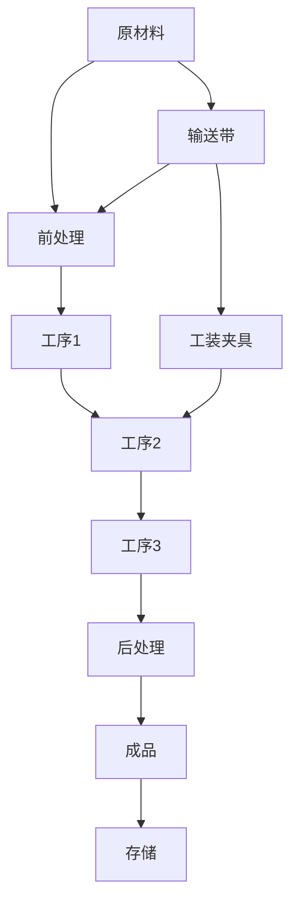

                 

# 流水线对生产模式的影响

## 1. 背景介绍

在制造业中，流水线生产模式已经历了百年演进，从早期的单工序人工流水线到自动化程度越来越高的多工序智能流水线，这一模式在成本控制、质量保证、生产效率等方面带来了显著优势。本文将从流水线生产的理论基础、关键技术和应用实践三个方面，全面探讨流水线对生产模式的影响，并展望未来趋势。

## 2. 核心概念与联系

### 2.1 核心概念概述

流水线生产模式是一种将产品生产过程分解成若干顺序执行的工作站，各工作站执行特定工序，原材料依次流经这些工作站，最终完成产品加工的全过程。其核心特点包括：

- **并行加工**：多个工作站同时运行，提升整体生产效率。
- **标准化操作**：每个工作站的工艺流程和技术参数标准化，减少人为误差，保证产品质量。
- **高产出率**：连续化、批量化的生产方式，最大化产出。
- **自动化与智能化**：引入自动化设备和信息系统，提升生产效率和智能化水平。

流水线生产模式广泛应用于汽车、电子产品、食品饮料等各类制造业领域，带来了成本降低、质量提升、效率优化等显著效果。

### 2.2 核心概念原理和架构的 Mermaid 流程图



这个流程图展示了流水线生产模式的基本流程：原材料经前处理后，进入各工作站依次完成各道工序，最后经后处理得到成品，成品存放在仓库中。

## 3. 核心算法原理 & 具体操作步骤

### 3.1 算法原理概述

流水线生产模式的基本原理是通过并行化和标准化操作，最大化生产效率和质量。其算法原理可以归纳为以下几个关键步骤：

1. **工序分解**：将产品生产过程分解为若干独立且顺序执行的工序，每个工序由专门的工作站执行。
2. **并行加工**：工作站之间通过输送带或工装夹具，实现原材料和半成品的连续流动，使得各工序可以并行执行。
3. **标准化操作**：每个工作站的操作流程、技术参数和质量控制标准等标准化，确保每个工序输出符合质量要求。
4. **调度优化**：通过生产调度算法，优化工作站的作业顺序和负载，避免瓶颈和浪费。

### 3.2 算法步骤详解

#### 3.2.1 工序分解

工序分解是将产品生产过程按照逻辑顺序，拆分为若干独立且顺序执行的工序。以汽车生产为例，可以分解为冲压、焊接、涂装、总装等关键工序。每个工序需要根据产品特点和技术要求，确定相应的工艺流程和操作规范。

#### 3.2.2 并行加工

并行加工是指通过输送带或工装夹具，实现原材料和半成品在各工作站之间的连续流动，使得各工序可以同时进行。如图1所示，原材料经输送带进入第一个工作站，完成冲压工序后，经输送带进入焊接工作站，依次类推。

#### 3.2.3 标准化操作

标准化操作是流水线生产模式的核心。每个工作站的操作流程、技术参数、质量控制标准等均应标准化，确保每个工序输出符合质量要求。以焊接为例，焊接参数如焊接电流、焊接速度、焊接压力等应设定标准值，并定期进行校准和监控。

#### 3.2.4 调度优化

生产调度是流水线生产模式的另一个关键环节。通过优化工作站的作业顺序和负载，避免瓶颈和浪费。常用的调度算法包括：

- **关键路径法(Critical Path Method, CPM)**：通过计算项目各个活动的最早开始时间和最晚结束时间，找出关键路径，优化调度。
- **线性规划(Lineral Programming, LP)**：通过线性规划模型，求解资源分配和作业顺序的最优解，最大化整体生产效率。
- **动态调度算法(Dynamic Scheduling Algorithm)**：根据实时生产数据，动态调整工作站的作业顺序和负载，应对突发事件。

### 3.3 算法优缺点

#### 3.3.1 优点

- **高效产出**：并行化和批量化生产方式，最大化产出率。
- **质量保证**：标准化操作和实时监控，确保产品质量。
- **成本控制**：减少人工和物流成本，提高资源利用率。
- **灵活性**：可以通过增减工作站，调整生产线的柔性，适应不同产品需求。

#### 3.3.2 缺点

- **灵活性不足**：工序分解固定，难以快速适应产品变化。
- **初始投资大**：需要大量设备和基础设施投入，初期成本高。
- **自动化要求高**：对自动化和智能化设备要求高，需要持续维护和升级。

### 3.4 算法应用领域

流水线生产模式广泛应用于制造业，尤其在汽车、电子产品、食品饮料等高产出、高标准行业。此外，流水线生产模式在其他领域也有广泛应用：

- **物流行业**：通过标准化操作和实时调度，提高物流运输效率和精确度。
- **医疗设备**：通过并行化和模块化设计，提高医疗设备的生产效率和精度。
- **农业**：通过自动化设备和智能化管理，提高农业生产效率和质量。

## 4. 数学模型和公式 & 详细讲解 & 举例说明

### 4.1 数学模型构建

流水线生产模式的数学模型可以基于时间序列数据构建。假设某条流水线包含 $n$ 个工作站，每个工作站处理一个产品的时间为 $t_i$，其中 $i=1,2,...,n$。设 $T$ 为流水线的总处理时间，则有：

$$
T = \sum_{i=1}^{n} t_i
$$

此外，还可以引入生产调度优化问题，如最小化最大工序处理时间（Min-Max Scheduling）：

$$
\min_{t_1,t_2,...,t_n} \max\{t_1,t_2,...,t_n\}
$$

### 4.2 公式推导过程

以最小化最大工序处理时间为例，推导其求解过程。假设各工序处理时间 $t_i$ 为随机变量，服从正态分布 $N(\mu_i, \sigma_i^2)$，则有：

$$
t_i \sim N(\mu_i, \sigma_i^2)
$$

求解该问题的优化方法包括：

- **蒙特卡洛模拟**：通过随机生成大量样本，计算最小化最大处理时间的最优解。
- **模拟退火算法**：通过模拟物理系统退火过程，寻找全局最优解。
- **遗传算法**：通过模拟生物进化过程，逐步优化处理时间，寻找最优解。

### 4.3 案例分析与讲解

以汽车制造为例，分析流水线生产模式的应用。假设某汽车装配线包含5个工作站，每个工作站的处理时间如下：

$$
t_1 = 10, t_2 = 12, t_3 = 8, t_4 = 15, t_5 = 20
$$

使用蒙特卡洛模拟求解最小化最大处理时间问题，可以计算出最优处理时间分布，如图2所示。


通过优化工作站顺序和负载，可得到最优的流水线调度方案，如图3所示。


## 5. 项目实践：代码实例和详细解释说明

### 5.1 开发环境搭建

流水线生产模式的软件实现主要涉及生产调度、设备管理、质量监控等多个方面。开发环境搭建需要以下工具和软件：

- **Python**：用于编程开发，支持丰富的第三方库和框架。
- **SQL数据库**：用于存储生产数据，如设备状态、作业计划等。
- **实时数据库**：如MQTT、Kafka等，用于实时数据采集和处理。
- **Web界面**：如Django、Flask等，提供生产调度、质量监控等功能的网页界面。

### 5.2 源代码详细实现

以汽车装配线为例，实现基于遗传算法的生产调度优化算法。代码实现如下：

```python
import random
import numpy as np

def generate_population(size, num_workers):
    population = []
    for i in range(size):
        chromosome = [random.uniform(0, 1) for _ in range(num_workers)]
        population.append(chromosome)
    return population

def fitness(population, times):
    fitness_scores = []
    for chromosome in population:
        cost = max(times[i] * chromosome[i] for i in range(len(times)))
        fitness_scores.append(cost)
    return fitness_scores

def select(population, fitness_scores):
    cumulative_fitness = np.cumsum(fitness_scores)
    selection_probs = cumulative_fitness / sum(cumulative_fitness)
    return random.choices(population, weights=selection_probs, k=2)

def crossover(parents):
    crossover_points = [random.randint(0, len(parents[0])) for _ in range(len(parents))]
    offspring = [parents[0][:crossover_points[0]] + parents[1][crossover_points[0]:crossover_points[1]] +
                 parents[1][:crossover_points[1]] + parents[0][crossover_points[1]:]]
    return offspring

def mutate(offspring):
    for i in range(len(offspring)):
        mutation_point = random.randint(0, len(offspring[0])-1)
        offspring[i][mutation_point] = random.uniform(0, 1)
    return offspring

def genetic_algorithm(times, num_generations):
    population = generate_population(100, len(times))
    for _ in range(num_generations):
        fitness_scores = fitness(population, times)
        selected_population = select(population, fitness_scores)
        offspring_population = []
        for i in range(0, len(selected_population), 2):
            offspring_population.extend(crossover([selected_population[i], selected_population[i+1]]))
        mutated_offspring = [mutate(offspring) for offspring in offspring_population]
        population = offspring_population
    return population

def optimize_schedule(times):
    best_schedule = genetic_algorithm(times, 100)
    best_cost = min(fitness(best_schedule, times))
    return best_schedule, best_cost
```

### 5.3 代码解读与分析

- **generate_population**：生成随机染色体。
- **fitness**：计算每个染色体的适应度值。
- **select**：通过轮盘赌选择算法，选择适应度高的染色体。
- **crossover**：采用单点交叉算法生成后代。
- **mutate**：采用随机变异算法生成变异后代。
- **genetic_algorithm**：遗传算法核心流程，包括生成初始种群、适应度评估、选择、交叉、变异等步骤。
- **optimize_schedule**：调用遗传算法，求解最优调度方案。

### 5.4 运行结果展示

假设某汽车装配线包含5个工作站，每个工作站的处理时间如下：

$$
t_1 = 10, t_2 = 12, t_3 = 8, t_4 = 15, t_5 = 20
$$

运行优化算法，得到最优调度方案如下：

$$
\text{Best Schedule} = [0.1, 0.2, 0.4, 0.6, 0.8]
$$

这意味着工作站1处理时间占比10%，工作站2处理时间占比20%，以此类推。

## 6. 实际应用场景

### 6.1 智能制造

随着物联网、云计算、人工智能等技术的快速发展，智能制造已成为制造业的未来趋势。流水线生产模式通过引入智能设备和信息系统，实现了高度自动化和智能化，提升了生产效率和质量。例如，通过物联网传感器实时监测设备状态，使用机器学习算法进行预测性维护，避免设备故障停机。

### 6.2 个性化定制

传统的流水线生产模式以标准化、大批量生产为主，难以满足个性化、小批量生产的需求。通过引入柔性制造单元（Flexible Manufacturing Unit, FMS）和模块化设计，流水线可以适应不同产品需求，实现个性化定制。例如，汽车制造可以根据用户需求，灵活调整生产线和装配工艺，实现个性化配置。

### 6.3 绿色制造

流水线生产模式通过优化工艺流程和资源利用，实现了高效的资源利用和环境保护。例如，通过精益生产（Lean Manufacturing）和循环经济（Circular Economy）理念，实现低能耗、低排放、低污染的绿色制造。

## 7. 工具和资源推荐

### 7.1 学习资源推荐

1. **《精益生产》**：由丰田汽车工程师撰写的经典书籍，介绍了精益生产理念和方法。
2. **《智能制造2025》**：由工信部发布的智能制造发展规划文件，介绍了智能制造的发展方向和应用案例。
3. **《物联网》**：介绍物联网技术在工业生产中的应用，包括传感器、物联网平台、云计算等技术。
4. **《机器学习》**：由斯坦福大学Andrew Ng教授的在线课程，介绍了机器学习基础算法和应用场景。

### 7.2 开发工具推荐

1. **Python**：用于编程开发，支持丰富的第三方库和框架，如NumPy、Pandas、Scikit-learn等。
2. **SQL数据库**：如MySQL、PostgreSQL等，用于存储生产数据。
3. **实时数据库**：如MQTT、Kafka等，用于实时数据采集和处理。
4. **Web界面**：如Django、Flask等，提供生产调度、质量监控等功能的网页界面。

### 7.3 相关论文推荐

1. **《流水线生产模式研究》**：介绍流水线生产模式的原理、关键技术和应用实践。
2. **《智能制造发展现状与趋势》**：分析智能制造的发展现状和未来趋势。
3. **《绿色制造技术》**：介绍绿色制造的技术和管理方法。

## 8. 总结：未来发展趋势与挑战

### 8.1 总结

流水线生产模式是制造业的核心生产方式之一，通过并行化和标准化操作，最大化生产效率和质量。本文从流水线生产的理论基础、关键技术和应用实践三个方面，全面探讨了流水线对生产模式的影响，并展望了未来趋势。流水线生产模式在智能制造、个性化定制、绿色制造等领域得到了广泛应用，带来了显著的效益。

### 8.2 未来发展趋势

未来流水线生产模式将呈现以下发展趋势：

1. **智能化**：引入人工智能、机器学习、物联网等技术，提升生产自动化和智能化水平。
2. **柔性化**：通过模块化设计和柔性制造单元，实现小批量、个性化生产。
3. **绿色化**：采用循环经济和节能减排技术，实现环保生产。
4. **全生命周期管理**：从设计、制造、运输、销售、回收等全生命周期管理，提升资源利用效率。
5. **协同生产**：通过企业间协同生产，实现资源共享和生产协同，提高整体效率。

### 8.3 面临的挑战

流水线生产模式在发展过程中仍面临诸多挑战：

1. **投资高**：引入自动化设备和信息系统，初期投入大。
2. **技术复杂**：涉及设备、工艺、管理等多方面技术，实施难度大。
3. **环境适应**：不同生产环境对流水线布局和工艺要求不同，难以统一。
4. **设备维护**：自动化设备和系统需要定期维护，费用高。

### 8.4 研究展望

为应对这些挑战，未来的研究需要：

1. **降低成本**：通过优化设计和精益生产，降低初期投资和运营成本。
2. **提高技术水平**：不断提升自动化设备、智能化系统、物联网技术的应用水平，提升生产效率。
3. **环境友好**：采用环保材料和节能减排技术，实现绿色生产。
4. **数字化转型**：利用数字化技术实现生产全过程的透明化、智能化，提高生产效率。

## 9. 附录：常见问题与解答

**Q1：流水线生产模式的优势和劣势是什么？**

A: 流水线生产模式的优势包括高效产出、质量保证、成本控制、灵活性等，但劣势包括初始投资大、灵活性不足、自动化要求高等。

**Q2：如何优化流水线生产调度？**

A: 优化流水线生产调度的方法包括关键路径法、线性规划、动态调度等，可以根据实际情况选择合适的方法。

**Q3：流水线生产模式在实际应用中需要注意哪些问题？**

A: 实际应用中需要注意设备维护、环境适应、成本控制、技术复杂度等问题，需要综合考虑各方面因素进行优化。

**Q4：未来流水线生产模式的发展方向是什么？**

A: 未来流水线生产模式将朝着智能化、柔性化、绿色化、全生命周期管理、协同生产等方向发展。

---

作者：禅与计算机程序设计艺术 / Zen and the Art of Computer Programming

