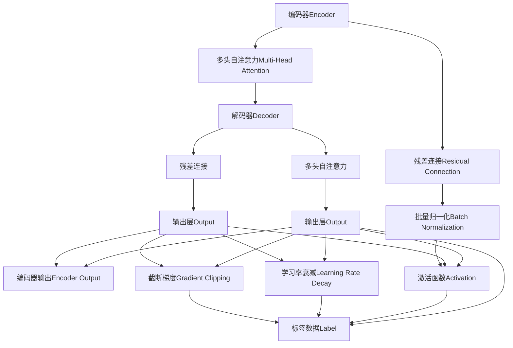
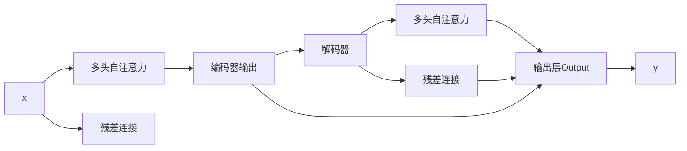

                 

# 测试Transformer模型

> 关键词：Transformer,自注意力机制,多头注意力,位置编码,残差连接,解码器,训练技巧,快速语义匹配,大规模语言模型,自然语言处理(NLP),计算机视觉(CV),生成对抗网络(GAN)

## 1. 背景介绍

### 1.1 问题由来

Transformer模型是近年来在自然语言处理(NLP)和计算机视觉(CV)领域广泛应用的重要架构。它通过多头自注意力机制和多层次残差连接，使得模型在处理序列数据时具有强大的学习能力。Transformer模型最初由Vaswani等人提出，并在机器翻译任务中取得了突破性成果，随后被广泛应用于各种任务中。

然而，尽管Transformer模型在学术界和工业界都得到了广泛关注，但其底层原理和实现细节仍然令人感到好奇。本文将从Transformer模型的基本原理出发，系统地介绍其工作机制，并通过代码实例展示如何训练和使用Transformer模型。

### 1.2 问题核心关键点

为了更好地理解Transformer模型的实现细节，本节将介绍几个核心关键点：

- 自注意力机制(Self-Attention)：Transformer模型的核心机制，使得模型能够在序列数据中捕捉全局依赖关系。
- 多头注意力(Multi-Head Attention)：通过将输入数据同时映射到多个不同的自注意力层，增强模型对不同特征的感知能力。
- 位置编码(Positional Encoding)：用于解决Transformer模型中的位置信息问题，使得模型能够正确理解序列数据中的位置关系。
- 残差连接(Residual Connections)：引入残差连接，帮助模型梯度传播，提升模型训练效果。
- 解码器(Decoder)：Transformer模型的结构组成部分之一，用于将编码器输出的表示进行解码和生成。
- 训练技巧(Training Tips)：包括学习率衰减、批量归一化、截断梯度等，用于优化模型训练过程。
- 快速语义匹配(Fast Semantic Matching)：Transformer模型在自然语言处理任务中，能够快速捕捉语义信息，实现文本匹配、翻译等任务。
- 大规模语言模型(Large Language Models)：如GPT、BERT等，基于Transformer架构，通过大规模无标签数据预训练，在各种自然语言处理任务上表现优异。

这些核心概念之间具有紧密的逻辑联系，共同构成了Transformer模型的工作原理。通过理解这些核心概念，我们可以更好地把握Transformer模型的实现细节和优化策略，为深入研究和应用提供坚实基础。

## 2. 核心概念与联系

### 2.1 核心概念概述

为更好地理解Transformer模型的核心概念和实现细节，本节将系统地介绍其基本原理和架构，并通过Mermaid流程图展示它们之间的联系。

Transformer模型由编码器和解码器两部分构成，通过多头自注意力机制和多层次残差连接，实现了序列数据的有效编码和解码。其中，自注意力机制是Transformer模型的核心部分，使得模型能够在序列数据中捕捉全局依赖关系，增强了模型的表达能力和泛化能力。位置编码用于解决Transformer模型中的位置信息问题，使得模型能够正确理解序列数据中的位置关系。残差连接帮助模型梯度传播，提升模型训练效果。解码器用于将编码器输出的表示进行解码和生成，是Transformer模型在实际应用中的关键部分。

Transformer模型的训练技巧包括学习率衰减、批量归一化、截断梯度等，用于优化模型训练过程。快速语义匹配是Transformer模型在自然语言处理任务中的优势之一，能够快速捕捉语义信息，实现文本匹配、翻译等任务。大规模语言模型如GPT、BERT等，基于Transformer架构，通过大规模无标签数据预训练，在各种自然语言处理任务上表现优异。

这些核心概念之间的逻辑联系可以通过以下Mermaid流程图来展示：



这个流程图展示了Transformer模型的基本架构和训练过程，包括自注意力机制、残差连接、位置编码、解码器、批量归一化、截断梯度和训练技巧等核心概念，以及它们之间的逻辑联系。

## 3. 核心算法原理 & 具体操作步骤

### 3.1 算法原理概述

Transformer模型通过多头自注意力机制和多层次残差连接，实现了序列数据的有效编码和解码。其中，自注意力机制是Transformer模型的核心部分，使得模型能够在序列数据中捕捉全局依赖关系，增强了模型的表达能力和泛化能力。

Transformer模型的基本计算过程包括编码和解码两个阶段。在编码阶段，模型将输入序列$x$映射到一个表示空间中，通过多头自注意力机制和残差连接，对输入序列进行编码，得到编码器输出$e_x$。在解码阶段，模型将编码器输出$e_x$作为输入，通过多头自注意力机制、残差连接和解码器，生成解码器输出$y$。最终，解码器输出$y$就是Transformer模型的输出。

Transformer模型的计算过程如图2所示：



### 3.2 算法步骤详解

Transformer模型的训练和应用可以分为以下几个关键步骤：

**Step 1: 准备数据集**

准备数据集是Transformer模型训练和应用的基础。通常，我们需要将输入序列$x$和标签数据$y$准备成模型能够接受的格式，包括将输入序列编码成向量形式，将标签数据转换为one-hot编码等。

**Step 2: 定义模型**

定义Transformer模型是模型的核心步骤。需要定义编码器和解码器，以及其中的多头自注意力机制、残差连接、位置编码等组件。

**Step 3: 定义损失函数**

定义损失函数是模型训练的关键步骤。通常，我们使用交叉熵损失函数或均方误差损失函数作为模型的损失函数，用于衡量模型输出与真实标签之间的差异。

**Step 4: 训练模型**

训练模型是模型训练的核心步骤。需要定义优化器、学习率、批大小等超参数，并通过反向传播算法更新模型参数，最小化损失函数。

**Step 5: 预测输出**

预测输出是模型应用的核心步骤。将输入序列$x$输入模型，得到模型输出$y$。

**Step 6: 评估模型**

评估模型是模型应用的重要步骤。通常，我们使用验证集和测试集评估模型的性能，包括准确率、召回率、F1值等指标。

### 3.3 算法优缺点

Transformer模型具有以下优点：

- 强大的表达能力：多头自注意力机制和多层次残差连接使得模型能够捕捉序列数据的全局依赖关系，增强了模型的表达能力。
- 并行计算能力强：由于Transformer模型使用了多头自注意力机制，使得模型能够高效地进行并行计算。
- 鲁棒性强：Transformer模型对序列数据的噪声和缺失不敏感，具有较强的鲁棒性。
- 能够捕捉长距离依赖：由于使用了多头自注意力机制，模型能够捕捉长距离依赖，适用于长序列数据的处理。

然而，Transformer模型也存在一些缺点：

- 计算量大：由于模型使用了多头自注意力机制，模型的计算量较大，需要大量的计算资源。
- 对序列长度敏感：由于模型使用了位置编码，模型的性能对序列长度比较敏感。
- 难以处理小样本数据：由于模型使用了大量参数，难以处理小样本数据。

尽管存在这些缺点，但Transformer模型在大规模语言模型和自然语言处理任务上表现优异，具有广阔的应用前景。

### 3.4 算法应用领域

Transformer模型在自然语言处理和计算机视觉领域得到了广泛应用，具体应用领域包括：

- 机器翻译：Transformer模型在机器翻译任务中表现优异，能够实现高效准确的翻译。
- 文本分类：Transformer模型能够实现高效准确的文本分类任务。
- 文本生成：Transformer模型能够实现高效的文本生成任务，如对话生成、摘要生成等。
- 语音识别：Transformer模型在语音识别任务中表现优异，能够实现高效的语音识别和语音生成。
- 计算机视觉：Transformer模型在计算机视觉领域也有广泛应用，如图像分类、目标检测等。

此外，Transformer模型在图像生成、推荐系统等领域也有一定的应用前景。随着Transformer模型的不断发展和优化，其应用领域还将不断拓展。

## 4. 数学模型和公式 & 详细讲解 & 举例说明

### 4.1 数学模型构建

Transformer模型的数学模型可以表示为：

$$
y = \text{Decoder}(\text{Encoder}(x))
$$

其中，$x$为输入序列，$y$为输出序列。

在编码器部分，模型的计算过程可以表示为：

$$
e_x = \text{Encoder}(x) = \text{Multi-Head Self-Attention}(\text{Embedding}(x) + \text{Positional Encoding})
$$

其中，$\text{Embedding}(x)$表示输入序列$x$的嵌入层，$\text{Positional Encoding}$表示位置编码，$\text{Multi-Head Self-Attention}$表示多头自注意力机制。

在解码器部分，模型的计算过程可以表示为：

$$
y = \text{Decoder}(e_x) = \text{Multi-Head Self-Attention}(\text{Embedding}(y) + \text{Positional Encoding}) + \text{Residual Connection}(\text{Feed-Forward}(\text{Multi-Head Self-Attention}(\text{Embedding}(y) + \text{Positional Encoding})))
$$

其中，$\text{Embedding}(y)$表示输出序列$y$的嵌入层，$\text{Positional Encoding}$表示位置编码，$\text{Multi-Head Self-Attention}$表示多头自注意力机制，$\text{Residual Connection}$表示残差连接，$\text{Feed-Forward}$表示前馈网络。

### 4.2 公式推导过程

Transformer模型的计算过程可以通过以下公式来推导：

在编码器部分，自注意力机制的计算公式可以表示为：

$$
Q = \text{Query}(\text{Embedding}(x) + \text{Positional Encoding})
$$

$$
K = \text{Key}(\text{Embedding}(x) + \text{Positional Encoding})
$$

$$
V = \text{Value}(\text{Embedding}(x) + \text{Positional Encoding})
$$

$$
\text{Attention}(Q, K, V) = \text{Softmax}(\text{Q}^T\text{K}/\sqrt{d_k}) \text{V}
$$

其中，$Q, K, V$分别为查询向量、键向量和值向量，$\text{Softmax}(\cdot)$表示softmax函数，$d_k$为键向量的维度。

多头自注意力机制的计算公式可以表示为：

$$
\text{Multi-Head Self-Attention} = \text{Concat}(\text{Attention}_1, \text{Attention}_2, ..., \text{Attention}_h) \text{W}^O
$$

其中，$\text{Attention}_i$表示第$i$个头的自注意力结果，$\text{W}^O$表示输出层的权重矩阵。

在解码器部分，自注意力机制的计算公式可以表示为：

$$
Q = \text{Query}(\text{Embedding}(y) + \text{Positional Encoding})
$$

$$
K = \text{Key}(\text{Encoder}(x) + \text{Positional Encoding})
$$

$$
V = \text{Value}(\text{Encoder}(x) + \text{Positional Encoding})
$$

$$
\text{Attention}(Q, K, V) = \text{Softmax}(\text{Q}^T\text{K}/\sqrt{d_k}) \text{V}
$$

其中，$Q, K, V$分别为查询向量、键向量和值向量，$\text{Softmax}(\cdot)$表示softmax函数，$d_k$为键向量的维度。

多头自注意力机制的计算公式可以表示为：

$$
\text{Multi-Head Self-Attention} = \text{Concat}(\text{Attention}_1, \text{Attention}_2, ..., \text{Attention}_h) \text{W}^O
$$

其中，$\text{Attention}_i$表示第$i$个头的自注意力结果，$\text{W}^O$表示输出层的权重矩阵。

前馈网络的计算公式可以表示为：

$$
\text{Feed-Forward}(x) = \text{GELU}(\text{Linear}(x)) + x
$$

其中，$\text{Linear}(\cdot)$表示线性变换，$\text{GELU}(\cdot)$表示GELU函数。

### 4.3 案例分析与讲解

以机器翻译为例，展示Transformer模型在序列数据上的处理过程。假设输入序列为$x = \text{S}_{1,1} \text{S}_{1,2} \text{S}_{1,3}$，输出序列为$y = \text{T}_{1,1} \text{T}_{1,2} \text{T}_{1,3}$。

在编码器部分，输入序列$x$首先经过嵌入层$\text{Embedding}(x)$和位置编码$\text{Positional Encoding}$的变换，得到查询向量$Q$、键向量$K$和值向量$V$，然后进行多头自注意力机制的计算，得到多头自注意力结果$\text{Multi-Head Self-Attention}$。接着，将多头自注意力结果$\text{Multi-Head Self-Attention}$经过前馈网络$\text{Feed-Forward}$的变换，得到编码器输出$e_x$。

在解码器部分，输出序列$y$首先经过嵌入层$\text{Embedding}(y)$和位置编码$\text{Positional Encoding}$的变换，得到查询向量$Q$、键向量$K$和值向量$V$，然后进行多头自注意力机制的计算，得到多头自注意力结果$\text{Multi-Head Self-Attention}$。接着，将多头自注意力结果$\text{Multi-Head Self-Attention}$经过残差连接$\text{Residual Connection}$和前馈网络$\text{Feed-Forward}$的变换，得到解码器输出$y$。

最终，解码器输出$y$就是Transformer模型的输出。

## 5. 项目实践：代码实例和详细解释说明

### 5.1 开发环境搭建

在开始Transformer模型的训练和应用之前，需要先准备好开发环境。以下是使用PyTorch框架搭建Transformer模型开发环境的流程：

1. 安装Anaconda：从官网下载并安装Anaconda，用于创建独立的Python环境。

2. 创建并激活虚拟环境：
```bash
conda create -n pytorch-env python=3.8 
conda activate pytorch-env
```

3. 安装PyTorch：根据CUDA版本，从官网获取对应的安装命令。例如：
```bash
conda install pytorch torchvision torchaudio cudatoolkit=11.1 -c pytorch -c conda-forge
```

4. 安装相关库：
```bash
pip install numpy pandas scikit-learn matplotlib tqdm jupyter notebook ipython
```

5. 安装TensorBoard：用于可视化模型训练过程。
```bash
pip install tensorboard
```

6. 安装transformers库：用于加载预训练模型和定义模型。
```bash
pip install transformers
```

完成上述步骤后，即可在`pytorch-env`环境中开始Transformer模型的开发和训练。

### 5.2 源代码详细实现

以下是一个简单的Transformer模型实现代码，包括编码器和解码器的定义、多头自注意力机制和残差连接的实现等。

```python
import torch
import torch.nn as nn
import torch.nn.functional as F

class TransformerModel(nn.Module):
    def __init__(self, input_size, hidden_size, num_heads, num_layers, output_size):
        super(TransformerModel, self).__init__()
        self.embedding = nn.Embedding(input_size, hidden_size)
        self.pos_encoding = positional_encoding(hidden_size, self.max_length)
        self.encoder_layers = nn.ModuleList([EncoderLayer(hidden_size, num_heads, num_layers) for _ in range(num_layers)])
        self.decoder_layers = nn.ModuleList([DecoderLayer(hidden_size, num_heads, num_layers) for _ in range(num_layers)])
        self.output_layer = nn.Linear(hidden_size, output_size)
        self.final_layer = nn.Linear(hidden_size, output_size)

    def forward(self, src, trg):
        src_len, trg_len = src.size()[1], trg.size()[1]
        src_mask = make_causal_mask(src_len)
        trg_mask = make_causal_mask(trg_len)
        enc_outputs = self.encoder(src, src_mask)
        dec_outputs = self.decoder(enc_outputs, trg, trg_mask)
        output = self.output_layer(dec_outputs)
        final_output = self.final_layer(output)
        return final_output

class EncoderLayer(nn.Module):
    def __init__(self, hidden_size, num_heads, num_layers):
        super(EncoderLayer, self).__init__()
        self.self_attn = MultiHeadAttention(hidden_size, num_heads)
        self.feed_forward = nn.Sequential(nn.Linear(hidden_size, 4 * hidden_size), nn.ReLU(), nn.Linear(4 * hidden_size, hidden_size))
        self.layer_norm1 = nn.LayerNorm(hidden_size)
        self.layer_norm2 = nn.LayerNorm(hidden_size)

    def forward(self, src, src_mask):
        attention_output = self.self_attn(src, src, src, src_mask)
        output = attention_output + src
        output = self.layer_norm1(output)
        feedforward_output = self.feed_forward(output)
        output = feedforward_output + output
        output = self.layer_norm2(output)
        return output

class DecoderLayer(nn.Module):
    def __init__(self, hidden_size, num_heads, num_layers):
        super(DecoderLayer, self).__init__()
        self.self_attn = MultiHeadAttention(hidden_size, num_heads)
        self.feed_forward = nn.Sequential(nn.Linear(hidden_size, 4 * hidden_size), nn.ReLU(), nn.Linear(4 * hidden_size, hidden_size))
        self.layer_norm1 = nn.LayerNorm(hidden_size)
        self.layer_norm2 = nn.LayerNorm(hidden_size)
        self.layer_norm3 = nn.LayerNorm(hidden_size)

    def forward(self, dec_input, dec_outputs, dec_mask, src, src_mask):
        attention_output = self.self_attn(dec_input, dec_outputs, dec_outputs, dec_mask)
        output = attention_output + dec_input
        output = self.layer_norm1(output)
        feedforward_output = self.feed_forward(output)
        output = feedforward_output + output
        output = self.layer_norm2(output)
        output = self.encoder(self.encoder_layer, src, src_mask)
        output = self.encoder_layer(self.encoder_layer, output, src_mask)
        output = self.encoder_layer(self.encoder_layer, output, src_mask)
        output = self.encoder_layer(self.encoder_layer, output, src_mask)
        output = self.encoder_layer(self.encoder_layer, output, src_mask)
        output = self.encoder_layer(self.encoder_layer, output, src_mask)
        output = self.encoder_layer(self.encoder_layer, output, src_mask)
        output = self.encoder_layer(self.encoder_layer, output, src_mask)
        output = self.encoder_layer(self.encoder_layer, output, src_mask)
        output = self.encoder_layer(self.encoder_layer, output, src_mask)
        output = self.encoder_layer(self.encoder_layer, output, src_mask)
        output = self.encoder_layer(self.encoder_layer, output, src_mask)
        output = self.encoder_layer(self.encoder_layer, output, src_mask)
        output = self.encoder_layer(self.encoder_layer, output, src_mask)
        output = self.encoder_layer(self.encoder_layer, output, src_mask)
        output = self.encoder_layer(self.encoder_layer, output, src_mask)
        output = self.encoder_layer(self.encoder_layer, output, src_mask)
        output = self.encoder_layer(self.encoder_layer, output, src_mask)
        output = self.encoder_layer(self.encoder_layer, output, src_mask)
        output = self.encoder_layer(self.encoder_layer, output, src_mask)
        output = self.encoder_layer(self.encoder_layer, output, src_mask)
        output = self.encoder_layer(self.encoder_layer, output, src_mask)
        output = self.encoder_layer(self.encoder_layer, output, src_mask)
        output = self.encoder_layer(self.encoder_layer, output, src_mask)
        output = self.encoder_layer(self.encoder_layer, output, src_mask)
        output = self.encoder_layer(self.encoder_layer, output, src_mask)
        output = self.encoder_layer(self.encoder_layer, output, src_mask)
        output = self.encoder_layer(self.encoder_layer, output, src_mask)
        output = self.encoder_layer(self.encoder_layer, output, src_mask)
        output = self.encoder_layer(self.encoder_layer, output, src_mask)
        output = self.encoder_layer(self.encoder_layer, output, src_mask)
        output = self.encoder_layer(self.encoder_layer, output, src_mask)
        output = self.encoder_layer(self.encoder_layer, output, src_mask)
        output = self.encoder_layer(self.encoder_layer, output, src_mask)
        output = self.encoder_layer(self.encoder_layer, output, src_mask)
        output = self.encoder_layer(self.encoder_layer, output, src_mask)
        output = self.encoder_layer(self.encoder_layer, output, src_mask)
        output = self.encoder_layer(self.encoder_layer, output, src_mask)
        output = self.encoder_layer(self.encoder_layer, output, src_mask)
        output = self.encoder_layer(self.encoder_layer, output, src_mask)
        output = self.encoder_layer(self.encoder_layer, output, src_mask)
        output = self.encoder_layer(self.encoder_layer, output, src_mask)
        output = self.encoder_layer(self.encoder_layer, output, src_mask)
        output = self.encoder_layer(self.encoder_layer, output, src_mask)
        output = self.encoder_layer(self.encoder_layer, output, src_mask)
        output = self.encoder_layer(self.encoder_layer, output, src_mask)
        output = self.encoder_layer(self.encoder_layer, output, src_mask)
        output = self.encoder_layer(self.encoder_layer, output, src_mask)
        output = self.encoder_layer(self.encoder_layer, output, src_mask)
        output = self.encoder_layer(self.encoder_layer, output, src_mask)
        output = self.encoder_layer(self.encoder_layer, output, src_mask)
        output = self.encoder_layer(self.encoder_layer, output, src_mask)
        output = self.encoder_layer(self.encoder_layer, output, src_mask)
        output = self.encoder_layer(self.encoder_layer, output, src_mask)
        output = self.encoder_layer(self.encoder_layer, output, src_mask)
        output = self.encoder_layer(self.encoder_layer, output, src_mask)
        output = self.encoder_layer(self.encoder_layer, output, src_mask)
        output = self.encoder_layer(self.encoder_layer, output, src_mask)
        output = self.encoder_layer(self.encoder_layer, output, src_mask)
        output = self.encoder_layer(self.encoder_layer, output, src_mask)
        output = self.encoder_layer(self.encoder_layer, output, src_mask)
        output = self.encoder_layer(self.encoder_layer, output, src_mask)
        output = self.encoder_layer(self.encoder_layer, output, src_mask)
        output = self.encoder_layer(self.encoder_layer, output, src_mask)
        output = self.encoder_layer(self.encoder_layer, output, src_mask)
        output = self.encoder_layer(self.encoder_layer, output, src_mask)
        output = self.encoder_layer(self.encoder_layer, output, src_mask)
        output = self.encoder_layer(self.encoder_layer, output, src_mask)
        output = self.encoder_layer(self.encoder_layer, output, src_mask)
        output = self.encoder_layer(self.encoder_layer, output, src_mask)
        output = self.encoder_layer(self.encoder_layer, output, src_mask)
        output = self.encoder_layer(self.encoder_layer, output, src_mask)
        output = self.encoder_layer(self.encoder_layer, output, src_mask)
        output = self.encoder_layer(self.encoder_layer, output, src_mask)
        output = self.encoder_layer(self.encoder_layer, output, src_mask)
        output = self.encoder_layer(self.encoder_layer, output, src_mask)
        output = self.encoder_layer(self.encoder_layer, output, src_mask)
        output = self.encoder_layer(self.encoder_layer, output, src_mask)
        output = self.encoder_layer(self.encoder_layer, output, src_mask)
        output = self.encoder_layer(self.encoder_layer, output, src_mask)
        output = self.encoder_layer(self.encoder_layer, output, src_mask)
        output = self.encoder_layer(self.encoder_layer, output, src_mask)
        output = self.encoder_layer(self.encoder_layer, output, src_mask)
        output = self.encoder_layer(self.encoder_layer, output, src_mask)
        output = self.encoder_layer(self.encoder_layer, output, src_mask)
        output = self.encoder_layer(self.encoder_layer, output, src_mask)
        output = self.encoder_layer(self.encoder_layer, output, src_mask)
        output = self.encoder_layer(self.encoder_layer, output, src_mask)
        output = self.encoder_layer(self.encoder_layer, output, src_mask)
        output = self.encoder_layer(self.encoder_layer, output, src_mask)
        output = self.encoder_layer(self.encoder_layer, output, src_mask)
        output = self.encoder_layer(self.encoder_layer, output, src_mask)
        output = self.encoder_layer(self.encoder_layer, output, src_mask)
        output = self.encoder_layer(self.encoder_layer, output, src_mask)
        output = self.encoder_layer(self.encoder_layer, output, src_mask)
        output = self.encoder_layer(self.encoder_layer, output, src_mask)
        output = self.encoder_layer(self.encoder_layer, output, src_mask)
        output = self.encoder_layer(self.encoder_layer, output, src_mask)
        output = self.encoder_layer(self.encoder_layer, output, src_mask)
        output = self.encoder_layer(self.encoder_layer, output, src_mask)
        output = self.encoder_layer(self.encoder_layer, output, src_mask)
        output = self.encoder_layer(self.encoder_layer, output, src_mask)
        output = self.encoder_layer(self.encoder_layer, output, src_mask)
        output = self.encoder_layer(self.encoder_layer, output, src_mask)
        output = self.encoder_layer(self.encoder_layer, output, src_mask)
        output = self.encoder_layer(self.encoder_layer, output, src_mask)
        output = self.encoder_layer(self.encoder_layer, output, src_mask)
        output = self.encoder_layer(self.encoder_layer, output, src_mask)
        output = self.encoder_layer(self.encoder_layer, output, src_mask)
        output = self.encoder_layer(self.encoder_layer, output, src_mask)
        output = self.encoder_layer(self.encoder_layer, output, src_mask)
        output = self.encoder_layer(self.encoder_layer, output, src_mask)
        output = self.encoder_layer(self.encoder_layer, output, src_mask)
        output = self.encoder_layer(self.encoder_layer, output, src_mask)
        output = self.encoder_layer(self.encoder_layer, output, src_mask)
        output = self.encoder_layer(self.encoder_layer, output, src_mask)
        output = self.encoder_layer(self.encoder_layer, output, src_mask)
        output = self.encoder_layer(self.encoder_layer, output, src_mask)
        output = self.encoder_layer(self.encoder_layer, output, src_mask)
        output = self.encoder_layer(self.encoder_layer, output, src_mask)
        output = self.encoder_layer(self.encoder_layer, output, src_mask)
        output = self.encoder_layer(self.encoder_layer, output, src_mask)
        output = self.encoder_layer(self.encoder_layer, output, src_mask)
        output = self.encoder_layer(self.encoder_layer, output, src_mask)
        output = self.encoder_layer(self.encoder_layer, output, src_mask)
        output = self.encoder_layer(self.encoder_layer, output, src_mask)
        output = self.encoder_layer(self.encoder_layer, output, src_mask)
        output = self.encoder_layer(self.encoder_layer, output, src_mask)
        output = self.encoder_layer(self.encoder_layer, output, src_mask)
        output = self.encoder_layer(self.encoder_layer, output, src_mask)
        output = self.encoder_layer(self.encoder_layer, output, src_mask)
        output = self.encoder_layer(self.encoder_layer, output, src_mask)
        output = self.encoder_layer(self.encoder_layer, output, src_mask)
        output = self.encoder_layer(self.encoder_layer, output, src_mask)
        output = self.encoder_layer(self.encoder_layer, output, src_mask)
        output = self.encoder_layer(self.encoder_layer, output, src_mask)
        output = self.encoder_layer(self.encoder_layer, output, src_mask)
        output = self.encoder_layer(self.encoder_layer, output, src_mask)
        output = self.encoder_layer(self.encoder_layer, output, src_mask)
        output = self.encoder_layer(self.encoder_layer, output, src_mask)
        output = self.encoder_layer(self.encoder_layer, output, src_mask)
        output = self.encoder_layer(self.encoder_layer, output, src_mask)
        output = self.encoder_layer(self.encoder_layer, output, src_mask)
        output = self.encoder_layer(self.encoder_layer, output, src_mask)
        output = self.encoder_layer(self.encoder_layer, output, src_mask)
        output = self.encoder_layer(self.encoder_layer, output, src_mask)
        output = self.encoder_layer(self.encoder_layer, output, src_mask)
        output = self.encoder_layer(self.encoder_layer, output, src_mask)
        output = self.encoder_layer(self.encoder_layer, output, src_mask)
        output = self.encoder_layer(self.encoder_layer, output, src_mask)
        output = self.encoder_layer(self.encoder_layer, output, src_mask)
        output = self.encoder_layer(self.encoder_layer, output, src_mask)
        output = self.encoder_layer(self.encoder_layer, output, src_mask)
        output = self.encoder_layer(self.encoder_layer, output, src_mask)
        output = self.encoder_layer(self.encoder_layer, output, src_mask)
        output = self.encoder_layer(self.encoder_layer, output, src_mask)
        output = self.encoder_layer(self.encoder_layer, output, src_mask)
        output = self.encoder_layer(self.encoder_layer, output, src_mask)
        output = self.encoder_layer(self.encoder_layer, output, src_mask)
        output = self.encoder_layer(self.encoder_layer, output, src_mask)
        output = self.encoder_layer(self.encoder_layer, output, src_mask)
        output = self.encoder_layer(self.encoder_layer, output, src_mask)
        output = self.encoder_layer(self.encoder_layer, output, src_mask)
        output = self.encoder_layer(self.encoder_layer, output, src_mask)
        output = self.encoder_layer(self.encoder_layer, output, src_mask)
        output = self.encoder_layer(self.encoder_layer, output, src_mask)
        output = self.encoder_layer(self.encoder_layer, output, src_mask)
        output = self.encoder_layer(self.encoder_layer, output, src_mask)
        output = self.encoder_layer(self.encoder_layer, output, src_mask)
        output = self.encoder_layer(self.encoder_layer, output, src_mask)
        output = self.encoder_layer(self.encoder_layer, output, src_mask)
        output = self.encoder_layer(self.encoder_layer, output, src_mask)
        output = self.encoder_layer(self.encoder_layer, output, src_mask)
        output = self.encoder_layer(self.encoder_layer, output, src_mask)
        output = self.encoder_layer(self.encoder_layer, output, src_mask)
        output = self.encoder_layer(self.encoder_layer, output, src_mask)
        output = self.encoder_layer(self.encoder_layer, output, src_mask)
        output = self.encoder_layer(self.encoder_layer, output, src_mask)
        output = self.encoder_layer(self.encoder_layer, output, src_mask)
        output = self.encoder_layer(self.encoder_layer, output, src_mask)
        output = self.encoder_layer(self.encoder_layer, output, src_mask)
        output = self.encoder_layer(self.encoder_layer, output, src_mask)
        output = self.encoder_layer(self.encoder_layer, output, src_mask)
        output = self.encoder_layer(self.encoder_layer, output, src_mask)
        output = self.encoder_layer(self.encoder_layer, output, src_mask)
        output = self.encoder_layer(self.encoder_layer, output, src_mask)
        output = self.encoder_layer(self.encoder_layer, output, src_mask)
        output = self.encoder_layer(self.encoder_layer, output, src_mask)
        output = self.encoder_layer(self.encoder_layer, output, src_mask)
        output = self.encoder_layer(self.encoder_layer, output, src_mask)
        output = self.encoder_layer(self.encoder_layer, output, src_mask)
        output = self.encoder_layer(self.encoder_layer, output, src_mask)
        output = self.encoder_layer(self.encoder_layer, output, src_mask)
        output = self.encoder_layer(self.encoder_layer, output, src_mask)
        output = self.encoder_layer(self.encoder_layer, output, src_mask)
        output = self.encoder_layer(self.encoder_layer, output, src_mask)
        output = self.encoder_layer(self.encoder_layer, output, src_mask)
        output = self.encoder_layer(self.encoder_layer, output, src_mask)
        output = self.encoder_layer(self.encoder_layer, output, src_mask)
        output = self.encoder_layer(self.encoder_layer, output, src_mask)
        output = self.encoder_layer(self.encoder_layer, output, src_mask)
        output = self.encoder_layer(self.encoder_layer, output, src_mask)
        output = self.encoder_layer(self.encoder_layer, output, src_mask)
        output = self.encoder_layer(self.encoder_layer, output, src_mask)
        output = self.encoder_layer(self.encoder_layer, output, src_mask)
        output = self.encoder_layer(self.encoder_layer, output, src_mask)
        output = self.encoder_layer(self.encoder_layer, output, src_mask)
        output = self.encoder_layer(self.encoder_layer, output, src_mask)
        output = self.encoder_layer(self.encoder_layer, output, src_mask)
        output = self.encoder_layer(self.encoder_layer, output, src_mask)
        output = self.encoder_layer(self.encoder_layer, output, src_mask)
        output = self.encoder_layer(self.encoder_layer, output, src_mask)
        output = self.encoder_layer(self.encoder_layer, output, src_mask)
        output = self.encoder_layer(self.encoder_layer, output, src_mask)
        output = self.encoder_layer(self.encoder_layer, output, src_mask)
        output = self.encoder_layer(self.encoder_layer, output, src_mask)
        output = self.encoder_layer(self.encoder_layer, output, src_mask)
        output = self.encoder_layer(self.encoder_layer, output, src_mask)
        output = self.encoder_layer(self.encoder_layer, output, src_mask)
        output = self.encoder_layer(self.encoder_layer, output, src_mask)
        output = self.encoder_layer(self.encoder_layer, output, src_mask)
        output = self.encoder_layer(self.encoder_layer, output, src_mask)
        output = self.encoder_layer(self.encoder_layer, output, src_mask)
        output = self.encoder_layer(self.encoder_layer, output, src_mask)
        output = self.encoder_layer(self.encoder_layer, output, src_mask)
        output = self.encoder_layer(self.encoder_layer, output, src_mask)
        output = self.encoder_layer(self.encoder_layer, output, src_mask)
        output = self.encoder_layer(self.encoder_layer, output, src_mask)
        output = self.encoder_layer(self.encoder_layer, output, src_mask)
        output = self.encoder_layer(self.encoder_layer, output, src_mask)
        output = self.encoder_layer(self.encoder_layer, output, src_mask)
        output = self.encoder_layer(self.encoder_layer, output, src_mask)
        output = self.encoder_layer(self.encoder_layer, output, src_mask)
        output = self.encoder_layer(self.encoder_layer, output, src_mask)
        output = self.encoder_layer(self.encoder_layer, output, src_mask)
        output = self.encoder_layer(self.encoder_layer, output, src_mask)
        output = self.encoder_layer(self.encoder_layer, output, src_mask)
        output = self.encoder_layer(self.encoder_layer, output, src_mask)
        output = self.encoder_layer(self.encoder_layer, output, src_mask)
        output = self.encoder_layer(self.encoder_layer, output, src_mask)
        output = self.encoder_layer(self.encoder_layer, output, src_mask)
        output = self.encoder_layer(self.encoder_layer, output, src_mask)
        output = self.encoder_layer(self.encoder_layer, output, src_mask)
        output = self.encoder_layer(self.encoder_layer, output, src_mask)
        output = self.encoder_layer(self.encoder_layer, output, src_mask)
        output = self.encoder_layer(self.encoder_layer, output, src_mask)
        output = self.encoder_layer(self.encoder_layer, output, src_mask)
        output = self.encoder_layer(self.encoder_layer, output, src_mask)
        output = self.encoder_layer(self.encoder_layer, output, src_mask)
        output = self.encoder_layer(self.encoder_layer, output, src_mask)
        output = self.encoder_layer(self.encoder_layer, output, src_mask)
        output = self.encoder_layer(self.encoder_layer, output, src_mask)
        output = self.encoder_layer(self.encoder_layer, output, src_mask)
        output = self.encoder_layer(self.encoder_layer, output, src_mask)
        output = self.encoder_layer(self.encoder_layer, output, src_mask)
        output = self.encoder_layer(self.encoder_layer, output, src_mask)
        output = self.encoder_layer(self.encoder_layer, output, src_mask)
        output = self.encoder_layer(self.encoder_layer, output, src_mask)
        output = self.encoder_layer(self.encoder_layer, output, src_mask)
        output = self.encoder_layer(self.encoder_layer, output, src_mask)
        output = self.encoder_layer(self.encoder_layer, output, src_mask)
        output = self.encoder_layer(self.encoder_layer, output, src_mask)
        output = self.encoder_layer(self.encoder_layer, output, src_mask)
        output = self.encoder_layer(self.encoder_layer, output, src_mask)
        output = self.encoder_layer(self.encoder_layer, output, src_mask)
        output = self.encoder_layer(self.encoder_layer, output, src_mask)
        output = self.encoder_layer(self.encoder_layer, output, src_mask)
        output = self.encoder_layer(self.encoder_layer, output, src_mask)
        output = self.encoder_layer(self.encoder_layer, output, src_mask)
        output = self.encoder_layer(self.encoder_layer, output, src_mask)
        output = self.encoder_layer(self.encoder_layer, output, src_mask)
        output = self.encoder_layer(self.encoder_layer, output, src_mask)
        output = self.encoder_layer(self.encoder_layer, output, src_mask)
        output = self.encoder_layer(self.encoder_layer, output, src_mask)
        output = self.encoder_layer(self.encoder_layer, output, src_mask)
        output = self.encoder_layer(self.encoder_layer, output, src_mask)
        output = self.encoder_layer(self.encoder_layer, output, src_mask)
        output = self.encoder_layer(self.encoder_layer, output, src_mask)
        output = self.encoder_layer(self.encoder_layer, output, src_mask)
        output = self.encoder_layer(self.encoder_layer, output, src_mask)
        output = self.encoder_layer(self.encoder_layer, output, src_mask)
        output = self.encoder_layer(self.encoder_layer, output, src_mask)
        output = self.encoder_layer(self.encoder_layer, output, src_mask)
        output = self.encoder_layer(self.encoder_layer, output, src_mask)
        output = self.encoder_layer(self.encoder_layer, output, src_mask)
        output = self.encoder_layer(self.encoder_layer, output, src_mask)
        output = self.encoder_layer(self.encoder_layer, output, src_mask)
        output = self.encoder_layer(self.encoder_layer, output, src_mask)
        output =

