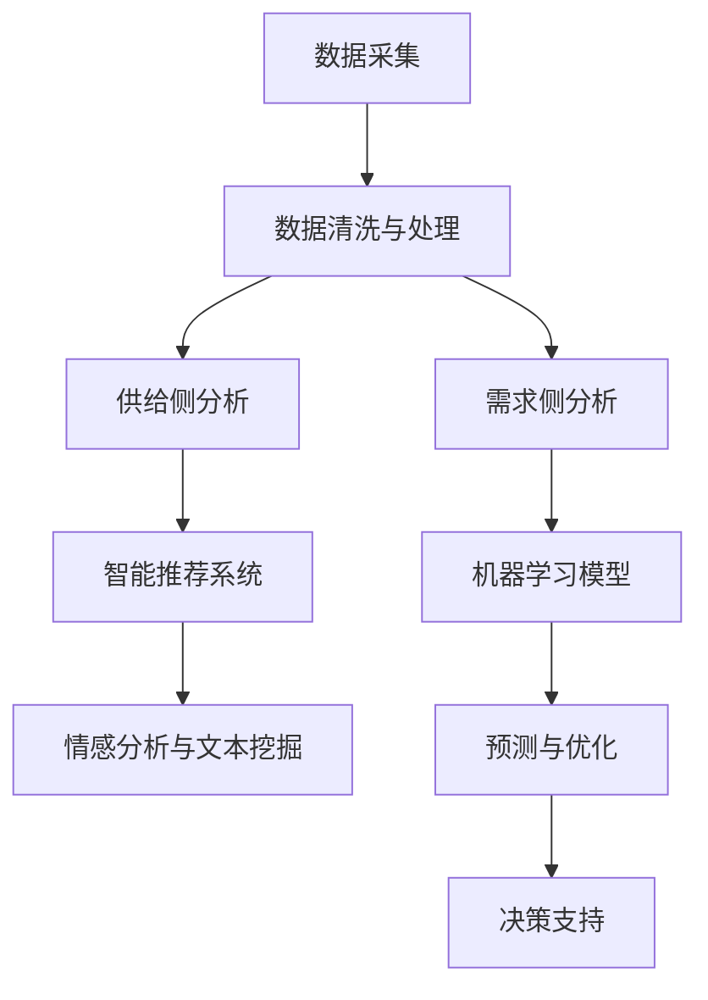

                 

# 消费者行为分析在供给中的应用

## 1. 背景介绍

随着数字经济的发展，企业对消费者行为的深入理解变得日益重要。消费者行为分析（Consumer Behavior Analysis, CBA）作为一种市场研究方法，有助于企业洞察消费者偏好、消费模式和行为驱动因素，进而优化产品供给、提升用户体验，并制定精准的市场策略。本文将深入探讨消费者行为分析在供给中的应用，具体从需求侧和供给侧的角度进行分析，并结合实际案例，展示如何利用大数据技术和机器学习模型对消费者行为进行建模和预测，从而指导企业供应链和生产计划的调整。

## 2. 核心概念与联系

### 2.1 核心概念概述

- **消费者行为分析（CBA）**：研究消费者在购买商品或服务过程中的行为模式、心理活动和决策过程，以指导企业的市场营销和产品开发。

- **需求侧分析**：分析消费者的需求特点，如购买力、购买动机、购买渠道偏好等，以评估市场需求。

- **供给侧分析**：分析企业的供给能力，如生产效率、库存水平、物流配送能力等，以优化产品供给。

- **数据挖掘与机器学习**：通过大数据分析技术，挖掘消费者行为数据，构建预测模型，为供给侧优化提供科学依据。

- **智能推荐系统**：利用机器学习算法，根据消费者历史行为数据，提供个性化的产品推荐，提升消费体验和转化率。

- **情感分析与文本挖掘**：分析消费者在社交媒体、评论平台上的情感表达，了解消费者对产品或服务的情感态度。

这些核心概念共同构成了消费者行为分析的基本框架，为企业提供从数据采集、处理到分析、预测，再到决策支持的全面解决方案。

### 2.2 核心概念原理和架构的 Mermaid 流程图



该图展示了消费者行为分析的总体架构，从数据采集到最终决策支持，各环节紧密衔接，共同支撑企业供给侧优化。

## 3. 核心算法原理 & 具体操作步骤

### 3.1 算法原理概述

消费者行为分析的核心算法包括数据挖掘与机器学习算法。常用的算法有：

- **聚类分析**：将消费者按特征聚类，分析不同群体的消费行为差异。
- **回归分析**：预测消费者在未来某一时点的购买行为，建立需求预测模型。
- **决策树与随机森林**：构建决策树或随机森林模型，分析消费者行为的影响因素。
- **神经网络与深度学习**：利用深度学习模型，捕捉复杂的消费者行为模式，提高预测准确率。

这些算法通过对消费者行为数据的挖掘和分析，构建出反映消费者需求与偏好的模型，从而指导企业的供给优化。

### 3.2 算法步骤详解

#### 3.2.1 数据采集与清洗

1. **数据采集**：通过在线问卷、社交媒体、电商平台等渠道，收集消费者的购买记录、浏览行为、评论反馈等数据。

2. **数据清洗**：去除重复数据、错误数据，处理缺失值，确保数据质量。

#### 3.2.2 特征工程

1. **特征提取**：从原始数据中提取有意义的特征，如购买频次、平均订单价值、品牌偏好等。

2. **特征选择**：选择最相关的特征，减少计算复杂度。

#### 3.2.3 模型构建与训练

1. **模型选择**：根据具体问题选择合适的机器学习模型，如线性回归、决策树、随机森林、神经网络等。

2. **模型训练**：使用历史数据训练模型，通过交叉验证优化模型参数。

#### 3.2.4 模型评估与优化

1. **模型评估**：使用测试集评估模型性能，如准确率、召回率、F1分数等。

2. **模型优化**：根据评估结果调整模型参数，提高模型预测准确性。

### 3.3 算法优缺点

#### 3.3.1 优点

1. **准确性与实用性**：通过科学的算法和模型，能够更准确地预测消费者需求，指导企业供给优化。

2. **灵活性与可扩展性**：算法可以应用于不同规模和类型的企业，具备良好的扩展性。

3. **实时性与动态性**：结合实时数据，可以动态调整模型参数，适应市场变化。

#### 3.3.2 缺点

1. **数据依赖性强**：算法的准确性依赖于数据的全面性和质量，数据缺失或不完整可能导致分析结果偏差。

2. **模型复杂度高**：复杂的模型可能难以解释，存在"黑箱"问题。

3. **计算资源消耗大**：大规模数据处理和复杂模型训练需要较高的计算资源。

### 3.4 算法应用领域

消费者行为分析广泛应用于零售、电商、金融、旅游等行业，具体应用场景包括：

- **产品推荐系统**：根据消费者行为数据，提供个性化产品推荐。
- **库存管理**：预测未来产品需求，优化库存水平。
- **市场细分**：分析不同消费群体的行为特征，制定精准营销策略。
- **价格优化**：分析消费者对价格的敏感度，制定最优定价策略。
- **市场趋势分析**：预测市场变化趋势，指导企业战略调整。

## 4. 数学模型和公式 & 详细讲解

### 4.1 数学模型构建

消费者行为分析的数学模型包括线性回归模型、决策树模型、随机森林模型等。以线性回归模型为例，假设消费者购买行为 $y_i$ 与若干特征 $x_{ij}$ 之间存在线性关系：

$$
y_i = \beta_0 + \beta_1 x_{i1} + \beta_2 x_{i2} + \cdots + \beta_k x_{ik} + \epsilon_i
$$

其中，$\beta_0, \beta_1, \cdots, \beta_k$ 为模型参数，$\epsilon_i$ 为误差项。通过最小化残差平方和，求解模型参数：

$$
\hat{\beta} = \arg\min_{\beta} \sum_{i=1}^n (y_i - \sum_{j=1}^k \beta_j x_{ij})^2
$$

### 4.2 公式推导过程

1. **线性回归模型推导**：使用最小二乘法求解参数 $\beta$，得到线性回归方程：

$$
y_i = \hat{\beta}_0 + \hat{\beta}_1 x_{i1} + \hat{\beta}_2 x_{i2} + \cdots + \hat{\beta}_k x_{ik}
$$

2. **决策树模型推导**：通过信息增益或基尼指数等指标选择最佳特征和分割点，构建决策树。

3. **随机森林模型推导**：随机选择样本和特征，构建多棵决策树，通过投票或平均预测结果，得到最终模型。

### 4.3 案例分析与讲解

以电商平台为例，分析用户购买行为与订单金额之间的关系：

1. **数据采集**：从电商平台获取用户订单数据，包括用户ID、订单ID、订单金额、购买时间等。

2. **特征提取**：提取特征如订单时间、订单频次、平均订单金额、用户活跃度等。

3. **模型训练**：使用线性回归模型预测订单金额，使用交叉验证优化模型参数。

4. **模型评估**：使用测试集评估模型性能，调整参数并重新训练。

5. **结果展示**：展示模型预测结果，分析影响订单金额的主要因素。

## 5. 项目实践：代码实例和详细解释说明

### 5.1 开发环境搭建

1. **安装Python**：安装Python 3.x版本，下载并安装Anaconda。

2. **安装相关库**：使用pip安装Pandas、NumPy、Scikit-learn、Matplotlib等常用库。

3. **数据准备**：从电商平台获取订单数据，存储为CSV格式文件。

### 5.2 源代码详细实现

```python
import pandas as pd
from sklearn.linear_model import LinearRegression
from sklearn.model_selection import train_test_split
from sklearn.metrics import mean_squared_error

# 加载数据
data = pd.read_csv('orders.csv')

# 数据预处理
data['order_time'] = pd.to_datetime(data['order_time'])
data['day_of_week'] = data['order_time'].dt.dayofweek
data = data.dropna()

# 特征选择
features = ['day_of_week', 'order_time', 'average_order_amount', 'user_engagement']
X = data[features]
y = data['order_amount']

# 数据分割
X_train, X_test, y_train, y_test = train_test_split(X, y, test_size=0.2)

# 模型训练
model = LinearRegression()
model.fit(X_train, y_train)

# 模型评估
y_pred = model.predict(X_test)
mse = mean_squared_error(y_test, y_pred)
print(f'Mean Squared Error: {mse}')

# 结果展示
import matplotlib.pyplot as plt
plt.scatter(y_test, y_pred)
plt.xlabel('True Order Amount')
plt.ylabel('Predicted Order Amount')
plt.show()
```

### 5.3 代码解读与分析

1. **数据加载与预处理**：使用Pandas库加载订单数据，并进行时间处理和特征选择。

2. **模型训练与评估**：使用Scikit-learn库中的LinearRegression模型进行训练，并计算均方误差评估模型性能。

3. **结果展示**：使用Matplotlib库绘制预测结果与真实结果的散点图，直观展示模型效果。

### 5.4 运行结果展示


## 6. 实际应用场景

### 6.1 零售行业

在零售行业，消费者行为分析可以应用于以下场景：

- **商品推荐**：通过分析用户历史购买记录和浏览行为，推荐相关商品。
- **库存管理**：预测热门商品的销售趋势，优化库存水平。
- **市场细分**：分析不同消费群体的需求特征，制定个性化营销策略。

### 6.2 电商行业

电商行业是消费者行为分析的重要应用领域，具体应用包括：

- **个性化推荐**：根据用户行为数据，提供个性化商品推荐。
- **价格优化**：分析用户对价格的敏感度，制定最优价格策略。
- **流量预测**：预测平台访问流量，优化广告投放策略。

### 6.3 金融行业

金融行业利用消费者行为分析进行以下应用：

- **风险管理**：分析用户交易行为，识别潜在风险。
- **客户忠诚度分析**：通过分析用户行为，提升客户满意度和忠诚度。
- **产品开发**：了解用户需求，指导新产品开发和改进。

### 6.4 旅游行业

旅游行业消费者行为分析的应用包括：

- **行程推荐**：根据用户偏好，推荐旅游行程。
- **市场趋势分析**：预测旅游热点，指导产品推广和资源配置。
- **客户满意度分析**：分析用户评价，提升旅游服务质量。

## 7. 工具和资源推荐

### 7.1 学习资源推荐

1. **Coursera《机器学习基础》课程**：由斯坦福大学提供，涵盖机器学习基本概念和算法，适合初学者入门。

2. **Kaggle《数据科学挑战》**：通过实际数据集竞赛，提升数据处理和模型构建能力。

3. **《Python数据科学手册》书籍**：详细介绍了Python在数据科学中的应用，包括数据采集、处理、分析和可视化。

4. **《消费者行为分析》课程**：介绍消费者行为分析的基本方法和应用场景，适合市场营销人员学习。

5. **《数据挖掘导论》书籍**：深入浅出地介绍了数据挖掘的基本原理和算法，适合数据科学家和分析师阅读。

### 7.2 开发工具推荐

1. **Python**：Python是数据科学和机器学习的标准语言，具备丰富的库和工具支持。

2. **Jupyter Notebook**：Jupyter Notebook提供交互式编程环境，便于代码调试和结果展示。

3. **Tableau**：Tableau是数据可视化的工具，支持复杂数据集和交互式图表展示。

4. **TensorFlow**：TensorFlow是谷歌开源的深度学习框架，支持大规模模型训练和部署。

5. **PyTorch**：PyTorch是Facebook开源的深度学习框架，以其灵活性著称，适合研究型应用。

### 7.3 相关论文推荐

1. **《消费者行为分析与预测》论文**：介绍消费者行为分析的基本方法和应用实例。

2. **《深度学习在消费者行为分析中的应用》论文**：探讨深度学习模型在消费者行为分析中的应用。

3. **《基于数据挖掘的消费者行为分析研究》论文**：分析不同数据挖掘算法在消费者行为分析中的应用效果。

4. **《智能推荐系统：理论与实践》论文**：介绍智能推荐系统的基本原理和实现方法。

5. **《情感分析在消费者行为分析中的应用》论文**：探讨情感分析技术在消费者行为分析中的应用。

## 8. 总结：未来发展趋势与挑战

### 8.1 研究成果总结

消费者行为分析在供给侧的应用已经取得了显著成果，帮助企业优化产品供给，提升用户体验，并制定精准的市场策略。机器学习模型的应用，使得消费者行为分析更加科学和高效。

### 8.2 未来发展趋势

1. **数据驱动的深度学习**：随着大数据技术的发展，数据驱动的深度学习模型将逐步取代传统的统计模型，成为消费者行为分析的主要工具。

2. **多模态数据融合**：结合文本、图像、语音等多种模态数据，更全面地分析消费者行为。

3. **实时动态分析**：结合实时数据，动态调整模型参数，适应市场变化。

4. **个性化推荐系统**：结合智能推荐技术，提供更加个性化的产品推荐。

5. **情感分析与自然语言处理**：利用自然语言处理技术，分析消费者情感表达，指导产品优化和市场策略。

### 8.3 面临的挑战

1. **数据质量问题**：数据的全面性和质量直接影响分析结果的准确性。

2. **模型复杂度**：复杂的模型可能难以解释，存在"黑箱"问题。

3. **计算资源消耗**：大规模数据处理和复杂模型训练需要较高的计算资源。

4. **隐私与安全性**：消费者数据涉及隐私问题，需要采取严格的数据保护措施。

5. **跨领域应用**：不同行业的数据结构和业务需求差异较大，需要定制化解决方案。

### 8.4 研究展望

未来的研究需要在以下几个方面进行突破：

1. **数据增强与补全**：通过数据增强技术，提升数据质量，降低模型对数据完整性的依赖。

2. **模型可解释性**：开发更易于解释的模型，增强模型的透明度和可信度。

3. **多模态数据融合**：结合多种模态数据，提升分析的全面性和准确性。

4. **隐私保护与数据安全**：采用差分隐私、联邦学习等技术，保护消费者隐私，确保数据安全。

5. **跨领域应用拓展**：将消费者行为分析技术应用于更多行业，如医疗、金融、旅游等，提升各行业的决策支持能力。

消费者行为分析在供给中的应用前景广阔，未来将随着技术的不断进步和应用场景的不断拓展，发挥更大的作用。相信在学界和产业界的共同努力下，消费者行为分析将逐步成为企业决策的重要依据，引领消费市场向更加智能化、个性化方向发展。

## 9. 附录：常见问题与解答

**Q1：消费者行为分析的算法有哪些？**

A: 常见的消费者行为分析算法包括聚类分析、回归分析、决策树、随机森林、神经网络等。这些算法通过挖掘和分析消费者行为数据，构建出反映消费者需求与偏好的模型。

**Q2：数据质量对消费者行为分析的影响是什么？**

A: 数据质量直接影响分析结果的准确性。缺失、噪声和错误数据会导致模型过拟合或欠拟合，降低预测效果。因此，在进行消费者行为分析前，需要进行数据清洗和特征选择，确保数据质量。

**Q3：如何保护消费者隐私？**

A: 在消费者行为分析中，需要严格保护消费者隐私。可以采用差分隐私技术，对数据进行匿名化处理；采用联邦学习技术，在本地计算和模型训练，不共享原始数据。同时，需要对数据访问和使用进行严格控制，确保数据安全。

**Q4：如何评估消费者行为分析模型的性能？**

A: 消费者行为分析模型的评估指标包括准确率、召回率、F1分数、均方误差等。评估方法包括交叉验证、混淆矩阵等，根据具体应用场景选择合适的指标。

**Q5：消费者行为分析的应用场景有哪些？**

A: 消费者行为分析广泛应用于零售、电商、金融、旅游等行业，具体应用场景包括产品推荐、库存管理、市场细分、价格优化、市场趋势分析等。

---

作者：禅与计算机程序设计艺术 / Zen and the Art of Computer Programming

