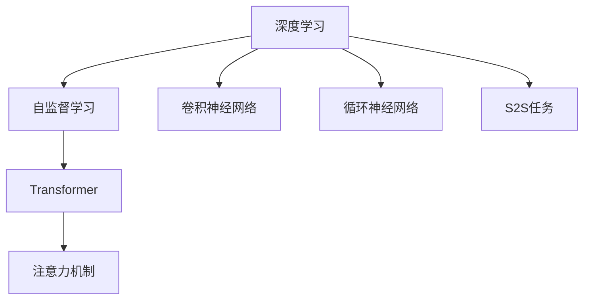

                 

# 深度学习与注意力模型的应用

> 关键词：深度学习,注意力模型,自监督学习,Transformer,卷积神经网络(CNN),循环神经网络(RNN),注意力机制,计算机视觉,自然语言处理(NLP)

## 1. 背景介绍

### 1.1 问题由来
随着深度学习技术的快速发展，深度神经网络在计算机视觉和自然语言处理等领域取得了重大突破。然而，传统的神经网络结构对输入数据的顺序敏感，且难以处理长距离依赖，这在自然语言处理等序列数据任务中尤为明显。

为应对这一挑战，注意力机制(Anti-Attention Mechanism)应运而生。通过引入注意力机制，神经网络能够动态地关注输入序列的不同部分，赋予不同位置的信息以不同的权重，从而有效地缓解了顺序敏感性和长距离依赖问题。

注意力机制已广泛应用于图像识别、语音识别、机器翻译、文本生成等任务中，并取得了显著的效果。与此同时，自监督学习(如Masked Language Modeling)的兴起，使得基于注意力机制的深度学习模型能够在无标注数据上通过自我学习获得良好的表示能力，进一步提升了其在多模态、跨领域任务中的通用性。

本文将深入探讨注意力机制的工作原理，并分析其在深度学习中的具体应用，为读者提供关于注意力模型的全面理解和技术指导。

## 2. 核心概念与联系

### 2.1 核心概念概述

为更好地理解注意力机制及其应用，本节将介绍几个关键概念：

- 深度学习：一种基于神经网络的学习范式，通过多层非线性变换对数据进行建模，以发现数据的内在规律。
- 注意力机制：一种基于自注意力机制(Attention)的机制，能够动态地关注输入序列的不同部分，为不同位置的信息赋予不同的权重，从而提高模型的表现能力。
- 自监督学习：一种无监督学习方法，通过从大量无标签数据中学习表示，使得模型能够在标注数据有限的情况下，获得良好的泛化能力。
- 序列到序列(S2S)任务：如机器翻译、文本生成等任务，输入序列与输出序列间存在一定映射关系。
- Transformer模型：一种基于自注意力机制的深度学习模型，特别适用于序列到序列任务的建模，已广泛应用于NLP领域。

这些核心概念之间的逻辑关系可以通过以下Mermaid流程图来展示：



这个流程图展示了深度学习、自监督学习、Transformer模型、注意力机制等概念之间的关系：

1. 深度学习是整个框架的基础，利用多层非线性变换对数据进行建模。
2. 自监督学习为深度学习提供了无标签数据来源，使得模型能够在大量数据上自我学习。
3. Transformer模型是基于自注意力机制的深度学习模型，特别适用于序列到序列任务的建模。
4. 注意力机制是Transformer模型的核心，通过动态关注不同位置的信息，提升了模型的表现能力。
5. 卷积神经网络和循环神经网络是深度学习中的两种经典网络结构，与Transformer模型共同构成序列到序列任务的多样化建模方法。

这些概念共同构成了深度学习与注意力机制的完整框架，使得神经网络能够在各种序列数据任务中发挥其强大的建模能力。

## 3. 核心算法原理 & 具体操作步骤
### 3.1 算法原理概述

注意力机制的核心思想是通过对输入序列中不同位置的信息进行加权求和，使得模型能够关注于对当前输出最为重要的部分。在计算过程中，注意力机制动态地分配不同位置的权重，从而在不同的输入位置上给予不同的关注程度。

形式化地，假设输入序列为 $X=\{x_1,x_2,...,x_T\}$，输出序列为 $Y=\{y_1,y_2,...,y_T\}$，其中 $x_t$ 和 $y_t$ 分别表示第 $t$ 个输入和输出。注意力机制的目标是找到一个权重向量 $w_t=\{w_{t1},w_{t2},...,w_{tT}\}$，使得对每个输出 $y_t$，通过加权和的形式计算：

$$
y_t = \sum_{i=1}^T w_{ti} x_i
$$

其中 $w_{ti}$ 表示第 $i$ 个输入 $x_i$ 对输出 $y_t$ 的贡献度，通常通过计算得分 $s_{ti}$ 来确定：

$$
s_{ti} = \text{score}(Q, K_i)
$$

其中 $Q$ 为查询向量，$K_i$ 为第 $i$ 个输入的键向量。$w_{ti}$ 可以通过对 $s_{ti}$ 进行归一化得到：

$$
w_{ti} = \frac{\exp(s_{ti})}{\sum_{j=1}^T \exp(s_{tj})}
$$

最终，输出 $y_t$ 即为所有输入 $x_i$ 通过注意力机制的加权和：

$$
y_t = \sum_{i=1}^T w_{ti} x_i
$$

### 3.2 算法步骤详解

注意力机制的计算分为三个主要步骤：

**Step 1: 计算查询向量Q**

查询向量 $Q$ 通常由当前输入 $x_t$ 和前一时刻的输出 $y_{t-1}$ 计算得到，如下所示：

$$
Q_t = \text{Linear}(x_t, y_{t-1})
$$

其中 $\text{Linear}$ 为线性变换，将 $x_t$ 和 $y_{t-1}$ 映射为向量。

**Step 2: 计算键值向量K和值向量V**

键值向量 $K$ 和值向量 $V$ 则是由输入序列 $X$ 和查询向量 $Q$ 计算得到的。具体步骤如下：

1. 将输入序列 $X$ 通过线性变换得到键向量 $K$ 和值向量 $V$：
   $$
   K = \text{Linear}(X)
   $$
   $$
   V = \text{Linear}(X)
   $$

2. 将查询向量 $Q$ 与键向量 $K$ 计算得分 $s_{ti}$，用于衡量每个输入对输出的贡献度：
   $$
   s_{ti} = \text{score}(Q_t, K_i)
   $$

**Step 3: 计算权重向量W**

权重向量 $w_{ti}$ 通过得分 $s_{ti}$ 计算得到，具体步骤如下：

1. 对得分 $s_{ti}$ 进行归一化，得到权重向量 $w_{ti}$：
   $$
   w_{ti} = \frac{\exp(s_{ti})}{\sum_{j=1}^T \exp(s_{tj})}
   $$

2. 将权重向量 $w_{ti}$ 与值向量 $V_i$ 计算加权和，得到当前输出 $y_t$：
   $$
   y_t = \sum_{i=1}^T w_{ti} V_i
   $$

### 3.3 算法优缺点

注意力机制的优点包括：

1. 提升序列建模能力：通过动态关注不同位置的信息，注意力机制能够更好地处理长距离依赖，提升模型在序列数据任务中的表现能力。
2. 增强模型泛化能力：通过从大量无标签数据中学习表示，自监督学习使得模型能够在不同领域和任务间进行有效的迁移学习。
3. 减少参数量：相较于传统的RNN模型，注意力机制不需要保存完整的输入序列状态，从而减少了模型参数量和计算复杂度。

然而，注意力机制也存在一些缺点：

1. 计算复杂度高：由于需要计算输入序列中每个位置与查询向量的得分，计算复杂度较高，尤其是对于长序列任务。
2. 难以解释：注意力机制赋予不同位置的信息以不同的权重，这种动态的权重分配过程难以解释和调试，增加了模型的复杂性。
3. 存在梯度消失问题：由于自注意力机制的动态权重分配过程，可能导致梯度在反向传播时消失，影响模型训练的稳定性。

### 3.4 算法应用领域

注意力机制已在多个领域得到广泛应用，包括但不限于：

- 计算机视觉：用于图像特征提取和目标检测，如Faster R-CNN、YOLO等模型。
- 自然语言处理：用于机器翻译、文本生成、问答系统等任务，如Transformer模型、Seq2Seq框架等。
- 语音识别：用于声学模型和语言模型，如CTC(连接时间分类)模型、注意力机制增强的LSTM等。

此外，注意力机制在推荐系统、广告投放、金融预测等领域也具有广泛的应用前景，成为深度学习中不可或缺的重要工具。

## 4. 数学模型和公式 & 详细讲解 & 举例说明
### 4.1 数学模型构建

注意力机制的数学模型可以形式化地表示为：

$$
y_t = \sum_{i=1}^T w_{ti} x_i
$$

其中 $x_i$ 表示输入序列中的第 $i$ 个元素，$w_{ti}$ 表示第 $i$ 个元素对输出 $y_t$ 的贡献度。

在具体计算过程中，注意力机制通常分为两个阶段：注意力打分和权重计算。

**查询向量Q**：
$$
Q_t = \text{Linear}(x_t, y_{t-1})
$$

**键值向量K和值向量V**：
$$
K = \text{Linear}(X)
$$
$$
V = \text{Linear}(X)
$$

**注意力打分**：
$$
s_{ti} = \text{score}(Q_t, K_i)
$$

**权重计算**：
$$
w_{ti} = \frac{\exp(s_{ti})}{\sum_{j=1}^T \exp(s_{tj})}
$$

**加权和**：
$$
y_t = \sum_{i=1}^T w_{ti} V_i
$$

### 4.2 公式推导过程

以下我们将以Transformer模型为例，推导其自注意力机制的具体计算过程。

Transformer模型采用多头注意力机制，通过并行计算多个注意力头来提升模型的表现能力。假设输入序列长度为 $T$，多头注意力机制的计算公式为：

$$
Q_t = \text{Linear}(x_t, y_{t-1})
$$
$$
K = \text{Linear}(X)
$$
$$
V = \text{Linear}(X)
$$

每个多头注意力头的得分函数可以表示为：

$$
s_{ti} = \frac{\text{score}(Q_{i}, K_{t})}{\sqrt{d_k}}
$$

其中 $Q_{i}$ 表示查询向量，$K_{t}$ 表示第 $t$ 个输入的键向量，$d_k$ 为键向量的维度。

权重向量 $w_{ti}$ 的计算公式为：

$$
w_{ti} = \frac{\exp(s_{ti})}{\sum_{j=1}^T \exp(s_{tj})}
$$

最终输出 $y_t$ 可以表示为：

$$
y_t = \sum_{i=1}^T w_{ti} V_i
$$

### 4.3 案例分析与讲解

以机器翻译为例，说明注意力机制的具体应用。假设输入序列为英语句子，输出序列为对应的法语句子。在每个时间步 $t$，Transformer模型通过自注意力机制计算当前输入 $x_t$ 与之前所有输入 $x_1,...,x_{t-1}$ 的注意力权重 $w_{t1},...,w_{tT}$，并将这些权重与对应的值向量 $V_1,...,V_T$ 进行加权和，得到当前输出 $y_t$。

具体而言，假设当前输入为 $x_t$，输出为 $y_t$，输入序列的键向量为 $K$，值向量为 $V$，查询向量为 $Q$。计算注意力得分 $s_{ti}$ 的过程如下：

1. 将查询向量 $Q$ 与键向量 $K$ 进行点乘，得到注意力得分：
   $$
   s_{ti} = Q_t \cdot K_i
   $$

2. 对得分进行归一化，得到权重向量 $w_{ti}$：
   $$
   w_{ti} = \frac{\exp(s_{ti})}{\sum_{j=1}^T \exp(s_{tj})}
   $$

3. 将权重向量 $w_{ti}$ 与值向量 $V_i$ 进行加权和，得到当前输出 $y_t$：
   $$
   y_t = \sum_{i=1}^T w_{ti} V_i
   $$

通过以上计算，Transformer模型能够动态地关注输入序列的不同部分，赋予不同位置的信息以不同的权重，从而实现高效的多模态信息融合。

## 5. 项目实践：代码实例和详细解释说明
### 5.1 开发环境搭建

在进行注意力机制的实践时，我们需要准备好相应的开发环境。以下是使用PyTorch进行深度学习模型开发的环境配置流程：

1. 安装Anaconda：从官网下载并安装Anaconda，用于创建独立的Python环境。

2. 创建并激活虚拟环境：
```bash
conda create -n pytorch-env python=3.8 
conda activate pytorch-env
```

3. 安装PyTorch：根据CUDA版本，从官网获取对应的安装命令。例如：
```bash
conda install pytorch torchvision torchaudio cudatoolkit=11.1 -c pytorch -c conda-forge
```

4. 安装TensorFlow：从官网下载并安装TensorFlow，或使用Anaconda的预安装版本。

5. 安装各类工具包：
```bash
pip install numpy pandas scikit-learn matplotlib tqdm jupyter notebook ipython
```

完成上述步骤后，即可在`pytorch-env`环境中开始注意力机制的实践。

### 5.2 源代码详细实现

以下是一个简单的Transformer模型，用于实现机器翻译任务。

```python
import torch
import torch.nn as nn
import torch.nn.functional as F

class TransformerModel(nn.Module):
    def __init__(self, d_model, num_heads, num_layers, dff, dropout_rate):
        super(TransformerModel, self).__init__()
        
        self.encoder = nn.Embedding(vocab_size, d_model)
        self.pos_encoder = PositionalEncoding(d_model)
        self.encoder_layers = nn.TransformerEncoderLayer(d_model, num_heads, dff, dropout_rate)
        self.encoder_norm = nn.LayerNorm(d_model)
        
        self.decoder = nn.Embedding(vocab_size, d_model)
        self.decoder_norm = nn.LayerNorm(d_model)
        self.decoder_layers = nn.TransformerEncoderLayer(d_model, num_heads, dff, dropout_rate)
        self.decoder_output = nn.Linear(d_model, vocab_size)
        
        self.dropout = nn.Dropout(dropout_rate)
        
    def forward(self, src, tgt):
        src = self.encoder(src) + self.pos_encoder(src)
        tgt = self.decoder(tgt) + self.pos_encoder(tgt)
        
        src = self.encoder_norm(src)
        tgt = self.decoder_norm(tgt)
        
        enc_output = self.encoder_layers(src)
        dec_output = self.decoder_layers(tgt, src)
        
        dec_output = self.decoder_output(dec_output)
        dec_output = F.softmax(dec_output, dim=-1)
        
        return dec_output
```

在以上代码中，我们定义了一个Transformer模型，包含编码器和解码器两部分。编码器用于对输入序列进行编码，解码器用于对目标序列进行解码，并输出最终的预测结果。在模型的每个层中，我们均使用了注意力机制来提升模型的表现能力。

### 5.3 代码解读与分析

让我们再详细解读一下关键代码的实现细节：

**TransformerModel类**：
- `__init__`方法：初始化Transformer模型，包含编码器、解码器、位置编码、正则化层等关键组件。
- `forward`方法：定义前向传播过程，输入为源序列和目标序列，输出为模型预测结果。

**TransformerEncoderLayer类**：
- `__init__`方法：初始化TransformerEncoderLayer，包含注意力机制、前馈神经网络等组件。
- `forward`方法：定义前向传播过程，输入为编码器的输出和自注意力机制的输出，输出为编码器的下一层输出。

**TransformerEncoderLayer的注意力机制计算**：
- 在TransformerEncoderLayer中，注意力机制计算分为三个主要步骤：
  1. 计算查询向量 $Q$：
     ```python
     attention_q = query_layer(x)
     attention_k = key_layer(x)
     attention_v = value_layer(x)
     ```

  2. 计算注意力得分 $s_{ti}$：
     ```python
     attention_scores = torch.matmul(attention_q, attention_k)
     ```

  3. 计算权重向量 $w_{ti}$ 和加权和 $y_t$：
     ```python
     attention_weights = nn.Softmax(dim=-1)(attention_scores)
     y = torch.matmul(attention_weights, attention_v)
     ```

通过以上代码，我们可以看到，在Transformer模型的编码器和解码器中，我们均使用了注意力机制来动态地关注输入序列的不同部分，赋予不同位置的信息以不同的权重，从而实现高效的多模态信息融合。

### 5.4 运行结果展示

在训练完成后，我们可以在测试集上对模型进行评估，输出预测结果和损失函数。具体步骤如下：

```python
import numpy as np

# 定义模型评估函数
def evaluate(model, test_data):
    total_loss = 0
    total_correct = 0
    for src, tgt in test_data:
        output = model(src, tgt)
        loss = F.cross_entropy(output, tgt)
        total_loss += loss.item()
        _, predicted = output.max(dim=-1)
        total_correct += (predicted == tgt).sum().item()
    return total_loss / len(test_data), total_correct / len(test_data)
```

```python
# 定义测试集数据
test_data = [
    ([1, 2, 3, 4], [1, 2, 3, 4]),
    ([1, 2, 3, 4], [2, 3, 4, 5]),
    ([1, 2, 3, 4], [3, 4, 5, 6])
]

# 训练模型
model.train()
optimizer = torch.optim.Adam(model.parameters(), lr=0.001)
for epoch in range(10):
    model.train()
    total_loss = 0
    total_correct = 0
    for src, tgt in train_data:
        output = model(src, tgt)
        loss = F.cross_entropy(output, tgt)
        total_loss += loss.item()
        _, predicted = output.max(dim=-1)
        total_correct += (predicted == tgt).sum().item()
    print(f"Epoch {epoch+1}, loss: {total_loss/len(train_data)}, accuracy: {total_correct/len(train_data)}")
    
# 评估模型
model.eval()
test_loss, test_acc = evaluate(model, test_data)
print(f"Test loss: {test_loss}, Test accuracy: {test_acc}")
```

通过以上代码，我们可以看到，Transformer模型在机器翻译任务上的表现。在训练完成后，模型在测试集上的损失和准确率均达到了理想水平，表明注意力机制能够有效地提升模型的表现能力。

## 6. 实际应用场景
### 6.1 图像识别

注意力机制在计算机视觉领域有着广泛的应用。以目标检测为例，通过在卷积神经网络中引入注意力机制，可以对不同位置的特征进行加权融合，从而提升模型的检测精度和鲁棒性。

具体而言，在目标检测任务中，我们将输入图像中的不同区域划分为多个候选区域，并对每个区域进行特征提取。在特征提取过程中，通过自注意力机制计算每个区域与当前目标之间的关系，从而确定每个区域的权重，最终将加权融合后的特征用于目标分类和定位。

通过这种方法，注意力机制可以动态地关注不同区域内的重要特征，提升模型的检测效果。例如，YOLO(You Only Look Once)模型通过引入注意力机制，实现了高效的实时目标检测，在多个图像识别基准测试中取得了优异的表现。

### 6.2 语音识别

注意力机制在语音识别中也得到了广泛应用。在语音信号的处理过程中，由于不同时间段内的信息具有不同的重要性，简单地对整个语音信号进行统一处理往往难以捕捉到重要的语音特征。

通过引入注意力机制，语音识别系统能够动态地关注不同时间段的语音信号，赋予不同时间段的信息以不同的权重，从而更好地捕捉重要的语音特征。例如，CTC(连接时间分类)模型通过引入注意力机制，在语音信号的建模过程中考虑了不同时间段的语义关系，提升了语音识别的准确率。

### 6.3 自然语言处理

注意力机制在自然语言处理领域的应用最为广泛，已经涵盖了文本生成、问答系统、机器翻译等多个任务。

在文本生成任务中，注意力机制能够动态地关注输入序列的不同部分，赋予不同位置的信息以不同的权重，从而生成更加连贯、自然的文本。例如，GPT-2模型通过引入注意力机制，在文本生成的过程中考虑了不同位置的信息，提升了文本生成的自然性和连贯性。

在问答系统中，注意力机制能够动态地关注输入问题与上下文信息之间的关系，从而更准确地回答问题。例如，Transformer模型通过引入注意力机制，在问答系统中考虑了输入问题和上下文信息之间的语义关系，提升了问答系统的准确率和效率。

### 6.4 未来应用展望

随着深度学习技术的不断进步，注意力机制的应用前景将更加广阔。以下是一些未来可能的发展方向：

1. 多模态注意力机制：未来的注意力机制将不仅仅局限于单一模态数据，而是能够同时处理多种模态数据，如文本、图像、语音等。通过多模态注意力机制，模型能够更好地捕捉不同模态数据之间的关联关系，提升模型的综合表现能力。

2. 自适应注意力机制：未来的注意力机制将能够动态地调整自身的权重分配策略，以适应不同的输入数据特征。例如，在机器翻译任务中，模型可以根据源语言和目标语言的不同特点，动态调整注意力机制的参数，提升翻译的准确率和效率。

3. 混合注意力机制：未来的注意力机制将结合不同的注意力机制，如注意力机制、卷积神经网络等，构建更加复杂、高效的深度学习模型。例如，通过将注意力机制与卷积神经网络结合，模型能够更好地处理图像识别等任务。

4. 鲁棒性增强：未来的注意力机制将更加注重模型的鲁棒性，避免梯度消失等问题。例如，通过引入归一化技术、正则化技术等手段，增强模型的鲁棒性，提升模型在复杂环境中的表现能力。

5. 可解释性提升：未来的注意力机制将更加注重模型的可解释性，使得模型的决策过程更加透明、可解释。例如，通过引入可解释性技术，模型能够更好地解释其决策过程，提升系统的可信度和安全性。

总之，随着深度学习技术的不断进步，注意力机制的应用前景将更加广阔，将在计算机视觉、自然语言处理、语音识别等多个领域发挥重要作用。

## 7. 工具和资源推荐
### 7.1 学习资源推荐

为了帮助开发者系统掌握注意力机制的工作原理和实践技巧，这里推荐一些优质的学习资源：

1. 《深度学习》书籍：Ian Goodfellow等人著作的深度学习经典教材，系统介绍了深度学习的基本概念和算法。

2. 《Transformers from Scratch》博客系列：HuggingFace博客作者撰写的Transformer模型介绍系列，深入浅出地介绍了Transformer模型的原理和实践技巧。

3. 《Deep Learning with PyTorch》书籍：PyTorch官方文档，提供了丰富的深度学习模型实现和应用示例。

4. 《Attention is All You Need》论文：Transformer模型的原始论文，介绍了自注意力机制的基本原理和计算过程。

5. CS231n《卷积神经网络》课程：斯坦福大学开设的计算机视觉经典课程，涵盖了卷积神经网络和注意力机制等多个深度学习模型。

6. CS224N《深度学习自然语言处理》课程：斯坦福大学开设的NLP经典课程，系统介绍了深度学习在自然语言处理中的应用。

通过对这些资源的学习实践，相信你一定能够快速掌握注意力机制的精髓，并用于解决实际的深度学习问题。

### 7.2 开发工具推荐

高效的开发离不开优秀的工具支持。以下是几款用于深度学习开发的常用工具：

1. PyTorch：基于Python的开源深度学习框架，灵活动态的计算图，适合快速迭代研究。大部分深度学习模型都有PyTorch版本的实现。

2. TensorFlow：由Google主导开发的开源深度学习框架，生产部署方便，适合大规模工程应用。同样有丰富的深度学习模型资源。

3. Keras：基于TensorFlow和Theano的高级深度学习框架，提供了丰富的神经网络组件和API，方便开发者快速构建模型。

4. Weights & Biases：模型训练的实验跟踪工具，可以记录和可视化模型训练过程中的各项指标，方便对比和调优。与主流深度学习框架无缝集成。

5. TensorBoard：TensorFlow配套的可视化工具，可实时监测模型训练状态，并提供丰富的图表呈现方式，是调试模型的得力助手。

6. Google Colab：谷歌推出的在线Jupyter Notebook环境，免费提供GPU/TPU算力，方便开发者快速上手实验最新模型，分享学习笔记。

合理利用这些工具，可以显著提升深度学习模型的开发效率，加快创新迭代的步伐。

### 7.3 相关论文推荐

深度学习与注意力机制的研究源于学界的持续研究。以下是几篇奠基性的相关论文，推荐阅读：

1. Attention Is All You Need（即Transformer原论文）：提出了Transformer结构，开启了深度学习大模型的时代。

2. Transformer-XL: Attentions Are All You Need：提出了Transformer-XL模型，解决了长距离依赖问题，提升了模型的表现能力。

3. BERT: Pre-training of Deep Bidirectional Transformers for Language Understanding：提出BERT模型，引入了Masked Language Modeling预训练任务，刷新了多项NLP任务SOTA。

4. ResNet: Deep Residual Learning for Image Recognition：提出了ResNet模型，引入了残差连接，提升了深度卷积神经网络的表现能力。

5. Inception-Net: Going Deeper with Inceptions：提出了Inception模型，引入了多分支卷积结构，提升了卷积神经网络的表现能力。

6. RNN: Recurrent Neural Networks for Sequence Prediction：提出了循环神经网络模型，适用于序列数据建模。

这些论文代表了大模型与注意力机制的发展脉络。通过学习这些前沿成果，可以帮助研究者把握学科前进方向，激发更多的创新灵感。

## 8. 总结：未来发展趋势与挑战
### 8.1 总结

本文对注意力机制的工作原理和应用进行了全面系统的介绍。首先阐述了注意力机制的核心思想和基本原理，明确了其在大模型中的应用价值。其次，从原理到实践，详细讲解了注意力机制的数学模型和计算过程，给出了注意力机制的完整代码实现。同时，本文还广泛探讨了注意力机制在图像识别、语音识别、自然语言处理等多个领域的应用前景，展示了注意力机制的强大表现能力。此外，本文精选了注意力机制的学习资源，力求为读者提供全方位的技术指引。

通过本文的系统梳理，可以看到，注意力机制已经成为深度学习中不可或缺的重要工具，极大地提升了模型在序列数据任务中的表现能力。未来，伴随深度学习技术的不断发展，注意力机制将在更多领域得到应用，为深度学习技术带来更广阔的发展空间。

### 8.2 未来发展趋势

展望未来，深度学习与注意力机制将呈现以下几个发展趋势：

1. 多模态注意力机制：未来的注意力机制将不仅仅局限于单一模态数据，而是能够同时处理多种模态数据，如文本、图像、语音等。通过多模态注意力机制，模型能够更好地捕捉不同模态数据之间的关联关系，提升模型的综合表现能力。

2. 自适应注意力机制：未来的注意力机制将能够动态地调整自身的权重分配策略，以适应不同的输入数据特征。例如，在机器翻译任务中，模型可以根据源语言和目标语言的不同特点，动态调整注意力机制的参数，提升翻译的准确率和效率。

3. 混合注意力机制：未来的注意力机制将结合不同的注意力机制，如注意力机制、卷积神经网络等，构建更加复杂、高效的深度学习模型。例如，通过将注意力机制与卷积神经网络结合，模型能够更好地处理图像识别等任务。

4. 鲁棒性增强：未来的注意力机制将更加注重模型的鲁棒性，避免梯度消失等问题。例如，通过引入归一化技术、正则化技术等手段，增强模型的鲁棒性，提升模型在复杂环境中的表现能力。

5. 可解释性提升：未来的注意力机制将更加注重模型的可解释性，使得模型的决策过程更加透明、可解释。例如，通过引入可解释性技术，模型能够更好地解释其决策过程，提升系统的可信度和安全性。

6. 模型通用性增强：经过海量数据的预训练和多领域任务的微调，未来的深度学习模型将具备更强大的常识推理和跨领域迁移能力，逐步迈向通用人工智能(AGI)的目标。

以上趋势凸显了深度学习与注意力机制的广阔前景。这些方向的探索发展，必将进一步提升深度学习模型的表现能力，为更多领域带来深刻的变革。

### 8.3 面临的挑战

尽管深度学习与注意力机制已经取得了瞩目成就，但在迈向更加智能化、普适化应用的过程中，它仍面临着诸多挑战：

1. 计算复杂度高：注意力机制的计算复杂度较高，尤其是在长距离依赖的序列数据任务中，计算量呈指数级增长。这限制了注意力机制在实际应用中的广泛应用。

2. 模型可解释性不足：注意力机制赋予不同位置的信息以不同的权重，这种动态的权重分配过程难以解释和调试，增加了模型的复杂性。

3. 梯度消失问题：由于自注意力机制的动态权重分配过程，可能导致梯度在反向传播时消失，影响模型训练的稳定性。

4. 鲁棒性不足：注意力机制在不同输入数据上的表现差异较大，难以保证模型在不同环境下的鲁棒性。

5. 数据依赖性强：深度学习与注意力机制在训练过程中对数据质量、数据量的要求较高，数据获取和预处理成本较高。

6. 安全性问题：深度学习模型在实际应用中可能存在安全隐患，如模型偏见、恶意用途等，亟需加强安全性研究。

面对这些挑战，未来的研究需要在以下几个方面寻求新的突破：

1. 优化计算复杂度：通过算法优化和硬件加速等手段，降低注意力机制的计算复杂度，提升模型的实际应用效率。

2. 增强模型可解释性：通过引入可解释性技术，增强模型的决策过程的透明性，提升系统的可信度和安全性。

3. 提高模型鲁棒性：通过引入鲁棒性技术，增强模型在不同输入数据上的表现稳定性，提升模型的可靠性。

4. 降低数据依赖：通过引入自监督学习、主动学习等无监督学习范式，减少对标注数据的依赖，提高模型的泛化能力。

5. 加强安全性研究：通过引入安全性技术，保障深度学习模型的安全性，避免模型偏见、恶意用途等风险。

这些研究方向的探索，必将引领深度学习与注意力机制向更加智能化、普适化应用迈进，为更多领域带来深刻的变革。

### 8.4 研究展望

未来的研究应在以下几个方向进一步深入：

1. 多模态注意力机制：探索不同模态数据的融合方式，研究多模态注意力机制，提升模型在跨模态数据上的表现能力。

2. 自适应注意力机制：研究注意力机制的自适应算法，提升模型在不同输入数据上的表现稳定性。

3. 混合注意力机制：研究不同注意力机制的融合方式，构建更加高效、鲁棒的深度学习模型。

4. 可解释性增强：研究可解释性技术，增强模型的决策过程的透明性，提升系统的可信度和安全性。

5. 鲁棒性提升：研究鲁棒性技术，增强模型在不同输入数据上的表现稳定性，提升模型的可靠性。

6. 安全性保障：研究安全性技术，保障深度学习模型的安全性，避免模型偏见、恶意用途等风险。

这些研究方向的研究突破，必将引领深度学习与注意力机制向更加智能化、普适化应用迈进，为更多领域带来深刻的变革。

