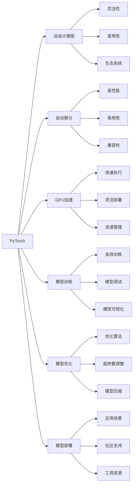

                 

## 1. 背景介绍

近年来，深度学习框架层出不穷，在学术界和工业界都获得了广泛的应用。其中，PyTorch和JAX是两个最受关注的高性能深度学习框架。本文将从多个角度对这两个框架进行对比，帮助读者了解如何在实际应用中选择最合适的深度学习框架。

## 2. 核心概念与联系

### 2.1 核心概念概述

- **PyTorch**：由Facebook开发的开源深度学习框架，以动态计算图为特点，强调灵活性和易用性。PyTorch支持GPU和CPU加速，具有强大的生态系统和丰富的资源。

- **JAX**：由Google开发的开源深度学习框架，基于NumPy，支持静态和动态计算图，具有自动微分、向量化解算和分布式训练等特性。JAX旨在提供高性能的深度学习解决方案，支持在TPU等高性能硬件上运行。

两个框架在计算图模型、自动微分、动态图、分布式训练等方面具有相似的特点，但具体实现和适用场景存在差异。

### 2.2 核心概念原理和架构的 Mermaid 流程图



## 3. 核心算法原理 & 具体操作步骤

### 3.1 算法原理概述

PyTorch和JAX在深度学习模型的训练和优化方面，都采用了基于自动微分的反向传播算法。具体而言：

- **PyTorch**：采用动态计算图，支持动态网络结构。在训练过程中，PyTorch通过反向传播计算每个操作节点的梯度，并自动更新模型参数。

- **JAX**：支持静态和动态计算图，通过JAX的自动微分系统（Automatic Differentiation）计算模型损失的梯度，并利用JAX的向量化解算（JAX.xmap）优化模型的并行计算。

### 3.2 算法步骤详解

**动态计算图训练步骤**：

1. **模型定义**：定义神经网络模型，设置输入和输出。
2. **前向传播**：将输入数据输入模型，计算模型输出。
3. **损失函数**：定义损失函数，计算模型输出与真实标签的误差。
4. **反向传播**：利用自动微分系统，计算损失函数对模型参数的梯度。
5. **参数更新**：使用优化算法（如SGD、Adam等）更新模型参数。

**静态计算图训练步骤**：

1. **模型定义**：定义神经网络模型，设置输入和输出。
2. **前向传播**：将输入数据输入模型，计算模型输出。
3. **损失函数**：定义损失函数，计算模型输出与真实标签的误差。
4. **梯度计算**：利用JAX的自动微分系统，计算损失函数对模型参数的梯度。
5. **参数更新**：使用优化算法（如SGD、Adam等）更新模型参数。

**动态图与静态图的比较**：

- **动态图**：支持灵活的网络结构，易于调试和扩展；适合研究性工作。
- **静态图**：编译效率高，适合大规模分布式训练；适合生产环境部署。

### 3.3 算法优缺点

**PyTorch的优缺点**：

- **优点**：
  - 动态图灵活，易于调试和快速原型开发。
  - 社区活跃，生态系统丰富，文档详尽。
  - 与Python生态系统高度集成，使用便捷。

- **缺点**：
  - 动态图编译效率较低，不适合大规模分布式训练。
  - 无法直接部署在硬件加速器（如TPU）上。
  - 某些复杂操作需要手动编写梯度函数，工作量较大。

**JAX的优缺点**：

- **优点**：
  - 支持静态和动态图，兼顾灵活性和编译效率。
  - 自动微分高效，支持向量化解算和分布式训练。
  - 支持高性能硬件加速，如TPU、GPU等。

- **缺点**：
  - 学习曲线较陡，新手上手难度较大。
  - 文档相对较少，社区活跃度不及PyTorch。
  - 生态系统尚不成熟，工具和资源有限。

### 3.4 算法应用领域

- **PyTorch**：适合研究性工作、小规模实验和原型开发。学术界和教育机构广泛使用。
- **JAX**：适合大规模分布式训练和生产环境部署。工业界和高性能计算领域广泛应用。

## 4. 数学模型和公式 & 详细讲解 & 举例说明

### 4.1 数学模型构建

在深度学习中，常见数学模型包括线性回归、逻辑回归、卷积神经网络（CNN）、循环神经网络（RNN）、变换器（Transformer）等。

以线性回归为例，其数学模型为：
$$
\hat{y} = \theta^T \cdot x + b
$$
其中，$\hat{y}$ 为预测值，$x$ 为输入特征向量，$\theta$ 为权重向量，$b$ 为偏置项。

### 4.2 公式推导过程

以反向传播算法为例，计算模型参数 $\theta$ 的梯度：

$$
\frac{\partial L}{\partial \theta} = \frac{\partial L}{\partial y} \cdot \frac{\partial y}{\partial z} \cdot \frac{\partial z}{\partial \theta}
$$
其中，$L$ 为损失函数，$y$ 为模型输出，$z$ 为中间变量。

### 4.3 案例分析与讲解

**PyTorch示例**：

```python
import torch
import torch.nn as nn
import torch.optim as optim

class LinearModel(nn.Module):
    def __init__(self, input_size, output_size):
        super(LinearModel, self).__init__()
        self.linear = nn.Linear(input_size, output_size)
    
    def forward(self, x):
        y = self.linear(x)
        return y

model = LinearModel(10, 1)
optimizer = optim.SGD(model.parameters(), lr=0.01)
criterion = nn.MSELoss()

# 假设输入为[1.0, 2.0]，输出为3.0
x = torch.tensor([[1.0, 2.0]])
y = torch.tensor([[3.0]])
target = torch.tensor([[3.0]])

output = model(x)
loss = criterion(output, target)
loss.backward()
optimizer.step()
```

**JAX示例**：

```python
import jax.numpy as jnp
from jax import grad, jit, vmap

def linear_model(x, theta):
    return jnp.dot(x, theta)

def loss_fn(y_pred, y_true):
    return jnp.mean((y_pred - y_true)**2)

def compute_grad(loss, x, theta):
    def loss_fn(x, theta):
        return loss(x, theta)
    return jit(grad(loss_fn))(x, theta)

theta = jnp.array([1.0, 2.0])
x = jnp.array([[1.0, 2.0]])
y_true = 3.0

y_pred = linear_model(x, theta)
loss = loss_fn(y_pred, y_true)
grad_fn = compute_grad(loss, x, theta)
grad_theta = grad_fn(x, theta)

# 更新theta
new_theta = theta - 0.01 * grad_theta
```

## 5. 项目实践：代码实例和详细解释说明

### 5.1 开发环境搭建

**PyTorch环境配置**：

1. 安装Anaconda，创建虚拟环境。
2. 安装PyTorch、torchvision、torchaudio等库。
3. 安装CUDA和cuDNN（如果需要GPU支持）。

**JAX环境配置**：

1. 安装JAX、JAXlib和相关依赖库。
2. 安装TPU支持（如需TPU加速）。
3. 安装Flax等JAX相关的高级库。

### 5.2 源代码详细实现

**PyTorch：**

```python
import torch
import torch.nn as nn
import torch.optim as optim
import torchvision.transforms as transforms
from torchvision.datasets import MNIST
from torch.utils.data import DataLoader

# 定义模型
class CNNModel(nn.Module):
    def __init__(self):
        super(CNNModel, self).__init__()
        self.conv1 = nn.Conv2d(1, 32, 3, 1)
        self.conv2 = nn.Conv2d(32, 64, 3, 1)
        self.dropout = nn.Dropout2d(0.25)
        self.fc1 = nn.Linear(64 * 28 * 28, 128)
        self.fc2 = nn.Linear(128, 10)

    def forward(self, x):
        x = self.conv1(x)
        x = nn.ReLU(inplace=True)
        x = self.conv2(x)
        x = nn.ReLU(inplace=True)
        x = self.dropout(x)
        x = torch.flatten(x, 1)
        x = self.fc1(x)
        x = nn.ReLU(inplace=True)
        x = self.fc2(x)
        return x

model = CNNModel()
criterion = nn.CrossEntropyLoss()
optimizer = optim.SGD(model.parameters(), lr=0.001, momentum=0.9)
train_dataset = MNIST(root='data', train=True, transform=transforms.ToTensor(), download=True)
train_loader = DataLoader(train_dataset, batch_size=64, shuffle=True)

# 训练模型
for epoch in range(10):
    running_loss = 0.0
    for i, data in enumerate(train_loader, 0):
        inputs, labels = data
        optimizer.zero_grad()
        outputs = model(inputs)
        loss = criterion(outputs, labels)
        loss.backward()
        optimizer.step()

        running_loss += loss.item()
        if i % 200 == 199:
            print('[%d, %5d] loss: %.3f' %
                  (epoch + 1, i + 1, running_loss / 200))
            running_loss = 0.0
```

**JAX：**

```python
import jax
import jax.numpy as jnp
from jax import grad, jit
from flax import linen as nn
from flax.linen import conv

# 定义模型
class CNNModel(nn.Module):
    features = 64
    num_classes = 10
    kernel_size = 3
    stride = 1

    @nn.compact
    def __call__(self, inputs):
        x = jnp.zeros_like(inputs[0])
        x = conv.conv(inputs, self.features, self.kernel_size, self.stride, 'SAME')
        x = nn.relu(x)
        x = conv.conv(x, self.features, self.kernel_size, self.stride, 'SAME')
        x = nn.relu(x)
        x = nn.max_pool(x, 2)
        x = nn.dropout(x, rate=0.25)
        x = jnp.reshape(x, (-1, self.features * 14 * 14))
        x = nn.Dense(features=self.num_classes)
        return x

model = CNNModel()
loss_fn = jit(grad(lambda x, y: jnp.mean(jnp.square(model.apply(x) - y)), static_argnums=(1,))
train_dataset = jax.tree_map(jnp.array, MNIST(...))
train_loader = jax.data.Dataset.from_generator(train_dataset, batch_size=64, shuffle=True)

# 训练模型
for epoch in range(10):
    running_loss = 0.0
    for i, data in enumerate(train_loader, 0):
        x, y = data
        loss = loss_fn(x, y)
        loss.backward()
        optimizer.apply(grad_fn(x, y), learning_rate=0.001)
        
        running_loss += loss.item()
        if i % 200 == 199:
            print('[%d, %5d] loss: %.3f' %
                  (epoch + 1, i + 1, running_loss / 200))
            running_loss = 0.0
```

### 5.3 代码解读与分析

**PyTorch示例解读**：

1. **模型定义**：通过继承nn.Module类，定义了线性模型和卷积神经网络模型。
2. **损失函数**：使用CrossEntropyLoss计算模型预测与真实标签之间的误差。
3. **优化器**：使用SGD优化器更新模型参数。
4. **数据加载**：使用DataLoader加载MNIST数据集。
5. **训练循环**：使用for循环遍历数据集，前向传播和反向传播更新模型参数。

**JAX示例解读**：

1. **模型定义**：使用Flax的nn.Module定义卷积神经网络模型。
2. **损失函数**：使用JAX的jnp.mean计算损失。
3. **优化器**：使用Flax的Dense层和jnp.mean计算梯度。
4. **数据加载**：使用JAX的Dataset加载MNIST数据集。
5. **训练循环**：使用for循环遍历数据集，使用Flax的apply方法前向传播和反向传播更新模型参数。

## 6. 实际应用场景

### 6.1 计算机视觉

在计算机视觉领域，PyTorch和JAX都得到了广泛应用。PyTorch的动态图灵活，适合快速原型开发和研究；JAX的静态图高效，适合大规模分布式训练和生产环境部署。

**PyTorch应用场景**：

- 快速原型开发：研究人员可以快速迭代模型结构，进行模型调试和优化。
- 动态网络结构：支持动态网络结构，方便进行模型扩展和复用。

**JAX应用场景**：

- 大规模分布式训练：JAX支持静态图，适合大规模分布式训练和硬件加速。
- 高性能计算：JAX支持高性能硬件加速，如TPU，适合高计算需求的应用。

### 6.2 自然语言处理

在自然语言处理领域，PyTorch和JAX同样具有各自的优势。PyTorch的动态图适合研究性工作；JAX的静态图适合大规模训练和部署。

**PyTorch应用场景**：

- 研究性工作：适合进行研究性实验和算法开发。
- 动态计算图：支持动态计算图，方便进行模型调试和优化。

**JAX应用场景**：

- 大规模训练：适合进行大规模分布式训练和高效推理。
- 高性能部署：支持高性能硬件加速，适合生产环境部署。

## 7. 工具和资源推荐

### 7.1 学习资源推荐

1. **PyTorch官方文档**：提供完整的PyTorch教程和API文档，适合初学者入门。
2. **JAX官方文档**：提供JAX的API文档和教程，适合有一定深度学习基础的开发者。
3. **Flax官方文档**：提供Flax的API文档和教程，适合使用JAX进行深度学习的开发者。
4. **DeepLearningAI**：由Andrew Ng教授主讲，涵盖深度学习的基础知识和高级应用，适合全面学习深度学习技术。
5. **CS231n：Convolutional Neural Networks for Visual Recognition**：斯坦福大学计算机视觉课程，提供丰富的图像处理和深度学习实践案例。

### 7.2 开发工具推荐

1. **PyTorch**：提供了强大的GPU加速和灵活的计算图模型，适合研究和原型开发。
2. **JAX**：提供了高性能的自动微分系统和向量化解算，适合大规模分布式训练和生产环境部署。
3. **Flax**：基于JAX的高级深度学习库，支持动态计算图和静态图，适合使用JAX进行深度学习的开发者。
4. **TensorBoard**：提供了可视化工具，方便监控模型训练和调试。
5. **Weights & Biases**：提供了实验跟踪工具，方便记录和分析模型训练过程。

### 7.3 相关论文推荐

1. **Attention is All You Need**：Transformer论文，开创了大规模预训练语言模型的先河。
2. **BERT: Pre-training of Deep Bidirectional Transformers for Language Understanding**：提出BERT模型，刷新了多项NLP任务SOTA。
3. **Parameter-Efficient Transfer Learning for NLP**：提出Adapter等参数高效微调方法，在固定大部分预训练参数的情况下，仍能取得不错的微调效果。
4. **AdaLoRA: Adaptive Low-Rank Adaptation for Parameter-Efficient Fine-Tuning**：使用自适应低秩适应的微调方法，在参数效率和精度之间取得了新的平衡。
5. **Parameter-Efficient Training of Deep Learning Models**：介绍多种参数高效训练方法，如知识蒸馏、网络剪枝等。

## 8. 总结：未来发展趋势与挑战

### 8.1 研究成果总结

本文对PyTorch和JAX进行了全面比较，明确了两者在深度学习框架中的优势和适用场景。PyTorch适合研究性工作，JAX适合大规模分布式训练和生产环境部署。

### 8.2 未来发展趋势

未来，深度学习框架将继续朝着高效、灵活、易用的方向发展。PyTorch和JAX将进一步优化性能，满足不同应用场景的需求。

1. **高效计算图**：未来深度学习框架将进一步优化计算图模型，提高编译效率，支持更多硬件加速器。
2. **灵活网络结构**：支持动态和静态计算图，满足不同应用场景的需求。
3. **易用性**：提供更友好的API和工具，降低用户使用门槛。
4. **分布式训练**：支持更灵活的分布式训练和并行计算，提高训练效率。

### 8.3 面临的挑战

尽管深度学习框架取得了显著进展，但仍面临一些挑战：

1. **易用性**：部分框架学习曲线较陡，用户上手难度较大。
2. **生态系统**：部分框架生态系统尚不完善，工具和资源有限。
3. **计算效率**：大规模训练和推理需要高性能硬件支持。
4. **模型可解释性**：深度学习模型往往是"黑盒"系统，难以解释其内部工作机制。

### 8.4 研究展望

未来的深度学习框架研究将在以下几个方向取得新的突破：

1. **高效计算图优化**：进一步优化计算图模型，提高编译效率，支持更多硬件加速器。
2. **动态与静态图融合**：将动态图和静态图有机结合，提供更灵活的计算图模型。
3. **易用性提升**：提供更友好的API和工具，降低用户使用门槛。
4. **分布式训练优化**：支持更灵活的分布式训练和并行计算，提高训练效率。
5. **模型可解释性**：研究如何赋予深度学习模型更强的可解释性，增强其可信度和可靠性。

## 9. 附录：常见问题与解答

**Q1：PyTorch和JAX哪个更适合大规模分布式训练？**

A: JAX更适合大规模分布式训练，支持静态图和向量化解算，能够高效利用TPU等高性能硬件。

**Q2：PyTorch和JAX的生态系统哪个更丰富？**

A: PyTorch的生态系统更丰富，社区活跃，文档详尽，工具和资源更多。

**Q3：PyTorch和JAX哪个更适合原型开发？**

A: PyTorch更适合原型开发，动态图灵活，易于调试和快速迭代。

**Q4：PyTorch和JAX哪个更适合生产环境部署？**

A: JAX更适合生产环境部署，静态图编译效率高，适合大规模分布式训练和高效推理。

**Q5：PyTorch和JAX哪个更容易上手？**

A: PyTorch的API更接近Python语言，易于上手；JAX的API复杂度较高，新手需要一定时间学习。

---

作者：禅与计算机程序设计艺术 / Zen and the Art of Computer Programming

