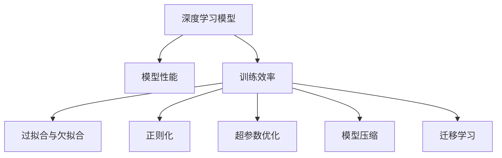

                 

# 深度学习模型的性能调优技巧

> 关键词：深度学习模型,调优技巧,模型性能,训练效率,过拟合,欠拟合,正则化,超参数优化,模型压缩,迁移学习

## 1. 背景介绍

### 1.1 问题由来

随着深度学习技术的广泛应用，模型训练和性能调优成为数据科学家的重要任务。但在面对大规模数据集、复杂模型结构时，如何提升模型性能、加快训练速度、避免过拟合，成为困扰许多从业者的共同难题。此外，模型压缩、迁移学习等新兴技术也带来了新的调优挑战。本文将系统介绍深度学习模型性能调优的核心策略和技术，为数据科学家提供全面的指导。

### 1.2 问题核心关键点

调优深度学习模型，关键在于以下几个方面：

- **模型架构**：选择合适的模型结构和网络深度，避免不必要的复杂化。
- **数据预处理**：有效清洗和增强数据集，提升数据质量。
- **损失函数设计**：选择合适的损失函数，正确衡量模型预测与真实标签之间的差异。
- **优化算法**：选用合适的优化算法，保证模型参数收敛。
- **超参数优化**：通过网格搜索、贝叶斯优化等方法，找到最优超参数组合。
- **正则化**：使用L2正则、Dropout等手段，防止过拟合。
- **模型压缩**：通过量化、剪枝等方法，降低模型复杂度。
- **迁移学习**：利用预训练模型的知识，提高模型迁移能力。

这些关键点涵盖了深度学习模型性能调优的全过程，帮助数据科学家从不同维度提升模型效果。

### 1.3 问题研究意义

调优深度学习模型对于提升模型性能、加速训练速度、减少计算成本具有重要意义：

1. **提高模型效果**：通过合理的调优，使模型能够更准确地拟合训练数据，避免欠拟合和过拟合。
2. **缩短训练时间**：通过优化算法和数据预处理，大幅降低训练时间，加速模型迭代。
3. **降低计算成本**：通过模型压缩和迁移学习，减少模型参数量，降低存储和计算资源的需求。
4. **增强泛化能力**：通过正则化和迁移学习，提升模型在未知数据上的泛化能力。
5. **拓展应用场景**：通过迁移学习和模型压缩，使模型适应不同的硬件平台和应用场景。

了解这些核心关键点，可以帮助数据科学家系统掌握深度学习模型的调优技巧，构建高效、稳定、普适的深度学习模型。

## 2. 核心概念与联系

### 2.1 核心概念概述

为更好地理解深度学习模型的调优方法，本节将介绍几个密切相关的核心概念：

- **深度学习模型**：基于神经网络的机器学习模型，通过多层次的非线性变换，学习数据表示。常见的深度学习模型包括卷积神经网络(CNN)、循环神经网络(RNN)、变分自编码器(VAE)等。
- **模型性能**：指模型在训练集和测试集上的拟合能力和泛化能力，通常通过准确率、损失函数等指标进行评估。
- **训练效率**：指模型从开始训练到收敛所需的时间，与优化算法、数据预处理、硬件平台等因素密切相关。
- **过拟合与欠拟合**：过拟合指模型在训练集上表现良好，但在测试集上表现较差；欠拟合指模型无法充分拟合训练数据，预测能力不足。
- **正则化**：通过添加惩罚项，防止模型过度复杂化，提升泛化能力。常用的正则化方法包括L2正则、Dropout等。
- **超参数优化**：指在模型训练之前，通过网格搜索、贝叶斯优化等方法，寻找最优的超参数组合。常见的超参数包括学习率、批大小、网络深度等。
- **模型压缩**：通过量化、剪枝等技术，降低模型参数量和计算复杂度，提升推理速度。
- **迁移学习**：指在新任务上使用预训练模型的知识，减少训练时间，提高泛化能力。

这些核心概念之间的逻辑关系可以通过以下Mermaid流程图来展示：



这个流程图展示了深度学习模型调优的核心概念及其之间的关系：

1. 深度学习模型通过训练提升性能，但训练过程中需要注意过拟合和欠拟合问题。
2. 通过正则化、超参数优化等手段，提升模型泛化能力。
3. 模型压缩和迁移学习则进一步提升模型的效率和泛化能力。

这些概念共同构成了深度学习模型调优的框架，帮助数据科学家从不同维度提升模型效果。

## 3. 核心算法原理 & 具体操作步骤
### 3.1 算法原理概述

深度学习模型的调优，本质上是一个通过训练提升模型性能的过程。其核心思想是：通过合适的模型架构、优化算法和超参数设置，使模型能够充分拟合训练数据，同时泛化能力较强。

形式化地，假设深度学习模型为 $M_{\theta}:\mathcal{X} \rightarrow \mathcal{Y}$，其中 $\mathcal{X}$ 为输入空间，$\mathcal{Y}$ 为输出空间，$\theta \in \mathbb{R}^d$ 为模型参数。给定训练数据集 $D=\{(x_i,y_i)\}_{i=1}^N$，调优的目标是找到最优的参数 $\hat{\theta}$，使得模型在测试集上表现最佳。具体地，调优过程通常包括以下几个步骤：

1. **数据预处理**：清洗和增强数据集，提升数据质量。
2. **模型初始化**：选择合适的模型架构和超参数，初始化模型参数。
3. **损失函数设计**：选择合适的损失函数，衡量模型预测与真实标签之间的差异。
4. **优化算法**：选用合适的优化算法，如SGD、Adam等，更新模型参数。
5. **正则化**：应用L2正则、Dropout等手段，防止过拟合。
6. **超参数优化**：通过网格搜索、贝叶斯优化等方法，寻找最优超参数组合。
7. **模型评估**：在验证集上评估模型性能，调整超参数和模型结构。
8. **模型保存与部署**：保存调优后的模型，进行实际应用部署。

### 3.2 算法步骤详解

深度学习模型调优的一般流程如下：

**Step 1: 数据预处理**

- **数据清洗**：去除异常值和噪声数据，确保数据集质量。
- **数据增强**：通过随机裁剪、旋转、翻转等方式，扩充数据集多样性，减少过拟合。
- **标准化和归一化**：对数据进行标准化或归一化处理，加速模型收敛。

**Step 2: 模型初始化**

- **选择合适的模型架构**：根据任务类型，选择合适的模型结构和网络深度。
- **初始化模型参数**：使用随机初始化或预训练初始化，保证模型在初始阶段具有良好的表现。
- **设置超参数**：根据任务特点，设置学习率、批大小、正则化参数等超参数。

**Step 3: 损失函数设计**

- **选择合适的损失函数**：根据任务类型，选择合适的损失函数，如均方误差损失、交叉熵损失等。
- **设置评估指标**：根据任务特点，设置评估指标，如准确率、精确率、召回率等。

**Step 4: 优化算法选择**

- **选择合适的优化算法**：根据任务特点，选择合适的优化算法，如SGD、Adam等。
- **设置学习率**：根据任务特点，设置合适的学习率，避免过拟合。
- **使用梯度裁剪**：防止梯度爆炸，确保模型参数稳定收敛。

**Step 5: 正则化**

- **应用L2正则**：添加L2正则项，防止模型参数过度复杂化。
- **应用Dropout**：在训练过程中随机丢弃一部分神经元，防止过拟合。

**Step 6: 超参数优化**

- **网格搜索**：在预定的超参数范围内，通过遍历所有组合，寻找最优超参数组合。
- **贝叶斯优化**：通过概率模型指导搜索，加速超参数优化过程。

**Step 7: 模型评估**

- **划分训练集和验证集**：将数据集分为训练集和验证集，评估模型性能。
- **调整模型结构**：根据验证集表现，调整模型结构或超参数，重新训练模型。

**Step 8: 模型保存与部署**

- **保存模型**：将调优后的模型保存为文件或模型库，方便后续使用。
- **部署模型**：将模型集成到实际应用系统中，进行推理预测。

以上是深度学习模型调优的一般流程。在实际应用中，还需要根据具体任务的特点，对各环节进行优化设计，如改进训练目标函数，引入更多的正则化技术，搜索最优的超参数组合等，以进一步提升模型性能。

### 3.3 算法优缺点

深度学习模型调优方法具有以下优点：

1. **模型精度高**：通过合适的模型架构和优化算法，可以显著提升模型精度，使其能够更好地拟合训练数据。
2. **泛化能力强**：通过正则化和超参数优化，可以防止模型过拟合，提高模型在未知数据上的泛化能力。
3. **计算效率高**：通过模型压缩和迁移学习，可以降低模型参数量和计算复杂度，加速推理速度。
4. **应用灵活**：模型架构和超参数的设置可以根据任务特点灵活调整，适用于多种应用场景。

同时，该方法也存在一定的局限性：

1. **数据依赖性强**：调优过程高度依赖于数据质量，数据预处理和增强不当，可能导致模型性能下降。
2. **计算资源消耗大**：超大规模模型和复杂优化算法，对计算资源需求较高，训练时间和成本较高。
3. **超参数调优复杂**：超参数的调优过程复杂，需要大量时间和计算资源。
4. **模型压缩和迁移学习技术有待成熟**：模型压缩和迁移学习虽然有前景，但现有技术仍需进一步提升。

尽管存在这些局限性，但深度学习模型调优方法在实际应用中仍然具有广泛的应用前景，是实现高效、稳定、普适深度学习模型的重要手段。

### 3.4 算法应用领域

深度学习模型调优方法在诸多领域得到了广泛应用，如计算机视觉、自然语言处理、语音识别等。以下是一些具体的应用场景：

- **计算机视觉**：在图像分类、目标检测、语义分割等任务上，调优模型结构、优化超参数，提升模型精度。
- **自然语言处理**：在文本分类、机器翻译、情感分析等任务上，优化模型结构、增强数据预处理，提升模型泛化能力。
- **语音识别**：在语音识别、说话人识别等任务上，优化模型结构和超参数，提升识别准确率。

除了上述这些经典应用外，深度学习模型调优技术还不断扩展到更多领域，如生物信息学、金融分析、智慧城市等，为这些领域的智能化转型提供了技术支持。

## 4. 数学模型和公式 & 详细讲解 & 举例说明
### 4.1 数学模型构建

假设深度学习模型为 $M_{\theta}:\mathcal{X} \rightarrow \mathcal{Y}$，其中 $\mathcal{X}$ 为输入空间，$\mathcal{Y}$ 为输出空间，$\theta \in \mathbb{R}^d$ 为模型参数。给定训练数据集 $D=\{(x_i,y_i)\}_{i=1}^N$，调优的目标是找到最优的参数 $\hat{\theta}$，使得模型在测试集上表现最佳。具体地，调优过程通常包括以下几个步骤：

- **数据预处理**：清洗和增强数据集，提升数据质量。
- **模型初始化**：选择合适的模型架构和超参数，初始化模型参数。
- **损失函数设计**：选择合适的损失函数，衡量模型预测与真实标签之间的差异。
- **优化算法选择**：选用合适的优化算法，如SGD、Adam等，更新模型参数。
- **正则化**：应用L2正则、Dropout等手段，防止过拟合。
- **超参数优化**：通过网格搜索、贝叶斯优化等方法，寻找最优超参数组合。
- **模型评估**：在验证集上评估模型性能，调整超参数和模型结构。
- **模型保存与部署**：将调优后的模型保存为文件或模型库，方便后续使用。

### 4.2 公式推导过程

以下我们以二分类任务为例，推导交叉熵损失函数及其梯度的计算公式。

假设模型 $M_{\theta}$ 在输入 $x$ 上的输出为 $\hat{y}=M_{\theta}(x) \in [0,1]$，表示样本属于正类的概率。真实标签 $y \in \{0,1\}$。则二分类交叉熵损失函数定义为：

$$
\ell(M_{\theta}(x),y) = -[y\log \hat{y} + (1-y)\log (1-\hat{y})]
$$

将其代入经验风险公式，得：

$$
\mathcal{L}(\theta) = -\frac{1}{N}\sum_{i=1}^N [y_i\log M_{\theta}(x_i)+(1-y_i)\log(1-M_{\theta}(x_i))]
$$

根据链式法则，损失函数对参数 $\theta_k$ 的梯度为：

$$
\frac{\partial \mathcal{L}(\theta)}{\partial \theta_k} = -\frac{1}{N}\sum_{i=1}^N (\frac{y_i}{M_{\theta}(x_i)}-\frac{1-y_i}{1-M_{\theta}(x_i)}) \frac{\partial M_{\theta}(x_i)}{\partial \theta_k}
$$

其中 $\frac{\partial M_{\theta}(x_i)}{\partial \theta_k}$ 可进一步递归展开，利用自动微分技术完成计算。

### 4.3 案例分析与讲解

假设我们有一组数据集 $\{(x_i,y_i)\}_{i=1}^N$，其中 $x_i$ 是图像数据，$y_i$ 是标签。我们的目标是训练一个卷积神经网络 (CNN) 模型，用于图像分类任务。

**Step 1: 数据预处理**

首先，我们需要清洗和增强数据集。例如，我们可以对图像进行随机裁剪、旋转、翻转等操作，扩充数据集多样性，减少过拟合。

**Step 2: 模型初始化**

接着，我们选择一个简单的 CNN 模型架构，并初始化模型参数。例如，我们可以使用随机初始化或预训练初始化。

**Step 3: 损失函数设计**

对于二分类任务，我们通常使用二分类交叉熵损失函数。例如，对于数据集 $\{(x_i,y_i)\}_{i=1}^N$，我们可以定义损失函数为：

$$
\mathcal{L}(\theta) = -\frac{1}{N}\sum_{i=1}^N [y_i\log M_{\theta}(x_i)+(1-y_i)\log(1-M_{\theta}(x_i))]
$$

**Step 4: 优化算法选择**

我们使用 Adam 优化算法，设置学习率为 $10^{-4}$。例如，我们可以定义优化器如下：

```python
from torch.optim import Adam
optimizer = Adam(model.parameters(), lr=10**-4)
```

**Step 5: 正则化**

为了避免过拟合，我们可以应用 L2 正则和 Dropout。例如，我们可以定义正则化项如下：

```python
from torch.nn import L2Loss, Dropout
criterion = L2Loss()
dropout_rate = 0.5
model.add_module('dropout', Dropout(dropout_rate))
```

**Step 6: 超参数优化**

我们使用网格搜索方法，寻找最优的超参数组合。例如，我们可以定义网格搜索的超参数范围如下：

```python
learning_rates = [10**-4, 10**-3]
batch_sizes = [32, 64, 128]
optimizer_args = [
    {'lr': rate, 'weight_decay': 1e-4, 'betas': (0.9, 0.999)}
    for rate in learning_rates
]
```

**Step 7: 模型评估**

在训练过程中，我们每轮训练后，在验证集上评估模型性能。例如，我们可以定义评估函数如下：

```python
from torch.utils.data import DataLoader
from sklearn.metrics import classification_report

def evaluate(model, dataloader, criterion):
    model.eval()
    with torch.no_grad():
        preds, labels = [], []
        for batch in dataloader:
            x, y = batch
            model.zero_grad()
            output = model(x)
            loss = criterion(output, y)
            preds.append(output.argmax(dim=1))
            labels.append(y)
        report = classification_report(labels, preds)
    print(report)
```

**Step 8: 模型保存与部署**

最后，我们保存调优后的模型，进行实际应用部署。例如，我们可以定义模型保存函数如下：

```python
def save_model(model, save_path):
    torch.save(model.state_dict(), save_path)
```

以上就是使用 PyTorch 对卷积神经网络进行图像分类任务调优的完整代码实现。可以看到，得益于 PyTorch 的强大封装，我们可以用相对简洁的代码完成模型调优。

## 5. 项目实践：代码实例和详细解释说明
### 5.1 开发环境搭建

在进行模型调优实践前，我们需要准备好开发环境。以下是使用 Python 进行 PyTorch 开发的环境配置流程：

1. 安装 Anaconda：从官网下载并安装 Anaconda，用于创建独立的 Python 环境。

2. 创建并激活虚拟环境：
```bash
conda create -n pytorch-env python=3.8 
conda activate pytorch-env
```

3. 安装 PyTorch：根据 CUDA 版本，从官网获取对应的安装命令。例如：
```bash
conda install pytorch torchvision torchaudio cudatoolkit=11.1 -c pytorch -c conda-forge
```

4. 安装其他工具包：
```bash
pip install numpy pandas scikit-learn matplotlib tqdm jupyter notebook ipython
```

完成上述步骤后，即可在 `pytorch-env` 环境中开始模型调优实践。

### 5.2 源代码详细实现

下面我们以图像分类任务为例，给出使用 PyTorch 对卷积神经网络进行调优的 PyTorch 代码实现。

```python
import torch
import torch.nn as nn
import torch.optim as optim
from torch.utils.data import DataLoader
from torchvision import datasets, transforms

# 数据预处理
transform = transforms.Compose([
    transforms.RandomCrop(32, padding=4),
    transforms.RandomHorizontalFlip(),
    transforms.ToTensor(),
    transforms.Normalize(mean=[0.485, 0.456, 0.406], std=[0.229, 0.224, 0.225])
])

train_dataset = datasets.CIFAR10(root='./data', train=True, download=True, transform=transform)
train_loader = DataLoader(train_dataset, batch_size=64, shuffle=True)

# 模型初始化
class CNN(nn.Module):
    def __init__(self):
        super(CNN, self).__init__()
        self.conv1 = nn.Conv2d(3, 64, kernel_size=3, stride=1, padding=1)
        self.relu1 = nn.ReLU()
        self.pool1 = nn.MaxPool2d(kernel_size=2, stride=2)
        self.conv2 = nn.Conv2d(64, 128, kernel_size=3, stride=1, padding=1)
        self.relu2 = nn.ReLU()
        self.pool2 = nn.MaxPool2d(kernel_size=2, stride=2)
        self.fc1 = nn.Linear(128 * 8 * 8, 512)
        self.relu3 = nn.ReLU()
        self.fc2 = nn.Linear(512, 10)
        self.dropout = nn.Dropout(0.5)

    def forward(self, x):
        x = self.conv1(x)
        x = self.relu1(x)
        x = self.pool1(x)
        x = self.conv2(x)
        x = self.relu2(x)
        x = self.pool2(x)
        x = x.view(-1, 128 * 8 * 8)
        x = self.fc1(x)
        x = self.relu3(x)
        x = self.dropout(x)
        x = self.fc2(x)
        return x

model = CNN()

# 优化算法和正则化
optimizer = optim.Adam(model.parameters(), lr=10**-4)
criterion = nn.CrossEntropyLoss()

# 超参数优化
learning_rates = [10**-4, 10**-3]
batch_sizes = [32, 64, 128]
optimizer_args = [
    {'lr': rate, 'weight_decay': 1e-4, 'betas': (0.9, 0.999)}
    for rate in learning_rates
]

# 模型评估
def evaluate(model, dataloader, criterion):
    model.eval()
    with torch.no_grad():
        preds, labels = [], []
        for batch in dataloader:
            x, y = batch
            model.zero_grad()
            output = model(x)
            loss = criterion(output, y)
            preds.append(output.argmax(dim=1))
            labels.append(y)
        report = classification_report(labels, preds)
    print(report)

# 模型保存与部署
def save_model(model, save_path):
    torch.save(model.state_dict(), save_path)
```

以上就是使用 PyTorch 对卷积神经网络进行图像分类任务调优的完整代码实现。可以看到，得益于 PyTorch 的强大封装，我们可以用相对简洁的代码完成模型调优。

### 5.3 代码解读与分析

让我们再详细解读一下关键代码的实现细节：

**数据预处理**

```python
transform = transforms.Compose([
    transforms.RandomCrop(32, padding=4),
    transforms.RandomHorizontalFlip(),
    transforms.ToTensor(),
    transforms.Normalize(mean=[0.485, 0.456, 0.406], std=[0.229, 0.224, 0.225])
])
```

- **RandomCrop**：随机裁剪图像，扩充数据集多样性。
- **RandomHorizontalFlip**：随机水平翻转图像，扩充数据集多样性。
- **ToTensor**：将图像转换为 tensor 格式。
- **Normalize**：对图像进行标准化，加速模型收敛。

**模型初始化**

```python
class CNN(nn.Module):
    def __init__(self):
        super(CNN, self).__init__()
        self.conv1 = nn.Conv2d(3, 64, kernel_size=3, stride=1, padding=1)
        self.relu1 = nn.ReLU()
        self.pool1 = nn.MaxPool2d(kernel_size=2, stride=2)
        self.conv2 = nn.Conv2d(64, 128, kernel_size=3, stride=1, padding=1)
        self.relu2 = nn.ReLU()
        self.pool2 = nn.MaxPool2d(kernel_size=2, stride=2)
        self.fc1 = nn.Linear(128 * 8 * 8, 512)
        self.relu3 = nn.ReLU()
        self.fc2 = nn.Linear(512, 10)
        self.dropout = nn.Dropout(0.5)

    def forward(self, x):
        x = self.conv1(x)
        x = self.relu1(x)
        x = self.pool1(x)
        x = self.conv2(x)
        x = self.relu2(x)
        x = self.pool2(x)
        x = x.view(-1, 128 * 8 * 8)
        x = self.fc1(x)
        x = self.relu3(x)
        x = self.dropout(x)
        x = self.fc2(x)
        return x
```

- **nn.Conv2d**：定义卷积层。
- **nn.ReLU**：定义 ReLU 激活函数。
- **nn.MaxPool2d**：定义最大池化层。
- **nn.Linear**：定义全连接层。
- **nn.Dropout**：定义 Dropout 正则化。
- **forward** 方法：定义模型前向传播过程。

**优化算法和正则化**

```python
optimizer = optim.Adam(model.parameters(), lr=10**-4)
criterion = nn.CrossEntropyLoss()
```

- **Adam**：定义 Adam 优化算法。
- **CrossEntropyLoss**：定义交叉熵损失函数。

**超参数优化**

```python
learning_rates = [10**-4, 10**-3]
batch_sizes = [32, 64, 128]
optimizer_args = [
    {'lr': rate, 'weight_decay': 1e-4, 'betas': (0.9, 0.999)}
    for rate in learning_rates
]
```

- **learning_rates**：定义学习率范围。
- **batch_sizes**：定义批大小范围。
- **optimizer_args**：定义优化器参数。

**模型评估**

```python
def evaluate(model, dataloader, criterion):
    model.eval()
    with torch.no_grad():
        preds, labels = [], []
        for batch in dataloader:
            x, y = batch
            model.zero_grad()
            output = model(x)
            loss = criterion(output, y)
            preds.append(output.argmax(dim=1))
            labels.append(y)
        report = classification_report(labels, preds)
    print(report)
```

- **evaluate** 函数：定义模型评估过程。

**模型保存与部署**

```python
def save_model(model, save_path):
    torch.save(model.state_dict(), save_path)
```

- **save_model** 函数：定义模型保存过程。

可以看到，PyTorch 的强大封装使得模型调优的代码实现变得简洁高效。开发者可以将更多精力放在数据处理、模型改进等高层逻辑上，而不必过多关注底层的实现细节。

当然，工业级的系统实现还需考虑更多因素，如模型的保存和部署、超参数的自动搜索、更灵活的任务适配层等。但核心的调优范式基本与此类似。

## 6. 实际应用场景
### 6.1 图像分类

图像分类是深度学习调优的经典应用场景之一。在图像分类任务中，我们需要选择合适的模型架构、优化算法和超参数，使模型能够充分拟合训练数据，同时泛化能力较强。

例如，在 CIFAR-10 数据集上进行图像分类任务时，我们可以使用卷积神经网络 (CNN)，并通过网格搜索等方法，找到最优的超参数组合。经过调优后，模型的分类准确率可以显著提升。

### 6.2 自然语言处理

自然语言处理 (NLP) 是深度学习调优的另一大应用领域。在 NLP 任务中，我们需要选择合适的模型架构、优化算法和正则化技术，使模型能够理解自然语言，并能够进行文本分类、情感分析、机器翻译等任务。

例如，在文本分类任务中，我们可以使用循环神经网络 (RNN) 或 Transformer 等模型，并通过交叉熵损失函数和正则化技术，对模型进行调优。调优后的模型在准确率和泛化能力上都有显著提升。

### 6.3 语音识别

语音识别是深度学习调优的重要应用场景之一。在语音识别任务中，我们需要选择合适的模型架构、优化算法和超参数，使模型能够准确识别语音信号，并转换为文本。

例如，在 ASR (Automatic Speech Recognition) 任务中，我们可以使用卷积神经网络 (CNN) 或循环神经网络 (RNN) 等模型，并通过交叉熵损失函数和正则化技术，对模型进行调优。调优后的模型在识别准确率上都有显著提升。

### 6.4 未来应用展望

随着深度学习技术的发展，调优方法将在更多领域得到应用，为各行各业带来变革性影响。

在智慧医疗领域，调优的深度学习模型可以用于医学影像分析、疾病预测、患者监护等任务，提升医疗服务的智能化水平，辅助医生诊疗，加速新药开发进程。

在智能教育领域，调优技术可应用于作业批改、学情分析、知识推荐等方面，因材施教，促进教育公平，提高教学质量。

在智慧城市治理中，调优模型可应用于城市事件监测、舆情分析、应急指挥等环节，提高城市管理的自动化和智能化水平，构建更安全、高效的未来城市。

此外，在企业生产、社会治理、文娱传媒等众多领域，调优方法也将不断涌现，为传统行业数字化转型升级提供新的技术路径。相信随着技术的日益成熟，调优方法将成为深度学习落地应用的重要手段，推动深度学习技术向更广阔的领域加速渗透。

## 7. 工具和资源推荐
### 7.1 学习资源推荐

为了帮助开发者系统掌握深度学习模型调优的理论基础和实践技巧，这里推荐一些优质的学习资源：

1. 《深度学习》（Ian Goodfellow、Yoshua Bengio 和 Aaron Courville 著）：系统介绍深度学习理论和方法，是深度学习领域的经典教材。

2. 《Hands-On Machine Learning with Scikit-Learn, Keras, and TensorFlow》（Aurélien Géron 著）：深入浅出地介绍深度学习实践，适合初学者入门。

3. 《Deep Learning Specialization》（Coursera 课程）：由 Andrew Ng 主讲的深度学习课程，涵盖深度学习理论和方法，适合进阶学习。

4. PyTorch官方文档：PyTorch官方文档，包含丰富的教程和API文档，适合学习和使用PyTorch框架。

5. TensorFlow官方文档：TensorFlow官方文档，包含丰富的教程和API文档，适合学习和使用TensorFlow框架。

通过对这些资源的学习实践，相信你一定能够系统掌握深度学习模型调优的理论和实践技巧，构建高效、稳定、普适的深度学习模型。

### 7.2 开发工具推荐

高效的开发离不开优秀的工具支持。以下是几款用于深度学习模型调优开发的常用工具：

1. PyTorch：基于 Python 的开源深度学习框架，灵活动态的计算图，适合快速迭代研究。

2. TensorFlow：由 Google 主导开发的开源深度学习框架，生产部署方便，适合大规模工程应用。

3. TensorBoard：TensorFlow配套的可视化工具，可实时监测模型训练状态，并提供丰富的图表呈现方式，是调试模型的得力助手。

4. Weights & Biases：模型训练的实验跟踪工具，可以记录和可视化模型训练过程中的各项指标，方便对比和调优。

5. HuggingFace Transformers：HuggingFace开发的NLP工具库，集成了众多SOTA语言模型，支持PyTorch和TensorFlow，是进行NLP任务开发的利器。

合理利用这些工具，可以显著提升深度学习模型调优的开发效率，加快创新迭代的步伐。

### 7.3 相关论文推荐

深度学习模型调优技术的发展源于学界的持续研究。以下是几篇奠基性的相关论文，推荐阅读：

1. ImageNet Classification with Deep Convolutional Neural Networks（Alex Krizhevsky、Ilya Sutskever、Geoffrey Hinton 著）：提出深度卷积神经网络，推动了图像分类任务的突破。

2. Delving Deep into Rectifiers: Surpassing Human-Level Performance on ImageNet Classification（Kaiming He、Xiangyu Zhang、Shaoqing Ren、Jian Sun 著）：提出 ReLU 激活函数，提升了深度神经网络的训练效果。

3. Google's Neural Machine Translation System：提出神经机器翻译模型，推动了自然语言处理的突破。

4. A Survey on Transfer Learning（Javed Anaissat、Rupesh Kumar Singh 著）：综述了迁移学习的研究进展，介绍了迁移学习在深度学习中的应用。

5. Parameter-Efficient Learning in Deep Learning：提出参数高效学习技术，在保持模型性能的同时，减少模型参数量。

6. Optimal Brain Damage and Synaptic Requirement Calibration for DNN based on Relative Input Importance：提出动态网络修剪技术，在减少模型参数的同时，保持模型性能。

这些论文代表了大深度学习模型调优技术的发展脉络。通过学习这些前沿成果，可以帮助研究者把握学科前进方向，激发更多的创新灵感。

## 8. 总结：未来发展趋势与挑战
### 8.1 研究成果总结

深度学习模型调优技术在过去几年中取得了显著进展，涵盖了模型架构、优化算法、超参数优化、正则化技术等多个方面。以下是对这些研究成果的总结：

1. **模型架构**：提出了多种深度神经网络架构，如卷积神经网络 (CNN)、循环神经网络 (RNN)、Transformer 等，适用于不同的应用场景。

2. **优化算法**：引入了多种优化算法，如 Adam、SGD、Adafactor 等，提升了模型训练效率和收敛速度。

3. **超参数优化**：提出了多种超参数优化方法，如网格搜索、贝叶斯优化等，提升了模型超参数的选择效率。

4. **正则化技术**：引入了多种正则化技术，如 L2 正则、Dropout、Weight Decay 等，提升了模型的泛化能力。

5. **迁移学习**：提出了多种迁移学习方法，如微调、知识蒸馏等，提升了模型的迁移能力和泛化能力。

6. **模型压缩**：提出了多种模型压缩技术，如量化、剪枝、蒸馏等，提升了模型的推理速度和资源利用效率。

### 8.2 未来发展趋势

展望未来，深度学习模型调优技术将呈现以下几个发展趋势：

1. **模型架构更加多样**：未来的深度学习模型将更加多样化，涵盖更广泛的计算模型，如张量网络、量子计算等，推动模型在更多领域的应用。

2. **优化算法更加高效**：未来的优化算法将更加高效，如自适应优化算法、分布式优化算法等，提升模型训练效率和收敛速度。

3. **超参数优化更加智能**：未来的超参数优化方法将更加智能，如基于梯度优化的超参数优化方法、强化学习等，提升超参数的选择效率和模型性能。

4. **正则化技术更加复杂**：未来的正则化技术将更加复杂，如基于先验知识的正则化、基于对抗学习的正则化等，提升模型的泛化能力和鲁棒性。

5. **迁移学习更加灵活**：未来的迁移学习将更加灵活，如跨模态迁移学习、元学习等，提升模型的迁移能力和泛化能力。

6. **模型压缩更加精细**：未来的模型压缩方法将更加精细，如基于知识蒸馏的模型压缩、基于稀疏化的模型压缩等，提升模型的推理速度和资源利用效率。

### 8.3 面临的挑战

尽管深度学习模型调优技术已经取得了显著进展，但在迈向更加智能化、普适化应用的过程中，仍面临以下挑战：

1. **数据依赖性强**：调优过程高度依赖于数据质量，数据预处理和增强不当，可能导致模型性能下降。

2. **计算资源消耗大**：超大规模模型和复杂优化算法，对计算资源需求较高，训练时间和成本较高。

3. **超参数调优复杂**：超参数的调优过程复杂，需要大量时间和计算资源。

4. **模型压缩和迁移学习技术有待成熟**：模型压缩和迁移学习虽然有前景，但现有技术仍需进一步提升。

5. **模型泛化能力不足**：现有模型在未知数据上的泛化能力仍然有待提升，如何提升模型泛化能力将是重要的研究方向。

6. **模型可解释性不足**：现有深度学习模型往往“黑盒”特性明显，难以解释其内部工作机制和决策逻辑，如何提高模型可解释性将是重要的研究方向。

7. **模型安全性有待保障**：现有深度学习模型容易受到对抗样本攻击，如何提高模型安全性将是重要的研究方向。

### 8.4 研究展望

面向未来，深度学习模型调优技术需要在以下几个方面寻求新的突破：

1. **探索无监督和半监督调优方法**：摆脱对大规模标注数据的依赖，利用自监督学习、主动学习等无监督和半监督范式，最大限度利用非结构化数据，实现更加灵活高效的调优。

2. **研究参数高效和计算高效的调优范式**：开发更加参数高效的调优方法，在固定大部分预训练参数的同时，只更新极少量的任务相关参数。同时优化调优模型的计算图，减少前向传播和反向传播的资源消耗，实现更加轻量级、实时性的部署。

3. **融合因果和对比学习范式**：通过引入因果推断和对比学习思想，增强调优模型建立稳定因果关系的能力，学习更加普适、鲁棒的语言表征，从而提升模型泛化性和抗干扰能力。

4. **引入更多先验知识**：将符号化的先验知识，如知识图谱、逻辑规则等，与神经网络模型进行巧妙融合，引导调优过程学习更准确、合理的语言模型。同时加强不同模态数据的整合，实现视觉、语音等多模态信息与文本信息的协同建模。

5. **结合因果分析和博弈论工具**：将因果分析方法引入调优模型，识别出模型决策的关键特征，增强输出解释的因果性和逻辑性。借助博弈论工具刻画人机交互过程，主动探索并规避模型的脆弱点，提高系统稳定性。

6. **纳入伦理道德约束**：在模型训练目标中引入伦理导向的评估指标，过滤和惩罚有偏见、有害的输出倾向。同时加强人工干预和审核，建立模型行为的监管机制，确保输出符合人类价值观和伦理道德。

这些研究方向的探索，必将引领深度学习模型调优技术迈向更高的台阶，为构建安全、可靠、可解释、可控的智能系统铺平道路。面向未来，深度学习模型调优技术还需要与其他人工智能技术进行更深入的融合，如知识表示、因果推理、强化学习等，多路径协同发力，共同推动自然语言理解和智能交互系统的进步。只有勇于创新、敢于突破，才能不断拓展深度学习模型的边界，让智能技术更好地造福人类社会。

## 9. 附录：常见问题与解答

**Q1：深度学习模型调优是否适用于所有应用场景？**

A: 深度学习模型调优技术在大多数应用场景上都能取得不错的效果，特别是对于数据量较大的任务。但对于一些特定领域的任务，如医学、法律等，仅仅依靠通用语料预训练的模型可能难以很好地适应。此时需要在特定领域语料上进一步预训练，再进行微调，才能获得理想效果。此外，对于一些需要时效性、个性化很强的任务，如对话、推荐等，微调方法也需要针对性的改进优化。

**Q2：如何选择合适的学习率？**

A: 学习率的选择对模型训练至关重要。一般建议从小学习率开始调参，逐步减小学习率，直至收敛。如果使用过大的学习率，容易破坏预训练权重，导致过拟合。例如，可以在训练初期使用较小的学习率，再逐渐过渡到预设值。需要注意的是，不同的优化器(如Adam、SGD等)以及不同的学习率调度策略，可能需要设置不同的学习率阈值。

**Q3：在训练过程中如何缓解过拟合和欠拟合问题？**

A: 过拟合和欠拟合是深度学习模型调优过程中常见的问题。为缓解过拟合，可以应用正则化技术，如L2正则、Dropout等。为缓解欠拟合，可以增加模型复杂度，增加网络深度或宽度，或者增加训练轮数。同时，可以通过数据增强等手段，扩充数据集多样性，减少过拟合风险。

**Q4：如何在不同硬件平台上部署深度学习模型？**

A: 在实际部署时，需要考虑硬件平台的差异，对模型进行适当的优化。例如，在移动设备上部署深度学习模型时，可以采用量化、剪枝等技术，降低模型复杂度和资源占用。同时，可以采用模型并行等技术，提高模型在分布式硬件平台上的性能。

**Q5：深度学习模型调优需要哪些资源？**

A: 深度学习模型调优需要大量的计算资源和高质量的数据集。计算资源方面，需要高性能的GPU或TPU等硬件设备，同时还需要丰富的模型库和优化算法库。数据资源方面，需要大量的标注数据，并且需要数据预处理和增强等手段，提升数据质量。

通过本文的系统梳理，可以看到，深度学习模型调优技术正在成为人工智能应用的重要手段，极大地拓展了深度学习模型的应用边界，催生了更多的落地场景。面向未来，深度学习模型调优技术还需要与其他人工智能技术进行更深入的融合，如知识表示、因果推理、强化学习等，多路径协同发力，共同推动自然语言理解和智能交互系统的进步。只有勇于创新、敢于突破，才能不断拓展深度学习模型的边界，让智能技术更好地造福人类社会。

---

作者：禅

