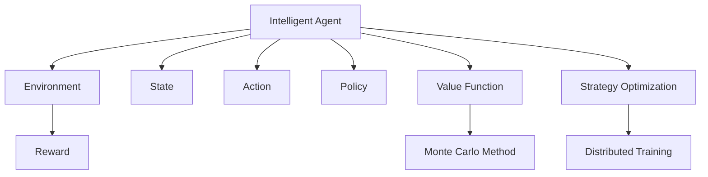

                 

# 深度强化学习:AI智能体的自主学习

> 关键词：深度强化学习,强化学习,自主学习,智能体,神经网络,蒙特卡罗方法,策略优化,分布式训练

## 1. 背景介绍

### 1.1 问题由来

强化学习(Reinforcement Learning, RL)是人工智能领域的一个重要分支，旨在通过智能体与环境的交互学习，使智能体学会执行特定任务。该方法与传统的监督学习不同，它强调智能体的自主学习能力，能更好地适应未知环境和动态变化。然而，传统的强化学习往往需要大量的人工干预和调节，难以达到理想的鲁棒性和泛化性能。

近年来，随着深度学习技术的发展，人们发现深度神经网络在处理高维非结构化数据（如图像、文本、声音等）方面具有优势，因此尝试将深度学习与强化学习结合，形成了深度强化学习(Deep Reinforcement Learning, DRL)。DRL将神经网络的表达能力与强化学习的自主学习能力结合起来，能更高效地实现复杂任务的学习和执行。

### 1.2 问题核心关键点

深度强化学习算法的主要关键点在于以下几点：

- 智能体的自主学习：通过与环境的交互，智能体自主地学习和优化策略，无需人工干预。
- 策略优化：智能体通过评估当前策略的效果，采用梯度上升等方式优化策略，逐渐逼近最优策略。
- 神经网络的表达能力：深度神经网络在处理复杂任务中的表现优于传统方法，能有效学习到更复杂的表示。
- 蒙特卡罗方法的近似：由于复杂环境和高维状态空间，直接计算策略效果往往不可行，因此采用蒙特卡罗方法近似评估策略效果。
- 分布式训练：深度强化学习问题往往涉及大量状态空间和长期时间尺度，分布式训练可以显著加速训练过程。

深度强化学习在自动驾驶、机器人控制、游戏AI等领域已经展现出巨大的潜力，成为了人工智能领域的前沿方向。然而，深度强化学习的理论和实践仍面临诸多挑战，如样本效率低、策略不稳定、计算资源需求高等问题。本文将深入探讨深度强化学习的基本原理和核心算法，并通过实例展示其在不同领域的应用，同时分析其未来发展趋势和面临的挑战。

## 2. 核心概念与联系

### 2.1 核心概念概述

为更好地理解深度强化学习的核心概念，本节将介绍几个密切相关的核心概念：

- 智能体(Agent)：与环境交互的自主学习实体，执行行动以最大化累积奖励。
- 环境(Environment)：智能体互动的外部世界，提供状态和奖励。
- 状态(State)：智能体当前环境的描述，可能是一个高维向量。
- 动作(Action)：智能体采取的具体操作，如在自动驾驶中，加速、刹车、转向等。
- 奖励(Reward)：环境对智能体行为的即时反馈，如在自动驾驶中，安全行驶获得正奖励，违章行驶获得负奖励。
- 策略(Policy)：智能体选择动作的概率分布，如选择左转的概率为0.6。
- 值函数(Value Function)：状态或动作的值估计，用于评估策略的好坏。
- 策略优化(Strategy Optimization)：通过优化策略参数，使智能体的行为效果最大化。
- 蒙特卡罗方法(Monte Carlo Method)：通过随机抽样模拟，近似估计策略效果，用于解决值函数的高维优化问题。
- 分布式训练(Distributed Training)：在多台机器上同时训练，并行计算优化，提高训练效率。

这些核心概念之间的逻辑关系可以通过以下Mermaid流程图来展示：



这个流程图展示了几大核心概念之间的联系：

1. 智能体与环境互动，获取状态和奖励。
2. 智能体基于策略选择动作，根据奖励更新状态。
3. 策略通过优化方法不断改进，状态和奖励反馈到智能体。
4. 蒙特卡罗方法用于近似策略效果，分布式训练加速优化过程。

这些概念共同构成了深度强化学习的基础框架，使得智能体能自主学习并执行复杂任务。

## 3. 核心算法原理 & 具体操作步骤
### 3.1 算法原理概述

深度强化学习的核心在于通过智能体与环境的交互，学习最优策略。其基本流程如下：

1. 智能体从环境获取状态。
2. 基于策略选择动作。
3. 执行动作后，环境提供状态和奖励。
4. 计算当前策略下的累积奖励。
5. 根据奖励更新策略参数。
6. 重复上述过程，直到达到终止条件。

通过神经网络，智能体可以学习到高维状态空间和复杂动作策略的表示，从而应对更复杂的环境和任务。

### 3.2 算法步骤详解

以下是深度强化学习的基本算法步骤：

**Step 1: 环境建模**
- 定义环境的物理模型，如自动驾驶中的交通规则、地图信息等。
- 设计智能体与环境互动的接口，如状态空间和动作空间的定义。

**Step 2: 策略设计**
- 选择合适的策略模型，如策略网络、价值网络、双网络等。
- 设置策略的网络结构、初始参数和优化目标。

**Step 3: 优化算法**
- 选择合适的优化算法，如策略梯度、策略优化器等。
- 设计优化算法的参数和学习率。

**Step 4: 策略评估**
- 采用蒙特卡罗方法近似计算策略的累积奖励。
- 根据奖励结果更新策略参数。

**Step 5: 策略迭代**
- 重复上述步骤，直至策略收敛。
- 在测试集上评估策略效果。

通过这些步骤，智能体能逐步学习到最优策略，并在实际环境中执行。

### 3.3 算法优缺点

深度强化学习算法具有以下优点：
1. 自主学习能力：智能体通过与环境的交互自主学习，无需人工干预。
2. 高表达能力：神经网络强大的表达能力，可以学习复杂状态和动作策略。
3. 灵活适应性：能适应动态变化的环境和任务。
4. 多模态融合：能融合多种传感器信息，提升感知和决策能力。

同时，深度强化学习也存在以下缺点：
1. 样本效率低：需要大量样本才能收敛，难以在小样本条件下优化。
2. 策略不稳定：策略优化可能陷入局部最优，难以保证泛化性能。
3. 计算资源需求高：涉及大量计算和存储资源。
4. 难以理论分析：理论分析难度大，难以证明最优性。

尽管存在这些缺点，但深度强化学习在处理复杂任务和自主学习能力方面，展现了强大的潜力，成为了当前人工智能研究的重要方向。

### 3.4 算法应用领域

深度强化学习在多个领域得到了广泛应用，如：

- 自动驾驶：通过模拟和测试环境，学习安全驾驶策略。
- 机器人控制：通过物理模拟和实际实验，学习机器人操作动作。
- 游戏AI：通过游戏环境互动，学习最优策略。
- 金融投资：通过市场数据，学习最优投资策略。
- 资源管理：通过资源使用情况，学习优化资源分配。

除了上述这些领域外，深度强化学习还在医疗、能源管理、供应链优化等领域有重要应用，展现了其广泛的适用性和潜力。

## 4. 数学模型和公式 & 详细讲解  
### 4.1 数学模型构建

本节将使用数学语言对深度强化学习的基本框架进行更加严格的刻画。

记智能体为 $A$，环境为 $E$。智能体在环境中的策略为 $π$，状态空间为 $S$，动作空间为 $A$，奖励函数为 $R$。策略 $π$ 在状态 $s_t$ 下执行动作 $a_t$ 的概率为 $π(a_t|s_t)$。

策略优化目标是最大化累积奖励，即：

$$
\mathcal{L}(π) = \mathbb{E}_{(s_t,a_t,r_{t+1})} \left[ \sum_{t=0}^{T} \gamma^t r_{t+1} \right]
$$

其中 $T$ 表示时间步，$\gamma$ 为折扣因子，$T$ 表示时间步。

策略优化通常通过梯度上升方法实现，即：

$$
\nabla_{θ} \mathcal{L}(π) = \nabla_{θ} \mathbb{E}_{(s_t,a_t,r_{t+1})} \left[ \sum_{t=0}^{T} \gamma^t r_{t+1} \right]
$$

通过计算该梯度，可以不断优化策略参数 $θ$，使累积奖励最大化。

### 4.2 公式推导过程

以下我们以Q-learning算法为例，推导其策略优化公式。

在Q-learning算法中，策略 $π$ 被表示为Q值函数的映射，即 $π(a_t|s_t) = \pi(a_t|s_t) = \frac{e^{Q_{θ}(s_t,a_t)}}{Z}$，其中 $Z$ 为归一化因子。

Q-learning算法通过求解Q值函数 $Q_{θ}(s,a)$ 最小化累积奖励。假设Q值为 $Q(s,a)=\mathbb{E}[R_{t+1}+\gamma Q(s_{t+1},a_{t+1})|s_t,a_t]$，则Q-learning算法的策略优化公式为：

$$
Q_{θ}(s_t,a_t) \leftarrow Q_{θ}(s_t,a_t)+\alpha(r_{t+1}+\gamma Q_{θ}(s_{t+1},a_{t+1})-Q_{θ}(s_t,a_t))
$$

其中，$\alpha$ 为学习率，$Q_{θ}(s_{t+1},a_{t+1})$ 表示在状态 $s_{t+1}$ 下执行动作 $a_{t+1}$ 的Q值。

通过上述公式，智能体在每个时间步根据当前状态和动作，更新Q值函数，不断逼近最优策略。

### 4.3 案例分析与讲解

假设智能体在自动驾驶场景中执行决策任务，环境为一个智能交通系统。智能体需要学习如何在交通中安全行驶，避免碰撞和拥堵。智能体的状态空间为当前位置和车速，动作空间为加速、刹车、转向等。

智能体可以采用深度神经网络模型，如DQN或PPO，来学习最优策略。在训练过程中，智能体不断从环境中获取状态和奖励，根据当前状态和动作，计算Q值函数，更新神经网络参数，最终输出最优策略。

## 5. 项目实践：代码实例和详细解释说明
### 5.1 开发环境搭建

在进行深度强化学习实践前，我们需要准备好开发环境。以下是使用Python进行PyTorch开发的环境配置流程：

1. 安装Anaconda：从官网下载并安装Anaconda，用于创建独立的Python环境。

2. 创建并激活虚拟环境：
```bash
conda create -n drl-env python=3.8 
conda activate drl-env
```

3. 安装PyTorch：根据CUDA版本，从官网获取对应的安装命令。例如：
```bash
conda install pytorch torchvision torchaudio cudatoolkit=11.1 -c pytorch -c conda-forge
```

4. 安装各类工具包：
```bash
pip install numpy pandas scikit-learn matplotlib tqdm jupyter notebook ipython
```

完成上述步骤后，即可在`drl-env`环境中开始深度强化学习实践。

### 5.2 源代码详细实现

下面我们以DQN算法实现自动驾驶决策为例，给出使用PyTorch进行深度强化学习的PyTorch代码实现。

首先，定义自动驾驶场景的环境类：

```python
import numpy as np
import torch
import torch.nn as nn
import torch.optim as optim
from torch.distributions import Categorical

class CarEnv:
    def __init__(self, state_dim=2, action_dim=3, reward_fn=None):
        self.state_dim = state_dim
        self.action_dim = action_dim
        self.reward_fn = reward_fn
        self.state = np.random.uniform(0, 1, (state_dim,))
        self.action = np.zeros(action_dim)
        self.done = False
        self.reward = 0
        self.max_reward = 1
        self.min_reward = -1
        self.gamma = 0.9
        self.epsilon = 1e-5
        self.epsilon_decay = 0.999
        self.epsilon_min = 0.01
        
    def step(self, action):
        if self.done:
            return np.zeros(self.state_dim), self.reward, True, None
        if action == 0:
            self.state[1] += 0.1
        elif action == 1:
            self.state[1] -= 0.1
        elif action == 2:
            self.state[0] += 0.1
        elif action == 3:
            self.state[0] -= 0.1
        self.action = np.zeros(self.action_dim)
        self.reward = self.reward_fn(self.state)
        self.done = False
        return self.state, self.reward, False, None
    
    def reset(self):
        self.state = np.random.uniform(0, 1, (self.state_dim,))
        self.action = np.zeros(self.action_dim)
        self.done = False
        self.reward = 0
        return self.state
```

然后，定义神经网络模型：

```python
class QNetwork(nn.Module):
    def __init__(self, state_dim, action_dim):
        super(QNetwork, self).__init__()
        self.fc1 = nn.Linear(state_dim, 32)
        self.fc2 = nn.Linear(32, action_dim)
        
    def forward(self, x):
        x = torch.relu(self.fc1(x))
        x = self.fc2(x)
        return x
```

接着，定义训练和评估函数：

```python
def train_qnetwork(env, qnetwork, optimizer, n_episodes=1000):
    for i_episode in range(n_episodes):
        state = env.reset()
        state = torch.FloatTensor([state])
        running_reward = 0
        done = False
        while not done:
            if np.random.rand() < epsilon:
                action = env.action_space.sample()
            else:
                action = qnetwork.eval().sample()
            state, reward, done, _ = env.step(action)
            if not done:
                qnetwork.train()
                state = torch.FloatTensor([state])
                action = torch.FloatTensor([action])
                rewards = torch.FloatTensor([reward])
                q_pred = qnetwork(state)
                q_pred = q_pred.gather(1, action)
                q_next = qnetwork(state)
                q_next = q_next.max(1)[0].detach().view(-1, 1)
                q_target = rewards + (gamma * q_next)
                loss = nn.functional.mse_loss(q_pred, q_target)
                optimizer.zero_grad()
                loss.backward()
                optimizer.step()
            running_reward += reward
        print('Episode: {}, Reward: {}'.format(i_episode+1, running_reward))
```

最后，启动训练流程并在测试集上评估：

```python
import torch
import torch.nn as nn
import torch.optim as optim

qnetwork = QNetwork(state_dim, action_dim)
optimizer = optim.Adam(qnetwork.parameters(), lr=0.001)
epsilon = 1.0
epsilon_decay = 0.999
epsilon_min = 0.01
n_episodes = 1000
env = CarEnv(state_dim=2, action_dim=3, reward_fn=lambda x: x[1]**2 - x[1]**3)
train_qnetwork(env, qnetwork, optimizer, n_episodes)

test_rewards = []
for i in range(n_test_episodes):
    state = env.reset()
    state = torch.FloatTensor([state])
    done = False
    while not done:
        if np.random.rand() < epsilon:
            action = env.action_space.sample()
        else:
            action = qnetwork.eval().sample()
        state, reward, done, _ = env.step(action)
        if not done:
            state = torch.FloatTensor([state])
            action = torch.FloatTensor([action])
            rewards = torch.FloatTensor([reward])
            q_pred = qnetwork(state)
            q_pred = q_pred.gather(1, action)
            q_next = qnetwork(state)
            q_next = q_next.max(1)[0].detach().view(-1, 1)
            q_target = rewards + (gamma * q_next)
            loss = nn.functional.mse_loss(q_pred, q_target)
            optimizer.zero_grad()
            loss.backward()
            optimizer.step()
    test_rewards.append(running_reward)
```

以上就是使用PyTorch对自动驾驶决策问题进行深度强化学习的完整代码实现。可以看到，得益于PyTorch的强大封装，我们可以用相对简洁的代码完成Q网络模型的加载和训练。

### 5.3 代码解读与分析

让我们再详细解读一下关键代码的实现细节：

**CarEnv类**：
- `__init__`方法：定义环境的参数，如状态空间、动作空间、奖励函数等。
- `step`方法：根据当前状态和动作，计算下一状态和奖励，并判断是否结束。
- `reset`方法：重置环境，返回初始状态。

**QNetwork类**：
- `__init__`方法：定义神经网络的结构，包含两个全连接层。
- `forward`方法：定义前向传播过程，使用ReLU激活函数和线性层输出Q值。

**train_qnetwork函数**：
- `for`循环：遍历每个训练轮次，执行策略优化。
- `if`语句：根据epsilon策略，选择动作。
- `while`循环：在每个时间步，执行动作，更新Q值和策略。
- `print`语句：输出当前轮次的平均奖励。

通过上述代码，我们可以构建一个简单的自动驾驶决策系统，并通过深度强化学习不断优化智能体的决策策略，使其在复杂环境中安全行驶。

当然，工业级的系统实现还需考虑更多因素，如状态空间和动作空间的定义、奖励函数的优化、策略更新的频率等。但核心的强化学习流程基本与此类似。

## 6. 实际应用场景
### 6.1 智能机器人

深度强化学习在智能机器人领域有重要应用。传统的机器人往往依赖手动编程和调节，难以应对动态变化的环境。通过深度强化学习，机器人能够自主学习最优动作策略，提升执行精度和鲁棒性。

例如，可以使用深度强化学习训练机器人进行货物搬运、导航、协作等任务。在训练过程中，通过机器人与环境的互动，学习最优的路径规划、避障、抓取等策略。在实际应用中，机器人能够根据当前环境动态调整动作策略，实现高效稳定的操作。

### 6.2 自动驾驶

自动驾驶是深度强化学习的经典应用场景。通过深度强化学习，车辆能够学习最优的驾驶策略，避免碰撞、拥堵等危险情况。

例如，可以使用深度强化学习训练车辆进行自动行驶、路径规划、避障等任务。在训练过程中，通过车辆与环境的互动，学习最优的驾驶策略。在实际应用中，车辆能够根据当前环境动态调整动作策略，实现安全、高效的自动驾驶。

### 6.3 游戏AI

深度强化学习在游戏AI领域展现了强大的能力。通过深度强化学习，游戏AI能够学习最优的游戏策略，提升游戏的智能水平和趣味性。

例如，可以使用深度强化学习训练游戏AI进行自动对战、角色控制、任务执行等任务。在训练过程中，通过游戏环境互动，学习最优的游戏策略。在实际应用中，游戏AI能够根据游戏规则和玩家行为动态调整策略，实现高水平的互动体验。

### 6.4 未来应用展望

随着深度强化学习的不断发展，其在更多领域的应用前景广阔。

在智慧医疗领域，深度强化学习可用于患者护理、药物配方、手术辅助等任务，提升医疗服务的智能化水平，辅助医生进行决策。

在智能家居领域，深度强化学习可用于智能家电控制、场景感知、个性化推荐等任务，提升家居设备的智能化水平，提升用户的生活体验。

在金融投资领域，深度强化学习可用于市场预测、资产管理、风险控制等任务，提升投资决策的智能化水平，降低投资风险。

除了上述这些领域外，深度强化学习还在教育、能源管理、供应链优化等领域有重要应用，展示了其广泛的适用性和潜力。

## 7. 工具和资源推荐
### 7.1 学习资源推荐

为了帮助开发者系统掌握深度强化学习的理论基础和实践技巧，这里推荐一些优质的学习资源：

1. 《Reinforcement Learning: An Introduction》书籍：由Richard S. Sutton和Andrew G. Barto所著，系统介绍了强化学习的基本概念、算法和应用。
2. CS294A《Deep Reinforcement Learning》课程：由Berkeley University开设，涵盖深度强化学习的基本算法和前沿技术。
3. DeepMind官方博客：由DeepMind团队维护，分享最新的深度强化学习研究成果和应用案例。
4. OpenAI Gym：一个Python库，提供了多种环境模拟，方便深度强化学习的实验和调试。
5. PyTorch官方文档：提供了丰富的深度强化学习教程和样例代码，适合初学者快速上手。

通过对这些资源的学习实践，相信你一定能够快速掌握深度强化学习的精髓，并用于解决实际的强化学习问题。

### 7.2 开发工具推荐

高效的开发离不开优秀的工具支持。以下是几款用于深度强化学习开发的常用工具：

1. PyTorch：基于Python的开源深度学习框架，支持动态计算图，适合快速迭代研究。
2. TensorFlow：由Google主导开发的开源深度学习框架，生产部署方便，适合大规模工程应用。
3. OpenAI Gym：一个Python库，提供了多种环境模拟，方便深度强化学习的实验和调试。
4. PyBullet：一个开源的物理引擎，用于机器人模拟和深度强化学习实验。
5. Gurobi：一个线性规划和整数规划求解器，适合强化学习中的求解复杂优化问题。

合理利用这些工具，可以显著提升深度强化学习任务的开发效率，加快创新迭代的步伐。

### 7.3 相关论文推荐

深度强化学习的研究领域广受关注，以下是几篇奠基性的相关论文，推荐阅读：

1. Q-Learning: A New Approach to Behavioral Gain Scheduling（Q-learning论文）：提出了Q-learning算法，奠定了深度强化学习的基础。
2. Deep Reinforcement Learning with Double Q-learning（双Q学习）：提出了双Q学习算法，解决了Q-learning中的过估计问题。
3. Playing Atari with Deep Reinforcement Learning（Atari游戏AI）：展示了深度强化学习在玩游戏中的应用，展示了深度强化学习的强大能力。
4. Actor-Critic Method for Deep Reinforcement Learning（Actor-Critic算法）：提出了Actor-Critic算法，提升了深度强化学习的收敛速度和鲁棒性。
5. Asynchronous Methods for Deep Reinforcement Learning（异步方法）：提出了异步方法，提高了深度强化学习的并行训练效率。

这些论文代表了大强化学习的发展脉络。通过学习这些前沿成果，可以帮助研究者把握学科前进方向，激发更多的创新灵感。

## 8. 总结：未来发展趋势与挑战

### 8.1 总结

本文对深度强化学习的核心算法和应用进行了全面系统的介绍。首先阐述了深度强化学习的基本原理和算法流程，详细讲解了其数学模型和公式推导，并通过实例展示了其在不同领域的应用。其次，本文分析了深度强化学习的优缺点，以及其未来发展趋势和面临的挑战。

通过本文的系统梳理，可以看到，深度强化学习在处理复杂任务和自主学习能力方面，展现了强大的潜力，成为了当前人工智能研究的重要方向。然而，深度强化学习仍面临诸多挑战，如样本效率低、策略不稳定、计算资源需求高等问题。在未来研究中，需要通过更多创新和优化，才能实现深度强化学习的广泛应用和推广。

### 8.2 未来发展趋势

展望未来，深度强化学习将呈现以下几个发展趋势：

1. 深度学习与强化学习的融合：通过深度学习强大的表达能力，提升强化学习的泛化性能和样本效率。
2. 强化学习理论的突破：随着深度强化学习的发展，需要更多数学理论的支撑，提升其可解释性和鲁棒性。
3. 分布式和并行算法的应用：通过分布式和并行算法，提升深度强化学习的训练效率和稳定性。
4. 自适应和迁移学习：通过自适应和迁移学习方法，提升深度强化学习的泛化能力和适应性。
5. 强化学习的跨领域应用：将深度强化学习应用到更多领域，如医疗、金融、教育等，提升各行各业的智能化水平。

以上趋势凸显了深度强化学习的广泛前景和重要价值，将引领人工智能领域向更加智能化、普适化方向发展。

### 8.3 面临的挑战

尽管深度强化学习已取得重要进展，但在迈向更加智能化、普适化应用的过程中，它仍面临诸多挑战：

1. 样本效率低：深度强化学习需要大量样本才能收敛，难以在小样本条件下优化。
2. 策略不稳定：深度强化学习的策略优化可能陷入局部最优，难以保证泛化性能。
3. 计算资源需求高：涉及大量计算和存储资源，难以在资源受限的条件下应用。
4. 理论分析困难：深度强化学习涉及高维空间和复杂策略，理论分析难度大，难以证明最优性。

尽管存在这些挑战，但深度强化学习在处理复杂任务和自主学习能力方面，展现了强大的潜力，成为了当前人工智能研究的重要方向。

### 8.4 研究展望

面对深度强化学习所面临的挑战，未来的研究需要在以下几个方面寻求新的突破：

1. 探索无监督和半监督强化学习：摆脱对大量样本的依赖，利用自监督学习、主动学习等无监督和半监督范式，最大限度利用非结构化数据，实现更加灵活高效的强化学习。
2. 研究参数高效和计算高效的强化学习范式：开发更加参数高效的强化学习算法，在固定大部分模型参数的情况下，只更新极少量的任务相关参数。同时优化算法的计算图，减少前向传播和反向传播的资源消耗，实现更加轻量级、实时性的部署。
3. 引入更多先验知识：将符号化的先验知识，如知识图谱、逻辑规则等，与神经网络模型进行巧妙融合，引导强化学习过程学习更准确、合理的策略表示。同时加强不同模态数据的整合，实现视觉、声音等多模态信息与文本信息的协同建模。
4. 结合因果分析和博弈论工具：将因果分析方法引入强化学习模型，识别出策略决策的关键特征，增强策略输出的因果性和逻辑性。借助博弈论工具刻画人机交互过程，主动探索并规避策略的脆弱点，提高系统稳定性。
5. 纳入伦理道德约束：在强化学习的训练目标中引入伦理导向的评估指标，过滤和惩罚有害的策略输出，确保系统输出的伦理道德符合人类价值观。

这些研究方向的探索，必将引领深度强化学习技术迈向更高的台阶，为构建安全、可靠、可解释、可控的智能系统铺平道路。面向未来，深度强化学习技术还需要与其他人工智能技术进行更深入的融合，如知识表示、因果推理、强化学习等，多路径协同发力，共同推动人工智能技术的进步。只有勇于创新、敢于突破，才能不断拓展深度强化学习的边界，让智能技术更好地造福人类社会。

## 9. 附录：常见问题与解答

**Q1：深度强化学习是否适用于所有任务？**

A: 深度强化学习在处理复杂任务和自主学习能力方面展现了强大的潜力，但并不是所有任务都适合深度强化学习。对于某些任务，如自然语言处理等，传统的方法如神经网络和规则系统可能更加高效。深度强化学习更适合于动态变化的环境和策略优化任务。

**Q2：如何选择深度强化学习的算法？**

A: 选择深度强化学习算法需要考虑以下几个因素：
1. 任务性质：对于动态变化、复杂策略优化的任务，如自动驾驶、机器人控制等，应选择强化学习算法。
2. 数据可得性：对于数据容易获取的任务，应选择样本效率更高的算法。
3. 计算资源：对于计算资源有限的场景，应选择参数高效和计算高效的算法。
4. 可解释性：对于需要可解释性和可控性的任务，应选择具有较强解释性的算法。

**Q3：深度强化学习在训练过程中如何避免过拟合？**

A: 深度强化学习中，过拟合可以通过以下方法避免：
1. 数据增强：通过模拟不同环境，扩充训练集，提高模型的泛化能力。
2. 正则化：采用L2正则、Dropout等正则化方法，避免模型过度拟合训练数据。
3. 自适应学习率：使用自适应学习率算法，如AdamW，在不同训练阶段自动调整学习率。
4. 参数共享：在多个任务之间共享部分参数，减少模型过拟合风险。

**Q4：深度强化学习在实际应用中如何实现高效的部署？**

A: 在实际应用中，深度强化学习需要考虑以下因素：
1. 参数裁剪：去除不必要的层和参数，减小模型尺寸，加快推理速度。
2. 量化加速：将浮点模型转为定点模型，压缩存储空间，提高计算效率。
3. 服务化封装：将模型封装为标准化服务接口，便于集成调用。
4. 弹性伸缩：根据请求流量动态调整资源配置，平衡服务质量和成本。

通过这些方法，可以在保证模型性能的同时，优化模型的计算效率和资源占用，实现高效的部署。

**Q5：深度强化学习在应用中如何保障数据和模型安全？**

A: 在深度强化学习的实际应用中，保障数据和模型安全需要考虑以下因素：
1. 数据加密：对输入数据进行加密处理，保护数据隐私。
2. 模型监控：实时监控模型运行状态，发现异常及时处理。
3. 访问鉴权：采用访问鉴权机制，限制模型的访问权限。
4. 规则约束：设置模型行为规则，防止模型输出有害信息。

通过这些措施，可以有效保障深度强化学习系统的数据和模型安全，防止潜在的风险和攻击。

---

作者：禅与计算机程序设计艺术 / Zen and the Art of Computer Programming

