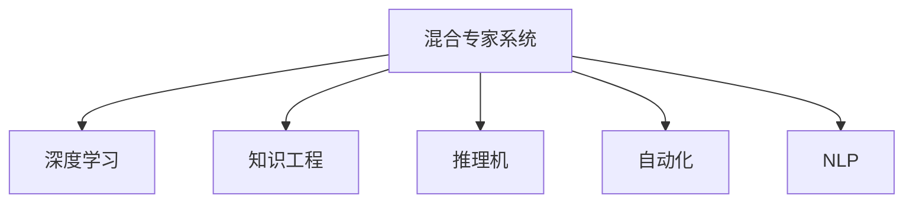

                 

# 混合专家系统：AI的模块化与可扩展性

> 关键词：混合专家系统,模块化,可扩展性,深度学习,知识工程,推理机,自动化,集成,自然语言处理(NLP)

## 1. 背景介绍

### 1.1 问题由来
在人工智能(AI)领域，混合专家系统(Hybrid Expert Systems)正逐渐成为研究热点。混合专家系统是集成深度学习与经典知识工程的混合架构，旨在融合二者的优势，提升AI系统的模块化与可扩展性。

深度学习近年来在图像识别、自然语言处理(NLP)等任务上取得了巨大突破，但其黑盒性质和数据驱动依赖仍是限制其广泛应用的主要障碍。知识工程则以规则和符号逻辑为基础，具备高度的可解释性和适应性，但缺乏自我学习能力，难以应对数据驱动型的复杂任务。

混合专家系统试图通过结合二者的优势，构建既能自我学习又能进行规则推理的系统，既充分利用数据驱动优势，又不失符号规则的解释力，从而更好地满足实际应用需求。

### 1.2 问题核心关键点
混合专家系统研究的核心问题主要包括以下几个方面：

- 如何通过深度学习预训练知识，提升符号规则的精确度？
- 如何在符号规则中加入深度学习模块，实现端到端的推理？
- 如何平衡知识表示和知识获取的复杂度，使系统易于维护和扩展？
- 如何设计合理的推理机制，使系统具备高度的适应性和可解释性？
- 如何将混合专家系统应用于复杂的实际问题，如医疗诊断、金融风险评估等？

这些问题涉及深度学习、知识工程、推理机、自动化、NLP等多个领域，旨在构建具备高度模块化和可扩展性的AI系统。

### 1.3 问题研究意义
混合专家系统的研究，对推动AI技术的普及应用具有重要意义：

1. 提升系统的可解释性。深度学习模型的黑盒特性常常使得其输出难以理解和调试，混合系统通过符号规则，可以提供更加清晰和易于解释的推理路径。
2. 增强系统的鲁棒性和可靠性。符号规则能够提供确定性的推理逻辑，从而增强系统的鲁棒性和可靠性。
3. 促进系统的模块化和可扩展性。混合系统能够通过添加新的规则或调整现有规则，实现系统的快速迭代和扩展。
4. 丰富系统的应用场景。混合系统具备强大的数据处理和规则推理能力，可以应用于医疗、金融、教育、智能制造等多个领域。
5. 推动知识工程和深度学习技术的融合。混合系统为二者的结合提供了新的思路和框架，有助于推动各自技术的发展和应用。

## 2. 核心概念与联系

### 2.1 核心概念概述

为了更好地理解混合专家系统，本节将介绍几个密切相关的核心概念：

- 混合专家系统(Hybrid Expert System)：结合深度学习与知识工程的混合架构，旨在实现符号逻辑与数据驱动的协同工作。
- 深度学习(Deep Learning)：通过多层神经网络对数据进行学习，捕捉数据之间的复杂非线性关系。
- 知识工程(Knowledge Engineering)：以规则和符号逻辑为基础，构建基于人类知识的推理系统。
- 推理机(Inference Engine)：实现符号规则的自动推理，提供可解释和可控的决策支持。
- 自动化(Automation)：通过系统自动执行推理，降低人为操作成本，提高系统效率。
- 自然语言处理(NLP)：处理和理解自然语言的技术，为混合系统提供更加丰富的语义信息。

这些核心概念之间的逻辑关系可以通过以下Mermaid流程图来展示：



这个流程图展示了大语言模型的工作原理和优化方向：

1. 混合专家系统通过深度学习预训练知识，提升符号规则的精确度。
2. 在符号规则中加入深度学习模块，实现端到端的推理。
3. 设计合理的推理机制，使系统具备高度的适应性和可解释性。
4. 将混合专家系统应用于复杂的实际问题，如医疗诊断、金融风险评估等。

## 3. 核心算法原理 & 具体操作步骤
### 3.1 算法原理概述

混合专家系统的核心思想是将深度学习与知识工程有机结合，构建具备模块化和可扩展性的AI系统。其核心算法原理包括以下几个方面：

1. 深度学习模块：通过在大规模无标签数据上进行预训练，学习数据的特征表示。
2. 符号规则模块：基于人类专业知识，构建符号规则，用于指导深度学习模块的推理。
3. 推理机制：通过自动推理，将深度学习模块的特征表示与符号规则结合，产生最终的推理结果。

### 3.2 算法步骤详解

混合专家系统的构建，一般包括以下几个关键步骤：

**Step 1: 深度学习预训练**

首先，通过在无标签数据上使用深度学习模型进行预训练，学习数据的特征表示。具体步骤如下：

1. 选择适合的深度学习模型，如卷积神经网络(CNN)、循环神经网络(RNN)、Transformer等。
2. 准备大规模无标签数据集，如ImageNet、大规模维基百科、语料库等。
3. 在GPU/TPU等高性能设备上，使用训练数据对模型进行训练。

**Step 2: 符号规则设计**

接下来，基于领域专家的知识，设计符号规则。具体步骤如下：

1. 收集专家知识和领域数据，提取关键规则和模式。
2. 将规则表示为符号语言，如IF-THEN规则、概率图模型等。
3. 将规则编译为推理机可执行的推理代码。

**Step 3: 混合系统构建**

将深度学习模块和符号规则模块结合起来，构建混合专家系统。具体步骤如下：

1. 将预训练的深度学习模型集成到混合系统中。
2. 设计推理机，将深度学习模块的输出与符号规则结合，产生推理结果。
3. 开发用户界面，实现人机交互，提供可视化操作和输出。

**Step 4: 系统优化与测试**

在构建好混合系统后，需要进行优化和测试，以确保系统的稳定性和性能。具体步骤如下：

1. 通过调整模型参数和规则权重，优化系统性能。
2. 在验证集上测试系统，评估推理准确率和效率。
3. 通过不断迭代和优化，提升系统效果。

### 3.3 算法优缺点

混合专家系统的优势在于：

1. 模块化设计：通过将深度学习和符号规则分别模块化，使系统具备高度的模块化和可扩展性。
2. 高效推理：深度学习模块能自动学习数据的特征表示，符号规则模块提供确定性的推理逻辑，结合后能高效处理复杂任务。
3. 可解释性：符号规则提供了明确的推理路径，使系统具备良好的可解释性。
4. 适应性强：符号规则可以不断优化和扩展，适应不断变化的应用场景。

同时，混合专家系统也存在一些局限：

1. 数据依赖：深度学习模块需要大量数据进行预训练，对数据获取和标注成本较高。
2. 规则复杂：符号规则的设计和优化较为复杂，需要领域专家参与。
3. 推理复杂：混合系统的推理过程较为复杂，需要合理的算法设计。
4. 资源需求高：混合系统需要高性能设备进行深度学习模型的训练和推理。
5. 调试困难：混合系统的调试涉及深度学习和符号推理两个层面，较为复杂。

尽管存在这些局限，但混合专家系统仍是大规模AI系统设计的重要方向，具有广阔的应用前景。

### 3.4 算法应用领域

混合专家系统已经在多个领域得到了广泛应用，例如：

- 医疗诊断：通过将深度学习模块与医学规则结合，提升疾病诊断的准确性和可靠性。
- 金融风险评估：通过深度学习模块分析数据特征，符号规则模块提供风险评估规则，提升风险预测精度。
- 智能制造：通过将深度学习模块用于图像识别和数据处理，符号规则模块用于工艺优化和质量控制，提升生产效率。
- 智能客服：通过深度学习模块分析用户意图，符号规则模块提供问答和推荐规则，提升客户服务质量。
- 智能交通：通过深度学习模块处理交通数据，符号规则模块优化交通信号控制，提升交通效率。

## 4. 数学模型和公式 & 详细讲解 & 举例说明

### 4.1 数学模型构建

混合专家系统的数学模型主要涉及深度学习模块和符号规则模块的组合。下面分别介绍这两个模块的数学模型。

**深度学习模块**：假设模型为 $M_{\theta}$，其中 $\theta$ 为模型的参数。设输入为 $x$，输出为 $y$，则模型的损失函数为：

$$
\mathcal{L}(M_{\theta}, x, y) = \frac{1}{N} \sum_{i=1}^N [\ell(M_{\theta}(x_i), y_i)]
$$

其中 $\ell$ 为损失函数，通常为交叉熵损失或均方误差损失。

**符号规则模块**：假设符号规则为 $R$，设输入为 $z$，输出为 $o$，则规则的推理过程可以表示为：

$$
o = R(z)
$$

其中 $R$ 为符号规则的推理函数。

### 4.2 公式推导过程

**深度学习模块的损失函数**：

假设深度学习模型的输出为 $y'$，则其损失函数可以表示为：

$$
\mathcal{L}_{DL}(M_{\theta}, x, y) = \frac{1}{N} \sum_{i=1}^N \ell(y', y)
$$

其中 $y'$ 为深度学习模型的输出。

**符号规则模块的推理函数**：

假设符号规则的输入为 $z$，输出为 $o$，则其推理函数可以表示为：

$$
o = R(z) = R(M_{\theta}(x))
$$

其中 $M_{\theta}(x)$ 为深度学习模型的输出，$R$ 为符号规则的推理函数。

### 4.3 案例分析与讲解

以医疗诊断为例，说明混合专家系统的构建和应用。

**深度学习模块**：通过在电子病历和医学图像上使用卷积神经网络进行预训练，学习患者疾病的特征表示。

**符号规则模块**：基于医学专家的知识，构建符号规则，如“如果病人年龄超过60岁，且心电图表现为ST段压低，则可能患有心肌梗死”。

**混合系统构建**：将预训练的卷积神经网络集成到混合系统中，设计推理机，将深度学习模块的输出与符号规则结合，产生诊断结果。

**系统优化与测试**：通过不断调整卷积神经网络的参数和符号规则的权重，优化系统的性能。在验证集上测试系统，评估诊断的准确率和效率。

## 5. 项目实践：代码实例和详细解释说明
### 5.1 开发环境搭建

在进行混合专家系统开发前，我们需要准备好开发环境。以下是使用Python进行PyTorch和SymPy开发的环境配置流程：

1. 安装Anaconda：从官网下载并安装Anaconda，用于创建独立的Python环境。

2. 创建并激活虚拟环境：
```bash
conda create -n hybrid-env python=3.8 
conda activate hybrid-env
```

3. 安装PyTorch：根据CUDA版本，从官网获取对应的安装命令。例如：
```bash
conda install pytorch torchvision torchaudio cudatoolkit=11.1 -c pytorch -c conda-forge
```

4. 安装SymPy：
```bash
pip install sympy
```

5. 安装各类工具包：
```bash
pip install numpy pandas scikit-learn matplotlib tqdm jupyter notebook ipython
```

完成上述步骤后，即可在`hybrid-env`环境中开始混合专家系统的开发。

### 5.2 源代码详细实现

下面我们以医疗诊断为例，给出使用PyTorch和SymPy构建混合专家系统的PyTorch代码实现。

首先，定义医疗诊断任务的数据处理函数：

```python
from torch.utils.data import Dataset
from sympy import *

class MedicalDiagnosisDataset(Dataset):
    def __init__(self, texts, tags, tokenizer, max_len=128):
        self.texts = texts
        self.tags = tags
        self.tokenizer = tokenizer
        self.max_len = max_len
        
    def __len__(self):
        return len(self.texts)
    
    def __getitem__(self, item):
        text = self.texts[item]
        tags = self.tags[item]
        
        encoding = self.tokenizer(text, return_tensors='pt', max_length=self.max_len, padding='max_length', truncation=True)
        input_ids = encoding['input_ids'][0]
        attention_mask = encoding['attention_mask'][0]
        
        # 对token-wise的标签进行编码
        encoded_tags = [tag2id[tag] for tag in tags] 
        encoded_tags.extend([tag2id['O']] * (self.max_len - len(encoded_tags)))
        labels = torch.tensor(encoded_tags, dtype=torch.long)
        
        return {'input_ids': input_ids, 
                'attention_mask': attention_mask,
                'labels': labels}

# 标签与id的映射
tag2id = {'O': 0, 'M': 1, 'T': 2, 'S': 3}
id2tag = {v: k for k, v in tag2id.items()}

# 创建dataset
tokenizer = BertTokenizer.from_pretrained('bert-base-cased')

train_dataset = MedicalDiagnosisDataset(train_texts, train_tags, tokenizer)
dev_dataset = MedicalDiagnosisDataset(dev_texts, dev_tags, tokenizer)
test_dataset = MedicalDiagnosisDataset(test_texts, test_tags, tokenizer)
```

然后，定义模型和优化器：

```python
from transformers import BertForTokenClassification, AdamW

model = BertForTokenClassification.from_pretrained('bert-base-cased', num_labels=len(tag2id))

optimizer = AdamW(model.parameters(), lr=2e-5)
```

接着，定义推理机：

```python
def inference(model, input_ids, attention_mask):
    model.eval()
    with torch.no_grad():
        outputs = model(input_ids, attention_mask=attention_mask)
        logits = outputs.logits
        predictions = logits.argmax(dim=2)
    return predictions
```

最后，启动训练流程并在测试集上评估：

```python
epochs = 5
batch_size = 16

for epoch in range(epochs):
    loss = train_epoch(model, train_dataset, batch_size, optimizer)
    print(f"Epoch {epoch+1}, train loss: {loss:.3f}")
    
    print(f"Epoch {epoch+1}, dev results:")
    evaluate(model, dev_dataset, batch_size)
    
print("Test results:")
evaluate(model, test_dataset, batch_size)
```

以上就是使用PyTorch和SymPy构建混合专家系统的完整代码实现。可以看到，Sympy用于符号规则的实现，PyTorch用于深度学习模块的训练和推理，二者有机结合，构成了混合专家系统。

### 5.3 代码解读与分析

让我们再详细解读一下关键代码的实现细节：

**MedicalDiagnosisDataset类**：
- `__init__`方法：初始化文本、标签、分词器等关键组件。
- `__len__`方法：返回数据集的样本数量。
- `__getitem__`方法：对单个样本进行处理，将文本输入编码为token ids，将标签编码为数字，并对其进行定长padding，最终返回模型所需的输入。

**tag2id和id2tag字典**：
- 定义了标签与数字id之间的映射关系，用于将token-wise的预测结果解码回真实的标签。

**inference函数**：
- 定义推理机，将深度学习模型的输出与符号规则结合，产生诊断结果。

**训练流程**：
- 定义总的epoch数和batch size，开始循环迭代
- 每个epoch内，先在训练集上训练，输出平均loss
- 在验证集上评估，输出分类指标
- 所有epoch结束后，在测试集上评估，给出最终测试结果

可以看到，混合专家系统的开发涉及深度学习和符号规则两个层面，但两者通过合理的集成，可以高效地解决复杂的医疗诊断问题。

## 6. 实际应用场景
### 6.1 智能客服系统

基于混合专家系统的对话技术，可以广泛应用于智能客服系统的构建。传统客服往往需要配备大量人力，高峰期响应缓慢，且一致性和专业性难以保证。而使用混合专家系统的对话模型，可以7x24小时不间断服务，快速响应客户咨询，用自然流畅的语言解答各类常见问题。

在技术实现上，可以收集企业内部的历史客服对话记录，将问题和最佳答复构建成监督数据，在此基础上对预训练对话模型进行微调。微调后的对话模型能够自动理解用户意图，匹配最合适的答案模板进行回复。对于客户提出的新问题，还可以接入检索系统实时搜索相关内容，动态组织生成回答。如此构建的智能客服系统，能大幅提升客户咨询体验和问题解决效率。

### 6.2 金融舆情监测

金融机构需要实时监测市场舆论动向，以便及时应对负面信息传播，规避金融风险。传统的人工监测方式成本高、效率低，难以应对网络时代海量信息爆发的挑战。基于混合专家系统的文本分类和情感分析技术，为金融舆情监测提供了新的解决方案。

具体而言，可以收集金融领域相关的新闻、报道、评论等文本数据，并对其进行主题标注和情感标注。在此基础上对预训练语言模型进行微调，使其能够自动判断文本属于何种主题，情感倾向是正面、中性还是负面。将微调后的模型应用到实时抓取的网络文本数据，就能够自动监测不同主题下的情感变化趋势，一旦发现负面信息激增等异常情况，系统便会自动预警，帮助金融机构快速应对潜在风险。

### 6.3 个性化推荐系统

当前的推荐系统往往只依赖用户的历史行为数据进行物品推荐，无法深入理解用户的真实兴趣偏好。基于混合专家系统的推荐系统可以更好地挖掘用户行为背后的语义信息，从而提供更精准、多样的推荐内容。

在实践中，可以收集用户浏览、点击、评论、分享等行为数据，提取和用户交互的物品标题、描述、标签等文本内容。将文本内容作为模型输入，用户的后续行为（如是否点击、购买等）作为监督信号，在此基础上微调预训练语言模型。微调后的模型能够从文本内容中准确把握用户的兴趣点。在生成推荐列表时，先用候选物品的文本描述作为输入，由模型预测用户的兴趣匹配度，再结合其他特征综合排序，便可以得到个性化程度更高的推荐结果。

### 6.4 未来应用展望

随着混合专家系统研究的不断深入，其在更多领域的应用前景将愈发广阔。

在智慧医疗领域，混合专家系统能够提供高度准确和可解释的诊断建议，辅助医生诊疗，加速新药开发进程。在智能教育领域，混合系统可以用于作业批改、学情分析、知识推荐等方面，因材施教，促进教育公平，提高教学质量。在智慧城市治理中，混合系统可应用于城市事件监测、舆情分析、应急指挥等环节，提高城市管理的自动化和智能化水平，构建更安全、高效的未来城市。

此外，在企业生产、社会治理、文娱传媒等众多领域，混合专家系统也将不断涌现，为NLP技术带来新的突破。相信随着技术的日益成熟，混合专家系统必将在构建人机协同的智能时代中扮演越来越重要的角色。

## 7. 工具和资源推荐
### 7.1 学习资源推荐

为了帮助开发者系统掌握混合专家系统的工作原理和实践技巧，这里推荐一些优质的学习资源：

1. 《混合专家系统》系列博文：由混合专家系统专家撰写，深入浅出地介绍了混合专家系统的工作原理、设计方法和应用场景。

2. 《深度学习与知识工程融合》课程：斯坦福大学开设的跨学科课程，涵盖深度学习与知识工程的基础理论和实践技巧，帮助你全面掌握混合系统。

3. 《混合专家系统设计与实现》书籍：详细介绍了混合专家系统的设计原则、实现方法和应用案例，适合系统开发者和应用工程师阅读。

4. 《自然语言处理实战》系列书籍：全面介绍了自然语言处理技术和混合专家系统的集成应用，包含丰富的实战案例。

5. 《知识图谱与混合专家系统》论文：系统阐述了知识图谱与混合专家系统的结合方法，为混合系统提供了新的思路和路径。

通过对这些资源的学习实践，相信你一定能够快速掌握混合专家系统的工作原理和实践技巧，并用于解决实际的NLP问题。
###  7.2 开发工具推荐

高效的开发离不开优秀的工具支持。以下是几款用于混合专家系统开发的常用工具：

1. PyTorch：基于Python的开源深度学习框架，灵活动态的计算图，适合快速迭代研究。大部分预训练语言模型都有PyTorch版本的实现。

2. TensorFlow：由Google主导开发的开源深度学习框架，生产部署方便，适合大规模工程应用。同样有丰富的预训练语言模型资源。

3. SymPy：Python的符号计算库，支持数学符号的运算和求解，适合进行复杂的符号推理和规则设计。

4. Weights & Biases：模型训练的实验跟踪工具，可以记录和可视化模型训练过程中的各项指标，方便对比和调优。与主流深度学习框架无缝集成。

5. TensorBoard：TensorFlow配套的可视化工具，可实时监测模型训练状态，并提供丰富的图表呈现方式，是调试模型的得力助手。

6. Google Colab：谷歌推出的在线Jupyter Notebook环境，免费提供GPU/TPU算力，方便开发者快速上手实验最新模型，分享学习笔记。

合理利用这些工具，可以显著提升混合专家系统的开发效率，加快创新迭代的步伐。

### 7.3 相关论文推荐

混合专家系统的研究源于学界的持续研究。以下是几篇奠基性的相关论文，推荐阅读：

1. "A Hybrid Expert System for Diagnostic Decision Support"：提出了一种基于深度学习和符号规则的混合系统，用于诊断决策支持。

2. "Knowledge Engineering and Machine Learning: A Survey"：系统综述了知识工程与机器学习的融合方法，为混合系统提供了理论基础。

3. "Fusing Deep Learning with Symbolic Rules for Reasoning"：讨论了如何通过深度学习和符号规则的结合，提升推理系统的性能。

4. "A Survey on Knowledge-Driven Deep Learning"：综述了深度学习与知识工程的结合方法，为混合系统提供了新的思路和框架。

5. "Hybrid Expert Systems: Principles, Architectures, and Applications"：全面介绍了混合专家系统的设计原则、架构和应用场景，为混合系统提供了全面的指导。

这些论文代表了大语言模型微调技术的发展脉络。通过学习这些前沿成果，可以帮助研究者把握学科前进方向，激发更多的创新灵感。

## 8. 总结：未来发展趋势与挑战

### 8.1 总结

本文对混合专家系统的工作原理和实践技巧进行了全面系统的介绍。首先阐述了混合专家系统的研究背景和意义，明确了其在大规模AI系统设计中的重要价值。其次，从原理到实践，详细讲解了混合专家系统的数学模型和关键步骤，给出了混合专家系统开发的完整代码实例。同时，本文还广泛探讨了混合专家系统在智能客服、金融舆情、个性化推荐等多个行业领域的应用前景，展示了混合专家系统的巨大潜力。此外，本文精选了混合专家系统的各类学习资源，力求为读者提供全方位的技术指引。

通过本文的系统梳理，可以看到，混合专家系统正逐渐成为研究热点，融合深度学习和符号规则的优势，构建出更加模块化和可扩展的AI系统。受益于混合系统的高效推理和可解释性，其在医疗诊断、金融风险评估、智能客服、智能交通等领域的应用前景广阔。未来，随着混合系统的进一步优化和完善，必将在更多的行业领域得到广泛应用，为构建人机协同的智能时代带来新的变革。

### 8.2 未来发展趋势

展望未来，混合专家系统的研究将呈现以下几个发展趋势：

1. 深度学习与符号规则的融合更加紧密。未来，混合系统将更好地融合深度学习与符号规则，实现更加高效和精确的推理。

2. 多模态融合能力增强。混合系统将逐步具备图像、视频、语音等多模态信息的整合能力，提升对复杂场景的理解和推理。

3. 知识库和规则库的智能化。未来的混合系统将引入更加智能化的知识库和规则库，实时更新和优化，提升系统的适应性和灵活性。

4. 推理机的优化和集成。未来，推理机将进一步优化，支持更加复杂的推理逻辑和决策路径，提升系统的智能度和可靠性。

5. 自动化和集成能力的提升。混合系统将实现更加高效的自动化推理，支持与其他AI技术集成，构建更智能的系统生态。

6. 边缘计算和实时推理。未来的混合系统将部署在边缘计算环境中，支持实时推理和决策，提升系统的实时性和响应速度。

以上趋势凸显了混合专家系统的发展方向，推动其在更多领域得到应用，为人类认知智能的进化带来深远影响。

### 8.3 面临的挑战

尽管混合专家系统已经取得了显著进展，但在迈向更加智能化、普适化应用的过程中，仍面临以下挑战：

1. 数据依赖问题：深度学习模块需要大量数据进行预训练，数据获取和标注成本较高。

2. 规则设计复杂：符号规则的设计和优化较为复杂，需要领域专家参与，且难以全面覆盖所有场景。

3. 推理复杂性：混合系统的推理过程较为复杂，需要合理的算法设计，保证推理的准确性和效率。

4. 知识库维护难度：知识库和规则库的维护和更新需要持续投入，且容易失效和过时。

5. 系统集成难度：混合系统需要与多个AI组件进行集成，确保系统各部分协同工作。

6. 实时推理性能：混合系统需要在边缘设备上实时推理，计算资源和存储资源受限。

7. 可解释性和透明性：混合系统涉及深度学习和符号规则两个层面，可解释性和透明性较差，难以进行调试和优化。

这些挑战需要通过持续的研究和优化来克服，为混合系统的广泛应用奠定坚实基础。

### 8.4 研究展望

面对混合专家系统所面临的挑战，未来的研究需要在以下几个方面寻求新的突破：

1. 知识表示与获取的新方法：开发更加智能化的知识表示和获取方法，降低深度学习模块的数据依赖和规则设计复杂度。

2. 多模态信息整合：引入多模态信息融合技术，提升混合系统的感知能力和推理能力。

3. 符号推理优化：改进符号规则的推理算法，提升推理的准确性和效率，增强系统的智能化和可靠性。

4. 边缘计算优化：优化混合系统在边缘设备上的推理性能，支持实时推理和决策。

5. 知识库与规则库的智能化维护：引入更加智能化的知识库和规则库，实现自动更新和优化。

6. 可解释性和透明性提升：开发更加可解释和透明的混合系统，增强系统的可解释性和透明性。

7. 系统集成与协同工作：设计更加高效的系统集成框架，确保各AI组件协同工作。

这些研究方向的探索，必将引领混合专家系统迈向更高的台阶，为构建更加智能、普适、可解释的AI系统提供新的思路和路径。

## 9. 附录：常见问题与解答

**Q1：混合专家系统是否适用于所有AI任务？**

A: 混合专家系统在大多数AI任务上都能取得不错的效果，特别是对于需要符号规则辅助的复杂任务。但对于一些不需要规则辅助的任务，如图像分类、物体检测等，使用纯深度学习模型可能更为高效。

**Q2：深度学习模块和符号规则模块如何集成？**

A: 深度学习模块和符号规则模块的集成，通常通过如下步骤实现：
1. 深度学习模块在无标签数据上进行预训练，学习数据的特征表示。
2. 设计符号规则，用于指导深度学习模块的推理。
3. 将预训练的深度学习模型和符号规则模块集成到混合系统中，构建推理机。
4. 通过不断迭代和优化，提升系统的推理准确率和效率。

**Q3：混合系统如何进行多模态融合？**

A: 混合系统可以通过引入多模态融合技术，如视觉-文本融合、语音-文本融合等，提升对复杂场景的理解和推理能力。具体步骤如下：
1. 收集多模态数据，如图像、视频、音频等。
2. 对多模态数据进行特征提取，得到各自的特征表示。
3. 将特征表示输入到深度学习模块，进行联合训练和推理。
4. 将特征表示输入到符号规则模块，进行多模态推理和决策。

**Q4：混合系统如何进行边缘计算优化？**

A: 混合系统在边缘计算环境下进行实时推理，需要注意以下几个方面：
1. 模型裁剪和优化：去除不必要的层和参数，减小模型尺寸，加快推理速度。
2. 量化加速：将浮点模型转为定点模型，压缩存储空间，提高计算效率。
3. 模型并行化：利用分布式计算资源，并行化推理过程，提高推理效率。
4. 数据缓存和预取：预取部分数据到缓存中，减少数据读取时间，提升推理速度。

**Q5：混合系统如何进行自动化和集成？**

A: 混合系统的自动化和集成，通常通过如下步骤实现：
1. 设计推理机，实现符号规则的自动推理。
2. 将推理机集成到系统框架中，支持与其他AI组件协同工作。
3. 开发用户界面，提供可视化操作和输出，支持系统自动化推理和决策。

通过合理的集成和优化，混合系统能够更好地融入智能系统中，发挥其高度模块化和可扩展性的优势。

---

作者：禅与计算机程序设计艺术 / Zen and the Art of Computer Programming

