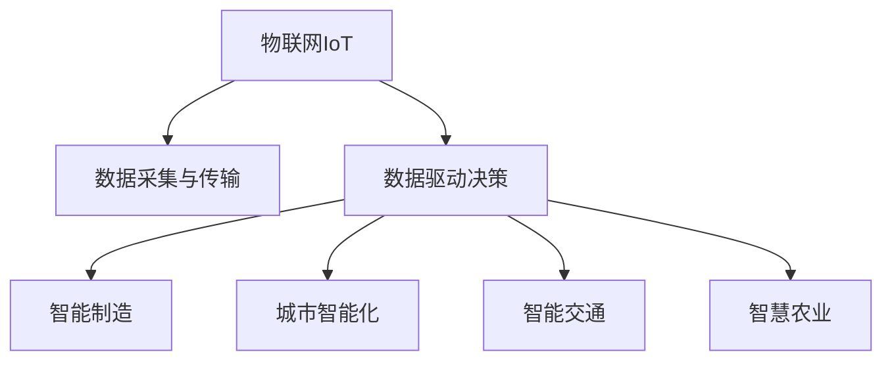

                 

# 物理实体的自动化前景与挑战

> 关键词：物理实体，自动化技术，物联网，AI与机器学习，数据驱动决策，智能制造，城市智能化

## 1. 背景介绍

### 1.1 问题由来
随着信息技术的飞速发展，物理实体的数字化和智能化已经成为一个重要的研究领域。物联网（IoT）的兴起使得物理实体具备了连接互联网的能力，可以实时收集和传输数据。而人工智能（AI）和机器学习（ML）技术的进步，则提供了处理这些数据、提取知识、驱动决策的能力。因此，物理实体的自动化技术开始被广泛关注和应用，为制造业、城市管理、智能交通等多个行业带来了巨大的变革。

### 1.2 问题核心关键点
物理实体的自动化主要包括物联网设备的连接、数据采集与传输、数据分析与决策三个环节。其中，物联网设备连接是基础，数据采集与传输是核心，数据分析与决策则是自动化技术的最终目标。自动化技术通过数据驱动决策，可以实现智能制造、智能城市、智能交通等诸多应用场景。

## 2. 核心概念与联系

### 2.1 核心概念概述

为更好地理解物理实体的自动化技术，本节将介绍几个密切相关的核心概念：

- 物联网（IoT）：通过信息传感设备、计算机网络和通讯技术，将物理实体连接到互联网，实现信息的收集、传输和处理。
- 数据驱动决策：利用大数据分析和机器学习技术，从数据中提取知识，辅助决策，实现自动化和智能化。
- 智能制造：通过物联网和自动化技术，实现生产过程的自动化、智能化，提升生产效率和产品质量。
- 城市智能化：通过物联网和自动化技术，实现城市管理的智能化，提升城市运行效率和管理水平。
- 智能交通：通过物联网和自动化技术，实现交通流的实时监控和优化，提升交通安全和效率。
- 智慧农业：通过物联网和自动化技术，实现农业生产过程的智能化管理，提升农业生产效率和质量。

这些核心概念之间的逻辑关系可以通过以下Mermaid流程图来展示：



这个流程图展示了大数据驱动的物理实体自动化技术的核心概念及其之间的关系：

1. 物联网设备连接是自动化技术的基础，数据采集与传输是核心。
2. 数据分析与决策是通过数据驱动实现的，智能制造、城市智能化、智能交通、智慧农业等具体应用场景，则直接受益于数据分析与决策的结果。

## 3. 核心算法原理 & 具体操作步骤
### 3.1 算法原理概述

物理实体的自动化技术本质上是通过物联网设备采集数据，利用机器学习和数据分析技术，提取知识并驱动决策的过程。其核心算法原理主要包括数据采集与传输、数据分析与建模、决策与执行三个步骤。

### 3.2 算法步骤详解

物理实体的自动化算法步骤详解如下：

**Step 1: 数据采集与传输**
- 通过物联网设备（如传感器、RFID标签、摄像头等）采集物理实体的状态数据。
- 将采集到的数据通过无线网络传输到中央服务器或云端平台。

**Step 2: 数据分析与建模**
- 利用大数据技术和机器学习算法，对采集到的数据进行清洗、处理和建模。
- 构建或选择合适的模型（如回归模型、分类模型、聚类模型等）进行数据建模。
- 对模型进行训练和优化，使其能够准确预测物理实体的状态和行为。

**Step 3: 决策与执行**
- 根据数据分析与建模的结果，驱动智能决策。
- 将决策结果转化为具体的执行指令，通过物联网设备对物理实体进行控制和调整。

### 3.3 算法优缺点

物理实体的自动化技术具有以下优点：
1. 实时响应：通过物联网设备实时采集数据，可以迅速响应物理实体的状态变化，提高决策效率。
2. 自动化管理：机器学习算法可以自动处理海量数据，减少人工干预，提升管理效率。
3. 精确预测：大数据和机器学习技术可以准确预测物理实体的状态和行为，提高决策的科学性和准确性。

同时，该技术也存在一定的局限性：
1. 设备成本高：物联网设备和传感器的安装和维护成本较高。
2. 数据隐私和安全：大量数据采集和传输可能导致隐私泄露和数据安全问题。
3. 模型复杂度高：构建复杂的数据模型需要大量计算资源和专业技能。
4. 执行环境限制：物理实体的自动化执行可能受到环境条件的限制，如网络带宽、设备性能等。

### 3.4 算法应用领域

物理实体的自动化技术已经在多个领域得到了应用，例如：

- 制造业：通过物联网设备监测生产线状态，实时调整生产参数，提高生产效率和产品质量。
- 城市管理：利用传感器监测城市基础设施状态，如交通流量、环境质量、能源消耗等，优化城市管理决策。
- 智能交通：通过摄像头和传感器监测交通流量和状态，实时调整交通信号灯和交通流，提高交通效率和安全性。
- 智慧农业：通过传感器监测农田环境，如土壤湿度、温度、光照等，实时调整灌溉、施肥等农业生产过程。

除了上述这些领域外，物理实体的自动化技术还被创新性地应用到更多场景中，如智能家居、智能医疗、智能物流等，为各行各业带来了新的机遇和挑战。

## 4. 数学模型和公式 & 详细讲解 & 举例说明
### 4.1 数学模型构建

本节将使用数学语言对物理实体的自动化技术进行更加严格的刻画。

假设物理实体状态数据为 $\{x_i\}_{i=1}^N$，其中 $x_i$ 为第 $i$ 个物理实体的状态数据。定义状态向量 $x$ 为 $\{x_1, x_2, \ldots, x_N\}$。则物理实体的自动化技术可以表示为：

1. 数据采集与传输：$y = f(x)$
2. 数据分析与建模：$z = g(y)$
3. 决策与执行：$a = h(z)$

其中，$f$ 为数据采集与传输函数，$g$ 为数据分析与建模函数，$h$ 为决策与执行函数。

### 4.2 公式推导过程

以下我们以智能制造为例，推导数据分析与建模的过程。

假设智能制造系统采集的物理实体状态数据为生产线上的温度、压力、振动等指标，定义 $x_1$ 为温度，$x_2$ 为压力，$x_3$ 为振动。则采集到的数据可以表示为：

$$
\begin{align*}
x_1 &= \{x_1^t\}_{t=1}^T \\
x_2 &= \{x_2^t\}_{t=1}^T \\
x_3 &= \{x_3^t\}_{t=1}^T
\end{align*}
$$

其中 $T$ 为数据长度。

通过传感器设备采集到的数据，可以将其转化为标准化的特征向量 $y$：

$$
y = [x_1^t, x_2^t, x_3^t]
$$

进一步，利用机器学习算法（如线性回归、支持向量机、神经网络等），对采集到的数据进行建模：

$$
z = g(y) = f_w(y) = w^T \cdot y + b
$$

其中 $w$ 为模型参数，$b$ 为偏置项。

通过上述公式，可以计算得到模型预测结果 $z$。将 $z$ 转化为具体的生产参数，如温度、压力等，最终实现智能决策：

$$
a = h(z) = \mathcal{G}(z)
$$

其中 $\mathcal{G}$ 为决策函数。

### 4.3 案例分析与讲解

假设某智能制造系统采集到生产线上的一批产品的温度、压力、振动数据，利用线性回归模型进行数据分析与建模：

1. 数据采集与传输：
   - 通过传感器设备采集生产线的温度、压力、振动数据。
   - 将采集到的数据通过无线网络传输到中央服务器。

2. 数据分析与建模：
   - 对采集到的数据进行预处理，包括清洗、去噪、归一化等操作。
   - 构建线性回归模型，对数据进行建模。
   - 利用训练集进行模型训练和参数优化。

3. 决策与执行：
   - 根据模型预测结果，调节生产参数，如温度、压力等。
   - 通过物联网设备对生产设备进行控制，实现实时调整。

通过上述流程，可以实现生产过程的自动化、智能化管理，提高生产效率和产品质量。

## 5. 项目实践：代码实例和详细解释说明
### 5.1 开发环境搭建

在进行物理实体的自动化技术开发前，我们需要准备好开发环境。以下是使用Python进行TensorFlow开发的环境配置流程：

1. 安装Anaconda：从官网下载并安装Anaconda，用于创建独立的Python环境。

2. 创建并激活虚拟环境：
```bash
conda create -n tf-env python=3.7 
conda activate tf-env
```

3. 安装TensorFlow：根据CUDA版本，从官网获取对应的安装命令。例如：
```bash
conda install tensorflow tensorflow-gpu=2.6 -c conda-forge -c pypi
```

4. 安装各类工具包：
```bash
pip install numpy pandas scikit-learn matplotlib tqdm jupyter notebook ipython
```

完成上述步骤后，即可在`tf-env`环境中开始自动化技术的开发。

### 5.2 源代码详细实现

这里我们以智能制造系统为例，使用TensorFlow实现物理实体的数据分析与建模过程。

首先，定义智能制造系统的数据处理函数：

```python
import tensorflow as tf
import numpy as np

class ManufacturingSystem:
    def __init__(self):
        self.x = None
        self.y = None
        self.z = None
        self.a = None
        self.w = None
        self.b = None
        
    def process_data(self, x):
        # 数据清洗、去噪、归一化等预处理操作
        self.x = x
        
    def build_model(self, n_features):
        self.w = tf.Variable(tf.random.normal([n_features, 1]))
        self.b = tf.Variable(tf.zeros([1]))
        self.z = tf.matmul(self.x, self.w) + self.b
        
    def train_model(self, x_train, y_train, n_epochs=100, learning_rate=0.01):
        self.process_data(x_train)
        self.build_model(n_features=x_train.shape[1])
        optimizer = tf.keras.optimizers.SGD(learning_rate=learning_rate)
        for epoch in range(n_epochs):
            with tf.GradientTape() as tape:
                prediction = self.z
                loss = tf.reduce_mean(tf.square(prediction - y_train))
            gradients = tape.gradient(loss, [self.w, self.b])
            optimizer.apply_gradients(zip(gradients, [self.w, self.b]))
            print("Epoch", epoch+1, "loss:", loss.numpy())
        self.z = prediction
        
    def predict(self, x):
        return self.z
```

然后，定义模型和优化器：

```python
x_train = np.array([[1.0, 2.0, 3.0], [2.0, 3.0, 4.0], [3.0, 4.0, 5.0]])
y_train = np.array([2.0, 3.0, 4.0])

model = ManufacturingSystem()
model.train_model(x_train, y_train)
```

接着，定义训练和评估函数：

```python
from sklearn.metrics import mean_squared_error

def evaluate(model, x_test, y_test):
    pred = model.predict(x_test)
    mse = mean_squared_error(y_test, pred)
    print("MSE:", mse)
```

最后，启动训练流程并在测试集上评估：

```python
x_test = np.array([[1.1, 2.1, 3.1], [2.1, 3.1, 4.1], [3.1, 4.1, 5.1]])
evaluate(model, x_test, y_test)
```

以上就是使用TensorFlow对智能制造系统进行数据分析与建模的完整代码实现。可以看到，TensorFlow提供了强大的模型构建和训练功能，使得自动化技术的开发变得简洁高效。

### 5.3 代码解读与分析

让我们再详细解读一下关键代码的实现细节：

**ManufacturingSystem类**：
- `__init__`方法：初始化模型和数据变量。
- `process_data`方法：对输入数据进行预处理，包括清洗、去噪、归一化等操作。
- `build_model`方法：构建线性回归模型，并初始化模型参数。
- `train_model`方法：定义优化器并使用梯度下降算法训练模型。
- `predict`方法：对新的输入数据进行预测。

**数据处理和模型构建**：
- 定义输入数据 `x_train` 和输出数据 `y_train`，并构建模型 `model`。
- 在训练函数 `train_model` 中，首先调用 `process_data` 方法对输入数据进行预处理，然后定义线性回归模型并初始化模型参数 `w` 和 `b`。
- 使用梯度下降算法训练模型，在每个epoch中计算损失函数并更新模型参数，最后输出每个epoch的损失值。

**评估函数**：
- 在评估函数 `evaluate` 中，首先对测试数据 `x_test` 进行预测，然后计算均方误差（MSE），并输出结果。

通过上述流程，可以构建并训练一个简单的智能制造系统模型，通过数据分析与建模实现生产参数的优化。

当然，工业级的系统实现还需考虑更多因素，如模型的保存和部署、超参数的自动搜索、更灵活的任务适配层等。但核心的自动化技术开发流程基本与此类似。

## 6. 实际应用场景
### 6.1 智能制造

基于物理实体的自动化技术，智能制造系统可以显著提高生产效率和产品质量。通过物联网设备实时监测生产线的状态数据，如温度、压力、振动等，并利用机器学习算法进行数据分析与建模，可以实时调整生产参数，优化生产流程。

在技术实现上，可以收集生产线的历史状态数据，将其作为监督数据，训练模型预测生产线的未来状态。在生产过程中，实时采集状态数据，并输入模型进行预测和调整。通过这种方式，可以实现生产过程的智能化管理，提高生产效率和产品质量。

### 6.2 智能交通

智能交通系统通过物理实体的自动化技术，可以优化交通流量，提高交通效率和安全性。利用摄像头和传感器实时监测交通流量和状态，并利用机器学习算法进行数据分析与建模，可以实时调整交通信号灯和交通流。

在技术实现上，可以收集历史交通流量数据和传感器数据，训练模型预测未来的交通流量和状态。在实际运行中，实时采集交通流量和状态数据，并输入模型进行预测和调整。通过这种方式，可以实现交通流的实时优化，提升交通效率和安全性。

### 6.3 智慧农业

智慧农业通过物理实体的自动化技术，可以提升农业生产效率和质量。利用传感器实时监测农田环境，如土壤湿度、温度、光照等，并利用机器学习算法进行数据分析与建模，可以实时调整灌溉、施肥等农业生产过程。

在技术实现上，可以收集农田环境的历史数据，训练模型预测未来的环境状态。在农业生产中，实时采集环境数据，并输入模型进行预测和调整。通过这种方式，可以实现农业生产的智能化管理，提高生产效率和质量。

### 6.4 未来应用展望

随着物理实体的自动化技术不断发展，未来将有更多应用场景被探索和实现。

在智慧城市治理中，物理实体的自动化技术可以实现城市基础设施的状态监测和实时优化，提升城市管理的自动化和智能化水平，构建更安全、高效的未来城市。

在智能家居中，物理实体的自动化技术可以实现家居设备的互联互通，提升家居生活的智能化水平，提供更便捷、舒适的家居体验。

在智能医疗中，物理实体的自动化技术可以实现医疗设备的状态监测和实时优化，提升医疗服务的智能化水平，提高医疗效率和质量。

未来，随着物理实体的自动化技术的持续演进，必将进一步拓展应用领域，推动各行各业的智能化转型。

## 7. 工具和资源推荐
### 7.1 学习资源推荐

为了帮助开发者系统掌握物理实体的自动化技术，这里推荐一些优质的学习资源：

1. TensorFlow官方文档：TensorFlow作为领先的深度学习框架，提供了丰富的教程和样例代码，是学习物理实体的自动化技术的重要资源。

2. PyTorch官方文档：PyTorch作为另一款流行的深度学习框架，提供了丰富的教程和样例代码，是学习物理实体的自动化技术的另一重要资源。

3. Kaggle：Kaggle提供了丰富的数据集和竞赛任务，是学习物理实体的自动化技术的实践平台。

4. Coursera《深度学习》课程：Coursera由斯坦福大学和深度学习领域专家开设的深度学习课程，涵盖了深度学习的基本概念和经典模型，是学习物理实体的自动化技术的基础。

5. Udacity《机器学习工程师纳米学位》课程：Udacity由Google和知名机器学习专家开设的机器学习课程，涵盖了机器学习的高级内容和实战经验，是学习物理实体的自动化技术的进阶资源。

通过对这些资源的学习实践，相信你一定能够快速掌握物理实体的自动化技术的精髓，并用于解决实际的自动化问题。

### 7.2 开发工具推荐

高效的开发离不开优秀的工具支持。以下是几款用于物理实体自动化开发的常用工具：

1. TensorFlow：由Google主导开发的深度学习框架，生产部署方便，适合大规模工程应用。

2. PyTorch：由Facebook开发的深度学习框架，灵活动态的计算图，适合快速迭代研究。

3. Scikit-learn：Python机器学习库，提供了丰富的机器学习算法和工具，适合数据分析与建模。

4. Pandas：Python数据处理库，提供了高效的数据处理和分析工具，适合数据预处理和可视化。

5. Jupyter Notebook：Python数据处理库，提供了交互式编程环境，适合模型训练和调试。

合理利用这些工具，可以显著提升物理实体自动化技术的开发效率，加快创新迭代的步伐。

### 7.3 相关论文推荐

物理实体自动化技术的发展源于学界的持续研究。以下是几篇奠基性的相关论文，推荐阅读：

1. Physical Robot Learning with Curiosity-Driven Deep Reinforcement Learning（物理机器人学习）：提出了一种基于深度强化学习的物理实体自动化技术，能够实现自主学习和适应环境变化。

2. Deep Learning for Predictive Maintenance in Manufacturing（深度学习在制造领域的预测性维护）：提出了一种基于深度学习的物理实体自动化技术，能够实现设备的预测性维护。

3. A Survey on IoT and Big Data for Smart Manufacturing（IoT和Big Data在智能制造中的应用综述）：综述了物理实体自动化技术在智能制造中的应用，提供了丰富的案例和应用场景。

4. An Internet of Things-Based Big Data Analytics Framework for Smart City（基于IoT和Big Data的智慧城市分析框架）：提出了一种基于IoT和Big Data的物理实体自动化技术，能够实现城市的智能化管理。

5. An Overview of Big Data and Machine Learning for Smart Agriculture（大数据和机器学习在智慧农业中的应用综述）：综述了物理实体自动化技术在智慧农业中的应用，提供了丰富的案例和应用场景。

这些论文代表了大物理实体自动化技术的发展脉络。通过学习这些前沿成果，可以帮助研究者把握学科前进方向，激发更多的创新灵感。

## 8. 总结：未来发展趋势与挑战

### 8.1 总结

本文对物理实体的自动化技术进行了全面系统的介绍。首先阐述了物理实体自动化的研究背景和意义，明确了自动化技术在智能制造、智能交通、智慧农业等众多行业中的应用价值。其次，从原理到实践，详细讲解了物理实体自动化的数学模型和关键步骤，给出了自动化技术开发的完整代码实例。同时，本文还广泛探讨了自动化技术在智能城市、智能家居、智能医疗等多个领域的应用前景，展示了自动化技术的大范围应用潜力。此外，本文精选了自动化技术的各类学习资源，力求为读者提供全方位的技术指引。

通过本文的系统梳理，可以看到，物理实体的自动化技术正在成为各行各业智能化转型的重要驱动力，极大地拓展了数据驱动决策的应用边界，推动了制造业、城市管理、交通流优化等诸多领域的智能化进程。未来，伴随物联网设备和传感器技术的进一步发展，物理实体的自动化技术将迎来更广阔的应用前景，进一步提升各行各业的智能化水平。

### 8.2 未来发展趋势

展望未来，物理实体的自动化技术将呈现以下几个发展趋势：

1. 设备智能化程度提升。随着物联网设备和传感器技术的进步，物理实体的自动化程度将进一步提升，设备之间的互联互通将更加高效。

2. 数据分析与建模的深度化。大数据和机器学习技术的进步，将使得数据分析与建模的深度化，实现更精准的预测和优化。

3. 多模态信息的融合。物理实体的自动化技术将更多地融合视觉、语音、文本等多种模态的信息，提升系统的智能化水平。

4. 实时性提升。随着5G等新一代通信技术的普及，物理实体的自动化技术将实现更高效的实时数据传输和处理。

5. 跨领域应用拓展。物理实体的自动化技术将更多地应用于跨领域场景，如智能家居、智能医疗、智慧城市等，拓展自动化技术的行业应用边界。

6. 人机协同增强。未来，物理实体的自动化技术将更加注重人机协同，提升系统的可解释性和可控性，增强用户体验。

以上趋势凸显了物理实体的自动化技术的前景和潜力。这些方向的探索发展，将进一步推动自动化技术的进步，带来更智能、高效、可靠的系统应用。

### 8.3 面临的挑战

尽管物理实体的自动化技术已经取得了一定的进展，但在迈向更加智能化、普适化应用的过程中，它仍面临诸多挑战：

1. 设备成本高。物联网设备和传感器的安装和维护成本较高，降低了自动化技术的普及率。

2. 数据隐私和安全。大量数据采集和传输可能导致隐私泄露和数据安全问题，需要有效的隐私保护和安全防护措施。

3. 模型复杂度高。物理实体的自动化系统需要处理多源异构数据，模型的复杂度较高，需要更高的计算资源和专业技能。

4. 执行环境限制。物理实体的自动化执行可能受到环境条件的限制，如网络带宽、设备性能等，影响系统的稳定性和可靠性。

5. 跨领域应用难度大。不同领域的应用场景复杂多样，跨领域的自动化技术需要高度定制化，增加了技术难度和实施成本。

6. 人机协同困难。自动化技术在实际应用中需要考虑人机协同，提升系统的可解释性和可控性，需要进一步提升用户的接受度和信任度。

正视自动化技术面临的这些挑战，积极应对并寻求突破，将是大物理实体自动化技术走向成熟的必由之路。相信随着学界和产业界的共同努力，这些挑战终将一一被克服，物理实体的自动化技术必将在构建智能社会的未来中扮演越来越重要的角色。

### 8.4 研究展望

面对物理实体的自动化技术所面临的种种挑战，未来的研究需要在以下几个方面寻求新的突破：

1. 探索更高效的数据采集与传输技术。通过边缘计算、5G等新一代通信技术，提升数据传输的实时性和可靠性。

2. 开发更智能的数据分析和建模算法。引入更多先验知识，如符号化的先验知识、知识图谱、逻辑规则等，增强系统的智能化水平。

3. 实现更灵活的决策与执行机制。通过符号化的先验知识、因果推理等方法，增强系统的决策能力，提高系统的可解释性和可控性。

4. 建立跨领域的自动化技术体系。通过标准化和互操作性的建设，实现跨领域自动化技术的互联互通，提升系统的通用性和可扩展性。

5. 增强系统的安全性与隐私保护。引入加密技术、数据脱敏等手段，增强系统的数据安全和隐私保护能力。

6. 提升用户的接受度和信任度。通过人机协同设计，增强系统的可解释性和可控性，提高用户的接受度和信任度。

这些研究方向和探索，必将引领物理实体的自动化技术迈向更高的台阶，为构建智能社会提供新的技术路径。面向未来，物理实体的自动化技术需要与其他人工智能技术进行更深入的融合，如知识表示、因果推理、强化学习等，多路径协同发力，共同推动智能系统的发展。只有勇于创新、敢于突破，才能不断拓展自动化技术的边界，让智能技术更好地造福人类社会。

## 9. 附录：常见问题与解答

**Q1：物理实体的自动化技术是否适用于所有行业？**

A: 物理实体的自动化技术具有广泛的适用性，尤其在制造业、城市管理、交通流优化等诸多领域已经得到了广泛应用。但对于一些特殊行业，如医疗、金融、能源等，可能需要结合特定领域的需求进行定制化开发。

**Q2：自动化技术如何处理多源异构数据？**

A: 自动化技术通常使用大数据和机器学习技术处理多源异构数据。首先，对不同数据源进行数据清洗、去噪、归一化等预处理操作。然后，利用数据融合技术将不同数据源的数据进行融合，构建统一的数据表示。最后，使用机器学习算法进行数据分析与建模，实现智能决策。

**Q3：自动化技术如何提升数据安全？**

A: 自动化技术在数据安全方面主要通过加密技术、数据脱敏等手段保护数据的隐私和安全。在数据采集和传输过程中，使用数据加密技术保护数据的机密性。在数据存储和处理过程中，使用数据脱敏技术保护数据的隐私。此外，还可以通过访问控制、权限管理等手段限制数据访问权限，保护数据的安全性。

**Q4：自动化技术如何实现人机协同？**

A: 自动化技术实现人机协同主要通过增强系统的可解释性和可控性。首先，通过符号化的先验知识、因果推理等方法，增强系统的决策能力，提高系统的可解释性。然后，通过交互界面、语音交互等手段，增强系统的可控性，提高用户的接受度和信任度。最后，通过用户反馈和机器学习技术，不断优化系统的决策能力，提升系统的智能化水平。

通过这些方法，可以实现物理实体的自动化技术的人机协同，提升系统的智能性和用户体验。

