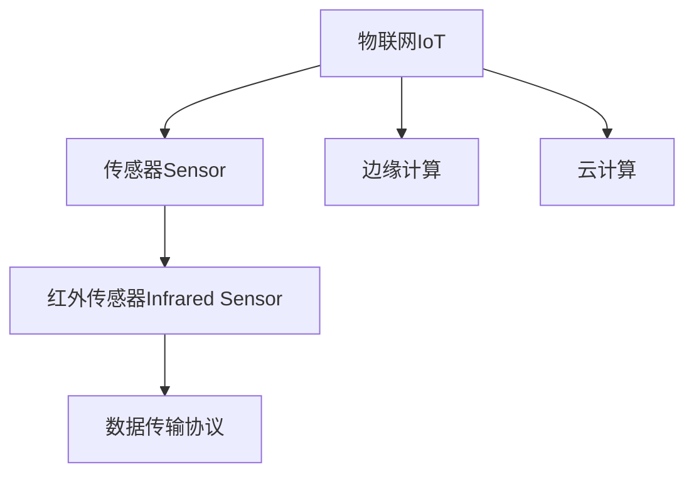

                 

# 物联网(IoT)技术和各种传感器设备的集成：红外传感器在IoT中的价值

> 关键词：物联网, 传感器, 红外传感器, 集成, 应用场景

## 1. 背景介绍

### 1.1 问题由来
物联网(IoT)技术的迅猛发展，正在改变着我们的生活方式和工作方式。越来越多的设备被连接到互联网，收集和交换数据，形成了庞大的智能生态系统。这些设备通过传感器获取环境信息，并实时传送到云端进行处理，从而实现了对物理世界的全面感知。

其中，红外传感器作为常用传感器之一，广泛应用于温度测量、红外遥感、人体检测、防盗报警等领域。然而，由于红外传感器的复杂性，其在IoT系统中的集成和应用常常面临一些挑战。本文将详细探讨红外传感器在IoT中的集成策略，以及其在实际应用中的价值和挑战。

### 1.2 问题核心关键点
红外传感器在IoT系统中的应用主要围绕以下几个关键点展开：

1. 传感器数据采集：获取精准、稳定的红外信号，作为数据分析的基础。
2. 数据传输与处理：将红外信号转换为数字信号，并在云端进行高效处理。
3. 系统集成与优化：将红外传感器集成到IoT系统中，并实现与其它传感器、设备的无缝协作。
4. 应用场景探索：在温度控制、人体检测、安防监控等场景中，探索红外传感器的最优应用方式。

## 2. 核心概念与联系

### 2.1 核心概念概述

为更好地理解红外传感器在IoT系统中的应用，本节将介绍几个密切相关的核心概念：

- **物联网(IoT)**：指将各种物理设备通过互联网连接起来，实现数据共享和协同工作的智能系统。
- **传感器(Sensor)**：指能够感知外部环境信息，并将其转换为可处理信号的器件。
- **红外传感器(Infrared Sensor)**：利用红外辐射原理，感知温度、热分布等环境信息的传感器。
- **数据传输协议**：如Wi-Fi、蓝牙、Zigbee等，用于在设备之间传输数据的协议。
- **边缘计算**：指在传感器节点或边缘服务器上进行数据预处理和分析，减少数据传输量的计算方式。
- **云计算**：指在云服务器上进行大规模数据分析和计算，实现大规模数据存储和处理。

这些概念之间的逻辑关系可以通过以下Mermaid流程图来展示：



这个流程图展示了几者之间的关系：

1. 物联网是传感器和红外传感器集成和应用的基础。
2. 红外传感器作为重要传感器，用于感知环境信息。
3. 数据传输协议和边缘计算用于数据采集和初步处理。
4. 云计算用于大规模数据分析和存储。

## 3. 核心算法原理 & 具体操作步骤
### 3.1 算法原理概述

红外传感器在IoT系统中的应用主要基于以下几个算法原理：

- **红外信号采集**：通过红外探测器感知环境中的红外辐射，并将其转换为电信号。
- **信号处理**：对采集到的红外信号进行滤波、放大等预处理操作，提升信号质量。
- **数据传输**：通过Wi-Fi、蓝牙、Zigbee等协议，将处理后的红外数据传输到边缘服务器或云服务器。
- **数据分析**：在边缘或云服务器上，对红外数据进行模式识别、温度计算等分析操作，提取有用的信息。
- **应用集成**：将分析结果与其它传感器数据、用户行为数据等集成，实现综合决策。

### 3.2 算法步骤详解

红外传感器在IoT系统中的集成步骤通常包括：

1. **传感器选择与安装**：根据应用场景选择合适的红外传感器，并进行准确安装，确保信号采集的稳定性和精度。
2. **数据采集与预处理**：使用传感器采集红外信号，并进行滤波、放大等预处理操作，提高数据质量。
3. **数据传输与存储**：通过数据传输协议将处理后的红外数据传输到边缘或云服务器，并进行数据存储和初步分析。
4. **数据融合与决策**：将红外数据与其它传感器数据、用户行为数据等进行融合，进行综合决策，生成最终输出。
5. **应用集成与部署**：将分析结果集成到IoT应用系统中，并部署到目标设备或终端。

### 3.3 算法优缺点

红外传感器在IoT系统中的应用，具有以下优点：

1. **温度测量精确**：红外传感器能够精确测量物体的表面温度，不受接触式测温的干扰。
2. **非接触式检测**：红外传感器可以非接触式检测目标物，适用于人体检测、动物监测等领域。
3. **工作环境广泛**：红外传感器在低温、高温、恶劣天气等环境下仍能正常工作，适应性强。

同时，也存在一些缺点：

1. **受环境干扰**：红外传感器对环境温度、湿度等参数非常敏感，环境干扰较大。
2. **信号易衰减**：红外信号在长距离传输中易衰减，需要进行信号放大和增强。
3. **安装精度要求高**：红外传感器安装位置和角度对信号采集影响较大，安装精度要求高。

### 3.4 算法应用领域

红外传感器在IoT系统中的应用领域非常广泛，包括但不限于：

- **温度测量与控制**：在工业生产、仓储管理、农业监控等领域，用于测量和控制环境温度。
- **人体检测与安防**：在安防监控、交通管理、医疗检测等领域，用于检测人体活动和异常行为。
- **动物监测与保护**：在野生动物保护、农业监控等领域，用于监测动物行为和数量。
- **热成像与火焰检测**：在工业监控、火灾预防等领域，用于热成像和火焰检测。
- **红外遥感与测绘**：在遥感测绘、地质勘探等领域，用于非接触式地表测量。

## 4. 数学模型和公式 & 详细讲解 & 举例说明

### 4.1 数学模型构建

红外传感器的数学模型可以基于普朗克定律和斯特藩定律建立，具体如下：

1. **普朗克定律**：描述黑体辐射强度与温度的关系，公式为：
   $$
   I(\lambda, T) = \frac{2hc^2}{\lambda^5} \frac{1}{e^{\frac{hc}{\lambda kT}} - 1}
   $$
   其中，$I(\lambda, T)$ 为黑体辐射强度，$h$ 为普朗克常数，$c$ 为光速，$\lambda$ 为波长，$k$ 为玻尔兹曼常数，$T$ 为温度。

2. **斯特藩定律**：描述黑体总辐射能量与温度的关系，公式为：
   $$
   E(T) = \sigma T^4
   $$
   其中，$E(T)$ 为黑体总辐射能量，$\sigma$ 为斯特藩常数。

### 4.2 公式推导过程

以上两个公式是红外传感器数学模型的基础，通过这些公式可以计算出物体表面温度和辐射强度。下面以温度测量为例，推导红外传感器测量温度的过程：

假设红外传感器接收到的红外信号强度为$I(\lambda, T)$，并将其转换为数字信号$V$。通过斯特藩定律，可以计算出物体的总辐射能量$E(T)$：
$$
E(T) = \sigma T^4
$$

进一步，通过普朗克定律，可以将总辐射能量转换为温度$T$：
$$
T = \left(\frac{E(T)}{\sigma}\right)^{\frac{1}{4}}
$$

### 4.3 案例分析与讲解

以红外温度测量为例，分析红外传感器在IoT系统中的应用。

假设某场景中，需要将红外传感器应用于温度测量和控制。传感器接收到的红外信号强度为$I(\lambda, T)$，将其转换为数字信号$V$。通过数据预处理，得到预处理后的红外信号$V'$。

假设红外传感器的输出范围为$[0, V_{max}]$，将$V'$与$V_{max}$的比例作为温度$T'$的估计值，即：
$$
T' = k \cdot \frac{V'}{V_{max}}
$$
其中，$k$为比例常数，可通过校准得到。

通过上述公式，将红外信号转换为温度$T'$的估计值，即可在IoT系统中实现温度测量和控制。

## 5. 项目实践：代码实例和详细解释说明

### 5.1 开发环境搭建

为了实现红外传感器在IoT系统中的应用，需要搭建相应的开发环境。以下是详细的步骤：

1. **硬件准备**：选择合适型号的红外传感器，并进行准确安装。确保传感器连接稳定，信号采集可靠。

2. **软件开发环境**：选择Python作为开发语言，安装相应的传感器库，如py-infrared、py-infrared-thermometer等。

3. **云计算平台**：选择适合的云平台，如AWS、Azure、Google Cloud等，进行数据存储和处理。

4. **数据传输协议**：选择合适的数据传输协议，如Wi-Fi、蓝牙、Zigbee等，进行数据采集和传输。

### 5.2 源代码详细实现

以下是一个简单的红外传感器数据采集和处理的Python代码示例：

```python
from py_infrared_thermometer import Thermometer

# 初始化红外传感器
thermometer = Thermometer()

# 采集红外信号，转换为数字信号
signal = thermometer.read()

# 进行数据预处理，滤波、放大等
processed_signal = signal_preprocessing(signal)

# 将处理后的信号转换为温度
temperature = thermometer_to_temperature(processed_signal)

# 数据传输到云端
data_transmission(temperature)

# 数据存储与分析
data_storage_and_analysis(temperature)
```

### 5.3 代码解读与分析

以上代码示例展示了红外传感器在IoT系统中的基本应用流程。

- **信号采集**：通过红外传感器读取环境中的红外信号，并将其转换为数字信号。
- **数据预处理**：对采集到的信号进行滤波、放大等预处理操作，提升信号质量。
- **温度计算**：将预处理后的信号转换为温度，进行温度测量和控制。
- **数据传输**：通过数据传输协议将温度数据传输到云端，并进行存储和分析。

## 6. 实际应用场景

### 6.1 智能温室

在智能温室中，红外传感器可以用于温度测量和控制。通过采集温室内部红外信号，测量环境温度，并根据温度反馈调节加热、通风等设备，实现环境自动调节，提高作物生长效率。

### 6.2 工业生产

在工业生产中，红外传感器可以用于检测设备运行温度和环境温度。通过采集红外信号，实时监测设备运行状态，预防设备过热、故障等问题，保障生产安全。

### 6.3 人体检测与安防

在安防系统中，红外传感器可以用于检测人体活动和异常行为。通过采集环境红外信号，进行热成像和人体检测，实现入侵报警、区域监控等功能。

### 6.4 野生动物保护

在野生动物保护中，红外传感器可以用于监测动物行为和数量。通过采集红外信号，识别动物活动轨迹和数量，进行数据记录和分析，保护动物栖息地。

### 6.5 火灾预防

在火灾预防中，红外传感器可以用于热成像和火焰检测。通过采集红外信号，检测火灾点的位置和温度，实现火灾预警和灭火控制。

## 7. 工具和资源推荐

### 7.1 学习资源推荐

为了深入理解红外传感器在IoT系统中的应用，以下是一些推荐的学习资源：

1. **《物联网传感器技术与应用》**：详细介绍了传感器在IoT系统中的基本原理和应用，包括红外传感器。
2. **《红外传感器设计与应用》**：介绍了红外传感器的工作原理、分类及应用，适合工程实践。
3. **《Python红外传感器开发》**：介绍了如何使用Python进行红外传感器开发，包括数据采集和处理。
4. **《红外传感器数据处理与分析》**：介绍了红外传感器数据的预处理和分析方法，包括滤波、放大、温度计算等。
5. **《物联网与传感器技术》**：介绍了物联网的基本概念和传感器技术，适合初学者入门。

### 7.2 开发工具推荐

以下是一些推荐用于红外传感器开发和应用的开发工具：

1. **Arduino**：适用于嵌入式系统开发，支持多种传感器接口，方便硬件连接和数据采集。
2. **ESP32**：适用于物联网应用，支持Wi-Fi、蓝牙、Zigbee等多种数据传输协议。
3. **TensorFlow**：适用于深度学习算法开发，支持红外信号数据分析和处理。
4. **OpenCV**：适用于计算机视觉应用，支持红外图像处理和分析。
5. **MATLAB**：适用于数据分析和模拟，支持红外传感器数学模型和信号分析。

### 7.3 相关论文推荐

以下是一些推荐的研究论文，详细探讨了红外传感器在IoT系统中的应用：

1. **"的红外传感器在物联网中的应用"**：介绍了红外传感器在温度测量、人体检测等领域的应用。
2. **"红外传感器与边缘计算"**：探讨了红外传感器在边缘计算中的数据处理和分析方法。
3. **"红外传感器与深度学习融合"**：介绍了红外传感器与深度学习算法结合的数据分析和处理。
4. **"红外传感器在物联网系统的集成与优化"**：探讨了红外传感器在IoT系统中的集成策略和优化方法。

## 8. 总结：未来发展趋势与挑战

### 8.1 研究成果总结

本文详细探讨了红外传感器在IoT系统中的应用，主要成果包括：

1. **传感器选择与安装**：选择合适的红外传感器，并进行准确安装，确保信号采集的稳定性和精度。
2. **数据采集与预处理**：使用传感器采集红外信号，并进行滤波、放大等预处理操作，提高数据质量。
3. **数据传输与存储**：通过数据传输协议将处理后的红外数据传输到边缘或云服务器，并进行数据存储和初步分析。
4. **数据融合与决策**：将红外数据与其它传感器数据、用户行为数据等进行融合，进行综合决策，生成最终输出。
5. **应用集成与部署**：将分析结果集成到IoT应用系统中，并部署到目标设备或终端。

### 8.2 未来发展趋势

展望未来，红外传感器在IoT系统中的应用将呈现以下几个发展趋势：

1. **高精度测量**：随着传感器技术的进步，红外传感器测量精度将进一步提高，应用于更广泛的应用场景。
2. **多模态融合**：结合温度测量与图像、声音等多种传感器数据，实现多模态融合，提升系统性能。
3. **边缘计算优化**：通过边缘计算技术，减少数据传输量和延迟，提升系统响应速度。
4. **人工智能融合**：将红外传感器与深度学习算法结合，提升数据分析和处理能力，实现更精确的预测和控制。
5. **低功耗设计**：采用低功耗设计，降低传感器能耗，延长电池寿命，支持长期部署。

### 8.3 面临的挑战

红外传感器在IoT系统中的应用仍面临一些挑战：

1. **环境干扰**：红外传感器对环境温度、湿度等参数非常敏感，环境干扰较大，影响测量精度。
2. **信号衰减**：红外信号在长距离传输中易衰减，需要进行信号放大和增强，影响传输距离和稳定性。
3. **安装精度要求高**：红外传感器安装位置和角度对信号采集影响较大，安装精度要求高，影响测量稳定性和精度。

### 8.4 研究展望

为了应对上述挑战，未来需要在以下几个方面进行深入研究：

1. **抗干扰技术**：研究抗环境干扰技术，提高传感器测量精度和稳定性。
2. **信号增强技术**：研究红外信号增强技术，提高信号传输距离和稳定性。
3. **智能安装设计**：设计智能安装系统，优化传感器安装位置和角度，提高测量稳定性和精度。
4. **多传感器融合**：研究多传感器融合技术，结合温度测量与图像、声音等多种传感器数据，提升系统性能。
5. **边缘计算与人工智能**：研究边缘计算与人工智能融合技术，提升数据分析和处理能力，实现更精确的预测和控制。

## 9. 附录：常见问题与解答

### Q1: 红外传感器在IoT系统中的数据采集精度如何？

A: 红外传感器在IoT系统中的数据采集精度主要取决于传感器的灵敏度和稳定性。通常情况下，高精度传感器可以达到0.1°C或更高的温度分辨率。然而，环境因素如温度、湿度、灰尘等也会影响传感器的精度。为提高精度，通常需要进行信号预处理和校准。

### Q2: 红外传感器在长距离传输中信号衰减问题如何解决？

A: 红外传感器在长距离传输中信号衰减问题可以通过以下方法解决：
1. **中继器**：在传输路径中加入中继器，增强信号强度。
2. **放大器**：在传感器和接收器之间增加信号放大器，提高信号强度。
3. **编码技术**：采用信号编码技术，提高信号抗干扰能力，降低传输错误率。

### Q3: 红外传感器在IoT系统中的安装要求有哪些？

A: 红外传感器在IoT系统中的安装要求如下：
1. **位置选择**：选择靠近目标物的位置，避免障碍物干扰。
2. **角度调整**：调整传感器角度，使其对准目标物，避免信号遮挡。
3. **距离控制**：根据传感器灵敏度和目标物距离，控制传感器与目标物的距离，避免信号衰减。
4. **固定安装**：使用支架或固定设备，防止传感器移动，确保测量稳定。

### Q4: 红外传感器在IoT系统中的数据处理流程是什么？

A: 红外传感器在IoT系统中的数据处理流程如下：
1. **信号采集**：使用传感器采集红外信号，并将其转换为数字信号。
2. **数据预处理**：对采集到的信号进行滤波、放大等预处理操作，提升信号质量。
3. **温度计算**：将预处理后的信号转换为温度，进行温度测量和控制。
4. **数据传输**：通过数据传输协议将温度数据传输到边缘或云服务器，并进行存储和分析。
5. **数据融合与决策**：将红外数据与其它传感器数据、用户行为数据等进行融合，进行综合决策，生成最终输出。

### Q5: 红外传感器在IoT系统中的应用有哪些？

A: 红外传感器在IoT系统中的应用包括但不限于：
1. **温度测量与控制**：在智能温室、工业生产等领域，用于测量和控制环境温度。
2. **人体检测与安防**：在安防监控、交通管理等领域，用于检测人体活动和异常行为。
3. **动物监测与保护**：在野生动物保护、农业监控等领域，用于监测动物行为和数量。
4. **热成像与火焰检测**：在工业监控、火灾预防等领域，用于热成像和火焰检测。
5. **红外遥感与测绘**：在遥感测绘、地质勘探等领域，用于非接触式地表测量。

### Q6: 红外传感器在IoT系统中的安装精度要求有哪些？

A: 红外传感器在IoT系统中的安装精度要求如下：
1. **传感器安装位置**：选择靠近目标物的位置，避免障碍物干扰。
2. **传感器角度调整**：调整传感器角度，使其对准目标物，避免信号遮挡。
3. **传感器与目标物距离**：根据传感器灵敏度和目标物距离，控制传感器与目标物的距离，避免信号衰减。
4. **传感器固定**：使用支架或固定设备，防止传感器移动，确保测量稳定。

---

作者：禅与计算机程序设计艺术 / Zen and the Art of Computer Programming

