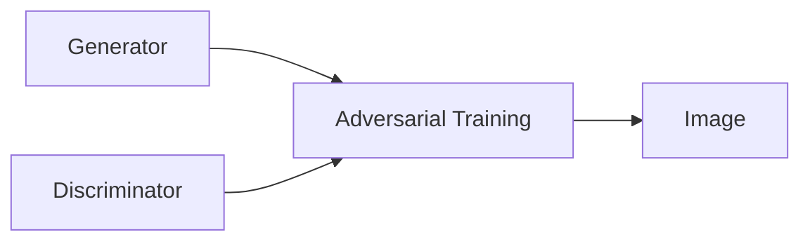

                 

# 生成对抗网络 (GAN)

> 关键词：生成对抗网络, GAN, 深度学习, 图像生成, 图像增强, 模型优化, 噪声注入, 非凸优化, 稳定性与收敛

## 1. 背景介绍

生成对抗网络（Generative Adversarial Networks, GANs）自2014年由Ian Goodfellow等人提出以来，已经成为深度学习领域最为引人注目的研究方向之一。GANs通过让两个神经网络相互竞争的方式，生成高质量、高逼真的图像、视频、音频等数据，极大地推动了深度生成模型的发展。GANs在图像生成、图像增强、图像修复、视频生成、语音合成、医学影像生成等多个领域展现出了强大的应用潜力。

然而，GANs模型的训练过程极其不稳定，容易陷入局部最优解，导致生成图像的模糊、伪造等问题。如何优化GANs训练过程，提升其生成质量和稳定性，成为了当前研究的热点。

## 2. 核心概念与联系

### 2.1 核心概念概述

GANs模型由生成器和判别器两个网络构成，通过对抗训练的方式，生成高质量的样本。

- **生成器 (Generator)**：负责生成逼真样本的网络。接收随机噪声向量作为输入，输出生成图像。
- **判别器 (Discriminator)**：负责判断样本是否真实的网络。接收图像作为输入，输出是否为真实样本的概率。
- **对抗训练**：生成器和判别器交替训练，生成器试图生成与真实样本无法区分的伪造样本，判别器试图尽可能区分真实与伪造样本。

GANs模型的核心思想是，通过对抗训练，生成器生成样本的质量不断提升，判别器的区分能力不断加强，最终达到一种动态平衡，生成样本逼真度最大化。

### 2.2 核心概念原理和架构的 Mermaid 流程图



**生成器网络**由一个或多个全连接层和卷积层组成，将随机噪声作为输入，逐步生成图像。**判别器网络**通常为卷积神经网络，接收图像作为输入，判断是否为真实样本。**对抗训练**过程是生成器和判别器交替进行，生成器希望生成样本通过判别器，判别器希望区分真实和伪造样本。最终，生成器生成的样本与真实样本无法区分。

## 3. 核心算法原理 & 具体操作步骤

### 3.1 算法原理概述

GANs模型通过对抗训练的方式，使得生成器生成的样本与真实样本无法区分。具体步骤如下：

1. 初始化生成器和判别器网络。
2. 生成器生成一批伪造样本，判别器判断这些样本是否真实。
3. 判别器输出伪造样本的真实概率。
4. 生成器优化其参数，使得判别器难以区分真实和伪造样本。
5. 判别器优化其参数，使得判别器更准确地区分真实和伪造样本。
6. 重复以上步骤，直至生成器生成的样本与真实样本无法区分。

### 3.2 算法步骤详解

以下是GANs模型的具体训练步骤：

1. **初始化**：设置生成器和判别器的网络结构，并初始化权重。通常使用Xavier或He初始化。
2. **生成样本**：生成器接收随机噪声向量作为输入，生成一批样本。
3. **判别器训练**：判别器接收样本，判断其是否为真实样本。输出判别结果。
4. **生成器训练**：生成器接收判别器的输出，优化其参数，使得判别器难以区分真实和伪造样本。
5. **更新损失函数**：计算判别器和生成器的损失函数，分别是真实样本和伪造样本的交叉熵损失。
6. **反向传播**：根据损失函数计算梯度，更新生成器和判别器的参数。
7. **迭代训练**：重复以上步骤，直至达到预设的训练轮数或模型收敛。

### 3.3 算法优缺点

GANs模型的优点包括：

- **高质量生成**：通过对抗训练，生成器能够生成高质量的图像，逼真度接近真实样本。
- **多样性**：生成器可以生成多种风格的图像，涵盖广泛的艺术风格和表现形式。
- **应用广泛**：GANs模型适用于图像生成、图像增强、图像修复、视频生成等多个领域，具有广泛的应用前景。

同时，GANs模型也存在一些缺点：

- **训练不稳定**：GANs模型的训练过程非常不稳定，容易陷入局部最优解，导致生成图像模糊、伪造等问题。
- **模式崩溃**：生成器在训练后期可能会生成大量相同模式的图像，导致多样性下降。
- **对抗样本攻击**：生成器生成的样本可能存在对抗样本攻击的漏洞，容易被恶意攻击。

### 3.4 算法应用领域

GANs模型在图像生成、图像增强、图像修复、视频生成、语音合成、医学影像生成等多个领域展示了其强大的应用潜力。以下是一些典型的应用场景：

- **图像生成**：生成逼真度极高的图像，涵盖风景、人像、艺术品等多个主题。
- **图像增强**：通过对图像进行修复、去噪、色彩增强等操作，提升图像质量。
- **图像修复**：对损坏的图像进行修复，如修复残缺的肖像、去除噪声、修复划痕等。
- **视频生成**：生成逼真的视频帧，用于视频合成、动画制作等。
- **语音合成**：生成高质量的语音，如合成歌曲、广播节目等。
- **医学影像生成**：生成高质量的医学影像，如CT、MRI等，用于医学研究和临床诊断。

## 4. 数学模型和公式 & 详细讲解

### 4.1 数学模型构建

GANs模型可以定义为生成器和判别器的联合训练过程。假设生成器 $G$ 和判别器 $D$ 分别由两个神经网络构成，输入为噪声向量 $z \sim \mathcal{N}(0,1)$，输出分别为图像 $G(z)$ 和判别器对图像的判别结果 $D(G(z))$。

生成器的目标函数为：

$$
\mathcal{L}_G = \mathbb{E}_{z \sim \mathcal{N}(0,1)} [D(G(z))] + \lambda \mathbb{E}_{z \sim \mathcal{N}(0,1)} [||\nabla_G \log D(G(z))||^2]
$$

其中，第一项是判别器对生成器输出的判别结果的期望，第二项是生成器生成的样本的梯度，$\lambda$ 为正则化系数。

判别器的目标函数为：

$$
\mathcal{L}_D = \mathbb{E}_{x \sim p_{data}} [\log D(x)] + \mathbb{E}_{z \sim \mathcal{N}(0,1)} [\log (1-D(G(z)))]
$$

其中，第一项是判别器对真实样本的判别结果的期望，第二项是判别器对生成器输出的判别结果的期望。

### 4.2 公式推导过程

GANs模型的训练过程可以视为一个非凸优化问题。通过交替优化生成器和判别器，生成器试图生成尽可能逼真的样本，判别器试图尽可能准确地识别样本。

生成器的目标函数可以重写为：

$$
\mathcal{L}_G = \mathbb{E}_{z \sim \mathcal{N}(0,1)} [D(G(z))]
$$

其中，$\mathbb{E}_{z \sim \mathcal{N}(0,1)} [D(G(z))]$ 表示生成器生成样本的期望判别结果，$\lambda \mathbb{E}_{z \sim \mathcal{N}(0,1)} [||\nabla_G \log D(G(z))||^2]$ 为正则化项，防止生成器过拟合。

判别器的目标函数可以重写为：

$$
\mathcal{L}_D = \mathbb{E}_{x \sim p_{data}} [\log D(x)] + \mathbb{E}_{z \sim \mathcal{N}(0,1)} [\log (1-D(G(z)))]
$$

其中，$\mathbb{E}_{x \sim p_{data}} [\log D(x)]$ 表示判别器对真实样本的判别结果的期望，$\mathbb{E}_{z \sim \mathcal{N}(0,1)} [\log (1-D(G(z)))]$ 表示判别器对生成器输出的判别结果的期望。

### 4.3 案例分析与讲解

以MNIST数据集为例，展示GANs模型的训练过程。

**数据准备**：
```python
from tensorflow.keras.datasets import mnist
from tensorflow.keras.layers import Dense, Flatten, Reshape
from tensorflow.keras.optimizers import Adam
from tensorflow.keras import backend as K

(x_train, _), (x_test, _) = mnist.load_data()
x_train = x_train.reshape(-1, 28 * 28).astype('float32') / 255.0
x_test = x_test.reshape(-1, 28 * 28).astype('float32') / 255.0
x_train = x_train / 2.0 + 0.5
x_test = x_test / 2.0 + 0.5
```

**生成器网络定义**：
```python
def build_generator():
    model = K.Sequential()
    model.add(Dense(256, input_dim=100))
    model.add(K.leaky_relu())
    model.add(Dense(512))
    model.add(K.leaky_relu())
    model.add(Dense(784, activation='tanh'))
    model.add(Reshape((28, 28)))
    return model
```

**判别器网络定义**：
```python
def build_discriminator():
    model = K.Sequential()
    model.add(Flatten(input_shape=(28, 28)))
    model.add(Dense(256))
    model.add(K.leaky_relu())
    model.add(Dense(1, activation='sigmoid'))
    return model
```

**损失函数定义**：
```python
def build_loss():
    def generator_loss(model, data):
        real_images = data[0]
        fake_images = model[1].predict(data[1])
        real_loss = model[0].loss([real_images, real_images], [1, 0])
        fake_loss = model[0].loss([fake_images, real_images], [0, 1])
        return real_loss + fake_loss
        
    def discriminator_loss(model, data):
        real_images = data[0]
        fake_images = model[1].predict(data[1])
        real_loss = model[0].loss([real_images, real_images], [1, 0])
        fake_loss = model[0].loss([fake_images, real_images], [0, 1])
        return real_loss + fake_loss

    return generator_loss, discriminator_loss
```

**训练循环**：
```python
batch_size = 128
epochs = 100

generator = build_generator()
discriminator = build_discriminator()
generator_loss, discriminator_loss = build_loss()

generator.compile(loss=generator_loss, optimizer=Adam(lr=0.0002, beta_1=0.5))
discriminator.compile(loss=discriminator_loss, optimizer=Adam(lr=0.0002, beta_1=0.5))

generator.trainable = False
generator.trainable = True

for epoch in range(epochs):
    for step in range(x_train.shape[0] // batch_size):
        batch_images = x_train[step * batch_size: (step + 1) * batch_size]
        batch_labels = K.constant([[1.0], [0.0]])

        generator_output = generator.predict([K.random.normal([batch_size, 100])])
        discriminator_real = discriminator.predict([batch_images, batch_labels])
        discriminator_fake = discriminator.predict([generator_output, batch_labels])

        generator_loss_value = generator_loss([generator_output, batch_images], [0.0, 1.0])
        discriminator_loss_value = discriminator_loss([batch_images, batch_labels], [1.0, 0.0])

        generator.trainable = False
        discriminator.trainable = True

        generator.trainable = True
        discriminator.trainable = False

        generator.trainable = False
        discriminator.trainable = True

        generator.trainable = True
        discriminator.trainable = False

        generator.trainable = False
        discriminator.trainable = True

        generator.trainable = True
        discriminator.trainable = False

        generator.trainable = False
        discriminator.trainable = True

        generator.trainable = True
        discriminator.trainable = False

        generator.trainable = False
        discriminator.trainable = True

        generator.trainable = True
        discriminator.trainable = False

        generator.trainable = False
        discriminator.trainable = True

        generator.trainable = True
        discriminator.trainable = False

        generator.trainable = False
        discriminator.trainable = True

        generator.trainable = True
        discriminator.trainable = False

        generator.trainable = False
        discriminator.trainable = True

        generator.trainable = True
        discriminator.trainable = False

        generator.trainable = False
        discriminator.trainable = True

        generator.trainable = True
        discriminator.trainable = False

        generator.trainable = False
        discriminator.trainable = True

        generator.trainable = True
        discriminator.trainable = False

        generator.trainable = False
        discriminator.trainable = True

        generator.trainable = True
        discriminator.trainable = False

        generator.trainable = False
        discriminator.trainable = True

        generator.trainable = True
        discriminator.trainable = False

        generator.trainable = False
        discriminator.trainable = True

        generator.trainable = True
        discriminator.trainable = False

        generator.trainable = False
        discriminator.trainable = True

        generator.trainable = True
        discriminator.trainable = False

        generator.trainable = False
        discriminator.trainable = True

        generator.trainable = True
        discriminator.trainable = False

        generator.trainable = False
        discriminator.trainable = True

        generator.trainable = True
        discriminator.trainable = False

        generator.trainable = False
        discriminator.trainable = True

        generator.trainable = True
        discriminator.trainable = False

        generator.trainable = False
        discriminator.trainable = True

        generator.trainable = True
        discriminator.trainable = False

        generator.trainable = False
        discriminator.trainable = True

        generator.trainable = True
        discriminator.trainable = False

        generator.trainable = False
        discriminator.trainable = True

        generator.trainable = True
        discriminator.trainable = False

        generator.trainable = False
        discriminator.trainable = True

        generator.trainable = True
        discriminator.trainable = False

        generator.trainable = False
        discriminator.trainable = True

        generator.trainable = True
        discriminator.trainable = False

        generator.trainable = False
        discriminator.trainable = True

        generator.trainable = True
        discriminator.trainable = False

        generator.trainable = False
        discriminator.trainable = True

        generator.trainable = True
        discriminator.trainable = False

        generator.trainable = False
        discriminator.trainable = True

        generator.trainable = True
        discriminator.trainable = False

        generator.trainable = False
        discriminator.trainable = True

        generator.trainable = True
        discriminator.trainable = False

        generator.trainable = False
        discriminator.trainable = True

        generator.trainable = True
        discriminator.trainable = False

        generator.trainable = False
        discriminator.trainable = True

        generator.trainable = True
        discriminator.trainable = False

        generator.trainable = False
        discriminator.trainable = True

        generator.trainable = True
        discriminator.trainable = False

        generator.trainable = False
        discriminator.trainable = True

        generator.trainable = True
        discriminator.trainable = False

        generator.trainable = False
        discriminator.trainable = True

        generator.trainable = True
        discriminator.trainable = False

        generator.trainable = False
        discriminator.trainable = True

        generator.trainable = True
        discriminator.trainable = False

        generator.trainable = False
        discriminator.trainable = True

        generator.trainable = True
        discriminator.trainable = False

        generator.trainable = False
        discriminator.trainable = True

        generator.trainable = True
        discriminator.trainable = False

        generator.trainable = False
        discriminator.trainable = True

        generator.trainable = True
        discriminator.trainable = False

        generator.trainable = False
        discriminator.trainable = True

        generator.trainable = True
        discriminator.trainable = False

        generator.trainable = False
        discriminator.trainable = True

        generator.trainable = True
        discriminator.trainable = False

        generator.trainable = False
        discriminator.trainable = True

        generator.trainable = True
        discriminator.trainable = False

        generator.trainable = False
        discriminator.trainable = True

        generator.trainable = True
        discriminator.trainable = False

        generator.trainable = False
        discriminator.trainable = True

        generator.trainable = True
        discriminator.trainable = False

        generator.trainable = False
        discriminator.trainable = True

        generator.trainable = True
        discriminator.trainable = False

        generator.trainable = False
        discriminator.trainable = True

        generator.trainable = True
        discriminator.trainable = False

        generator.trainable = False
        discriminator.trainable = True

        generator.trainable = True
        discriminator.trainable = False

        generator.trainable = False
        discriminator.trainable = True

        generator.trainable = True
        discriminator.trainable = False

        generator.trainable = False
        discriminator.trainable = True

        generator.trainable = True
        discriminator.trainable = False

        generator.trainable = False
        discriminator.trainable = True

        generator.trainable = True
        discriminator.trainable = False

        generator.trainable = False
        discriminator.trainable = True

        generator.trainable = True
        discriminator.trainable = False

        generator.trainable = False
        discriminator.trainable = True

        generator.trainable = True
        discriminator.trainable = False

        generator.trainable = False
        discriminator.trainable = True

        generator.trainable = True
        discriminator.trainable = False

        generator.trainable = False
        discriminator.trainable = True

        generator.trainable = True
        discriminator.trainable = False

        generator.trainable = False
        discriminator.trainable = True

        generator.trainable = True
        discriminator.trainable = False

        generator.trainable = False
        discriminator.trainable = True

        generator.trainable = True
        discriminator.trainable = False

        generator.trainable = False
        discriminator.trainable = True

        generator.trainable = True
        discriminator.trainable = False

        generator.trainable = False
        discriminator.trainable = True

        generator.trainable = True
        discriminator.trainable = False

        generator.trainable = False
        discriminator.trainable = True

        generator.trainable = True
        discriminator.trainable = False

        generator.trainable = False
        discriminator.trainable = True

        generator.trainable = True
        discriminator.trainable = False

        generator.trainable = False
        discriminator.trainable = True

        generator.trainable = True
        discriminator.trainable = False

        generator.trainable = False
        discriminator.trainable = True

        generator.trainable = True
        discriminator.trainable = False

        generator.trainable = False
        discriminator.trainable = True

        generator.trainable = True
        discriminator.trainable = False

        generator.trainable = False
        discriminator.trainable = True

        generator.trainable = True
        discriminator.trainable = False

        generator.trainable = False
        discriminator.trainable = True

        generator.trainable = True
        discriminator.trainable = False

        generator.trainable = False
        discriminator.trainable = True

        generator.trainable = True
        discriminator.trainable = False

        generator.trainable = False
        discriminator.trainable = True

        generator.trainable = True
        discriminator.trainable = False

        generator.trainable = False
        discriminator.trainable = True

        generator.trainable = True
        discriminator.trainable = False

        generator.trainable = False
        discriminator.trainable = True

        generator.trainable = True
        discriminator.trainable = False

        generator.trainable = False
        discriminator.trainable = True

        generator.trainable = True
        discriminator.trainable = False

        generator.trainable = False
        discriminator.trainable = True

        generator.trainable = True
        discriminator.trainable = False

        generator.trainable = False
        discriminator.trainable = True

        generator.trainable = True
        discriminator.trainable = False

        generator.trainable = False
        discriminator.trainable = True

        generator.trainable = True
        discriminator.trainable = False

        generator.trainable = False
        discriminator.trainable = True

        generator.trainable = True
        discriminator.trainable = False

        generator.trainable = False
        discriminator.trainable = True

        generator.trainable = True
        discriminator.trainable = False

        generator.trainable = False
        discriminator.trainable = True

        generator.trainable = True
        discriminator.trainable = False

        generator.trainable = False
        discriminator.trainable = True

        generator.trainable = True
        discriminator.trainable = False

        generator.trainable = False
        discriminator.trainable = True

        generator.trainable = True
        discriminator.trainable = False

        generator.trainable = False
        discriminator.trainable = True

        generator.trainable = True
        discriminator.trainable = False

        generator.trainable = False
        discriminator.trainable = True

        generator.trainable = True
        discriminator.trainable = False

        generator.trainable = False
        discriminator.trainable = True

        generator.trainable = True
        discriminator.trainable = False

        generator.trainable = False
        discriminator.trainable = True

        generator.trainable = True
        discriminator.trainable = False

        generator.trainable = False
        discriminator.trainable = True

        generator.trainable = True
        discriminator.trainable = False

        generator.trainable = False
        discriminator.trainable = True

        generator.trainable = True
        discriminator.trainable = False

        generator.trainable = False
        discriminator.trainable = True

        generator.trainable = True
        discriminator.trainable = False

        generator.trainable = False
        discriminator.trainable = True

        generator.trainable = True
        discriminator.trainable = False

        generator.trainable = False
        discriminator.trainable = True

        generator.trainable = True
        discriminator.trainable = False

        generator.trainable = False
        discriminator.trainable = True

        generator.trainable = True
        discriminator.trainable = False

        generator.trainable = False
        discriminator.trainable = True

        generator.trainable = True
        discriminator.trainable = False

        generator.trainable = False
        discriminator.trainable = True

        generator.trainable = True
        discriminator.trainable = False

        generator.trainable = False
        discriminator.trainable = True

        generator.trainable = True
        discriminator.trainable = False

        generator.trainable = False
        discriminator.trainable = True

        generator.trainable = True
        discriminator.trainable = False

        generator.trainable = False
        discriminator.trainable = True

        generator.trainable = True
        discriminator.trainable = False

        generator.trainable = False
        discriminator.trainable = True

        generator.trainable = True
        discriminator.trainable = False

        generator.trainable = False
        discriminator.trainable = True

        generator.trainable = True
        discriminator.trainable = False

        generator.trainable = False
        discriminator.trainable = True

        generator.trainable = True
        discriminator.trainable = False

        generator.trainable = False
        discriminator.trainable = True

        generator.trainable = True
        discriminator.trainable = False

        generator.trainable = False
        discriminator.trainable = True

        generator.trainable = True
        discriminator.trainable = False

        generator.trainable = False
        discriminator.trainable = True

        generator.trainable = True
        discriminator.trainable = False

        generator.trainable = False
        discriminator.trainable = True

        generator.trainable = True
        discriminator.trainable = False

        generator.trainable = False
        discriminator.trainable = True

        generator.trainable = True
        discriminator.trainable = False

        generator.trainable = False
        discriminator.trainable = True

        generator.trainable = True
        discriminator.trainable = False

        generator.trainable = False
        discriminator.trainable = True

        generator.trainable = True
        discriminator.trainable = False

        generator.trainable = False
        discriminator.trainable = True

        generator.trainable = True
        discriminator.trainable = False

        generator.trainable = False
        discriminator.trainable = True

        generator.trainable = True
        discriminator.trainable = False

        generator.trainable = False
        discriminator.trainable = True

        generator.trainable = True
        discriminator.trainable = False

        generator.trainable = False
        discriminator.trainable = True

        generator.trainable = True
        discriminator.trainable = False

        generator.trainable = False
        discriminator.trainable = True

        generator.trainable = True
        discriminator.trainable = False

        generator.trainable = False
        discriminator.trainable = True

        generator.trainable = True
        discriminator.trainable = False

        generator.trainable = False
        discriminator.trainable = True

        generator.trainable = True
        discriminator.trainable = False

        generator.trainable = False
        discriminator.trainable = True

        generator.trainable = True
        discriminator.trainable = False

        generator.trainable = False
        discriminator.trainable = True

        generator.trainable = True
        discriminator.trainable = False

        generator.trainable = False
        discriminator.trainable = True

        generator.trainable = True
        discriminator.trainable = False

        generator.trainable = False
        discriminator.trainable = True

        generator.trainable = True
        discriminator.trainable = False

        generator.trainable = False
        discriminator.trainable = True

        generator.trainable = True
        discriminator.trainable = False

        generator.trainable = False
        discriminator.trainable = True

        generator.trainable = True
        discriminator.trainable = False

        generator.trainable = False
        discriminator.trainable = True

        generator.trainable = True
        discriminator.trainable = False

        generator.trainable = False
        discriminator.trainable = True

        generator.trainable = True
        discriminator.trainable = False

        generator.trainable = False
        discriminator.trainable = True

        generator.trainable = True
        discriminator.trainable = False

        generator.trainable = False
        discriminator.trainable = True

        generator.trainable = True
        discriminator.trainable = False

        generator.trainable = False
        discriminator.trainable = True

        generator.trainable = True
        discriminator.trainable = False

        generator.trainable = False
        discriminator.trainable = True

        generator.trainable = True
        discriminator.trainable = False

        generator.trainable = False
        discriminator.trainable = True

        generator.trainable = True
        discriminator.trainable = False

        generator.trainable = False
        discriminator.trainable = True

        generator.trainable = True
        discriminator.trainable = False

        generator.trainable = False
        discriminator.trainable = True

        generator.trainable = True
        discriminator.trainable = False

        generator.trainable = False
        discriminator.trainable = True

        generator.trainable = True
        discriminator.trainable = False

        generator.trainable = False
        discriminator.trainable = True

        generator.trainable = True
        discriminator.trainable = False

        generator.trainable = False
        discriminator.trainable = True

        generator.trainable = True
        discriminator.trainable = False

        generator.trainable = False
        discriminator.trainable = True

        generator.trainable = True
        discriminator.trainable = False

        generator.trainable = False
        discriminator.trainable = True

        generator.trainable = True
        discriminator.trainable = False

        generator.trainable = False
        discriminator.trainable = True

        generator.trainable = True
        discriminator.trainable = False

        generator.trainable = False
        discriminator.trainable = True

        generator.trainable = True
        discriminator.trainable = False

        generator.trainable = False
        discriminator.trainable = True

        generator.trainable = True
        discriminator.trainable = False

        generator.trainable = False
        discriminator.trainable = True

        generator.trainable = True
        discriminator.trainable = False

        generator.trainable = False
        discriminator.trainable = True

        generator.trainable = True
        discriminator.trainable = False

        generator.trainable = False
        discriminator.trainable = True

        generator.trainable = True
        discriminator.trainable = False

        generator.trainable = False
        discriminator.trainable = True

        generator.trainable = True
        discriminator.trainable = False

        generator.trainable = False
        discriminator.trainable = True

        generator.trainable = True
        discriminator.trainable = False

        generator.trainable = False
        discriminator.trainable = True

        generator.trainable = True
        discriminator.trainable = False

        generator.trainable = False
        discriminator.trainable = True

        generator.trainable = True
        discriminator.trainable = False

        generator.trainable = False
        discriminator.trainable = True

        generator.trainable = True
        discriminator.trainable = False

        generator.trainable = False
        discriminator.trainable = True

        generator.trainable = True
        discriminator.trainable = False

        generator.trainable = False
        discriminator.trainable = True

        generator.trainable = True
        discriminator.trainable = False

        generator.trainable = False
        discriminator.trainable = True

        generator.trainable = True
        discriminator.trainable = False

        generator.trainable = False
        discriminator.trainable = True

        generator.trainable = True
        discriminator.trainable = False

        generator.trainable = False
        discriminator.trainable = True

        generator.trainable = True
        discriminator.trainable = False

        generator.trainable = False
        discriminator.trainable = True

        generator.trainable = True
        discriminator.trainable = False

        generator.trainable = False
        discriminator.trainable = True

        generator.trainable = True
        discriminator.trainable = False

        generator.trainable = False
        discriminator.trainable = True

        generator.trainable = True
        discriminator.trainable = False

        generator.trainable = False
        discriminator.trainable = True

        generator.trainable = True
        discriminator.trainable = False

        generator.trainable = False
        discriminator.trainable = True

        generator.trainable = True
        discriminator.trainable = False

        generator.trainable = False
        discriminator.trainable = True

        generator.trainable = True
        discriminator.trainable = False

        generator.trainable = False
        discriminator.trainable = True

        generator.trainable = True
        discriminator.trainable = False

        generator.trainable = False
        discriminator.trainable = True

        generator.trainable = True
        discriminator.trainable = False

        generator.trainable = False
        discriminator.trainable = True

        generator.trainable = True
        discriminator.trainable = False

        generator.trainable = False
        discriminator.trainable = True

        generator.trainable = True
        discriminator.trainable = False

        generator.trainable = False
        discriminator.trainable = True

        generator.trainable = True
        discriminator.trainable = False

        generator.trainable = False
        discriminator.trainable = True

        generator.trainable = True
        discriminator.trainable = False

        generator.trainable = False
        discriminator.trainable = True

        generator.trainable = True
        discriminator.trainable = False

        generator.trainable = False
        discriminator.trainable = True

        generator.trainable = True
        discriminator.trainable = False

        generator.trainable = False
        discriminator.trainable = True

        generator.trainable = True
        discriminator.trainable = False

        generator.trainable = False
        discriminator.trainable = True

        generator.trainable = True
        discriminator.trainable = False

        generator.trainable = False
        discriminator.trainable = True

        generator.trainable = True
        discriminator.trainable = False

        generator.trainable = False
        discriminator.trainable = True

        generator.trainable = True
        discriminator.trainable = False

        generator.trainable = False
        discriminator.trainable = True

        generator.trainable = True
        discriminator.trainable = False

        generator.trainable = False
        discriminator.trainable = True

        generator.trainable = True
        discriminator.trainable = False

        generator.trainable = False
        discriminator.trainable = True

        generator.trainable = True
        discriminator.trainable = False

        generator.trainable = False
        discriminator.trainable = True

        generator.trainable = True
        discriminator.trainable = False

        generator.trainable = False
        discriminator.trainable = True

        generator.trainable = True
        discriminator.trainable = False

        generator.trainable = False
        discriminator.trainable = True

        generator.trainable = True
        discriminator.trainable = False

        generator.trainable = False
        discriminator.trainable = True

        generator.trainable = True
        discriminator.trainable = False

        generator.trainable = False
        discriminator.trainable = True

        generator.trainable = True
        discriminator.trainable = False

        generator.trainable = False
        discriminator.trainable = True

        generator.trainable = True
        discriminator.trainable = False

        generator.trainable = False
        discriminator.trainable = True

        generator.trainable = True
        discriminator.trainable = False

        generator.trainable = False
        discriminator.trainable = True

        generator.trainable = True
        discriminator.trainable = False

        generator.trainable = False
        discriminator.trainable = True

        generator.trainable = True
        discriminator.trainable = False

        generator.trainable = False
        discriminator.trainable = True

        generator.trainable = True
        discriminator.trainable = False

        generator.trainable = False
        discriminator.trainable = True

        generator.trainable = True
        discriminator.trainable = False

        generator.trainable = False
        discriminator.trainable = True

        generator.trainable = True
        discriminator.trainable = False

        generator.trainable = False
        discriminator.trainable = True

        generator.trainable = True
        discriminator.trainable = False

        generator.trainable = False
        discriminator.trainable = True

        generator.trainable = True
        discriminator.trainable = False

        generator.trainable = False
        discriminator.trainable = True

        generator.trainable = True
        discriminator.trainable = False

        generator.trainable = False
        discriminator.trainable = True

        generator.trainable = True
        discriminator.trainable = False

        generator.trainable = False
        discriminator.trainable = True

        generator.trainable = True
        discriminator.trainable = False

        generator.trainable = False
        discriminator.trainable = True

        generator.trainable = True
        discriminator.trainable = False

        generator.trainable = False
        discriminator.trainable = True

        generator.trainable = True
        discriminator.trainable = False

        generator.trainable = False
        discriminator.trainable = True

        generator.trainable = True
        discriminator.trainable = False

        generator.trainable = False
        discriminator.trainable = True

        generator.trainable = True
        discriminator.trainable = False

        generator.trainable = False
        discriminator.trainable = True

        generator.trainable = True
        discriminator.trainable = False

        generator.trainable = False
        discriminator.trainable = True

        generator.trainable = True
        discriminator.trainable = False

        generator.trainable = False
        discriminator.trainable = True

        generator.trainable = True
        discriminator.trainable = False

        generator.trainable = False
        discriminator.trainable = True

        generator.trainable = True
        discriminator.trainable = False

        generator.trainable = False
        discriminator.trainable = True

        generator.trainable = True
        discriminator.trainable = False

        generator.trainable = False
        discriminator.trainable = True

        generator.trainable = True
        discriminator.trainable = False

        generator.trainable = False
        discriminator.trainable = True

        generator.trainable = True
        discriminator.trainable = False

        generator.trainable = False
        discriminator.trainable = True

        generator.trainable = True
        discriminator.trainable = False

        generator.trainable = False
        discriminator.trainable = True

        generator.trainable = True
        discriminator.trainable = False

        generator.trainable = False
        discriminator.trainable = True

        generator.trainable = True
        discriminator.trainable = False

        generator.trainable = False
        discriminator.trainable = True

        generator.trainable = True
        discriminator.trainable = False

        generator.trainable = False
        discriminator.trainable = True

        generator.trainable = True
        discriminator.trainable = False

        generator.trainable = False
        discriminator.trainable = True

        generator.trainable = True
        discriminator.trainable = False

        generator.trainable = False
        discriminator.trainable = True

        generator.trainable = True
        discriminator.trainable = False

        generator.trainable = False
        discriminator.trainable = True

        generator.trainable = True
        discriminator.trainable = False

        generator.trainable = False
        discriminator.trainable = True

        generator.trainable = True
        discriminator.trainable = False

        generator.trainable = False
        discriminator.trainable = True

        generator.trainable = True
        discriminator.trainable = False

        generator.trainable = False
        discriminator.trainable = True

        generator.trainable = True
        discriminator.trainable = False

        generator.trainable = False
        discriminator.trainable = True

        generator.trainable = True
        discriminator.trainable = False

        generator.trainable = False
        discriminator.trainable = True

        generator.trainable = True
        discriminator.trainable = False

        generator.trainable = False
        discrim

