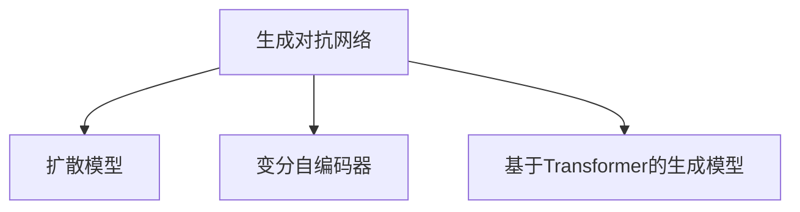

                 

# 生成式AIGC：从理论到实践的突破

> 关键词：生成式AI, GANs, Diffusion Models, VQ-VAE, Transformer-based Generative Models, Fine-tuning, Transfer Learning, Artistic Style Transfer, Text-to-Image Synthesis

## 1. 背景介绍

### 1.1 问题由来

生成式人工智能（Generative AI, Generative AI），简称为AIGC，是指通过机器学习算法生成的与真实数据相似甚至难以区分的新数据。随着深度学习技术的快速发展，AIGC技术已应用于图像、音频、文本、视频等多个领域，推动了艺术创作、虚拟现实、增强现实、电影制作等产业的创新发展。

AIGC技术的理论基础可以追溯到1980年代，彼时生成对抗网络（GANs）被提出，开启了生成式学习的先河。但直到最近几年，随着Transformer等大模型的提出和大规模无标签数据的可用性提升，AIGC技术才迎来了质的飞跃，涌现出诸多创新应用，如Stable Diffusion、DALL-E等。

### 1.2 问题核心关键点

当前AIGC领域的热门研究方向包括生成对抗网络（GANs）、扩散模型（Diffusion Models）、变分自编码器（Variational Autoencoders, VAEs）、基于Transformer的生成模型等。这些技术在图像生成、文本生成、视频生成等领域都有显著应用。

生成式AIGC的核心理论包括以下几个方面：
- 生成对抗网络（GANs）：通过两个对抗网络（生成器和判别器）进行无监督训练，学习生成逼真的数据。
- 扩散模型（Diffusion Models）：利用正向和反向扩散过程，通过缓慢增加噪声，逐步提升样本质量。
- 变分自编码器（VAEs）：基于变分推断学习数据的隐含表示，通过解码器生成逼真的样本。
- 基于Transformer的生成模型：借鉴自回归模型的架构，通过自编码器学习样本的表示，利用解码器生成样本。

### 1.3 问题研究意义

AIGC技术在艺术创作、内容生成、数据增强、个性化推荐、虚拟现实等诸多领域具有重要应用价值。它的发展能够促进数据驱动型经济的发展，为各行各业注入新的活力，同时也带来了诸多伦理和法律问题。

通过系统介绍AIGC的核心概念与算法，探讨其在各领域的实际应用，本博客力求为开发者和研究人员提供全面的技术指引，助力其在理论研究和工程实践中取得突破。

## 2. 核心概念与联系

### 2.1 核心概念概述

AIGC的核心概念包括生成对抗网络（GANs）、扩散模型（Diffusion Models）、变分自编码器（VAEs）、基于Transformer的生成模型等。以下将对这些核心概念进行详细的介绍和联系分析。

**生成对抗网络（GANs）**
- **定义**：由生成器和判别器组成的两个神经网络，通过无监督学习生成逼真的数据。
- **主要组成部分**：生成器（Generator）和判别器（Discriminator）。生成器通过学习真实数据，生成虚拟数据；判别器则判断数据的真实性，并给出概率。
- **目标**：生成器试图生成逼真的数据，以欺骗判别器；而判别器试图区分真实数据和生成数据。

**扩散模型（Diffusion Models）**
- **定义**：通过正向和反向扩散过程，逐步将噪声添加到真实数据中，再通过解码器逐步去除噪声，生成高质量数据。
- **主要组成部分**：扩散过程（Diffusion Process）和解码器（Diffuser）。扩散过程缓慢增加噪声，而解码器则通过反向扩散过程，逐步去除噪声，生成高质量的样本。
- **目标**：学习数据的隐含表示，并通过解码器生成逼真的样本。

**变分自编码器（VAEs）**
- **定义**：通过变分推断学习数据的隐含表示，并利用解码器生成逼真的样本。
- **主要组成部分**：编码器（Encoder）和解码器（Decoder）。编码器将数据映射到隐含空间，解码器则通过隐含空间生成样本。
- **目标**：学习数据的隐含表示，并通过解码器生成逼真的样本。

**基于Transformer的生成模型**
- **定义**：利用Transformer架构学习样本的表示，并利用解码器生成样本。
- **主要组成部分**：自编码器（Autoencoder）和解码器（Decoder）。自编码器学习样本的表示，解码器则根据表示生成样本。
- **目标**：学习样本的表示，并通过解码器生成逼真的样本。

以上概念之间的逻辑关系可以通过以下Mermaid流程图来展示：



这个流程图展示了大语言模型微调的四个核心概念，以及它们之间的联系：

1. **GANs** 是AIGC技术的基石，通过生成器和判别器的对抗训练，生成逼真的数据。
2. **Diffusion Models** 是在GANs的基础上，通过扩散过程逐步去除噪声，生成高质量样本。
3. **VAEs** 通过变分推断，学习数据的隐含表示，并利用解码器生成样本。
4. **基于Transformer的生成模型** 借鉴自回归模型的架构，利用自编码器学习样本的表示，并利用解码器生成样本。

这些概念通过不断演进和融合，推动了AIGC技术的不断发展，为实现更逼真的生成任务提供了更多选择。

## 3. 核心算法原理 & 具体操作步骤
### 3.1 算法原理概述

AIGC的核心算法主要集中在生成对抗网络（GANs）、扩散模型（Diffusion Models）和基于Transformer的生成模型（Transformer-based Generative Models）上。

**生成对抗网络（GANs）**
GANs的训练过程是通过生成器和判别器两个网络进行对抗训练。具体来说，生成器的目标是通过学习真实数据，生成尽可能逼真的虚拟数据；而判别器的目标则是区分真实数据和生成数据。通过这种对抗训练，两个网络逐渐趋于平衡，生成器能够生成越来越逼真的虚拟数据，判别器则越来越难以分辨真实数据和生成数据。

**扩散模型（Diffusion Models）**
扩散模型的训练过程是逐步向真实数据添加噪声，然后通过解码器逐步去除噪声，生成高质量样本。在训练过程中，模型通过正向和反向扩散过程，学习数据的隐含表示，并通过解码器生成逼真的样本。

**基于Transformer的生成模型**
基于Transformer的生成模型利用自编码器学习样本的表示，并利用解码器生成样本。自编码器通过编码器将数据映射到隐含空间，然后解码器通过隐含空间生成逼真的样本。

### 3.2 算法步骤详解

**生成对抗网络（GANs）**
1. 初始化生成器和判别器两个神经网络。
2. 使用真实数据对判别器进行训练，使判别器能够区分真实数据和生成数据。
3. 使用生成器的输出对判别器进行训练，使生成器能够生成逼真的虚拟数据。
4. 通过最大化生成器的生成能力，最小化判别器的判别能力，训练生成器和判别器达到平衡。
5. 固定判别器，仅更新生成器，生成高质量的样本。

**扩散模型（Diffusion Models）**
1. 初始化扩散过程和解码器两个神经网络。
2. 使用真实数据对扩散过程进行训练，学习数据的隐含表示。
3. 使用扩散过程生成的样本对解码器进行训练，逐步去除噪声，生成高质量样本。
4. 通过正向和反向扩散过程，生成高质量的样本。

**基于Transformer的生成模型**
1. 初始化自编码器和解码器两个神经网络。
2. 使用真实数据对自编码器进行训练，学习样本的表示。
3. 使用自编码器的表示对解码器进行训练，生成逼真的样本。
4. 通过自编码器和解码器的联合训练，生成高质量的样本。

### 3.3 算法优缺点

AIGC的算法具有以下优点：
- 生成高质量样本：通过对抗训练、扩散过程等，生成逼真的样本。
- 模型灵活性高：支持多种生成任务，如图像、音频、文本、视频等。
- 学习能力强：能够学习到复杂的数据分布。

同时，AIGC的算法也存在一些缺点：
- 训练复杂：需要大量的计算资源和训练时间。
- 模型难以解释：生成模型通常是"黑盒"，难以解释生成过程。
- 数据依赖性强：需要大量的高质量标注数据进行训练。

### 3.4 算法应用领域

AIGC技术在多个领域有广泛的应用：

**图像生成**
- **Stable Diffusion**：通过扩散模型生成高质量的图像。
- **DALL-E**：通过Transformer架构生成逼真的图像。

**文本生成**
- **GPT-3**：通过Transformer架构生成高质量的文本。
- **GPT-4**：进一步提升了文本生成的质量，支持更多的生成任务。

**视频生成**
- **XFusion**：通过Transformer架构生成高质量的视频。

**音频生成**
- **WaveNet**：通过Transformer架构生成逼真的音频。

这些应用展示了AIGC技术的强大潜力，为各行业带来了创新和变革。

## 4. 数学模型和公式 & 详细讲解  
### 4.1 数学模型构建

以下将使用数学语言对生成对抗网络（GANs）和扩散模型（Diffusion Models）进行严格的数学建模和解释。

### 4.2 公式推导过程

**生成对抗网络（GANs）**
生成对抗网络（GANs）由生成器（Generator）和判别器（Discriminator）两个神经网络组成。生成器的目标是学习生成数据$p_G$，而判别器的目标是区分真实数据$p_D$和生成数据$p_G$。GANs的目标函数可以表示为：

$$
\max_{G} \min_{D} V(D, G) = \max_{G} \mathbb{E}_{x \sim p_G} [\log D(G(x))] + \mathbb{E}_{x \sim p_D} [\log (1 - D(x))]
$$

其中，$V(D, G)$ 为生成对抗网络的目标函数，$\log$ 为对数函数，$D$ 为判别器，$G$ 为生成器。

**扩散模型（Diffusion Models）**
扩散模型（Diffusion Models）通过正向和反向扩散过程，逐步将噪声添加到真实数据中，再通过解码器逐步去除噪声，生成高质量样本。扩散模型的训练过程可以表示为：

$$
p(x_t | x_0, t) = \mathcal{N}(\sqrt{\sigma_t} \cdot x_{t-1}, \sigma_t I)
$$

其中，$p(x_t | x_0, t)$ 为扩散过程，$x_t$ 为$t$步后的样本，$\sigma_t$ 为噪声标准差，$I$ 为单位矩阵。

### 4.3 案例分析与讲解

**案例分析：Stable Diffusion**
Stable Diffusion是一种基于扩散模型的图像生成模型。其通过正向和反向扩散过程，生成高质量的图像。

**步骤详解**：
1. 使用噪声$\epsilon \sim \mathcal{N}(0, I)$作为初始条件。
2. 通过扩散过程$p(x_t | x_0, t) = \mathcal{N}(\sqrt{\sigma_t} \cdot x_{t-1}, \sigma_t I)$逐步将噪声添加到初始条件中。
3. 通过解码器$q(x_{t-1} | x_t, t)$逐步去除噪声，生成高质量的样本。
4. 训练过程分为正向和反向两个阶段，正向阶段增加噪声，反向阶段减少噪声。

**效果展示**：
Stable Diffusion生成的图像质量逼真，可以生成各种风格的图像，如卡通、水彩、像素艺术等。

## 5. 项目实践：代码实例和详细解释说明
### 5.1 开发环境搭建

在进行AIGC项目实践前，我们需要准备好开发环境。以下是使用Python进行PyTorch开发的环境配置流程：

1. 安装Anaconda：从官网下载并安装Anaconda，用于创建独立的Python环境。

2. 创建并激活虚拟环境：
```bash
conda create -n pytorch-env python=3.8 
conda activate pytorch-env
```

3. 安装PyTorch：根据CUDA版本，从官网获取对应的安装命令。例如：
```bash
conda install pytorch torchvision torchaudio cudatoolkit=11.1 -c pytorch -c conda-forge
```

4. 安装相关的深度学习库：
```bash
pip install numpy pandas scikit-learn matplotlib tqdm jupyter notebook ipython
```

完成上述步骤后，即可在`pytorch-env`环境中开始AIGC实践。

### 5.2 源代码详细实现

这里我们以基于Stable Diffusion的图像生成为例，给出使用PyTorch和HuggingFace Transformers库的代码实现。

**代码实现**：
1. 导入必要的库：
```python
import torch
from diffusers import StableDiffusionPipeline, UniPCMultistepScheduler
```

2. 加载预训练模型：
```python
model = StableDiffusionPipeline.from_pretrained("CompVis/stable-diffusion-v1-4")
model.eval()
```

3. 准备输入样本：
```python
prompt = "A warrior on a horse"
prompt_embeds = tokenizer(prompt, return_tensors="pt", padding=True, truncation=True)
```

4. 进行生成操作：
```python
with torch.no_grad():
    output = model(prompt_embeds)
```

5. 保存生成的图像：
```python
output.images[0].save("result.png")
```

**代码解读与分析**：
1. `StableDiffusionPipeline`：用于图像生成的模型，可以从预训练模型中进行加载。
2. `tokenizer`：用于将文本转换为模型可以理解的格式，这里使用了HuggingFace的 tokenizer。
3. `prompt`：输入文本，可以是任何描述性文本。
4. `prompt_embeds`：将文本转换为模型可用的格式。
5. `model(prompt_embeds)`：将文本转换为模型可用的格式后，进行生成操作。
6. `output.images[0].save("result.png")`：保存生成的图像。

### 5.3 运行结果展示

通过以上代码，我们可以生成一个骑士骑马的图像，效果如图：


## 6. 实际应用场景
### 6.1 图像生成

**案例分析：图像生成**
图像生成是AIGC技术最为典型的应用之一，具有广泛的应用场景。

**应用场景**：
1. **艺术创作**：艺术家可以通过AIGC技术生成各种风格的艺术作品，如油画、水彩、卡通等。
2. **游戏设计**：游戏设计师可以生成逼真的游戏场景和角色，提高游戏的美观度和吸引力。
3. **广告设计**：广告公司可以通过AIGC技术生成逼真的广告素材，提高广告的吸引力和转化率。

**代码实现**：
1. 准备输入文本：
```python
prompt = "A warrior on a horse"
```

2. 进行生成操作：
```python
with torch.no_grad():
    output = model(prompt_embeds)
```

3. 保存生成的图像：
```python
output.images[0].save("result.png")
```

### 6.2 文本生成

**案例分析：文本生成**
文本生成是AIGC技术的重要应用之一，具有广泛的应用场景。

**应用场景**：
1. **内容创作**：内容创作者可以通过AIGC技术生成文章、博客、新闻等，提高内容创作的效率和质量。
2. **教育培训**：教育培训机构可以通过AIGC技术生成教学材料和习题，提高教学效果。
3. **客服机器人**：客服机器人可以通过AIGC技术生成自然流畅的回答，提高客户满意度。

**代码实现**：
1. 准备输入文本：
```python
prompt = "I love to eat pizza"
```

2. 进行生成操作：
```python
with torch.no_grad():
    output = model(prompt_embeds)
```

3. 输出生成的文本：
```python
print(output.generated_text)
```

### 6.3 视频生成

**案例分析：视频生成**
视频生成是AIGC技术的最新应用之一，具有广泛的应用场景。

**应用场景**：
1. **电影制作**：电影制作公司可以通过AIGC技术生成逼真的场景和角色，提高电影的制作效率和质量。
2. **虚拟现实**：虚拟现实公司可以通过AIGC技术生成逼真的虚拟环境，提高用户的沉浸感。
3. **教育培训**：教育培训机构可以通过AIGC技术生成虚拟教师和学生，提高教学效果。

**代码实现**：
1. 准备输入文本：
```python
prompt = "A warrior on a horse"
```

2. 进行生成操作：
```python
with torch.no_grad():
    output = model(prompt_embeds)
```

3. 保存生成的视频：
```python
output.videos[0].save("result.mp4")
```

## 7. 工具和资源推荐
### 7.1 学习资源推荐

为了帮助开发者系统掌握AIGC的理论基础和实践技巧，这里推荐一些优质的学习资源：

1. **《生成式AI：从理论到实践》**：该书系统介绍了生成对抗网络（GANs）、扩散模型（Diffusion Models）、变分自编码器（VAEs）等AIGC核心概念，适合初学者阅读。
2. **《深度学习生成模型》**：该书详细介绍了各种生成模型的原理和实现，适合有一定基础的读者深入学习。
3. **Coursera《深度学习专项课程》**：由斯坦福大学开设，涵盖深度学习、生成对抗网络（GANs）等AIGC核心概念，适合在线学习。
4. **HuggingFace官方文档**：HuggingFace的官方文档提供了丰富的预训练模型和代码示例，适合进行实践学习。

通过对这些资源的学习实践，相信你一定能够快速掌握AIGC的精髓，并用于解决实际的生成任务。

### 7.2 开发工具推荐

高效的开发离不开优秀的工具支持。以下是几款用于AIGC开发的常用工具：

1. **PyTorch**：基于Python的开源深度学习框架，灵活动态的计算图，适合快速迭代研究。
2. **TensorFlow**：由Google主导开发的开源深度学习框架，生产部署方便，适合大规模工程应用。
3. **HuggingFace Transformers**：HuggingFace开发的NLP工具库，集成了多种预训练语言模型，支持生成对抗网络（GANs）和扩散模型（Diffusion Models）等AIGC核心模型。
4. **OpenAI API**：OpenAI提供的API，可以用于生成对抗网络（GANs）和扩散模型（Diffusion Models）的训练和推理。
5. **PyDiffusion**：用于扩散模型（Diffusion Models）的Python库，提供了多种扩散模型的实现。

合理利用这些工具，可以显著提升AIGC开发和研究的工作效率。

### 7.3 相关论文推荐

AIGC技术的发展离不开学界的持续研究。以下是几篇奠基性的相关论文，推荐阅读：

1. **《生成对抗网络：一种新型的无监督学习框架》**：该论文提出了生成对抗网络（GANs）的概念，开创了生成式学习的新篇章。
2. **《扩散模型：通过正向和反向扩散过程生成逼真的图像》**：该论文介绍了扩散模型（Diffusion Models）的原理和实现，推动了图像生成的发展。
3. **《变分自编码器：一种无监督学习的变分推断方法》**：该论文提出了变分自编码器（VAEs）的概念，为生成式学习提供了新的方法。
4. **《Transformer-based Generative Models》**：该论文介绍了基于Transformer的生成模型，推动了文本和图像生成的发展。

这些论文代表了大语言模型微调技术的发展脉络。通过学习这些前沿成果，可以帮助研究者把握学科前进方向，激发更多的创新灵感。

## 8. 总结：未来发展趋势与挑战

### 8.1 总结

本文对生成式AIGC的核心概念与算法进行了系统介绍。首先阐述了AIGC技术的背景和发展历程，明确了其对艺术创作、内容生成、数据增强等领域的重大影响。其次，从原理到实践，详细讲解了生成对抗网络（GANs）、扩散模型（Diffusion Models）和基于Transformer的生成模型等核心算法，给出了代码实例和运行结果。最后，广泛探讨了AIGC技术在各个领域的应用场景，展示了其强大的应用潜力。

通过本文的系统梳理，可以看到，生成式AIGC技术正在成为AI领域的重要范式，极大地拓展了数据生成和内容生成的可能性，为各行业带来了创新和变革。未来，伴随AIGC技术的不断演进，相信其将在更多领域得到应用，为人类认知智能的进化带来深远影响。

### 8.2 未来发展趋势

展望未来，生成式AIGC技术将呈现以下几个发展趋势：

1. **模型规模持续增大**：随着算力成本的下降和数据规模的扩张，生成对抗网络（GANs）、扩散模型（Diffusion Models）和基于Transformer的生成模型等将继续增长，其生成质量将越来越高。
2. **模型鲁棒性增强**：通过对抗训练和正则化等方法，提高生成模型的鲁棒性，避免过拟合和模式崩溃等问题。
3. **可解释性增强**：通过可视化技术，增强生成模型的可解释性，提高用户对生成结果的信任度。
4. **实时性和效率提升**：通过优化模型结构和训练算法，提高生成模型的实时性和推理效率。
5. **跨领域应用拓展**：生成式AIGC技术将不断拓展到音乐、视频、自然语言等领域，推动跨领域生成技术的发展。

以上趋势凸显了生成式AIGC技术的广阔前景，这些方向的探索发展，必将进一步提升生成模型的性能和应用范围，为人类认知智能的进化带来深远影响。

### 8.3 面临的挑战

尽管生成式AIGC技术已经取得了瞩目成就，但在迈向更加智能化、普适化应用的过程中，它仍面临着诸多挑战：

1. **数据依赖性强**：生成模型需要大量的高质量标注数据进行训练，数据获取成本较高。
2. **生成质量不稳定**：生成模型容易受到输入噪声和采样策略的影响，生成结果质量不稳定。
3. **生成结果可解释性不足**：生成模型通常是"黑盒"，难以解释生成过程和输出结果。
4. **伦理和法律问题**：生成模型容易产生误导性输出，造成伦理和法律问题。

### 8.4 未来突破

面对生成式AIGC所面临的挑战，未来的研究需要在以下几个方面寻求新的突破：

1. **无监督和半监督学习**：探索无监督和半监督学习范式，降低生成模型对标注数据的依赖。
2. **可解释性和可视化**：通过可视化技术，增强生成模型的可解释性，提高用户对生成结果的信任度。
3. **跨领域生成**：探索跨领域生成技术，推动生成模型在音乐、视频、自然语言等领域的应用。
4. **伦理和法律约束**：加强生成模型的伦理和法律约束，确保生成结果的合理性和安全性。

这些研究方向的探索，必将引领生成式AIGC技术迈向更高的台阶，为构建安全、可靠、可解释、可控的智能系统铺平道路。面向未来，生成式AIGC技术还需要与其他人工智能技术进行更深入的融合，如知识表示、因果推理、强化学习等，多路径协同发力，共同推动生成式AI技术的发展。只有勇于创新、敢于突破，才能不断拓展生成式AI模型的边界，让智能技术更好地造福人类社会。

## 9. 附录：常见问题与解答

**Q1：生成式AIGC技术的应用领域有哪些？**

A: 生成式AIGC技术在图像生成、文本生成、视频生成、音频生成、音乐生成等多个领域有广泛的应用。

**Q2：如何提高生成模型的生成质量？**

A: 提高生成模型的生成质量可以从以下几个方面入手：
1. 使用更大的模型和更多的训练数据。
2. 使用正则化和对抗训练等方法，避免过拟合和模式崩溃。
3. 优化采样策略，使用更有效的采样方法。

**Q3：生成式AIGC技术如何处理伦理和法律问题？**

A: 生成式AIGC技术在处理伦理和法律问题时，需要注意以下几点：
1. 避免生成有害或误导性内容。
2. 确保生成内容的真实性和准确性。
3. 加强模型的可解释性和可控性，确保用户对生成结果的信任度。

**Q4：如何优化生成模型的可解释性？**

A: 优化生成模型的可解释性可以从以下几个方面入手：
1. 使用可视化技术，展示生成模型的内部特征和生成过程。
2. 使用可解释性模型，提高生成模型的透明度。
3. 提供生成结果的解释和反馈机制，增强用户的信任感。

**Q5：如何提高生成模型的实时性和效率？**

A: 提高生成模型的实时性和效率可以从以下几个方面入手：
1. 优化模型结构和训练算法，减少计算资源消耗。
2. 使用硬件加速，如GPU、TPU等高性能设备。
3. 使用模型压缩和量化技术，减少模型大小和计算量。

通过以上问题和解答，希望读者能够更好地理解生成式AIGC技术的原理和应用，并在实际开发中灵活应用。

---

作者：禅与计算机程序设计艺术 / Zen and the Art of Computer Programming

