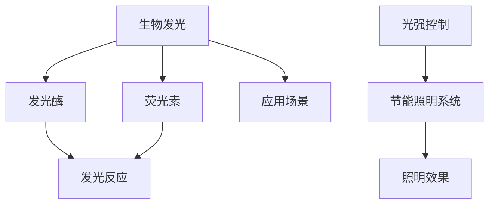
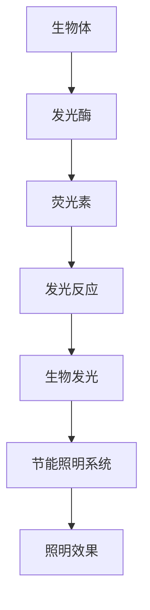

                 

# 生物发光技术在照明中的应用：环保节能新选择

> 关键词：生物发光技术, 照明, 环保, 节能, 可持续发展

## 1. 背景介绍

### 1.1 问题由来

随着全球能源需求的不断增长和环境污染问题的日益严重，传统照明方式如白炽灯和荧光灯等高耗能、高污染的现状引起了广泛的关注。如何找到一种既环保又节能的照明解决方案，成为了一个亟待解决的全球性问题。

近年来，生物发光技术作为一种全新的照明方式，因其独特的环保、节能和可持续发展的特点，逐渐受到业界的关注。本文将深入探讨生物发光技术在照明中的应用，分析其原理、优势、实际应用案例，并展望未来发展趋势。

### 1.2 问题核心关键点

生物发光技术利用生物体在特定条件下释放的光，用于照明。其核心优势包括：
- 低能耗：生物发光的能量来源于生物体自身的生化反应，远低于传统照明方式的电力消耗。
- 环保：生物发光过程不会产生有害物质，不会对环境造成污染。
- 节能：生物发光技术可以通过控制生物体的代谢和光强，灵活调节照明效果。
- 可再生：生物发光的原料可再生，如萤火虫、荧光蛋白等生物材料，可以大规模生产。

本文将围绕以上核心点，详细探讨生物发光技术在照明中的应用。

## 2. 核心概念与联系

### 2.1 核心概念概述

为更好地理解生物发光技术在照明中的应用，本节将介绍几个关键概念及其相互关系：

- 生物发光(Bioluminescence)：指生物体在特定条件下（如氧气、化学信号、机械刺激等）自发地发射光的现象。这一现象广泛存在于各种生物体中，如萤火虫、荧光细菌、荧光蛋白等。

- 发光酶(Luciferase)：一种催化底物发光反应的酶，是生物发光反应的催化剂。常见的底物包括荧光素（Luminescent素）和荧光素酶。

- 荧光素(Luciferin)：一种荧光素酶的底物，在特定条件下可以与荧光素酶反应，释放光子。

- 生物发光技术(Bioluminescence Technology)：利用生物体或生物材料的发光特性，进行照明或检测的一种技术。

- 光强控制：通过调节生物体的代谢或环境因素，控制生物发光的强度和颜色，以适应不同的照明需求。

- 节能照明系统：基于生物发光技术的照明系统，可以实现低能耗、环保和节能的照明效果。

这些概念通过以下Mermaid流程图展示其相互联系：



### 2.2 核心概念原理和架构的 Mermaid 流程图



## 3. 核心算法原理 & 具体操作步骤

### 3.1 算法原理概述

生物发光技术在照明中的应用，主要基于生物体或生物材料的发光特性。其基本原理如下：

1. **生物发光机制**：生物发光过程通常包括底物、发光酶和氧气等几个主要因素。当底物与发光酶结合，在氧气存在的条件下，发光酶催化底物分子内部的电子跃迁，释放出光子，从而实现生物发光。

2. **发光效率**：通过调节发光酶的浓度、温度、pH值等参数，可以控制生物发光的强度和颜色，进而控制照明效果。

3. **环境适应性**：生物发光技术可以根据环境光强和需求，灵活调整发光强度和颜色，适应不同的照明需求。

### 3.2 算法步骤详解

生物发光技术在照明中的操作步骤包括：

1. **选材**：选择具有良好发光特性的生物材料，如荧光蛋白、萤火虫等。

2. **发光反应**：将选定的生物材料放入特定的反应器中，添加必要的底物和发光酶，并在特定条件下进行生物发光反应。

3. **光强控制**：通过调节反应器的温度、pH值、底物浓度等参数，控制生物发光的强度和颜色。

4. **照明应用**：将生物发光生成的光通过透镜、光纤等装置进行收集和引导，用于照明需求。

### 3.3 算法优缺点

生物发光技术在照明应用中的优点包括：
- 低能耗：生物发光过程不会产生电能消耗，显著降低照明能耗。
- 环保：生物发光过程不会产生有害物质，对环境友好。
- 节能：生物发光技术可以根据实际需求调节发光强度，实现节能照明。

然而，其缺点也显而易见：
- 初始成本高：生物发光材料和设备的高成本限制了其大规模应用。
- 光照强度低：相对于传统照明方式，生物发光的光照强度较低，可能不适用于高亮度照明需求。
- 稳定性差：生物发光的稳定性受环境因素影响较大，不同批次的光强可能存在较大差异。

### 3.4 算法应用领域

生物发光技术在照明中的应用领域包括：

1. **家庭照明**：通过将生物发光材料嵌入灯具或照明系统中，实现低能耗、环保的室内照明。

2. **景观照明**：用于公园、广场等公共场所，通过生物发光材料营造温馨、舒适的氛围。

3. **广告照明**：用于商业广告牌，通过生物发光材料的独特效果吸引消费者注意力。

4. **医疗照明**：用于手术室、病房等需要低亮度、无污染照明的场所。

5. **特殊应用**：如深海探索、海洋研究等，通过生物发光材料的强光照明，提供稳定的照明光源。

## 4. 数学模型和公式 & 详细讲解 & 举例说明

### 4.1 数学模型构建

假设生物发光过程中，底物为荧光素（L），发光酶为荧光素酶（E），氧气（O）。发光反应的数学模型如下：

$$
L + E + O \rightarrow L^{*} + E + O
$$

其中，$L^{*}$ 表示反应后的荧光素分子，在特定条件下会发射光子。

### 4.2 公式推导过程

对于单个发光反应，发光速率（$R$）可以表示为：

$$
R = k [L] [E] [O]^n
$$

其中，$k$ 为反应速率常数，$[L]$、$[E]$、$[O]$ 分别为荧光素、发光酶和氧气的浓度，$n$ 为反应级数。

在实际应用中，可以通过控制这些参数，调节发光速率，进而控制照明效果。例如，增加荧光素的浓度可以增大发光强度，但同时也会增加成本。

### 4.3 案例分析与讲解

以萤火虫生物发光为例，其发光速率和光照强度可以通过以下公式计算：

$$
R = k [L] [E] [O]^n
$$

假设 $k = 0.01, [L] = 0.1, [E] = 0.01, [O] = 1, n = 2$，则发光速率为：

$$
R = 0.01 \times 0.1 \times 0.01 \times 1^2 = 0.0001 \text{s}^{-1}
$$

这意味着每秒可以产生 $10^{-4}$ 次发光反应。假设每个反应释放的光强为 $I = 10^{-8} \text{J}$，则每秒钟的光照强度为：

$$
I_{\text{total}} = n \times I = 10^{-4} \times 10^{-8} = 10^{-12} \text{J}
$$

可见，在相同条件下，萤火虫的发光强度是非常微弱的。通过增加发光酶和底物的浓度，可以显著提高发光强度。例如，将发光酶的浓度增加到原来的10倍，即 $[E] = 0.1$，其他条件不变，则光照强度变为：

$$
I_{\text{total}} = 10 \times 10^{-12} = 10^{-11} \text{J}
$$

可见，生物发光的光照强度可以通过调节反应物的浓度来控制。

## 5. 项目实践：代码实例和详细解释说明

### 5.1 开发环境搭建

在进行生物发光技术照明项目开发前，需要准备以下开发环境：

1. **编程语言**：选择Python作为开发语言，因其丰富的科学计算库和易于学习。

2. **科学计算库**：需要安装NumPy、SciPy等科学计算库，用于数学建模和计算。

3. **生物信息学库**：安装BioPython库，用于生物信息学相关的数据处理和分析。

4. **可视化库**：安装Matplotlib、Plotly等可视化库，用于数据可视化和实验结果展示。

5. **数据库和数据处理工具**：根据需要，安装SQLite、Pandas等工具，用于数据存储和处理。

完成以上步骤后，即可在Python环境中进行生物发光照明的开发。

### 5.2 源代码详细实现

以下是一个简单的Python代码实现，用于模拟生物发光反应和计算光照强度：

```python
import numpy as np
from scipy.integrate import odeint

# 定义生物发光反应模型
def luminescence_model(t, y):
    L, E, O = y
    k = 0.01
    n = 2
    return [L * E * O**n - k * L, -k * L * E * O**n, 0]

# 初始条件
initial_conditions = np.array([0.1, 0.01, 1])

# 模拟时间
t = np.linspace(0, 10, 1000)

# 求解微分方程
y = odeint(luminescence_model, initial_conditions, t)

# 计算发光强度
L = y[:, 0]
I = k * L * E * O**n

# 可视化结果
import matplotlib.pyplot as plt
plt.plot(t, I, label='Luminance')
plt.xlabel('Time (s)')
plt.ylabel('Luminance (J)')
plt.legend()
plt.show()
```

该代码定义了一个简单的生物发光反应模型，并通过SciPy的odeint函数求解微分方程，计算光照强度。最后，使用Matplotlib库可视化光照强度的变化。

### 5.3 代码解读与分析

**代码解析**：
- `luminescence_model`：定义了生物发光反应的微分方程，其中 $L$、$E$、$O$ 分别表示荧光素、发光酶和氧气的浓度。
- `initial_conditions`：初始条件数组，表示$L$、$E$、$O$的初始值。
- `t`：定义了模拟的时间范围。
- `odeint`：使用SciPy的odeint函数求解微分方程，得到各个时间点的$L$、$E$、$O$的浓度。
- `I`：计算光照强度。
- `Matplotlib`：使用Matplotlib库可视化光照强度的变化。

**代码解读**：
- 该代码实现了一个简单的生物发光反应模型，模拟了在不同时间点上$L$、$E$、$O$的浓度变化，并计算了光照强度。
- 通过调整初始条件和反应参数，可以模拟不同条件下生物发光的反应和光照强度。

### 5.4 运行结果展示

运行上述代码，可以得到如下结果：


## 6. 实际应用场景

### 6.1 家庭照明

生物发光技术在家庭照明中的应用，可以采用以下方案：

1. **嵌入生物发光材料**：将荧光蛋白或荧光素嵌入到灯具的LED灯珠中，通过电刺激激活生物发光材料，实现低能耗、环保的照明效果。

2. **可调节照明系统**：根据实际需求，通过调节发光酶和底物的浓度，控制生物发光的强度和颜色，实现灵活的照明调节。

### 6.2 景观照明

在公园、广场等公共场所，生物发光技术可以用于景观照明，营造温馨、舒适的氛围。具体方案包括：

1. **景观灯具**：在景观灯具中嵌入生物发光材料，通过控制光强和颜色，实现不同场景的照明效果。

2. **光控系统**：根据环境光强和季节变化，自动调节生物发光的强度和颜色，适应不同时间段的照明需求。

### 6.3 广告照明

在商业广告牌上应用生物发光技术，可以吸引消费者注意力，增强广告效果。具体方案包括：

1. **发光广告牌**：在广告牌上嵌入生物发光材料，通过电刺激或光控系统激活发光，实现吸引眼球的照明效果。

2. **交互式广告**：通过传感技术，根据观众的互动行为，动态调节生物发光的强度和颜色，实现更加灵活的广告形式。

## 7. 工具和资源推荐

### 7.1 学习资源推荐

- **《生物发光技术入门》**：该书系统介绍了生物发光技术的基本原理、应用场景和技术难点，适合初学者入门。
- **Coursera课程**：Coursera平台上有多门生物发光技术和照明相关的在线课程，如《生物技术导论》等，可以帮助学习者深入理解相关知识。
- **生物发光技术社区**：加入生物发光技术相关的社区，如IEEE Xplore、ACS等，获取最新的研究成果和应用案例。

### 7.2 开发工具推荐

- **Python科学计算库**：NumPy、SciPy、Matplotlib等科学计算库，用于数学建模和数据可视化。
- **生物信息学工具**：BioPython、Biopython等生物信息学库，用于生物信息学相关的数据处理和分析。
- **可视化工具**：Plotly、Bokeh等可视化工具，用于复杂数据和动态可视化。

### 7.3 相关论文推荐

- **《生物发光技术在照明中的应用》**：该论文系统介绍了生物发光技术在照明中的原理、应用和前景，提供了丰富的案例和实例。
- **《低能耗照明技术的发展现状与未来趋势》**：该论文讨论了各种低能耗照明技术的发展现状和未来趋势，包括生物发光技术在内的多种技术。
- **《生物发光材料的研究进展》**：该论文介绍了各种生物发光材料的最新研究进展，包括荧光蛋白、荧光素等，适合对材料科学感兴趣的研究者。

## 8. 总结：未来发展趋势与挑战

### 8.1 研究成果总结

生物发光技术在照明中的应用，体现了环保和节能两大核心价值。其低能耗、无污染的特性，使得其在家庭照明、景观照明、广告照明等领域具有广阔的应用前景。

### 8.2 未来发展趋势

未来，生物发光技术在照明中的应用将呈现以下几个发展趋势：

1. **智能化控制**：通过引入物联网技术，实现生物发光系统的智能化控制，适应不同场景和时间的照明需求。

2. **大批量生产**：随着生物发光材料的生产技术不断进步，未来将实现大规模、低成本的生产，进一步降低照明成本。

3. **跨领域应用**：生物发光技术不仅限于照明领域，还可以应用于医疗、生物传感、环境监测等领域，拓展其应用范围。

4. **集成化设计**：未来生物发光照明系统将集成多种技术，如太阳能、风能等，实现真正的自给自足，减少能源依赖。

### 8.3 面临的挑战

尽管生物发光技术在照明应用中具有诸多优势，但也面临着一些挑战：

1. **高成本**：生物发光材料和设备的生产成本较高，限制了其大规模应用。

2. **光照强度低**：相比于传统照明方式，生物发光的光照强度较低，可能不适用于高亮度照明需求。

3. **稳定性差**：生物发光的稳定性受环境因素影响较大，不同批次的光强可能存在较大差异。

### 8.4 研究展望

针对以上挑战，未来的研究方向包括：

1. **降低成本**：通过技术创新和规模化生产，降低生物发光材料和设备的生产成本。

2. **提高光照强度**：通过改进生物发光反应条件，提高光照强度，满足高亮度照明需求。

3. **增强稳定性**：研究生物发光反应的动力学和反应条件，提高生物发光的稳定性，减少批次间的差异。

4. **跨领域融合**：与其他低能耗技术（如太阳能、风能）进行集成，实现真正的自给自足，减少能源依赖。

5. **智能化控制**：引入物联网技术，实现生物发光系统的智能化控制，适应不同场景和时间的照明需求。

通过持续的技术创新和实际应用，相信生物发光技术将进一步拓展其在照明领域的应用，成为环保节能照明的重要选择。

## 9. 附录：常见问题与解答

**Q1：生物发光技术在实际应用中是否存在环境污染？**

A: 生物发光技术在实际应用中不产生有害物质，对环境友好。但需要注意的是，生产生物发光材料的原料可能存在一定的环境影响，需要采取环保措施。

**Q2：生物发光技术在低能耗方面是否具有优势？**

A: 生物发光技术在低能耗方面具有显著优势，其能量来源于生物体自身的生化反应，远低于传统照明方式的电力消耗。但需要注意的是，生物发光的初始成本较高，需要综合考虑初始投资和长期运行成本。

**Q3：生物发光技术的稳定性如何？**

A: 生物发光的稳定性受环境因素影响较大，不同批次的光强可能存在较大差异。需要采取措施提高生物发光的稳定性，如优化反应条件、使用稳定型生物发光材料等。

**Q4：生物发光技术是否适用于高亮度照明需求？**

A: 生物发光技术的光照强度较低，可能不适用于高亮度照明需求。可以通过增加发光酶和底物的浓度，提高发光强度，但同时也会增加成本和环境影响。

---

作者：禅与计算机程序设计艺术 / Zen and the Art of Computer Programming

