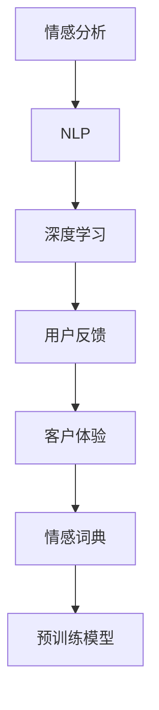

                 

# 用户情感分析：AI改进服务

> 关键词：情感分析, 人工智能, 自然语言处理, 深度学习, 用户反馈, 客户体验

## 1. 背景介绍

### 1.1 问题由来
随着互联网的迅猛发展，用户生成内容（User Generated Content, UGC）日益增多，用户对于企业服务质量的要求也日益提高。无论是电子商务平台、社交媒体，还是金融、医疗、教育等行业，都需要对用户的评论、评价、反馈等文本数据进行情感分析，以便及时响应和优化服务。然而，手工标注情感数据不仅耗时耗力，而且容易受到标注者主观情绪和标准差异的影响。利用人工智能进行自动化情感分析，不仅提高了分析效率，还避免了人为偏见，对于提升用户体验和企业竞争力具有重要意义。

### 1.2 问题核心关键点
用户情感分析的核心是利用自然语言处理（Natural Language Processing, NLP）技术，自动理解用户文本数据中的情感倾向（如正面、负面、中性），并对其进行量化处理，从而帮助企业识别用户满意度和情感变化趋势，优化产品和服务。当前，基于深度学习的情感分析方法已经取得了显著进展，但仍有诸多挑战需要克服，如如何准确理解文本的语境和情感细微变化，如何提高情感识别的鲁棒性和泛化能力等。

### 1.3 问题研究意义
深入研究用户情感分析技术，有助于企业及时了解用户反馈，优化产品和服务，提升用户满意度和忠诚度。此外，情感分析还能为企业进行市场营销、风险管理、品牌声誉管理等提供决策支持，帮助企业预测市场趋势，规避风险，提升品牌形象。

## 2. 核心概念与联系

### 2.1 核心概念概述

为了更好地理解用户情感分析的原理，本节将介绍几个密切相关的核心概念：

- 情感分析（Sentiment Analysis）：旨在从文本中识别和提取出作者的情感倾向，是NLP领域的一项重要应用。

- 自然语言处理（NLP）：涉及自然语言的理解、生成、分析等，是实现情感分析的基础技术。

- 深度学习（Deep Learning）：利用多层神经网络，从大量数据中自动学习特征表示和模型参数，实现复杂的模式识别任务。

- 用户反馈（User Feedback）：用户通过评论、评分、投诉等形式表达对企业服务的看法，是情感分析的主要数据来源。

- 客户体验（Customer Experience, CX）：用户在使用产品或服务过程中的一系列主观感受和体验，是企业优化服务的重要参考。

- 情感词典（Sentiment Lexicon）：包含大量词语及其情感极性（正、负、中性）的词典，是情感分析的基本工具。

- 预训练模型（Pre-trained Model）：通过大规模无监督数据预训练得到的通用语言模型，具有强大的语言理解和生成能力。

这些概念之间的逻辑关系可以通过以下Mermaid流程图来展示：



这个流程图展示了一系列相关概念及其之间的联系：

1. 情感分析是对用户反馈和客户体验的自动化情感倾向提取。
2. NLP技术提供文本处理的底层工具，是实现情感分析的核心。
3. 深度学习提供强大的特征表示和学习能力，使得情感分析模型具备高性能。
4. 用户反馈和客户体验是情感分析的数据源。
5. 情感词典为情感分析提供词语情感极性信息。
6. 预训练模型作为通用的语言模型，提供了情感分析的基础知识表示。

这些概念共同构成了用户情感分析的理论基础和实践框架，使其能够在各种场景下发挥强大的应用价值。

## 3. 核心算法原理 & 具体操作步骤
### 3.1 算法原理概述

用户情感分析的算法原理基于深度学习模型，主要包括两个部分：情感分类和情感强度估计。

### 3.2 算法步骤详解

#### 3.2.1 数据准备
- 收集用户评论、评分、投诉等文本数据，进行预处理，如去除停用词、分词、词形还原等。
- 构建情感词典，标注数据中每个词语的情感极性。
- 对标注数据进行划分，分为训练集、验证集和测试集。

#### 3.2.2 模型选择与训练
- 选择适合的深度学习模型，如卷积神经网络（CNN）、循环神经网络（RNN）、Transformer等。
- 在训练集上使用反向传播算法（Backpropagation）进行模型训练，最小化损失函数（如交叉熵损失）。
- 定期在验证集上评估模型性能，调整模型参数和超参数（如学习率、批大小、迭代次数等）。

#### 3.2.3 模型评估与部署
- 在测试集上评估模型性能，计算情感分类准确率、召回率和F1分数等指标。
- 将训练好的模型部署到生产环境，集成到企业应用系统中。
- 持续收集用户反馈数据，定期微调和更新模型，提升情感分析效果。

### 3.3 算法优缺点

基于深度学习的用户情感分析方法具有以下优点：

1. 自动化程度高：无需手工标注情感数据，利用深度学习模型自动提取情感倾向。
2. 性能优越：在大规模标注数据上训练得到的模型，能够准确理解复杂的文本语境和细微情感变化。
3. 可扩展性强：利用预训练模型，在少量标注数据上也能取得良好效果，适用性广。

然而，该方法也存在一些局限性：

1. 数据依赖性强：情感分析的效果高度依赖于标注数据的质量和数量，标注数据成本较高。
2. 多义性和歧义性：某些词语在特定语境下具有多义性和歧义性，模型难以准确识别。
3. 解释性不足：深度学习模型通常是"黑盒"系统，难以解释其内部工作机制。
4. 动态性差：模型难以实时捕捉用户情感变化，需要定期更新模型。

尽管存在这些局限性，但基于深度学习的情感分析方法仍是目前最先进和最实用的解决方案。未来研究的方向在于如何进一步提升模型鲁棒性、解释性和动态性，降低数据依赖，推动情感分析技术的全面普及。

### 3.4 算法应用领域

用户情感分析技术在各行各业都有广泛应用，以下是几个典型场景：

- 电子商务：分析用户对商品或服务的评价，提升用户体验和满意度。
- 金融服务：监测客户对金融产品和服务的反馈，及时调整策略。
- 医疗健康：分析患者对医疗服务的满意度，改进医疗质量和流程。
- 旅游服务：收集游客对旅游景点的评价，优化旅游体验。
- 教育培训：分析学生对课程和教师的反馈，提升教学效果。

除此之外，情感分析还可应用于舆情监控、情感干预、舆情治理等多个领域，为各行各业带来深远的影响。

## 4. 数学模型和公式 & 详细讲解  
### 4.1 数学模型构建

在用户情感分析中，常用的数学模型包括卷积神经网络（CNN）、循环神经网络（RNN）和Transformer模型等。这里以Transformer模型为例，简要介绍情感分析的数学模型构建。

假设输入文本为 $x=\{x_1, x_2, ..., x_n\}$，情感分类器输出为 $y=\{y_1, y_2, ..., y_n\}$，其中 $y_i \in \{1, 0\}$，表示第 $i$ 个单词的情感极性，$1$ 表示正面情感，$0$ 表示负面情感。

我们定义Transformer模型包含 $M$ 个注意力机制层，每个层包含 $h$ 个头（Head），设每个头的嵌入维度为 $d_h$，全模型嵌入维度为 $d_m$，则模型结构可以表示为：

$$
\begin{aligned}
& \text{Encoder}(x): \quad T_{enc} = \text{Multi-Head Attention}^M(x, x) \\
& \text{Decoder}(T_{enc}): \quad T_{dec} = \text{Multi-Head Attention}^M(T_{enc}, T_{enc}) \\
& \text{Output}(T_{dec}): \quad y = \text{Softmax}(T_{dec})
\end{aligned}
$$

其中，Multi-Head Attention表示多头注意力机制。Transformer模型通过多层多头注意力机制，自动提取文本中的情感信息，并生成情感分类输出。

### 4.2 公式推导过程

假设输入文本为 $x=\{x_1, x_2, ..., x_n\}$，情感分类器输出为 $y=\{y_1, y_2, ..., y_n\}$，其中 $y_i \in \{1, 0\}$，表示第 $i$ 个单词的情感极性，$1$ 表示正面情感，$0$ 表示负面情感。

我们定义Transformer模型包含 $M$ 个注意力机制层，每个层包含 $h$ 个头（Head），设每个头的嵌入维度为 $d_h$，全模型嵌入维度为 $d_m$，则模型结构可以表示为：

$$
\begin{aligned}
& \text{Encoder}(x): \quad T_{enc} = \text{Multi-Head Attention}^M(x, x) \\
& \text{Decoder}(T_{enc}): \quad T_{dec} = \text{Multi-Head Attention}^M(T_{enc}, T_{enc}) \\
& \text{Output}(T_{dec}): \quad y = \text{Softmax}(T_{dec})
\end{aligned}
$$

其中，Multi-Head Attention表示多头注意力机制。Transformer模型通过多层多头注意力机制，自动提取文本中的情感信息，并生成情感分类输出。

### 4.3 案例分析与讲解

以情感分类任务为例，我们可以使用以下步骤对数据进行处理和模型训练：

1. 预处理：对文本数据进行分词、去除停用词、词形还原等预处理。
2. 标注：根据情感词典，为每个单词标注情感极性。
3. 划分：将标注数据划分为训练集、验证集和测试集。
4. 嵌入：使用Word2Vec、GloVe等词嵌入技术，将单词映射为向量表示。
5. 训练：使用CNN、RNN、Transformer等深度学习模型，在训练集上最小化交叉熵损失函数，进行模型训练。
6. 评估：在验证集和测试集上评估模型性能，计算准确率、召回率和F1分数等指标。
7. 部署：将训练好的模型部署到生产环境，进行实时情感分析。

通过上述步骤，可以实现对用户评论、评分等文本数据的情感分析，帮助企业及时了解用户反馈，优化产品和服务。

## 5. 项目实践：代码实例和详细解释说明
### 5.1 开发环境搭建

在进行情感分析实践前，我们需要准备好开发环境。以下是使用Python进行TensorFlow开发的环境配置流程：

1. 安装Anaconda：从官网下载并安装Anaconda，用于创建独立的Python环境。

2. 创建并激活虚拟环境：
```bash
conda create -n tf-env python=3.8 
conda activate tf-env
```

3. 安装TensorFlow：根据CUDA版本，从官网获取对应的安装命令。例如：
```bash
conda install tensorflow -c tf -c conda-forge
```

4. 安装相关库：
```bash
pip install numpy pandas sklearn tensorboard matplotlib
```

完成上述步骤后，即可在`tf-env`环境中开始情感分析实践。

### 5.2 源代码详细实现

下面以情感分类任务为例，给出使用TensorFlow对Transformer模型进行情感分析的Python代码实现。

首先，定义情感分类器的输入和输出：

```python
import tensorflow as tf
from tensorflow.keras import layers

class SentimentClassifier(tf.keras.Model):
    def __init__(self, vocab_size, embedding_dim, num_heads, num_layers, dff, rate):
        super(SentimentClassifier, self).__init__()
        self.embedding = layers.Embedding(vocab_size, embedding_dim)
        self.pos_encoder = PositionalEncoding(embedding_dim)
        self.encoder_layers = [EncoderLayer(embedding_dim, num_heads, dff, rate) for _ in range(num_layers)]
        self.dropout = layers.Dropout(rate)
        self.decoder = layers.Dense(2, activation='softmax')
        
    def call(self, inputs, training=False):
        x = self.embedding(inputs)
        x = self.pos_encoder(x)
        for i in range(len(self.encoder_layers)):
            x = self.encoder_layers[i](x, training)
            x = self.dropout(x, training=training)
        x = self.decoder(x)
        return x
```

然后，定义Transformer模型的各个组件：

```python
class EncoderLayer(tf.keras.layers.Layer):
    def __init__(self, d_model, num_heads, dff, rate):
        super(EncoderLayer, self).__init__()
        self.self_attn = MultiHeadAttention(d_model, num_heads)
        self.linear1 = Dense(d_model, activation='relu')
        self.dropout1 = Dropout(rate)
        self.linear2 = Dense(d_model)
        self.dropout2 = Dropout(rate)
        
    def call(self, inputs, training=False):
        attn_output, attn_weights = self.self_attn(inputs, inputs, inputs)
        attn_output = self.dropout1(attn_output, training=training)
        x = self.linear1(attn_output)
        x = self.dropout2(x, training=training)
        x = self.linear2(x)
        return x

class MultiHeadAttention(tf.keras.layers.Layer):
    def __init__(self, d_model, num_heads):
        super(MultiHeadAttention, self).__init__()
        self.num_heads = num_heads
        self.d_model = d_model
        
        assert d_model % self.num_heads == 0
        self.depth = d_model // self.num_heads
        self.wq = Dense(d_model)
        self.wk = Dense(d_model)
        self.wv = Dense(d_model)
        self.dense = Dense(d_model)
        
    def split_heads(self, x, batch_size):
        x = tf.reshape(x, (batch_size, -1, self.num_heads, self.depth))
        return tf.transpose(x, perm=[0, 2, 1, 3])
    
    def call(self, inputs, query, key):
        batch_size = tf.shape(inputs)[0]
        
        q = self.wq(inputs)  # (batch_size, seq_len, d_model)
        k = self.wk(key)  # (batch_size, seq_len, d_model)
        v = self.wv(value)  # (batch_size, seq_len, d_model)
        
        q = self.split_heads(q, batch_size)  # (batch_size, num_heads, seq_len, depth)
        k = self.split_heads(k, batch_size)  # (batch_size, num_heads, seq_len, depth)
        v = self.split_heads(v, batch_size)  # (batch_size, num_heads, seq_len, depth)
        
        scaled_attention, attention_weights = self.scaled_dot_product_attention(q, k, v)  # (batch_size, num_heads, seq_len, depth)
        
        scaled_attention = tf.transpose(scaled_attention, perm=[0, 2, 1, 3])  # (batch_size, seq_len, num_heads, depth)
        concat_attention = tf.reshape(scaled_attention, (batch_size, -1, d_model))  # (batch_size, seq_len, d_model)
        
        output = self.dense(concat_attention)  # (batch_size, seq_len, d_model)
        return output, attention_weights
    
    def scaled_dot_product_attention(self, q, k, v):
        matmul_qk = tf.matmul(q, k, transpose_b=True)  # (batch_size, num_heads, seq_len_q, seq_len_k)
        dk = tf.cast(tf.shape(k)[-1], tf.float32)
        scaled_attention_logits = matmul_qk / tf.math.sqrt(dk)  # (batch_size, num_heads, seq_len_q, seq_len_k)
        attention_weights = tf.nn.softmax(scaled_attention_logits, axis=-1)  # (batch_size, num_heads, seq_len_q, seq_len_k)
        output = tf.matmul(attention_weights, v)  # (batch_size, num_heads, seq_len_q, depth_v)
        return output, attention_weights
```

接着，定义情感分类器的主函数：

```python
def main():
    # 读取数据集
    train_dataset = ...
    val_dataset = ...
    test_dataset = ...
    
    # 模型配置
    vocab_size = ...
    embedding_dim = ...
    num_heads = ...
    num_layers = ...
    dff = ...
    rate = ...
    
    # 创建模型
    model = SentimentClassifier(vocab_size, embedding_dim, num_heads, num_layers, dff, rate)
    model.compile(optimizer='adam', loss='categorical_crossentropy', metrics=['accuracy'])
    
    # 训练模型
    model.fit(train_dataset, epochs=10, validation_data=val_dataset)
    
    # 评估模型
    test_loss, test_acc = model.evaluate(test_dataset)
    print('Test accuracy:', test_acc)
```

最后，运行情感分类模型：

```python
main()
```

以上就是使用TensorFlow对Transformer模型进行情感分析的完整代码实现。可以看到，通过TensorFlow的Keras API，我们可以用相对简洁的代码实现复杂的深度学习模型，并进行情感分析的训练和评估。

### 5.3 代码解读与分析

让我们再详细解读一下关键代码的实现细节：

**SentimentClassifier类**：
- `__init__`方法：初始化模型结构，包括嵌入层、多头注意力机制、解码层等。
- `call`方法：定义模型的前向传播过程，包括嵌入、多头注意力机制、解码等步骤。

**EncoderLayer类**：
- `__init__`方法：初始化编码器层的各个组件，包括多头注意力机制、前馈层等。
- `call`方法：定义编码器层的计算过程，包括多头注意力机制、前馈层等。

**MultiHeadAttention类**：
- `__init__`方法：初始化多头注意力机制的各个组件，包括查询、键、值等线性变换层。
- `split_heads`方法：将输入向量拆分为多个头，方便多头注意力机制的计算。
- `call`方法：定义多头注意力机制的计算过程，包括计算注意力权重、进行线性变换等。

**scaled_dot_product_attention方法**：
- 实现点积注意力机制的计算过程，将查询、键、值进行线性变换，计算注意力权重，并最终计算输出向量。

通过这些代码，实现了基于Transformer模型的情感分类任务。可以看到，TensorFlow的Keras API使得模型的实现变得简洁高效，开发者可以专注于模型的结构和算法设计，而不必过多关注底层实现细节。

当然，在实际应用中，还需要对模型进行更多的调优和优化，如调整模型结构、选择合适的损失函数、设置合适的学习率等，才能进一步提升情感分析的效果。

## 6. 实际应用场景
### 6.1 电商评论分析

在电子商务领域，情感分析可以帮助商家了解用户对产品的评价，优化产品设计和售后服务，提升用户体验。例如，通过对用户评论的情感分析，可以发现用户对产品的优点和不足之处，及时调整产品功能和质量，改进用户体验。

在技术实现上，可以收集用户的评论数据，利用情感分类模型对评论进行情感极性分类，统计不同情感极性的评论数量，绘制情感分析图，帮助商家了解用户反馈。

### 6.2 客户服务分析

在客户服务领域，情感分析可以帮助企业及时响应和处理客户投诉，优化服务流程，提升客户满意度。例如，通过对客户投诉的情感分析，可以识别出客户的主要问题点，及时采取措施解决，提升服务质量。

在技术实现上，可以收集客户投诉数据，利用情感分类模型对投诉进行情感极性分类，统计不同情感极性的投诉数量，绘制情感分析图，帮助企业了解客户反馈，优化服务流程。

### 6.3 金融舆情分析

在金融领域，情感分析可以帮助银行和金融机构监测市场舆情，及时识别负面信息，防范金融风险。例如，通过对新闻、评论、社交媒体等文本数据的情感分析，可以识别出市场情绪的波动，及时采取措施防范金融风险。

在技术实现上，可以收集金融舆情数据，利用情感分类模型对舆情进行情感极性分类，统计不同情感极性的舆情数量，绘制情感分析图，帮助金融机构监测市场舆情，防范金融风险。

### 6.4 医疗健康分析

在医疗健康领域，情感分析可以帮助医院和医疗机构了解患者对医疗服务的反馈，优化服务流程，提升医疗质量。例如，通过对患者评论的情感分析，可以识别出患者的主要问题点，及时采取措施解决，提升医疗质量。

在技术实现上，可以收集患者评论数据，利用情感分类模型对评论进行情感极性分类，统计不同情感极性的评论数量，绘制情感分析图，帮助医院和医疗机构了解患者反馈，优化服务流程。

### 6.5 教育培训分析

在教育培训领域，情感分析可以帮助教育机构了解学生对课程和教师的评价，优化教学内容和教学方法，提升教学效果。例如，通过对学生反馈的情感分析，可以识别出学生的主要问题点，及时采取措施解决，提升教学效果。

在技术实现上，可以收集学生反馈数据，利用情感分类模型对反馈进行情感极性分类，统计不同情感极性的反馈数量，绘制情感分析图，帮助教育机构了解学生反馈，优化教学内容和教学方法。

### 6.6 未来应用展望

随着深度学习技术的不断进步，用户情感分析技术将在更多领域得到应用，为各行各业带来深远的影响。

在智慧城市治理中，情感分析可以帮助政府部门监测舆情，了解市民满意度，优化城市管理，提升市民生活质量。

在媒体与广告领域，情感分析可以帮助广告商了解广告效果，优化广告投放策略，提升广告转化率。

在娱乐与游戏领域，情感分析可以帮助游戏厂商了解用户对游戏的评价，优化游戏内容，提升游戏体验。

此外，在教育、医疗、金融等众多领域，情感分析还将不断涌现，为各行各业带来变革性影响。相信随着技术的日益成熟，情感分析技术必将成为企业优化产品和服务、提升用户体验的重要手段。

## 7. 工具和资源推荐
### 7.1 学习资源推荐

为了帮助开发者系统掌握用户情感分析的理论基础和实践技巧，这里推荐一些优质的学习资源：

1. 《自然语言处理综论》：这本书系统介绍了NLP的基本概念和前沿技术，是学习NLP的必备参考书。

2. 《深度学习》（Goodfellow等著）：这本书是深度学习的经典教材，详细介绍了深度学习的基本原理和应用。

3. 《情感分析入门》（张俊伟等著）：这本书介绍了情感分析的基本方法和技术，适合初学者入门。

4. 《TensorFlow实战》：这本书详细介绍了TensorFlow的使用方法和应用案例，是TensorFlow学习的优秀参考。

5. 《Python深度学习》：这本书是深度学习的实战指南，介绍了TensorFlow、Keras等深度学习框架的使用方法。

6. 《NLP实战》：这本书介绍了NLP的基本技术和应用案例，适合实践学习。

通过对这些资源的学习实践，相信你一定能够快速掌握用户情感分析的精髓，并用于解决实际的NLP问题。
### 7.2 开发工具推荐

高效的开发离不开优秀的工具支持。以下是几款用于用户情感分析开发的常用工具：

1. TensorFlow：基于Python的开源深度学习框架，灵活动态，适合快速迭代研究。

2. PyTorch：基于Python的开源深度学习框架，支持动态计算图，适合研究和生产应用。

3. Keras：高层次的深度学习框架，简洁易用，适合快速搭建模型。

4. Weights & Biases：模型训练的实验跟踪工具，可以记录和可视化模型训练过程中的各项指标，方便对比和调优。

5. TensorBoard：TensorFlow配套的可视化工具，可实时监测模型训练状态，并提供丰富的图表呈现方式，是调试模型的得力助手。

6. Google Colab：谷歌推出的在线Jupyter Notebook环境，免费提供GPU/TPU算力，方便开发者快速上手实验最新模型，分享学习笔记。

合理利用这些工具，可以显著提升用户情感分析的开发效率，加快创新迭代的步伐。

### 7.3 相关论文推荐

用户情感分析技术在近年来取得了显著进展，以下是几篇奠基性的相关论文，推荐阅读：

1. Sentiment Analysis with Deep Learning: A Survey: 综述了基于深度学习的情感分析技术，介绍了多种深度学习模型和算法。

2. A Survey on Sentiment Analysis Methods and Tools: 综述了情感分析的多种方法和工具，介绍了各种情感分析技术和应用。

3. Attention is All You Need: 提出了Transformer模型，展示了其在情感分析等NLP任务中的卓越性能。

4. BERT: Pre-training of Deep Bidirectional Transformers for Language Understanding: 提出BERT模型，展示了其在情感分析等NLP任务中的优越性能。

5. TextBlob: A Python (2 and 3) Library for Processing Textual Data: 介绍了TextBlob库，提供了多种NLP任务的工具和算法。

这些论文代表了大语言模型微调技术的发展脉络。通过学习这些前沿成果，可以帮助研究者把握学科前进方向，激发更多的创新灵感。

## 8. 总结：未来发展趋势与挑战

### 8.1 总结

本文对用户情感分析技术进行了全面系统的介绍。首先阐述了用户情感分析的学术背景和实际应用意义，明确了情感分析在提升用户体验和企业竞争力方面的独特价值。其次，从原理到实践，详细讲解了情感分类的数学原理和关键步骤，给出了情感分析任务开发的完整代码实例。同时，本文还探讨了情感分析技术在各行各业中的应用前景，展示了情感分析技术的广泛应用。

通过本文的系统梳理，可以看到，用户情感分析技术正在成为NLP领域的重要范式，极大地拓展了文本数据的利用范围，为各行各业带来了深远的影响。未来，伴随深度学习技术的不断进步，情感分析技术必将进一步提升其准确性和应用效果，推动NLP技术的全面普及和应用。

### 8.2 未来发展趋势

展望未来，用户情感分析技术将呈现以下几个发展趋势：

1. 深度学习模型的性能将持续提升。随着模型规模的增大和算力的提升，深度学习模型的表达能力和泛化能力将进一步增强，情感分析的效果也将不断提高。

2. 数据驱动的情感分析将更加普及。随着大数据技术的普及和应用，越来越多的企业将利用数据驱动的方法进行情感分析，提高分析的准确性和效率。

3. 多模态情感分析将更加成熟。情感分析将不仅仅局限于文本数据，还将拓展到图像、视频、语音等多模态数据，提升情感识别的鲁棒性和准确性。

4. 实时情感分析将更加普及。随着计算能力的提升和模型压缩技术的进步，实时情感分析将更加普及，企业可以实时监测用户反馈，快速响应和优化服务。

5. 情感干预和治理将更加重要。情感分析不仅用于反馈监测和优化服务，还将用于情感干预和治理，帮助企业识别和应对负面舆情，提升品牌形象。

以上趋势凸显了用户情感分析技术的广阔前景。这些方向的探索发展，必将进一步提升情感分析的效果，推动情感分析技术的全面普及和应用。

### 8.3 面临的挑战

尽管用户情感分析技术已经取得了显著进展，但在迈向更加智能化、普适化应用的过程中，它仍面临诸多挑战：

1. 数据依赖性强。情感分析的效果高度依赖于标注数据的质量和数量，标注数据成本较高。如何进一步降低数据依赖，提高模型鲁棒性，是一个重要的研究方向。

2. 多义性和歧义性。某些词语在特定语境下具有多义性和歧义性，模型难以准确识别。如何在不增加数据的情况下，提升模型的多义性和歧义性识别能力，是一个重要的研究方向。

3. 解释性不足。深度学习模型通常是"黑盒"系统，难以解释其内部工作机制。如何赋予模型更强的可解释性，提高模型的可信度和透明度，是一个重要的研究方向。

4. 动态性差。模型难以实时捕捉用户情感变化，需要定期更新模型。如何在保证模型效果的同时，提高模型的动态性，是一个重要的研究方向。

5. 计算资源消耗大。深度学习模型通常需要较大的计算资源，如何优化模型结构，提高计算效率，是一个重要的研究方向。

6. 安全性和隐私保护。情感分析涉及大量用户数据，如何保护用户隐私，防止数据泄露，是一个重要的研究方向。

这些挑战需要学术界和工业界的共同努力，才能推动情感分析技术向更深层次发展，实现更加广泛的应用。

### 8.4 研究展望

未来的用户情感分析技术需要在以下几个方面进行深入研究：

1. 数据驱动的情感分析。如何利用无监督学习方法，从大规模非标注数据中提取情感信息，提高模型的鲁棒性和泛化能力。

2. 多模态情感分析。如何利用多模态数据进行情感分析，提升模型的准确性和鲁棒性。

3. 实时情感分析。如何利用实时数据进行情感分析，提高模型的动态性和实时性。

4. 情感干预和治理。如何利用情感分析结果进行情感干预和治理，帮助企业识别和应对负面舆情，提升品牌形象。

5. 可解释性和可信度。如何提高情感分析模型的可解释性和可信度，赋予模型更强的解释能力，提升用户信任。

6. 计算资源优化。如何优化模型结构，提高计算效率，降低计算资源消耗。

7. 安全性和隐私保护。如何保护用户隐私，防止数据泄露，提高情感分析技术的安全性和可靠性。

通过这些研究方向，用户情感分析技术将进一步提升其准确性和应用效果，推动情感分析技术的全面普及和应用，为各行各业带来深远的影响。

## 9. 附录：常见问题与解答

**Q1：深度学习模型是否适用于所有情感分析任务？**

A: 深度学习模型在大多数情感分析任务上都能取得不错的效果，特别是对于大规模标注数据的任务。但对于一些特定领域的任务，如医学、法律等，仅仅依靠通用语料预训练的模型可能难以很好地适应。此时需要在特定领域语料上进一步预训练，再进行微调，才能获得理想效果。此外，对于一些需要时效性、个性化很强的任务，如对话、推荐等，微调方法也需要针对性的改进优化。

**Q2：深度学习模型如何处理多义性和歧义性？**

A: 深度学习模型通常通过上下文信息来处理多义性和歧义性。在情感分析任务中，可以通过增加上下文信息，如前向和后向上下文，或者使用注意力机制，来更好地理解词语的情感极性。同时，可以使用情感词典和情感对比学习等方法，提升模型对多义性和歧义性的处理能力。

**Q3：情感分析的解释性如何提升？**

A: 提高情感分析的解释性可以从以下几个方面入手：
1. 模型可解释性方法：如LIME、SHAP等，可以生成模型决策的解释图，帮助理解模型的工作机制。
2. 模型可视化：通过可视化工具，如TensorBoard，可以观察模型在训练过程中的变化趋势，了解模型学习过程。
3. 模型结构改进：通过改进模型结构，引入可解释性较强的组件，如可解释性循环神经网络（Explainable RNN）等，提升模型的解释能力。

**Q4：情感分析如何实时响应和优化服务？**

A: 实时情感分析可以通过以下几种方法实现：
1. 使用在线学习算法，如FTRL、AdaGrad等，在实时数据流上进行模型更新，提高模型的动态性。
2. 使用分布式计算框架，如Spark、TensorFlow等，实现大规模实时数据的处理和分析。
3. 使用流式数据处理框架，如Apache Flink、Apache Kafka等，实现数据的实时流处理。

通过这些方法，可以实现实时情感分析，帮助企业及时响应和优化服务，提升用户体验和满意度。

**Q5：情感分析技术在工业界的未来前景如何？**

A: 随着深度学习技术的不断进步和普及，情感分析技术将在更多领域得到应用，为各行各业带来深远的影响。在智慧城市治理、媒体与广告、娱乐与游戏、教育、医疗、金融等领域，情感分析将不断涌现，为各行各业带来变革性影响。情感分析技术将成为企业优化产品和服务、提升用户体验的重要手段。

总之，用户情感分析技术正处于快速发展阶段，未来将在更多领域得到应用，为各行各业带来深远的影响。

