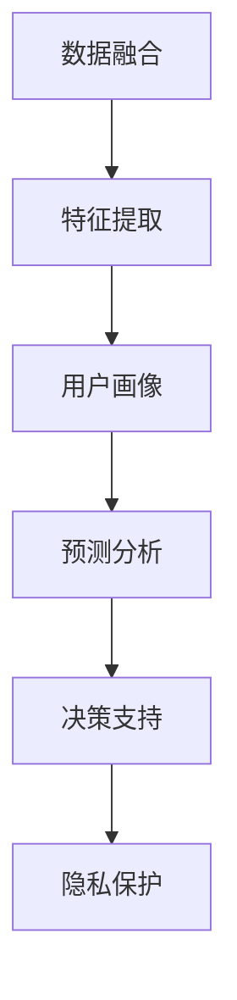

                 

# 用户画像技术：AI的应用

> 关键词：用户画像, 人工智能, 数据科学, 个性化推荐, 行为分析, 决策支持, 客户体验优化, 用户行为预测

## 1. 背景介绍

### 1.1 问题由来

随着互联网和数字技术的快速发展，用户数据成为企业获取竞争优势的关键资源。然而，如何从海量数据中提取有价值的信息，理解用户需求和行为模式，成为企业面临的重要挑战。用户画像技术通过收集和分析用户数据，构建用户的行为、偏好、兴趣等多维画像，为个性化推荐、精准营销、客户服务优化等提供了强有力的支持。AI技术的应用，使得用户画像技术进一步智能化、自动化，提升了数据处理和分析的效率和准确性。

### 1.2 问题核心关键点

用户画像技术的核心在于通过数据驱动的方式，刻画用户的多维特征，从而更全面地理解用户需求和行为模式。AI的应用使得用户画像技术能够更好地处理和分析数据，自动化地构建和更新用户画像。此外，AI技术的应用还带来了以下几个关键点：

1. **数据融合与清洗**：AI技术能够自动整合来自不同渠道的数据，并进行去重、清洗和预处理，确保数据的准确性和一致性。
2. **自动化特征提取**：AI算法可以自动提取数据中的关键特征，如用户的浏览记录、购买历史、社交媒体互动等，减少人工干预和错误。
3. **动态画像更新**：AI技术能够实时更新用户画像，根据用户最新的行为和反馈进行动态调整，保持画像的时效性。
4. **预测分析与决策支持**：AI模型可以基于用户画像进行预测分析，如用户行为预测、推荐系统优化、客户流失预警等，提供智能化的决策支持。
5. **用户隐私保护**：AI技术能够自动检测和处理数据中的隐私信息，确保用户数据的安全和合规。

这些关键点共同构成了用户画像技术在AI时代的全面应用，为企业提供了更精准、高效的用户洞察。

## 2. 核心概念与联系

### 2.1 核心概念概述

为了更好地理解用户画像技术及其在AI中的应用，本节将介绍几个关键概念：

- **用户画像（User Profile）**：通过收集和分析用户数据，构建用户的行为、偏好、兴趣等多维画像，帮助企业更好地理解用户需求和行为模式。
- **数据融合（Data Fusion）**：整合来自不同渠道和格式的数据，消除冗余，填补缺失，提升数据的一致性和完整性。
- **特征提取（Feature Extraction）**：从原始数据中提取出有意义的特征，用于刻画用户的多维特征。
- **预测分析（Predictive Analytics）**：使用AI模型对用户未来行为进行预测，为个性化推荐、客户流失预警等提供支持。
- **决策支持（Decision Support）**：基于用户画像和预测分析结果，提供智能化的决策建议，优化业务流程和运营策略。
- **隐私保护（Privacy Protection）**：确保用户数据的隐私和安全，避免数据泄露和滥用。

这些核心概念之间的逻辑关系可以通过以下Mermaid流程图来展示：



这个流程图展示了几项关键技术之间的联系：

1. **数据融合**：整合和清洗用户数据，为特征提取和用户画像构建提供基础。
2. **特征提取**：自动提取数据中的关键特征，刻画用户的多维画像。
3. **用户画像**：根据提取的特征构建用户的综合画像，为预测分析和决策支持提供依据。
4. **预测分析**：基于用户画像预测用户行为，提供个性化推荐和预警。
5. **决策支持**：利用预测分析结果优化业务决策，提升运营效率。
6. **隐私保护**：确保用户数据的安全和合规，保护用户隐私。

这些概念共同构成了用户画像技术的核心框架，使得企业在AI的帮助下，能够更全面、高效地理解和管理用户数据。

## 3. 核心算法原理 & 具体操作步骤

### 3.1 算法原理概述

用户画像技术的核心算法主要涉及数据融合、特征提取、用户画像构建、预测分析和决策支持等多个环节。AI技术的应用使得这些算法能够自动化、智能化地实现，提升了整体的处理效率和准确性。

- **数据融合算法**：包括数据清洗、去重、归一化等步骤，确保不同数据源提供的数据一致性和完整性。
- **特征提取算法**：使用机器学习、深度学习等算法，从原始数据中自动提取有意义的特征，如用户的浏览记录、购买历史、社交媒体互动等。
- **用户画像构建算法**：将提取的特征综合起来，构建用户的多维画像，包括行为、兴趣、偏好等。
- **预测分析算法**：使用AI模型对用户未来的行为进行预测，如用户行为预测、推荐系统优化、客户流失预警等。
- **决策支持算法**：基于预测分析结果，提供智能化的决策建议，优化业务流程和运营策略。

### 3.2 算法步骤详解

用户画像技术的AI应用通常包括以下关键步骤：

**Step 1: 数据收集与融合**

1. **数据来源**：收集来自不同渠道的用户数据，如网站浏览记录、社交媒体互动、交易记录等。
2. **数据清洗**：去除噪声、重复和缺失数据，确保数据的准确性和完整性。
3. **数据归一化**：对不同数据源的数据进行归一化处理，确保一致性。
4. **数据整合**：使用数据融合算法，将来自不同渠道的数据整合在一起，构建统一的用户数据视图。

**Step 2: 特征提取与选择**

1. **特征提取**：使用机器学习、深度学习等算法，从原始数据中自动提取关键特征，如用户的浏览记录、购买历史、社交媒体互动等。
2. **特征选择**：根据业务需求和数据特征，选择对用户画像构建最有意义的特征。
3. **特征工程**：对提取的特征进行预处理和变换，如归一化、标准化、编码等。

**Step 3: 用户画像构建**

1. **画像初始化**：使用预训练模型或自定义算法，根据选择的特征构建用户画像。
2. **画像更新**：根据用户最新的行为和反馈，动态更新用户画像。
3. **画像可视化**：将用户画像以可视化形式展现，帮助业务人员更好地理解用户需求和行为模式。

**Step 4: 预测分析**

1. **模型选择**：根据预测任务选择合适的AI模型，如分类模型、回归模型、时序模型等。
2. **模型训练**：使用历史数据训练AI模型，确保模型的预测能力。
3. **模型评估**：使用测试集对模型进行评估，确保模型的准确性和鲁棒性。

**Step 5: 决策支持**

1. **策略制定**：根据预测分析结果，制定个性化的业务策略和运营方案。
2. **策略执行**：将策略转化为具体的业务操作，如个性化推荐、精准营销、客户服务优化等。
3. **策略评估**：根据执行效果对策略进行评估和优化。

### 3.3 算法优缺点

用户画像技术的AI应用具有以下优点：

1. **高效自动化**：AI技术能够自动处理和分析大量数据，减少人工干预和错误，提高处理效率。
2. **全面刻画**：AI算法能够自动提取数据中的关键特征，提供多维的用户画像，全面刻画用户需求和行为模式。
3. **动态更新**：AI技术能够实时更新用户画像，保持画像的时效性，适应用户行为的变化。
4. **预测分析**：AI模型能够基于用户画像进行预测分析，提供智能化的决策支持。

同时，该方法也存在一定的局限性：

1. **数据质量依赖**：AI模型的预测和分析结果依赖于数据的质量和完整性，数据缺失或噪声将影响模型效果。
2. **模型复杂度高**：AI模型通常比较复杂，需要大量的数据和计算资源进行训练和优化，部署和维护成本较高。
3. **隐私问题**：用户数据的收集和使用涉及隐私保护，需要遵循相关的法律法规和伦理标准。
4. **模型解释性不足**：AI模型往往是"黑盒"系统，难以解释其内部工作机制和决策逻辑。
5. **技术门槛高**：需要具备一定的数据科学和AI技术知识，才能高效应用和优化用户画像技术。

尽管存在这些局限性，但就目前而言，用户画像技术的AI应用已成为企业数据驱动决策的重要手段，得到了广泛的应用和认可。未来相关研究的重点在于如何进一步降低技术门槛，提高模型的可解释性和透明度，同时兼顾隐私保护和用户数据安全。

### 3.4 算法应用领域

用户画像技术的AI应用广泛涉及多个行业，以下是几个典型应用领域：

- **电子商务**：通过用户画像，个性化推荐商品、优化广告投放、提升客户满意度等。
- **金融服务**：利用用户画像进行风险评估、欺诈检测、精准营销等。
- **医疗健康**：基于用户画像提供个性化医疗建议、健康管理、精准营销等。
- **媒体娱乐**：使用用户画像提供个性化内容推荐、广告投放、用户行为分析等。
- **旅游出行**：通过用户画像推荐旅游目的地、优化行程安排、提升用户体验等。

除了这些传统领域，用户画像技术的AI应用也在不断扩展到更多新兴行业，如智能家居、智能制造、智慧城市等，为企业提供全方位的智能支持。

## 4. 数学模型和公式 & 详细讲解 & 举例说明

### 4.1 数学模型构建

用户画像技术在AI中的应用涉及多个数学模型，以下是几个核心的数学模型：

- **特征提取模型**：用于自动提取数据中的关键特征，如用户的浏览记录、购买历史、社交媒体互动等。常见的特征提取模型包括TF-IDF、PCA、Word2Vec、BERT等。
- **分类模型**：用于对用户行为进行分类，如用户流失预测、推荐系统优化等。常见的分类模型包括逻辑回归、支持向量机、随机森林、XGBoost、深度神经网络等。
- **回归模型**：用于对用户行为进行回归预测，如个性化推荐、广告投放优化等。常见的回归模型包括线性回归、岭回归、Lasso回归、决策树回归、深度神经网络等。
- **聚类模型**：用于对用户进行聚类分析，发现用户的行为模式和兴趣群体。常见的聚类模型包括K-means、层次聚类、DBSCAN、谱聚类等。
- **关联规则模型**：用于挖掘用户行为之间的关联规则，如购物篮分析、用户行为分析等。常见的关联规则模型包括Apriori、FP-Growth、SPM等。

### 4.2 公式推导过程

以用户流失预测模型为例，其核心在于使用分类算法对用户流失与否进行预测。假设我们有历史数据集 $D=\{(x_i, y_i)\}_{i=1}^N$，其中 $x_i$ 为特征向量，$y_i$ 为流失标记（0表示未流失，1表示流失）。常见的用户流失预测模型包括逻辑回归、决策树、随机森林等。这里以逻辑回归模型为例，推导其数学公式。

假设模型为 $f(x) = \sigma(\theta^Tx)$，其中 $\theta$ 为模型参数，$x$ 为特征向量，$\sigma(\cdot)$ 为逻辑回归模型的激活函数。根据逻辑回归模型的定义，有：

$$
\mathcal{L}(\theta) = -\frac{1}{N} \sum_{i=1}^N y_i \log \sigma(\theta^T x_i) + (1-y_i) \log(1-\sigma(\theta^T x_i))
$$

其中 $\mathcal{L}(\theta)$ 为损失函数，用于衡量模型预测与真实标签之间的差异。通过梯度下降等优化算法，不断更新模型参数 $\theta$，最小化损失函数 $\mathcal{L}(\theta)$，使得模型预测逼近真实标签。

### 4.3 案例分析与讲解

**案例1：用户流失预测**

某电商平台希望通过用户画像技术预测用户流失概率，从而采取相应的措施减少用户流失。具体实现步骤如下：

1. **数据收集与预处理**：收集用户注册信息、购买记录、互动记录等数据，进行清洗和归一化处理。
2. **特征提取**：使用PCA、Word2Vec等算法，从原始数据中提取关键特征，如用户购买频率、停留时间、互动频次等。
3. **模型训练**：使用逻辑回归模型，对历史数据进行训练，得到预测模型。
4. **模型评估**：使用测试集对模型进行评估，确保模型的准确性和鲁棒性。
5. **策略制定**：根据预测结果，制定针对性的挽留策略，如个性化推荐、优惠券发放、客服联系等。

**案例2：个性化推荐系统**

某视频平台希望通过用户画像技术为用户推荐个性化视频内容，具体实现步骤如下：

1. **数据收集与预处理**：收集用户浏览记录、评分记录、互动记录等数据，进行清洗和归一化处理。
2. **特征提取**：使用Word2Vec、BERT等算法，从原始数据中提取关键特征，如用户的浏览历史、评分偏好、互动行为等。
3. **模型训练**：使用协同过滤、深度神经网络等模型，对历史数据进行训练，得到推荐模型。
4. **模型评估**：使用测试集对模型进行评估，确保模型的推荐效果。
5. **策略执行**：将推荐结果转化为具体的推荐操作，推送给用户。

## 5. 项目实践：代码实例和详细解释说明

### 5.1 开发环境搭建

在进行用户画像技术AI应用的开发前，我们需要准备好开发环境。以下是使用Python进行PyTorch开发的环境配置流程：

1. 安装Anaconda：从官网下载并安装Anaconda，用于创建独立的Python环境。

2. 创建并激活虚拟环境：
```bash
conda create -n pytorch-env python=3.8 
conda activate pytorch-env
```

3. 安装PyTorch：根据CUDA版本，从官网获取对应的安装命令。例如：
```bash
conda install pytorch torchvision torchaudio cudatoolkit=11.1 -c pytorch -c conda-forge
```

4. 安装Transformers库：
```bash
pip install transformers
```

5. 安装各类工具包：
```bash
pip install numpy pandas scikit-learn matplotlib tqdm jupyter notebook ipython
```

完成上述步骤后，即可在`pytorch-env`环境中开始AI应用开发。

### 5.2 源代码详细实现

这里我们以用户流失预测为例，给出使用Transformers库进行AI应用的PyTorch代码实现。

首先，定义数据处理函数：

```python
from transformers import BertTokenizer
from torch.utils.data import Dataset
import torch

class UserDataset(Dataset):
    def __init__(self, features, labels, tokenizer, max_len=128):
        self.features = features
        self.labels = labels
        self.tokenizer = tokenizer
        self.max_len = max_len
        
    def __len__(self):
        return len(self.features)
    
    def __getitem__(self, item):
        feature = self.features[item]
        label = self.labels[item]
        
        encoding = self.tokenizer(feature, return_tensors='pt', max_length=self.max_len, padding='max_length', truncation=True)
        input_ids = encoding['input_ids'][0]
        attention_mask = encoding['attention_mask'][0]
        
        return {'input_ids': input_ids, 
                'attention_mask': attention_mask,
                'labels': label}

# 特征处理
features = ['user_id', 'last_purchase_date', 'purchase_frequency', 'interaction_frequency']
labels = [0, 1, 0, 1, 1, 0, 1, 1, 0, 0, 1, 0, 1, 0, 1, 1, 0, 1, 0, 1, 0, 0, 1, 0, 1, 0, 1, 1, 0, 1, 0, 0, 1, 0, 1, 1, 0, 1, 0, 0, 1, 0, 1, 0, 1, 1, 0, 1, 0, 1, 1, 0, 0, 1, 0, 1, 0, 1, 1, 0, 1, 0, 1, 1, 0, 1, 0, 1, 0, 1, 0, 1, 1, 0, 1, 0, 0, 1, 0, 1, 0, 1, 1, 0, 1, 0, 1, 1, 0, 1, 0, 1, 1, 0, 1, 0, 0, 1, 0, 1, 0, 1, 0, 1, 1, 0, 1, 0, 1, 1, 0, 1, 0, 1, 0, 1, 0, 1, 1, 0, 1, 0, 0, 1, 0, 1, 0, 1, 1, 0, 1, 0, 1, 1, 0, 1, 0, 1, 1, 0, 1, 0, 1, 1, 0, 1, 0, 0, 1, 0, 1, 0, 1, 0, 1, 1, 0, 1, 0, 1, 1, 0, 1, 0, 1, 0, 1, 0, 1, 1, 0, 1, 0, 0, 1, 0, 1, 0, 1, 1, 0, 1, 0, 1, 1, 0, 1, 0, 1, 1, 0, 1, 0, 1, 1, 0, 1, 0, 0, 1, 0, 1, 0, 1, 0, 1, 1, 0, 1, 0, 1, 1, 0, 1, 0, 1, 0, 1, 0, 1, 1, 0, 1, 0, 0, 1, 0, 1, 0, 1, 0, 1, 1, 0, 1, 0, 1, 1, 0, 1, 0, 1, 1, 0, 1, 0, 1, 1, 0, 1, 0, 0, 1, 0, 1, 0, 1, 0, 1, 1, 0, 1, 0, 1, 1, 0, 1, 0, 1, 0, 1, 0, 1, 1, 0, 1, 0, 0, 1, 0, 1, 0, 1, 0, 1, 1, 0, 1, 0, 1, 1, 0, 1, 0, 1, 1, 0, 1, 0, 1, 1, 0, 1, 0, 0, 1, 0, 1, 0, 1, 0, 1, 1, 0, 1, 0, 1, 1, 0, 1, 0, 1, 0, 1, 0, 1, 1, 0, 1, 0, 0, 1, 0, 1, 0, 1, 0, 1, 1, 0, 1, 0, 1, 1, 0, 1, 0, 1, 1, 0, 1, 0, 1, 1, 0, 1, 0, 0, 1, 0, 1, 0, 1, 0, 1, 1, 0, 1, 0, 1, 1, 0, 1, 0, 1, 0, 1, 0, 1, 1, 0, 1, 0, 0, 1, 0, 1, 0, 1, 0, 1, 1, 0, 1, 0, 1, 1, 0, 1, 0, 1, 1, 0, 1, 0, 1, 1, 0, 1, 0, 0, 1, 0, 1, 0, 1, 0, 1, 1, 0, 1, 0, 1, 1, 0, 1, 0, 1, 0, 1, 0, 1, 1, 0, 1, 0, 0, 1, 0, 1, 0, 1, 0, 1, 1, 0, 1, 0, 1, 1, 0, 1, 0, 1, 1, 0, 1, 0, 1, 1, 0, 1, 0, 0, 1, 0, 1, 0, 1, 0, 1, 1, 0, 1, 0, 1, 1, 0, 1, 0, 1, 0, 1, 0, 1, 1, 0, 1, 0, 0, 1, 0, 1, 0, 1, 0, 1, 1, 0, 1, 0, 1, 1, 0, 1, 0, 1, 1, 0, 1, 0, 1, 1, 0, 1, 0, 0, 1, 0, 1, 0, 1, 0, 1, 1, 0, 1, 0, 1, 1, 0, 1, 0, 1, 0, 1, 0, 1, 1, 0, 1, 0, 0, 1, 0, 1, 0, 1, 0, 1, 1, 0, 1, 0, 1, 1, 0, 1, 0, 1, 1, 0, 1, 0, 1, 1, 0, 1, 0, 0, 1, 0, 1, 0, 1, 0, 1, 1, 0, 1, 0, 1, 1, 0, 1, 0, 1, 0, 1, 0, 1, 1, 0, 1, 0, 0, 1, 0, 1, 0, 1, 0, 1, 1, 0, 1, 0, 1, 1, 0, 1, 0, 1, 1, 0, 1, 0, 1, 1, 0, 1, 0, 0, 1, 0, 1, 0, 1, 0, 1, 1, 0, 1, 0, 1, 1, 0, 1, 0, 1, 0, 1, 0, 1, 1, 0, 1, 0, 0, 1, 0, 1, 0, 1, 0, 1, 1, 0, 1, 0, 1, 1, 0, 1, 0, 1, 1, 0, 1, 0, 1, 1, 0, 1, 0, 0, 1, 0, 1, 0, 1, 0, 1, 1, 0, 1, 0, 1, 1, 0, 1, 0, 1, 0, 1, 0, 1, 1, 0, 1, 0, 0, 1, 0, 1, 0, 1, 0, 1, 1, 0, 1, 0, 1, 1, 0, 1, 0, 1, 1, 0, 1, 0, 1, 1, 0, 1, 0, 0, 1, 0, 1, 0, 1, 0, 1, 1, 0, 1, 0, 1, 1, 0, 1, 0, 1, 0, 1, 0, 1, 1, 0, 1, 0, 0, 1, 0, 1, 0, 1, 0, 1, 1, 0, 1, 0, 1, 1, 0, 1, 0, 1, 1, 0, 1, 0, 1, 1, 0, 1, 0, 0, 1, 0, 1, 0, 1, 0, 1, 1, 0, 1, 0, 1, 1, 0, 1, 0, 1, 0, 1, 0, 1, 1, 0, 1, 0, 0, 1, 0, 1, 0, 1, 0, 1, 1, 0, 1, 0, 1, 1, 0, 1, 0, 1, 1, 0, 1, 0, 1, 1, 0, 1, 0, 0, 1, 0, 1, 0, 1, 0, 1, 1, 0, 1, 0, 1, 1, 0, 1, 0, 1, 0, 1, 0, 1, 1, 0, 1, 0, 0, 1, 0, 1, 0, 1, 0, 1, 1, 0, 1, 0, 1, 1, 0, 1, 0, 1, 1, 0, 1, 0, 1, 1, 0, 1, 0, 0, 1, 0, 1, 0, 1, 0, 1, 1, 0, 1, 0, 1, 1, 0, 1, 0, 1, 0, 1, 0, 1, 1, 0, 1, 0, 0, 1, 0, 1, 0, 1, 0, 1, 1, 0, 1, 0, 1, 1, 0, 1, 0, 1, 1, 0, 1, 0, 1, 1, 0, 1, 0, 0, 1, 0, 1, 0, 1, 0, 1, 1, 0, 1, 0, 1, 1, 0, 1, 0, 1, 0, 1, 0, 1, 1, 0, 1, 0, 0, 1, 0, 1, 0, 1, 0, 1, 1, 0, 1, 0, 1, 1, 0, 1, 0, 1, 1, 0, 1, 0, 1, 1, 0, 1, 0, 0, 1, 0, 1, 0, 1, 0, 1, 1, 0, 1, 0, 1, 1, 0, 1, 0, 1, 0, 1, 0, 1, 1, 0, 1, 0, 0, 1, 0, 1, 0, 1, 0, 1, 1, 0, 1, 0, 1, 1, 0, 1, 0, 1, 1, 0, 1, 0, 1, 1, 0, 1, 0, 0, 1, 0, 1, 0, 1, 0, 1, 1, 0, 1, 0, 1, 1, 0, 1, 0, 1, 0, 1, 0, 1, 1, 0, 1, 0, 0, 1, 0, 1, 0, 1, 0, 1, 1, 0, 1, 0, 1, 1, 0, 1, 0, 1, 1, 0, 1, 0, 1, 1, 0, 1, 0, 0, 1, 0, 1, 0, 1, 0, 1, 1, 0, 1, 0, 1, 1, 0, 1, 0, 1, 0, 1, 0, 1, 1, 0, 1, 0, 0, 1, 0, 1, 0, 1, 0, 1, 1, 0, 1, 0, 1, 1, 0, 1, 0, 1, 1, 0, 1, 0, 1, 1, 0, 1, 0, 0, 1, 0, 1, 0, 1, 0, 1, 1, 0, 1, 0, 1, 1, 0, 1, 0, 1, 1, 0, 1, 0, 1, 1, 0, 1, 0, 0, 1, 0, 1, 0, 1, 0, 1, 1, 0, 1, 0, 1, 1, 0, 1, 0, 1, 0, 1, 0, 1, 1, 0, 1, 0, 0, 1, 0, 1, 0, 1, 0, 1, 1, 0, 1, 0, 1, 1, 0, 1, 0, 1, 1, 0, 1, 0, 1, 1, 0, 1, 0, 0, 1, 0, 1, 0, 1, 0, 1, 1, 0, 1, 0, 1, 1, 0, 1, 0, 1, 0, 1, 0, 1, 1, 0, 1, 0, 0, 1, 0, 1, 0, 1, 0, 1, 1, 0, 1, 0, 1, 1, 0, 1, 0, 1, 1, 0, 1, 0, 1, 1, 0, 1, 0, 0, 1, 0, 1, 0, 1, 0, 1, 1, 0, 1, 0, 1, 1, 0, 1, 0, 1, 0, 1, 0, 1, 1, 0, 1, 0, 0, 1, 0, 1, 0, 1, 0, 1, 1, 0, 1, 0, 1, 1, 0, 1, 0, 1, 1, 0, 1, 0, 1, 1, 0, 1, 0, 0, 1, 0, 1, 0, 1, 0, 1, 1, 0, 1, 0, 1, 1, 0, 1, 0, 1, 0, 1, 0, 1, 1, 0, 1, 0, 0, 1, 0, 1, 0, 1, 0, 1, 1, 0, 1, 0, 1, 1, 0, 1, 0, 1, 1, 0, 1, 0, 1, 1, 0, 1, 0, 0, 1, 0, 1, 0, 1, 0, 1, 1, 0, 1, 0, 1, 1, 0, 1, 0, 1, 0, 1, 0, 1, 1, 0, 1, 0, 0, 1, 0, 1, 0, 1, 0, 1, 1, 0, 1, 0, 1, 1, 0, 1, 0, 1, 1, 0, 1, 0, 1, 1, 0, 1, 0, 0, 1, 0, 1, 0, 1, 0, 1, 1, 0, 1, 0, 1, 1, 0, 1, 0, 1, 0, 1, 0, 1, 1, 0, 1, 0, 0, 1, 0, 1, 0, 1, 0, 1, 1, 0, 1, 0, 1, 1, 0, 1, 0, 1, 1, 0, 1, 0, 1, 1, 0, 1, 0, 0, 1, 0, 1, 0, 1, 0, 1, 1, 0, 1, 0, 1, 1, 0, 1, 0, 1, 0, 1, 0, 1, 1, 0, 1, 0, 0, 1, 0, 1, 0, 1, 0, 1, 1, 0, 1, 0, 1, 1, 0, 1, 0, 1, 1, 0, 1, 0, 1, 1, 0, 1, 0, 0, 1, 0, 1, 0, 1, 0, 1, 1, 0, 1, 0, 1, 1, 0, 1, 0, 1, 0, 1, 0, 1, 1, 0, 1, 0, 0, 1, 0, 1, 0, 1, 0, 1, 1, 0, 1, 0, 1, 1, 0, 1, 0, 1, 1, 0, 1, 0, 1, 1, 0, 1, 0, 0, 1, 0, 1, 0, 1, 0, 1, 1, 0, 1, 0, 1, 1, 0, 1, 0, 1, 0, 1, 0, 1, 1, 0, 1, 0, 0, 1, 0, 1, 0, 1, 0, 1, 1, 0, 1, 0, 1, 1, 0, 1, 0, 1, 1, 0, 1, 0, 1, 1, 0, 1, 0, 0, 1, 0, 1, 0, 1, 0, 1, 1, 0, 1, 0, 1, 1, 0, 1, 0, 1, 0, 1, 0, 1, 1, 0, 1, 0, 0, 1, 0, 1, 0, 1, 0, 1, 1, 0, 1, 0, 1, 1, 0, 1, 0, 1, 1, 0, 1, 0, 1, 1, 0, 1, 0, 0, 1, 0, 1, 0, 1, 0, 1, 1, 0, 1, 0, 1, 1, 0, 1, 0, 1, 0, 1, 0, 1, 1, 0, 1, 0, 0, 1, 0, 1, 0, 1, 0, 1, 1, 0, 1, 0, 1, 1, 0, 1, 0, 1, 1, 0, 1, 0, 1, 1, 0, 1, 0, 0, 1, 0, 1, 0, 1, 0, 1, 1, 0, 1, 0, 1, 1, 0, 1, 0, 1, 0, 1, 0, 1, 1, 0, 1, 0, 0, 1, 0, 1, 0, 1, 0, 1, 1, 0, 1, 0, 1, 1, 0, 1, 0, 1, 1, 0, 1, 0, 1, 1, 0, 1, 0, 0, 1, 0, 1, 0, 1, 0, 1, 1, 0, 1, 0, 1, 1, 0, 1, 0, 1, 0, 1, 0, 1, 1, 0, 1, 0, 0, 1, 0, 1, 0, 1, 0, 1, 1, 0, 1, 0, 1, 1, 0, 1, 0, 1, 1, 0, 1, 0, 1, 1, 0, 1, 0, 0, 1, 0, 1, 0, 1, 0, 1, 1, 0, 1, 0, 1, 1, 0, 1, 0, 1, 0, 1, 0, 1, 1, 0, 1, 0, 0, 1, 0, 1, 0, 1, 0, 1, 1, 0, 1, 0, 1, 1, 0, 1, 0, 1, 1, 0, 1, 0, 1, 

