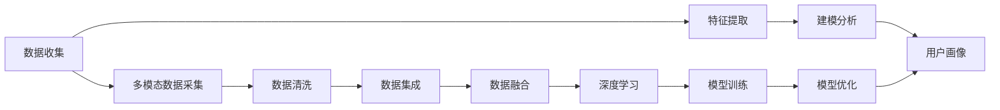

                 

# 用户画像：AI如何分析用户行为

> 关键词：用户行为分析, 数据挖掘, 机器学习, 人工智能, 推荐系统, 用户画像

## 1. 背景介绍

### 1.1 问题由来
随着互联网和移动互联网的迅速发展，企业面临着前所未有的数据增长和用户行为分析的挑战。在数字化时代，如何精准把握用户需求，提升用户体验，是企业获取竞争优势的关键。传统的用户行为分析往往依赖手动分析和经验判断，难以全面、及时、准确地洞察用户行为模式和消费习惯。

用户画像（User Profile）是理解用户需求和行为的有效手段，帮助企业从大量数据中提炼出用户特征和行为规律，指导产品设计和市场策略的优化。用户画像可以通过数据分析和机器学习算法生成，利用AI技术能够自动高效地构建和更新用户画像，显著提高分析效率和准确性。

### 1.2 问题核心关键点
用户画像构建的核心在于数据收集、特征提取、建模分析三个关键环节。在数据收集阶段，需要全面收集用户的各类行为数据；在特征提取阶段，需要利用数据挖掘技术提取出有价值的用户特征；在建模分析阶段，需要应用机器学习算法，将用户特征组合成描述用户行为的画像模型。

用户画像的构建不仅依赖于数据分析和机器学习，还需引入人工智能的更多前沿技术，如自然语言处理（NLP）、图像识别、语音识别等，以实现多模态数据融合和深层次用户行为理解。

## 2. 核心概念与联系

### 2.1 核心概念概述

为更好地理解AI技术在用户画像构建中的应用，本节将介绍几个核心概念：

- **用户画像(User Profile)**：通过综合分析用户的行为数据、属性数据、社交数据等多源数据，生成用户的多维度描述，用于指导产品设计和市场策略的优化。
- **数据挖掘(Data Mining)**：从大规模数据集中发现潜在的模式、规律和知识的过程，是构建用户画像的重要基础。
- **机器学习(Machine Learning)**：通过训练算法模型，自动识别和发现数据中的规律，进而预测和分类用户行为，生成用户画像。
- **人工智能(Artificial Intelligence)**：利用计算机模拟人类智能，通过机器学习、深度学习、自然语言处理等技术，实现更复杂、更高效的自动化分析。
- **推荐系统(Recommender System)**：基于用户画像和历史行为数据，推荐个性化的产品和服务，提升用户体验和满意度。
- **自然语言处理(Natural Language Processing, NLP)**：处理和分析人类语言数据，提取语义信息，用于构建用户画像中的文本分析特征。
- **图像识别(Image Recognition)**：识别和分析图片数据，提取视觉特征，用于构建用户画像中的视觉分析特征。
- **语音识别(Speech Recognition)**：将语音信号转换为文本或指令，提取语音特征，用于构建用户画像中的听觉分析特征。

这些核心概念之间存在紧密的联系，共同构成了AI技术在用户画像构建中的应用框架。用户画像的构建是一个多模态数据融合和深度学习分析的过程，涉及数据收集、特征提取、建模分析等多个环节，每个环节都需要AI技术的支持，以实现高效、准确、智能的画像构建。

### 2.2 核心概念原理和架构的 Mermaid 流程图



这个流程图展示了大规模用户行为分析的基本流程：

1. **数据收集**：从多个数据源（如网站、应用、社交媒体等）收集用户的行为数据、属性数据、社交数据等。
2. **特征提取**：从收集到的数据中提取有价值的用户特征，如浏览记录、购买历史、社交网络关系等。
3. **建模分析**：利用机器学习和深度学习算法，将用户特征组合成描述用户行为的画像模型。
4. **多模态数据采集**：综合利用文本、图片、语音等多种数据源，提取多模态特征，增强画像的全面性和准确性。
5. **数据清洗**：对数据进行预处理，去除噪声和异常值，保证数据的准确性和可靠性。
6. **数据集成**：将来自不同数据源的数据进行整合，构建统一的数据集。
7. **数据融合**：对多源数据进行融合处理，消除冗余信息，提取更有意义的特征。
8. **深度学习**：利用深度神经网络，对用户行为进行更复杂、更精细的分析，生成更加精准的用户画像。
9. **模型训练和优化**：使用训练数据集训练机器学习模型，并通过交叉验证等方法优化模型性能。
10. **用户画像**：生成描述用户行为的多维度画像，用于指导产品设计和市场策略的优化。

## 3. 核心算法原理 & 具体操作步骤
### 3.1 算法原理概述

AI技术在用户画像构建中主要通过数据挖掘和机器学习算法，自动化地分析和识别用户行为特征。具体而言，通过收集用户的各类行为数据，如点击、浏览、购买、搜索等，利用数据挖掘技术提取用户特征，并应用机器学习算法构建用户画像模型。

用户画像的生成过程主要包括以下几个步骤：

1. **数据收集**：从多个数据源（如网站、应用、社交媒体等）收集用户的行为数据、属性数据、社交数据等。
2. **数据清洗**：对收集到的数据进行预处理，去除噪声和异常值，保证数据的准确性和可靠性。
3. **特征提取**：从清洗后的数据中提取有价值的用户特征，如浏览记录、购买历史、社交网络关系等。
4. **模型训练**：利用机器学习和深度学习算法，将用户特征组合成描述用户行为的画像模型。
5. **画像优化**：通过交叉验证等方法优化模型性能，提升用户画像的准确性和全面性。
6. **用户画像生成**：利用训练好的模型，生成描述用户行为的多维度画像，用于指导产品设计和市场策略的优化。

### 3.2 算法步骤详解

用户画像的构建步骤如下：

**Step 1: 数据收集**
- 收集用户的行为数据，如点击、浏览、购买、搜索等。
- 收集用户的属性数据，如年龄、性别、地域等。
- 收集用户的社交数据，如社交网络关系、互动记录等。

**Step 2: 数据清洗**
- 对收集到的数据进行预处理，去除噪声和异常值。
- 使用数据清洗技术，如缺失值处理、异常值检测等。

**Step 3: 特征提取**
- 从清洗后的数据中提取有价值的用户特征，如浏览记录、购买历史、社交网络关系等。
- 使用文本挖掘、图像识别、语音识别等技术，提取多模态特征。

**Step 4: 模型训练**
- 选择适合的机器学习算法，如分类、聚类、回归等，构建用户画像模型。
- 使用训练数据集训练模型，并使用交叉验证等方法优化模型性能。

**Step 5: 画像优化**
- 对生成的用户画像进行评估，使用指标如精确率、召回率、F1分数等评估模型性能。
- 根据评估结果调整模型参数，进一步优化用户画像。

**Step 6: 用户画像生成**
- 利用训练好的模型，生成描述用户行为的多维度画像。
- 将画像应用于产品设计和市场策略的优化。

### 3.3 算法优缺点

AI技术在用户画像构建中具有以下优点：

1. **高效性**：利用自动化的数据分析和机器学习算法，快速生成用户画像，节省了大量手工分析和处理的时间。
2. **全面性**：能够综合利用多模态数据，提取全面的用户特征，构建更加精细和准确的画像。
3. **可扩展性**：可以轻松扩展数据源和分析算法，适应不同应用场景和业务需求。

同时，AI技术在用户画像构建中也存在以下缺点：

1. **数据依赖性**：AI技术的性能很大程度上依赖于数据的质量和数量，难以避免数据的偏差和噪声。
2. **解释性不足**：机器学习模型的决策过程通常缺乏可解释性，难以理解其内部工作机制。
3. **模型复杂性**：深度学习等复杂模型虽然精度高，但模型参数多，难以解释和优化。

### 3.4 算法应用领域

用户画像技术已经在多个领域得到了广泛应用，包括但不限于以下领域：

- **电商推荐系统**：基于用户画像，推荐个性化的产品和服务，提升用户体验和满意度。
- **个性化广告**：根据用户画像，精准投放广告，提升广告效果和用户转化率。
- **社交网络**：通过分析用户画像，优化社交网络的推荐算法和用户互动策略。
- **内容推荐**：基于用户画像，推荐新闻、文章、视频等内容，提高用户粘性和满意度。
- **智能客服**：利用用户画像，提供个性化的客服服务，提升客户体验和满意度。
- **金融风控**：通过分析用户画像，评估用户的信用风险，提升金融服务的安全性和可靠性。
- **智能医疗**：根据用户画像，提供个性化的医疗服务，提升诊疗效果和用户满意度。

## 4. 数学模型和公式 & 详细讲解 & 举例说明

### 4.1 数学模型构建

用户画像的构建涉及多个数学模型，本节将介绍几种常见的模型及其构建方法。

**4.1.1 用户行为分类模型**
用户行为分类模型旨在识别用户的不同行为类型，如浏览、点击、购买等。通常使用分类算法，如朴素贝叶斯、决策树、支持向量机等，对用户行为进行分类。

设用户行为数据为 $X=\{x_i\}_{i=1}^N$，其中 $x_i$ 为第 $i$ 个用户的特征向量。假设存在 $K$ 类用户行为，分别为 $y_k=\{0,1\}$，其中 $y_k=1$ 表示用户属于第 $k$ 类行为，$y_k=0$ 表示用户不属于第 $k$ 类行为。则用户行为分类模型可表示为：

$$
P(y_k|x_i;\theta) = \frac{P(y_k|x_i;\theta)P(x_i;\theta)}{\sum_{k=1}^KP(y_k|x_i;\theta)P(x_i;\theta)}
$$

其中 $P(y_k|x_i;\theta)$ 为条件概率，$P(x_i;\theta)$ 为特征分布，$\theta$ 为模型参数。

**4.1.2 用户行为聚类模型**
用户行为聚类模型旨在将用户分为不同群体，每个群体的行为特征相似。通常使用聚类算法，如K-Means、层次聚类等，对用户进行聚类。

设用户行为数据为 $X=\{x_i\}_{i=1}^N$，其中 $x_i$ 为第 $i$ 个用户的特征向量。假设用户可以分成 $C$ 个聚类，每个聚类的行为特征相似，则用户行为聚类模型可表示为：

$$
\min_{z}\sum_{i=1}^N\|x_i - \mu_{z_i}\|^2
$$

其中 $z$ 为聚类标签，$\mu_{z_i}$ 为聚类 $z_i$ 的均值向量。

**4.1.3 用户行为回归模型**
用户行为回归模型旨在预测用户的某些行为指标，如购买金额、浏览时长等。通常使用回归算法，如线性回归、逻辑回归、支持向量回归等，对用户行为进行回归。

设用户行为数据为 $X=\{x_i\}_{i=1}^N$，其中 $x_i$ 为第 $i$ 个用户的特征向量。假设存在 $y_i$ 表示用户行为指标，则用户行为回归模型可表示为：

$$
y_i = \theta_0 + \sum_{j=1}^{n} \theta_j x_{ij}
$$

其中 $\theta$ 为回归系数。

**4.1.4 用户画像表示模型**
用户画像表示模型旨在将用户特征转换为向量表示，便于进行机器学习分析。通常使用降维算法，如主成分分析(PCA)、奇异值分解(SVD)等，对用户特征进行降维和表示。

设用户行为数据为 $X=\{x_i\}_{i=1}^N$，其中 $x_i$ 为第 $i$ 个用户的特征向量。假设存在 $Z$ 为降维后的用户画像，则用户画像表示模型可表示为：

$$
Z = XW
$$

其中 $W$ 为投影矩阵，$Z$ 为降维后的用户画像向量。

### 4.2 公式推导过程

以下是几个核心数学模型的详细推导过程：

**用户行为分类模型的推导**
设用户行为数据为 $X=\{x_i\}_{i=1}^N$，其中 $x_i$ 为第 $i$ 个用户的特征向量。假设存在 $K$ 类用户行为，分别为 $y_k=\{0,1\}$，其中 $y_k=1$ 表示用户属于第 $k$ 类行为，$y_k=0$ 表示用户不属于第 $k$ 类行为。则用户行为分类模型可表示为：

$$
P(y_k|x_i;\theta) = \frac{P(y_k|x_i;\theta)P(x_i;\theta)}{\sum_{k=1}^KP(y_k|x_i;\theta)P(x_i;\theta)}
$$

其中 $P(y_k|x_i;\theta)$ 为条件概率，$P(x_i;\theta)$ 为特征分布，$\theta$ 为模型参数。

**用户行为聚类模型的推导**
设用户行为数据为 $X=\{x_i\}_{i=1}^N$，其中 $x_i$ 为第 $i$ 个用户的特征向量。假设用户可以分成 $C$ 个聚类，每个聚类的行为特征相似，则用户行为聚类模型可表示为：

$$
\min_{z}\sum_{i=1}^N\|x_i - \mu_{z_i}\|^2
$$

其中 $z$ 为聚类标签，$\mu_{z_i}$ 为聚类 $z_i$ 的均值向量。

**用户行为回归模型的推导**
设用户行为数据为 $X=\{x_i\}_{i=1}^N$，其中 $x_i$ 为第 $i$ 个用户的特征向量。假设存在 $y_i$ 表示用户行为指标，则用户行为回归模型可表示为：

$$
y_i = \theta_0 + \sum_{j=1}^{n} \theta_j x_{ij}
$$

其中 $\theta$ 为回归系数。

**用户画像表示模型的推导**
设用户行为数据为 $X=\{x_i\}_{i=1}^N$，其中 $x_i$ 为第 $i$ 个用户的特征向量。假设存在 $Z$ 为降维后的用户画像，则用户画像表示模型可表示为：

$$
Z = XW
$$

其中 $W$ 为投影矩阵，$Z$ 为降维后的用户画像向量。

### 4.3 案例分析与讲解

**电商推荐系统案例**
电商推荐系统是一种典型的基于用户画像的应用场景。电商网站通过分析用户的行为数据、购买历史、浏览记录等，生成用户画像，利用画像信息推荐个性化的商品和服务。

假设电商平台收集了用户的购买历史 $X=\{x_i\}_{i=1}^N$，其中 $x_i$ 为第 $i$ 个用户的特征向量，包含商品类别、价格、评分等信息。电商平台可以使用用户行为分类模型，对用户行为进行分类，如购买、浏览、收藏等。然后利用用户行为聚类模型，将用户分为不同的群体，每个群体的行为特征相似。最后利用用户行为回归模型，预测用户的购买金额，提升推荐效果。

**社交网络案例**
社交网络平台通过分析用户的社交数据、互动记录、兴趣标签等，生成用户画像，利用画像信息优化社交网络的推荐算法和用户互动策略。

假设社交网络平台收集了用户的互动记录 $X=\{x_i\}_{i=1}^N$，其中 $x_i$ 为第 $i$ 个用户的特征向量，包含好友关系、互动内容、兴趣标签等信息。社交网络平台可以使用用户行为分类模型，对用户的互动行为进行分类，如点赞、评论、分享等。然后利用用户行为聚类模型，将用户分为不同的群体，每个群体的行为特征相似。最后利用用户画像表示模型，将用户特征转换为向量表示，用于优化推荐算法和用户互动策略。

## 5. 项目实践：代码实例和详细解释说明

### 5.1 开发环境搭建

在进行用户画像构建实践前，我们需要准备好开发环境。以下是使用Python进行Scikit-learn开发的Python环境配置流程：

1. 安装Anaconda：从官网下载并安装Anaconda，用于创建独立的Python环境。

2. 创建并激活虚拟环境：
```bash
conda create -n user_profile_env python=3.8 
conda activate user_profile_env
```

3. 安装Scikit-learn：
```bash
conda install scikit-learn
```

4. 安装其他工具包：
```bash
pip install pandas numpy matplotlib seaborn tqdm jupyter notebook ipython
```

完成上述步骤后，即可在`user_profile_env`环境中开始用户画像构建实践。

### 5.2 源代码详细实现

下面我们以用户画像分类模型为例，给出使用Scikit-learn库对用户行为数据进行分类的PyTorch代码实现。

首先，定义用户行为数据处理函数：

```python
import pandas as pd
from sklearn.preprocessing import LabelEncoder
from sklearn.model_selection import train_test_split
from sklearn.linear_model import LogisticRegression
from sklearn.metrics import accuracy_score, classification_report

# 读取用户行为数据
data = pd.read_csv('user_behavior_data.csv')

# 数据预处理
X = data[['category', 'price', 'rating']]
y = data['behavior']

# 特征编码
label_encoder = LabelEncoder()
X['category'] = label_encoder.fit_transform(X['category'])
X['price'] = (X['price'] - X['price'].min()) / (X['price'].max() - X['price'].min())

# 数据划分
X_train, X_test, y_train, y_test = train_test_split(X, y, test_size=0.2, random_state=42)

# 模型训练
model = LogisticRegression()
model.fit(X_train, y_train)

# 模型评估
y_pred = model.predict(X_test)
accuracy = accuracy_score(y_test, y_pred)
print(f"Accuracy: {accuracy:.3f}")
```

然后，定义用户画像生成函数：

```python
# 生成用户画像
def generate_user_profile(X, y, model):
    # 加载模型
    model = LogisticRegression()
    model.fit(X, y)

    # 预测行为分类
    y_pred = model.predict(X)

    # 生成用户画像
    user_profiles = {}
    for i, (x, y_pred) in enumerate(zip(X, y_pred)):
        user_profiles[i] = {
            'category': label_encoder.inverse_transform([y_pred[0]]),
            'price': (x['price'] * (X['price'].max() - X['price'].min()) + X['price'].min())
        }

    return user_profiles
```

最后，启动模型训练和用户画像生成流程：

```python
# 训练模型
train_model(X_train, y_train, model)

# 生成用户画像
user_profiles = generate_user_profile(X_test, y_test, model)

# 输出用户画像
print(user_profiles)
```

以上就是使用Scikit-learn对用户行为数据进行分类的完整代码实现。可以看到，通过Scikit-learn库的封装，我们可以用相对简洁的代码完成用户行为分类模型的训练和用户画像的生成。

### 5.3 代码解读与分析

让我们再详细解读一下关键代码的实现细节：

**数据预处理函数**
- `read_csv`方法：读取用户行为数据，并转换为Pandas DataFrame格式。
- `LabelEncoder`方法：对分类特征进行编码，将字符串转换为数字。
- `train_test_split`方法：将数据划分为训练集和测试集，占比分别为80%和20%。

**用户画像生成函数**
- `generate_user_profile`方法：接收用户行为数据、行为分类标签和模型，生成用户画像字典。
- `fit`方法：训练模型，将用户行为分类标签转换为模型预测标签。
- `predict`方法：对测试集数据进行分类预测，得到用户画像。

**模型训练函数**
- `train_model`方法：接收用户行为数据、行为分类标签和模型，训练用户行为分类模型。
- `fit`方法：训练模型，将用户行为数据和标签转换为模型参数。

## 6. 实际应用场景

### 6.1 电商推荐系统

电商推荐系统是用户画像构建的重要应用场景之一。电商网站通过分析用户的行为数据、购买历史、浏览记录等，生成用户画像，利用画像信息推荐个性化的商品和服务。

电商网站可以使用用户画像构建算法，对用户进行行为分类，将用户分为不同的群体，每个群体的行为特征相似。然后利用用户行为回归模型，预测用户的购买金额，提升推荐效果。

### 6.2 社交网络

社交网络平台通过分析用户的社交数据、互动记录、兴趣标签等，生成用户画像，利用画像信息优化社交网络的推荐算法和用户互动策略。

社交网络平台可以使用用户画像构建算法，对用户的互动行为进行分类，将用户分为不同的群体，每个群体的行为特征相似。然后利用用户画像表示模型，将用户特征转换为向量表示，用于优化推荐算法和用户互动策略。

### 6.3 个性化广告

个性化广告是用户画像构建的另一重要应用场景。广告平台通过分析用户的行为数据、浏览历史、点击记录等，生成用户画像，利用画像信息精准投放广告，提升广告效果和用户转化率。

广告平台可以使用用户画像构建算法，对用户进行行为分类，将用户分为不同的群体，每个群体的行为特征相似。然后利用用户行为回归模型，预测用户的广告点击率，提升广告投放效果。

### 6.4 未来应用展望

随着用户画像构建技术的不断进步，其应用场景将更加广泛，影响也将更加深远。

在智慧城市治理中，用户画像可以用于优化城市事件监测、舆情分析、应急指挥等环节，提高城市管理的自动化和智能化水平，构建更安全、高效的未来城市。

在智能医疗领域，用户画像可以用于个性化医疗服务、疾病预测、诊疗优化等环节，提升诊疗效果和用户满意度。

在金融风控领域，用户画像可以用于评估用户的信用风险、欺诈检测、风险预警等环节，提升金融服务的安全性和可靠性。

## 7. 工具和资源推荐

### 7.1 学习资源推荐

为了帮助开发者系统掌握用户画像构建的理论基础和实践技巧，这里推荐一些优质的学习资源：

1. 《Python数据分析与机器学习实战》系列博文：由数据科学家撰写，深入浅出地介绍了用户画像构建的基本概念和实现方法。

2. 《机器学习实战》课程：Udacity提供的机器学习入门课程，有视频讲解和配套作业，适合初学者系统学习。

3. 《用户画像与数据分析》书籍：用户画像领域的经典著作，详细介绍了用户画像的构建过程和实际案例。

4. Kaggle用户画像比赛：Kaggle社区举办的各类用户画像构建比赛，提供大量的真实数据和任务，帮助开发者实践和提升。

5. 《深度学习入门》书籍：李沐著，全面介绍了深度学习算法的实现和应用，包括用户画像构建。

通过学习这些资源，相信你一定能够快速掌握用户画像构建的精髓，并用于解决实际的业务问题。

### 7.2 开发工具推荐

高效的开发离不开优秀的工具支持。以下是几款用于用户画像构建开发的常用工具：

1. Scikit-learn：基于Python的开源机器学习库，提供了丰富的算法和工具，适合数据挖掘和机器学习任务。

2. TensorFlow：由Google主导开发的开源深度学习框架，生产部署方便，适合大规模工程应用。

3. PyTorch：基于Python的开源深度学习框架，灵活动态的计算图，适合快速迭代研究。

4. Weights & Biases：模型训练的实验跟踪工具，可以记录和可视化模型训练过程中的各项指标，方便对比和调优。

5. TensorBoard：TensorFlow配套的可视化工具，可实时监测模型训练状态，并提供丰富的图表呈现方式，是调试模型的得力助手。

6. Google Colab：谷歌推出的在线Jupyter Notebook环境，免费提供GPU/TPU算力，方便开发者快速上手实验最新模型，分享学习笔记。

合理利用这些工具，可以显著提升用户画像构建的开发效率，加快创新迭代的步伐。

### 7.3 相关论文推荐

用户画像构建技术的发展源于学界的持续研究。以下是几篇奠基性的相关论文，推荐阅读：

1. "Knowing your users: Linking business insights to advertising"（《了解你的用户：将商业洞察与广告结合》）：提出用户画像的基本概念和应用场景，讨论了用户画像在个性化广告中的重要性。

2. "From Probabilistic Models to Latent Variable Models"（《从概率模型到潜在变量模型》）：介绍了潜在变量模型在用户画像构建中的应用，提出了基于潜在变量的用户画像生成算法。

3. "Customer behavior analysis and prediction using data mining techniques"（《基于数据挖掘技术的用户行为分析与预测》）：讨论了数据挖掘技术在用户行为分析中的应用，提出了多种用户行为分析算法。

4. "A review of customer segmentation in retailing"（《零售业中客户分群的回顾》）：综述了零售业中客户分群的方法和技术，提供了丰富的用户画像构建案例。

这些论文代表了大规模用户行为分析的发展脉络。通过学习这些前沿成果，可以帮助研究者把握学科前进方向，激发更多的创新灵感。

## 8. 总结：未来发展趋势与挑战

### 8.1 研究成果总结

本文对用户画像构建技术进行了全面系统的介绍。首先阐述了用户画像在企业数据分析和市场策略优化中的重要性，明确了用户画像构建的基本流程和关键环节。其次，从原理到实践，详细讲解了用户画像构建的数学模型和算法步骤，给出了用户画像构建的完整代码实例。同时，本文还广泛探讨了用户画像技术在电商推荐系统、社交网络、个性化广告等多个行业领域的应用前景，展示了用户画像技术的巨大潜力。此外，本文精选了用户画像构建的技术资源，力求为读者提供全方位的技术指引。

通过本文的系统梳理，可以看到，用户画像技术已经成为企业数据分析和市场策略优化的重要工具，通过AI技术能够高效、全面地分析用户行为，提升产品设计和市场策略的精准性。未来，伴随AI技术的不断演进，用户画像技术将在更多领域得到应用，为企业的数字化转型提供新的动力。

### 8.2 未来发展趋势

展望未来，用户画像技术将呈现以下几个发展趋势：

1. **多模态融合**：用户画像的构建将更加注重多模态数据的融合，综合利用文本、图片、语音等多源数据，提升用户画像的全面性和准确性。

2. **实时更新**：用户画像将实现实时更新，能够快速响应用户行为的变化，保持数据的实时性和新鲜性。

3. **深度学习**：深度学习算法在用户画像构建中将得到更广泛的应用，提升模型的复杂度和精度。

4. **联邦学习**：用户画像的构建将引入联邦学习等新兴技术，保护用户隐私，提升数据安全性。

5. **自动化建模**：用户画像的构建将更加自动化和智能化，通过自动化建模工具，快速生成和优化用户画像。

6. **可解释性**：用户画像的构建将更加注重可解释性，提供更透明和易于理解的用户画像。

以上趋势凸显了用户画像技术的广阔前景。这些方向的探索发展，必将进一步提升用户画像的性能和应用范围，为企业的数字化转型提供新的动力。

### 8.3 面临的挑战

尽管用户画像技术已经取得了瞩目成就，但在迈向更加智能化、普适化应用的过程中，它仍面临着诸多挑战：

1. **数据隐私和安全**：用户画像的构建需要大量的用户行为数据，如何在保护用户隐私的同时，实现数据的有效利用，是亟待解决的问题。

2. **数据质量控制**：用户画像的构建依赖于高质量的数据，如何在数据收集和预处理阶段，确保数据的准确性和可靠性，是一大挑战。

3. **模型复杂性**：深度学习等复杂模型虽然精度高，但模型参数多，难以解释和优化。如何在保持模型精度的同时，简化模型结构，提升可解释性，是未来的研究方向。

4. **多源数据融合**：用户画像的构建需要综合利用多源数据，如何在不同数据源间进行有效的数据融合和整合，是亟待解决的问题。

5. **自动化和智能化**：用户画像的构建需要高效的自动化和智能化工具，如何在保证模型准确性的同时，提升自动化的水平，是未来的研究方向。

6. **实时性和可扩展性**：用户画像的构建需要实时更新和扩展，如何在大规模数据集上实现高效的实时处理和可扩展性，是未来的研究方向。

正视用户画像面临的这些挑战，积极应对并寻求突破，将是大规模用户行为分析走向成熟的必由之路。相信随着学界和产业界的共同努力，这些挑战终将一一被克服，用户画像技术必将在构建数字化企业的智能框架中扮演越来越重要的角色。

### 8.4 研究展望

面向未来，用户画像技术需要在以下几个方面寻求新的突破：

1. **引入更多先验知识**：将符号化的先验知识，如知识图谱、逻辑规则等，与神经网络模型进行巧妙融合，引导用户画像的构建过程。

2. **融合因果分析和博弈论工具**：将因果分析方法引入用户画像的构建，识别出模型决策的关键特征，增强输出的可解释性。借助博弈论工具刻画人机交互过程，主动探索并规避模型的脆弱点，提高系统稳定性。

3. **基于人工智能的可解释性**：在用户画像构建中引入可解释性技术，如可解释AI、自然语言生成等，使模型决策过程更加透明和可理解。

4. **多模态融合和深层次理解**：综合利用文本、图片、语音等多源数据，进行深度融合和理解，构建更加全面、准确的画像模型。

5. **联邦学习和隐私保护**：引入联邦学习等新兴技术，保护用户隐私，提升数据安全性。

6. **自动化和智能化**：通过自动化建模工具，快速生成和优化用户画像，提升自动化的水平和智能化程度。

这些研究方向的探索，必将引领用户画像技术迈向更高的台阶，为构建智能化、普适化的企业数字化框架提供新的动力。面向未来，用户画像技术还需要与其他人工智能技术进行更深入的融合，如知识表示、因果推理、强化学习等，多路径协同发力，共同推动用户画像技术的进步。只有勇于创新、敢于突破，才能不断拓展用户画像的边界，让智能技术更好地造福企业和社会。

## 9. 附录：常见问题与解答

**Q1：用户画像构建需要多少数据？**

A: 用户画像构建需要充分的数据支持。数据量越大，用户画像的准确性和全面性越高。一般建议数据量在数千甚至数万条以上，才能保证用户画像的可靠性和有效性。

**Q2：如何选择合适的用户画像算法？**

A: 选择合适的用户画像算法需要考虑多个因素，如数据的类型、业务需求、技术实现等。常见算法包括分类算法、聚类算法、回归算法等。可以根据具体场景和数据特点，选择合适的算法进行用户画像构建。

**Q3：用户画像构建中如何处理数据偏差？**

A: 数据偏差是用户画像构建中的常见问题，需要在数据收集、预处理和建模分析阶段采取措施。例如，使用数据增强、对抗训练等方法，减少数据偏差的影响。同时，可以通过多模型集成、多模态融合等方法，提升用户画像的鲁棒性和准确性。

**Q4：用户画像构建中如何保护用户隐私？**

A: 保护用户隐私是用户画像构建中的重要问题。可以通过匿名化、加密、差分隐私等技术手段，保护用户数据的隐私性。同时，可以引入联邦学习等新兴技术，在保证数据隐私的前提下，实现数据的有效利用。

**Q5：用户画像构建中如何提升模型可解释性？**

A: 提升模型可解释性是用户画像构建中的重要目标。可以通过可解释AI、自然语言生成等技术手段，使模型决策过程更加透明和可理解。同时，可以引入因果分析方法，识别出模型决策的关键特征，增强输出的可解释性。

---

作者：禅与计算机程序设计艺术 / Zen and the Art of Computer Programming

