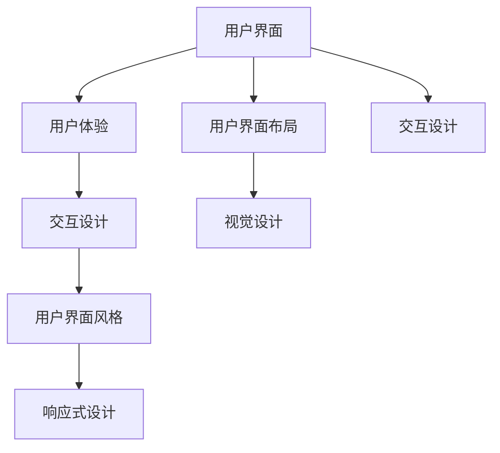

                 

# 用户界面设计：打造友好易用的人机交互

> 关键词：用户界面设计,人机交互,界面布局,交互设计,用户体验,可用性测试,界面风格,视觉设计,响应式设计

## 1. 背景介绍

### 1.1 问题由来

随着计算机技术的迅速发展，用户界面设计的重要性日益凸显。良好的用户界面不仅可以提升用户的体验和满意度，还可以降低用户操作的难度，提高软件的使用效率。因此，设计高质量的用户界面已经成为软件开发中的一个关键任务。

### 1.2 问题核心关键点

用户界面设计不仅仅是将功能元素放置在屏幕上，它是一个深入理解用户需求、组织信息、促进沟通和流程指导的艺术。设计好的用户界面应该满足以下几个关键点：

- **易用性(Ease of use)**：用户应该能够迅速上手软件，并且轻松地完成他们的任务。
- **用户体验(Usability)**：软件应该给用户带来积极的情感体验，使用户感到愉悦和满足。
- **适应性(Adaptability)**：界面设计应该适应用户的需求和习惯，提供个性化的体验。
- **可访问性(Accessibility)**：界面设计应该确保所有用户都能够使用，包括有障碍的人。

### 1.3 问题研究意义

用户界面设计的好坏直接影响到软件的使用和接受度。一个友好的用户界面可以减少用户的学习成本，提高用户的满意度，从而增加用户的忠诚度和粘性。因此，用户界面设计是企业提升品牌形象和市场竞争力的重要手段。

## 2. 核心概念与联系

### 2.1 核心概念概述

在进行用户界面设计时，需要了解和掌握几个核心概念：

- **用户界面(User Interface, UI)**：用户与计算机系统交互的组件，包括图形界面、菜单、按钮、警告框等。
- **用户体验(User Experience, UX)**：用户在使用产品或服务时的感受，包括他们的感知、情感和反应。
- **交互设计(Interaction Design, IxD)**：指的是用户界面中，用户与计算机系统的交互方式的设计，包括用户如何输入命令以及系统如何响应。
- **用户界面风格(UI Style)**：指的是用户界面的整体风格和感觉，包括颜色、字体、图标等的选择和排列。
- **响应式设计(Responsive Design)**：是指设计适应不同屏幕尺寸和设备类型的网页和应用程序设计。

这些概念之间的逻辑关系可以通过以下Mermaid流程图来展示：



这个流程图展示了用户界面设计的核心概念及其之间的关系：

1. 用户界面是整个设计过程的基础，它包含了用户界面布局和视觉设计等。
2. 用户体验是用户界面设计的最终目标，它涉及交互设计和用户界面风格。
3. 交互设计是实现用户界面风格的关键，它还涉及响应式设计。
4. 响应式设计确保用户界面在不同的设备上都能提供良好的体验。

这些概念共同构成了用户界面设计的学习和应用框架，使得设计者能够更好地把握用户界面设计的工作原理和优化方向。

## 3. 核心算法原理 & 具体操作步骤
### 3.1 算法原理概述

在进行用户界面设计时，需要遵循一系列的原则和方法论，这些原则和方法论可以帮助设计者确保界面设计的质量。以下是一些基本的原则和方法论：

- **一致性(Consistency)**：界面设计应该一致，以便用户可以快速学习并使用。
- **反馈(Feedback)**：用户操作时应该给予及时的反馈，告知用户操作的结果。
- **可预测性(Predictability)**：界面的行为应该容易预测，这样用户可以预知他们的操作将如何反应。
- **简洁性(Simplicity)**：界面应该简洁，以避免用户感到困惑或分心。
- **可访问性(Accessibility)**：界面应该是可访问的，以便所有用户都能使用。

### 3.2 算法步骤详解

以下是进行用户界面设计的具体步骤：

**Step 1: 用户研究**
- 使用调查问卷、用户访谈等手段收集用户需求和偏好信息。
- 分析目标用户群体的特性，包括年龄、性别、教育背景、使用习惯等。

**Step 2: 构建原型**
- 根据用户研究结果，设计界面的初步布局和功能。
- 使用纸质原型、数字原型或交互原型进行初步测试。

**Step 3: 设计界面**
- 根据一致性、反馈、可预测性、简洁性和可访问性等原则，设计界面。
- 确保界面风格和响应式设计符合公司品牌和用户习惯。

**Step 4: 测试和反馈**
- 对界面设计进行用户可用性测试，收集用户的反馈和问题。
- 根据测试结果进行界面调整和优化。

**Step 5: 最终部署**
- 将最终的界面设计部署到产品中。
- 定期收集用户反馈，并根据反馈继续优化界面设计。

以上是用户界面设计的基本步骤。设计者在进行实际设计时，需要根据实际情况进行调整和优化。

### 3.3 算法优缺点

用户界面设计的优缺点如下：

- 优点：
1. 良好的用户界面可以提升用户体验，增加用户的满意度和忠诚度。
2. 用户界面的一致性可以减少用户的学习成本，使得用户更快地上手软件。
3. 反馈可以帮助用户理解操作的结果，减少错误的发生。
4. 界面的可预测性可以让用户感到安全和信任。
5. 界面的简洁性可以减少用户的压力，提升工作效率。

- 缺点：
1. 用户界面设计是一个复杂的过程，需要大量的时间和资源。
2. 不同的用户有不同的需求和偏好，设计一个满足所有用户的界面是一个挑战。
3. 界面的设计可能会与软件的功能和性能相冲突，需要平衡界面的美观和功能性。
4. 界面的设计可能会随着时间的推移而过时，需要定期更新和优化。

### 3.4 算法应用领域

用户界面设计的应用领域非常广泛，包括：

- **操作系统**: 包括Windows、MacOS、Linux等。
- **应用程序**: 如Web浏览器、办公软件、游戏等。
- **网站**: 不同类型的网站，如新闻网站、电子商务网站、博客等。
- **移动应用**: 如智能手机和平板电脑上的应用程序。
- **嵌入式系统**: 如汽车仪表盘、医疗设备等。

用户界面设计的目标是让软件和服务变得易用和愉悦，这是实现用户体验设计的重要方面。

## 4. 数学模型和公式 & 详细讲解 & 举例说明

### 4.1 数学模型构建

在用户界面设计中，数学模型和公式并不占据主要地位。然而，数学在界面设计中的作用是不可忽视的，例如，用于计算界面的空间布局和排列优化。

例如，为了设计一个响应式的网站，我们可以使用一些数学模型来计算不同屏幕尺寸下元素的大小和布局。这些模型可以基于线性代数、几何学和图形学的知识构建。

### 4.2 公式推导过程

以下是一个简单的数学模型，用于计算响应式设计中的元素大小：

假设我们有一个响应式网站，其元素宽度为 w，分辨率为 r。我们希望元素在不同分辨率下都能保持一定的比例。我们可以建立如下数学模型：

w = k \* r

其中 k 是比例因子，w 是元素宽度，r 是分辨率。这个简单的模型可以帮助我们计算元素在不同分辨率下应有的宽度，从而实现响应式设计。

### 4.3 案例分析与讲解

在实际的界面设计中，我们需要考虑很多因素，包括用户的行为、心理、物理环境等。这些因素都可以通过数学模型来表示和分析，从而指导界面的设计。

例如，我们可以使用心理学模型来分析用户在不同的条件下对界面的反应。这些模型可以帮助我们设计出更符合用户习惯和心理的界面。

## 5. 项目实践：代码实例和详细解释说明

### 5.1 开发环境搭建

在进行用户界面设计项目实践前，我们需要准备好开发环境。以下是使用HTML、CSS和JavaScript进行界面设计的环境配置流程：

1. 安装web开发环境：可以使用Visual Studio Code、IntelliJ IDEA等。
2. 安装必要的扩展和插件，如Live Server、Prettier等。
3. 搭建基本的文件结构，包括index.html、styles.css、scripts.js等文件。
4. 编写基本的HTML结构，定义页面布局。
5. 编写CSS样式，定义页面风格和布局。
6. 编写JavaScript代码，实现交互功能。

以上是开发环境搭建的基本步骤。在实践中，根据具体需求，可能需要添加或调整开发环境和工具。

### 5.2 源代码详细实现

以下是一个简单的响应式网页的HTML代码示例：

```html
<!DOCTYPE html>
<html lang="en">
<head>
    <meta charset="UTF-8">
    <meta name="viewport" content="width=device-width, initial-scale=1.0">
    <title>Responsive Web Design</title>
    <link rel="stylesheet" href="styles.css">
</head>
<body>
    <header>
        <nav>
            <ul>
                <li><a href="#">Home</a></li>
                <li><a href="#">About</a></li>
                <li><a href="#">Contact</a></li>
            </ul>
        </nav>
    </header>
    <main>
        <section>
            <h2>Responsive Web Design</h2>
            <p>This is a responsive web page designed using HTML, CSS, and JavaScript.</p>
        </section>
    </main>
    <script src="scripts.js"></script>
</body>
</html>
```

### 5.3 代码解读与分析

以上代码实现了一个基本的网页结构，包括一个标题、一个导航菜单和一个内容部分。通过使用HTML标签，我们可以定义网页的结构和内容。CSS文件（styles.css）用于定义页面的样式和布局，JavaScript文件（scripts.js）可以用来添加交互性功能。

### 5.4 运行结果展示

在浏览器中打开上述HTML文件，页面将会根据浏览器窗口的大小自动调整大小和布局。这种适应不同屏幕尺寸的能力是响应式设计的核心特征。

## 6. 实际应用场景

### 6.4 未来应用展望

随着技术的发展和用户需求的变化，用户界面设计也在不断演进。以下是一些未来可能的应用场景和展望：

- **增强现实(AR)和虚拟现实(VR)**: 用户界面设计将与增强现实和虚拟现实技术结合，使得用户能够在虚拟环境中进行交互。
- **智能家居**: 智能家居设备的用户界面设计将变得越来越重要，需要考虑到用户在家中的使用习惯和需求。
- **个人健康**: 用户界面设计将更多地关注用户的健康状况，提供个性化的健康建议和管理工具。
- **教育**: 用户界面设计将更加注重教育内容的呈现，提供个性化的学习路径和互动体验。
- **可持续性**: 用户界面设计将更加注重可持续性和环保，使用更少的资源和能源。

这些未来应用场景将要求用户界面设计者具备更广泛的知识和技能，同时也将推动界面设计领域的创新和发展。

## 7. 工具和资源推荐

### 7.1 学习资源推荐

以下是一些推荐的学习资源，帮助你更好地理解和学习用户界面设计的知识和技能：

1. **Adobe XD**：Adobe的用户界面设计工具，提供了从初学者到高级设计师的学习资源。
2. **Sketch**：Sketch是一款流行的矢量图形设计工具，提供了丰富的在线教程和资源。
3. **Figma**：Figma是一款云端的用户界面设计工具，提供了很多在线课程和设计资源。
4. **Usability Hub**：提供了大量的可用性测试工具和资源，帮助你测试和优化用户界面。
5. **Smashing Magazine**：这是一个专注于用户界面设计和前端开发的博客和杂志，提供了大量的教程和案例研究。

### 7.2 开发工具推荐

以下是一些开发工具的推荐，帮助你更好地进行用户界面设计和开发：

1. **Visual Studio Code**：一个流行的代码编辑器，支持多种编程语言和扩展。
2. **IntelliJ IDEA**：一个强大的集成开发环境，适合大型项目的开发。
3. **Brackets**：一个开源的代码编辑器，特别适合前端开发者。
4. **Figma**：一个在线的用户界面设计工具，支持协作和版本控制。
5. **Adobe XD**：一个专门的用户界面设计工具，提供了强大的设计和协作功能。

### 7.3 相关论文推荐

以下是一些推荐的相关论文，帮助你更好地理解用户界面设计的理论基础和实践应用：

1. **"The Design of Everyday Things"**：Don Norman的经典书籍，介绍了用户界面设计的基本原则和实践。
2. **"Don't Make Me Think"**：Steve Krug的书籍，强调了用户界面设计应该尽可能简洁和直观。
3. **"The Elements of User Experience"**：Jesse James Garrett的书籍，提供了一个全面的用户体验设计框架。
4. **"Designing Interfaces"**：Jared M. Spool的书籍，介绍了用户界面设计的实践方法和工具。
5. **"Designing for Emotion"**：Aarron Walter的书籍，探讨了如何通过设计来激发用户的情感。

## 8. 总结：未来发展趋势与挑战

### 8.1 研究成果总结

用户界面设计作为用户体验的重要组成部分，已经在科技和商业领域得到广泛应用。通过对用户行为、心理和习惯的深入研究，设计者能够创造出更易用、更直观、更符合用户需求的产品界面。随着技术的不断发展，用户界面设计也在不断进化，融合了新兴技术如虚拟现实、增强现实等，实现了用户体验的全新提升。

### 8.2 未来发展趋势

未来，用户界面设计将更加注重用户的个性化需求，使用大数据分析用户行为，提供更加个性化的界面和服务。同时，随着人工智能技术的发展，用户界面设计将更加智能，能够根据用户的习惯和需求自动调整界面布局和内容。

### 8.3 面临的挑战

尽管用户界面设计已经取得了很大的成就，但仍然面临着一些挑战。例如，如何在快速变化的技术环境中保持界面的现代感和一致性，如何在保证界面美观的同时不牺牲功能性，如何确保界面对不同用户群体的可访问性等。这些挑战需要设计者不断学习和适应，才能在不断变化的技术和市场环境中保持竞争力。

### 8.4 研究展望

未来的用户界面设计研究将更加侧重于如何通过技术手段优化用户体验，提升界面的可用性和可访问性。同时，将继续探索如何结合多种媒体和技术，如虚拟现实、增强现实等，实现更加沉浸式和互动性的用户体验。这些研究方向将进一步推动用户界面设计的发展，为用户提供更加智能、个性化和满足的交互体验。

## 9. 附录：常见问题与解答

**Q1：用户界面设计和用户体验设计之间有什么区别？**

A: 用户界面设计主要关注于界面元素的组织和排列，而用户体验设计则更加关注于整个用户的交互过程和体验，从用户的角度出发，设计出更加人性化、直观和有吸引力的用户体验。

**Q2：如何评估和改进用户界面的可用性？**

A: 可用性评估通常通过用户可用性测试、分割测试和持久性测试等手段来进行。通过收集用户的反馈和行为数据，可以分析用户界面的易用性和满意度，并据此进行改进。

**Q3：响应式设计的核心是哪些？**

A: 响应式设计的核心是灵活的网页布局、适应不同屏幕尺寸和设备的设计，以及跨平台的用户体验设计。它利用CSS3的媒体查询功能，根据不同的屏幕尺寸和分辨率自动调整元素大小和布局。

**Q4：用户界面设计中的一致性和标准化有何重要性？**

A: 一致性和标准化在用户界面设计中至关重要，它们有助于减少用户的学习成本，使用户能够快速理解和使用界面。标准化的界面元素和行为有助于创建一个一致的品牌形象，并提供更好的用户体验。

**Q5：如何确保用户界面设计的可访问性？**

A: 可访问性的确保包括提供文本替代图像、调整字体大小和对比度、确保键盘可访问性等。通过使用可访问性工具和遵循可访问性指导，可以确保软件和网站对于所有用户都易于使用。

---

作者：禅与计算机程序设计艺术 / Zen and the Art of Computer Programming

