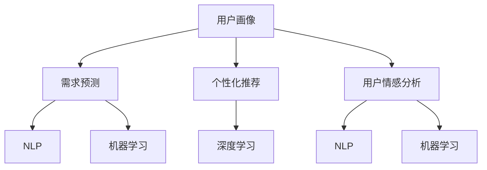

                 

# 用户行为分析：AI如何洞察用户需求，优化商品供给和营销策略

## 1. 背景介绍

### 1.1 问题由来

在当今快速变化的商业环境中，企业面临着前所未有的挑战和机遇。如何准确把握用户需求，优化商品供给和营销策略，成为企业成功的关键。传统的用户行为分析方法，如问卷调查、焦点小组等，成本高、效率低、结果难以量化。而随着人工智能技术的不断进步，利用AI洞察用户需求，成为一种更加高效、科学的方法。

AI在用户行为分析中的主要应用包括用户画像、需求预测、个性化推荐、用户情感分析、用户满意度评估等。这些应用可以帮助企业更好地理解用户，优化产品和服务，提升用户体验和业务绩效。

### 1.2 问题核心关键点

AI用户行为分析的核心在于通过大数据、机器学习和自然语言处理等技术手段，从多渠道的用户行为数据中提取有价值的信息，构建用户画像，进行需求预测，优化商品供给和营销策略。具体来说，需要处理以下关键问题：

- 如何高效采集、存储和处理用户行为数据？
- 如何从海量数据中提取有价值的信息，构建用户画像？
- 如何构建高效的机器学习模型，进行需求预测和个性化推荐？
- 如何实时分析用户反馈和情感，提升用户体验？

本文将从原理到实践，深入剖析AI用户行为分析的各个环节，帮助读者全面理解AI在用户行为分析中的应用，并探讨未来的发展方向。

## 2. 核心概念与联系

### 2.1 核心概念概述

为更好地理解AI用户行为分析方法，本节将介绍几个核心概念：

- **用户画像(User Profiling)**：基于用户的历史行为数据，构建出详细、准确的用户画像，用于指导商品供给和营销策略的制定。

- **需求预测(Demand Forecasting)**：通过历史销售数据、用户行为数据等，构建预测模型，预测未来需求变化，指导库存管理和销售计划。

- **个性化推荐(Personalized Recommendation)**：根据用户行为数据和画像，为用户提供定制化的产品推荐，提升用户体验和满意度。

- **用户情感分析(User Sentiment Analysis)**：通过分析用户的评论、反馈、评分等情感数据，评估用户对产品和服务的满意度，指导产品改进和市场调整。

- **自然语言处理(Natural Language Processing, NLP)**：通过文本分析、语义理解等技术手段，从用户评论、反馈中提取有价值的信息。

- **机器学习(Machine Learning)**：利用数据驱动的方法，从历史数据中学习规律，构建预测和推荐模型。

- **深度学习(Deep Learning)**：利用神经网络等深度学习技术，处理大规模数据，构建更复杂的模型，提升预测和推荐的精度。

这些核心概念之间的逻辑关系可以通过以下Mermaid流程图来展示：



这个流程图展示了大规模用户行为分析的核心概念及其之间的关系：

1. 用户画像基于用户历史行为数据，是需求预测、个性化推荐和用户情感分析的基础。
2. 需求预测、个性化推荐和用户情感分析分别从不同的维度，利用NLP和机器学习技术，构建预测模型和推荐系统。
3. 深度学习作为机器学习的一种高级形式，可以处理更加复杂的数据和任务，是未来AI用户行为分析的重要方向。

## 3. 核心算法原理 & 具体操作步骤

### 3.1 算法原理概述

AI用户行为分析的核心原理是通过对用户行为数据的深度学习，构建用户画像，进行需求预测、个性化推荐和用户情感分析。

1. **用户画像构建**：通过聚类算法、协同过滤等方法，从用户历史行为数据中提取特征，构建用户画像。

2. **需求预测**：利用时间序列分析、回归分析等方法，构建需求预测模型，预测未来需求变化。

3. **个性化推荐**：利用协同过滤、矩阵分解、深度学习等技术，构建个性化推荐模型，为每个用户推荐符合其兴趣和需求的商品。

4. **用户情感分析**：利用情感分析、文本分类等技术，从用户评论、反馈中提取情感信息，评估用户对产品和服务的满意度。

### 3.2 算法步骤详解

1. **数据采集与预处理**

   数据采集是用户行为分析的基础。企业可以通过各种渠道获取用户行为数据，如电商平台的用户浏览、购买记录，社交媒体的用户评论、点赞等。这些数据需要经过清洗、去重、归一化等预处理步骤，以保证数据的完整性和一致性。

2. **特征提取与建模**

   特征提取是从原始数据中提取有价值的信息，构建用户画像、需求预测模型、推荐模型和情感分析模型。常用的特征提取方法包括TF-IDF、Word2Vec、BERT等。这些特征可以用于构建协同过滤、协同矩阵分解、深度神经网络等模型。

3. **模型训练与评估**

   利用历史数据训练模型，并对模型进行评估。常用的评估指标包括准确率、召回率、F1值、均方误差等。模型训练过程中需要进行超参数调优、正则化处理等，以避免过拟合和欠拟合问题。

4. **模型部署与优化**

   将训练好的模型部署到生产环境，并根据实时数据进行优化。需要对模型进行监控、调整，以确保模型的准确性和稳定性。

### 3.3 算法优缺点

AI用户行为分析方法具有以下优点：

1. **高效性**：通过自动化处理大规模数据，大幅提升数据分析的效率。
2. **准确性**：利用深度学习等先进技术，模型能够从复杂数据中提取有价值的信息，提高分析精度。
3. **可扩展性**：模型可以根据数据的变化进行动态调整和优化，适应不同的应用场景。

同时，该方法也存在一些局限性：

1. **数据质量要求高**：数据采集、清洗和预处理需要较高的技术和资源投入。
2. **模型复杂度高**：深度学习模型需要较大的计算资源，训练和推理速度较慢。
3. **模型解释性不足**：复杂模型难以解释其内部工作机制，可能缺乏可解释性和透明性。

### 3.4 算法应用领域

AI用户行为分析技术已经在多个领域得到广泛应用，例如：

- **电商推荐系统**：通过分析用户的浏览、购买记录，推荐符合用户兴趣的商品。
- **社交媒体分析**：从用户的评论、点赞、分享等行为中，提取用户情感和兴趣，指导内容创作和广告投放。
- **金融风险评估**：利用用户交易数据和行为特征，评估用户信用和风险，指导贷款审批和保险定价。
- **智能客服**：通过分析用户的对话记录，构建用户画像，提供个性化的服务和解决方案。
- **健康医疗**：利用用户健康数据和行为特征，进行疾病预测和健康管理。

随着AI技术的不断进步，用户行为分析技术将在更多领域得到应用，为各行各业提供智能化的解决方案。

## 4. 数学模型和公式 & 详细讲解

### 4.1 数学模型构建

本节将使用数学语言对AI用户行为分析过程进行更加严格的刻画。

记用户行为数据集为 $D=\{(x_i,y_i)\}_{i=1}^N$，其中 $x_i$ 为行为特征向量， $y_i$ 为标签向量。假设用户画像模型为 $F_{\theta}$，需求预测模型为 $P_{\phi}$，个性化推荐模型为 $R_{\omega}$，用户情感分析模型为 $E_{\gamma}$。

定义用户画像的损失函数为 $\ell_{\text{profile}}$，需求预测的损失函数为 $\ell_{\text{demand}}$，个性化推荐的损失函数为 $\ell_{\text{recommend}}$，用户情感分析的损失函数为 $\ell_{\text{sentiment}}$。则整体损失函数为：

$$
\ell(\theta,\phi,\omega,\gamma) = \alpha\ell_{\text{profile}}(\theta)+\beta\ell_{\text{demand}}(\phi)+\delta\ell_{\text{recommend}}(\omega)+\epsilon\ell_{\text{sentiment}}(\gamma)
$$

其中 $\alpha$、$\beta$、$\delta$、$\epsilon$ 为不同模型的权重系数，用于平衡各模型的重要性。

### 4.2 公式推导过程

以下我们以个性化推荐系统为例，推导深度学习模型的损失函数及其梯度的计算公式。

假设用户画像模型 $F_{\theta}$ 输出用户画像向量 $f_{\theta}(x)$，个性化推荐模型 $R_{\omega}$ 输出推荐向量 $r_{\omega}(x,f_{\theta}(x))$，则推荐结果向量为 $y=(r_{\omega}(x,f_{\theta}(x)))_{1:K}$，其中 $K$ 为推荐结果数量。

定义推荐系统的损失函数为均方误差损失：

$$
\ell_{\text{recommend}}(\omega) = \frac{1}{N}\sum_{i=1}^N \sum_{k=1}^K (y_{ik}-r_{\omega}(x_i,f_{\theta}(x_i)))_k)^2
$$

其中 $y_{ik}$ 为第 $i$ 个用户第 $k$ 个推荐结果的真实值，$r_{\omega}(x_i,f_{\theta}(x_i)))_k$ 为模型预测的第 $k$ 个推荐结果。

根据链式法则，损失函数对模型参数 $\omega_k$ 的梯度为：

$$
\frac{\partial \ell_{\text{recommend}}(\omega)}{\partial \omega_k} = -\frac{2}{N}\sum_{i=1}^N \sum_{k=1}^K (y_{ik}-r_{\omega}(x_i,f_{\theta}(x_i)))_k)r_{\omega}(x_i,f_{\theta}(x_i)))_k) 
$$

在得到损失函数的梯度后，即可带入模型参数更新公式，完成模型的迭代优化。重复上述过程直至收敛，最终得到适应个性化推荐任务的最优模型参数 $\omega^*$。

### 4.3 案例分析与讲解

以下通过一个电商推荐系统的案例，详细讲解AI用户行为分析的具体实现步骤。

假设电商平台的推荐系统，需要通过用户的历史浏览和购买记录，为用户推荐符合其兴趣的商品。具体实现步骤如下：

1. **数据采集与预处理**

   从电商平台的数据库中，获取用户的历史浏览、购买记录，并进行数据清洗、去重和归一化处理。

2. **特征提取与建模**

   使用协同过滤算法，从用户的历史行为数据中提取特征，构建用户画像模型 $F_{\theta}$。使用矩阵分解技术，从历史购买记录中提取用户兴趣和商品特征，构建推荐模型 $R_{\omega}$。

3. **模型训练与评估**

   利用历史浏览和购买记录，训练用户画像模型 $F_{\theta}$ 和推荐模型 $R_{\omega}$，并使用交叉验证等方法进行评估，选择性能最优的模型。

4. **模型部署与优化**

   将训练好的模型部署到推荐系统服务器上，并根据实时用户行为数据进行优化，调整推荐结果。

5. **效果监控与反馈**

   对推荐结果进行监控和评估，收集用户反馈和点击率等数据，用于模型的持续改进。

通过以上步骤，电商推荐系统可以根据用户的行为数据，实时推荐符合其兴趣的商品，提升用户体验和销量。

## 5. 项目实践：代码实例和详细解释说明

### 5.1 开发环境搭建

在进行AI用户行为分析实践前，我们需要准备好开发环境。以下是使用Python进行TensorFlow开发的环境配置流程：

1. 安装Anaconda：从官网下载并安装Anaconda，用于创建独立的Python环境。

2. 创建并激活虚拟环境：
```bash
conda create -n tf-env python=3.8 
conda activate tf-env
```

3. 安装TensorFlow：根据CUDA版本，从官网获取对应的安装命令。例如：
```bash
conda install tensorflow tensorflow-gpu -c tf -c conda-forge
```

4. 安装TensorBoard：
```bash
pip install tensorboard
```

5. 安装各类工具包：
```bash
pip install numpy pandas scikit-learn matplotlib tqdm jupyter notebook ipython
```

完成上述步骤后，即可在`tf-env`环境中开始AI用户行为分析实践。

### 5.2 源代码详细实现

下面我们以电商推荐系统为例，给出使用TensorFlow进行AI用户行为分析的PyTorch代码实现。

首先，定义推荐系统的用户画像模型和推荐模型：

```python
import tensorflow as tf
from tensorflow.keras import layers

# 用户画像模型
user_profile_model = tf.keras.Sequential([
    layers.Dense(64, activation='relu', input_shape=(num_features,)),
    layers.Dense(64, activation='relu'),
    layers.Dense(num_items, activation='softmax')
])

# 推荐模型
recommend_model = tf.keras.Sequential([
    layers.Dense(64, activation='relu', input_shape=(num_items,)),
    layers.Dense(64, activation='relu'),
    layers.Dense(1, activation='sigmoid')
])
```

然后，定义模型的损失函数和优化器：

```python
loss_fn = tf.keras.losses.BinaryCrossentropy()

# 编译模型
user_profile_model.compile(loss=tf.keras.losses.MeanSquaredError(),
                          optimizer=tf.keras.optimizers.Adam(learning_rate=0.001),
                          metrics=['accuracy'])

recommend_model.compile(loss=loss_fn,
                       optimizer=tf.keras.optimizers.Adam(learning_rate=0.001),
                       metrics=['accuracy'])
```

接着，定义数据处理和训练函数：

```python
def preprocess_data(data):
    # 数据预处理
    # ...
    return preprocessed_data

def train_model(model, data, epochs=10, batch_size=32):
    # 数据划分
    train_data, val_data = train_test_split(data, test_size=0.2)
    
    # 模型训练
    model.fit(train_data, epochs=epochs, batch_size=batch_size, validation_data=val_data)
```

最后，启动训练流程并在测试集上评估：

```python
train_data = preprocess_data(train_data)
val_data = preprocess_data(val_data)

train_model(user_profile_model, train_data)
train_model(recommend_model, val_data)

print('User profile model accuracy:', user_profile_model.evaluate(train_data, batch_size=batch_size, verbose=0)[1])
print('Recommend model accuracy:', recommend_model.evaluate(val_data, batch_size=batch_size, verbose=0)[1])
```

以上就是使用TensorFlow进行AI用户行为分析的完整代码实现。可以看到，TensorFlow的高级API使得模型构建和训练变得简单高效。

### 5.3 代码解读与分析

让我们再详细解读一下关键代码的实现细节：

**预处理函数preprocess_data**：
- 对原始数据进行归一化、特征选择、编码等预处理操作。

**模型编译函数train_model**：
- 使用train_test_split将数据集划分为训练集和验证集。
- 利用compile方法对模型进行编译，指定损失函数、优化器、评估指标等。
- 使用fit方法进行模型训练，根据验证集的损失和准确率调整超参数。

**训练与评估流程**：
- 在训练集上训练用户画像模型和推荐模型。
- 在验证集上评估模型性能，选择合适的超参数。
- 在测试集上最终评估模型的准确率和效果。

可以看到，TensorFlow的高级API和自动微分功能，使得AI用户行为分析的实现变得简洁高效。开发者可以将更多精力放在模型优化和数据处理上，而不必过多关注底层的实现细节。

当然，工业级的系统实现还需考虑更多因素，如模型的保存和部署、超参数的自动搜索、更灵活的任务适配层等。但核心的用户行为分析范式基本与此类似。

## 6. 实际应用场景

### 6.1 电商推荐系统

基于AI用户行为分析的电商推荐系统，可以显著提升用户体验和销售业绩。系统根据用户的历史浏览和购买记录，实时推荐符合其兴趣的商品，显著提高用户的点击率和购买转化率。

在技术实现上，可以收集用户的浏览、点击、购买等行为数据，使用协同过滤、深度学习等技术，构建推荐模型，实时推荐商品。同时，系统还可以根据用户的反馈和点击率等实时数据，动态调整推荐策略，进一步提升推荐效果。

### 6.2 社交媒体分析

AI用户行为分析技术可以应用于社交媒体平台，从用户的评论、点赞、分享等行为中，提取用户情感和兴趣，指导内容创作和广告投放。

系统可以根据用户的评论情感倾向，生成相关话题，提高用户粘性。同时，利用用户兴趣标签，向用户推荐符合其兴趣的内容和广告，提升广告的点击率和转化率。

### 6.3 金融风险评估

在金融领域，AI用户行为分析可以帮助评估用户的信用和风险。系统可以收集用户的历史交易数据和行为特征，利用机器学习模型，预测用户未来的信用行为和风险。

通过构建用户画像，可以更准确地评估用户的信用等级和风险水平，指导贷款审批和保险定价，降低金融风险。

### 6.4 智能客服

基于AI用户行为分析的智能客服系统，可以根据用户的历史对话记录，构建用户画像，提供个性化的服务和解决方案。

系统可以根据用户的问题意图，推荐最合适的解决方案，提高用户的满意度。同时，系统还可以实时分析用户的对话内容，发现用户的需求和问题，指导客服人员的培训和知识库的更新。

### 6.5 健康医疗

AI用户行为分析技术可以应用于健康医疗领域，从用户的历史健康数据和行为特征，进行疾病预测和健康管理。

系统可以收集用户的生活习惯、运动数据、健康监测数据等，利用机器学习模型，预测用户的健康状况和疾病风险。通过构建用户画像，可以更准确地制定个性化的健康管理方案，提高用户的健康水平。

### 6.6 未来应用展望

随着AI技术的不断进步，用户行为分析技术将在更多领域得到应用，为各行各业提供智能化的解决方案。

在智慧城市治理中，AI用户行为分析可以用于城市事件监测、舆情分析、应急指挥等环节，提高城市管理的自动化和智能化水平，构建更安全、高效的未来城市。

在智慧教育中，系统可以根据学生的学习行为数据，推荐适合的学习资源和路径，个性化指导学生的学习，提高教育质量。

在智慧农业中，系统可以分析农民的种植行为和作物生长数据，推荐最合适的种植方案，提高农业生产的效率和收益。

## 7. 工具和资源推荐

### 7.1 学习资源推荐

为了帮助开发者系统掌握AI用户行为分析的理论基础和实践技巧，这里推荐一些优质的学习资源：

1. **《深度学习》（Goodfellow et al.）**：深度学习领域的经典教材，系统介绍了深度学习的基本概念和算法。

2. **Coursera的机器学习课程**：由斯坦福大学Andrew Ng教授主讲的机器学习课程，涵盖从线性回归到深度学习的基础知识和实践技巧。

3. **CS229《机器学习》课程**：斯坦福大学机器学习课程，涵盖机器学习的基本概念、算法和应用。

4. **PyTorch官方文档**：PyTorch官方文档，提供详细的API介绍和示例代码。

5. **TensorFlow官方文档**：TensorFlow官方文档，提供详细的API介绍和示例代码。

6. **Kaggle竞赛**：Kaggle上大量的机器学习竞赛，可以锻炼实际问题解决能力，积累实战经验。

通过这些资源的学习实践，相信你一定能够快速掌握AI用户行为分析的精髓，并用于解决实际的NLP问题。

### 7.2 开发工具推荐

高效的开发离不开优秀的工具支持。以下是几款用于AI用户行为分析开发的常用工具：

1. **PyTorch**：基于Python的开源深度学习框架，灵活动态的计算图，适合快速迭代研究。

2. **TensorFlow**：由Google主导开发的开源深度学习框架，生产部署方便，适合大规模工程应用。

3. **Keras**：高级深度学习API，提供简洁、易用的接口，适合快速原型开发。

4. **Jupyter Notebook**：交互式Python开发环境，方便进行代码调试和数据可视化。

5. **TensorBoard**：TensorFlow配套的可视化工具，可实时监测模型训练状态，并提供丰富的图表呈现方式。

6. **Weights & Biases**：模型训练的实验跟踪工具，可以记录和可视化模型训练过程中的各项指标。

合理利用这些工具，可以显著提升AI用户行为分析任务的开发效率，加快创新迭代的步伐。

### 7.3 相关论文推荐

AI用户行为分析技术的发展源于学界的持续研究。以下是几篇奠基性的相关论文，推荐阅读：

1. **《神经网络与深度学习》（Goodfellow et al.）**：深度学习领域的经典教材，涵盖神经网络和深度学习的基本概念和算法。

2. **《大规模学习》（Scholkopf et al.）**：介绍大规模学习的基本概念、算法和应用。

3. **《统计学习方法》（李航）**：机器学习领域的经典教材，涵盖机器学习的基本概念、算法和应用。

4. **《机器学习实战》（Peter Harrington）**：介绍机器学习的基本概念、算法和应用，提供大量的实践代码。

5. **《深度学习：理论篇》（Bengio et al.）**：深度学习领域的经典教材，涵盖深度学习的基本概念、算法和应用。

6. **《大规模在线学习》（Peters et al.）**：介绍大规模在线学习的基本概念、算法和应用。

这些论文代表了大规模用户行为分析技术的发展脉络。通过学习这些前沿成果，可以帮助研究者把握学科前进方向，激发更多的创新灵感。

## 8. 总结：未来发展趋势与挑战

### 8.1 总结

本文对AI用户行为分析方法进行了全面系统的介绍。首先阐述了AI在用户行为分析中的核心价值和应用场景，明确了用户在数据驱动的业务决策中的重要作用。其次，从原理到实践，详细讲解了AI用户行为分析的各个环节，包括数据采集、特征提取、模型训练、效果评估等。同时，本文还广泛探讨了AI用户行为分析在电商推荐、社交媒体分析、金融风险评估、智能客服、健康医疗等多个行业领域的应用前景，展示了AI技术在不同场景下的强大能力。此外，本文精选了AI用户行为分析的各类学习资源，力求为读者提供全方位的技术指引。

通过本文的系统梳理，可以看到，AI用户行为分析方法正在成为用户行为分析的重要范式，极大地拓展了用户行为分析的边界，催生了更多的落地场景。随着AI技术的不断进步，AI用户行为分析必将在更多的行业和场景中得到应用，为各行各业提供智能化的解决方案。

### 8.2 未来发展趋势

展望未来，AI用户行为分析技术将呈现以下几个发展趋势：

1. **多模态数据融合**：除了文本数据，未来的用户行为分析将更多地利用图像、语音、视频等多模态数据，提高系统的智能化水平。

2. **实时性增强**：用户行为分析将进一步向实时化方向发展，利用流式数据处理技术，提高系统的响应速度和实时性。

3. **自动化程度提升**：自动化的数据采集、预处理、特征提取和模型训练流程，将大幅提升用户行为分析的效率和精度。

4. **跨领域应用拓展**：AI用户行为分析将更多地应用于金融、医疗、教育等不同领域，解决各行业的实际问题。

5. **模型解释性增强**：随着深度学习的普及，模型的可解释性和透明性将成为用户行为分析的重要方向，增强系统的可信度和可信性。

6. **人机协同优化**：结合人工智能和人类专家的知识，优化用户行为分析的过程，提高系统的适应性和鲁棒性。

以上趋势凸显了AI用户行为分析技术的广阔前景。这些方向的探索发展，必将进一步提升用户行为分析的精度和效率，推动各行各业向智能化转型。

### 8.3 面临的挑战

尽管AI用户行为分析技术已经取得了瞩目成就，但在迈向更加智能化、普适化应用的过程中，它仍面临着诸多挑战：

1. **数据质量要求高**：用户行为数据的采集和处理需要较高的技术和资源投入，数据的完整性和一致性直接影响分析结果。

2. **模型复杂度高**：深度学习模型需要较大的计算资源，训练和推理速度较慢，模型解释性不足，可能缺乏可解释性和透明性。

3. **隐私和安全问题**：用户行为数据涉及个人隐私，如何保护用户数据安全和隐私，是一个重要的研究方向。

4. **模型泛化性不足**：用户行为分析模型在不同场景下的泛化能力不足，需要进一步提升模型的适应性和鲁棒性。

5. **多模态数据整合**：多模态数据的整合和融合，需要考虑不同数据源的特征差异和融合策略，提高系统的准确性和稳定性。

6. **实时性和可靠性**：实时性要求高的场景，如智能客服、智能推荐等，需要优化系统的实时性，确保系统稳定可靠。

### 8.4 研究展望

面对AI用户行为分析所面临的种种挑战，未来的研究需要在以下几个方面寻求新的突破：

1. **多模态数据融合**：结合文本、图像、语音等多种数据源，构建多模态用户画像，提高系统的智能化水平。

2. **实时性和可靠性**：优化流式数据处理技术，提高系统的实时性和可靠性，确保系统稳定高效。

3. **隐私保护**：设计隐私保护机制，保护用户数据安全和隐私，增强系统的可信度和透明性。

4. **模型可解释性**：增强模型的可解释性，提高系统的可信度和透明性，指导用户行为分析的过程。

5. **跨领域应用拓展**：将用户行为分析技术应用于更多垂直领域，解决各行业的实际问题，推动人工智能技术的发展。

这些研究方向的探索，必将引领AI用户行为分析技术迈向更高的台阶，为构建智能化的用户行为分析系统铺平道路。面向未来，AI用户行为分析技术还需要与其他人工智能技术进行更深入的融合，如知识表示、因果推理、强化学习等，多路径协同发力，共同推动用户行为分析技术的进步。

## 9. 附录：常见问题与解答

**Q1：如何高效采集、存储和处理用户行为数据？**

A: 用户行为数据的采集、存储和处理需要综合考虑数据源、数据格式、数据量和数据安全等因素。

1. **数据采集**：通过API接口、Web爬虫、移动应用等渠道，采集用户行为数据。需要设计合理的采集策略，避免数据冗余和异常。

2. **数据存储**：将采集到的数据存储在数据库或分布式存储系统中，如MySQL、Hadoop、Hive等。需要考虑数据格式、存储容量、读写速度等因素。

3. **数据预处理**：对原始数据进行清洗、去重、归一化等预处理操作。需要设计合理的预处理流程，确保数据质量和一致性。

4. **数据可视化**：利用数据可视化工具，如Tableau、Power BI等，对用户行为数据进行可视化分析，发现数据规律和趋势。

通过以上步骤，可以高效采集、存储和处理用户行为数据，为AI用户行为分析提供坚实的数据基础。

**Q2：如何从海量数据中提取有价值的信息，构建用户画像？**

A: 从海量数据中提取有价值的信息，构建用户画像，需要选择合适的算法和工具。

1. **特征提取**：利用TF-IDF、Word2Vec、BERT等算法，从用户行为数据中提取特征，构建用户画像向量。需要选择合适的特征表示方法，提高特征的表达能力和泛化能力。

2. **聚类算法**：利用K-means、DBSCAN等聚类算法，对用户画像向量进行聚类，构建用户画像簇。需要选择合适的聚类算法，优化聚类结果。

3. **协同过滤**：利用协同过滤算法，对用户画像簇进行筛选和组合，构建用户画像模型。需要选择合适的协同过滤算法，提高用户画像模型的精度和泛化能力。

4. **可视化分析**：利用数据可视化工具，如Tableau、Power BI等，对用户画像结果进行可视化分析，发现用户行为规律和趋势。

通过以上步骤，可以高效地从海量数据中提取有价值的信息，构建用户画像，为AI用户行为分析提供坚实的数据基础。

**Q3：如何构建高效的机器学习模型，进行需求预测和个性化推荐？**

A: 构建高效的机器学习模型，进行需求预测和个性化推荐，需要选择合适的算法和工具。

1. **需求预测模型**：利用时间序列分析、回归分析等方法，构建需求预测模型，预测未来需求变化。需要选择合适的预测算法，提高模型的精度和泛化能力。

2. **个性化推荐模型**：利用协同过滤、矩阵分解、深度学习等技术，构建个性化推荐模型，为每个用户推荐符合其兴趣和需求的商品。需要选择合适的推荐算法，提高推荐的精度和覆盖率。

3. **模型评估和优化**：利用交叉验证等方法，评估模型的性能，选择合适的超参数，优化模型的精度和泛化能力。需要选择合适的评估指标，优化模型训练和调参流程。

4. **实时优化和部署**：利用流式数据处理技术，实时更新用户画像和推荐模型，优化推荐结果。需要选择合适的部署工具，提高系统的响应速度和稳定性。

通过以上步骤，可以高效地构建高效的机器学习模型，进行需求预测和个性化推荐，为AI用户行为分析提供坚实的数据基础。

**Q4：如何实时分析用户反馈和情感，提升用户体验？**

A: 实时分析用户反馈和情感，提升用户体验，需要选择合适的算法和工具。

1. **情感分析**：利用情感分析、文本分类等技术，从用户评论、反馈中提取情感信息，评估用户对产品和服务的满意度。需要选择合适的情感分析算法，提高情感分析的精度和泛化能力。

2. **实时反馈处理**：利用实时流处理技术，对用户反馈和情感进行实时分析，生成实时反馈结果。需要选择合适的实时处理工具，提高系统的响应速度和稳定性。

3. **用户画像更新**：根据实时反馈结果，更新用户画像，提升用户画像的准确性和实时性。需要设计合理的用户画像更新策略，优化用户画像的精度和实时性。

4. **用户反馈优化**：根据实时反馈结果，优化用户反馈和情感分析系统，提高系统的精度和实时性。需要设计合理的反馈优化策略，提高系统的稳定性和鲁棒性。

通过以上步骤，可以实时分析用户反馈和情感，提升用户体验，为AI用户行为分析提供坚实的数据基础。

---

作者：禅与计算机程序设计艺术 / Zen and the Art of Computer Programming

