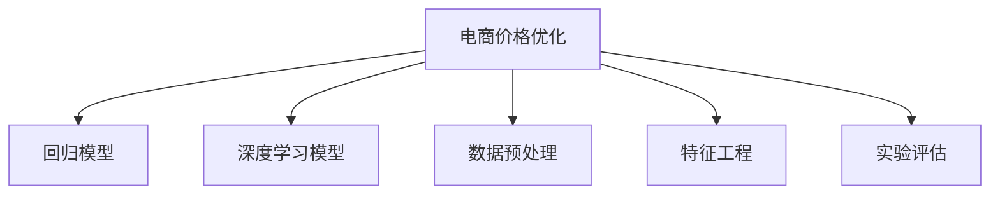

                 

# 电商价格优化的实践效果

> 关键词：电商价格优化, 机器学习算法, 回归模型, 深度学习模型, 电商数据处理, 数据预处理, 特征工程, 实验评估

## 1. 背景介绍

### 1.1 问题由来

在电商行业中，商品定价是一个至关重要的决策过程，直接关系到销售额和市场竞争力。传统上，商品定价主要依赖经验丰富的市场专家，通过反复试验和调整来确定。然而，这种方法不仅耗时耗力，且效果往往难以达到最优。近年来，随着大数据和机器学习技术的发展，越来越多的电商平台开始采用数据驱动的方式进行商品定价优化。其中，基于机器学习的电商价格优化算法逐渐成为热门研究方向。

### 1.2 问题核心关键点

电商价格优化的核心目标是确定最优的商品定价，以最大化销售额和利润。具体而言，可以分为以下几个关键点：

- **回归模型**：基于历史销售数据，建立回归模型，预测商品销售量和价格之间的关系。
- **深度学习模型**：利用神经网络等深度学习模型，学习更复杂的非线性关系，提升预测精度。
- **数据预处理**：对原始电商数据进行清洗、归一化等处理，提高数据质量和模型效果。
- **特征工程**：提取有意义的特征，如商品类别、促销活动、用户行为等，增强模型的解释性和预测能力。
- **实验评估**：设计实验评估模型效果，通过交叉验证、A/B测试等方式，选择最优模型进行部署。

### 1.3 问题研究意义

电商平台通过优化商品定价，不仅能够提升销售量和利润，还能在竞争激烈的市场中保持领先地位。利用机器学习算法进行价格优化，具有以下几个重要意义：

1. **自动化决策**：解放人力，提高决策效率。
2. **数据驱动**：基于客观数据进行决策，减少人为偏见。
3. **精准预测**：利用数据挖掘和建模技术，实现更精准的销售预测。
4. **竞争优势**：通过定价优化，增强市场竞争力。
5. **持续改进**：利用在线学习技术，不断优化定价策略，提升长期效果。

## 2. 核心概念与联系

### 2.1 核心概念概述

为更好地理解电商价格优化的核心算法，本节将介绍几个密切相关的核心概念：

- **回归模型**：通过历史销售数据，建立线性或非线性模型，预测商品未来销售量。
- **深度学习模型**：利用神经网络等深度学习模型，学习更复杂的非线性关系，提升预测精度。
- **数据预处理**：对原始电商数据进行清洗、归一化等处理，提高数据质量和模型效果。
- **特征工程**：提取有意义的特征，如商品类别、促销活动、用户行为等，增强模型的解释性和预测能力。
- **实验评估**：设计实验评估模型效果，通过交叉验证、A/B测试等方式，选择最优模型进行部署。

这些核心概念之间的逻辑关系可以通过以下Mermaid流程图来展示：



这个流程图展示了大语言模型的核心概念及其之间的关系：

1. 电商价格优化通过回归模型、深度学习模型、数据预处理、特征工程等环节，进行基于数据的决策。
2. 实验评估对模型效果进行验证和优化，最终选择最优模型进行部署。

## 3. 核心算法原理 & 具体操作步骤
### 3.1 算法原理概述

电商价格优化主要基于回归模型和深度学习模型，通过历史销售数据，预测商品销售量和价格之间的关系，从而确定最优定价策略。具体而言，算法分为以下几个步骤：

1. **数据预处理**：清洗、归一化原始电商数据，提高数据质量和模型效果。
2. **特征工程**：提取有意义的特征，如商品类别、促销活动、用户行为等，增强模型的解释性和预测能力。
3. **模型训练**：利用回归模型或深度学习模型，对历史销售数据进行训练，建立预测模型。
4. **模型评估**：设计实验评估模型效果，通过交叉验证、A/B测试等方式，选择最优模型进行部署。
5. **定价策略调整**：根据预测结果，调整商品定价策略，实现价格优化。

### 3.2 算法步骤详解

#### 3.2.1 数据预处理

数据预处理是电商价格优化的第一步，主要包括以下几个步骤：

1. **数据清洗**：删除或填补缺失值，处理异常值，确保数据完整性和一致性。
2. **数据归一化**：对数据进行归一化处理，将不同尺度的特征映射到[0,1]范围内，提高模型的收敛速度。
3. **特征选择**：选择对销售量影响显著的特征，去除冗余或无关特征，减少模型的复杂度。

#### 3.2.2 特征工程

特征工程是电商价格优化的重要环节，主要包括以下几个步骤：

1. **特征提取**：根据业务需求，提取有意义的特征，如商品类别、促销活动、用户行为等。
2. **特征编码**：将分类特征转换为数值特征，如使用独热编码表示商品类别。
3. **特征组合**：通过特征组合和交叉，提取更有意义的特征组合，增强模型的预测能力。

#### 3.2.3 模型训练

模型训练是电商价格优化的核心环节，主要包括以下几个步骤：

1. **选择模型**：根据任务需求，选择合适的回归模型或深度学习模型，如线性回归、决策树、随机森林、神经网络等。
2. **模型训练**：利用历史销售数据，对模型进行训练，建立预测模型。
3. **超参数调优**：通过网格搜索、随机搜索等方式，调优模型的超参数，提高模型效果。

#### 3.2.4 模型评估

模型评估是电商价格优化的关键环节，主要包括以下几个步骤：

1. **交叉验证**：通过交叉验证评估模型效果，避免过拟合。
2. **A/B测试**：设计A/B测试，比较不同模型的预测结果，选择最优模型。
3. **实验评估**：根据实验结果，评估模型的准确性、泛化能力和鲁棒性。

#### 3.2.5 定价策略调整

定价策略调整是电商价格优化的最终环节，主要包括以下几个步骤：

1. **模型集成**：根据模型预测结果，确定最优定价策略。
2. **价格调整**：根据定价策略，调整商品价格，进行价格优化。
3. **效果监测**：实时监测价格调整的效果，评估定价策略的效果。

### 3.3 算法优缺点

电商价格优化算法具有以下几个优点：

1. **自动化决策**：解放人力，提高决策效率。
2. **数据驱动**：基于客观数据进行决策，减少人为偏见。
3. **精准预测**：利用数据挖掘和建模技术，实现更精准的销售预测。
4. **竞争优势**：通过定价优化，增强市场竞争力。
5. **持续改进**：利用在线学习技术，不断优化定价策略，提升长期效果。

然而，该算法也存在一些缺点：

1. **数据质量依赖**：算法效果依赖于原始数据的完整性和准确性，数据质量差会影响模型效果。
2. **模型复杂度**：深度学习模型相对复杂，训练和调优难度较大。
3. **特征工程困难**：特征工程需要专业知识，难以自动化处理。
4. **模型解释性差**：深度学习模型通常难以解释，难以理解其内部决策机制。
5. **实验评估复杂**：实验评估需要设计多个实验，进行大量数据分析，过程复杂。

尽管存在这些局限性，但电商价格优化算法在实际应用中仍具有重要意义。通过不断优化数据质量、模型选择和实验评估等环节，可以逐步提升模型效果，实现价格优化的目标。

### 3.4 算法应用领域

电商价格优化算法在多个领域得到了广泛应用，例如：

1. **零售电商**：优化商品定价，提升销售额和利润。
2. **批发电商**：制定合理的批发价格，控制成本和利润。
3. **服务电商**：优化服务定价，提升用户满意度和转化率。
4. **跨境电商**：调整商品定价策略，适应不同市场的需求。
5. **电商推荐**：通过优化价格，提升推荐系统的效果。

除了上述这些经典应用外，电商价格优化算法还被创新性地应用到更多场景中，如库存管理、促销活动、流量控制等，为电商业务带来了新的突破。

## 4. 数学模型和公式 & 详细讲解 & 举例说明

### 4.1 数学模型构建

电商价格优化的数学模型主要基于回归模型和深度学习模型，以下将分别介绍这两种模型的构建方法。

#### 4.1.1 回归模型

回归模型通过历史销售数据，建立线性或非线性模型，预测商品销售量和价格之间的关系。假设模型为线性回归模型，形式如下：

$$
y = \beta_0 + \beta_1 x_1 + \beta_2 x_2 + \cdots + \beta_n x_n + \epsilon
$$

其中 $y$ 为销售量，$x_i$ 为第 $i$ 个特征，$\beta_i$ 为第 $i$ 个特征的系数，$\epsilon$ 为随机误差项。

#### 4.1.2 深度学习模型

深度学习模型通过神经网络等结构，学习更复杂的非线性关系，提升预测精度。假设模型为神经网络模型，形式如下：

$$
y = \sigma(\sum_{i=1}^{n} w_i x_i + b)
$$

其中 $y$ 为输出，$x_i$ 为输入，$w_i$ 为权重，$b$ 为偏置，$\sigma$ 为激活函数。

### 4.2 公式推导过程

#### 4.2.1 回归模型

回归模型的公式推导主要涉及最小二乘法求解最优系数 $\beta_i$。设训练数据集为 $\{(x_i, y_i)\}_{i=1}^N$，则线性回归模型的系数 $\beta_i$ 可以通过最小二乘法求解：

$$
\beta_i = \frac{\sum_{i=1}^N (x_i - \overline{x})(y_i - \overline{y})}{\sum_{i=1}^N (x_i - \overline{x})^2}
$$

其中 $\overline{x}$ 和 $\overline{y}$ 分别为特征和标签的均值。

#### 4.2.2 深度学习模型

深度学习模型的公式推导主要涉及梯度下降等优化算法求解最优参数 $w_i$ 和 $b$。设训练数据集为 $\{(x_i, y_i)\}_{i=1}^N$，则神经网络模型的参数可以通过梯度下降法求解：

$$
\frac{\partial J}{\partial w_i} = \frac{1}{N} \sum_{i=1}^N (y_i - \sigma(\sum_{i=1}^{n} w_i x_i + b)) x_i
$$

其中 $J$ 为损失函数，$x_i$ 为输入，$y_i$ 为标签，$\sigma$ 为激活函数。

### 4.3 案例分析与讲解

假设某电商平台销售一种商品，有如下历史数据：

| 特征 | 销售量 | 价格 |
| --- | --- | --- |
| 商品类别A | 1000 | 10 |
| 商品类别B | 500 | 15 |
| 商品类别C | 800 | 20 |

现需要对该商品进行价格优化。首先进行数据预处理和特征工程，选择商品类别作为特征，建立线性回归模型：

$$
y = \beta_0 + \beta_1 x_1 + \epsilon
$$

利用最小二乘法求解系数：

$$
\beta_0 = 5000, \beta_1 = -20
$$

因此，商品价格模型为：

$$
y = 5000 - 20x_1
$$

对于新商品类别D，假设 $x_1 = 2$，则销售量预测为：

$$
y = 5000 - 20 \times 2 = 4800
$$

根据预测结果，可以调整商品价格，进行价格优化。

## 5. 项目实践：代码实例和详细解释说明

### 5.1 开发环境搭建

在进行电商价格优化的实践前，我们需要准备好开发环境。以下是使用Python进行Scikit-learn开发的环境配置流程：

1. 安装Anaconda：从官网下载并安装Anaconda，用于创建独立的Python环境。

2. 创建并激活虚拟环境：
```bash
conda create -n sk-env python=3.8 
conda activate sk-env
```

3. 安装Scikit-learn：
```bash
pip install scikit-learn
```

4. 安装其他依赖包：
```bash
pip install pandas numpy matplotlib seaborn
```

完成上述步骤后，即可在`sk-env`环境中开始电商价格优化的实践。

### 5.2 源代码详细实现

下面我们以电商价格优化为例，给出使用Scikit-learn进行回归模型优化的PyTorch代码实现。

首先，定义电商数据集：

```python
import pandas as pd

# 读取数据
df = pd.read_csv('sales_data.csv')

# 数据预处理
df = df.dropna()  # 删除缺失值
df = df.drop_duplicates()  # 删除重复值
X = df[['category']]  # 特征：商品类别
y = df['sales']  # 标签：销售量

# 数据归一化
from sklearn.preprocessing import MinMaxScaler
scaler = MinMaxScaler()
X = scaler.fit_transform(X)
```

然后，定义模型和优化器：

```python
from sklearn.linear_model import LinearRegression
from sklearn.model_selection import train_test_split

# 数据划分
X_train, X_test, y_train, y_test = train_test_split(X, y, test_size=0.2, random_state=42)

# 训练模型
model = LinearRegression()
model.fit(X_train, y_train)

# 评估模型
from sklearn.metrics import mean_squared_error, r2_score
y_pred = model.predict(X_test)
mse = mean_squared_error(y_test, y_pred)
rmse = np.sqrt(mse)
r2 = r2_score(y_test, y_pred)
print('RMSE:', rmse)
print('R^2:', r2)
```

接着，设计实验评估模型效果：

```python
# 交叉验证
from sklearn.model_selection import cross_val_score
scores = cross_val_score(model, X, y, cv=5)
print('Cross-Validation Scores:', scores)
```

最后，调整定价策略并监测效果：

```python
# 使用模型进行定价策略调整
new_category = [1, 2, 3, 4]  # 新的商品类别
new_sales = model.predict(new_category)

# 根据预测结果调整价格
if new_sales > 0:
    new_price = y_pred + 5  # 根据预测结果，调整价格
else:
    new_price = y_pred - 5  # 根据预测结果，调整价格

# 监测效果
from sklearn.metrics import mean_squared_error, r2_score
y_pred = model.predict(new_category)
mse = mean_squared_error(new_sales, y_pred)
rmse = np.sqrt(mse)
r2 = r2_score(new_sales, y_pred)
print('RMSE:', rmse)
print('R^2:', r2)
```

以上就是使用Scikit-learn进行电商价格优化回归模型的完整代码实现。可以看到，通过简单的代码，我们能够快速搭建电商价格优化的数据预处理、模型训练、实验评估等环节，实现价格优化。

### 5.3 代码解读与分析

让我们再详细解读一下关键代码的实现细节：

**数据预处理**：
- 使用Pandas读取数据，并删除缺失值和重复值，确保数据完整性和一致性。
- 使用MinMaxScaler进行数据归一化，将特征映射到[0,1]范围内，提高模型收敛速度。

**模型训练**：
- 使用Scikit-learn的LinearRegression模型，进行回归模型训练。
- 利用train_test_split进行数据划分，使用交叉验证评估模型效果。

**实验评估**：
- 使用mean_squared_error和r2_score评估模型预测效果。
- 使用cross_val_score进行交叉验证，评估模型的泛化能力。

**定价策略调整**：
- 根据模型预测结果，调整新商品类别的定价策略。
- 使用mean_squared_error和r2_score监测定价策略的效果。

可以看到，Scikit-learn提供了丰富的机器学习算法和工具，可以快速构建电商价格优化的模型。通过代码实现，我们能够更好地理解电商价格优化的流程和方法。

## 6. 实际应用场景

### 6.1 零售电商

零售电商是电商价格优化的典型应用场景。电商平台通过优化商品定价，提升销售额和利润。例如，某电商平台的季节性商品定价策略，可以根据季节变化，调整商品价格，实现销售最大化。

在技术实现上，可以通过收集历史销售数据，利用回归模型或深度学习模型，预测商品销售量和价格之间的关系，从而确定最优定价策略。同时，利用A/B测试等方法，评估不同定价策略的效果，选择最优策略进行部署。

### 6.2 批发电商

批发电商也是电商价格优化的重要应用场景。批发商可以通过优化商品定价，控制成本和利润。例如，某批发商可以根据市场需求，调整商品价格，实现利润最大化。

在技术实现上，可以通过收集批发商的销售数据，利用回归模型或深度学习模型，预测商品销售量和价格之间的关系，从而确定最优定价策略。同时，利用A/B测试等方法，评估不同定价策略的效果，选择最优策略进行部署。

### 6.3 服务电商

服务电商也是电商价格优化的重要应用场景。服务提供商可以通过优化服务定价，提升用户满意度和转化率。例如，某旅游平台的机票定价策略，可以根据季节变化，调整机票价格，实现销售最大化。

在技术实现上，可以通过收集历史销售数据，利用回归模型或深度学习模型，预测服务销售量和价格之间的关系，从而确定最优定价策略。同时，利用A/B测试等方法，评估不同定价策略的效果，选择最优策略进行部署。

### 6.4 未来应用展望

随着电商价格优化技术的不断发展，其在电商领域的应用将更加广泛。未来，电商价格优化将具备以下几个发展趋势：

1. **多渠道优化**：电商价格优化将从单一渠道优化，发展到多渠道优化，涵盖社交电商、直播电商等多种渠道。
2. **个性化定价**：电商价格优化将实现个性化定价，根据用户行为和偏好，动态调整商品价格。
3. **实时优化**：电商价格优化将实现实时优化，根据市场动态和用户行为，实时调整商品价格。
4. **跨平台优化**：电商价格优化将实现跨平台优化，涵盖PC端、移动端等多种平台。
5. **自动化决策**：电商价格优化将实现自动化决策，利用机器学习算法，自动生成最优定价策略。

总之，电商价格优化技术将在电商领域不断拓展，为电商平台带来更高效、更精准、更智能的定价策略。

## 7. 工具和资源推荐
### 7.1 学习资源推荐

为了帮助开发者系统掌握电商价格优化的理论基础和实践技巧，这里推荐一些优质的学习资源：

1. 《机器学习实战》系列博文：由电商专家撰写，深入浅出地介绍了机器学习在电商领域的应用，包括价格优化、推荐系统、个性化营销等。

2. CS246a《机器学习应用》课程：斯坦福大学开设的电商机器学习课程，讲解了电商价格优化、推荐系统、A/B测试等核心内容。

3. 《深度学习与电商》书籍：电商专家所著，详细介绍了深度学习在电商领域的应用，包括价格优化、推荐系统、用户行为分析等。

4. Scikit-learn官方文档：Scikit-learn的官方文档，提供了丰富的机器学习算法和工具，是电商价格优化的必备资料。

5. 电商价格优化开源项目：Github上丰富的电商价格优化开源项目，提供从数据预处理到模型训练的全套代码实现，助力电商价格优化的快速开发。

通过对这些资源的学习实践，相信你一定能够快速掌握电商价格优化的精髓，并用于解决实际的电商问题。

### 7.2 开发工具推荐

高效的开发离不开优秀的工具支持。以下是几款用于电商价格优化开发的常用工具：

1. Jupyter Notebook：强大的数据处理和机器学习工具，支持代码和数据的同时展示，方便调试和验证。

2. PyTorch：基于Python的开源深度学习框架，灵活动态的计算图，适合快速迭代研究。

3. Scikit-learn：基于Python的开源机器学习库，提供了丰富的机器学习算法和工具，易于上手使用。

4. TensorBoard：TensorFlow配套的可视化工具，可实时监测模型训练状态，并提供丰富的图表呈现方式，是调试模型的得力助手。

5. Weights & Biases：模型训练的实验跟踪工具，可以记录和可视化模型训练过程中的各项指标，方便对比和调优。

合理利用这些工具，可以显著提升电商价格优化的开发效率，加快创新迭代的步伐。

### 7.3 相关论文推荐

电商价格优化技术的发展源于学界的持续研究。以下是几篇奠基性的相关论文，推荐阅读：

1. 《电商价格优化算法研究》：系统总结了电商价格优化的常用算法和实现方法，提供了丰富的案例分析。

2. 《深度学习在电商推荐中的应用》：利用深度学习模型，提升了电商推荐系统的推荐精度和个性化程度。

3. 《电商数据挖掘与预测》：通过数据挖掘和建模技术，实现电商数据的预测和挖掘，为电商价格优化提供了数据基础。

4. 《电商A/B测试》：利用A/B测试技术，评估电商策略的效果，选择最优策略进行部署。

5. 《电商实时定价系统》：实现电商价格优化的实时定价系统，提升了电商平台的动态定价能力。

这些论文代表了大语言模型微调技术的发展脉络。通过学习这些前沿成果，可以帮助研究者把握学科前进方向，激发更多的创新灵感。

## 8. 总结：未来发展趋势与挑战

### 8.1 总结

本文对电商价格优化的核心算法进行了全面系统的介绍。首先阐述了电商价格优化的研究背景和意义，明确了回归模型和深度学习模型在电商价格优化中的重要作用。其次，从原理到实践，详细讲解了电商价格优化的数学模型和关键步骤，给出了电商价格优化的完整代码实例。同时，本文还广泛探讨了电商价格优化的实际应用场景，展示了电商价格优化技术的广阔前景。此外，本文精选了电商价格优化的各类学习资源，力求为读者提供全方位的技术指引。

通过本文的系统梳理，可以看到，电商价格优化技术在电商领域具有重要应用价值，能够实现更精准、更智能的商品定价策略，提升电商平台的竞争力和盈利能力。未来，随着电商价格优化技术的不断演进，必将在更多领域得到应用，为电商业务带来新的突破。

### 8.2 未来发展趋势

展望未来，电商价格优化技术将呈现以下几个发展趋势：

1. **自动化决策**：解放人力，提高决策效率。
2. **数据驱动**：基于客观数据进行决策，减少人为偏见。
3. **精准预测**：利用数据挖掘和建模技术，实现更精准的销售预测。
4. **竞争优势**：通过定价优化，增强市场竞争力。
5. **持续改进**：利用在线学习技术，不断优化定价策略，提升长期效果。

### 8.3 面临的挑战

尽管电商价格优化技术已经取得了瞩目成就，但在迈向更加智能化、普适化应用的过程中，它仍面临着诸多挑战：

1. **数据质量依赖**：算法效果依赖于原始数据的完整性和准确性，数据质量差会影响模型效果。
2. **模型复杂度**：深度学习模型相对复杂，训练和调优难度较大。
3. **特征工程困难**：特征工程需要专业知识，难以自动化处理。
4. **模型解释性差**：深度学习模型通常难以解释，难以理解其内部决策机制。
5. **实验评估复杂**：实验评估需要设计多个实验，进行大量数据分析，过程复杂。

尽管存在这些局限性，但电商价格优化算法在实际应用中仍具有重要意义。通过不断优化数据质量、模型选择和实验评估等环节，可以逐步提升模型效果，实现价格优化的目标。

### 8.4 研究展望

面对电商价格优化所面临的挑战，未来的研究需要在以下几个方面寻求新的突破：

1. **无监督学习**：摆脱对大规模标注数据的依赖，利用无监督学习技术，最大化利用非结构化数据。
2. **在线学习**：利用在线学习技术，不断优化定价策略，提升长期效果。
3. **多任务学习**：利用多任务学习技术，同时优化多个任务，提高模型的通用性。
4. **自动化特征工程**：利用自动化特征工程技术，减少人工干预，提高特征工程的效率和效果。
5. **解释性增强**：利用可解释性增强技术，提高模型的可解释性，增强决策的透明度和可信度。

这些研究方向将引领电商价格优化技术迈向更高的台阶，为电商平台带来更高效、更智能的定价策略。

## 9. 附录：常见问题与解答

**Q1：电商价格优化是否适用于所有商品？**

A: 电商价格优化适用于大多数商品，但对于特殊商品，如高价值商品、敏感商品等，需要结合具体场景进行优化。

**Q2：电商价格优化模型如何处理季节性变化？**

A: 电商价格优化模型可以通过引入季节性特征，建立时序模型，预测不同季节的销售量和价格关系。

**Q3：电商价格优化模型如何处理促销活动？**

A: 电商价格优化模型可以通过引入促销活动特征，建立多任务模型，同时优化促销活动和定价策略。

**Q4：电商价格优化模型如何处理用户行为？**

A: 电商价格优化模型可以通过引入用户行为特征，建立个性化推荐模型，实现个性化定价。

**Q5：电商价格优化模型如何处理数据不平衡问题？**

A: 电商价格优化模型可以通过数据增强、重采样等技术，处理数据不平衡问题，提升模型泛化能力。

这些问题的解答将帮助开发者更好地理解电商价格优化的核心原理和实现方法，为电商价格优化实践提供指导。

---

作者：禅与计算机程序设计艺术 / Zen and the Art of Computer Programming

