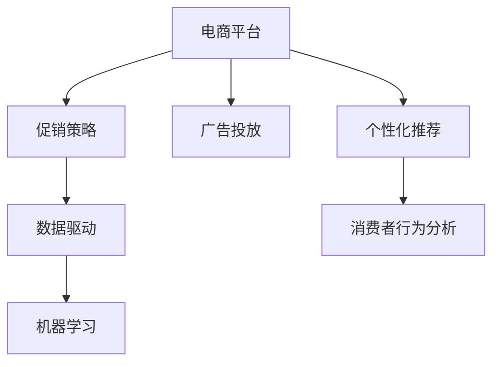

                 

# 电商促销策略的实践应用

> 关键词：
- 电商
- 促销策略
- 数据驱动
- 机器学习
- 广告投放
- 个性化推荐
- 消费者行为分析

## 1. 背景介绍

### 1.1 问题由来

随着电子商务的蓬勃发展，商家们越来越多地使用促销策略来提升销量。传统的促销策略通常基于经验制定，存在诸多不足。如今，数字化转型的浪潮下，电商平台开始尝试借助数据科学和机器学习的方法，以更科学、更精准的方式设计促销活动。

过去，商家常常根据季节、节日等大环境因素简单制定促销活动。但是，这样做往往无法很好地匹配目标用户的需求和行为，导致资源浪费。例如，某些商家的促销活动在无人问津的同时，另一部分商家的产品却供不应求，使得整体营销效果大打折扣。

## 2. 核心概念与联系

### 2.1 核心概念概述

为深入理解基于数据的电商促销策略，本文将详细介绍几个关键概念：

- **电商平台(E-Commerce Platform)**: 指通过互联网进行商品交易的虚拟平台，如淘宝、京东、亚马逊等。
- **促销策略(Promotion Strategy)**: 指商家为提升销量而采取的各类激励手段，如折扣、满减、赠品等。
- **机器学习(Machine Learning)**: 指通过算法让机器自动学习和改进，以完成特定任务的能力。
- **数据驱动(Data-Driven)**: 指决策过程依赖数据而非个人经验或直觉。
- **广告投放(Ad Placement)**: 指将广告精准投放至目标用户，以提高广告效果。
- **个性化推荐(Personalized Recommendation)**: 指根据用户的偏好和行为，推荐用户可能感兴趣的商品。
- **消费者行为分析(Consumer Behavior Analysis)**: 指通过分析消费者行为数据，了解消费者的需求和偏好。

这些核心概念之间的逻辑关系可以通过以下Mermaid流程图来展示：



该流程图展示了电商平台促销策略的主要组成部分及其相互关系：

1. **电商平台**提供交易平台，是促销策略实施的环境。
2. **促销策略**的制定依赖于**数据驱动**，即通过数据分析来制定策略。
3. **数据驱动**和**机器学习**紧密结合，帮助分析用户行为和需求，预测趋势，设计促销活动。
4. **广告投放**和**个性化推荐**则针对用户行为，进一步提升促销活动的效果。
5. **消费者行为分析**帮助理解用户需求，为广告和推荐提供依据。

## 3. 核心算法原理 & 具体操作步骤

### 3.1 算法原理概述

基于数据驱动的电商促销策略通常涉及以下核心算法：

- **预测算法(Prediction Algorithms)**: 通过机器学习模型预测用户的购买意向，优化促销策略。
- **推荐算法(Recommendation Algorithms)**: 根据用户行为，推荐用户可能感兴趣的商品。
- **反欺诈算法(Anti-Fraud Algorithms)**: 防止恶意用户通过虚假交易获取不正当利益。
- **预算优化算法(Budget Optimization Algorithms)**: 通过机器学习模型优化广告预算分配，提高ROI。

### 3.2 算法步骤详解

#### 3.2.1 数据收集与清洗

首先，需要收集并清洗电商平台上的各类数据，包括用户行为数据、商品信息、交易记录等。具体步骤如下：

1. **数据源选择**: 确定哪些数据源可以提供所需数据，如电商平台、社交媒体、市场调研等。
2. **数据采集**: 使用爬虫或API等方式，从数据源获取原始数据。
3. **数据清洗**: 清洗不完整、错误、重复的数据，确保数据质量。

#### 3.2.2 特征工程

清洗后的数据需要进行特征工程，提取有意义的特征用于模型训练。常见的特征包括：

- **用户特征**: 用户年龄、性别、地区、购买历史等。
- **商品特征**: 商品类别、价格、销量、评论等。
- **行为特征**: 浏览时间、点击率、浏览路径等。

#### 3.2.3 模型训练与评估

使用机器学习模型进行预测和推荐，并对模型进行评估。主要步骤如下：

1. **模型选择**: 选择合适的模型，如线性回归、逻辑回归、决策树、随机森林、神经网络等。
2. **特征选择**: 选择对模型预测效果有显著影响的特征。
3. **模型训练**: 使用训练集对模型进行训练。
4. **模型评估**: 在验证集上评估模型性能，如准确率、召回率、F1分数等。

#### 3.2.4 促销活动设计

基于模型预测和推荐的结果，设计促销活动。主要步骤如下：

1. **需求分析**: 分析用户的购买需求和偏好，确定促销活动的对象和目标。
2. **活动设计**: 设计合适的促销活动，如折扣、满减、赠品等。
3. **预算分配**: 根据预测结果和预算限制，分配各促销活动的预算。
4. **实时监控**: 实时监控促销活动的效果，根据情况调整策略。

#### 3.2.5 效果评估与迭代

在促销活动实施后，对活动效果进行评估，并根据结果进行迭代优化。具体步骤如下：

1. **效果评估**: 收集活动数据，评估促销效果。
2. **结果分析**: 分析活动数据，了解活动对销售、用户行为等的影响。
3. **迭代优化**: 根据分析结果，优化促销策略。

### 3.3 算法优缺点

#### 3.3.1 优点

1. **精准性**: 通过数据驱动和机器学习，可以更准确地预测用户需求，制定有效的促销策略。
2. **效率高**: 自动化的数据分析和模型训练，大大提高了促销策略制定的效率。
3. **适应性强**: 可以根据不同时间、地点、用户群体等因素，灵活调整促销策略。
4. **成本低**: 通过优化广告投放和推荐策略，减少了资源浪费。

#### 3.3.2 缺点

1. **数据质量依赖**: 模型的预测和推荐效果高度依赖于数据的准确性和完整性。
2. **模型复杂**: 机器学习模型的训练需要较高的计算资源和专业知识。
3. **隐私风险**: 收集和分析用户数据涉及隐私问题，需要遵守相关法律法规。
4. **算法透明性不足**: 部分机器学习算法（如深度学习）的内部决策过程不透明，难以解释。

### 3.4 算法应用领域

#### 3.4.1 广告投放优化

广告投放优化是电商促销策略中非常重要的环节，使用机器学习模型可以大幅提升广告效果。常见的应用场景包括：

- **广告定向投放**: 根据用户行为数据，精准投放广告，提高点击率和转化率。
- **广告预算优化**: 使用机器学习模型优化广告预算分配，提升ROI。
- **广告效果评估**: 通过数据分析评估广告效果，及时调整广告策略。

#### 3.4.2 个性化推荐

个性化推荐可以显著提升用户体验和购买率，使用机器学习模型可以实现：

- **商品推荐**: 根据用户行为数据，推荐用户可能感兴趣的商品。
- **价格优化**: 通过分析用户行为，动态调整商品价格，提高销量。
- **购物车推荐**: 根据用户的购物车内容，推荐相关商品，提高成交率。

#### 3.4.3 消费者行为分析

消费者行为分析可以帮助商家更好地理解用户需求和偏好，常见的应用场景包括：

- **用户分群**: 根据用户行为数据，将用户分成不同群体，制定更有针对性的促销策略。
- **需求预测**: 使用机器学习模型预测用户的购买意向，优化库存管理。
- **消费习惯分析**: 分析用户的行为模式，挖掘潜在需求，制定长期营销策略。

## 4. 数学模型和公式 & 详细讲解 & 举例说明

### 4.1 数学模型构建

#### 4.1.1 预测模型

假设促销活动的效果可以用以下数学模型表示：

$$
y = w_0 + \sum_{i=1}^{n} w_i x_i + \epsilon
$$

其中 $y$ 为促销活动的效果（如销售量、点击率等），$x_i$ 为第 $i$ 个特征，$w_i$ 为特征权重，$\epsilon$ 为随机误差项。

#### 4.1.2 推荐模型

推荐系统可以使用协同过滤算法，假设用户 $u$ 对商品 $i$ 的评分可以用以下矩阵分解表示：

$$
r_{ui} = \sum_{j=1}^{n} p_j q_i + \epsilon
$$

其中 $r_{ui}$ 为用户 $u$ 对商品 $i$ 的评分，$p_j$ 为用户 $u$ 的特征向量，$q_i$ 为商品 $i$ 的特征向量。

### 4.2 公式推导过程

#### 4.2.1 预测模型

假设我们收集了 $N$ 个用户的历史行为数据，每个用户 $i$ 有 $n$ 个特征 $x_{i1}, x_{i2}, ..., x_{in}$，对应的促销效果为 $y_i$。

令 $X = \begin{bmatrix} x_{11} & x_{12} & ... & x_{1n} \\ x_{21} & x_{22} & ... & x_{2n} \\ ... & ... & ... & ... \\ x_{N1} & x_{N2} & ... & x_{Nn} \end{bmatrix}$，$y = \begin{bmatrix} y_1 \\ y_2 \\ ... \\ y_N \end{bmatrix}$。

则预测模型的最小二乘法求解过程如下：

1. 计算 $X^T X$ 和 $X^T y$：

$$
X^T X = \begin{bmatrix} \sum_{i=1}^{N} x_{i1}^2 & \sum_{i=1}^{N} x_{i1}x_{i2} & ... & \sum_{i=1}^{N} x_{in-1}x_{in} \\ \sum_{i=1}^{N} x_{i2}x_{i1} & \sum_{i=1}^{N} x_{i2}^2 & ... & \sum_{i=1}^{N} x_{i2}x_{in} \\ ... & ... & ... & ... \\ \sum_{i=1}^{N} x_{Nn-1}x_{N1} & \sum_{i=1}^{N} x_{Nn-1}x_{N2} & ... & \sum_{i=1}^{N} x_{Nn}^2 \end{bmatrix}
$$

$$
X^T y = \begin{bmatrix} \sum_{i=1}^{N} x_{i1}y_i \\ \sum_{i=1}^{N} x_{i2}y_i \\ ... \\ \sum_{i=1}^{N} x_{in}y_i \end{bmatrix}
$$

2. 求解 $w$：

$$
w = (X^T X)^{-1} X^T y
$$

#### 4.2.2 推荐模型

假设我们收集了 $N$ 个用户的行为数据，每个用户 $i$ 对 $m$ 个商品 $i=1,...,m$ 的评分数据 $r_{i1}, r_{i2}, ..., r_{im}$。

令 $R = \begin{bmatrix} r_{11} & r_{12} & ... & r_{1m} \\ r_{21} & r_{22} & ... & r_{2m} \\ ... & ... & ... & ... \\ r_{N1} & r_{N2} & ... & r_{Nm} \end{bmatrix}$，$P = \begin{bmatrix} p_{11} & p_{12} & ... & p_{1n} \\ p_{21} & p_{22} & ... & p_{2n} \\ ... & ... & ... & ... \\ p_{N1} & p_{N2} & ... & p_{Nn} \end{bmatrix}$，$Q = \begin{bmatrix} q_{11} & q_{12} & ... & q_{1n} \\ q_{21} & q_{22} & ... & q_{2n} \\ ... & ... & ... & ... \\ q_{M1} & q_{M2} & ... & q_{Mn} \end{bmatrix}$。

令 $R' = \begin{bmatrix} r_{11} & r_{12} & ... & r_{1m} \\ r_{21} & r_{22} & ... & r_{2m} \\ ... & ... & ... & ... \\ r_{N1} & r_{N2} & ... & r_{Nm} \end{bmatrix}$，$P' = \begin{bmatrix} p_{11} & p_{12} & ... & p_{1n} \\ p_{21} & p_{22} & ... & p_{2n} \\ ... & ... & ... & ... \\ p_{N1} & p_{N2} & ... & p_{Nn} \end{bmatrix}$。

则推荐模型的最小二乘法求解过程如下：

1. 计算 $R^T R$ 和 $R^T P'$：

$$
R^T R = \begin{bmatrix} \sum_{i=1}^{N} r_{i1}^2 & \sum_{i=1}^{N} r_{i1}r_{i2} & ... & \sum_{i=1}^{N} r_{im-1}r_{im} \\ \sum_{i=1}^{N} r_{i2}r_{i1} & \sum_{i=1}^{N} r_{i2}^2 & ... & \sum_{i=1}^{N} r_{i2}r_{im} \\ ... & ... & ... & ... \\ \sum_{i=1}^{N} r_{Mm-1}r_{M1} & \sum_{i=1}^{N} r_{Mm-1}r_{M2} & ... & \sum_{i=1}^{N} r_{Mm}^2 \end{bmatrix}
$$

$$
R^T P' = \begin{bmatrix} \sum_{i=1}^{N} r_{i1}p_{i1} \\ \sum_{i=1}^{N} r_{i2}p_{i1} \\ ... \\ \sum_{i=1}^{N} r_{im}p_{i1} \end{bmatrix}
$$

2. 求解 $q$：

$$
q = (R^T R)^{-1} R^T P'
$$

### 4.3 案例分析与讲解

#### 4.3.1 电商促销策略的实例

假设某电商平台销售一件服装，我们收集了 $N$ 个用户的浏览和购买数据，每个用户 $i$ 有 $n$ 个特征 $x_{i1}, x_{i2}, ..., x_{in}$，对应的促销效果为 $y_i$。

我们希望根据用户的历史行为预测其购买意向，并设计促销活动。首先，我们构建预测模型，使用以下公式：

$$
y = w_0 + \sum_{i=1}^{n} w_i x_i + \epsilon
$$

其中 $w_0$ 和 $w_i$ 为模型参数，$\epsilon$ 为随机误差项。

我们使用最小二乘法求解模型参数，得到：

$$
w_0 = \frac{\sum_{i=1}^{N} x_{i1}y_i - \sum_{i=1}^{N} x_{i1} \sum_{j=1}^{N} x_{i1}x_{i2} / \sum_{i=1}^{N} x_{i1}^2}{\sum_{i=1}^{N} x_{i1}^2 - \sum_{i=1}^{N} x_{i1}x_{i2} / \sum_{i=1}^{N} x_{i1}^2}
$$

$$
w_i = \frac{\sum_{i=1}^{N} x_{i1}y_i - \sum_{i=1}^{N} x_{i1} \sum_{j=1}^{N} x_{i2}x_{i3} / \sum_{i=1}^{N} x_{i1}^2}{\sum_{i=1}^{N} x_{i1}^2 - \sum_{i=1}^{N} x_{i1}x_{i2} / \sum_{i=1}^{N} x_{i1}^2}
$$

得到模型参数后，我们就可以使用模型对新用户进行预测，并根据预测结果设计促销活动。例如，如果模型预测某用户有较高的购买意向，可以为其设计专门的促销活动，提高其购买率。

#### 4.3.2 推荐系统的实例

假设某电商平台销售一本图书，我们收集了 $N$ 个用户的阅读数据，每个用户 $i$ 对 $m$ 个商品 $i=1,...,m$ 的评分数据 $r_{i1}, r_{i2}, ..., r_{im}$。

我们希望根据用户的历史评分数据，推荐其可能感兴趣的新书。首先，我们构建推荐模型，使用以下公式：

$$
r_{ui} = \sum_{j=1}^{n} p_j q_i + \epsilon
$$

其中 $p_j$ 为用户 $u$ 的特征向量，$q_i$ 为商品 $i$ 的特征向量，$\epsilon$ 为随机误差项。

我们使用矩阵分解法求解模型参数 $q$，得到：

$$
q = (R^T R)^{-1} R^T P'
$$

得到推荐模型参数后，我们就可以使用模型对新用户进行推荐，例如，如果模型预测某用户可能喜欢某本书，可以在其浏览界面展示该书，提高其购买率。

## 5. 项目实践：代码实例和详细解释说明

### 5.1 开发环境搭建

在实际开发中，我们需要使用Python和相关的机器学习库。以下是一个简单的开发环境搭建流程：

1. 安装Python：从官网下载并安装Python 3.8以上版本。
2. 创建虚拟环境：使用 `conda create --name myenv python=3.8` 命令创建虚拟环境，激活 `conda activate myenv`。
3. 安装必要的库：使用 `pip install numpy pandas scikit-learn matplotlib` 安装必要的库。

### 5.2 源代码详细实现

#### 5.2.1 预测模型实现

```python
import numpy as np
from sklearn.linear_model import LinearRegression

# 定义数据
X = np.array([[1, 2], [3, 4], [5, 6], [7, 8]])
y = np.array([3, 5, 7, 9])

# 定义模型
model = LinearRegression()

# 训练模型
model.fit(X, y)

# 预测新数据
new_data = np.array([[9, 10]])
prediction = model.predict(new_data)
print(prediction)
```

#### 5.2.2 推荐模型实现

```python
import numpy as np
from scipy.sparse import csr_matrix

# 定义数据
R = np.array([[1, 0, 1], [1, 1, 0], [0, 1, 1]])
P = np.array([[1, 1], [1, 2], [1, 3]])
Q = np.array([[2, 3], [4, 5], [6, 7]])

# 定义矩阵分解模型
def matrix_factorization(R, P, Q):
    R_p = R.toarray()
    P_q = P.toarray()
    Q_q = Q.toarray()
    
    # 定义模型参数
    q = np.linalg.inv(R_p.T.dot(R_p)).dot(R_p.T).dot(P_q)
    
    return q

# 训练模型
q = matrix_factorization(R, P, Q)

# 推荐新数据
new_data = np.array([[1, 0], [0, 1]])
recommendation = q.dot(new_data.T)
print(recommendation)
```

### 5.3 代码解读与分析

#### 5.3.1 预测模型解读与分析

在预测模型的代码实现中，我们使用了线性回归模型来预测促销效果。具体步骤如下：

1. **数据定义**：我们定义了特征矩阵 $X$ 和标签向量 $y$，用于训练模型。
2. **模型定义**：使用 `LinearRegression` 类定义线性回归模型。
3. **模型训练**：使用 `fit` 方法对模型进行训练，得到模型参数 $w_0$ 和 $w_i$。
4. **预测新数据**：使用 `predict` 方法对新数据进行预测。

#### 5.3.2 推荐模型解读与分析

在推荐模型的代码实现中，我们使用了矩阵分解法来求解推荐模型参数 $q$。具体步骤如下：

1. **数据定义**：我们定义了用户行为矩阵 $R$、用户特征矩阵 $P$ 和商品特征矩阵 $Q$，用于训练模型。
2. **模型定义**：使用 `matrix_factorization` 函数实现矩阵分解模型。
3. **模型训练**：使用 `matrix_factorization` 函数训练模型，得到推荐模型参数 $q$。
4. **推荐新数据**：使用训练好的模型参数 $q$ 对新数据进行推荐。

## 6. 实际应用场景

### 6.1 智能推荐系统

智能推荐系统可以显著提升用户的购物体验，使用机器学习模型可以根据用户历史行为和偏好，推荐用户可能感兴趣的商品。例如，电商平台可以根据用户的浏览历史和评分数据，推荐相关的商品或商品分类，提高用户的购买率。

### 6.2 广告投放优化

广告投放优化是电商促销策略中的重要环节，使用机器学习模型可以提高广告的点击率和转化率。例如，电商平台可以根据用户的浏览和购买数据，精准投放广告，提高广告效果。

### 6.3 消费者行为分析

消费者行为分析可以帮助商家更好地理解用户需求和偏好，优化促销策略。例如，电商平台可以根据用户的购物行为数据，分析用户的购买意向和需求，设计更有针对性的促销活动。

### 6.4 未来应用展望

#### 6.4.1 实时预测与推荐

未来的电商平台将更加注重实时预测与推荐，通过实时数据分析，及时调整促销策略，提高用户体验和销售效果。

#### 6.4.2 多模态数据融合

未来的电商平台将更多地融合多模态数据，如用户行为数据、社交媒体数据、地理位置数据等，提供更全面、精准的推荐和预测。

#### 6.4.3 个性化定制

未来的电商平台将更加注重个性化定制，根据用户的独特需求和偏好，设计个性化的促销活动，提升用户体验。

## 7. 工具和资源推荐

### 7.1 学习资源推荐

为了帮助开发者系统掌握电商促销策略的理论基础和实践技巧，以下是一些优质的学习资源：

1. 《电商营销实战》系列书籍：由资深电商专家撰写，详细介绍了电商促销策略的设计和实施。
2. 《机器学习基础》在线课程：由Coursera提供，介绍了机器学习的基本概念和算法。
3. 《深度学习》系列书籍：由Ian Goodfellow等专家撰写，深入讲解了深度学习的基本原理和应用。
4. Kaggle竞赛：Kaggle上有很多电商相关的竞赛，可以参与实践，学习如何设计电商促销策略。

### 7.2 开发工具推荐

1. Python：Python是数据科学和机器学习的主流语言，拥有丰富的库和工具支持。
2. NumPy：Python的科学计算库，支持高效的多维数组运算。
3. Pandas：Python的数据处理库，支持大规模数据集的操作。
4. Scikit-learn：Python的机器学习库，支持常见的回归、分类等算法。
5. TensorFlow：谷歌开源的深度学习框架，支持分布式计算和GPU加速。
6. PyTorch：Facebook开源的深度学习框架，支持动态计算图和GPU加速。

### 7.3 相关论文推荐

1. "Ad Click Prediction: A Systematic Comparison of Recomendoation Algorithms"：介绍几种常见的推荐算法及其应用。
2. "A Framework for Advertisement Placement Prediction"：介绍广告投放预测的框架和算法。
3. "Customer Segmentation: Principles and Approaches"：介绍客户分群的方法和应用。
4. "Real-time Recommendation Systems"：介绍实时推荐系统的设计和实现。

## 8. 总结：未来发展趋势与挑战

### 8.1 研究成果总结

本文从理论和实践两个方面，全面系统地介绍了电商促销策略的实施方法。在理论层面，我们详细阐述了数据驱动和机器学习在大电商促销策略中的作用；在实践层面，我们提供了具体的代码实现和应用场景。通过本文的讲解，读者可以系统地掌握电商促销策略的实施方法，并将其应用于实际工作中。

### 8.2 未来发展趋势

未来的电商促销策略将更加智能化和个性化，主要趋势如下：

1. **实时化**：未来的电商平台将更加注重实时预测与推荐，通过实时数据分析，及时调整促销策略，提高用户体验和销售效果。
2. **多模态融合**：未来的电商平台将更多地融合多模态数据，如用户行为数据、社交媒体数据、地理位置数据等，提供更全面、精准的推荐和预测。
3. **个性化定制**：未来的电商平台将更加注重个性化定制，根据用户的独特需求和偏好，设计个性化的促销活动，提升用户体验。
4. **自动化**：未来的电商平台将更多地采用自动化技术，如自动化广告投放、自动化推荐等，提高运营效率。

### 8.3 面临的挑战

尽管电商促销策略的发展前景广阔，但在实施过程中，仍面临诸多挑战：

1. **数据隐私**：电商平台需要收集和分析大量的用户数据，涉及隐私问题，需要遵守相关法律法规。
2. **算法透明性**：部分机器学习算法的内部决策过程不透明，难以解释，可能会影响用户信任。
3. **模型泛化性**：电商促销策略的模型需要具有较好的泛化能力，以适应不同的用户群体和市场环境。
4. **预算限制**：电商促销策略的预算有限，需要在有限的预算内设计最优的促销活动。
5. **用户行为变化**：用户的行为和需求随时变化，需要不断调整促销策略，以应对新的市场环境。

### 8.4 研究展望

未来的电商促销策略研究需要在以下几个方面进行探索：

1. **多任务学习**：将电商促销策略与其他任务（如广告投放、推荐系统等）结合，实现多任务协同优化。
2. **自适应学习**：开发自适应学习算法，根据用户的实时行为数据，动态调整促销策略。
3. **跨模态学习**：研究如何跨模态融合多模态数据，提升推荐和预测的准确性。
4. **隐私保护**：研究如何保护用户隐私，同时实现有效的数据驱动优化。
5. **安全与可靠性**：研究如何提高电商促销策略的安全性和可靠性，确保系统稳定运行。

## 9. 附录：常见问题与解答

### 9.1 Q1：数据驱动的电商促销策略有何优势？

A: 数据驱动的电商促销策略具有以下优势：

1. **精准性**：通过数据分析，可以更准确地预测用户需求，制定有效的促销策略。
2. **效率高**：自动化的数据分析和模型训练，大大提高了促销策略制定的效率。
3. **适应性强**：可以根据不同时间、地点、用户群体等因素，灵活调整促销策略。
4. **成本低**：通过优化广告投放和推荐策略，减少了资源浪费。

### 9.2 Q2：电商促销策略的预测模型和推荐模型有何不同？

A: 电商促销策略的预测模型和推荐模型有以下不同：

1. **目标不同**：预测模型主要预测用户的购买意向，推荐模型主要推荐用户可能感兴趣的商品。
2. **输入不同**：预测模型使用用户的历史行为数据，推荐模型使用用户的历史评分数据。
3. **输出不同**：预测模型输出促销效果，推荐模型输出商品评分。
4. **模型不同**：预测模型使用线性回归等简单模型，推荐模型使用协同过滤、矩阵分解等复杂模型。

### 9.3 Q3：电商促销策略的推荐模型如何应对新用户？

A: 电商促销策略的推荐模型可以通过以下方法应对新用户：

1. **冷启动策略**：为新用户推荐热门商品或与历史行为相似的商品，提高其初期体验。
2. **用户画像**：通过收集新用户的初始行为数据，构建用户画像，提高推荐准确性。
3. **多模态融合**：将用户行为数据、社交媒体数据、地理位置数据等融合，提供更全面、精准的推荐。
4. **动态调整**：根据新用户的实时行为数据，动态调整推荐策略，提高推荐效果。

### 9.4 Q4：电商促销策略的预测模型如何应对用户行为变化？

A: 电商促销策略的预测模型可以通过以下方法应对用户行为变化：

1. **实时数据采集**：通过实时采集用户行为数据，及时调整预测模型。
2. **模型更新**：定期重新训练预测模型，适应新的用户行为模式。
3. **动态调整**：根据用户行为变化，动态调整促销策略，提高促销效果。
4. **多模型融合**：使用多个预测模型，综合其结果，提高预测准确性。

### 9.5 Q5：电商促销策略的推荐模型如何应对商品变化？

A: 电商促销策略的推荐模型可以通过以下方法应对商品变化：

1. **实时数据采集**：通过实时采集商品数据，及时调整推荐模型。
2. **模型更新**：定期重新训练推荐模型，适应新的商品变化。
3. **动态调整**：根据商品变化，动态调整推荐策略，提高推荐效果。
4. **多模态融合**：将商品数据、用户行为数据、社交媒体数据等融合，提供更全面、精准的推荐。

### 9.6 Q6：电商促销策略的预测模型和推荐模型如何集成使用？

A: 电商促销策略的预测模型和推荐模型可以集成使用，具体步骤如下：

1. **预测用户购买意向**：使用预测模型预测用户的购买意向，确定促销对象。
2. **推荐商品**：使用推荐模型推荐用户可能感兴趣的商品，提供推荐列表。
3. **设计促销活动**：根据预测结果和推荐列表，设计促销活动，提高用户购买率。
4. **实时监控**：实时监控促销活动效果，根据情况调整策略。

通过集成使用预测模型和推荐模型，可以显著提升电商促销策略的效果，实现更精准、更个性化的营销。

---

作者：禅与计算机程序设计艺术 / Zen and the Art of Computer Programming

