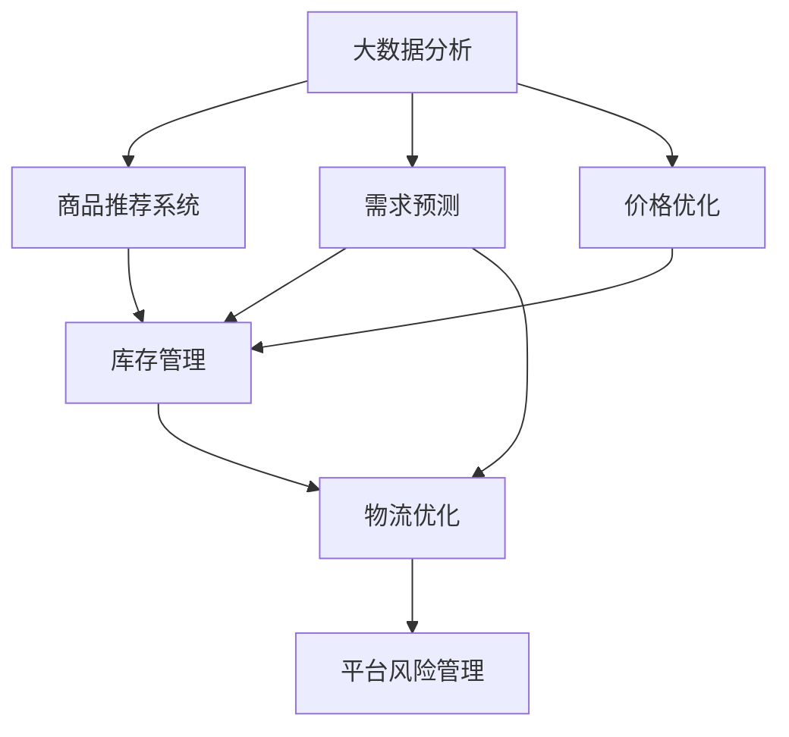

                 

# 电商平台供给能力提升：大数据分析应用

## 1. 背景介绍

### 1.1 问题由来
随着电子商务的蓬勃发展，电商平台已从传统的商品交易平台演变为综合服务提供商，用户的购物体验、消费场景、交易效率等变得日益复杂。供给侧能力提升，即提升平台的商品供应速度、质量及灵活性，已成为电商平台竞争力的关键所在。大数据分析在提升平台供给能力方面起着举足轻重的作用，其应用范围涉及商品推荐、库存管理、物流优化、需求预测等多个方面。本文将系统梳理大数据分析在电商平台供给能力提升中的应用，旨在为电商平台运营者提供技术参考与建议。

### 1.2 问题核心关键点
1. **商品推荐系统**：利用用户行为数据、商品属性等进行个性化推荐，提升用户体验与转化率。
2. **库存管理**：通过需求预测、动态调价等手段优化库存水平，避免缺货与积压。
3. **物流优化**：实时追踪与预测物流动态，优化仓储与配送路径，提高配送效率与成本控制。
4. **需求预测**：基于历史销售数据、季节性因素、市场趋势等，预测未来需求变化，指导生产与采购。
5. **价格优化**：根据市场供需、竞争对手价格等动态调整商品价格，提升销售效果。
6. **平台风险管理**：利用大数据分析识别潜在风险，提前预警与防范，保障平台稳定运行。

## 2. 核心概念与联系

### 2.1 核心概念概述

为更好地理解大数据分析在电商平台供给能力提升中的应用，本节将介绍几个核心概念：

- **大数据分析**：利用先进的数据处理与分析技术，从海量数据中提取有价值的信息，辅助决策制定。
- **商品推荐系统**：基于用户行为、商品属性等多维数据，智能推荐商品，提升用户购买意愿。
- **需求预测**：通过历史销售数据、市场趋势等预测未来需求，优化库存与产能规划。
- **价格优化**：根据市场需求、竞争情况等动态调整商品价格，提升销售效果。
- **库存管理**：通过需求预测、动态调价等手段优化库存水平，避免缺货与积压。
- **物流优化**：实时追踪与预测物流动态，优化仓储与配送路径，提高配送效率与成本控制。
- **平台风险管理**：利用大数据分析识别潜在风险，提前预警与防范，保障平台稳定运行。

这些核心概念之间的逻辑关系可以通过以下Mermaid流程图来展示：



这个流程图展示了大数据分析在电商平台供给能力提升中的应用框架：

1. 大数据分析从多个数据源获取信息。
2. 利用这些信息支持商品推荐、需求预测、价格优化、库存管理、物流优化及平台风险管理。
3. 各应用环节相互协作，共同提升电商平台供给能力。

## 3. 核心算法原理 & 具体操作步骤
### 3.1 算法原理概述

大数据分析在电商平台供给能力提升中主要应用以下算法：

1. **协同过滤**：利用用户与商品之间的相似性，推荐用户可能感兴趣的商品。
2. **矩阵分解**：将用户行为矩阵分解为低维矩阵，提取用户和商品的潜在因子，推荐相似商品。
3. **梯度提升树**：利用决策树算法构建预测模型，对历史数据进行回归或分类预测。
4. **神经网络**：利用深度学习模型，提取高阶特征，提升预测精度。
5. **时间序列分析**：对时间序列数据进行分析，预测未来需求。
6. **异常检测**：通过聚类、分类等方法，识别异常数据，防范潜在风险。

### 3.2 算法步骤详解

大数据分析在电商平台供给能力提升中的应用，通常遵循以下步骤：

**Step 1: 数据准备**
- 收集平台用户行为数据、商品信息、销售记录、物流信息等。
- 清洗数据，处理缺失、异常值，保证数据质量。
- 选择合适的数据存储与计算平台，如Hadoop、Spark等。

**Step 2: 特征工程**
- 提取与构建有意义的特征，如用户画像、商品属性、购买时间、季节性因素等。
- 进行特征选择与降维，减少冗余信息。
- 构建特征库，存储预处理后的特征。

**Step 3: 模型训练**
- 选择合适的算法与模型，如协同过滤、矩阵分解、梯度提升树、神经网络等。
- 训练模型，优化超参数，提高模型性能。
- 模型评估与选择，通过交叉验证等方法验证模型效果。

**Step 4: 预测与优化**
- 利用训练好的模型进行预测，如商品推荐、需求预测、价格优化等。
- 实时监控预测结果，及时调整模型参数与策略。
- 对预测结果进行业务验证，优化模型。

**Step 5: 部署与迭代**
- 将模型集成到实际系统中，进行部署与上线。
- 持续监控模型表现，进行迭代优化。
- 定期更新数据与模型，保证系统稳定运行。

### 3.3 算法优缺点

大数据分析在电商平台供给能力提升中具有以下优点：

1. **提升用户体验**：通过精准推荐，提升用户满意度与购物体验。
2. **优化库存管理**：通过需求预测，避免库存积压与缺货，降低运营成本。
3. **提高物流效率**：通过优化物流路径，减少配送时间与成本。
4. **精准价格优化**：通过动态定价，提升销售效果与市场竞争力。
5. **风险管理**：通过数据分析，及时预警与防范风险，保障平台稳定运行。

同时，大数据分析也存在以下局限性：

1. **数据隐私与安全**：用户行为数据等敏感信息可能带来隐私泄露风险。
2. **数据质量问题**：数据不完整、不准确等问题可能影响分析结果。
3. **计算资源消耗**：大数据分析通常需要高性能计算平台与大数据存储，资源消耗较大。
4. **模型复杂度**：复杂的模型可能需要大量的训练数据与计算资源。
5. **结果解释性**：一些模型如深度学习，其预测结果可能难以解释。

尽管存在这些局限性，但大数据分析在电商平台供给能力提升中的应用仍是不可或缺的。未来需要进一步优化数据质量与处理效率，提高模型的可解释性与用户信任度。

### 3.4 算法应用领域

大数据分析在电商平台供给能力提升中的应用，覆盖了电商平台的多个方面：

1. **商品推荐系统**：个性化推荐，提升用户购买意愿与转化率。
2. **库存管理**：需求预测、动态调价，优化库存水平，降低运营成本。
3. **物流优化**：实时追踪与预测物流动态，优化仓储与配送路径，提高配送效率。
4. **需求预测**：基于历史销售数据、季节性因素等预测未来需求，指导生产与采购。
5. **价格优化**：根据市场需求、竞争情况等动态调整商品价格，提升销售效果。
6. **平台风险管理**：利用大数据分析识别潜在风险，提前预警与防范，保障平台稳定运行。

这些应用领域共同构成了电商平台供给能力提升的完整生态系统，通过大数据分析的驱动，电商平台能够更好地满足用户需求，提升自身竞争力。

## 4. 数学模型和公式 & 详细讲解  
### 4.1 数学模型构建

本节将使用数学语言对大数据分析在电商平台供给能力提升中的应用进行更加严格的刻画。

设电商平台用户数为 $N$，商品数为 $M$，交易时间为 $T$。用户在时间 $t$ 购买商品 $i$ 的概率为 $p_{it}$，商品 $i$ 的销售量在时间 $t$ 为 $s_{it}$。设 $\mathbf{X}_t$ 为时间 $t$ 用户的特征向量，$\mathbf{Y}_t$ 为时间 $t$ 用户购买商品 $i$ 的标签向量。

定义历史销售矩阵 $\mathbf{S}_t$ 为 $N \times M$ 矩阵，其中 $\mathbf{S}_t(i,j) = s_{it}$ 表示时间 $t$ 用户 $i$ 购买商品 $j$ 的数量。定义历史行为矩阵 $\mathbf{P}_t$ 为 $N \times T$ 矩阵，其中 $\mathbf{P}_t(i,j) = p_{it}$ 表示时间 $t$ 用户购买商品 $j$ 的概率。

设 $\mathbf{X}_t$ 为时间 $t$ 用户的特征向量，$\mathbf{Y}_t$ 为时间 $t$ 用户购买商品 $i$ 的标签向量。

定义预测模型 $f$ 为：

$$
f(\mathbf{X}_t) = \begin{cases}
    1 & \text{用户购买商品} \\
    0 & \text{用户未购买商品}
\end{cases}
$$

目标是最小化预测误差 $E$：

$$
E = \sum_{i=1}^M \sum_{t=1}^T \mathbb{E}[f(\mathbf{X}_t) - \mathbf{Y}_t]
$$

### 4.2 公式推导过程

以下我们以需求预测为例，推导基于时间序列分析的需求预测模型及其梯度计算公式。

假设需求序列 $d_t$ 符合ARIMA模型：

$$
d_t = c + \sum_{i=1}^p \phi_i d_{t-i} + \sum_{j=1}^q \theta_j \epsilon_{t-j} + \epsilon_t
$$

其中 $\epsilon_t$ 为误差项，$p$ 和 $q$ 分别为自回归项与差分项的阶数。使用最小二乘法对需求序列进行拟合，得到回归系数 $\beta$ 和差分项系数 $\gamma$：

$$
\beta = (X'X)^{-1}X'y
$$

$$
\gamma = (D'D)^{-1}D'y
$$

其中 $X$ 为自回归系数矩阵，$y$ 为需求序列矩阵，$D$ 为差分项系数矩阵。

则需求预测模型的梯度为：

$$
\frac{\partial E}{\partial \beta} = -2 \frac{\partial E}{\partial d_t} \frac{\partial d_t}{\partial \beta}
$$

$$
\frac{\partial E}{\partial \gamma} = -2 \frac{\partial E}{\partial d_t} \frac{\partial d_t}{\partial \gamma}
$$

通过计算梯度，更新回归系数与差分项系数，即可得到最优的需求预测模型。

### 4.3 案例分析与讲解

以某电商平台的历史销售数据为例，使用时间序列分析模型进行需求预测。

首先，对原始数据进行预处理，去除异常值和噪声，得到平稳的时间序列 $d_t$。

然后，根据历史数据拟合ARIMA模型，得到回归系数 $\beta$ 和差分项系数 $\gamma$。

接着，将新数据 $d_{t+1}$ 输入模型，得到预测值 $\hat{d}_{t+1}$。

最后，将预测值 $\hat{d}_{t+1}$ 与实际销售数据 $d_{t+1}$ 对比，计算预测误差。

## 5. 项目实践：代码实例和详细解释说明
### 5.1 开发环境搭建

在进行大数据分析实践前，我们需要准备好开发环境。以下是使用Python进行Pandas和Scikit-Learn开发的环境配置流程：

1. 安装Anaconda：从官网下载并安装Anaconda，用于创建独立的Python环境。

2. 创建并激活虚拟环境：
```bash
conda create -n big-data-env python=3.8 
conda activate big-data-env
```

3. 安装Pandas：
```bash
conda install pandas
```

4. 安装Scikit-Learn：
```bash
conda install scikit-learn
```

5. 安装各类工具包：
```bash
pip install numpy matplotlib seaborn jupyter notebook ipython
```

完成上述步骤后，即可在`big-data-env`环境中开始大数据分析实践。

### 5.2 源代码详细实现

这里我们以需求预测为例，给出使用Pandas和Scikit-Learn进行需求预测的Python代码实现。

首先，定义需求预测函数：

```python
from sklearn.metrics import mean_squared_error
from statsmodels.tsa.arima.model import ARIMA

def forecast_demand(data, p, d, q):
    model = ARIMA(data, order=(p, d, q))
    model_fit = model.fit()
    forecast = model_fit.forecast(steps=1)
    return forecast

# 训练数据
train_data = pd.read_csv('train_data.csv')

# 构建特征
train_data['date'] = pd.to_datetime(train_data['date'])
train_data.set_index('date', inplace=True)

# 对需求数据进行差分
train_data['demand'] = train_data['demand'].diff()

# 选择模型参数
p = 1
d = 1
q = 1

# 训练模型并预测
forecast = forecast_demand(train_data['demand'], p, d, q)
```

然后，评估预测模型的性能：

```python
from sklearn.model_selection import train_test_split

# 划分训练集与测试集
train_data, test_data = train_test_split(train_data, test_size=0.2, random_state=42)

# 训练模型并预测
train_forecast = forecast_demand(train_data['demand'], p, d, q)
test_forecast = forecast_demand(test_data['demand'], p, d, q)

# 计算误差
mse_train = mean_squared_error(train_data['demand'], train_forecast)
mse_test = mean_squared_error(test_data['demand'], test_forecast)

print(f'Train MSE: {mse_train:.2f}')
print(f'Test MSE: {mse_test:.2f}')
```

最后，展示预测结果：

```python
import matplotlib.pyplot as plt

# 绘制实际与预测需求曲线
plt.plot(train_data['date'], train_data['demand'], label='Actual')
plt.plot(train_data['date'], train_forecast, label='Forecast')
plt.legend()
plt.show()
```

以上就是使用Pandas和Scikit-Learn进行需求预测的完整代码实现。可以看到，Pandas和Scikit-Learn在数据处理与建模上提供了强有力的支持，可以快速实现需求预测功能。

### 5.3 代码解读与分析

让我们再详细解读一下关键代码的实现细节：

**forecast_demand函数**：
- 定义ARIMA模型，并拟合训练数据。
- 使用模型进行一步预测，得到需求预测值。

**train_data预处理**：
- 将日期转换为Pandas的日期类型，便于时间序列分析。
- 将需求数据差分，得到平稳时间序列。

**模型训练与预测**：
- 使用Scikit-Learn提供的ARIMA模型，选择适当的自回归项与差分项阶数。
- 训练模型并预测未来需求。

**模型评估**：
- 计算实际需求与预测需求之间的均方误差。
- 展示模型在训练集与测试集上的预测结果。

可以看到，Pandas和Scikit-Learn在大数据分析与建模上具有很强的适用性，能够快速实现各种预测模型，并进行评估与优化。开发者可以通过扩展现有库或自定义算法，进一步提升预测模型的准确性与泛化能力。

## 6. 实际应用场景
### 6.1 智能库存管理系统

智能库存管理系统可以通过大数据分析提升平台供给能力。通过实时监控库存水平、需求预测、动态调价等手段，确保平台商品供给充足，避免缺货与积压，提升用户体验。

在技术实现上，可以收集平台历史销售数据、用户行为数据、季节性因素等，利用时间序列分析、协同过滤等方法，预测未来需求，调整库存水平，优化动态调价策略，从而实现智能库存管理。

### 6.2 动态价格优化系统

动态价格优化系统可以根据市场需求、竞争情况等实时调整商品价格，提升销售效果与市场竞争力。通过大数据分析，实时监控市场动态，识别价格敏感用户与产品，动态调整定价策略，以最大化销售收益。

具体而言，可以利用用户行为数据、竞争对手价格数据、季节性因素等，构建价格优化模型，实时预测价格调整效果，优化价格策略，确保价格竞争力与利润最大化。

### 6.3 实时物流监控与优化

实时物流监控与优化系统可以通过大数据分析，实时追踪与预测物流动态，优化仓储与配送路径，提高配送效率与成本控制。通过收集物流数据、天气信息、交通情况等，构建物流优化模型，实时监控配送动态，优化配送路线，提升配送效率，降低配送成本。

### 6.4 风险管理与预警系统

风险管理与预警系统可以利用大数据分析，识别潜在风险，提前预警与防范，保障平台稳定运行。通过收集用户投诉数据、交易异常数据、市场波动数据等，构建风险预警模型，实时监控平台风险，提前预警潜在风险，及时采取应对措施，保障平台稳定运行。

## 7. 工具和资源推荐
### 7.1 学习资源推荐

为了帮助开发者系统掌握大数据分析在电商平台供给能力提升中的应用，这里推荐一些优质的学习资源：

1. 《Python数据科学手册》：全面介绍Python在数据分析与机器学习中的应用，适合初学者与进阶者。

2. 《统计学习方法》：李航老师著，介绍了机器学习的基础理论与常用算法，适合深入学习机器学习理论。

3. 《Kaggle入门到精通》：Kaggle官方教程，通过实战项目，带你快速上手大数据分析与机器学习。

4. 《机器学习实战》：Peter Harrington著，通过具体案例，介绍常用的机器学习算法与工具。

5. Coursera《数据分析与统计学习》课程：由Johns Hopkins大学开设，涵盖数据分析与统计学习的核心内容，适合系统学习。

6. Udacity《数据分析与可视化》课程：通过实际项目，介绍数据分析与可视化的全流程，适合实战训练。

通过对这些资源的学习实践，相信你一定能够快速掌握大数据分析的精髓，并用于解决实际的电商平台供给能力提升问题。

### 7.2 开发工具推荐

高效的开发离不开优秀的工具支持。以下是几款用于大数据分析开发的常用工具：

1. Pandas：Python的数据分析与处理库，支持数据清洗、转换、聚合等操作，适合大规模数据处理。

2. Scikit-Learn：Python的机器学习库，支持分类、回归、聚类等常用算法，适合构建预测模型。

3. TensorFlow：由Google主导的深度学习框架，适合构建复杂神经网络模型。

4. PyTorch：Facebook开发的深度学习框架，适合快速迭代研究与实验。

5. Jupyter Notebook：Python的交互式开发环境，支持代码块、输出、图形等多样化展示，适合分享与协作。

6. Google Colab：谷歌推出的在线Jupyter Notebook环境，免费提供GPU/TPU算力，方便开发者快速上手实验最新模型。

合理利用这些工具，可以显著提升大数据分析的开发效率，加快创新迭代的步伐。

### 7.3 相关论文推荐

大数据分析在电商平台供给能力提升中的应用，得益于学界的持续研究。以下是几篇奠基性的相关论文，推荐阅读：

1. Yin et al., "Sales Forecasting: A Multiple Period Seasonal Decomposition Approach"：提出了基于时间序列分析的销售预测方法，并应用于多个实际案例。

2. Kourentzes et al., "Forecasting demand in retail using machine learning"：介绍了机器学习在零售业需求预测中的应用，详细讨论了算法选择与模型优化。

3. Cai et al., "Predictive inventory optimization in the presence of supply chain disruptions"：研究了在供应链中断条件下，库存优化的方法，并通过实际案例验证了模型的有效性。

4. Tran et al., "An integrated approach to dynamic pricing and inventory management"：探讨了动态定价与库存管理相结合的方法，提高了销售效果与库存利用率。

5. Liao et al., "A large-scale approach to online retail inventory management"：介绍了大规模在线零售平台库存管理的策略，通过大数据分析与优化算法，实现了库存与订单的高效管理。

这些论文代表了大数据分析在电商平台供给能力提升领域的最新研究成果，通过学习这些前沿成果，可以帮助研究者把握学科前进方向，激发更多的创新灵感。

## 8. 总结：未来发展趋势与挑战
### 8.1 总结

本文对大数据分析在电商平台供给能力提升中的应用进行了全面系统的介绍。首先阐述了电商平台的供给能力提升的背景与重要性，明确了大数据分析在提升平台供给能力方面的独特价值。其次，从原理到实践，详细讲解了大数据分析的数学模型与算法步骤，给出了需求预测等任务的具体代码实现。同时，本文还广泛探讨了大数据分析在电商平台供给能力提升中的多应用场景，展示了大数据分析的广泛应用前景。此外，本文精选了大数据分析的学习资源，力求为开发者提供全面的技术指引。

通过本文的系统梳理，可以看到，大数据分析在电商平台供给能力提升中发挥着不可或缺的作用。利用大数据分析，电商平台能够更精准地进行商品推荐、库存管理、物流优化、需求预测、价格优化及风险管理，全面提升供给能力，实现高效运营。未来，伴随技术的不断进步与应用的深入挖掘，大数据分析必将在电商平台的供给能力提升中发挥更大作用，引领电商平台走向更加智能化与高效化的未来。

### 8.2 未来发展趋势

展望未来，大数据分析在电商平台供给能力提升中呈现以下几个发展趋势：

1. **自动化与智能化**：大数据分析将逐步实现自动化，通过智能算法与模型，实时分析与优化运营决策。

2. **实时性与高效性**：大数据分析系统将实现实时数据处理与分析，提高决策的响应速度与效率。

3. **多源数据融合**：通过融合多个数据源，实现更全面、准确的数据分析，提升预测与优化效果。

4. **模型优化与解释**：通过优化模型结构与算法，提高预测精度与可解释性，增强用户信任度。

5. **边缘计算**：在大数据分析中引入边缘计算技术，减少数据传输延迟，提升分析效率。

6. **联邦学习**：通过分布式计算，保护数据隐私与安全，实现高效的数据分析与模型优化。

这些趋势凸显了大数据分析在电商平台供给能力提升中的广阔前景。这些方向的探索发展，必将进一步提升电商平台供给能力，为电商平台的运营与发展注入新的动力。

### 8.3 面临的挑战

尽管大数据分析在电商平台供给能力提升中已经取得了显著成效，但在迈向更加智能化、普适化应用的过程中，仍面临诸多挑战：

1. **数据隐私与安全**：用户行为数据等敏感信息可能带来隐私泄露风险。

2. **数据质量问题**：数据不完整、不准确等问题可能影响分析结果。

3. **计算资源消耗**：大数据分析通常需要高性能计算平台与大数据存储，资源消耗较大。

4. **模型复杂度**：复杂的模型可能需要大量的训练数据与计算资源。

5. **结果解释性**：一些模型如深度学习，其预测结果可能难以解释。

尽管存在这些挑战，但大数据分析在电商平台供给能力提升中的应用仍是不可或缺的。未来需要进一步优化数据质量与处理效率，提高模型的可解释性与用户信任度。

### 8.4 研究展望

面对大数据分析在电商平台供给能力提升中面临的挑战，未来的研究需要在以下几个方面寻求新的突破：

1. **自动化与智能化**：进一步提升大数据分析的自动化水平，减少人工干预，提高分析效率。

2. **实时性与高效性**：引入实时数据处理技术，提升分析速度与响应效率。

3. **多源数据融合**：研究多源数据融合技术，提高分析的全面性与准确性。

4. **模型优化与解释**：开发更优的模型结构与算法，提高预测精度与可解释性。

5. **边缘计算与联邦学习**：引入边缘计算与联邦学习技术，提升数据安全与处理效率。

这些研究方向将引领大数据分析技术迈向更高的台阶，为电商平台供给能力提升提供更全面、高效、可靠的支持。面向未来，大数据分析必将在电商平台的运营与发展中发挥更大作用，为电商平台的智能化转型提供有力支撑。

## 9. 附录：常见问题与解答

**Q1：大数据分析在电商平台供给能力提升中的数据来源有哪些？**

A: 大数据分析在电商平台供给能力提升中的数据来源包括但不限于：
1. 平台销售数据：包括商品销量、用户购买记录等。
2. 用户行为数据：包括浏览行为、点击行为、收藏行为等。
3. 物流数据：包括物流跟踪信息、配送时间等。
4. 市场数据：包括市场趋势、季节性因素、竞争对手数据等。
5. 内部运营数据：包括库存水平、商品属性、促销活动等。

**Q2：大数据分析在电商平台供给能力提升中常用的算法有哪些？**

A: 大数据分析在电商平台供给能力提升中常用的算法包括但不限于：
1. 协同过滤：利用用户与商品之间的相似性，推荐用户可能感兴趣的商品。
2. 矩阵分解：将用户行为矩阵分解为低维矩阵，提取用户和商品的潜在因子，推荐相似商品。
3. 梯度提升树：利用决策树算法构建预测模型，对历史数据进行回归或分类预测。
4. 神经网络：利用深度学习模型，提取高阶特征，提升预测精度。
5. 时间序列分析：对时间序列数据进行分析，预测未来需求。
6. 异常检测：通过聚类、分类等方法，识别异常数据，防范潜在风险。

**Q3：如何评估大数据分析在电商平台供给能力提升中的应用效果？**

A: 评估大数据分析在电商平台供给能力提升中的应用效果，可以从以下几个方面进行：
1. 准确率与召回率：评估预测模型的准确率与召回率，判断其预测效果。
2. 均方误差（MSE）：评估预测值与实际值之间的均方误差，判断模型精度。
3. A/B测试：通过A/B测试，比较优化前后的运营效果，评估算法的实际影响。
4. 业务指标：通过业务指标（如转化率、销售量、库存周转率等）评估算法带来的业务效果。
5. 用户反馈：通过用户反馈，了解算法对用户体验的影响。

**Q4：如何优化大数据分析的计算效率？**

A: 优化大数据分析的计算效率，可以从以下几个方面进行：
1. 数据预处理：优化数据预处理流程，减少数据清洗、转换等操作的时间消耗。
2. 算法优化：优化算法模型，减少模型复杂度，提高训练速度。
3. 分布式计算：采用分布式计算框架，如Hadoop、Spark等，提高数据处理与分析效率。
4. 数据缓存：利用数据缓存技术，减少重复计算，提高数据读取效率。
5. 硬件加速：利用GPU、TPU等硬件加速设备，提高数据处理与分析的速度。

**Q5：如何保护大数据分析中用户数据的隐私与安全？**

A: 保护大数据分析中用户数据的隐私与安全，可以从以下几个方面进行：
1. 数据匿名化：对用户数据进行匿名化处理，保护用户隐私。
2. 加密存储：采用加密存储技术，防止数据泄露。
3. 访问控制：设置访问权限，确保只有授权人员可以访问数据。
4. 数据脱敏：对敏感数据进行脱敏处理，防止数据泄露。
5. 安全传输：采用安全传输协议，如HTTPS，保护数据传输安全。

通过以上措施，可以显著提升大数据分析的隐私与安全保障，确保用户数据的安全性。

