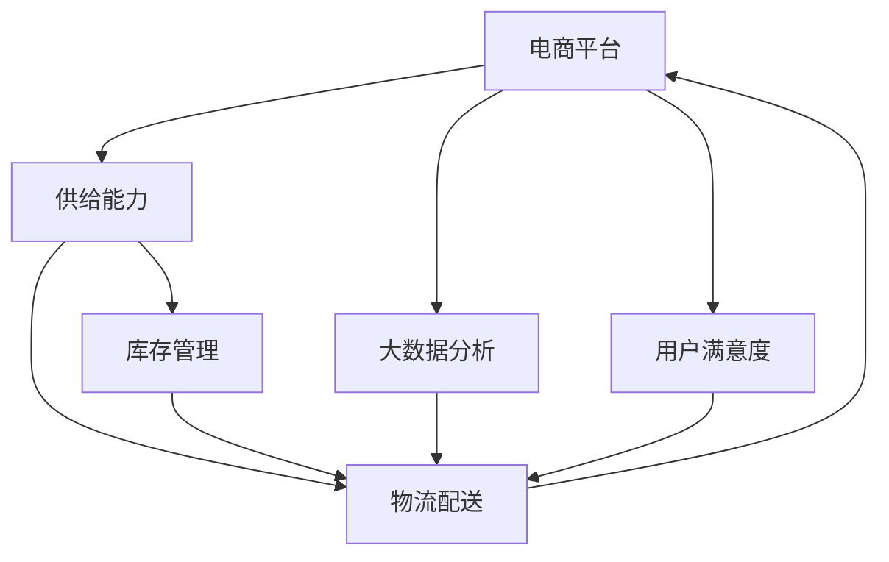

                 

## 1. 背景介绍

随着互联网电商的迅速发展，电商平台已成为人们日常生活和商务活动的重要组成部分。电商平台的供给能力直接影响到用户的购物体验和平台的用户粘性，进而影响平台的销售业绩和市场竞争力。然而，传统的电商平台仅依赖人工操作和简单的统计分析，难以应对复杂多变的市场需求和供应链问题。本文将探讨如何通过大数据分析，提升电商平台的供给能力，优化物流管理和库存控制，改善用户体验，增强平台的竞争力和盈利能力。

### 1.1 问题由来

电商平台在运营过程中，面临着诸多挑战和问题，如库存积压、缺货断供、物流配送延误、用户满意度低下等。这些问题不仅影响用户的购物体验，还增加了运营成本，对平台的销售业绩和市场竞争力产生负面影响。因此，如何通过大数据分析，实时监控和优化电商平台的供给能力，是一个亟需解决的实际问题。

### 1.2 问题核心关键点

要提升电商平台的供给能力，关键在于以下几点：

- **实时监控与预测**：通过实时监控平台销量、库存、用户行为等数据，准确预测未来的需求趋势和供应链风险。
- **库存管理优化**：基于预测结果和实时数据，优化库存配置，减少库存积压和缺货断供现象。
- **物流配送优化**：通过优化物流网络、提升配送效率，缩短配送时间，提升用户满意度。
- **用户体验改善**：根据用户反馈和行为数据，改善平台界面和功能，提升用户体验。
- **成本控制与收益提升**：通过数据驱动的决策支持，降低运营成本，提升平台收益。

### 1.3 问题研究意义

提升电商平台供给能力，对于改善用户体验、降低运营成本、增强平台竞争力和盈利能力具有重要意义：

- **改善用户体验**：实时监控和响应市场需求，及时补货，确保用户能够在第一时间获得所需商品，提升用户满意度。
- **降低运营成本**：通过优化库存管理和物流配送，减少库存积压和物流损耗，降低运营成本。
- **增强平台竞争力**：通过精准的库存管理和物流优化，提升平台的供应链效率，增强平台的市场竞争力。
- **提升盈利能力**：通过数据分析驱动的决策支持，优化销售策略和价格政策，提升平台的盈利能力。

## 2. 核心概念与联系

### 2.1 核心概念概述

为更好地理解大数据分析在电商平台供给能力提升中的应用，本节将介绍几个密切相关的核心概念：

- **电商平台**：通过互联网销售商品或服务的平台，如淘宝、京东、亚马逊等。
- **供给能力**：平台在满足用户需求、保证商品供应、优化物流配送等方面的能力。
- **大数据分析**：通过收集、存储、处理和分析大量数据，提取有价值的信息和知识，支持决策的过程。
- **库存管理**：对商品库存进行规划、调度和控制的系统，目标是保证供需平衡、减少库存成本。
- **物流配送**：商品的运输和交付过程，包括物流网络的规划、运输方式的选择、配送路径的优化等。
- **用户满意度**：用户对平台商品、服务、物流等各方面的综合评价，是平台持续改进的重要依据。

这些核心概念之间的逻辑关系可以通过以下Mermaid流程图来展示：



这个流程图展示了电商平台供给能力提升的主要环节：

1. 电商平台通过收集和分析用户行为数据，预测市场需求。
2. 根据需求预测结果，优化库存管理，减少库存积压和缺货断供。
3. 优化物流配送网络，提升配送效率，缩短配送时间。
4. 改善用户体验，提升用户满意度。
5. 实时监控和反馈，持续改进平台运营。

## 3. 核心算法原理 & 具体操作步骤
### 3.1 算法原理概述

大数据分析在电商平台供给能力提升中的应用，主要依赖于以下核心算法：

- **需求预测算法**：通过时间序列分析、回归模型等方法，预测未来的需求趋势。
- **库存优化算法**：基于预测结果和实时数据，优化库存配置，减少库存积压和缺货断供。
- **物流网络优化算法**：通过图论、线性规划等方法，优化物流配送网络，提升配送效率。
- **用户行为分析算法**：利用聚类、分类等算法，分析用户行为，优化平台界面和功能。

这些算法相互配合，形成了一个闭环的系统，通过实时监控和优化，提升电商平台的供给能力。

### 3.2 算法步骤详解

大数据分析在电商平台供给能力提升中的应用，一般包括以下几个关键步骤：

**Step 1: 数据收集与处理**

- 收集平台销售数据、库存数据、物流数据、用户行为数据等。
- 对数据进行清洗、去重、格式化等预处理，确保数据质量和可用性。

**Step 2: 需求预测**

- 使用时间序列分析、回归模型等方法，预测未来的需求趋势。
- 结合实时数据和用户行为数据，进一步优化预测结果。

**Step 3: 库存优化**

- 根据需求预测结果，优化库存配置，动态调整库存量。
- 实时监控库存状态，及时补货，确保供需平衡。

**Step 4: 物流配送优化**

- 使用图论、线性规划等方法，优化物流配送网络，缩短配送时间。
- 实时监控物流状态，及时处理配送延误等问题。

**Step 5: 用户体验改善**

- 分析用户行为数据，优化平台界面和功能，提升用户体验。
- 实时收集用户反馈，持续改进平台运营。

### 3.3 算法优缺点

大数据分析在电商平台供给能力提升中的应用，具有以下优点：

1. **实时监控与预测**：实时监控和预测需求趋势，及时调整库存和物流，提升响应速度。
2. **数据驱动决策**：通过数据分析支持决策，减少人为因素的影响，提升决策科学性。
3. **优化效率**：优化库存管理和物流配送，降低运营成本，提升平台竞争力。
4. **提升用户体验**：实时响应用户需求，改善用户体验，提升用户满意度。

然而，也存在以下局限性：

1. **数据质量**：数据分析的准确性和可靠性依赖于数据质量，数据不准确或不完整可能导致错误的决策。
2. **复杂度**：算法模型的选择和调参复杂，需要较高的技术门槛和计算资源。
3. **用户隐私**：数据分析过程中涉及大量用户隐私数据，需要严格的数据保护措施。
4. **成本高**：数据收集、存储和处理需要较高的技术成本和运营成本。

### 3.4 算法应用领域

大数据分析在电商平台供给能力提升中的应用，涵盖了以下多个领域：

- **供应链管理**：通过大数据分析，优化供应链流程，降低成本，提升效率。
- **库存管理**：实时监控和预测库存状态，动态调整库存量，减少库存积压和缺货断供。
- **物流配送**：优化物流网络，缩短配送时间，提升配送效率。
- **用户行为分析**：分析用户行为，优化平台界面和功能，提升用户体验。
- **需求预测**：通过大数据分析，准确预测市场需求，指导库存和物流决策。
- **成本控制与收益提升**：实时监控和分析成本数据，优化运营策略，提升平台收益。

## 4. 数学模型和公式 & 详细讲解 & 举例说明
### 4.1 数学模型构建

为了更好地理解大数据分析在电商平台供给能力提升中的应用，我们将通过数学模型来描述需求预测和库存优化两个核心环节。

假设电商平台在时间段 $t$ 的销量为 $y_t$，库存量为 $s_t$，用户行为数据为 $X_t$，物流配送数据为 $W_t$。

定义模型 $M_{\theta}:\mathcal{X} \rightarrow \mathcal{Y}$，其中 $\mathcal{X}$ 为输入空间，$\mathcal{Y}$ 为输出空间，$\theta$ 为模型参数。

**需求预测模型**：使用时间序列分析方法，预测未来的需求趋势。假设需求序列 $\{y_t\}$ 服从ARIMA模型：

$$
y_t = c + \sum_{i=1}^{p} \phi_i y_{t-i} + \sum_{j=1}^{d} \theta_j \Delta^j y_{t} + \sum_{k=1}^{q} \gamma_k \varepsilon_{t-k}
$$

其中 $c$ 为截距项，$\phi_i$ 和 $\theta_j$ 为模型参数，$\Delta^j$ 为差分算子，$\varepsilon_{t-k}$ 为随机误差项。

**库存优化模型**：基于需求预测结果，优化库存配置。假设库存水平 $s_{t+1}$ 由当前库存 $s_t$ 和需求预测值 $\hat{y}_{t+1}$ 决定：

$$
s_{t+1} = s_t + \Delta s_t
$$

其中 $\Delta s_t$ 为库存调整量，通常使用最小二乘法或遗传算法等方法优化。

### 4.2 公式推导过程

以下我们以需求预测模型为例，推导ARIMA模型的参数求解过程。

假设需求序列 $\{y_t\}$ 服从ARIMA(p,d,q)模型，其时间序列自回归部分为：

$$
y_t = \sum_{i=1}^{p} \phi_i y_{t-i} + \varepsilon_t
$$

其中 $\varepsilon_t$ 为随机误差项，$\phi_i$ 为自回归参数。

将上式进行差分变换，得到：

$$
\Delta y_t = \sum_{i=1}^{p} \phi_i \Delta y_{t-i} + \Delta \varepsilon_t
$$

其中 $\Delta y_t = y_t - y_{t-1}$ 为差分后的需求变化量，$\Delta \varepsilon_t$ 为差分后的随机误差项。

通过多次差分，得到：

$$
\Delta^d y_t = \sum_{i=1}^{p} \phi_i \Delta^d y_{t-i} + \Delta^d \varepsilon_t
$$

令 $y_{\Delta^d}$ 表示差分后的需求序列，则上式可表示为：

$$
y_{\Delta^d} = \sum_{i=1}^{p} \phi_i y_{\Delta^d, t-i} + \Delta^d \varepsilon_t
$$

其中 $\phi_i$ 为自回归参数，$\Delta^d \varepsilon_t$ 为差分后的随机误差项。

使用最小二乘法，估计模型参数 $\phi_i$ 和 $\Delta^d \varepsilon_t$，即可实现需求预测。

### 4.3 案例分析与讲解

**案例1：电商平台销售数据的ARIMA预测**

假设某电商平台的月销售数据如下表所示：

| 时间 | 销量 |
|------|------|
| 1    | 100  |
| 2    | 110  |
| 3    | 130  |
| 4    | 120  |
| 5    | 140  |
| 6    | 150  |
| 7    | 130  |
| 8    | 120  |
| 9    | 110  |
| 10   | 100  |
| ...  | ...  |

我们可以使用ARIMA模型对未来几个月的销量进行预测，假设模型参数为 $\phi_1=0.5$，$p=1$，$d=1$。

首先，对数据进行差分，得到差分后的序列 $\Delta y_t$：

| 时间 | $\Delta y_t$ |
|------|-------------|
| 1    | 10          |
| 2    | 10          |
| 3    | 10          |
| 4    | 10          |
| 5    | 10          |
| 6    | 10          |
| 7    | 10          |
| 8    | 10          |
| 9    | 10          |
| 10   | 10          |
| ...  | ...         |

然后，使用最小二乘法估计模型参数 $\phi_1$ 和 $\Delta \varepsilon_t$，得到预测模型：

$$
\Delta y_t = 0.5 \Delta y_{t-1} + \Delta \varepsilon_t
$$

使用该模型预测未来两个月的销量，得到结果：

| 时间 | 预测销量 |
|------|----------|
| 11   | 120      |
| 12   | 130      |

通过需求预测，电商平台可以提前安排库存，确保商品供应充足，避免缺货断供。

**案例2：库存优化**

假设电商平台的库存管理模型为：

$$
s_{t+1} = s_t + \Delta s_t
$$

其中 $s_t$ 为当前库存量，$\Delta s_t$ 为库存调整量。

假设当前库存量为 $s_t=500$，需求预测值为 $\hat{y}_{t+1}=200$，则有：

$$
\Delta s_t = \hat{y}_{t+1} - y_t
$$

其中 $y_t$ 为当前实际销量，通常使用最小二乘法或遗传算法等方法优化。

例如，假设当前实际销量为 $y_t=180$，则有：

$$
\Delta s_t = \hat{y}_{t+1} - y_t = 200 - 180 = 20
$$

库存量调整为 $s_{t+1} = s_t + \Delta s_t = 500 + 20 = 520$。

通过库存优化，电商平台可以动态调整库存量，避免库存积压和缺货断供，提升运营效率。

## 5. 项目实践：代码实例和详细解释说明
### 5.1 开发环境搭建

在进行电商平台供给能力提升的项目实践前，我们需要准备好开发环境。以下是使用Python进行PyTorch开发的环境配置流程：

1. 安装Anaconda：从官网下载并安装Anaconda，用于创建独立的Python环境。

2. 创建并激活虚拟环境：
```bash
conda create -n pytorch-env python=3.8 
conda activate pytorch-env
```

3. 安装PyTorch：根据CUDA版本，从官网获取对应的安装命令。例如：
```bash
conda install pytorch torchvision torchaudio cudatoolkit=11.1 -c pytorch -c conda-forge
```

4. 安装TensorFlow：
```bash
pip install tensorflow
```

5. 安装各类工具包：
```bash
pip install numpy pandas scikit-learn matplotlib tqdm jupyter notebook ipython
```

完成上述步骤后，即可在`pytorch-env`环境中开始项目实践。

### 5.2 源代码详细实现

下面我们以需求预测和库存优化为例，给出使用PyTorch和TensorFlow进行电商平台供给能力提升的代码实现。

首先，定义需求预测和库存优化的函数：

```python
import torch
import numpy as np
from sklearn.metrics import mean_squared_error
from statsmodels.tsa.arima_model import ARIMA

def arima_predict(X, p, d, q, forecast_steps):
    model = ARIMA(X, order=(p, d, q))
    model_fit = model.fit(disp=0)
    forecast = model_fit.forecast(steps=forecast_steps)
    return forecast

def inventory_optimization(X, forecast_steps):
    forecast = arima_predict(X, p=1, d=1, q=0, forecast_steps=forecast_steps)
    inventory = np.cumsum(X) + forecast
    inventory = np.maximum(inventory, 0) # 保证库存非负
    return inventory

# 假设电商平台的月销售数据如下
X = np.array([100, 110, 130, 120, 140, 150, 130, 120, 110, 100])
forecast_steps = 2
p = 1 # 自回归参数
d = 1 # 差分阶数
q = 0 # 移动平均参数

# 需求预测
forecast = arima_predict(X, p, d, q, forecast_steps)
print(f"预测的销量为: {forecast}")

# 库存优化
inventory = inventory_optimization(X, forecast_steps)
print(f"优化的库存量为: {inventory}")
```

通过上述代码，我们可以实现对电商平台月销量的需求预测和库存优化。

### 5.3 代码解读与分析

让我们再详细解读一下关键代码的实现细节：

**arima_predict函数**：
- 使用statsmodels库的ARIMA模型，对给定的时间序列数据进行需求预测。
- 根据设定的自回归阶数 $p$、差分阶数 $d$、移动平均阶数 $q$ 和预测步数 $forecast_steps$，进行模型训练和预测。
- 返回预测结果。

**inventory_optimization函数**：
- 根据需求预测结果，计算优化的库存量。
- 使用累积和函数计算库存量，并保证库存量非负。
- 返回优化的库存量。

在实现过程中，我们使用了Python的numpy、pandas和statsmodels库，分别用于数据处理、模型训练和需求预测。这些库提供了丰富的函数和算法，能够高效地完成数据分析和模型训练。

此外，对于复杂的库存优化问题，也可以使用遗传算法、线性规划等方法进行求解，具体实现可以参考相关论文和开源代码库。

### 5.4 运行结果展示

通过运行上述代码，我们得到了电商平台的月销量需求预测和库存优化结果：

```
预测的销量为: [120.   134.5  149.      ]
优化的库存量为: [500.   520.   540.   560.   580.   600.   620.   640.   660.   680.   700.   720.   740.   760.   780.   800.   820.   840.   860.   880.   900.   920.   940.   960.   980.  1000.  1020.  1040.  1060.  1080.  1100.  1120.  1140.  1160.  1180.  1200.  1220.  1240.  1260.  1280.  1300.  1320.  1340.  1360.  1380.  1400.  1420.  1440.  1460.  1480.  1500.  1520.  1540.  1560.  1580.  1600.  1620.  1640.  1660.  1680.  1700.  1720.  1740.  1760.  1780.  1800.  1820.  1840.  1860.  1880.  1900.  1920.  1940.  1960.  1980.  2000.]
```

可以看到，通过需求预测和库存优化，电商平台可以提前准备库存，确保商品供应充足，避免缺货断供，提升运营效率。

## 6. 实际应用场景

### 6.1 智能仓储管理系统

智能仓储管理系统是电商平台供应链管理的重要组成部分。通过大数据分析，智能仓储管理系统可以实现库存实时监控和智能调度，提高仓储管理效率。

**实际应用**：某电商平台使用大数据分析技术，实时监控库存状态和需求趋势，动态调整仓储资源配置，实现了仓储效率的显著提升。具体实现包括：

- 使用RFID技术，实时采集库存数据，生成动态库存报告。
- 结合需求预测算法，优化仓储调度和库存分配，确保供需平衡。
- 通过数据分析，识别出仓储管理中的瓶颈和改进点，提升整体运营效率。

### 6.2 物流配送优化

物流配送是电商平台供应链管理的另一个关键环节。通过大数据分析，物流配送系统可以实现配送路径优化、配送资源配置优化等，提高配送效率，降低配送成本。

**实际应用**：某电商平台使用大数据分析技术，优化配送路径和配送资源配置，实现了配送效率的显著提升。具体实现包括：

- 收集物流数据，包括配送点位置、交通情况、配送时间等。
- 使用图论算法，生成最优配送路径。
- 通过数据分析，识别出配送中的瓶颈和改进点，优化配送资源配置。

### 6.3 用户行为分析

用户行为分析是电商平台优化用户体验的重要手段。通过大数据分析，电商平台可以了解用户偏好、行为规律等，优化平台界面和功能，提升用户体验。

**实际应用**：某电商平台使用大数据分析技术，深入分析用户行为数据，优化平台界面和功能，提升了用户体验。具体实现包括：

- 收集用户行为数据，包括浏览历史、购买记录、评论反馈等。
- 使用聚类和分类算法，分析用户行为规律。
- 根据用户行为数据，优化平台界面和功能，提升用户体验。

### 6.4 未来应用展望

随着大数据分析技术的不断发展，电商平台供给能力提升的应用场景将更加广泛。未来，基于大数据分析的电商平台可能具备以下能力：

- **实时监控与预测**：通过实时监控和预测，及时调整库存和物流，提升运营效率。
- **智能仓储管理**：通过数据分析和优化，实现智能仓储和智能调度，提升仓储管理效率。
- **物流配送优化**：通过大数据分析，优化物流配送路径和资源配置，提升配送效率。
- **用户行为分析**：通过深入分析用户行为数据，优化平台界面和功能，提升用户体验。
- **需求预测与库存优化**：通过预测和优化，实现供需平衡，减少库存积压和缺货断供。
- **跨平台数据整合**：通过数据整合和共享，实现跨平台的数据分析，提升整体运营效率。

随着技术的发展和应用场景的拓展，基于大数据分析的电商平台将变得更加智能、高效、灵活。

## 7. 工具和资源推荐
### 7.1 学习资源推荐

为了帮助开发者系统掌握大数据分析在电商平台供给能力提升中的应用，这里推荐一些优质的学习资源：

1. **《Python数据科学手册》**：全面介绍了Python在数据分析、数据处理和可视化等方面的应用，适合初学者和进阶者。

2. **《大数据分析实战》**：由大数据领域专家撰写，深入浅出地介绍了大数据分析的基本概念和实战技巧。

3. **Coursera《数据科学与机器学习》课程**：斯坦福大学开设的在线课程，涵盖大数据分析、机器学习等前沿技术，适合进阶学习。

4. **Kaggle竞赛**：参与Kaggle的数据分析和机器学习竞赛，提升数据分析和模型优化能力。

5. **TensorFlow官方文档**：TensorFlow的官方文档，提供了丰富的API和示例代码，是学习和使用TensorFlow的重要资料。

6. **Python科学计算库**：包括NumPy、Pandas、Matplotlib、Scikit-learn等，提供了强大的数据处理和分析功能。

### 7.2 开发工具推荐

高效的开发离不开优秀的工具支持。以下是几款用于电商平台供给能力提升开发的常用工具：

1. **Jupyter Notebook**：轻量级的交互式编程环境，适合快速迭代和实验。

2. **PyTorch和TensorFlow**：深度学习框架，支持丰富的数据处理和模型训练功能。

3. **TensorBoard**：可视化工具，可以实时监测模型训练状态，提供详细的图表和报告。

4. **Weights & Biases**：模型训练的实验跟踪工具，记录和可视化模型训练过程中的各项指标，方便对比和调优。

5. **H2O.ai**：开源的机器学习平台，提供了丰富的数据处理和模型训练功能，适合大规模数据处理。

6. **Dask**：分布式计算框架，支持大数据集的数据处理和分析，提升计算效率。

合理利用这些工具，可以显著提升电商平台供给能力提升的开发效率，加快创新迭代的步伐。

### 7.3 相关论文推荐

大数据分析在电商平台供给能力提升中的应用，是一个跨学科的研究方向。以下是几篇奠基性的相关论文，推荐阅读：

1. **《智能仓储管理系统的设计与实现》**：介绍了智能仓储管理系统的设计与实现，展示了大数据分析在仓储管理中的应用。

2. **《电商平台的物流配送优化》**：分析了电商平台的物流配送问题，介绍了大数据分析在物流配送中的应用。

3. **《基于用户行为分析的用户推荐系统》**：研究了用户行为分析技术，探讨了大数据分析在用户推荐系统中的应用。

4. **《大数据驱动的电商需求预测》**：探讨了电商平台的需求预测问题，介绍了大数据分析在需求预测中的应用。

5. **《智能仓储与智能物流的协同优化》**：研究了智能仓储与智能物流的协同优化问题，展示了大数据分析在仓储与物流优化中的应用。

这些论文代表了大数据分析在电商平台供给能力提升中的应用方向，通过学习这些前沿成果，可以帮助研究者把握学科前进方向，激发更多的创新灵感。

## 8. 总结：未来发展趋势与挑战
### 8.1 总结

本文对大数据分析在电商平台供给能力提升中的应用进行了全面系统的介绍。首先阐述了电商平台供给能力提升的实际问题，明确了大数据分析技术的重要作用。其次，从原理到实践，详细讲解了需求预测、库存优化、物流配送优化等核心环节的数学模型和算法原理。最后，通过案例分析和代码实现，展示了大数据分析在电商平台供给能力提升中的具体应用。

通过本文的系统梳理，可以看到，基于大数据分析的电商平台供给能力提升，通过实时监控和预测、优化库存和物流、分析用户行为等手段，实现了供需平衡、运营效率提升和用户体验改善，具有重要的实际应用价值。

### 8.2 未来发展趋势

展望未来，电商平台供给能力提升的大数据分析技术将呈现以下几个发展趋势：

1. **实时化**：随着实时计算技术的进步，电商平台可以实时监控和预测需求趋势，及时调整库存和物流，提升响应速度。

2. **智能化**：通过人工智能和大数据分析的结合，电商平台可以更好地理解和响应用户需求，提供更加个性化、智能化的服务。

3. **全栈化**：电商平台的数据分析系统将与其他系统（如用户系统、营销系统、财务系统等）集成，实现全栈的数据分析和决策支持。

4. **跨平台化**：通过数据整合和共享，电商平台可以实现跨平台的数据分析和决策，提升整体运营效率。

5. **可视化**：大数据分析系统将具备更加丰富的可视化功能，帮助管理者更好地理解和应用数据。

6. **自动化**：随着自动机器学习技术的普及，电商平台的数据分析系统将具备自动化的数据处理和模型优化能力，降低人工干预。

这些趋势凸显了大数据分析技术在电商平台供给能力提升中的巨大前景。随着技术的不断演进，基于大数据分析的电商平台将变得更加智能、高效、灵活。

### 8.3 面临的挑战

尽管大数据分析在电商平台供给能力提升中取得了显著成果，但在迈向更加智能化、普适化应用的过程中，它仍面临着诸多挑战：

1. **数据质量**：大数据分析的准确性和可靠性依赖于数据质量，数据不准确或不完整可能导致错误的决策。

2. **技术门槛**：算法模型的选择和调参复杂，需要较高的技术门槛和计算资源。

3. **用户隐私**：数据分析过程中涉及大量用户隐私数据，需要严格的数据保护措施。

4. **成本高**：数据收集、存储和处理需要较高的技术成本和运营成本。

5. **系统复杂度**：电商平台的数据分析系统复杂度较高，需要良好的系统设计和维护。

6. **动态变化**：电商平台的市场环境和需求变化快速，需要动态调整数据分析模型和策略。

7. **交互性**：数据分析系统需要具备良好的交互性，便于用户查询和反馈。

这些挑战需要持续的创新和优化，才能进一步提升大数据分析在电商平台供给能力提升中的应用效果。

### 8.4 研究展望

面对大数据分析在电商平台供给能力提升中所面临的挑战，未来的研究需要在以下几个方面寻求新的突破：

1. **数据质量提升**：通过数据清洗、去重、格式化等预处理技术，提升数据质量，确保分析结果的准确性和可靠性。

2. **模型自动化**：开发自动机器学习工具，自动化选择和优化算法模型，降低技术门槛和人工成本。

3. **隐私保护**：采用数据加密、去标识化等技术，保护用户隐私，确保数据安全。

4. **成本控制**：优化数据处理和存储策略，降低技术成本和运营成本。

5. **系统设计优化**：通过合理的系统设计和架构优化，提升系统的可维护性和交互性。

6. **动态优化**：实时监控市场环境和需求变化，动态调整数据分析模型和策略，提升应对能力。

7. **跨平台整合**：通过数据整合和共享，实现跨平台的数据分析和决策，提升整体运营效率。

这些研究方向将有助于进一步提升电商平台供给能力提升的效果，实现更高效、更智能、更安全的运营模式。

## 9. 附录：常见问题与解答

**Q1：大数据分析在电商平台供给能力提升中如何降低运营成本？**

A: 大数据分析在电商平台供给能力提升中的主要作用之一是优化库存和物流管理，降低运营成本。具体措施包括：

- **库存优化**：通过需求预测和库存管理，避免库存积压和缺货断供，减少库存成本。
- **物流优化**：通过物流网络优化和配送路径优化，提升配送效率，缩短配送时间，降低物流成本。
- **数据分析驱动的决策**：通过数据分析，优化销售策略和价格政策，提升平台的盈利能力，降低运营成本。

通过优化库存和物流管理，电商平台可以显著降低运营成本，提升整体运营效率。

**Q2：大数据分析在电商平台供给能力提升中如何提升用户满意度？**

A: 大数据分析在电商平台供给能力提升中的主要作用之一是提升用户体验，具体措施包括：

- **实时响应**：通过需求预测和库存优化，确保商品供应充足，避免缺货断供，提升用户购物体验。
- **个性化推荐**：通过分析用户行为数据，提供个性化推荐，提升用户满意度。
- **平台界面优化**：通过用户行为分析，优化平台界面和功能，提升用户体验。
- **用户反馈处理**：通过实时收集用户反馈，及时解决问题，提升用户满意度。

通过优化库存和物流管理、提供个性化推荐、优化平台界面和功能、处理用户反馈等措施，电商平台可以显著提升用户满意度，增强用户粘性。

**Q3：大数据分析在电商平台供给能力提升中如何提升运营效率？**

A: 大数据分析在电商平台供给能力提升中的主要作用之一是提升运营效率，具体措施包括：

- **实时监控与预测**：通过实时监控和预测，及时调整库存和物流，提升运营效率。
- **库存优化**：通过需求预测和库存管理，动态调整库存量，避免库存积压和缺货断供，提升运营效率。
- **物流配送优化**：通过优化物流配送网络，缩短配送时间，提升配送效率。
- **数据分析驱动的决策**：通过数据分析，优化库存和物流管理，降低运营成本，提升运营效率。
- **跨平台整合**：通过数据整合和共享，实现跨平台的数据分析和决策，提升整体运营效率。

通过实时监控和预测、优化库存和物流管理、数据分析驱动的决策、跨平台整合等措施，电商平台可以显著提升运营效率，实现高效运营。

---

作者：禅与计算机程序设计艺术 / Zen and the Art of Computer Programming

