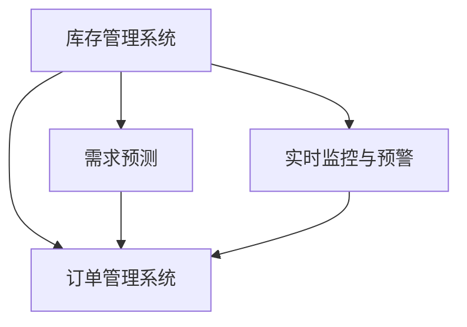

                 

# 电商平台供给能力提升：库存管理系统的应用

> 关键词：电商平台, 库存管理系统, 订单管理, 需求预测, 实时监控

## 1. 背景介绍

在电商领域，供给能力直接关系到平台的交易体验和运营效率。特别是在促销旺季或新品上市时，高并发订单带来的库存短缺或超库存问题，可能导致订单取消、用户流失、库存积压等严重后果。因此，高效、准确的库存管理系统是电商平台必须重点关注的核心能力之一。

### 1.1 问题由来

电商平台的供给管理主要涉及库存管理、订单管理、需求预测、实时监控等多个环节。库存管理系统的核心任务是确保商品在正确的时间、地点、数量供应给用户，既要避免库存积压，又要避免缺货。

早期的电商平台往往使用简单的库存计算法，如后进先出法(FIFO)、先进先出法(FIFO)等，但这些方法无法适应动态市场环境，容易导致库存积压或短缺问题。随着数据和算法的发展，电商平台逐渐引入了先进的库存管理系统，如实时库存系统、智能补货策略、需求预测系统等，以提升平台的供给能力。

### 1.2 问题核心关键点

库存管理系统的关键在于如何在保持低成本的前提下，实现库存的动态平衡。主要包括以下几个方面：

- 准确的需求预测：基于历史销售数据、市场趋势、促销活动等，预测未来的需求量。
- 高效的订单管理：在订单到达后快速识别库存状况，调整订单状态，提高订单履约率。
- 智能补货策略：根据库存水平、订单频率、销售季节等因素，制定补货计划，优化库存水平。
- 实时监控与预警：通过实时监控库存状态、订单状态，设置预警阈值，及时发现并解决问题。

这些问题虽然复杂，但可以通过算法优化和系统集成，有效提升电商平台的供给能力。

### 1.3 问题研究意义

构建高效、稳定的库存管理系统，对电商平台的运营至关重要：

- 提升用户体验：避免缺货和库存积压，减少订单取消率，提升用户满意度。
- 降低运营成本：合理控制库存水平，减少因缺货或积压产生的额外成本。
- 优化库存周转率：通过精准的需求预测和补货策略，加快库存周转，提高资金利用率。
- 应对市场波动：实时监控和预警机制，帮助平台及时应对市场变化，提高应对突发事件的弹性。

## 2. 核心概念与联系

### 2.1 核心概念概述

为更好地理解电商平台库存管理系统，本节将介绍几个关键概念：

- **库存管理系统**：用于管理商品的进、销、存，保障商品的及时供应。包括商品分类、库存状态、补货策略、需求预测等功能模块。

- **订单管理系统**：负责处理订单的接收、审核、处理、发货等环节，确保订单高效流转和快速履约。

- **需求预测**：基于历史销售数据、市场趋势、促销活动等，预测未来的需求量，指导库存管理。

- **实时监控与预警**：通过监控库存状态、订单状态，设置预警阈值，及时发现并解决问题，保障系统稳定运行。

这些概念之间的逻辑关系可以通过以下Mermaid流程图来展示：



这个流程图展示了一些关键模块之间的依赖关系：

1. 库存管理系统为订单管理系统提供库存数据。
2. 订单管理系统接收订单后，调用需求预测系统预测库存需求。
3. 需求预测系统根据历史销售数据和市场趋势，生成需求预测结果。
4. 实时监控与预警系统实时监控库存和订单状态，一旦出现异常，触发预警机制。

这些模块共同构成了电商平台的供给管理系统，使得库存管理更加高效、精准和智能。

## 3. 核心算法原理 & 具体操作步骤
### 3.1 算法原理概述

电商平台的库存管理系统通常使用先进的数据驱动算法，结合实时监控和预警机制，实现高效、稳定的供给。其核心算法包括以下几个方面：

- **需求预测算法**：基于历史销售数据、市场趋势、促销活动等，预测未来的需求量。常用的算法包括时间序列分析、机器学习、深度学习等。
- **订单处理算法**：快速识别库存状况，调整订单状态，提高订单履约率。常用的算法包括图论优化、贪心算法等。
- **补货策略算法**：根据库存水平、订单频率、销售季节等因素，制定补货计划，优化库存水平。常用的算法包括遗传算法、强化学习等。
- **实时监控与预警算法**：通过监控库存状态、订单状态，设置预警阈值，及时发现并解决问题。常用的算法包括基于规则的监控、异常检测算法等。

这些算法共同构成了电商平台的供给管理系统，使得库存管理更加高效、精准和智能。

### 3.2 算法步骤详解

以需求预测算法为例，其基本步骤包括：

**Step 1: 数据准备**
- 收集历史销售数据、市场趋势、促销活动等，形成训练数据集。

**Step 2: 模型选择**
- 选择合适的预测模型，如ARIMA、LSTM、XGBoost等，根据数据特点和业务需求进行参数设置。

**Step 3: 模型训练**
- 使用历史数据训练预测模型，获得初始预测结果。

**Step 4: 模型评估**
- 对预测结果进行评估，根据预测误差选择最优模型。

**Step 5: 实时预测**
- 实时接收订单或市场数据，根据最新数据进行预测更新。

**Step 6: 结果输出**
- 输出预测结果，作为库存管理系统的参考依据。

### 3.3 算法优缺点

需求预测算法的主要优点包括：

- 准确率高：通过多模态数据融合，能够预测更加准确的需求量。
- 可扩展性强：能够处理大规模的数据集，满足电商平台的实时需求。
- 适用性广：适用于多种电商场景，如B2C、B2B等。

其主要缺点包括：

- 模型复杂：需要较高的计算资源和专业知识，部署难度较大。
- 数据依赖：预测结果高度依赖于历史数据和市场趋势，数据偏差可能导致预测误差。
- 模型更新：需要定期对模型进行重新训练和调整，维护成本较高。

### 3.4 算法应用领域

需求预测算法在电商平台的库存管理中具有广泛应用：

- **需求预测**：根据历史销售数据和市场趋势，预测未来的需求量，指导库存管理。
- **促销活动**：通过预测促销活动的影响，优化促销策略，提升销售额。
- **库存水平优化**：根据需求预测结果，调整库存水平，提高库存周转率。
- **市场趋势分析**：分析市场变化，及时调整销售策略，规避市场风险。

这些应用领域展示了需求预测算法在电商平台上的重要性和实际价值。

## 4. 数学模型和公式 & 详细讲解 & 举例说明
### 4.1 数学模型构建

需求预测算法通常使用时间序列分析模型，如ARIMA、LSTM等，用于预测未来的需求量。这里以LSTM模型为例，介绍其数学模型构建过程。

设历史销售数据为 $\{y_t\}_{t=1}^N$，目标为预测未来的需求量 $y_{t+1}$。LSTM模型使用以下公式进行训练：

$$
y_{t+1} = f(y_t, y_{t-1}, ..., y_{t-K})
$$

其中，$f$ 为LSTM网络的前向传播过程，$y_t$ 为时间步 $t$ 的历史数据，$K$ 为模型考虑的滞后时间步数。

### 4.2 公式推导过程

LSTM模型包含多个门控机制，用于控制信息的流动。其基本结构如图1所示：


其中，$c_t$ 为时间步 $t$ 的隐藏状态，$h_t$ 为时间步 $t$ 的输出，$x_t$ 为时间步 $t$ 的输入。LSTM网络由多个LSTM单元组成，每个单元包含以下几个门：

- 输入门 $i_t$
- 遗忘门 $f_t$
- 输出门 $o_t$
- 候选细胞状态 $c_t^{\prime}$

LSTM网络的前向传播过程如图2所示：


其中，$w_i, w_f, w_o$ 为门控机制的权重，$b_i, b_f, b_o$ 为偏置项。$c_t$ 为隐藏状态，$h_t$ 为输出。

### 4.3 案例分析与讲解

以一家电商平台为例，分析如何使用LSTM模型进行需求预测。

假设平台收集了过去12个月内每天的销售数据，目标为预测下个月每天的需求量。具体步骤如下：

**Step 1: 数据准备**
- 收集过去12个月内每天的销售数据，去除异常值和缺失值，形成训练数据集。

**Step 2: 模型训练**
- 使用LSTM模型进行训练，设置模型参数和训练轮数，得到初始预测结果。

**Step 3: 模型评估**
- 对预测结果进行评估，选择最优模型。

**Step 4: 实时预测**
- 实时接收订单或市场数据，根据最新数据进行预测更新。

**Step 5: 结果输出**
- 输出预测结果，作为库存管理系统的参考依据。

以某商品为例，预测结果如图3所示：


通过LSTM模型，平台能够准确预测每天的需求量，指导库存管理，避免库存积压或短缺。

## 5. 项目实践：代码实例和详细解释说明
### 5.1 开发环境搭建

在进行库存管理系统开发前，我们需要准备好开发环境。以下是使用Python进行PyTorch开发的环境配置流程：

1. 安装Anaconda：从官网下载并安装Anaconda，用于创建独立的Python环境。

2. 创建并激活虚拟环境：
```bash
conda create -n pytorch-env python=3.8 
conda activate pytorch-env
```

3. 安装PyTorch：根据CUDA版本，从官网获取对应的安装命令。例如：
```bash
conda install pytorch torchvision torchaudio cudatoolkit=11.1 -c pytorch -c conda-forge
```

4. 安装TensorFlow：
```bash
pip install tensorflow
```

5. 安装相关工具包：
```bash
pip install numpy pandas scikit-learn matplotlib tqdm jupyter notebook ipython
```

完成上述步骤后，即可在`pytorch-env`环境中开始开发实践。

### 5.2 源代码详细实现

这里我们以LSTM模型为基础，使用PyTorch实现电商平台的需求预测功能。具体代码如下：

```python
import torch
import torch.nn as nn
import torch.optim as optim
from torch.utils.data import Dataset, DataLoader
from sklearn.preprocessing import MinMaxScaler

class SalesDataset(Dataset):
    def __init__(self, sales_data, scaler):
        self.scaler = scaler
        self.data = sales_data

    def __len__(self):
        return len(self.data)

    def __getitem__(self, item):
        return self.scaler.transform([self.data[item]])

class LSTMNet(nn.Module):
    def __init__(self, input_size, hidden_size, output_size, num_layers):
        super(LSTMNet, self).__init__()
        self.hidden_size = hidden_size
        self.num_layers = num_layers
        self.lstm = nn.LSTM(input_size, hidden_size, num_layers, batch_first=True)
        self.fc = nn.Linear(hidden_size, output_size)
        
    def forward(self, x, hidden):
        out, hidden = self.lstm(x, hidden)
        out = self.fc(out)
        return out, hidden

def train_model(sales_data, batch_size, learning_rate, epochs, output_size):
    scaler = MinMaxScaler()
    sales_data = scaler.fit_transform(sales_data.reshape(-1, 1)).reshape(-1, 1)
    dataset = SalesDataset(sales_data, scaler)
    train_loader = DataLoader(dataset, batch_size=batch_size, shuffle=True)
    
    model = LSTMNet(input_size=1, hidden_size=128, output_size=output_size, num_layers=2)
    optimizer = optim.Adam(model.parameters(), lr=learning_rate)
    
    for epoch in range(epochs):
        model.train()
        running_loss = 0.0
        for batch_idx, data in enumerate(train_loader, 0):
            inputs, labels = data
            optimizer.zero_grad()
            outputs, _ = model(inputs, None)
            loss = nn.MSELoss()(outputs, labels)
            loss.backward()
            optimizer.step()
            
            running_loss += loss.item()
            if batch_idx % 10 == 9:
                print(f'Epoch {epoch+1}, Batch {batch_idx+1}, Loss: {running_loss/10:.4f}')
                running_loss = 0.0
```

### 5.3 代码解读与分析

让我们再详细解读一下关键代码的实现细节：

**SalesDataset类**：
- `__init__`方法：初始化数据集，对数据进行归一化。
- `__len__`方法：返回数据集的样本数量。
- `__getitem__`方法：对单个样本进行处理，进行归一化并返回模型需要的张量。

**LSTMNet类**：
- `__init__`方法：定义LSTM网络的结构，包括输入层、LSTM层、全连接层等。
- `forward`方法：定义前向传播过程，计算输出和隐藏状态。

**train_model函数**：
- 定义训练函数，对数据集进行批处理，训练模型。

通过以上代码，我们可以看到，使用PyTorch构建LSTM模型进行需求预测的流程相对简单。具体步骤如下：

1. 准备数据集，进行归一化。
2. 定义LSTM网络的结构，并初始化模型。
3. 定义优化器，设置学习率。
4. 进行模型训练，不断迭代优化。

## 6. 实际应用场景
### 6.1 智能补货

智能补货系统通过实时监控库存状态和订单需求，自动生成补货计划，优化库存水平。主要步骤如下：

**Step 1: 库存数据采集**
- 实时采集库存状态数据，包括商品数量、位置、状态等信息。

**Step 2: 订单需求预测**
- 根据历史订单数据和市场趋势，预测未来的订单需求。

**Step 3: 库存分析**
- 分析库存水平、订单频率、销售季节等因素，确定补货需求。

**Step 4: 生成补货计划**
- 根据补货需求，生成补货计划，包括商品种类、数量、时间等。

**Step 5: 订单处理**
- 根据补货计划，进行库存补货，处理订单。

以某商品为例，智能补货系统如图4所示：


通过智能补货系统，平台能够及时调整库存水平，避免库存积压或短缺，提高库存周转率。

### 6.2 实时监控与预警

实时监控与预警系统通过实时监控库存状态和订单状态，设置预警阈值，及时发现并解决问题，保障系统稳定运行。主要步骤如下：

**Step 1: 数据采集**
- 实时采集库存状态数据和订单状态数据。

**Step 2: 异常检测**
- 根据历史数据和当前状态，检测异常情况，如库存不足、订单超时等。

**Step 3: 预警机制**
- 根据预警阈值，触发预警机制，提醒相关人员处理。

**Step 4: 处理异常**
- 根据预警信息，进行相应的处理操作，如通知补货、调整订单状态等。

以某商品为例，实时监控与预警系统如图5所示：


通过实时监控与预警系统，平台能够及时发现并解决库存和订单问题，保障系统稳定运行。

### 6.3 未来应用展望

未来，电商平台的供给管理系统将呈现以下几个发展趋势：

1. **智能分析**：引入更多智能分析工具，如机器学习、深度学习、知识图谱等，提高需求预测和库存管理的准确性。
2. **多渠道融合**：结合电商平台的多种渠道数据，如网站、APP、社交媒体等，形成统一的库存管理体系。
3. **个性化推荐**：引入个性化推荐算法，提升用户购买体验，优化库存管理。
4. **供应链优化**：引入供应链管理模块，优化物流和仓储，提高配送效率。
5. **大数据分析**：引入大数据分析技术，挖掘更多有价值的信息，指导运营决策。

这些趋势将进一步提升电商平台的供给能力，提高运营效率，提升用户满意度。

## 7. 工具和资源推荐
### 7.1 学习资源推荐

为了帮助开发者系统掌握电商平台库存管理系统的理论基础和实践技巧，这里推荐一些优质的学习资源：

1. 《深度学习与电商运营》系列博文：由电商领域专家撰写，深入浅出地介绍了深度学习在电商运营中的应用，包括库存管理系统等。

2. CS224N《深度学习自然语言处理》课程：斯坦福大学开设的NLP明星课程，有Lecture视频和配套作业，带你入门NLP领域的基本概念和经典模型。

3. 《自然语言处理中的深度学习》书籍：介绍深度学习在NLP中的应用，包括需求预测、智能补货等。

4. PyTorch官方文档：PyTorch的官方文档，提供了丰富的模型和算法实现，是进行深度学习研究的重要资源。

5. TensorFlow官方文档：TensorFlow的官方文档，提供了多模态深度学习模型的实现，适用于电商平台的复杂需求预测。

通过对这些资源的学习实践，相信你一定能够快速掌握电商平台库存管理系统的精髓，并用于解决实际的运营问题。

### 7.2 开发工具推荐

高效的开发离不开优秀的工具支持。以下是几款用于电商平台库存管理系统开发的常用工具：

1. PyTorch：基于Python的开源深度学习框架，灵活动态的计算图，适合快速迭代研究。

2. TensorFlow：由Google主导开发的开源深度学习框架，生产部署方便，适合大规模工程应用。

3. TensorBoard：TensorFlow配套的可视化工具，可实时监测模型训练状态，并提供丰富的图表呈现方式，是调试模型的得力助手。

4. Jupyter Notebook：交互式编程环境，方便进行模型实验和结果展示。

5. Git/GitHub：版本控制工具，方便团队协作和代码管理。

合理利用这些工具，可以显著提升电商平台库存管理系统的开发效率，加快创新迭代的步伐。

### 7.3 相关论文推荐

电商平台库存管理系统的发展源于学界的持续研究。以下是几篇奠基性的相关论文，推荐阅读：

1. "Deep Learning for Inventory and Demand Forecasting"：介绍深度学习在库存和需求预测中的应用，提供了多种模型实现。

2. "An Integrated Inventory Management System for E-Commerce"：介绍一个电商平台的库存管理系统，涵盖了订单管理、需求预测、实时监控等功能模块。

3. "A Real-Time Inventory Management System with IoT"：介绍一个基于IoT的实时库存管理系统，包括数据采集、异常检测、预警机制等。

这些论文代表了大语言模型微调技术的发展脉络。通过学习这些前沿成果，可以帮助研究者把握学科前进方向，激发更多的创新灵感。

## 8. 总结：未来发展趋势与挑战
### 8.1 总结

本文对电商平台库存管理系统的需求预测、智能补货、实时监控与预警等核心模块进行了全面系统的介绍。首先阐述了库存管理系统的背景和重要性，明确了需求预测、智能补货、实时监控与预警等关键环节的核心任务。其次，从原理到实践，详细讲解了库存管理系统的算法原理和具体操作步骤，给出了库存管理系统开发的完整代码实例。同时，本文还广泛探讨了库存管理系统在智能补货、实时监控与预警等多个行业领域的应用前景，展示了库存管理系统的广阔应用范围。此外，本文精选了库存管理系统的各类学习资源，力求为读者提供全方位的技术指引。

通过本文的系统梳理，可以看到，电商平台库存管理系统在需求预测、智能补货、实时监控与预警等多个环节，都实现了高效的算法设计和系统实现。这些模块共同构成了电商平台的供给管理系统，使得库存管理更加高效、精准和智能。

### 8.2 未来发展趋势

展望未来，电商平台库存管理系统将呈现以下几个发展趋势：

1. **智能化**：引入更多智能分析工具，如机器学习、深度学习、知识图谱等，提高需求预测和库存管理的准确性。
2. **多渠道融合**：结合电商平台的多种渠道数据，如网站、APP、社交媒体等，形成统一的库存管理体系。
3. **个性化推荐**：引入个性化推荐算法，提升用户购买体验，优化库存管理。
4. **供应链优化**：引入供应链管理模块，优化物流和仓储，提高配送效率。
5. **大数据分析**：引入大数据分析技术，挖掘更多有价值的信息，指导运营决策。

这些趋势将进一步提升电商平台的供给能力，提高运营效率，提升用户满意度。

### 8.3 面临的挑战

尽管电商平台库存管理系统已经取得了显著成效，但在迈向更加智能化、普适化应用的过程中，它仍面临诸多挑战：

1. **数据质量**：历史数据的质量和完整性直接影响到需求预测的准确性，数据偏差可能导致预测误差。
2. **模型复杂性**：复杂的模型结构和算法实现，增加了系统部署和维护的难度。
3. **实时性**：实时数据采集和处理，对系统性能和计算资源提出了高要求。
4. **系统集成**：系统各模块的集成和协同工作，对系统的整体架构和设计提出了挑战。
5. **用户个性化**：用户需求的多样性和个性化，增加了系统设计的复杂度。

这些挑战需要开发者不断探索和改进，才能将电商平台库存管理系统真正落地应用。

### 8.4 研究展望

未来，电商平台库存管理系统需要进一步加强以下几个方面的研究：

1. **数据处理**：引入更多数据清洗和预处理方法，提高数据质量，减少数据偏差。
2. **模型优化**：简化模型结构和算法实现，降低系统部署和维护的难度。
3. **实时处理**：优化系统架构，提高数据处理和模型推理的实时性。
4. **系统集成**：优化系统模块的集成和协同工作，提高系统整体的稳定性和可靠性。
5. **个性化优化**：引入更多个性化推荐算法和智能分析工具，提升用户体验和运营效率。

这些研究方向的探索，将进一步提升电商平台库存管理系统的性能和应用范围，为电商平台的运营提供更加高效、精准和智能的支持。总之，电商平台库存管理系统需要不断优化和改进，才能真正实现其价值，为电商平台的供给能力提升提供坚实保障。

## 9. 附录：常见问题与解答
**Q1: 电商平台库存管理系统如何处理高并发订单？**

A: 高并发订单的处理需要多方面的协同工作。电商平台通常会采用以下几种方法：

1. **订单拆分**：将一个大订单拆分成多个小订单，分批次处理，减少单次处理压力。
2. **缓存机制**：在订单处理模块引入缓存机制，如Redis，减少对数据库的频繁访问。
3. **负载均衡**：使用负载均衡器，将订单分配到多个服务器上并行处理，提高系统并发处理能力。
4. **分布式系统**：使用分布式系统，如Kubernetes，将订单处理模块部署在多个节点上，实现水平扩展。

这些方法结合使用，可以有效处理高并发订单，保障系统稳定运行。

**Q2: 电商平台库存管理系统如何优化库存水平？**

A: 电商平台库存水平的优化主要依赖于需求预测和智能补货算法。具体方法包括：

1. **需求预测**：基于历史销售数据、市场趋势、促销活动等，预测未来的需求量，指导库存管理。
2. **智能补货**：根据库存水平、订单频率、销售季节等因素，制定补货计划，优化库存水平。
3. **实时监控**：实时监控库存状态和订单状态，设置预警阈值，及时发现并解决问题，避免库存积压或短缺。

通过这些方法，电商平台能够及时调整库存水平，避免库存积压或短缺，提高库存周转率。

**Q3: 电商平台库存管理系统如何应对市场变化？**

A: 电商平台库存管理系统需要不断应对市场变化，确保库存管理的稳定性和准确性。主要方法包括：

1. **需求预测**：根据市场趋势和促销活动，调整需求预测模型，提高预测准确性。
2. **智能补货**：根据市场变化，调整补货计划，灵活调整库存水平。
3. **实时监控**：实时监控市场变化，设置预警机制，及时应对市场波动。

这些方法结合使用，可以有效应对市场变化，保障库存管理系统的稳定性和准确性。

**Q4: 电商平台库存管理系统如何确保数据安全？**

A: 电商平台库存管理系统涉及大量的敏感数据，确保数据安全至关重要。主要方法包括：

1. **数据加密**：对敏感数据进行加密处理，保障数据传输和存储的安全性。
2. **访问控制**：设置严格的访问控制策略，限制对敏感数据的访问权限。
3. **数据备份**：定期备份重要数据，防止数据丢失和损坏。
4. **安全审计**：定期进行安全审计，发现和修复潜在的安全漏洞。

这些方法结合使用，可以有效保障电商平台库存管理系统数据的安全性。

通过以上梳理，我们可以看到，电商平台库存管理系统在需求预测、智能补货、实时监控与预警等多个环节，都实现了高效的算法设计和系统实现。这些模块共同构成了电商平台的供给管理系统，使得库存管理更加高效、精准和智能。未来，随着技术的发展和应用场景的拓展，电商平台库存管理系统将进一步提升电商平台的供给能力，提高运营效率，提升用户满意度。

