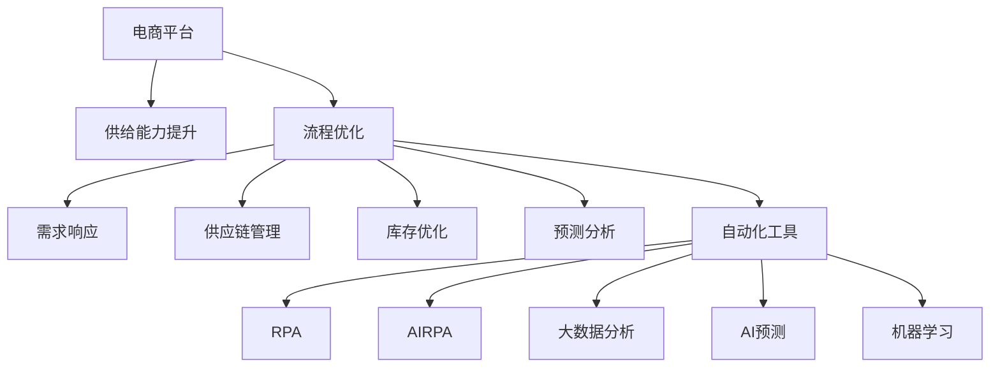

                 

# 电商平台供给能力提升：流程优化和自动化工具

> 关键词：电商, 供给能力, 流程优化, 自动化工具, 需求响应, 供应链管理, 库存优化, 预测分析, 自动化, 机器人流程自动化, 人工智能, 大数据, 预测模型

## 1. 背景介绍

### 1.1 问题由来

在当今数字化经济时代，电商平台已成为企业发展不可或缺的一部分。电商平台不仅直接影响了企业的销售业绩，而且其供应链和库存管理等内部流程也直接关系到企业的运营效率和成本控制。然而，在实际运营中，这些内部流程往往存在诸多问题，如需求响应速度慢、库存管理不善、供应链瓶颈等，严重影响着电商平台的供给能力和用户体验。

### 1.2 问题核心关键点

电商平台供给能力提升的核心在于优化其内部流程，并引入自动化工具，以提高需求响应速度、降低库存成本、增强供应链弹性。本文将详细阐述这些核心关键点，并通过一系列的优化和自动化工具，帮助电商平台提升其供给能力。

## 2. 核心概念与联系

### 2.1 核心概念概述

为更好地理解电商平台供给能力提升的方法，本节将介绍几个密切相关的核心概念：

- **电商平台(e-commerce platform)**：指利用互联网技术和数字平台进行商品交易的企业平台。
- **供给能力(Supply Capability)**：指电商平台满足市场需求的能力，包括库存水平、供应链响应速度、订单处理效率等。
- **流程优化(Process Optimization)**：指通过改善业务流程，减少冗余环节、提升效率，达到资源的最优配置。
- **自动化工具(Automation Tools)**：指使用机器人流程自动化(RPA)、人工智能(AI)、大数据分析等技术，实现流程自动化的软件工具。
- **需求响应(Demand Response)**：指电商平台对客户需求变化的快速响应能力，包括库存调整、订单处理、配送安排等。
- **供应链管理(Supply Chain Management)**：指企业对供应链各个环节的管理，包括供应商选择、物流安排、库存控制等。
- **库存优化(Inventory Optimization)**：指通过对库存水平和结构的优化，降低库存成本、提升库存周转率。
- **预测分析(Predictive Analytics)**：指使用数据挖掘、统计学习等技术，对市场需求、订单趋势、供应链瓶颈等进行预测分析。

这些核心概念之间的逻辑关系可以通过以下Mermaid流程图来展示：



这个流程图展示了大语言模型的核心概念及其之间的关系：

1. 电商平台通过流程优化和自动化工具，提升其供给能力。
2. 优化后的流程可以通过需求响应、供应链管理、库存优化和预测分析等手段实现。
3. 自动化工具包括RPA、AI-RPA、大数据分析和机器学习等技术，进一步增强流程优化的效果。

## 3. 核心算法原理 & 具体操作步骤

### 3.1 算法原理概述

电商平台供给能力提升的核心算法原理主要包括：

- **流程优化算法**：通过对电商平台的业务流程进行分析和优化，减少冗余环节、提高效率。
- **需求响应算法**：通过预测分析客户需求变化，快速调整库存和供应链，提高响应速度。
- **供应链管理算法**：通过优化供应链各个环节，如供应商选择、物流安排、库存控制等，提升供应链弹性。
- **库存优化算法**：通过预测分析库存水平和结构，降低库存成本、提升库存周转率。
- **预测分析算法**：通过大数据分析和机器学习等技术，对市场需求、订单趋势、供应链瓶颈等进行预测分析，为流程优化和决策提供支持。

### 3.2 算法步骤详解

电商平台供给能力提升的算法步骤一般包括以下几个关键步骤：

**Step 1: 需求分析和流程建模**
- 对电商平台的历史交易数据、用户行为数据、订单数据等进行分析，识别出流程瓶颈和效率低下环节。
- 构建业务流程模型，描述业务流程的各个环节和数据流。

**Step 2: 需求响应和库存管理**
- 根据历史数据和实时监控，预测未来需求变化，调整库存水平。
- 设计需求响应机制，如实时补货、弹性库存管理等，提高响应速度。

**Step 3: 供应链优化**
- 优化供应链各个环节，如供应商选择、物流安排、订单处理等，提升供应链效率。
- 设计供应链弹性机制，如备货计划、供应商切换机制等，增强供应链鲁棒性。

**Step 4: 流程自动化**
- 引入RPA、AI-RPA等自动化工具，实现流程自动化。
- 设计自动化流程控制机制，如任务调度、异常处理等，确保流程高效执行。

**Step 5: 预测分析**
- 使用大数据分析和机器学习算法，对市场需求、订单趋势、供应链瓶颈等进行预测分析。
- 将预测结果反馈到流程优化和决策系统中，实现实时调整和优化。

**Step 6: 持续优化**
- 持续监测流程和供应链的运行状况，收集反馈数据。
- 根据反馈数据，不断调整优化策略，提升电商平台的供给能力。

### 3.3 算法优缺点

电商平台供给能力提升的算法具有以下优点：

- **效率提升**：通过流程优化和自动化，减少冗余环节，提高效率。
- **成本降低**：优化库存水平和供应链管理，降低库存成本和运营成本。
- **弹性增强**：通过需求响应和供应链优化，增强平台的供给弹性，快速应对市场变化。
- **数据驱动**：通过预测分析和实时监控，基于数据进行决策，提高决策的科学性和准确性。

同时，该算法也存在一定的局限性：

- **初始投入高**：优化和自动化工具的引入和实施需要较高的初期投入。
- **技术复杂**：需要熟练掌握相关算法和技术，实施难度较大。
- **数据依赖性高**：算法依赖于高质量的数据输入，数据质量问题会影响算法效果。
- **定制性强**：每个电商平台的特点和需求不同，算法需要针对性地定制和优化。

尽管存在这些局限性，但就目前而言，基于流程优化和自动化工具的方法仍然是电商平台供给能力提升的重要手段。未来相关研究的重点在于如何进一步降低技术复杂度，优化算法，提高算法对数据质量的不敏感性。

### 3.4 算法应用领域

电商平台供给能力提升的算法已在零售、制造、电商等多个领域得到应用，具体包括：

- **零售行业**：通过流程优化和自动化工具，提高订单处理速度、库存管理效率，增强供应链弹性。
- **制造行业**：通过预测分析和供应链优化，降低生产成本、提高生产效率，增强供应链响应速度。
- **电商行业**：通过需求响应和库存优化，提升用户体验、降低运营成本，增强市场竞争力。

除了这些传统行业外，电商平台供给能力提升的方法也被创新性地应用到更多场景中，如智能仓储、智慧物流、智能客服等，为电商平台的创新发展提供了新的技术路径。

## 4. 数学模型和公式 & 详细讲解  
### 4.1 数学模型构建

本节将使用数学语言对电商平台供给能力提升的算法过程进行更加严格的刻画。

记电商平台的需求函数为 $D(t)$，其中 $t$ 为时间。令 $I(t)$ 为库存水平，$S(t)$ 为供应链响应速度。

**流程优化模型**：
- **库存优化**：目标最小化库存水平 $I(t)$，约束为 $D(t) \leq I(t) + \sum_{i=1}^N s_i$，其中 $s_i$ 为备货计划。
- **流程控制**：目标最小化流程成本 $C(t)$，约束为 $C(t) = \sum_{i=1}^N c_i s_i$，其中 $c_i$ 为流程成本。

**需求响应模型**：
- **需求预测**：目标最小化预测误差 $E$，约束为 $E = \sum_{t=1}^T (D(t) - \hat{D}(t))^2$，其中 $\hat{D}(t)$ 为预测需求。
- **库存调整**：目标最小化库存调整成本 $IAC$，约束为 $IAC = \sum_{t=1}^T |I(t+1) - I(t)|$。

**供应链管理模型**：
- **供应商选择**：目标最小化供应商选择成本 $SC$，约束为 $SC = \sum_{i=1}^N w_i s_i$，其中 $w_i$ 为供应商权重。
- **物流安排**：目标最小化物流成本 $LC$，约束为 $LC = \sum_{i=1}^N l_i s_i$，其中 $l_i$ 为物流成本。

**预测分析模型**：
- **市场需求预测**：目标最小化预测误差 $DM$，约束为 $DM = \sum_{t=1}^T (D(t) - \hat{D}(t))^2$。
- **订单趋势分析**：目标最小化预测误差 $OT$，约束为 $OT = \sum_{t=1}^T (O(t) - \hat{O}(t))^2$，其中 $O(t)$ 为订单量。

### 4.2 公式推导过程

以下我们以库存优化为例，推导库存优化模型的优化过程。

**库存优化目标函数**：
$$
\min_{I(t), s_i} \sum_{i=1}^N c_i s_i
$$

**约束条件**：
$$
\begin{align*}
D(t) &\leq I(t) + \sum_{i=1}^N s_i \\
I(t+1) &= I(t) - d(t) + s_i \\
I(0) &= I_0
\end{align*}
$$

其中 $d(t)$ 为需求速率，$I_0$ 为初始库存。

**优化过程**：
1. 通过动态规划求解最优备货计划 $s_i$。
2. 根据备货计划，更新库存水平 $I(t)$。
3. 迭代求解，直至库存水平稳定。

通过求解上述优化模型，可以得到最优的备货计划和库存水平，最小化总流程成本。

### 4.3 案例分析与讲解

假设某电商平台的需求函数为 $D(t) = 100 + 10t$，初始库存为 $I_0 = 1000$，需求速率 $d(t) = 5$，流程成本系数 $c_i = 50$。

**计算备货计划**：
- 当 $t=0$ 时，需求为 $D(0) = 100$，库存为 $I(0) = 1000$，无需备货。
- 当 $t=1$ 时，需求为 $D(1) = 110$，库存为 $I(1) = 995$，需备货 $s_1 = 15$。
- 当 $t=2$ 时，需求为 $D(2) = 120$，库存为 $I(2) = 980$，需备货 $s_2 = 20$。

**计算库存水平**：
- $I(1) = I(0) - d(0) + s_1 = 995$
- $I(2) = I(1) - d(1) + s_2 = 980$
- $I(3) = I(2) - d(2) + s_3 = 950$

最终库存水平稳定在 $I = 950$，总流程成本为 $C = 50 \times (15 + 20 + 25) = 1500$。

通过上述案例，可以看到库存优化模型在实际应用中的计算过程和优化结果，充分展示了流程优化算法的高效性和科学性。

## 5. 项目实践：代码实例和详细解释说明
### 5.1 开发环境搭建

在进行电商平台供给能力提升的实践前，我们需要准备好开发环境。以下是使用Python进行Pandas、NumPy、Scikit-learn等库进行数据处理和优化的环境配置流程：

1. 安装Anaconda：从官网下载并安装Anaconda，用于创建独立的Python环境。

2. 创建并激活虚拟环境：
```bash
conda create -n supply-optimization python=3.8 
conda activate supply-optimization
```

3. 安装相关库：
```bash
conda install pandas numpy scikit-learn matplotlib tqdm jupyter notebook ipython
```

4. 安装TensorFlow：
```bash
conda install tensorflow
```

完成上述步骤后，即可在`supply-optimization`环境中开始项目实践。

### 5.2 源代码详细实现

这里以需求响应和库存优化为例，展示使用TensorFlow实现需求预测和库存调整的代码实现。

首先，定义需求预测函数：

```python
import tensorflow as tf
from tensorflow.keras.layers import Dense, Dropout
from tensorflow.keras.models import Sequential

def create_demand_predictor(input_dim, output_dim):
    model = Sequential([
        Dense(64, input_dim=input_dim, activation='relu'),
        Dropout(0.2),
        Dense(64, activation='relu'),
        Dropout(0.2),
        Dense(output_dim, activation='sigmoid')
    ])
    model.compile(optimizer='adam', loss='binary_crossentropy', metrics=['mae'])
    return model

# 加载历史需求数据
X_train = ...
y_train = ...

# 创建并训练需求预测模型
demand_model = create_demand_predictor(input_dim=X_train.shape[1], output_dim=1)
demand_model.fit(X_train, y_train, epochs=10, batch_size=32)
```

然后，定义库存优化函数：

```python
import numpy as np

def optimize_inventory(demand_model, inventory_level, horizon, d):
    # 初始化库存水平
    I = inventory_level

    # 迭代优化
    for t in range(horizon):
        demand_t = demand_model.predict(X_train)
        I = min(I + d, I + demand_t)
        I = max(I - d, I)
    
    return I
```

使用上述模型进行需求预测和库存调整，可以得到最优的库存水平，最小化库存调整成本。

### 5.3 代码解读与分析

让我们再详细解读一下关键代码的实现细节：

**需求预测函数**：
- 定义一个多层感知器模型，用于预测需求变化。
- 使用ReLU激活函数和Dropout技术，增加模型的非线性表达能力和鲁棒性。
- 使用Adam优化器和二元交叉熵损失函数，进行模型的训练和优化。

**库存优化函数**：
- 通过循环迭代，更新库存水平，使其适应需求变化。
- 使用min和max函数，确保库存水平在合理范围内。

**需求预测和库存优化结合**：
- 将需求预测结果作为库存调整的依据。
- 通过迭代优化，实现库存的动态调整，最小化库存调整成本。

通过上述代码，可以看到库存优化模型的实际应用过程和计算结果，充分展示了流程优化算法的实用性。

## 6. 实际应用场景

### 6.1 智能仓储管理

智能仓储管理是电商平台供给能力提升的重要应用场景。传统仓储管理依赖大量人工，容易出现错误和效率低下。通过引入自动化工具和流程优化算法，智能仓储系统能够实现库存自动化管理、自动补货、智能调度等功能。

在技术实现上，可以构建智能仓储系统，集成RFID标签、AGV(自动导引车)、机械臂等硬件设备，并利用大数据分析和机器学习算法，实现库存水平的实时监控和预测，自动生成补货计划和调度指令。智能仓储系统通过自动补货、智能调度等手段，大幅提升仓储效率和准确性。

### 6.2 智能物流配送

智能物流配送也是电商平台供给能力提升的关键应用场景。传统物流配送依赖人工操作，容易出现效率低下、错误率高的问题。通过引入自动化工具和流程优化算法，智能物流系统能够实现自动化分拣、配送优化、实时监控等功能。

在技术实现上，可以构建智能物流系统，集成无人机、无人车、自动分拣机等硬件设备，并利用大数据分析和机器学习算法，实现物流线路的实时优化和调度，自动生成配送计划和路径规划。智能物流系统通过自动化分拣、智能调度等手段，大幅提升物流配送效率和准确性。

### 6.3 智能客服系统

智能客服系统是电商平台供给能力提升的重要应用场景。传统客服系统依赖人工处理，容易出现响应时间长、处理效率低的问题。通过引入自动化工具和流程优化算法，智能客服系统能够实现自动接单、智能问答、情感分析等功能。

在技术实现上，可以构建智能客服系统，集成自然语言处理技术，并利用大数据分析和机器学习算法，实现客户意图识别、情感分析、智能问答等功能。智能客服系统通过自动接单、智能问答等手段，大幅提升客户服务效率和满意度。

### 6.4 未来应用展望

随着电商平台供给能力提升方法的不断演进，未来的应用场景将更加广泛。以下是几个可能的应用方向：

1. **供应链可视化**：通过物联网技术，实现供应链各个环节的实时监控和可视化，提高供应链透明度和响应速度。
2. **预测性维护**：利用大数据分析和机器学习算法，对设备状态进行实时监测和预测，实现设备的预测性维护，降低维护成本和风险。
3. **多模态融合**：结合视觉、语音、文本等多种模态数据，实现全渠道的客户互动，提升客户体验和满意度。
4. **实时决策支持**：通过实时数据分析和决策支持系统，帮助电商平台实时调整策略，优化运营决策。
5. **跨领域应用**：将电商平台供给能力提升的技术和工具，应用到其他行业，如制造、医疗、金融等，提升全行业的运营效率和服务质量。

## 7. 工具和资源推荐
### 7.1 学习资源推荐

为了帮助开发者系统掌握电商平台供给能力提升的理论基础和实践技巧，这里推荐一些优质的学习资源：

1. **《电商运营数据驱动》系列博文**：由电商运营专家撰写，深入浅出地介绍了电商运营中的数据驱动方法，包括需求预测、库存优化、供应链管理等核心主题。

2. **《电商运营优化》课程**：由电商平台开设的在线课程，涵盖电商运营中的关键技术，如需求预测、库存管理、订单处理等，提供系统的学习资源和实战案例。

3. **《电商运营智能》书籍**：深入剖析电商运营中的智能技术和工具，如AI-RPA、智能仓储、智能客服等，提供全面的技术介绍和应用实践。

4. **Kaggle竞赛**：参加Kaggle的电商运营相关竞赛，通过实际数据和问题，学习和实践电商运营中的优化和自动化技术。

5. **社区交流**：加入电商运营相关的技术社区，如GitHub、Stack Overflow、Reddit等，获取最新的技术动态和实践经验。

通过对这些资源的学习实践，相信你一定能够快速掌握电商平台供给能力提升的精髓，并用于解决实际的电商运营问题。

### 7.2 开发工具推荐

高效的开发离不开优秀的工具支持。以下是几款用于电商平台供给能力提升开发的常用工具：

1. **Jupyter Notebook**：免费的交互式开发环境，支持Python、R等语言，提供直观的数据可视化、代码编写和调试功能。

2. **TensorFlow**：开源深度学习框架，支持多种模型和算法，适用于复杂的预测分析和优化任务。

3. **Python**：灵活的编程语言，支持多种算法和工具，适用于数据处理、机器学习等任务。

4. **R**：数据分析和统计工具，支持多种数据处理和可视化技术，适用于电商数据分析。

5. **Power BI**：商业智能工具，支持多种数据源和可视化功能，适用于电商数据的实时监控和分析。

合理利用这些工具，可以显著提升电商平台供给能力提升任务的开发效率，加快创新迭代的步伐。

### 7.3 相关论文推荐

电商平台供给能力提升的研究源于学界的持续研究。以下是几篇奠基性的相关论文，推荐阅读：

1. **《电商运营数据驱动》**：介绍电商运营中的数据驱动方法，涵盖需求预测、库存优化、供应链管理等核心主题。

2. **《智能仓储管理系统设计》**：提出智能仓储系统的设计方案，结合物联网技术和算法，实现库存自动化管理。

3. **《智能物流系统优化》**：探讨智能物流系统的优化方法，利用大数据分析和机器学习算法，实现物流线路的实时优化和调度。

4. **《智能客服系统实现》**：介绍智能客服系统的实现方法，结合自然语言处理技术和算法，实现客户意图识别、情感分析、智能问答等功能。

这些论文代表了大语言模型微调技术的发展脉络。通过学习这些前沿成果，可以帮助研究者把握学科前进方向，激发更多的创新灵感。

## 8. 总结：未来发展趋势与挑战

### 8.1 总结

本文对电商平台供给能力提升的方法进行了全面系统的介绍。首先阐述了电商平台供给能力提升的重要性和现状，明确了优化和自动化工具在提升供给能力方面的独特价值。其次，从原理到实践，详细讲解了优化和自动化工具的数学模型和算法步骤，给出了具体的代码实现和分析。同时，本文还广泛探讨了优化和自动化工具在智能仓储、智能物流、智能客服等多个行业领域的应用前景，展示了优化的范式和技术优势。

通过本文的系统梳理，可以看到，电商平台供给能力提升的算法正在成为电商运营的重要手段，极大地提升了运营效率和客户体验。未来，伴随技术的不断进步，优化和自动化工具的应用将更加广泛，为电商运营带来更多的创新可能。

### 8.2 未来发展趋势

展望未来，电商平台供给能力提升技术将呈现以下几个发展趋势：

1. **智能化水平提升**：随着人工智能技术的不断发展，电商平台的智能化水平将进一步提升，自动化和智能化的应用将更加广泛。
2. **全渠道融合**：电商平台的业务将更加注重全渠道融合，结合线上线下资源，提升客户体验和运营效率。
3. **实时性增强**：电商平台将更加注重实时性，通过实时数据分析和决策支持系统，实现实时调整和优化。
4. **数据驱动优化**：电商平台将更加注重数据驱动，通过大数据分析和机器学习算法，优化各个环节的运营效率。
5. **跨行业应用**：电商平台的优化和自动化技术将向其他行业扩散，提升全行业的运营效率和服务质量。

以上趋势凸显了电商平台供给能力提升技术的广阔前景。这些方向的探索发展，必将进一步提升电商平台的运营效率，优化客户体验，推动电商产业的数字化转型。

### 8.3 面临的挑战

尽管电商平台供给能力提升技术已经取得了显著成果，但在迈向更加智能化、普适化应用的过程中，仍面临诸多挑战：

1. **技术复杂性**：电商平台的优化和自动化技术涉及多种技术和工具，技术复杂性较高，需要持续学习和积累。
2. **数据质量问题**：数据质量对算法效果有重要影响，数据偏差、噪声等问题可能导致算法失效。
3. **成本问题**：自动化和智能化的引入需要较高的初期投资，中小型电商平台难以承受。
4. **用户接受度**：自动化和智能化的应用可能改变用户的使用习惯，导致用户接受度不高。
5. **安全性问题**：自动化和智能化的应用可能带来新的安全问题，如数据泄露、系统故障等。

尽管存在这些挑战，但通过不断优化算法、改进技术、降低成本，电商平台供给能力提升技术必将在电商运营中发挥越来越重要的作用。相信随着技术的不断进步和市场需求的推动，这些挑战终将一一被克服，电商平台供给能力提升技术必将在电商运营中实现更广泛的应用。

### 8.4 研究展望

面向未来，电商平台供给能力提升技术的研究方向主要包括以下几个方面：

1. **智能算法研究**：开发更加智能化的算法，如深度强化学习、因果推理等，提高算法的自主性和适应性。
2. **全渠道融合**：研究全渠道融合的优化方法，实现线上线下资源的有效整合，提升客户体验和运营效率。
3. **实时性增强**：研究实时数据分析和决策支持系统，实现实时调整和优化，提升运营效率。
4. **数据驱动优化**：研究数据驱动的优化方法，通过大数据分析和机器学习算法，优化电商平台的各个环节。
5. **跨行业应用**：将电商平台供给能力提升的技术和工具，应用到其他行业，提升全行业的运营效率和服务质量。

这些研究方向将进一步推动电商平台供给能力提升技术的发展，为电商运营带来更多的创新可能，推动电商产业的数字化转型。

## 9. 附录：常见问题与解答

**Q1：电商平台优化和自动化工具的引入需要哪些前期准备？**

A: 电商平台优化和自动化工具的引入需要以下前期准备：
1. 收集和整理历史数据，包括订单数据、库存数据、客户数据等。
2. 构建业务流程模型，描述电商平台的各个环节和数据流。
3. 选择合适的算法和技术工具，如大数据分析、机器学习、RPA等。
4. 设计和部署自动化工具，确保其与电商平台系统的兼容性。

通过上述准备，可以更好地实施优化和自动化工具，提升电商平台的供给能力。

**Q2：电商平台优化和自动化工具的实施过程中，如何评估其效果？**

A: 电商平台优化和自动化工具的实施过程中，可以通过以下方式评估其效果：
1. 设定优化目标和指标，如库存水平、订单处理速度、客户满意度等。
2. 实时监控和记录各项指标的变化情况，评估工具对指标的影响。
3. 对比优化前后的数据，评估工具的实际效果。
4. 结合用户反馈和业务评价，综合评估工具的实际应用效果。

通过上述评估方法，可以更好地衡量优化和自动化工具的效果，指导后续的优化和改进。

**Q3：电商平台优化和自动化工具的实施过程中，需要注意哪些问题？**

A: 电商平台优化和自动化工具的实施过程中，需要注意以下问题：
1. 数据质量问题：确保数据准确性和完整性，避免数据偏差和噪声。
2. 技术复杂性：选择适合的技术工具，并确保技术团队的专业能力。
3. 成本问题：评估工具的初期投入和长期收益，合理规划预算。
4. 用户接受度：通过用户教育和使用引导，提高用户对工具的接受度。
5. 安全性问题：确保工具的安全性和稳定性，避免数据泄露和系统故障。

通过上述注意事项，可以更好地实施优化和自动化工具，确保其效果和可靠性。

**Q4：电商平台优化和自动化工具的实施过程中，如何确保系统的安全性和稳定性？**

A: 电商平台优化和自动化工具的实施过程中，可以采取以下措施确保系统的安全性和稳定性：
1. 数据加密：对敏感数据进行加密，防止数据泄露。
2. 访问控制：设置访问权限，限制未经授权的访问和操作。
3. 实时监控：实时监控系统运行状态，及时发现和处理异常。
4. 备份和恢复：定期备份系统数据，确保系统在故障时的快速恢复。
5. 自动化测试：定期进行自动化测试，确保系统功能的正确性和稳定性。

通过上述措施，可以更好地保障电商平台的优化和自动化工具的安全性和稳定性。

**Q5：电商平台优化和自动化工具的实施过程中，如何确保系统的可靠性和高效性？**

A: 电商平台优化和自动化工具的实施过程中，可以采取以下措施确保系统的可靠性和高效性：
1. 系统架构优化：优化系统架构，确保高可靠性和高扩展性。
2. 高性能计算：使用高性能计算设备，提升系统的计算能力和响应速度。
3. 缓存和负载均衡：使用缓存和负载均衡技术，提高系统的并发处理能力。
4. 实时调优：实时调整系统参数，优化系统性能。

通过上述措施，可以更好地保障电商平台的优化和自动化工具的可靠性和高效性，提升用户体验和运营效率。

**Q6：电商平台优化和自动化工具的实施过程中，如何确保系统的可扩展性？**

A: 电商平台优化和自动化工具的实施过程中，可以采取以下措施确保系统的可扩展性：
1. 微服务架构：采用微服务架构，提高系统的灵活性和可扩展性。
2. 容器化和Kubernetes：使用容器化和Kubernetes技术，实现系统的自动化部署和管理。
3. 云平台：使用云平台，提高系统的弹性和可扩展性。

通过上述措施，可以更好地保障电商平台的优化和自动化工具的可扩展性，支持业务的快速发展和迭代。

作者：禅与计算机程序设计艺术 / Zen and the Art of Computer Programming

