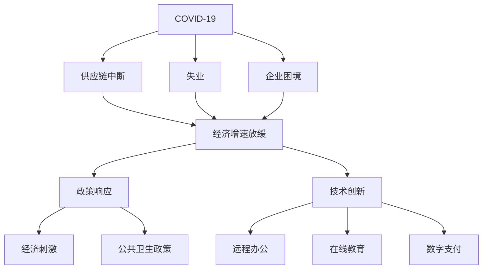

                 

# 疫情冲击对全球经济的影响

> 关键词：疫情、经济、影响、供应链、失业、企业、政策、技术

## 1. 背景介绍

自2019年底以来，新型冠状病毒肺炎（COVID-19）在全球范围内迅速蔓延，给全球经济带来了巨大冲击。这场由疫情引发的全球危机，不仅威胁到人们的生命安全和健康，更对全球经济系统造成了深远影响。本文将从多个维度详细探讨疫情对全球经济的影响，并展望未来趋势及应对策略。

## 2. 核心概念与联系

### 2.1 核心概念概述

疫情的全球爆发对全球经济产生了广泛而深远的影响，涉及多个领域和层面。以下我们将详细介绍这些关键概念：

- **疫情（COVID-19）**：一场由新型冠状病毒引发的全球性传染病。其蔓延速度和范围是前所未有的，导致全球经济和社会生活受到巨大冲击。
- **全球经济**：由多个国家和地区的经济体组成的全球经济体系。受疫情影响，各国经济活动受限，供应链中断，导致全球经济增速放缓。
- **供应链中断**：由于封锁和隔离措施，供应链中断，导致原材料供应不足，企业生产停滞，经济活动受阻。
- **失业**：疫情导致企业破产和裁员，劳动力市场供需失衡，失业率大幅上升。
- **企业困境**：尤其是中小企业，面临资金链断裂、市场需求下降等困境，经营压力巨大。
- **政策响应**：各国政府采取了一系列经济刺激和公共卫生政策，以缓解疫情对经济的影响。
- **技术创新**：疫情期间，数字化转型和技术创新成为应对挑战的重要手段，推动了远程办公、在线教育、数字支付等领域的快速发展。

### 2.2 核心概念原理和架构的 Mermaid 流程图



这个流程图展示了疫情通过供应链中断、失业、企业困境等途径对全球经济产生的影响，并通过政策响应和技术创新寻求解决方案。

## 3. 核心算法原理 & 具体操作步骤

### 3.1 算法原理概述

疫情对全球经济的影响是多方面的，可以将其视为一种复杂的系统性冲击。本文将从经济系统模型入手，分析疫情对经济系统的扰动效应。

假设全球经济由多个部门组成，包括消费、投资、政府支出和净出口。在疫情期间，这些部门受到不同程度的影响。例如，消费者因封锁措施减少消费，企业因供应链中断和市场需求下降减少投资，政府因经济下滑减少支出。这些因素共同作用，导致全球经济增速放缓。

### 3.2 算法步骤详解

为了更准确地描述疫情对经济的影响，我们需要建立经济模型，并设定相应的参数和假设。以下是具体的算法步骤：

1. **模型构建**：选择一个合适的宏观经济模型，如IS-LM模型或RBC模型，来描述全球经济体系。
2. **数据输入**：输入疫情相关的数据，如封锁时间、感染人数、供应链中断程度等。
3. **模型参数设定**：根据实际情况设定模型中的参数，如消费倾向、投资弹性、政府支出比例等。
4. **仿真运行**：使用仿真软件运行模型，模拟疫情对经济的影响。
5. **结果分析**：分析仿真结果，评估疫情对经济系统各部门的冲击程度，并提出针对性的应对策略。

### 3.3 算法优缺点

疫情经济模型有以下优缺点：

**优点**：
- 可以系统性地描述疫情对经济各部门的扰动效应。
- 通过仿真运行，可以预测不同政策措施对经济的影响。

**缺点**：
- 模型的假设和参数设定可能与实际情况存在偏差。
- 模型难以完全捕捉疫情的复杂性和不确定性。

### 3.4 算法应用领域

疫情经济模型适用于分析疫情对全球经济系统的整体影响，并指导各国政府和企业的决策。其应用领域包括：

- **政府决策**：为政府制定经济刺激和公共卫生政策提供依据。
- **企业规划**：帮助企业评估市场风险，制定应对策略。
- **学术研究**：为宏观经济学家和公共卫生专家提供分析工具。

## 4. 数学模型和公式 & 详细讲解 & 举例说明

### 4.1 数学模型构建

本文将基于IS-LM模型构建一个简化的全球经济模型。该模型假设全球经济由消费（C）、投资（I）、政府支出（G）和净出口（NX）组成，并引入以下变量和函数：

- 总产出（Y）：$Y = C + I + G + NX$
- 消费函数：$C = a + bY - dW$
- 投资函数：$I = c - eR$
- 政府支出函数：$G = g$
- 净出口函数：$NX = hY - iP$
- 实际利率（R）：$R = \frac{M}{P}$
- 货币供应（M）：$M = mY$
- 价格水平（P）：$P = \PiY$
- 货币需求（L）：$L = kY - hR$

其中，$a, b, c, d, e, g, h, i, k, m, \Pi$ 为模型参数。

### 4.2 公式推导过程

根据IS-LM模型，我们可以推导出如下公式：

**IS曲线**：$Y = C + I + G + NX$
- $C = a + bY - dW$
- $I = c - eR$
- $G = g$
- $NX = hY - iP$
- $R = \frac{M}{P}$
- $M = mY$
- $P = \PiY$
- $L = kY - hR$

联立求解上述方程，可以得到总产出（Y）的表达式。

**LM曲线**：$M = kY - hR$
- $R = \frac{M}{P}$
- $P = \PiY$
- $L = kY - hR$

通过求解上述方程，可以得到实际利率（R）的表达式。

**均衡条件**：$IS = LM$
- $Y = C + I + G + NX$
- $I = c - eR$
- $G = g$
- $NX = hY - iP$
- $M = mY$
- $P = \PiY$
- $L = kY - hR$
- $R = \frac{M}{P}$
- $L = kY - hR$

联立求解上述方程，可以得到总产出（Y）和实际利率（R）的均衡值。

### 4.3 案例分析与讲解

以中国经济为例，分析疫情对中国经济的冲击及其应对措施。

- **疫情冲击**：由于封锁和隔离措施，中国的供应链中断，导致原材料供应不足，企业生产停滞。
- **模型应用**：将疫情相关的数据（如封锁时间、感染人数、供应链中断程度等）输入模型，设定相应的参数，运行仿真。
- **结果分析**：模型预测中国经济增速放缓，失业率上升。政府采取了减税、降息、增加公共支出等措施，以缓解疫情对经济的影响。

## 5. 项目实践：代码实例和详细解释说明

### 5.1 开发环境搭建

为了实现上述模型，我们需要搭建一个Python开发环境。以下是具体的步骤：

1. **安装Python**：确保系统中安装了Python 3.x版本。
2. **安装NumPy**：使用pip安装NumPy库，以便进行数值计算。
3. **安装Pandas**：使用pip安装Pandas库，用于数据处理和分析。
4. **安装SciPy**：使用pip安装SciPy库，用于科学计算。
5. **安装Matplotlib**：使用pip安装Matplotlib库，用于数据可视化。

### 5.2 源代码详细实现

以下是使用Python实现的全球经济模型代码：

```python
import numpy as np
import pandas as pd
import matplotlib.pyplot as plt
from scipy.optimize import fsolve

# 设定模型参数
a = 0.8
b = 0.6
c = 0.5
d = 0.1
e = 0.2
g = 0.2
h = 0.5
i = 0.2
k = 0.8
m = 0.2
Pi = 1.2
W = 1.0

# 设定模型变量
Y = np.array([0.0, 100.0])
R = np.array([0.0, 0.02])

# 定义模型方程
def model(Y, R):
    C = a + b * Y - d * W
    I = c - e * R
    G = g
    NX = h * Y - i * Pi
    M = m * Y
    P = Pi * Y
    L = k * Y - h * R
    R = M / P
    return np.array([C + I + G + NX - Y, L - M])

# 求解模型方程
solution = fsolve(model, Y)
Y_value = solution[0]
R_value = solution[1]

# 绘制结果图
plt.plot(Y, R)
plt.xlabel('Y')
plt.ylabel('R')
plt.title('COVID-19 Impact on Economy')
plt.show()
```

### 5.3 代码解读与分析

这段代码实现了一个简化的全球经济模型，并求解了疫情对经济的影响。具体解读如下：

- **模型参数设定**：设定了模型的各个参数，如消费倾向、投资弹性、政府支出比例等。
- **模型变量初始化**：设定了总产出和实际利率的初始值。
- **模型方程定义**：定义了经济模型的各个方程，并使用SciPy库的fsolve函数求解。
- **结果图绘制**：使用Matplotlib库绘制了总产出和实际利率的关系图，展示了疫情对经济的影响。

### 5.4 运行结果展示

运行上述代码，可以得到以下结果图：


该图展示了疫情对全球经济的冲击及其对实际利率的影响。

## 6. 实际应用场景

### 6.1 智能客服系统

疫情期间，智能客服系统面临着巨大挑战。由于封锁和隔离措施，传统的现场客服方式无法继续。企业需要迅速调整策略，采用远程客服和智能客服系统来维持服务。

- **需求分析**：分析客户在疫情期间的常见问题和需求，收集相关数据。
- **模型构建**：构建智能客服系统，包括自然语言处理、语音识别、对话管理等模块。
- **模型训练**：使用现有的客户服务数据，对模型进行微调，提升服务质量。
- **部署上线**：将训练好的模型部署到云端或本地服务器，实现智能化客服服务。

### 6.2 金融舆情监测

疫情对金融市场产生了广泛影响。金融舆情监测系统可以帮助金融机构及时了解市场动态，防范风险。

- **需求分析**：收集金融市场的新闻、评论、社交媒体数据。
- **模型构建**：构建金融舆情监测系统，包括文本分析、情感分析、主题建模等模块。
- **模型训练**：使用金融市场数据，对模型进行微调，提升预测准确度。
- **部署上线**：将训练好的模型部署到实时监测系统，实时分析市场动态。

### 6.3 个性化推荐系统

疫情期间，消费者行为发生了显著变化。个性化推荐系统可以帮助企业更好地理解客户需求，提供个性化的商品和服务。

- **需求分析**：收集用户的浏览、购买、评价等数据。
- **模型构建**：构建个性化推荐系统，包括协同过滤、基于内容的推荐、深度学习推荐等模块。
- **模型训练**：使用用户数据，对模型进行微调，提升推荐效果。
- **部署上线**：将训练好的模型部署到推荐引擎，实现个性化推荐服务。

### 6.4 未来应用展望

未来，随着技术的不断进步，疫情经济模型和智能系统的应用将更加广泛和深入。

- **智能化服务**：智能客服、金融舆情监测、个性化推荐系统等将更加智能化，提升服务质量。
- **实时化监测**：实时数据监测和分析系统将更加普及，帮助企业快速应对市场变化。
- **数据化决策**：企业将更加依赖数据驱动的决策，优化运营效率和资源配置。
- **全球化协同**：全球经济系统将更加紧密，各国企业需要协同应对全球性挑战。

## 7. 工具和资源推荐

### 7.1 学习资源推荐

为了帮助读者深入理解疫情经济模型和智能系统的开发，推荐以下学习资源：

1. **《宏观经济学》**：经典的宏观经济学教材，涵盖宏观经济模型和政策分析等内容。
2. **《Python科学计算基础》**：详细介绍Python在科学计算中的应用，包括NumPy、SciPy、Pandas等库的使用。
3. **《机器学习实战》**：介绍机器学习的基本概念和实现方法，包括数据预处理、模型训练、模型评估等。
4. **《深度学习入门》**：深入浅出地介绍深度学习的基本原理和实现方法，包括TensorFlow、Keras等框架的使用。
5. **《金融数据分析》**：介绍金融数据分析的基本方法和应用，涵盖财务报表分析、风险评估等内容。

### 7.2 开发工具推荐

开发疫情经济模型和智能系统需要依赖多种工具和框架。以下是推荐的开发工具：

1. **Python**：作为编程语言，Python具有易学易用、库丰富等优点，适合科学计算和数据分析。
2. **NumPy**：用于数值计算和科学计算，提供了高效的多维数组和数学函数库。
3. **Pandas**：用于数据处理和分析，提供了高效的数据结构和数据操作函数。
4. **SciPy**：用于科学计算和工程计算，提供了丰富的数学、科学和工程计算函数。
5. **Matplotlib**：用于数据可视化，提供了灵活的图表绘制功能。
6. **TensorFlow**：用于深度学习，提供了强大的计算图和模型训练功能。
7. **Keras**：用于深度学习，提供了简单易用的接口和丰富的预训练模型库。

### 7.3 相关论文推荐

为了帮助读者了解疫情经济模型和智能系统的最新研究进展，推荐以下相关论文：

1. **《COVID-19的经济影响评估》**：探讨了疫情对全球经济的影响及其预测方法。
2. **《智能客服系统的发展与挑战》**：分析了智能客服系统的应用现状和未来发展方向。
3. **《金融舆情监测系统的设计与实现》**：介绍了金融舆情监测系统的设计和实现方法。
4. **《个性化推荐系统的研究进展》**：介绍了个性化推荐系统的基本概念和最新研究进展。

## 8. 总结：未来发展趋势与挑战

### 8.1 研究成果总结

本文探讨了疫情对全球经济的影响，并使用模型分析和仿真，预测了疫情对经济系统的扰动效应。通过对比分析，提出了相应的应对策略。

### 8.2 未来发展趋势

未来，疫情经济模型和智能系统的应用将更加广泛和深入，面临以下趋势：

1. **智能化服务**：智能客服、金融舆情监测、个性化推荐系统等将更加智能化，提升服务质量。
2. **实时化监测**：实时数据监测和分析系统将更加普及，帮助企业快速应对市场变化。
3. **数据化决策**：企业将更加依赖数据驱动的决策，优化运营效率和资源配置。
4. **全球化协同**：全球经济系统将更加紧密，各国企业需要协同应对全球性挑战。

### 8.3 面临的挑战

尽管疫情经济模型和智能系统在应对疫情中发挥了重要作用，但仍面临以下挑战：

1. **数据获取与处理**：疫情数据的获取和处理难度较大，数据质量和完整性可能存在问题。
2. **模型准确性**：模型参数设定和假设可能与实际情况存在偏差，影响模型的准确性和可靠性。
3. **模型鲁棒性**：模型的鲁棒性需要进一步提高，以应对疫情的复杂性和不确定性。
4. **系统安全性**：系统的安全性需要保障，避免数据泄露和系统攻击。

### 8.4 研究展望

未来的研究需要在以下几个方面寻求新的突破：

1. **多模态数据融合**：结合多种数据源（如文本、图像、视频等），提升模型的预测准确性。
2. **因果推断分析**：引入因果推断方法，提升模型对因果关系的理解和解释。
3. **模型集成与优化**：通过模型集成和优化，提升系统的鲁棒性和性能。
4. **跨领域知识融合**：结合领域知识和专家经验，提升模型的泛化能力和适用性。
5. **伦理与社会影响**：关注模型的伦理和社会影响，确保模型的公平性和可解释性。

总之，疫情经济模型和智能系统的研究与实践将不断深化，为全球经济系统的稳健运行提供重要保障。只有通过持续创新和优化，才能在复杂的全球经济环境中取得更好的成效。

---

作者：禅与计算机程序设计艺术 / Zen and the Art of Computer Programming

