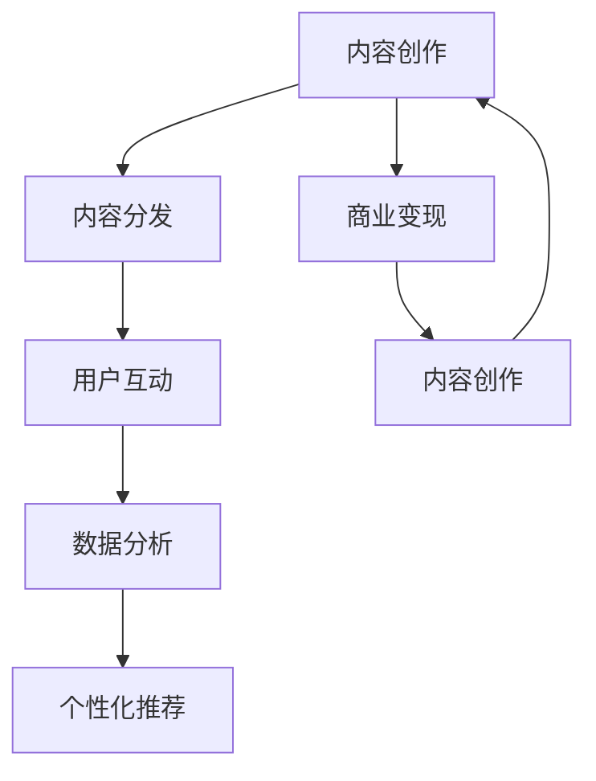

                 

# 知识付费创业中的内容价值最大化

在知识经济的时代，内容创业成为了互联网行业的一大热点。特别是在知识付费领域，高质量内容的输出和运营，直接关系到企业的发展和盈利能力。如何最大化内容价值，实现商业变现，成为每个知识付费创业者必须面对的挑战。本文将从内容价值最大化的角度，探讨知识付费创业中面临的核心问题，并提供行之有效的解决方案。

## 1. 背景介绍

随着互联网技术的飞速发展和人们信息需求的不断增加，知识付费模式应运而生。知识付费通过售卖优质内容，为知识生产者提供持续收益，同时满足广大用户对知识和信息的需求。然而，内容创业竞争激烈，用户需求日益复杂，内容生产者如何实现内容价值的最大化，是每个创业者必须面对的问题。

## 2. 核心概念与联系

### 2.1 核心概念概述

为了更好地理解知识付费创业中内容价值最大化的实现，本节将介绍几个密切相关的核心概念：

- **内容创作**：指创作者根据目标受众的特定需求，生成并发布有价值的信息或作品。内容创作是知识付费创业的核心环节，决定着企业能否吸引和留存用户。

- **内容分发**：指将内容通过各种渠道（如App、网站、社交媒体等）推送给目标用户，确保用户能够获取到所需信息。内容分发策略直接影响用户对内容的接收和互动。

- **用户互动**：指用户通过评论、点赞、分享等行为对内容的反应和反馈。用户互动可以提供关于内容价值的重要反馈，帮助创作者优化内容。

- **数据分析**：通过收集和分析用户行为数据，了解内容的表现和用户偏好，为内容创作和分发提供数据支持。

- **个性化推荐**：根据用户行为和偏好，智能推荐符合用户兴趣的内容，提高用户满意度和黏性。

- **商业变现**：通过订阅、打赏、广告、课程等形式实现内容的商业化变现。

这些核心概念之间相互联系、相互促进，共同构成了知识付费创业的生态系统。通过对这些概念的深入理解和灵活运用，可以显著提升内容价值和企业的盈利能力。

### 2.2 核心概念原理和架构的 Mermaid 流程图



这个流程图展示的内容创作与运营的逻辑关系：

1. 内容创作是整个生态系统的起点，决定内容的质量和价值。
2. 内容分发将内容推送给用户，提高内容的曝光率和可见度。
3. 用户互动反馈内容的价值和接受程度，影响内容的优化和迭代。
4. 数据分析挖掘用户行为，指导内容创作和分发策略。
5. 个性化推荐增强用户满意度和黏性，促进内容的进一步传播和变现。
6. 商业变现实现内容的商业化，支持内容创作和生态系统的持续运营。

## 3. 核心算法原理 & 具体操作步骤

### 3.1 算法原理概述

在知识付费创业中，最大化内容价值的核心在于合理运用数据分析和机器学习技术，优化内容创作、分发和用户互动，实现商业变现。以下是几个关键的算法原理：

- **内容推荐算法**：通过用户行为数据和内容特征，预测用户可能感兴趣的内容，提升内容的曝光率和点击率。

- **内容优化算法**：根据用户反馈和互动数据，调整内容创作策略，优化内容的选题、形式和质量。

- **用户行为分析算法**：通过统计和挖掘用户行为数据，分析用户偏好和需求，指导内容创作和分发。

- **个性化定价策略**：根据内容价值和用户支付意愿，制定差异化的定价策略，实现内容的商业变现。

### 3.2 算法步骤详解

#### 3.2.1 数据收集与预处理

- **数据来源**：用户行为数据（点击、浏览、购买等）、内容特征数据（标题、关键词、标签等）、用户反馈数据（评论、评分等）。
- **数据清洗**：去除噪声数据、处理缺失值、异常值和重复数据。
- **特征工程**：提取和构造有用的特征，如用户活跃度、内容时长、标签分布等。

#### 3.2.2 内容推荐算法

- **协同过滤**：基于用户历史行为和相似用户行为，推荐相关内容。
- **基于内容的推荐**：通过内容特征相似度，推荐类似内容。
- **混合推荐**：结合协同过滤和基于内容的推荐，取长补短，提升推荐效果。

#### 3.2.3 内容优化算法

- **A/B测试**：通过对比不同内容的点击率、转化率等指标，确定最佳内容策略。
- **内容分析工具**：使用NLP和数据分析工具，分析内容质量、用户反馈等。
- **内容迭代**：根据分析结果，调整内容选题、形式和发布时间，优化内容创作。

#### 3.2.4 用户行为分析算法

- **用户画像**：通过数据分析，构建用户画像，了解用户兴趣和需求。
- **行为预测**：预测用户可能感兴趣的内容，提前推送相关内容。
- **行为分析工具**：使用可视化工具和数据分析库，进行用户行为分析。

#### 3.2.5 个性化定价策略

- **动态定价**：根据内容价值、用户支付意愿和市场供需情况，动态调整价格。
- **分众定价**：根据不同用户群体的特点，制定差异化的定价策略。
- **价格优化工具**：使用优化算法，不断优化定价策略，实现最佳收益。

### 3.3 算法优缺点

基于内容推荐和优化的知识付费创业方法具有以下优点：

- 提高内容的曝光率和点击率，吸引更多用户。
- 优化内容质量，提升用户满意度和留存率。
- 通过数据驱动决策，提高运营效率和商业变现能力。

同时，这些方法也存在一些局限性：

- 对数据质量要求高，需要大量优质数据支持。
- 算法复杂度较高，需要高水平的数据科学家和工程师团队。
- 用户隐私问题需特别注意，需遵循相关法律法规。

### 3.4 算法应用领域

基于内容推荐和优化的知识付费创业方法，适用于各类内容平台和付费模式。以下是一些典型的应用领域：

- **在线课程平台**：如Coursera、Udemy等，通过个性化推荐和内容优化，提升用户订阅率和课程购买率。
- **付费文章平台**：如Medium、知乎专栏等，通过推荐优质文章和优化内容分发，吸引更多付费用户。
- **电子书和有声书平台**：如Kindle、听书等，通过个性化推荐和内容优化，提高用户购买和阅读率。
- **专业社群平台**：如LinkedIn、Toastmasters等，通过精准推荐和用户互动，增加用户活跃度和付费转化率。

## 4. 数学模型和公式 & 详细讲解 & 举例说明

### 4.1 数学模型构建

在知识付费创业中，常用的数学模型包括协同过滤、基于内容的推荐、用户画像构建等。以下以协同过滤推荐算法为例，进行详细讲解。

设用户集合为 $U$，内容集合为 $I$，用户对内容的评分矩阵为 $R \in \mathbb{R}^{m \times n}$，其中 $m$ 为用户数，$n$ 为内容数，$R_{ij}$ 表示用户 $i$ 对内容 $j$ 的评分。

协同过滤推荐算法的目标是在给定用户 $i$ 时，推荐未评分过的内容 $j$。常用的协同过滤算法有基于用户的协同过滤和基于内容的协同过滤：

1. **基于用户的协同过滤**：

   目标函数为：
   $$
   \min_{\mathbf{p}} \sum_{(i,j) \in \mathcal{R}} (R_{ij} - \mathbf{p}_i^T\mathbf{q}_j)^2
   $$
   
   其中 $\mathbf{p}_i \in \mathbb{R}^n$ 和 $\mathbf{q}_j \in \mathbb{R}^m$ 分别是用户 $i$ 和内容 $j$ 的潜在兴趣向量。
   
   通过求解上述最小化问题，得到用户的潜在兴趣向量 $\mathbf{p}_i$，然后计算与未评分内容 $j$ 的相似度，推荐相似度高的内容。

2. **基于内容的协同过滤**：

   目标函数为：
   $$
   \min_{\mathbf{p}} \sum_{(i,j) \in \mathcal{R}} (R_{ij} - \mathbf{p}_i^T\mathbf{q}_j)^2
   $$
   
   其中 $\mathbf{p}_i \in \mathbb{R}^n$ 和 $\mathbf{q}_j \in \mathbb{R}^m$ 分别是用户 $i$ 和内容 $j$ 的潜在兴趣向量。
   
   通过求解上述最小化问题，得到内容的潜在兴趣向量 $\mathbf{q}_j$，然后计算与未评分内容 $j$ 的相似度，推荐相似度高的内容。

### 4.2 公式推导过程

- **基于用户的协同过滤**：
   
  假设用户 $i$ 对内容 $j$ 的评分向量为 $R_{i,:}$，潜在兴趣向量为 $\mathbf{p}_i$，用户 $i$ 对内容 $j$ 的预测评分 $R_{ij}^{pred} = \mathbf{p}_i^T\mathbf{q}_j$。根据最小二乘法，求解 $\mathbf{p}_i$ 和 $\mathbf{q}_j$。
   
  设 $\mathbf{R}_{i,:}$ 为 $R_{i,:}$ 的列向量，$\mathbf{R}_{:,j}$ 为 $R$ 的第 $j$ 行，$\mathbf{R}_{k,:}$ 为 $R$ 的第 $k$ 行，则：

  $$
  \mathbf{p}_i = \arg\min_{\mathbf{p}} \|\mathbf{R}_{i,:} - \mathbf{p}^T\mathbf{q}_j\|^2
  $$
  
  解上述最小化问题，得到 $\mathbf{p}_i$ 后，计算用户 $i$ 对未评分内容 $j$ 的预测评分 $R_{ij}^{pred} = \mathbf{p}_i^T\mathbf{q}_j$，排序后推荐相似度高的内容。

- **基于内容的协同过滤**：

  假设内容 $j$ 对用户 $i$ 的评分向量为 $R_{:,j}$，潜在兴趣向量为 $\mathbf{q}_j$，用户 $i$ 对内容 $j$ 的预测评分 $R_{ij}^{pred} = \mathbf{p}_i^T\mathbf{q}_j$。根据最小二乘法，求解 $\mathbf{p}_i$ 和 $\mathbf{q}_j$。
   
  设 $\mathbf{R}_{:,j}$ 为 $R$ 的第 $j$ 行，$\mathbf{R}_{i,:}$ 为 $R_{i,:}$ 的行向量，$\mathbf{R}_{:,k}$ 为 $R$ 的第 $k$ 列，则：

  $$
  \mathbf{q}_j = \arg\min_{\mathbf{q}} \|\mathbf{R}_{:,j} - \mathbf{p}_i^T\mathbf{q}_j\|^2
  $$
  
  解上述最小化问题，得到 $\mathbf{q}_j$ 后，计算内容 $j$ 对用户 $i$ 的预测评分 $R_{ij}^{pred} = \mathbf{p}_i^T\mathbf{q}_j$，排序后推荐相似度高的内容。

### 4.3 案例分析与讲解

以在线课程平台为例，假设某用户 $i$ 浏览了课程 $j_1,j_2,j_3$，并给出了评分。

- **基于用户的协同过滤**：
  
  设 $i$ 的潜在兴趣向量为 $\mathbf{p}_i = [p_{i1}, p_{i2}, p_{i3}]^T$，课程 $j$ 的潜在兴趣向量为 $\mathbf{q}_j = [q_{j1}, q_{j2}, q_{j3}]^T$。
  
  根据用户 $i$ 对课程 $j_1,j_2,j_3$ 的评分，构建损失函数：
  $$
  L(\mathbf{p}_i, \mathbf{q}_j) = \sum_{k=1}^3 (R_{ik} - \mathbf{p}_i^T\mathbf{q}_{j_k})^2
  $$
  
  求解上述最小化问题，得到 $\mathbf{p}_i$ 后，计算用户 $i$ 对未评分课程的预测评分，推荐相似度高的课程。

- **基于内容的协同过滤**：
  
  设课程 $j_1,j_2,j_3$ 的评分向量分别为 $\mathbf{R}_{1,:}, \mathbf{R}_{2,:}, \mathbf{R}_{3,:}$，用户 $i$ 的潜在兴趣向量为 $\mathbf{p}_i = [p_{i1}, p_{i2}, p_{i3}]^T$，课程 $j$ 的潜在兴趣向量为 $\mathbf{q}_j = [q_{j1}, q_{j2}, q_{j3}]^T$。
  
  根据课程 $j_1,j_2,j_3$ 对用户 $i$ 的评分，构建损失函数：
  $$
  L(\mathbf{p}_i, \mathbf{q}_j) = \sum_{k=1}^3 (\mathbf{R}_{k,:}^T\mathbf{p}_i - \mathbf{q}_j^T\mathbf{R}_{:,k})^2
  $$
  
  求解上述最小化问题，得到 $\mathbf{q}_j$ 后，计算课程 $j$ 对用户 $i$ 的预测评分，推荐相似度高的课程。

## 5. 项目实践：代码实例和详细解释说明

### 5.1 开发环境搭建

在项目实践中，我们需要搭建一个完善的开发环境，以便进行数据处理、算法实现和模型训练等操作。以下是一个基本的开发环境搭建流程：

1. **安装Python和虚拟环境**：
   ```bash
   python3 -m venv env
   source env/bin/activate
   ```

2. **安装必要的库和框架**：
   ```bash
   pip install pandas numpy scipy scikit-learn tensorflow keras
   ```

3. **数据准备**：
   - 收集用户行为数据，如浏览历史、购买记录等。
   - 收集内容特征数据，如标题、关键词、标签等。
   - 收集用户反馈数据，如评分、评论等。

### 5.2 源代码详细实现

以下是一个基于协同过滤推荐算法的Python代码实现：

```python
import numpy as np
import pandas as pd
from scipy.sparse import csr_matrix

def build_similarity_matrix(R):
    """
    构建用户-内容相似度矩阵
    """
    R = csr_matrix(R)
    n_users = R.shape[0]
    n_items = R.shape[1]
    
    # 计算用户之间的余弦相似度
    user_similarity = np.dot(R, R.T) / (np.dot(R, R.T).sum() * np.dot(R.T, R).sum())
    user_similarity = np.sqrt(user_similarity)
    
    # 计算内容之间的余弦相似度
    item_similarity = np.dot(R.T, R) / (np.dot(R.T, R).sum() * np.dot(R, R.T).sum())
    item_similarity = np.sqrt(item_similarity)
    
    return user_similarity, item_similarity

def collaborative_filtering(R):
    """
    协同过滤推荐算法
    """
    user_similarity, item_similarity = build_similarity_matrix(R)
    
    n_users = R.shape[0]
    n_items = R.shape[1]
    
    # 初始化潜在兴趣向量
    user_factors = np.random.rand(n_users, n_items)
    item_factors = np.random.rand(n_items, n_users)
    
    # 迭代更新潜在兴趣向量
    for i in range(10):
        for j in range(n_items):
            user_effect = np.dot(user_similarity, user_factors[:, j])
            item_effect = np.dot(item_similarity, item_factors[j, :])
            predicted = np.dot(user_factors, item_effect) + np.dot(user_effect, item_factors[j, :])
            R_pred = predicted - R[:, j]
            user_factors += np.dot(user_effect, user_effect.T) / np.dot(user_effect, item_effect.T) * (R_pred - R[:, j])
    
    # 计算推荐分数
    scores = np.dot(user_factors, item_factors.T)
    
    # 推荐排序
    idx = np.argsort(scores, axis=1)[::-1]
    
    return idx
```

### 5.3 代码解读与分析

以上代码实现了基于协同过滤的推荐算法，包括用户-内容相似度矩阵的构建和协同过滤过程。以下是代码的详细解读：

- **build_similarity_matrix函数**：
  - 将评分矩阵 $R$ 转换为稀疏矩阵。
  - 计算用户之间的余弦相似度，得到用户相似度矩阵。
  - 计算内容之间的余弦相似度，得到内容相似度矩阵。

- **collaborative_filtering函数**：
  - 初始化用户和内容的潜在兴趣向量。
  - 迭代更新潜在兴趣向量，直至收敛。
  - 计算推荐分数，并进行排序推荐。

## 6. 实际应用场景

### 6.1 在线课程平台

在线课程平台是知识付费创业的主要应用场景之一。通过协同过滤推荐算法，平台可以根据用户的历史行为，推荐相关课程，提升用户订阅率和课程购买率。

### 6.2 付费文章平台

付费文章平台通过优质内容的推荐，吸引更多付费用户。通过个性化推荐和用户行为分析，平台可以精准推送用户感兴趣的文章，提升用户满意度和留存率。

### 6.3 电子书和有声书平台

电子书和有声书平台通过个性化推荐，提高用户购买和阅读率。通过协同过滤推荐算法和内容优化策略，平台可以推荐符合用户兴趣的电子书和有声书，提升用户体验和付费转化率。

### 6.4 未来应用展望

未来，知识付费创业将面临更多挑战和机遇。随着人工智能技术的不断发展，个性化推荐、内容优化、用户行为分析等技术将更加成熟，提升内容价值的能力也将不断增强。以下是一些未来应用展望：

- **多模态推荐**：结合文本、图片、音频等多模态数据，进行更全面和深入的推荐。
- **动态定价**：根据内容价值和用户支付意愿，动态调整价格，实现最佳收益。
- **实时推荐**：利用实时数据和流计算技术，进行实时推荐，提升用户体验和留存率。
- **用户个性化定制**：根据用户偏好和需求，提供个性化定制化的内容推荐和课程，满足不同用户的需求。

## 7. 工具和资源推荐

### 7.1 学习资源推荐

为了帮助开发者系统掌握知识付费创业中内容价值最大化的实现，这里推荐一些优质的学习资源：

- **《推荐系统实战》**：一本深入浅出地讲解推荐系统原理和实现的书籍，适合初学者和进阶者。
- **Coursera《机器学习》课程**：斯坦福大学开设的机器学习经典课程，涵盖推荐系统等内容，理论联系实践。
- **Kaggle竞赛平台**：通过参加推荐系统竞赛，实践推荐算法，提升实战能力。
- **GitHub开源项目**：如Recommender System、Personalized Recommendation等，提供丰富的推荐系统实现代码和案例。

### 7.2 开发工具推荐

在项目实践中，我们需要使用一些高效的开发工具，以下是几款推荐的工具：

- **Jupyter Notebook**：用于数据处理、算法实现和模型训练等操作，支持代码单元格和数据表格的混合展示。
- **TensorFlow**：用于构建和训练推荐模型，支持分布式计算和深度学习算法。
- **Scikit-learn**：用于数据预处理、特征工程和模型评估等操作，提供丰富的机器学习算法库。
- **PyTorch**：用于构建和训练推荐模型，支持动态计算图和高效的GPU加速。
- **Spark**：用于大规模数据处理和分布式计算，支持推荐系统的实时计算和存储。

### 7.3 相关论文推荐

知识付费创业中内容价值最大化的实现，涉及推荐系统、机器学习、数据挖掘等多个领域。以下是几篇奠基性的相关论文，推荐阅读：

- **《协同过滤推荐系统》**：详细讲解协同过滤算法的原理和实现。
- **《基于内容的推荐系统》**：介绍基于内容的推荐算法及其应用。
- **《推荐系统中的个性化定价》**：探讨推荐系统中的个性化定价策略和算法。
- **《个性化推荐系统中的多目标优化》**：研究个性化推荐系统中的多目标优化问题和算法。

## 8. 总结：未来发展趋势与挑战

### 8.1 研究成果总结

本文对知识付费创业中内容价值最大化的实现进行了系统介绍。通过数据分析和机器学习技术，优化内容创作、分发和用户互动，实现商业变现。协同过滤推荐算法是其中的核心技术，通过用户行为数据和内容特征数据，推荐用户感兴趣的内容。本文还探讨了在线课程平台、付费文章平台、电子书和有声书平台等典型应用场景，提供了具体的代码实现和详细解读。

### 8.2 未来发展趋势

未来，知识付费创业将面临更多挑战和机遇。随着人工智能技术的不断发展，个性化推荐、内容优化、用户行为分析等技术将更加成熟，提升内容价值的能力也将不断增强。以下是一些未来发展趋势：

- **多模态推荐**：结合文本、图片、音频等多模态数据，进行更全面和深入的推荐。
- **动态定价**：根据内容价值和用户支付意愿，动态调整价格，实现最佳收益。
- **实时推荐**：利用实时数据和流计算技术，进行实时推荐，提升用户体验和留存率。
- **用户个性化定制**：根据用户偏好和需求，提供个性化定制化的内容推荐和课程，满足不同用户的需求。

### 8.3 面临的挑战

尽管个性化推荐和内容优化在知识付费创业中取得了显著成效，但仍面临一些挑战：

- **数据质量问题**：推荐系统需要高质量的数据支持，数据缺失、噪声和异常值等问题仍需解决。
- **算法复杂度**：推荐算法涉及复杂的数学和计算过程，需要高水平的数据科学家和工程师团队。
- **用户隐私问题**：推荐系统需处理大量用户数据，用户隐私和数据安全问题需特别注意。
- **冷启动问题**：新用户和冷门内容难以推荐，推荐系统需处理冷启动问题，提升初期推荐效果。

### 8.4 研究展望

未来，知识付费创业中内容价值最大化的研究将不断深入，解决现有挑战，实现新的突破。以下是一些研究展望：

- **推荐系统自适应学习**：引入强化学习等技术，动态调整推荐策略，提升推荐效果。
- **多目标优化**：研究推荐系统中的多目标优化问题，平衡不同用户需求和业务目标。
- **实时流计算**：利用流计算技术，实时处理用户行为数据，进行实时推荐。
- **用户行为预测**：研究用户行为预测模型，提前推送相关内容，提升用户满意度和留存率。

总之，知识付费创业中内容价值最大化的实现，需要不断创新和优化推荐算法、内容策略和用户互动，实现商业变现和用户体验的双重提升。

## 9. 附录：常见问题与解答

**Q1: 如何提升推荐系统的准确率？**

A: 提升推荐系统的准确率，需要从多个方面入手：
- **数据质量**：保证数据完整、准确、干净，去除噪声和异常值。
- **特征工程**：提取和构造有用的特征，如用户行为、内容特征等。
- **模型选择**：选择适合业务的推荐模型，如协同过滤、基于内容的推荐等。
- **算法优化**：优化算法参数和超参数，如学习率、正则化等。
- **多模态融合**：结合文本、图片、音频等多模态数据，提升推荐效果。

**Q2: 推荐系统中如何处理冷启动问题？**

A: 推荐系统中处理冷启动问题，可以采取以下方法：
- **随机推荐**：对于新用户和新内容，提供一些随机的推荐，引导用户尝试。
- **基于兴趣的推荐**：根据用户已有的兴趣和行为，进行个性化推荐。
- **基于内容的推荐**：对于新内容，根据内容特征进行推荐。
- **推荐系统自适应学习**：引入强化学习等技术，动态调整推荐策略，提升初期推荐效果。

**Q3: 推荐系统中如何保护用户隐私？**

A: 推荐系统中保护用户隐私，可以采取以下措施：
- **数据匿名化**：去除或模糊化用户敏感信息，保护用户隐私。
- **差分隐私**：使用差分隐私技术，限制用户数据泄露风险。
- **用户控制权**：让用户自主选择是否使用推荐系统，保护用户数据自主权。

**Q4: 推荐系统中如何提高推荐多样性？**

A: 推荐系统中提高推荐多样性，可以采取以下方法：
- **多样性约束**：在推荐算法中引入多样性约束，保证推荐结果的多样性。
- **跨领域推荐**：推荐不同领域的内容，增加推荐结果的多样性。
- **交互多样性**：引入用户交互多样性，推荐不同类型的内容，提升用户体验。

总之，知识付费创业中内容价值最大化的实现，需要不断创新和优化推荐算法、内容策略和用户互动，实现商业变现和用户体验的双重提升。未来，随着技术的不断进步和应用的不断深入，知识付费创业将展现出更加广阔的前景和潜力。

---

作者：禅与计算机程序设计艺术 / Zen and the Art of Computer Programming

