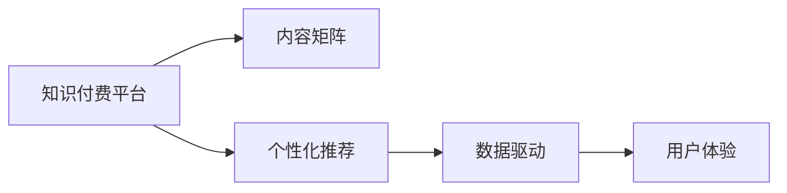

                 

# 知识付费创业中的内容矩阵搭建策略

> 关键词：知识付费、内容矩阵、个性化推荐、数据驱动、用户体验

## 1. 背景介绍

随着知识经济和数字经济的蓬勃发展，知识付费正在成为互联网行业的新风口。凭借其高效、便捷、个性化的特点，知识付费业务迅速吸引了大批用户的青睐。无论是广大知识工作者，还是追求自我提升的普通用户，都愿意为获取高价值信息投入相应的费用。从Coursera、Udemy到喜马拉雅、得到，国内外各大知识付费平台纷纷涌现，竞争激烈。

在此背景下，如何构建高效的内容矩阵，精准定位目标用户，提升平台粘性，优化用户体验，成为知识付费创业成功的关键因素。本文将从知识付费平台的特征出发，系统介绍内容矩阵搭建策略，并给出具体的案例分析。

## 2. 核心概念与联系

### 2.1 核心概念概述

在知识付费领域，内容矩阵搭建策略主要涉及以下几个核心概念：

- 知识付费：基于知识内容的付费模式，用户通过付费获取高价值的学习内容，如视频课程、音频讲座、图书、文章等。
- 内容矩阵：一种基于内容的组织方式，通过将不同类别的内容进行有机整合，构建系统的知识图谱，便于用户高效检索和使用。
- 个性化推荐：根据用户兴趣和行为，动态调整内容推荐策略，提升用户获取内容的效率和质量。
- 数据驱动：通过收集和分析用户行为数据，形成用户画像，指导内容生产和运营策略的调整。
- 用户体验：在内容展示、搜索、交互等各个环节，优化用户体验，提升用户的满意度和忠诚度。

这些概念之间相互联系、相互影响，共同构成了知识付费内容矩阵搭建的完整框架。构建高效的内容矩阵，需要围绕用户体验进行数据驱动的个性化推荐，从而形成良性的用户互动和口碑传播。

### 2.2 核心概念原理和架构的 Mermaid 流程图



这个流程图展示了知识付费平台的核心组件和它们之间的关联：

- 知识付费平台(A)作为内容矩阵搭建的主体，通过个性化推荐(C)和数据驱动(D)优化用户体验(E)，最终形成高效的内容矩阵(B)。

## 3. 核心算法原理 & 具体操作步骤

### 3.1 算法原理概述

知识付费平台的内容矩阵搭建，本质上是一个数据驱动的个性化推荐系统。其核心算法包括以下几个关键步骤：

1. 数据收集：收集用户行为数据，包括浏览记录、点击行为、搜索关键词、收藏内容等，形成用户画像。
2. 特征提取：对用户画像中的数据进行特征提取，得到用户兴趣特征、行为特征等。
3. 模型训练：通过训练协同过滤、深度学习等推荐算法模型，学习用户与内容的映射关系。
4. 内容推荐：根据用户画像和模型，动态调整推荐算法策略，为用户推荐最适合的内容。

### 3.2 算法步骤详解

#### 3.2.1 数据收集

知识付费平台的数据来源广泛，涉及用户行为数据和内容元数据：

1. 用户行为数据：用户在平台上的浏览记录、点击行为、搜索关键词、收藏内容等。
2. 内容元数据：视频课程、音频讲座、图书、文章等内容的标题、摘要、作者、时长、分类、标签等。

具体来说，可以从以下渠道收集数据：

- 前端日志：记录用户在平台上的点击、浏览、搜索等行为。
- 后端数据库：记录用户注册信息、付费记录、收藏夹内容等。
- API接口：获取第三方内容源的元数据信息。
- 用户反馈：通过调查问卷、评论、评分等方式获取用户反馈数据。

#### 3.2.2 特征提取

特征提取是推荐算法中的关键步骤，直接影响到推荐结果的质量：

1. 用户兴趣特征：通过分析用户的浏览记录、点击行为、收藏内容等，提取用户偏好特征。常用的特征包括兴趣标签、热门课程、热门作者等。
2. 行为特征：通过分析用户的搜索关键词、观看时长、阅读速度等行为数据，提取行为特征。常用的特征包括观看时长、点赞数、评论数等。
3. 内容特征：通过分析内容的标题、摘要、作者、分类、标签等元数据，提取内容特征。常用的特征包括内容标题、关键词、作者、分类等。

#### 3.2.3 模型训练

常用的推荐算法包括协同过滤、深度学习等：

1. 协同过滤：基于用户-物品矩阵，通过计算相似度，推荐用户可能感兴趣的内容。常用的协同过滤算法包括基于用户的协同过滤和基于物品的协同过滤。
2. 深度学习：利用神经网络模型，从用户和内容的双重特征中学习映射关系。常用的深度学习算法包括神经协同过滤、卷积神经网络、循环神经网络等。

#### 3.2.4 内容推荐

内容推荐是知识付费平台的核心功能，通过动态调整推荐算法策略，为用户提供个性化内容：

1. 个性化推荐：根据用户画像和模型，动态调整推荐算法策略，为用户推荐最适合的内容。常用的个性化推荐算法包括基于内容的推荐、基于协同过滤的推荐、基于混合模型的推荐等。
2. 多臂老虎机：通过A/B测试等方式，优化推荐算法策略，不断提升推荐效果。常用的多臂老虎机算法包括上下文感知推荐、实时学习推荐等。

### 3.3 算法优缺点

知识付费平台的内容矩阵搭建策略，具有以下优点：

1. 数据驱动：通过收集和分析用户行为数据，形成用户画像，指导内容生产和运营策略的调整。
2. 个性化推荐：根据用户兴趣和行为，动态调整内容推荐策略，提升用户获取内容的效率和质量。
3. 用户体验优化：在内容展示、搜索、交互等各个环节，优化用户体验，提升用户的满意度和忠诚度。

但同时也存在一些局限性：

1. 数据隐私：用户行为数据的收集和使用，可能会引发用户隐私问题。
2. 数据质量：用户行为数据的准确性和完整性，会直接影响到推荐效果。
3. 模型复杂性：深度学习等复杂算法模型的训练和调参，需要较强的技术能力和计算资源。

### 3.4 算法应用领域

基于知识付费平台的内容矩阵搭建策略，已经在多个领域得到了广泛应用，例如：

- 在线教育：通过个性化推荐，为学生提供最适合的课程内容，提升学习效果。
- 职业培训：根据用户职业需求，推荐最相关的内容，加速职业发展。
- 信息咨询：为专业用户提供深度内容推荐，满足其特定需求。
- 生活服务：推荐各类生活服务内容，丰富用户生活。
- 休闲娱乐：推荐娱乐性内容，满足用户的休闲需求。

除了上述这些经典应用外，内容矩阵搭建策略还被创新性地应用到更多场景中，如智能推荐、个性化广告等，为知识付费平台带来了全新的创新路径。

## 4. 数学模型和公式 & 详细讲解 & 举例说明

### 4.1 数学模型构建

知识付费平台的内容矩阵搭建，本质上是一个数据驱动的推荐系统。其核心数学模型包括用户画像、特征提取和推荐算法模型：

1. 用户画像：通过用户行为数据，形成用户兴趣特征、行为特征等。
2. 特征提取：将用户画像和内容元数据，转换为适合算法模型的特征向量。
3. 推荐算法模型：通过训练协同过滤、深度学习等推荐算法模型，学习用户与内容的映射关系。

### 4.2 公式推导过程

#### 4.2.1 用户画像

用户画像可以通过以下公式构建：

$$
P_u = \sum_{i=1}^{n} x_i \times w_i
$$

其中 $P_u$ 为用户画像向量，$x_i$ 为用户行为数据，$w_i$ 为特征权重，$n$ 为用户行为数据的特征维度。

#### 4.2.2 特征提取

特征提取可以通过以下公式进行：

$$
F_c = \sum_{j=1}^{m} f_j \times v_j
$$

其中 $F_c$ 为内容特征向量，$f_j$ 为内容元数据，$v_j$ 为特征权重，$m$ 为内容元数据的特征维度。

#### 4.2.3 推荐算法模型

协同过滤推荐算法可以通过以下公式进行：

$$
R_{u,i} = \sum_{j=1}^{n_u} \alpha_j u_{ij} \times \sum_{k=1}^{n_v} \beta_k v_{ik}
$$

其中 $R_{u,i}$ 为用户 $u$ 对内容 $i$ 的推荐评分，$n_u$ 为用户数，$n_v$ 为内容数，$\alpha_j$ 和 $\beta_k$ 为模型参数。

### 4.3 案例分析与讲解

#### 4.3.1 在线教育推荐系统

在线教育平台可以通过以下步骤进行内容矩阵搭建：

1. 收集用户行为数据：包括浏览记录、点击行为、搜索关键词、收藏内容等。
2. 提取用户兴趣特征：通过分析用户的浏览记录、点击行为、收藏内容等，提取用户偏好特征。
3. 提取内容特征：通过分析视频的标题、摘要、作者、分类等元数据，提取内容特征。
4. 训练协同过滤模型：利用用户和内容的特征向量，训练协同过滤模型。
5. 个性化推荐：根据用户画像和模型，动态调整推荐算法策略，为用户推荐最适合的课程。

#### 4.3.2 职业培训推荐系统

职业培训平台可以通过以下步骤进行内容矩阵搭建：

1. 收集用户行为数据：包括浏览记录、点击行为、搜索关键词、收藏内容等。
2. 提取用户行为特征：通过分析用户的搜索关键词、观看时长、阅读速度等行为数据，提取行为特征。
3. 提取内容特征：通过分析课程的标题、描述、作者、分类等元数据，提取内容特征。
4. 训练深度学习模型：利用用户和内容的特征向量，训练深度学习模型。
5. 个性化推荐：根据用户画像和模型，动态调整推荐算法策略，为用户推荐最适合的职业培训课程。

## 5. 项目实践：代码实例和详细解释说明

### 5.1 开发环境搭建

在进行知识付费平台的内容矩阵搭建实践中，我们需要准备好开发环境。以下是使用Python进行Flask开发的环境配置流程：

1. 安装Anaconda：从官网下载并安装Anaconda，用于创建独立的Python环境。

2. 创建并激活虚拟环境：
```bash
conda create -n knowledge-env python=3.8 
conda activate knowledge-env
```

3. 安装Flask：
```bash
pip install flask
```

4. 安装Flask推荐系统插件：
```bash
pip install flask-recommendations
```

5. 安装Flask扩展库：
```bash
pip install numpy pandas scikit-learn sklearn-multiclass
```

完成上述步骤后，即可在`knowledge-env`环境中开始开发实践。

### 5.2 源代码详细实现

这里我们以在线教育平台推荐系统为例，给出使用Flask进行推荐系统开发的Python代码实现。

首先，定义推荐系统的核心类：

```python
from flask import Flask, request, jsonify
from flask_recommendations import Recommendations
import numpy as np
from sklearn.metrics.pairwise import cosine_similarity

app = Flask(__name__)
rec = Recommendations(app)

class RecommendationEngine:
    def __init__(self, data):
        self.data = data
        self.users, self.contents = self.load_data()

    def load_data(self):
        # 加载用户和内容的特征向量
        users = np.load('users.npy')
        contents = np.load('contents.npy')
        return users, contents

    def fit(self):
        # 训练协同过滤模型
        rec.fit(users, contents)

    def predict(self, user, top_k=10):
        # 对指定用户进行推荐
        recommendations = rec.recommend(user, top_k=top_k)
        return recommendations
```

然后，定义用户行为数据的收集和处理函数：

```python
def collect_user_data():
    # 从数据库或日志中收集用户行为数据
    # 存储为numpy数组
    users = np.load('users.npy')
    return users
```

接着，定义推荐结果的展示和保存函数：

```python
def display_recommendations(user, top_k=10):
    recommendations = rec.recommend(user, top_k=top_k)
    # 将推荐结果转换为可读格式
    for content_id, score in recommendations:
        print(f'推荐内容：{content_id}, 得分：{score:.2f}')
```

最后，定义推荐系统的主程序：

```python
if __name__ == '__main__':
    users = collect_user_data()
    engine = RecommendationEngine(users)
    engine.fit()

    # 获取指定用户的推荐结果
    user = 'user1'
    display_recommendations(user)
```

完成上述步骤后，即可在`knowledge-env`环境中开始推荐系统的开发和测试。

### 5.3 代码解读与分析

让我们再详细解读一下关键代码的实现细节：

**RecommendationEngine类**：
- `__init__`方法：初始化用户和内容的特征向量。
- `load_data`方法：加载用户和内容的特征向量。
- `fit`方法：训练协同过滤模型。
- `predict`方法：对指定用户进行推荐。

**collect_user_data函数**：
- 从数据库或日志中收集用户行为数据，存储为numpy数组。

**display_recommendations函数**：
- 将推荐结果转换为可读格式，并输出到控制台。

**主程序**：
- 加载用户数据，初始化推荐系统，训练模型。
- 获取指定用户的推荐结果，并展示推荐内容。

可以看到，Flask结合Recommendations库，使得推荐系统的开发变得简洁高效。开发者可以将更多精力放在数据处理、模型改进等高层逻辑上，而不必过多关注底层的实现细节。

当然，工业级的系统实现还需考虑更多因素，如模型的保存和部署、超参数的自动搜索、更灵活的任务适配层等。但核心的推荐范式基本与此类似。

## 6. 实际应用场景

### 6.1 在线教育推荐系统

在线教育平台推荐系统可以应用于用户课程推荐、热门课程推荐、个性化课程推荐等多种场景。例如：

1. 用户课程推荐：根据用户的历史浏览记录和搜索关键词，推荐可能感兴趣的课程。
2. 热门课程推荐：基于热门课程的观看人数和评分，推荐受关注度高的课程。
3. 个性化课程推荐：根据用户的兴趣特征和行为特征，推荐最适合的课程。

通过推荐系统，在线教育平台能够有效提升课程转化率，减少用户流失率，提升平台的粘性和盈利能力。

### 6.2 职业培训推荐系统

职业培训平台推荐系统可以应用于培训课程推荐、职业发展路径推荐等多种场景。例如：

1. 培训课程推荐：根据用户的职业需求和兴趣，推荐最相关的培训课程。
2. 职业发展路径推荐：根据用户的职业发展和目标，推荐适合的职业发展路径和培训课程。

通过推荐系统，职业培训平台能够帮助用户规划职业发展路径，提升职业技能，加速职业发展进程。

### 6.3 生活服务推荐系统

生活服务平台推荐系统可以应用于美食推荐、旅游推荐、购物推荐等多种场景。例如：

1. 美食推荐：根据用户的口味偏好和地理位置，推荐合适的美食餐厅。
2. 旅游推荐：根据用户的旅行偏好和历史出行记录，推荐合适的旅游目的地。
3. 购物推荐：根据用户的购物习惯和偏好，推荐合适的商品。

通过推荐系统，生活服务平台能够提升用户的生活质量，增加用户粘性和满意度。

### 6.4 未来应用展望

随着推荐算法的不断演进，未来推荐系统将在更多领域得到应用，为传统行业带来变革性影响。

在智慧医疗领域，推荐系统可以应用于医疗知识推荐、健康管理推荐等多种场景。例如：

1. 医疗知识推荐：根据用户的健康需求和兴趣，推荐相关的医疗知识和疾病预防方法。
2. 健康管理推荐：根据用户的健康数据和历史记录，推荐合适的健康管理方案。

在智能家居领域，推荐系统可以应用于智能设备推荐、智能场景推荐等多种场景。例如：

1. 智能设备推荐：根据用户的设备使用习惯和偏好，推荐合适的智能设备。
2. 智能场景推荐：根据用户的居家需求和生活习惯，推荐合适的智能场景。

在智能交通领域，推荐系统可以应用于路线推荐、停车推荐等多种场景。例如：

1. 路线推荐：根据用户的出行目的地和交通状况，推荐最优的路线。
2. 停车推荐：根据用户的停车需求和地理位置，推荐合适的停车地点。

总之，推荐系统将在更多行业领域得到应用，为传统行业带来变革性影响。随着推荐算法的不断演进，未来推荐系统还将展现出更大的潜力和价值。

## 7. 工具和资源推荐

### 7.1 学习资源推荐

为了帮助开发者系统掌握知识付费平台的推荐系统，这里推荐一些优质的学习资源：

1. 《推荐系统实战》系列博文：由推荐系统专家撰写，深入浅出地介绍了推荐系统的原理和实践技巧。
2. CS440《推荐系统》课程：斯坦福大学开设的推荐系统明星课程，有Lecture视频和配套作业，带你入门推荐系统领域的基本概念和经典模型。
3. 《Recommender Systems》书籍：推荐系统领域的经典书籍，全面介绍了推荐系统的理论基础和实际应用。
4. Kaggle推荐系统竞赛：参加推荐系统竞赛，实战训练，提升你的推荐系统能力。
5. PyTorch Lightning：轻量级的深度学习框架，提供推荐系统开发的模板，方便开发者快速上手。

通过对这些资源的学习实践，相信你一定能够快速掌握知识付费平台推荐系统的精髓，并用于解决实际的推荐问题。

### 7.2 开发工具推荐

高效的开发离不开优秀的工具支持。以下是几款用于知识付费平台推荐系统开发的常用工具：

1. Flask：基于Python的轻量级Web框架，支持快速迭代研究。
2. Scikit-learn：开源机器学习库，提供了丰富的推荐算法实现。
3. NumPy：高性能的科学计算库，支持高效的矩阵计算。
4. Pandas：数据分析库，支持数据处理和分析。
5. TensorFlow：由Google主导开发的开源深度学习框架，支持分布式训练和推理。
6. Apache Spark：开源大数据处理框架，支持大规模数据处理和推荐系统开发。

合理利用这些工具，可以显著提升知识付费平台推荐系统的开发效率，加快创新迭代的步伐。

### 7.3 相关论文推荐

知识付费平台推荐系统的发展源于学界的持续研究。以下是几篇奠基性的相关论文，推荐阅读：

1. Adaptive Recommender Systems：提出自适应推荐系统，能够根据用户偏好动态调整推荐策略。
2. Fast Matrix Factorization for Online Recommendation：提出快速矩阵分解算法，提高推荐系统的实时性。
3. Deep Interest Network：提出深度兴趣网络模型，学习用户兴趣的深度表示，提升推荐效果。
4. Multi-Aspect Recommendation Learning with Diverse Random Walks：提出多视角推荐学习模型，利用多种视角提升推荐效果。
5. Large-scale Recommender Systems with Dynamic User Preference Modeling：提出大规模推荐系统，动态建模用户偏好，提升推荐效果。

这些论文代表了大规模推荐系统的发展脉络。通过学习这些前沿成果，可以帮助研究者把握推荐系统的前进方向，激发更多的创新灵感。

## 8. 总结：未来发展趋势与挑战

### 8.1 总结

本文对知识付费平台的内容矩阵搭建策略进行了全面系统的介绍。首先阐述了知识付费平台的特征，明确了内容矩阵搭建的必要性和重要性。其次，从推荐算法原理和具体操作步骤，详细讲解了内容矩阵搭建的核心过程。最后，给出了具体的案例分析，展示了内容矩阵搭建的实际应用。

通过本文的系统梳理，可以看到，知识付费平台推荐系统正在成为平台运营的重要手段，通过数据驱动的个性化推荐，优化用户体验，提升平台粘性和盈利能力。未来，伴随推荐算法的不断演进和新技术的不断涌现，知识付费平台推荐系统必将迎来新的突破。

### 8.2 未来发展趋势

展望未来，知识付费平台推荐系统将呈现以下几个发展趋势：

1. 数据驱动：推荐系统将更加依赖用户行为数据，形成更加精准的用户画像，实现更有效的个性化推荐。
2. 实时性增强：利用流数据处理技术，提高推荐系统的实时性，实现动态调整和实时推荐。
3. 多样性优化：推荐系统将更加注重多样性，避免内容同质化，提升用户的多样化体验。
4. 融合多模态数据：推荐系统将融合用户多模态数据，如语音、图像、位置等，提升推荐效果和用户粘性。
5. 跨领域推荐：推荐系统将突破领域限制，实现跨领域内容的推荐，如从音乐推荐到美食推荐等。

以上趋势凸显了知识付费平台推荐系统的广阔前景。这些方向的探索发展，必将进一步提升推荐系统的性能和用户体验，推动知识付费平台走向成熟。

### 8.3 面临的挑战

尽管知识付费平台推荐系统已经取得了瞩目成就，但在迈向更加智能化、普适化应用的过程中，它仍面临着诸多挑战：

1. 数据隐私：用户行为数据的收集和使用，可能会引发用户隐私问题，需要加强数据保护和隐私管理。
2. 数据质量：用户行为数据的准确性和完整性，会直接影响到推荐效果，需要加强数据清洗和预处理。
3. 模型复杂性：推荐算法模型的训练和调参，需要较强的技术能力和计算资源，需要更加高效和自动化的算法优化。
4. 冷启动问题：新用户的推荐效果往往较差，需要借助多臂老虎机等技术解决冷启动问题。
5. 多样性保证：推荐系统容易陷入推荐同质化内容的问题，需要借助多样化策略解决推荐单一化问题。

### 8.4 研究展望

面对知识付费平台推荐系统所面临的挑战，未来的研究需要在以下几个方面寻求新的突破：

1. 探索新的推荐算法：结合深度学习、强化学习等技术，研发新的推荐算法，提升推荐效果和实时性。
2. 加强数据隐私保护：利用差分隐私等技术，保护用户隐私，增强用户信任。
3. 提升数据质量：引入自动化的数据清洗和预处理技术，提升数据质量，优化推荐效果。
4. 优化模型训练：利用模型压缩、量化加速等技术，提升推荐模型的计算效率，降低训练和推理成本。
5. 解决冷启动问题：引入多臂老虎机等技术，解决新用户的推荐问题。
6. 提升推荐多样性：结合多样性优化算法，提升推荐内容的多样性，避免推荐同质化内容。

这些研究方向的探索，必将引领知识付费平台推荐系统迈向更高的台阶，为用户带来更优质的推荐体验。面向未来，知识付费平台推荐系统还需要与其他人工智能技术进行更深入的融合，如自然语言处理、图像处理、知识图谱等，多路径协同发力，共同推动推荐系统的进步。只有勇于创新、敢于突破，才能不断拓展推荐系统的边界，让推荐系统更好地服务于用户。

## 9. 附录：常见问题与解答

**Q1：知识付费平台推荐系统的核心是什么？**

A: 知识付费平台推荐系统的核心是数据驱动的个性化推荐，通过收集和分析用户行为数据，形成用户画像，指导内容生产和运营策略的调整。

**Q2：知识付费平台推荐系统有哪些优点？**

A: 知识付费平台推荐系统的优点包括：
1. 数据驱动：通过收集和分析用户行为数据，形成用户画像，指导内容生产和运营策略的调整。
2. 个性化推荐：根据用户兴趣和行为，动态调整内容推荐策略，提升用户获取内容的效率和质量。
3. 用户体验优化：在内容展示、搜索、交互等各个环节，优化用户体验，提升用户的满意度和忠诚度。

**Q3：知识付费平台推荐系统有哪些缺点？**

A: 知识付费平台推荐系统的缺点包括：
1. 数据隐私：用户行为数据的收集和使用，可能会引发用户隐私问题，需要加强数据保护和隐私管理。
2. 数据质量：用户行为数据的准确性和完整性，会直接影响到推荐效果，需要加强数据清洗和预处理。
3. 模型复杂性：推荐算法模型的训练和调参，需要较强的技术能力和计算资源，需要更加高效和自动化的算法优化。
4. 冷启动问题：新用户的推荐效果往往较差，需要借助多臂老虎机等技术解决冷启动问题。
5. 多样性保证：推荐系统容易陷入推荐同质化内容的问题，需要借助多样化策略解决推荐单一化问题。

**Q4：知识付费平台推荐系统在实际应用中需要注意哪些问题？**

A: 知识付费平台推荐系统在实际应用中需要注意以下问题：
1. 数据隐私：用户行为数据的收集和使用，可能会引发用户隐私问题，需要加强数据保护和隐私管理。
2. 数据质量：用户行为数据的准确性和完整性，会直接影响到推荐效果，需要加强数据清洗和预处理。
3. 模型复杂性：推荐算法模型的训练和调参，需要较强的技术能力和计算资源，需要更加高效和自动化的算法优化。
4. 冷启动问题：新用户的推荐效果往往较差，需要借助多臂老虎机等技术解决冷启动问题。
5. 多样性保证：推荐系统容易陷入推荐同质化内容的问题，需要借助多样化策略解决推荐单一化问题。

**Q5：知识付费平台推荐系统在未来有哪些发展趋势？**

A: 知识付费平台推荐系统在未来有以下发展趋势：
1. 数据驱动：推荐系统将更加依赖用户行为数据，形成更加精准的用户画像，实现更有效的个性化推荐。
2. 实时性增强：利用流数据处理技术，提高推荐系统的实时性，实现动态调整和实时推荐。
3. 多样性优化：推荐系统将更加注重多样性，避免内容同质化，提升用户的多样化体验。
4. 融合多模态数据：推荐系统将融合用户多模态数据，如语音、图像、位置等，提升推荐效果和用户粘性。
5. 跨领域推荐：推荐系统将突破领域限制，实现跨领域内容的推荐，如从音乐推荐到美食推荐等。

**Q6：知识付费平台推荐系统在开发过程中需要注意哪些细节？**

A: 知识付费平台推荐系统在开发过程中需要注意以下细节：
1. 数据收集：确保数据收集的全面性和准确性，形成高质量的用户画像。
2. 特征提取：选择合适的特征提取方法，提升推荐效果。
3. 模型训练：选择适合的推荐算法模型，进行模型训练和调参，提升推荐效果。
4. 模型评估：利用测试数据集评估推荐系统效果，进行持续优化。
5. 用户反馈：收集用户反馈数据，不断改进推荐算法和策略。
6. 模型部署：将推荐模型部署到生产环境，进行实时推荐。

通过这些细节的考虑，可以确保知识付费平台推荐系统的开发和部署效果，提升用户推荐体验。

