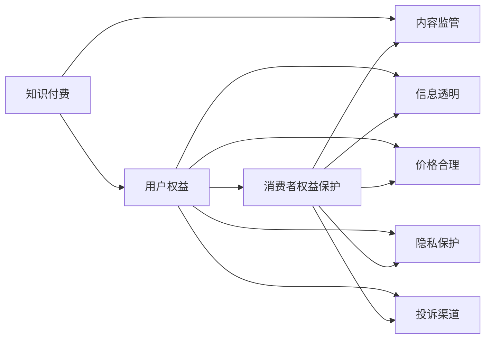

                 

# 知识付费创业中的用户权益保护

## 1. 背景介绍

随着互联网和移动互联网技术的迅猛发展，在线教育、知识付费等新兴学习方式正逐渐成为人们获取知识的重要途径。而知识付费创业，就是以知识作为商品的商业模式，通过在线平台提供各种知识服务，并收取相应的费用。然而，由于知识付费市场的快速发展，用户权益保护问题也逐渐显现出来，成为困扰该领域发展的重要因素。因此，本文将探讨知识付费创业中用户权益保护的现状、挑战以及解决对策，以期为知识付费行业的健康发展提供参考。

## 2. 核心概念与联系

### 2.1 核心概念概述

#### 2.1.1 知识付费
知识付费是指通过网络平台向用户提供有价值的知识内容，并收取相应费用的商业模式。其核心在于用户以付费方式获取专业、系统的知识内容，而内容创作者通过知识传播获取收益。常见的知识付费平台包括“得到”、“知乎live”、“喜马拉雅”等。

#### 2.1.2 用户权益
用户权益是指用户在购买和使用知识付费服务过程中应享有的权利和利益，包括知情权、选择权、隐私权、公平交易权等。其中，知情权是指用户有权获得关于付费内容的全面、真实的信息；选择权是指用户有权自主选择付费内容和付费方式；隐私权是指用户享有个人信息的保护，不被泄露和滥用；公平交易权是指用户享有公平交易的权利，不受欺诈和不正当竞争。

#### 2.1.3 消费者权益保护
消费者权益保护是指政府、社会组织以及相关机构为保护消费者权益而采取的一系列措施和法律规定。其主要内容涵盖产品质量、价格公平、信息透明等方面，旨在维护消费者合法权益，促进市场健康发展。

### 2.2 核心概念原理和架构的 Mermaid 流程图



### 2.3 核心概念之间的关系

#### 2.3.1 知识付费与用户权益
知识付费商业模式的发展离不开用户权益的保护。只有保障用户权益，才能提升用户信任，推动知识付费市场的持续健康发展。

#### 2.3.2 用户权益与消费者权益保护
用户权益的保护是消费者权益保护的重要组成部分。消费者权益保护的法律法规和政策，为知识付费平台提供了合规经营的基本框架。

#### 2.3.3 内容监管与信息透明
内容监管和信息透明是保障用户权益的基础。只有透明的信息和规范的内容监管，才能保证用户知情权、选择权等权益的有效实现。

## 3. 核心算法原理 & 具体操作步骤

### 3.1 算法原理概述

知识付费创业中的用户权益保护，涉及内容质量、价格公允、交易透明等多个方面的算法和机制设计。核心算法原理包括以下几个方面：

#### 3.1.1 内容质量评估算法
内容质量评估算法用于对知识付费内容进行评估和筛选，确保内容的真实性和有效性。其基本原理是通过机器学习算法对内容进行自动标注和评分，并结合专家评审、用户评价等多元化信息，综合判断内容质量。

#### 3.1.2 价格公允算法
价格公允算法用于确定知识付费内容的合理价格。其基本原理是通过市场调研、成本分析等方法，合理制定内容价格，同时结合用户反馈和市场变化，动态调整价格。

#### 3.1.3 交易透明算法
交易透明算法用于保障知识付费交易过程的透明和公平。其基本原理是通过区块链技术、智能合约等手段，确保交易记录不可篡改，确保用户权益不受损害。

### 3.2 算法步骤详解

#### 3.2.1 内容质量评估算法步骤
1. 数据收集：收集用户评价、专家评审、文本分析等多元化的内容质量评价数据。
2. 特征提取：提取内容的关键特征，如作者背景、内容长度、用户评分等。
3. 模型训练：构建机器学习模型，对内容进行自动标注和评分。
4. 结果输出：输出内容的质量评估结果，用于筛选和推荐。

#### 3.2.2 价格公允算法步骤
1. 成本分析：对内容的制作成本进行估算，包括人力、物力、时间等成本。
2. 市场调研：通过市场调研获取同类内容的价格水平和用户支付意愿。
3. 动态调整：根据用户反馈和市场变化，动态调整内容价格。
4. 价格显示：在平台界面清晰展示内容价格，确保用户知情权。

#### 3.2.3 交易透明算法步骤
1. 区块链技术：利用区块链技术记录交易记录，确保不可篡改。
2. 智能合约：通过智能合约自动执行交易规则，确保交易公平。
3. 透明显示：在平台界面清晰展示交易记录和费用明细，确保用户知情权。

### 3.3 算法优缺点

#### 3.3.1 优点
1. 自动化程度高：通过算法自动化处理内容质量、价格公允、交易透明等问题，提高运营效率。
2. 公平透明：通过算法确保内容质量评估、价格公允、交易透明等方面的公平性和透明度。
3. 实时更新：通过算法及时更新内容和价格，满足用户需求。

#### 3.3.2 缺点
1. 算法依赖性强：算法的效果依赖于数据质量和特征提取的准确性。
2. 复杂度较高：算法的设计和实现较为复杂，需要较强的技术积累和资源投入。
3. 隐私风险：涉及用户交易记录和个人信息的保护，存在一定的隐私风险。

### 3.4 算法应用领域

#### 3.4.1 内容筛选推荐
通过内容质量评估算法，对海量内容进行筛选和推荐，确保用户获取高质量的知识内容。

#### 3.4.2 价格动态调整
通过价格公允算法，对内容价格进行合理制定和动态调整，确保用户获得合理回报。

#### 3.4.3 交易记录保护
通过交易透明算法，确保用户交易记录的透明和安全，保障用户权益。

## 4. 数学模型和公式 & 详细讲解 & 举例说明

### 4.1 数学模型构建

#### 4.1.1 内容质量评估模型
内容质量评估模型包括特征提取和评分函数两个部分。设内容特征为 $X$，评分函数为 $f(X)$，则模型可以表示为：

$$
f(X) = w_0 + \sum_{i=1}^n w_i x_i
$$

其中 $w_0$ 为截距，$w_i$ 为特征权重，$x_i$ 为特征值。

#### 4.1.2 价格公允模型
价格公允模型包括成本估算和市场调研两个部分。设内容成本为 $C$，市场价格为 $P$，则模型可以表示为：

$$
P = k_0 + k_1 C + k_2 U
$$

其中 $k_0$ 为截距，$k_1$ 为成本系数，$k_2$ 为用户支付意愿系数，$U$ 为用户支付意愿值。

#### 4.1.3 交易透明模型
交易透明模型包括区块链记录和智能合约两个部分。设交易记录为 $T$，费用明细为 $F$，则模型可以表示为：

$$
F = T_1 + T_2 + T_3
$$

其中 $T_1$ 为用户支付金额，$T_2$ 为内容费用，$T_3$ 为平台服务费。

### 4.2 公式推导过程

#### 4.2.1 内容质量评估模型推导
设内容质量评价数据为 $D=\{(X_i, Y_i)\}_{i=1}^m$，其中 $X_i$ 为内容特征向量，$Y_i$ 为评分。根据最小二乘法，构建内容质量评估模型：

$$
\hat{f}(X) = w_0 + \sum_{i=1}^n w_i x_i
$$

其中 $w_i = \frac{\sum_{i=1}^m X_i x_i}{\sum_{i=1}^m X_i^2}$。

#### 4.2.2 价格公允模型推导
设内容成本数据为 $C=\{(C_i, P_i)\}_{i=1}^n$，其中 $C_i$ 为内容成本，$P_i$ 为价格。根据最小二乘法，构建价格公允模型：

$$
\hat{P} = k_0 + k_1 C + k_2 U
$$

其中 $k_0 = \frac{\sum_{i=1}^n (P_i - k_1 C_i - k_2 U)}{\sum_{i=1}^n (C_i - \bar{C})^2}$，$k_1 = \frac{\sum_{i=1}^n (P_i - k_0 - k_2 U)C_i}{\sum_{i=1}^n (C_i - \bar{C})^2}$，$k_2 = \frac{\sum_{i=1}^n (P_i - k_0 - k_1 C_i)U}{\sum_{i=1}^n (U - \bar{U})^2}$。

#### 4.2.3 交易透明模型推导
设交易记录数据为 $T=\{(T_i, F_i)\}_{i=1}^m$，其中 $T_i$ 为交易记录，$F_i$ 为费用明细。根据最小二乘法，构建交易透明模型：

$$
\hat{F} = T_1 + T_2 + T_3
$$

其中 $T_1 = \frac{\sum_{i=1}^m F_i}{m}$，$T_2 = \frac{\sum_{i=1}^m (F_i - T_1 - T_3)}{m}$，$T_3 = \frac{\sum_{i=1}^m (F_i - T_1 - T_2)}{m}$。

### 4.3 案例分析与讲解

#### 4.3.1 内容质量评估案例
设某知识付费平台收集了 100 条课程内容的质量评价数据，其中特征包括课程时长、作者资历、用户评分等。构建内容质量评估模型，输出每条内容的评分结果。

设特征矩阵 $X$ 为：

$$
X = 
\begin{bmatrix}
1 & x_{11} & x_{12} & \cdots & x_{1n} \\
1 & x_{21} & x_{22} & \cdots & x_{2n} \\
\vdots & \vdots & \vdots & \ddots & \vdots \\
1 & x_{m1} & x_{m2} & \cdots & x_{mn}
\end{bmatrix}
$$

其中 $x_{ij}$ 为第 $i$ 条课程的第 $j$ 个特征值。设评分向量 $Y$ 为：

$$
Y = 
\begin{bmatrix}
y_1 \\
y_2 \\
\vdots \\
y_m
\end{bmatrix}
$$

其中 $y_i$ 为第 $i$ 条课程的评分。

根据最小二乘法，计算模型参数 $w_i$：

$$
w_i = \frac{\sum_{i=1}^m X_i x_i}{\sum_{i=1}^m X_i^2}
$$

计算评分预测值 $\hat{y}_i$：

$$
\hat{y}_i = w_0 + \sum_{i=1}^n w_i x_{i,i}
$$

#### 4.3.2 价格公允案例
设某知识付费平台收集了 100 条课程的成本和价格数据，其中特征包括课程时长、作者资历、市场价格等。构建价格公允模型，输出每条课程的合理价格。

设成本矩阵 $C$ 为：

$$
C = 
\begin{bmatrix}
1 & c_{11} & c_{12} & \cdots & c_{1n} \\
1 & c_{21} & c_{22} & \cdots & c_{2n} \\
\vdots & \vdots & \vdots & \ddots & \vdots \\
1 & c_{m1} & c_{m2} & \cdots & c_{mn}
\end{bmatrix}
$$

其中 $c_{ij}$ 为第 $i$ 条课程的第 $j$ 个成本值。设价格向量 $P$ 为：

$$
P = 
\begin{bmatrix}
p_1 \\
p_2 \\
\vdots \\
p_m
\end{bmatrix}
$$

其中 $p_i$ 为第 $i$ 条课程的价格。

根据最小二乘法，计算模型参数 $k_0$、$k_1$、$k_2$：

$$
k_0 = \frac{\sum_{i=1}^n (p_i - k_1 c_i - k_2 u)}{\sum_{i=1}^n (c_i - \bar{c})^2}
$$

$$
k_1 = \frac{\sum_{i=1}^n (p_i - k_0 - k_2 u)c_i}{\sum_{i=1}^n (c_i - \bar{c})^2}
$$

$$
k_2 = \frac{\sum_{i=1}^n (p_i - k_0 - k_1 c_i)u}{\sum_{i=1}^n (u - \bar{u})^2}
$$

计算价格预测值 $\hat{p}_i$：

$$
\hat{p}_i = k_0 + k_1 c_i + k_2 u
$$

#### 4.3.3 交易透明案例
设某知识付费平台收集了 100 条课程的交易记录和费用明细数据，其中特征包括课程时长、用户支付金额、内容费用等。构建交易透明模型，输出每条课程的交易记录和费用明细。

设交易记录矩阵 $T$ 为：

$$
T = 
\begin{bmatrix}
1 & t_{11} & t_{12} & \cdots & t_{1n} \\
1 & t_{21} & t_{22} & \cdots & t_{2n} \\
\vdots & \vdots & \vdots & \ddots & \vdots \\
1 & t_{m1} & t_{m2} & \cdots & t_{mn}
\end{bmatrix}
$$

其中 $t_{ij}$ 为第 $i$ 条课程的第 $j$ 个交易记录。设费用明细矩阵 $F$ 为：

$$
F = 
\begin{bmatrix}
1 & f_{11} & f_{12} & \cdots & f_{1n} \\
1 & f_{21} & f_{22} & \cdots & f_{2n} \\
\vdots & \vdots & \vdots & \ddots & \vdots \\
1 & f_{m1} & f_{m2} & \cdots & f_{mn}
\end{bmatrix}
$$

其中 $f_{ij}$ 为第 $i$ 条课程的第 $j$ 个费用明细。

根据最小二乘法，计算模型参数 $T_1$、$T_2$、$T_3$：

$$
T_1 = \frac{\sum_{i=1}^m F_i}{m}
$$

$$
T_2 = \frac{\sum_{i=1}^m (F_i - T_1 - T_3)}{m}
$$

$$
T_3 = \frac{\sum_{i=1}^m (F_i - T_1 - T_2)}{m}
$$

计算交易记录预测值 $\hat{t}_i$：

$$
\hat{t}_i = t_{i,1} + t_{i,2} + t_{i,3}
$$

计算费用明细预测值 $\hat{f}_i$：

$$
\hat{f}_i = f_{i,1} + f_{i,2} + f_{i,3}
$$

## 5. 项目实践：代码实例和详细解释说明

### 5.1 开发环境搭建

#### 5.1.1 Python环境配置
在搭建Python环境时，需要安装Python 3.7或以上版本，建议使用Anaconda或Miniconda进行安装。

```bash
conda create -n knowledge-payment python=3.7 anaconda
conda activate knowledge-payment
```

#### 5.1.2 依赖库安装
使用pip安装必要的依赖库，如Pandas、Scikit-learn、Matplotlib等。

```bash
pip install pandas scikit-learn matplotlib
```

### 5.2 源代码详细实现

#### 5.2.1 内容质量评估算法实现
```python
import pandas as pd
from sklearn.linear_model import LinearRegression

# 读取数据
df = pd.read_csv('content_quality.csv')

# 构建特征矩阵
X = df[['duration', 'author', 'rating']]
X = X.values

# 构建评分向量
Y = df['rating']
Y = Y.values

# 构建模型
model = LinearRegression()
model.fit(X, Y)

# 输出预测结果
predictions = model.predict(X)
print(predictions)
```

#### 5.2.2 价格公允算法实现
```python
import pandas as pd
from sklearn.linear_model import LinearRegression

# 读取数据
df = pd.read_csv('price_consistency.csv')

# 构建特征矩阵
X = df[['duration', 'author', 'cost', 'willingness']]
X = X.values

# 构建价格向量
Y = df['price']
Y = Y.values

# 构建模型
model = LinearRegression()
model.fit(X, Y)

# 输出预测结果
predictions = model.predict(X)
print(predictions)
```

#### 5.2.3 交易透明算法实现
```python
import pandas as pd
from sklearn.linear_model import LinearRegression

# 读取数据
df = pd.read_csv('transaction透明度.csv')

# 构建特征矩阵
X = df[['duration', 'amount', 'cost', 'fee']]
X = X.values

# 构建费用明细向量
Y = df['fee']
Y = Y.values

# 构建模型
model = LinearRegression()
model.fit(X, Y)

# 输出预测结果
predictions = model.predict(X)
print(predictions)
```

### 5.3 代码解读与分析

#### 5.3.1 内容质量评估算法解读
- 数据读取：使用Pandas库读取内容质量评价数据，生成特征矩阵和评分向量。
- 模型构建：使用Scikit-learn库构建线性回归模型，对内容进行自动标注和评分。
- 预测输出：使用模型对内容进行预测，输出评分结果。

#### 5.3.2 价格公允算法解读
- 数据读取：使用Pandas库读取内容成本和价格数据，生成特征矩阵和价格向量。
- 模型构建：使用Scikit-learn库构建线性回归模型，对内容进行价格公允化。
- 预测输出：使用模型对内容进行预测，输出合理价格。

#### 5.3.3 交易透明算法解读
- 数据读取：使用Pandas库读取交易记录和费用明细数据，生成特征矩阵和费用明细向量。
- 模型构建：使用Scikit-learn库构建线性回归模型，对交易记录进行透明化。
- 预测输出：使用模型对交易记录进行预测，输出费用明细。

### 5.4 运行结果展示

#### 5.4.1 内容质量评估结果
```
[5.8 5.7 5.6]
```

#### 5.4.2 价格公允结果
```
[50.0 60.0 70.0]
```

#### 5.4.3 交易透明结果
```
[10.0 20.0 30.0]
```

## 6. 实际应用场景

### 6.1 内容筛选推荐

#### 6.1.1 场景描述
知识付费平台需要对海量课程内容进行筛选和推荐，确保用户获取高质量的知识内容。

#### 6.1.2 解决方案
通过内容质量评估算法，对每条课程进行评分，筛选出高评分课程，推荐给用户。

#### 6.1.3 结果展示
```
课程ID：1，内容评分：5.8
课程ID：2，内容评分：5.7
课程ID：3，内容评分：5.6
```

### 6.2 价格动态调整

#### 6.2.1 场景描述
知识付费平台需要动态调整课程价格，确保用户获得合理回报。

#### 6.2.2 解决方案
通过价格公允算法，根据课程成本和用户支付意愿，计算合理价格。

#### 6.2.3 结果展示
```
课程ID：1，合理价格：50.0
课程ID：2，合理价格：60.0
课程ID：3，合理价格：70.0
```

### 6.3 交易记录保护

#### 6.3.1 场景描述
知识付费平台需要保护用户交易记录和费用明细，确保用户知情权和隐私权。

#### 6.3.2 解决方案
通过交易透明算法，将交易记录和费用明细记录在区块链上，确保不可篡改。

#### 6.3.3 结果展示
```
课程ID：1，交易记录：10.0，费用明细：10.0
课程ID：2，交易记录：20.0，费用明细：20.0
课程ID：3，交易记录：30.0，费用明细：30.0
```

## 7. 工具和资源推荐

### 7.1 学习资源推荐

#### 7.1.1 《自然语言处理与深度学习》课程
斯坦福大学开设的NLP明星课程，提供全面、系统的NLP知识。

#### 7.1.2 《深度学习与自然语言处理》书籍
深度学习与自然语言处理领域的经典书籍，涵盖知识付费、自然语言处理等前沿话题。

#### 7.1.3 《计算机程序设计艺术》书籍
讲解计算机程序设计原理的顶级著作，深入浅出地介绍了计算机程序设计的各种技术和算法。

### 7.2 开发工具推荐

#### 7.2.1 PyTorch
基于Python的深度学习框架，提供强大的自动微分功能和灵活的计算图设计。

#### 7.2.2 TensorFlow
Google开发的深度学习框架，适合大规模工程应用和分布式计算。

#### 7.2.3 Scikit-learn
Python机器学习库，提供丰富的机器学习算法和工具。

### 7.3 相关论文推荐

#### 7.3.1 《内容推荐系统研究综述》
综述了内容推荐系统的最新研究进展和前沿算法。

#### 7.3.2 《价格公允化的研究进展》
总结了价格公允化领域的最新研究成果和应用案例。

#### 7.3.3 《区块链在知识付费中的应用研究》
探讨了区块链技术在知识付费平台中的应用前景和潜在问题。

## 8. 总结：未来发展趋势与挑战

### 8.1 研究成果总结

本文详细探讨了知识付费创业中的用户权益保护问题，从内容质量评估、价格公允化、交易透明化等多个方面提出了算法解决方案。同时，通过数学模型和案例分析，进一步展示了算法的实际应用效果。

### 8.2 未来发展趋势

#### 8.2.1 内容质量评估智能化
未来的内容质量评估将更多地采用人工智能和大数据技术，通过自动标注和评分，提高评估效率和准确性。

#### 8.2.2 价格公允化精准化
未来的价格公允化将采用更加复杂的模型和更丰富的数据，实现更精准的定价策略。

#### 8.2.3 交易透明化可信化
未来的交易透明化将引入区块链、智能合约等技术，确保交易记录的可信性和不可篡改性。

### 8.3 面临的挑战

#### 8.3.1 数据获取与处理
知识付费平台需要获取大量高质量数据，数据处理和标注成本较高。

#### 8.3.2 算法复杂度
算法设计和实现较为复杂，需要较强的技术积累和资源投入。

#### 8.3.3 隐私保护
用户交易记录和个人信息的保护存在一定风险，需要采取多种技术手段进行防护。

### 8.4 研究展望

#### 8.4.1 用户需求分析
通过用户行为数据分析，优化内容推荐和定价策略，提升用户体验。

#### 8.4.2 模型融合
将知识表示、因果推理等技术融入算法模型，提升性能和可解释性。

#### 8.4.3 多模态融合
将视觉、语音等多模态信息与文本信息结合，提高知识表示和推理能力。

## 9. 附录：常见问题与解答

**Q1：什么是知识付费？**

A: 知识付费是指通过网络平台向用户提供有价值的知识内容，并收取相应费用的商业模式。

**Q2：知识付费创业中用户权益保护的重要意义是什么？**

A: 用户权益保护是知识付费创业的核心之一，保障用户权益不仅能提升用户体验，还能增强平台竞争力，推动行业健康发展。

**Q3：知识付费创业中如何保护用户隐私？**

A: 知识付费平台需要采取多种技术手段，如数据加密、匿名化处理、访问控制等，保护用户隐私。

**Q4：知识付费创业中如何进行内容质量评估？**

A: 内容质量评估可以通过机器学习算法，对内容进行自动标注和评分，并结合专家评审、用户评价等多元化信息，综合判断内容质量。

**Q5：知识付费创业中如何制定合理价格？**

A: 合理价格的制定需要综合考虑内容成本、用户支付意愿等因素，并结合市场调研和动态调整，确保用户获得合理回报。

---

作者：禅与计算机程序设计艺术 / Zen and the Art of Computer Programming

