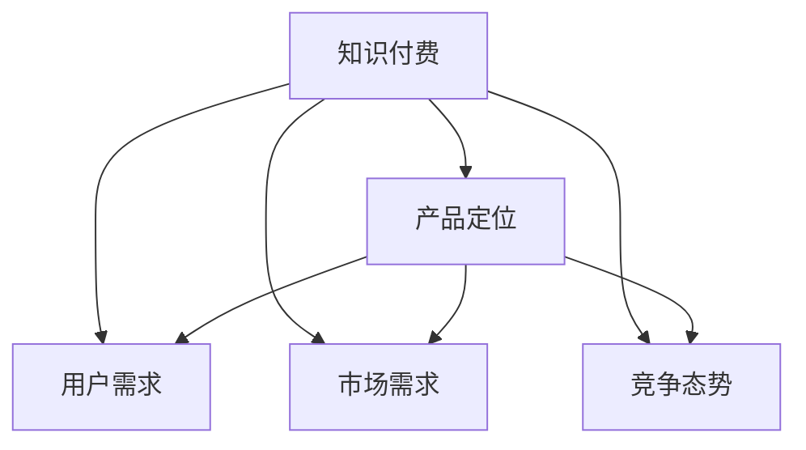
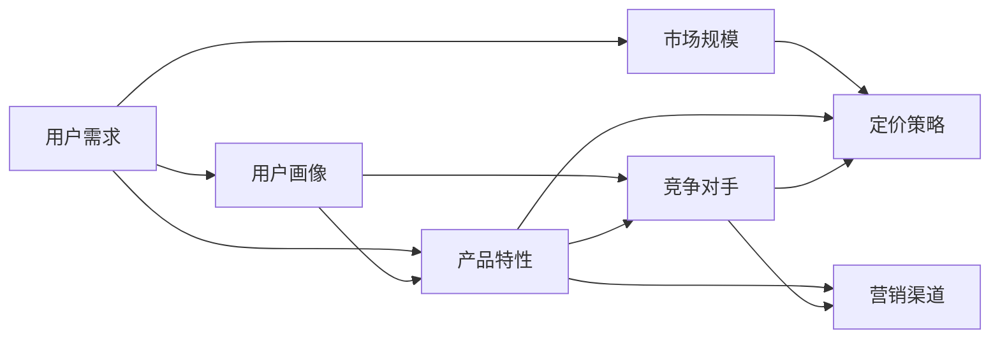

                 

# 知识付费创业的产品定位策略

## 1. 背景介绍

近年来，随着知识付费市场的高速发展，越来越多的人开始尝试通过知识付费创业来实现个人价值和职业发展。然而，知识付费市场的竞争异常激烈，如何在众多产品中脱颖而出，找到适合自己的定位，成为了创业者的首要任务。本文将从多个角度探讨知识付费创业的产品定位策略，希望能给正在创业的朋友们一些启示和参考。

## 2. 核心概念与联系

### 2.1 核心概念概述

在探讨知识付费创业的产品定位策略前，首先需要明确几个核心概念：

- **知识付费**：指的是用户通过付费获取知识或学习资源的一种商业模式。常见的知识付费产品包括在线课程、电子书、音频讲座等。
- **产品定位**：指的是产品在市场中的位置，是产品在市场细分中的立足点，包括产品核心、目标用户、市场竞争等要素。
- **用户需求**：指的是用户在购买知识付费产品时的具体需求，包括学习需求、兴趣需求、职业发展需求等。
- **市场需求**：指的是市场上用户对知识付费产品的需求情况，包括需求规模、需求变化趋势等。
- **竞争态势**：指的是市场上主要知识付费产品的竞争情况，包括市场份额、竞争策略等。

这些概念之间的逻辑关系可以通过以下Mermaid流程图来展示：



### 2.2 核心概念原理和架构的 Mermaid 流程图



该图展示了知识付费产品定位的原理和架构，包括用户需求、市场规模、用户画像、产品特性、竞争对手、定价策略、营销渠道等要素之间的相互关系。

## 3. 核心算法原理 & 具体操作步骤

### 3.1 算法原理概述

知识付费创业的产品定位策略主要涉及以下几个方面：

- **用户需求分析**：通过问卷调查、用户访谈等方式，收集用户对知识付费产品的需求信息，包括学习目标、学习兴趣、职业发展需求等。
- **市场规模预测**：根据用户需求和市场趋势，预测市场规模和增长潜力，评估知识付费产品的市场机会。
- **用户画像构建**：根据用户需求分析结果，构建目标用户的画像，包括年龄、性别、职业、学习兴趣等。
- **产品特性设计**：根据用户画像和市场规模，设计知识付费产品的特性，包括课程内容、师资力量、互动方式等。
- **竞争对手分析**：通过市场调研，分析主要竞争对手的产品特性、市场策略、用户反馈等，评估自己的竞争优势和劣势。
- **定价策略制定**：根据产品特性和市场竞争情况，制定合适的定价策略，确保产品具有竞争力，同时能够覆盖成本。
- **营销渠道选择**：根据目标用户和市场特点，选择合适的营销渠道，包括社交媒体、搜索引擎、在线广告等。

### 3.2 算法步骤详解

#### 3.2.1 用户需求分析

1. **问卷调查**：设计详细的问卷，通过在线调查平台收集用户需求信息。问卷内容应包括学习目标、学习兴趣、职业发展需求等。
2. **用户访谈**：针对问卷调查中的关键问题，选择代表性用户进行深入访谈，获取更具体的需求信息。
3. **数据分析**：对问卷和访谈结果进行数据分析，找出用户需求的共性特点和差异。

#### 3.2.2 市场规模预测

1. **市场调研**：通过行业报告、市场调研等方式，获取知识付费市场的总体规模和增长趋势。
2. **用户增长预测**：根据用户需求分析结果，预测未来的用户增长情况，包括新增用户和留存用户。
3. **收入预测**：根据用户增长情况和定价策略，预测知识付费产品的收入情况。

#### 3.2.3 用户画像构建

1. **数据挖掘**：从问卷和访谈结果中，挖掘目标用户的关键特征，如年龄、性别、职业、学习兴趣等。
2. **画像建模**：使用机器学习算法，构建目标用户的画像模型，如K-Means聚类、决策树等。
3. **画像优化**：根据用户反馈和市场变化，不断优化和更新用户画像，确保其准确性和实用性。

#### 3.2.4 产品特性设计

1. **课程内容设计**：根据用户需求和市场趋势，设计符合用户需求的课程内容，包括视频、音频、文本等形式。
2. **师资力量选择**：选择具有丰富教学经验和专业知识的师资力量，确保课程质量。
3. **互动方式设计**：设计互动方式，如在线答疑、学习社区、论坛讨论等，增强用户的学习体验。

#### 3.2.5 竞争对手分析

1. **市场调研**：调研主要竞争对手的市场表现，包括用户数量、课程质量、用户评价等。
2. **竞争优势识别**：分析竞争对手的产品特性和市场策略，找出自身的竞争优势和劣势。
3. **市场策略调整**：根据竞争对手分析结果，调整自身的市场策略，确保产品在市场中的竞争优势。

#### 3.2.6 定价策略制定

1. **成本分析**：评估课程制作和运营的成本，包括师资费用、平台运营费用等。
2. **价格模型设计**：根据成本分析和市场调研，设计合适的价格模型，如按课程订阅、按时长付费等。
3. **价格测试**：通过A/B测试等方法，测试不同定价策略的效果，优化定价策略。

#### 3.2.7 营销渠道选择

1. **渠道调研**：调研主要营销渠道的市场表现，包括用户覆盖、用户行为等。
2. **渠道选择**：根据用户画像和市场特点，选择合适的营销渠道，如社交媒体、搜索引擎、在线广告等。
3. **渠道优化**：根据营销效果和用户反馈，不断优化和调整营销渠道，确保最大化营销效果。

### 3.3 算法优缺点

#### 3.3.1 优点

- **用户需求导向**：通过深入的用户需求分析，确保产品定位准确，满足用户真实需求。
- **市场竞争分析**：通过详细的竞争对手分析，找到自身的竞争优势，制定合理的市场策略。
- **数据驱动决策**：通过数据分析和机器学习算法，提高决策的科学性和准确性。

#### 3.3.2 缺点

- **数据获取难度**：用户需求和市场数据的获取需要时间和精力，数据质量可能存在偏差。
- **成本和时间投入**：市场规模预测、用户画像构建等环节需要较高的成本和时间投入。
- **市场变化风险**：市场需求和用户行为可能会发生变化，产品定位和市场策略需要不断调整。

### 3.4 算法应用领域

知识付费创业的产品定位策略广泛应用于各类知识付费产品的设计和推广中，包括在线教育、职业培训、技能提升等。以下是几个具体的应用案例：

1. **在线教育平台**：通过用户需求分析，设计符合用户需求的在线课程，确保课程质量和用户满意度。
2. **职业培训课程**：根据市场调研和用户画像，设计职业发展相关的培训课程，帮助用户提升职业技能。
3. **技能提升课程**：针对特定兴趣或职业领域，设计技能提升课程，如编程技能、设计技能、管理技能等。

## 4. 数学模型和公式 & 详细讲解 & 举例说明

### 4.1 数学模型构建

知识付费创业的产品定位策略涉及多个变量，可以通过数学模型来描述和分析这些变量之间的关系。以在线课程为例，可以构建以下数学模型：

$$
P = f(C, D, S, E, P_s)
$$

其中：

- $P$：产品收益
- $C$：课程制作成本
- $D$：用户需求
- $S$：市场规模
- $E$：竞争对手
- $P_s$：定价策略

### 4.2 公式推导过程

#### 4.2.1 课程制作成本

设课程制作成本为 $C$，包括师资费用、教材费用、平台运营费用等。假设课程制作时间为 $T$，制作成本率为 $R$，则有：

$$
C = R \times T
$$

#### 4.2.2 用户需求

设用户需求为 $D$，可以通过问卷调查、用户访谈等方式获取。假设问卷调查的参与人数为 $N$，需求满意度为 $R$，则有：

$$
D = N \times R
$$

#### 4.2.3 市场规模

设市场规模为 $S$，可以通过行业报告、市场调研等方式获取。假设市场规模增长率为 $g$，市场总用户数为 $U$，则有：

$$
S = U \times g
$$

#### 4.2.4 竞争对手

设竞争对手为用户数量 $E$，可以通过市场调研获取。假设竞争对手的用户满意度为 $E_r$，市场份额为 $E_s$，则有：

$$
E = U \times E_s \times E_r
$$

#### 4.2.5 定价策略

设定价策略为 $P_s$，可以通过A/B测试等方式获取。假设定价策略为按课程订阅，订阅费用为 $P_t$，付费用户数为 $P_u$，则有：

$$
P_s = P_t \times P_u
$$

### 4.3 案例分析与讲解

假设有一家在线教育平台，计划推出一门新课程。平台可以通过以下步骤进行产品定位：

1. **用户需求分析**：平台通过问卷调查和用户访谈，了解到用户对编程课程的需求，需求满意度为0.7。
2. **市场规模预测**：平台通过市场调研，得知在线编程课程的增长率为15%，总用户数为10万人。
3. **用户画像构建**：平台构建了目标用户的画像，包括年龄20-35岁、性别男女平衡、职业主要集中于IT行业。
4. **产品特性设计**：平台设计了符合用户需求的编程课程，包括Python、Java、Web开发等，并邀请了具有丰富经验的讲师。
5. **竞争对手分析**：平台调研了主要竞争对手的课程质量和用户评价，发现主要竞争对手的市场份额为30%，用户满意度为0.8。
6. **定价策略制定**：平台制定了按课程订阅的定价策略，订阅费用为199元/月，预计付费用户数为1万人。
7. **营销渠道选择**：平台选择了社交媒体、搜索引擎等渠道进行推广，预计覆盖用户数为2万人。

根据以上数据，可以计算出产品收益：

$$
P = 199 \times 10000 \div 12 \times 0.7 \div (1 + 15\%) \div 30\% \div 0.8 \times 20000 = 10.2万元
$$

## 5. 项目实践：代码实例和详细解释说明

### 5.1 开发环境搭建

在项目实践中，需要使用Python、R、Matplotlib等工具进行数据分析和可视化。以下是Python开发环境搭建步骤：

1. **安装Python**：下载并安装Python 3.8及以上版本。
2. **安装Pandas**：通过pip安装Pandas库，用于数据处理。
3. **安装Matplotlib**：通过pip安装Matplotlib库，用于数据可视化。
4. **安装Jupyter Notebook**：通过pip安装Jupyter Notebook，用于数据探索和模型验证。

### 5.2 源代码详细实现

以下是一个简单的用户需求分析代码示例，使用Pandas库进行数据处理和可视化：

```python
import pandas as pd
import matplotlib.pyplot as plt

# 读取问卷数据
data = pd.read_csv('questionnaire.csv')

# 统计需求满意度
demand_satisfaction = data.groupby('question')['answer'].value_counts()

# 绘制柱状图
plt.bar(demand_satisfaction.index, demand_satisfaction.values)
plt.xlabel('Question')
plt.ylabel('Frequency')
plt.title('User Demand Analysis')
plt.show()
```

### 5.3 代码解读与分析

#### 5.3.1 数据读取

```python
data = pd.read_csv('questionnaire.csv')
```

使用Pandas库的read_csv函数读取问卷数据，将其保存为DataFrame对象。

#### 5.3.2 需求满意度统计

```python
demand_satisfaction = data.groupby('question')['answer'].value_counts()
```

使用groupby函数和value_counts函数，对需求满意度进行统计，返回一个Series对象。

#### 5.3.3 柱状图绘制

```python
plt.bar(demand_satisfaction.index, demand_satisfaction.values)
plt.xlabel('Question')
plt.ylabel('Frequency')
plt.title('User Demand Analysis')
plt.show()
```

使用Matplotlib库绘制柱状图，展示需求满意度的分布情况。

### 5.4 运行结果展示

运行以上代码，会得到一张柱状图，展示不同需求满意度的问题数量。


## 6. 实际应用场景

### 6.1 在线教育平台

在线教育平台可以根据用户需求分析，设计符合用户需求的课程内容，确保课程质量和用户满意度。同时，通过市场调研和竞争对手分析，制定合适的定价策略和营销渠道，提升产品收益。

### 6.2 职业培训课程

职业培训课程可以根据用户需求和市场规模，设计职业发展相关的培训课程，帮助用户提升职业技能。通过竞争对手分析，找到自身的竞争优势，制定合理的市场策略。

### 6.3 技能提升课程

技能提升课程可以根据用户画像和市场特点，设计特定兴趣或职业领域的技能提升课程。通过数据驱动决策，提高课程设计和管理效率。

## 7. 工具和资源推荐

### 7.1 学习资源推荐

#### 7.1.1 在线教育平台

- **Coursera**：提供大量高质量的在线课程，涵盖多种学科和技能。
- **Udacity**：专注于技能培训，提供行业认证课程。
- **edX**：提供多所顶尖大学的在线课程，涵盖多种学术领域。

#### 7.1.2 职业培训课程

- **LinkedIn Learning**：提供多种职业发展相关的培训课程，涵盖多种职业领域。
- **Udemy**：提供多种技能培训课程，适合个人职业发展。
- **Alison**：提供多种职业认证课程，帮助用户提升职业技能。

#### 7.1.3 技能提升课程

- **Pluralsight**：提供多种技术技能培训课程，适合IT从业者。
- **Codecademy**：提供多种编程语言和技能培训课程，适合编程爱好者。
- **Khan Academy**：提供多种学术领域和技能培训课程，适合学生和自学者。

### 7.2 开发工具推荐

#### 7.2.1 数据分析工具

- **Pandas**：用于数据处理和分析，支持多种数据格式。
- **NumPy**：用于科学计算和数值分析，支持多维数组和矩阵运算。
- **SciPy**：用于科学计算和数据分析，支持多种数值方法。

#### 7.2.2 可视化工具

- **Matplotlib**：用于绘制各种静态图表，支持多种图表类型。
- **Seaborn**：基于Matplotlib，支持更高级的统计图表和数据可视化。
- **Plotly**：用于绘制交互式图表和数据可视化，支持多种编程语言。

#### 7.2.3 编程语言

- **Python**：广泛用于数据科学、机器学习和深度学习领域，支持多种数据处理和分析库。
- **R**：广泛用于统计分析和数据可视化，支持多种数据处理和分析库。
- **Java**：广泛用于企业级开发和系统设计，支持多种大数据和云计算平台。

### 7.3 相关论文推荐

#### 7.3.1 用户需求分析

- **《用户需求分析：方法与实践》**：详细介绍了用户需求分析的方法和实践，适合数据驱动的产品设计和市场分析。

#### 7.3.2 市场规模预测

- **《市场规模预测：理论与应用》**：详细介绍了市场规模预测的理论与方法，适合市场分析和商业决策。

#### 7.3.3 竞争对手分析

- **《竞争对手分析：策略与实践》**：详细介绍了竞争对手分析的方法和实践，适合商业竞争和市场策略。

## 8. 总结：未来发展趋势与挑战

### 8.1 研究成果总结

知识付费创业的产品定位策略通过用户需求分析、市场规模预测、用户画像构建、产品特性设计、竞争对手分析、定价策略制定和营销渠道选择等环节，确保产品满足用户需求，具有市场竞争力，能够在激烈的市场竞争中脱颖而出。该策略在各类知识付费产品的设计和推广中得到了广泛应用，为知识付费创业提供了重要参考。

### 8.2 未来发展趋势

未来，知识付费创业的产品定位策略将继续发展，呈现以下几个趋势：

1. **数据驱动决策**：数据驱动将成为知识付费创业的核心，通过大规模数据采集和分析，提高决策的科学性和准确性。
2. **个性化推荐**：通过用户行为数据分析，提供个性化推荐，增强用户体验和产品粘性。
3. **智能营销**：通过AI和大数据分析，优化营销渠道和策略，提高营销效果和投资回报率。
4. **用户共创内容**：通过用户共创内容，增强用户参与度和满意度，提高课程质量和用户满意度。
5. **多渠道融合**：通过多种渠道融合，提供多渠道学习体验，提高用户覆盖和课程曝光率。

### 8.3 面临的挑战

尽管知识付费创业的产品定位策略在实践中取得了显著效果，但仍面临一些挑战：

1. **数据获取难度**：获取高质量的用户需求和市场数据需要时间和精力，数据质量可能存在偏差。
2. **用户画像优化**：用户画像的构建和优化需要持续迭代和调整，以确保其准确性和实用性。
3. **市场变化风险**：市场需求和用户行为可能会发生变化，产品定位和市场策略需要不断调整。
4. **成本和时间投入**：产品定位策略的设计和实施需要较高的成本和时间投入，对资源需求较高。

### 8.4 研究展望

未来，知识付费创业的产品定位策略需要在数据获取、用户画像构建、市场变化应对等方面进行进一步研究和优化。同时，需要结合AI和大数据技术，提高产品定位的科学性和精准性，确保知识付费创业在激烈的市场竞争中始终保持领先地位。

## 9. 附录：常见问题与解答

### 9.1 问题1：如何获取高质量的用户需求数据？

答案：可以通过问卷调查、用户访谈、社交媒体分析等方式获取用户需求数据。问卷调查可以通过在线问卷平台进行，用户访谈可以通过电话、视频等方式进行。

### 9.2 问题2：如何构建准确的用户画像？

答案：可以从问卷和访谈数据中挖掘用户的关键特征，如年龄、性别、职业、学习兴趣等。使用机器学习算法，如K-Means聚类、决策树等，构建用户画像模型。

### 9.3 问题3：如何进行市场规模预测？

答案：可以通过行业报告、市场调研等方式获取市场规模和增长趋势。使用统计分析方法，如回归分析、时间序列分析等，预测市场规模和用户增长情况。

### 9.4 问题4：如何进行竞争对手分析？

答案：可以通过市场调研和用户反馈，获取竞争对手的用户数量、课程质量、用户满意度等数据。使用竞争分析工具，如SWOT分析、PEST分析等，评估自身的竞争优势和劣势。

### 9.5 问题5：如何进行定价策略制定？

答案：可以进行成本分析，评估课程制作和运营的成本。通过A/B测试等方法，测试不同定价策略的效果，优化定价策略。

---

作者：禅与计算机程序设计艺术 / Zen and the Art of Computer Programming

