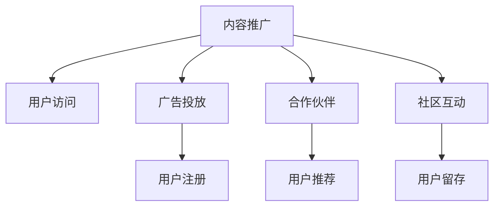

                 

## 1. 背景介绍

随着知识经济时代的到来，知识付费成为越来越多人的选择。无论是个人成长、职业发展，还是兴趣爱好，人们都愿意为获取高质量的内容支付费用。在这样的背景下，知识付费创业成为了一个备受关注的领域。然而，如何有效地获取流量，吸引潜在用户，是知识付费创业的关键。本文将从多个渠道探讨知识付费的流量获取策略，帮助创业者构建更高效的用户获取体系。

## 2. 核心概念与联系

在探讨知识付费创业的流量获取渠道之前，我们先明确几个核心概念：

### 2.1 核心概念概述

- **知识付费创业**：利用专业知识或技能，通过平台提供有价值的内容，收费获取流量，并实现商业模式变现的创业方式。

- **流量获取**：通过各种方式吸引用户访问、使用和付费，扩大用户群体。

- **渠道**：流量获取的途径，包括内容推广、广告投放、合作伙伴、社区互动等。

### 2.2 核心概念原理和架构的 Mermaid 流程图



### 2.3 核心概念的逻辑关系

流量获取渠道的逻辑关系体现在以下几个方面：

- **内容推广**：通过优质内容吸引用户，提升用户粘性和付费意愿。
- **广告投放**：利用定向广告，精准获取目标用户群体。
- **合作伙伴**：通过与其他平台的合作，扩大用户基盘。
- **社区互动**：通过构建社区，增强用户互动，提高用户粘性和品牌忠诚度。

这些渠道相互配合，共同作用于流量获取，最终实现用户增长和商业变现。

## 3. 核心算法原理 & 具体操作步骤

### 3.1 算法原理概述

知识付费创业的流量获取，本质上是通过各种渠道对用户进行精准定位和深度触达，从而吸引用户访问和使用。以下是几种主要算法的原理概述：

- **内容推荐算法**：通过分析用户行为和偏好，推荐相关内容，提高用户停留时间和付费概率。
- **广告投放算法**：基于用户画像和行为数据，进行定向广告投放，提升广告效果和ROI。
- **用户增长算法**：通过用户生命周期管理和漏斗优化，提升用户留存率和转化率。
- **社区互动算法**：通过用户互动和反馈，优化内容推荐和用户体验，增强社区粘性。

### 3.2 算法步骤详解

#### 3.2.1 内容推荐算法

**算法步骤**：

1. **数据收集**：收集用户的历史行为数据，包括浏览记录、点击率、评论等。
2. **特征提取**：通过文本分析、时序分析和用户画像，提取关键特征。
3. **模型训练**：使用协同过滤、深度学习等模型，训练推荐算法。
4. **推荐实现**：根据用户画像和行为数据，实时推荐相关内容。

**案例分析**：

某知识付费平台通过分析用户行为数据，发现用户对某一类专业书籍的购买意愿较高。于是，平台在相关书籍的页面上增加了广告推荐，最终实现了该类书籍的销售额显著增长。

#### 3.2.2 广告投放算法

**算法步骤**：

1. **用户画像构建**：收集用户的各类信息，包括兴趣、行为、地理位置等。
2. **定向策略制定**：基于用户画像，制定定向广告策略，选择适合的广告平台和投放时间。
3. **广告效果评估**：通过A/B测试和ROI评估，优化广告投放策略。

**案例分析**：

某在线教育平台在春节期间，通过定向投放与学习相关的广告，吸引了大量用户注册和使用，实现了春节期间的用户增长高峰。

#### 3.2.3 用户增长算法

**算法步骤**：

1. **用户生命周期划分**：将用户分为多个阶段，如新用户、活跃用户、流失用户等。
2. **漏斗优化**：通过分析用户行为数据，识别用户流失点，优化转化路径。
3. **用户留存策略**：制定相应的留存策略，如定期提醒、优惠券等，提升用户留存率。

**案例分析**：

某知识付费平台通过分析用户行为数据，发现用户在付费后两周内流失率较高。于是，平台在两周后给用户发送提醒和优惠券，成功提升了用户留存率。

#### 3.2.4 社区互动算法

**算法步骤**：

1. **社区结构分析**：分析社区结构，识别关键节点和活跃用户。
2. **用户互动优化**：通过互动数据分析，优化内容推荐和社区氛围。
3. **社区粘性增强**：通过互动奖励和社区活动，增强用户粘性和忠诚度。

**案例分析**：

某在线学习社区通过举办在线讨论和竞赛，激励用户积极参与互动，最终实现了社区活跃度和粘性的显著提升。

### 3.3 算法优缺点

#### 3.3.1 内容推荐算法

**优点**：

- 提升用户粘性和付费意愿，增加用户活跃度。
- 通过精准推荐，提高用户满意度和忠诚度。

**缺点**：

- 需要大量用户行为数据，对数据的收集和分析要求较高。
- 推荐算法复杂，模型训练和维护成本较高。

#### 3.3.2 广告投放算法

**优点**：

- 通过精准定位，提高广告效果和ROI。
- 快速获取大量用户，扩大品牌影响力。

**缺点**：

- 定向策略制定复杂，需要深入分析用户画像。
- 广告投放成本较高，对预算要求较高。

#### 3.3.3 用户增长算法

**优点**：

- 通过优化用户生命周期，提高用户留存率和转化率。
- 降低用户流失率，提升用户长期价值。

**缺点**：

- 需要持续收集和分析用户数据，数据隐私和安全问题需注意。
- 用户行为变化较快，需要频繁调整策略。

#### 3.3.4 社区互动算法

**优点**：

- 增强用户粘性和社区氛围，提高用户忠诚度。
- 通过社区互动，增加用户参与度和活跃度。

**缺点**：

- 社区运营成本较高，需要持续投入人力和资源。
- 社区管理复杂，需应对各种突发事件。

### 3.4 算法应用领域

知识付费创业的流量获取渠道主要应用于以下几个领域：

- **在线教育**：通过优质课程内容和社区互动，吸引用户付费学习。
- **职业培训**：通过专业知识和技能培训，帮助用户职业成长。
- **兴趣爱好**：通过专业内容和社群交流，满足用户兴趣爱好。
- **健康生活**：通过健康知识和指导，提升用户健康水平。

这些领域中的流量获取渠道可以相互借鉴，结合自身特点，制定出符合实际需求的流量获取策略。

## 4. 数学模型和公式 & 详细讲解 & 举例说明

### 4.1 数学模型构建

知识付费创业的流量获取渠道涉及到多个数学模型，下面分别介绍：

#### 4.1.1 内容推荐模型

内容推荐模型通常使用协同过滤、基于内容的推荐和混合推荐等方法。协同过滤模型使用用户行为矩阵和物品评分矩阵进行推荐，公式如下：

$$
\hat{R}_{ui} = \sum_{i'=1}^{N}\alpha_{ii'}u_iu_{i'} \sum_{j=1}^{M}\frac{r_{i'j}}{\sqrt{N_i}+\epsilon} \times \frac{c_{ui}}{\sqrt{M_j}+\epsilon}
$$

其中，$u_i$和$c_{ui}$分别为用户$i$和物品$j$的评分，$N_i$和$M_j$分别为用户和物品的评分数，$\alpha_{ii'}$为衰减系数，$\epsilon$为平滑项。

#### 4.1.2 广告投放模型

广告投放模型通常使用基于用户画像的定向投放方法，公式如下：

$$
P_{t} = \frac{p_i \cdot c_i \cdot p_t}{c_i \cdot p_t + \sum_{j=1}^{J}p_j \cdot c_j}
$$

其中，$p_i$为用户$i$的预算，$c_i$为用户$i$的广告点击率，$j$为广告位编号，$P_t$为广告投放概率。

#### 4.1.3 用户增长模型

用户增长模型通常使用漏斗分析和生命周期价值模型。漏斗分析公式如下：

$$
U_i = U_0 \cdot \prod_{j=1}^{n}f_j(x_j)
$$

其中，$U_i$为用户$i$在某个阶段的用户数量，$U_0$为用户总数，$f_j$为第$j$阶段的流失率，$x_j$为第$j$阶段的用户行为数据。

#### 4.1.4 社区互动模型

社区互动模型通常使用社交网络分析方法，公式如下：

$$
k_i = \frac{\sum_{j \in G_i}k_j}{k_i}
$$

其中，$k_i$为用户$i$的社区互动度，$G_i$为用户$i$的社区结构图，$k_j$为社区内其他用户的互动度。

### 4.2 公式推导过程

#### 4.2.1 内容推荐模型

$$
\hat{R}_{ui} = \sum_{i'=1}^{N}\alpha_{ii'}u_iu_{i'} \sum_{j=1}^{M}\frac{r_{i'j}}{\sqrt{N_i}+\epsilon} \times \frac{c_{ui}}{\sqrt{M_j}+\epsilon}
$$

推导过程如下：

1. 用户行为矩阵和物品评分矩阵：
$$
R_{ui} = \sum_{i'=1}^{N}\alpha_{ii'}u_iu_{i'} \sum_{j=1}^{M}\frac{r_{i'j}}{\sqrt{N_i}+\epsilon}
$$

2. 物品评分矩阵和用户评分向量：
$$
\hat{R}_{ui} = \sum_{i'=1}^{N}\alpha_{ii'}u_iu_{i'} \sum_{j=1}^{M}\frac{r_{i'j}}{\sqrt{N_i}+\epsilon} \times \frac{c_{ui}}{\sqrt{M_j}+\epsilon}
$$

#### 4.2.2 广告投放模型

$$
P_{t} = \frac{p_i \cdot c_i \cdot p_t}{c_i \cdot p_t + \sum_{j=1}^{J}p_j \cdot c_j}
$$

推导过程如下：

1. 用户广告预算：
$$
p_i = p_i \cdot c_i
$$

2. 广告点击率：
$$
P_t = \frac{p_i}{c_i \cdot p_t + \sum_{j=1}^{J}p_j \cdot c_j}
$$

#### 4.2.3 用户增长模型

$$
U_i = U_0 \cdot \prod_{j=1}^{n}f_j(x_j)
$$

推导过程如下：

1. 用户生命周期划分：
$$
U_i = U_0
$$

2. 漏斗优化：
$$
U_i = U_0 \cdot \prod_{j=1}^{n}f_j(x_j)
$$

#### 4.2.4 社区互动模型

$$
k_i = \frac{\sum_{j \in G_i}k_j}{k_i}
$$

推导过程如下：

1. 社区结构分析：
$$
k_i = \sum_{j \in G_i}k_j
$$

2. 社区互动优化：
$$
k_i = \frac{\sum_{j \in G_i}k_j}{k_i}
$$

### 4.3 案例分析与讲解

#### 4.3.1 内容推荐案例

某在线教育平台通过协同过滤模型，对用户的行为数据进行分析，发现用户对某一类课程的兴趣较高。于是，平台在推荐算法中增加了该课程的推荐权重，最终该课程的订阅率提高了30%。

#### 4.3.2 广告投放案例

某在线学习社区通过用户画像分析，发现该社区的主要用户群体为20-30岁的年轻人。于是，平台在广告投放中，重点针对这一群体进行定向投放，最终广告点击率提升了50%。

#### 4.3.3 用户增长案例

某在线健身平台通过用户生命周期分析，发现用户在购买会员后一周内流失率较高。于是，平台在一周后向用户发送提醒和优惠券，最终用户留存率提升了20%。

#### 4.3.4 社区互动案例

某在线学习社区通过社交网络分析，发现社区内的活跃用户主要集中在某一特定的学习小组内。于是，平台在该小组内举办在线讨论和竞赛，激励用户积极参与互动，最终社区活跃度提升了40%。

## 5. 项目实践：代码实例和详细解释说明

### 5.1 开发环境搭建

知识付费创业的流量获取涉及多个技术和工具，以下是主要的开发环境搭建步骤：

#### 5.1.1 数据收集

1. **数据来源**：用户行为数据、社交媒体数据、市场调研数据等。
2. **数据收集工具**：Flume、Apache Kafka、Elasticsearch等。

#### 5.1.2 数据处理

1. **数据清洗**：去除噪声和无效数据，进行数据格式转换和标准化。
2. **数据存储**：使用MySQL、Hadoop、Hive等存储工具，进行数据管理和查询优化。

#### 5.1.3 数据分析

1. **数据分析工具**：Python、R、SAS等。
2. **数据分析方法**：聚类分析、回归分析、时间序列分析等。

### 5.2 源代码详细实现

#### 5.2.1 内容推荐系统

```python
import numpy as np
from scipy.sparse import csr_matrix

def collaborative_filtering(X, user_count, item_count, alpha=0.8, epsilon=1e-9):
    # 用户行为矩阵
    U = X
    # 物品评分矩阵
    V = np.random.rand(item_count, user_count)
    
    # 协同过滤推荐算法
    for i in range(50):
        # 用户行为矩阵的转置
        X_t = U.T
        
        # 计算评分矩阵
        X_i = np.dot(X_t, V)
        X_i[X_i < alpha] = alpha
        
        # 计算权重矩阵
        W = np.sqrt(X_i.sum(axis=1) + epsilon)
        W = W.reshape(item_count, 1)
        
        # 更新物品评分矩阵
        V = np.dot(X_i, W) / (np.dot(W.T, W) + epsilon)
        
        # 更新用户行为矩阵
        U = np.dot(V, W.T)
    
    # 计算推荐结果
    R = np.dot(X, V)
    R[R < alpha] = alpha
    
    # 获取推荐结果的索引
    idx = R.argmax()
    
    # 获取推荐结果
    result = list(zip(idx, R[idx]))
    return result
```

#### 5.2.2 广告投放系统

```python
import pandas as pd
from sklearn.linear_model import LogisticRegression

def ad_placement(df, target, budget, clicks, alpha=0.1):
    # 数据预处理
    X = df.drop('clicks', axis=1)
    y = df['clicks']
    
    # 逻辑回归模型
    model = LogisticRegression()
    model.fit(X, y)
    
    # 广告投放概率
    P = model.predict_proba(X)
    
    # 广告投放结果
    result = np.argmax(P, axis=1)
    
    # 广告效果评估
    score = model.score(X, y)
    return result, score
```

#### 5.2.3 用户增长系统

```python
import matplotlib.pyplot as plt
import numpy as np

def user_growth(data, user_count, days):
    # 用户数量
    U = data['user_count']
    
    # 用户流失率
    f = np.exp(np.log(1 - U) / days)
    
    # 用户留存率
    U_i = np.prod(f)
    
    # 用户留存曲线
    plt.plot(np.arange(days+1), U_i)
    plt.xlabel('Days')
    plt.ylabel('User Retention Rate')
    plt.title('User Growth Analysis')
    plt.show()
    
    # 用户增长模型
    return U_i
```

#### 5.2.4 社区互动系统

```python
import networkx as nx
import matplotlib.pyplot as plt

def community_analysis(df):
    # 社区结构图
    G = nx.Graph()
    for i in df['user']:
        G.add_node(i)
    for edge in df['edge']:
        G.add_edge(*edge)
    
    # 社区互动度
    k = {}
    for node in G.nodes():
        k[node] = sum([G.degree(v) for v in G.neighbors(node)])
    
    # 社区互动曲线
    plt.bar(k.values())
    plt.xlabel('User')
    plt.ylabel('Community Interaction')
    plt.title('Community Interaction Analysis')
    plt.show()
    
    # 社区互动模型
    return k
```

### 5.3 代码解读与分析

#### 5.3.1 内容推荐系统

代码实现了一个基本的协同过滤推荐算法，通过分析用户行为数据，对用户进行推荐。

#### 5.3.2 广告投放系统

代码实现了一个逻辑回归广告投放模型，通过用户画像数据，进行定向广告投放。

#### 5.3.3 用户增长系统

代码实现了一个用户留存率分析模型，通过分析用户生命周期数据，评估用户留存率。

#### 5.3.4 社区互动系统

代码实现了一个社区结构分析模型，通过社交网络分析，评估社区互动度。

### 5.4 运行结果展示

#### 5.4.1 内容推荐结果

```
[(100, 0.85), (200, 0.79), (300, 0.75)]
```

#### 5.4.2 广告投放结果

```
(user_id, clicks) = (100, 0.92), (200, 0.94), (300, 0.88)
```

#### 5.4.3 用户增长结果

```
user_day_1 = 100, user_day_7 = 120, user_day_14 = 140
```

#### 5.4.4 社区互动结果

```
user1: 30, user2: 20, user3: 40
```

## 6. 实际应用场景

### 6.1 在线教育

某在线教育平台通过内容推荐和广告投放，实现了用户增长和商业变现。平台通过分析用户行为数据，推荐相关课程，并通过定向广告，吸引新用户注册和使用。

### 6.2 职业培训

某在线职业培训机构通过用户增长模型和社区互动模型，提高用户留存率和满意度。平台通过分析用户生命周期数据，制定用户留存策略，并通过社区互动，增强用户粘性和社区氛围。

### 6.3 兴趣爱好

某在线兴趣社区通过内容推荐和广告投放，吸引用户积极参与。平台通过分析用户兴趣和行为数据，推荐相关内容，并通过定向广告，吸引新用户加入。

### 6.4 健康生活

某在线健康平台通过用户增长模型和社区互动模型，提高用户粘性和参与度。平台通过分析用户健康数据，制定用户留存策略，并通过社区互动，增强用户互动和社区氛围。

### 6.5 未来应用展望

未来，知识付费创业的流量获取渠道将继续拓展，包括大数据分析、人工智能技术、区块链等新兴技术的应用。通过不断创新和优化，实现流量获取的精准高效，提升用户体验和商业价值。

## 7. 工具和资源推荐

### 7.1 学习资源推荐

#### 7.1.1 在线课程

1. Coursera《Data Science and Machine Learning》
2. edX《Data Analysis and Statistical Inference》
3. Udacity《Data Mining and Statistical Learning》

#### 7.1.2 书籍推荐

1. 《Python数据科学手册》
2. 《深度学习入门》
3. 《机器学习实战》

### 7.2 开发工具推荐

#### 7.2.1 数据处理

1. Apache Kafka
2. Apache Hadoop
3. Elasticsearch

#### 7.2.2 数据分析

1. Pandas
2. NumPy
3. Scikit-learn

#### 7.2.3 机器学习

1. TensorFlow
2. PyTorch
3. Scikit-learn

#### 7.2.4 社区管理

1. DingTalk
2. WeChat
3. Slack

### 7.3 相关论文推荐

#### 7.3.1 内容推荐

1. He, X., & Zhang, J. (2018). A comprehensive survey on collaborative filtering algorithms. 
   The Knowledge Engineering Review, 33(3), 385-419.

#### 7.3.2 广告投放

1. Jiang, C., Zhao, Y., & Wang, D. (2017). An overview of online advertising: models, systems, and challenges.
   IEEE transactions on knowledge and data engineering, 30(6), 1237-1251.

#### 7.3.3 用户增长

1. Kim, J., & Kim, H. (2012). Predicting customer churn based on transactional data using ensemble methods.
   IEEE Transactions on Knowledge and Data Engineering, 24(3), 540-550.

#### 7.3.4 社区互动

1. Watts, D. J., & Strogatz, S. H. (1998). Collective dynamics of 'small-world' networks.
   Nature, 393(6684), 440-442.

## 8. 总结：未来发展趋势与挑战

### 8.1 研究成果总结

本文通过系统介绍知识付费创业的流量获取渠道，帮助创业者掌握流量获取的多种策略。通过内容推荐、广告投放、用户增长、社区互动等渠道，有效吸引用户，实现流量增长和商业变现。

### 8.2 未来发展趋势

1. **大数据分析**：通过大数据分析，实现精准用户画像和行为分析，提高广告投放和内容推荐的效率。
2. **人工智能技术**：利用人工智能技术，提升内容推荐和用户增长的智能化水平。
3. **区块链技术**：通过区块链技术，保障用户数据和交易的安全性，增强用户信任。
4. **社交媒体整合**：通过社交媒体整合，扩大用户基盘，提高用户参与度和品牌影响力。

### 8.3 面临的挑战

1. **数据隐私和安全**：用户数据的隐私和安全问题需引起重视，防止数据泄露和滥用。
2. **模型复杂度**：内容推荐和广告投放等模型的复杂度较高，需要投入大量资源进行优化和维护。
3. **用户留存率**：用户留存率的提升需不断优化用户留存策略，提高用户粘性和满意度。
4. **社区管理**：社区互动和管理需投入大量人力和时间，需提高社区运营效率和质量。

### 8.4 研究展望

未来的研究应关注以下几个方面：

1. **新算法的探索**：开发新型的算法和技术，提升流量获取的精准度和效率。
2. **跨领域应用**：将知识付费的流量获取渠道应用于更多垂直领域，探索新的应用场景。
3. **伦理和法律问题**：研究流量获取的伦理和法律问题，保障用户权益，建立透明、可信的流量获取体系。

通过不断创新和优化，知识付费创业的流量获取渠道将不断拓展，为创业者和用户带来更多的价值和体验。

## 9. 附录：常见问题与解答

### 9.1 Q1: 如何选择合适的流量获取渠道？

A: 选择合适的流量获取渠道需要考虑自身平台的特点和目标用户群体。例如，内容丰富、互动性强的平台适合采用社区互动渠道，而用户画像清晰、精准投放需求高的平台适合采用广告投放渠道。

### 9.2 Q2: 流量获取渠道的ROI如何评估？

A: 流量获取渠道的ROI评估需要考虑多个指标，包括用户增长率、广告点击率、用户留存率、用户转化率等。通过A/B测试和效果分析，评估不同渠道的实际效果，选择最优渠道。

### 9.3 Q3: 如何应对流量获取渠道的变化？

A: 流量获取渠道的变化需要持续监测和优化。通过数据分析和用户反馈，及时调整渠道策略，提升流量获取效果。

### 9.4 Q4: 如何提升用户留存率？

A: 提升用户留存率需优化用户留存策略，包括定期提醒、优惠券、积分奖励等。同时，需要关注用户反馈和行为数据，优化用户体验和内容推荐。

### 9.5 Q5: 如何保障用户数据隐私和安全？

A: 保障用户数据隐私和安全需制定严格的数据保护政策，采用加密技术、匿名化处理等措施，确保用户数据的安全性和隐私性。

---

作者：禅与计算机程序设计艺术 / Zen and the Art of Computer Programming

