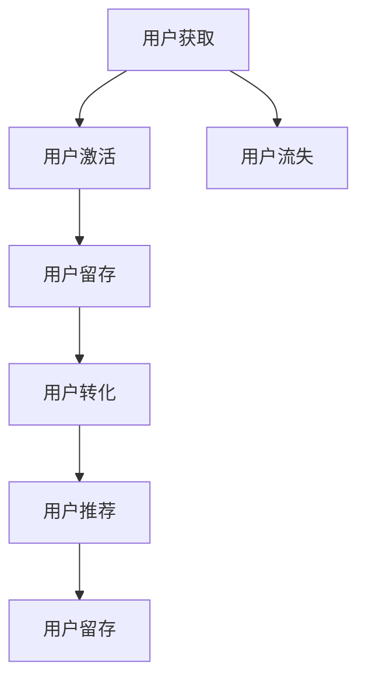

                 

# 知识付费创业的用户运营策略

## 1. 背景介绍

随着知识经济时代的到来，知识付费正成为一股不可逆转的潮流。用户对于高质量、专业化的内容需求日益增长，企业因此纷纷进入知识付费领域。如何在竞争激烈的市场中，有效运营用户，获取和留存用户，提升用户黏性，成为知识付费创业者必须深入思考的问题。本文旨在提供一套系统化、可操作的策略，助力知识付费创业企业在激烈的市场竞争中脱颖而出。

## 2. 核心概念与联系

### 2.1 核心概念概述

为了帮助读者更好地理解本文内容，下面将简要介绍几个核心概念：

- **用户运营**：指通过一系列策略和方法，对用户进行分析和引导，提升用户价值，增加用户活跃度和留存率，以实现企业目标的过程。
- **知识付费**：指用户通过付费方式获取知识、技能、信息等内容，以提升自身能力和竞争力的模式。
- **用户生命周期**：指用户从初次接触到最终流失的整个过程，包括获取、激活、留存、转化和流失等阶段。
- **AARRR模型**：指获取用户（Acquisition）、激活用户（Activation）、留存用户（Retention）、增加收入（Revenue）和推荐用户（Referral）五个阶段的模型，用于指导用户运营策略的制定。

### 2.2 核心概念原理和架构的 Mermaid 流程图



## 3. 核心算法原理 & 具体操作步骤

### 3.1 算法原理概述

用户运营的目的是通过一系列策略，不断提升用户价值，增加用户忠诚度，最终实现企业目标。知识付费创业企业的用户运营策略主要围绕以下几个方面展开：

- **用户获取**：通过营销推广，吸引潜在用户，增加新用户注册量。
- **用户激活**：通过优化产品体验，引导新用户完成初次使用行为，提升用户活跃度。
- **用户留存**：通过持续提供有价值的内容和服务，减少用户流失率，保持用户长期活跃。
- **用户转化**：通过引导用户进行付费行为，提升用户付费转化率，增加企业收益。
- **用户推荐**：通过激励用户进行口碑传播，扩大用户群体，提升品牌影响力。

### 3.2 算法步骤详解

以下将详细介绍知识付费创业企业用户运营的具体操作步骤：

#### 3.2.1 用户获取策略

- **多渠道推广**：通过搜索引擎优化（SEO）、社交媒体广告（SNS）、内容营销等手段，吸引潜在用户。
- **用户推荐计划**：通过用户邀请奖励机制，鼓励现有用户推荐新用户，提升获取效率。

#### 3.2.2 用户激活策略

- **初次体验优化**：设计简洁易用的界面，提供高质量的课程内容和良好的用户体验，吸引用户进行初次使用。
- **行为引导**：通过任务提示、奖励机制等方式，引导用户完成初次学习行为，如注册、课程试听等。

#### 3.2.3 用户留存策略

- **个性化推荐**：通过用户行为数据分析，提供个性化的课程推荐，提升用户满意度。
- **内容更新**：持续更新优质课程内容，保持用户对平台的兴趣和黏性。

#### 3.2.4 用户转化策略

- **课程优惠活动**：定期推出课程优惠活动，降低用户购买门槛，提升转化率。
- **会员制度**：提供会员专属内容和服务，提升用户粘性，增加长期付费意愿。

#### 3.2.5 用户推荐策略

- **积分奖励机制**：通过积分奖励，激励用户进行推荐，获取更多用户。
- **口碑传播渠道**：通过社交媒体、用户评论等渠道，增加品牌曝光度和用户信任感。

### 3.3 算法优缺点

#### 3.3.1 优点

- **高效获取用户**：通过多渠道推广和用户推荐计划，快速获取大量潜在用户。
- **提升用户价值**：通过个性化推荐和内容更新，持续提升用户满意度和忠诚度。
- **增加收入**：通过课程优惠活动和会员制度，提升用户付费转化率，增加企业收益。

#### 3.3.2 缺点

- **成本较高**：推广和用户推荐计划需要较高的营销预算和运营成本。
- **用户流失风险**：内容质量和用户体验不足可能导致用户流失，影响留存率和转化率。
- **数据隐私问题**：个性化推荐和行为分析需要收集大量用户数据，涉及用户隐私保护问题。

### 3.4 算法应用领域

知识付费创业企业的用户运营策略主要应用于以下领域：

- **在线教育平台**：如新东方、好未来、得到等。
- **知识付费应用**：如分答、喜马拉雅、蜻蜓FM等。
- **内容创作社区**：如知乎、微博、豆瓣等。

## 4. 数学模型和公式 & 详细讲解 & 举例说明

### 4.1 数学模型构建

在用户运营策略中，常用的数学模型包括用户生命周期模型、AARRR模型、用户流失模型等。以下以用户流失模型为例，介绍模型的构建和应用。

#### 4.1.1 用户流失模型

用户流失模型用于预测用户流失概率，通常包括：

- **用户流失率**：指在特定时间段内，流失用户数与总用户数之比。
- **流失用户特征**：指导致用户流失的关键特征，如使用频率、付费情况、课程完成度等。

#### 4.1.2 流失模型构建

- **数据准备**：收集用户行为数据，包括注册时间、使用频率、课程完成度、付费情况等。
- **特征工程**：对数据进行预处理和特征提取，选择合适的特征进行模型训练。
- **模型选择**：选择合适的算法（如逻辑回归、决策树、随机森林等）进行模型训练。
- **模型评估**：通过交叉验证等方法，评估模型性能，优化模型参数。

### 4.2 公式推导过程

#### 4.2.1 流失率公式

用户流失率计算公式如下：

$$
流失率 = \frac{流失用户数}{总用户数} \times 100\%
$$

#### 4.2.2 用户流失预测模型

假设用户流失模型为Logistic回归模型，其预测公式为：

$$
P(流失|特征) = \frac{1}{1 + e^{-\sum_{i=1}^n w_i \cdot 特征_i}}
$$

其中 $w_i$ 为特征权重，$特征_i$ 为第 $i$ 个特征。

### 4.3 案例分析与讲解

#### 4.3.1 案例背景

某在线教育平台，用户流失率较高，希望通过用户运营策略降低流失率，提升用户活跃度和转化率。

#### 4.3.2 数据准备

收集平台的用户行为数据，包括注册时间、使用频率、课程完成度、付费情况等。

#### 4.3.3 特征工程

对数据进行预处理，包括缺失值处理、特征编码、特征选择等。

#### 4.3.4 模型训练

使用Logistic回归模型进行训练，通过交叉验证优化模型参数。

#### 4.3.5 模型评估

在测试集上评估模型性能，通过ROC曲线等方法评估模型预测效果。

#### 4.3.6 结果应用

将模型应用到实时数据，实时预测用户流失概率，进行用户流失预警和干预。

## 5. 项目实践：代码实例和详细解释说明

### 5.1 开发环境搭建

在进行用户运营策略项目开发前，需要搭建好开发环境。以下是一个简单的Python开发环境搭建步骤：

1. **安装Python**：在Windows或Linux系统上安装Python 3.x版本，并进行环境配置。
2. **安装第三方库**：安装常用的Python第三方库，如Pandas、NumPy、Scikit-learn等。
3. **配置IDE**：安装Python IDE，如PyCharm、Jupyter Notebook等。

### 5.2 源代码详细实现

以下是一个用户流失预测的示例代码，展示了模型构建和评估的完整流程。

```python
import pandas as pd
from sklearn.model_selection import train_test_split
from sklearn.linear_model import LogisticRegression
from sklearn.metrics import roc_auc_score

# 数据准备
data = pd.read_csv('user流失数据.csv')
data['流失标签'] = 1 - data['活跃用户']  # 定义流失标签

# 特征工程
features = ['注册时间', '使用频率', '课程完成度', '付费情况']
X = data[features]
y = data['流失标签']

# 模型训练
X_train, X_test, y_train, y_test = train_test_split(X, y, test_size=0.2)
model = LogisticRegression()
model.fit(X_train, y_train)

# 模型评估
y_pred = model.predict_proba(X_test)[:, 1]
auc_score = roc_auc_score(y_test, y_pred)
print('AUC Score:', auc_score)
```

### 5.3 代码解读与分析

#### 5.3.1 数据准备

从CSV文件中读取用户流失数据，并定义流失标签。

#### 5.3.2 特征工程

选择用户行为数据中的关键特征，构建特征集合。

#### 5.3.3 模型训练

使用Logistic回归模型进行训练，使用训练集和测试集进行交叉验证。

#### 5.3.4 模型评估

计算模型在测试集上的AUC得分，评估模型预测效果。

### 5.4 运行结果展示

运行上述代码，输出AUC得分，展示了模型的预测效果。

## 6. 实际应用场景

### 6.1 在线教育平台

在线教育平台可以通过用户运营策略，提升课程购买率和用户留存率。具体措施包括：

- **个性化课程推荐**：通过分析用户历史行为，推荐符合其兴趣和需求的课程。
- **课程优惠活动**：定期推出限时优惠，降低用户购买门槛。
- **用户反馈机制**：建立用户反馈系统，及时调整课程内容和运营策略。

### 6.2 知识付费应用

知识付费应用可以通过用户运营策略，提升用户活跃度和付费转化率。具体措施包括：

- **内容多样性**：提供丰富多样的课程内容，满足不同用户的需求。
- **会员权益**：提供会员专属权益，提升用户粘性和付费意愿。
- **互动社区**：建立用户互动社区，增加用户参与度和忠诚度。

### 6.3 内容创作社区

内容创作社区可以通过用户运营策略，提升用户创作热情和平台活跃度。具体措施包括：

- **内容激励机制**：提供内容创作奖励，增加用户创作动力。
- **用户互动平台**：建立用户互动平台，增加用户互动和反馈。
- **社区文化建设**：建立社区文化，吸引更多优质内容创作者。

### 6.4 未来应用展望

未来，知识付费创业企业将在以下几个方面持续创新：

- **个性化推荐技术**：通过深度学习等技术，提升个性化推荐精准度。
- **用户行为分析**：利用大数据和人工智能技术，深入分析用户行为，优化运营策略。
- **用户情感分析**：通过情感分析技术，了解用户情感状态，提升用户体验。
- **智能客服系统**：建立智能客服系统，提升用户咨询体验和问题解决效率。

## 7. 工具和资源推荐

### 7.1 学习资源推荐

为了帮助知识付费创业者提升用户运营能力，以下是一些推荐的资源：

- **在线课程**：Coursera、Udemy等平台上的用户运营和数据科学课程，系统学习用户运营策略和数据分析方法。
- **书籍**：《增长黑客》、《数据驱动的产品》等书籍，深入理解用户增长和运营策略。
- **博客和社区**：Medium、Kaggle等平台上的用户运营和数据分析博客，获取最新的行业资讯和最佳实践。

### 7.2 开发工具推荐

在用户运营策略开发中，以下工具可以提高开发效率和优化效果：

- **Python**：Python编程语言，支持多种数据处理和机器学习库。
- **Pandas**：数据处理库，支持数据清洗、转换和分析。
- **Scikit-learn**：机器学习库，支持多种算法模型的训练和评估。
- **TensorFlow**：深度学习框架，支持神经网络模型的训练和部署。
- **Jupyter Notebook**：交互式开发环境，支持代码编辑和执行。

### 7.3 相关论文推荐

为了进一步了解用户运营策略和数据分析方法，以下是几篇推荐论文：

- **用户生命周期模型**：“User Lifetime Value Modeling and Prediction”。
- **AARRR模型**：“Acquisition, Activation, Retention, Revenue, Referral: A view of successful product launches”。
- **用户流失预测**：“Predicting Customer Churn: A Study of Customer Longevity”。

## 8. 总结：未来发展趋势与挑战

### 8.1 研究成果总结

本文通过系统介绍知识付费创业企业的用户运营策略，提供了从用户获取到流失预测的完整流程。以下是一些关键研究成果：

- **多渠道推广策略**：通过多渠道推广，快速获取大量用户。
- **个性化推荐技术**：通过个性化推荐，提升用户满意度和留存率。
- **流失预测模型**：通过流失预测模型，实时预警和干预用户流失。

### 8.2 未来发展趋势

未来，知识付费创业企业的用户运营策略将呈现以下几个发展趋势：

- **数据驱动**：通过大数据和人工智能技术，深入分析用户行为，优化运营策略。
- **个性化服务**：提供个性化推荐和服务，提升用户体验和满意度。
- **智能运营**：利用智能技术，自动化运营流程，提高效率和效果。
- **社交化运营**：建立用户社交化平台，增强用户互动和粘性。

### 8.3 面临的挑战

在用户运营策略实施过程中，以下挑战需要引起注意：

- **数据隐私问题**：在收集用户数据时，需要遵守数据隐私法律法规，保护用户隐私。
- **用户需求多样化**：用户需求多样化，需要不断优化内容和推荐算法。
- **技术实现复杂性**：个性化推荐和智能运营技术实现复杂，需要不断优化和迭代。
- **市场竞争激烈**：知识付费市场竞争激烈，需要不断创新和优化策略。

### 8.4 研究展望

未来，知识付费创业企业的用户运营策略需要在以下几个方面进行深入研究：

- **用户行为分析**：利用大数据和人工智能技术，深入分析用户行为，优化运营策略。
- **智能客服系统**：建立智能客服系统，提升用户咨询体验和问题解决效率。
- **社交化运营**：建立用户社交化平台，增强用户互动和粘性。
- **个性化推荐技术**：通过深度学习等技术，提升个性化推荐精准度。

## 9. 附录：常见问题与解答

### 9.1 常见问题解答

#### 9.1.1 问题1：如何有效推广知识付费产品？

**解答**：可以通过多渠道推广策略，如SEO、SNS、内容营销等，吸引潜在用户。同时，通过用户推荐计划，鼓励现有用户推荐新用户。

#### 9.1.2 问题2：如何提升用户留存率？

**解答**：可以通过个性化推荐和内容更新，提升用户满意度和忠诚度。建立会员制度，提供专属权益，增加长期付费意愿。

#### 9.1.3 问题3：如何提升用户转化率？

**解答**：可以通过课程优惠活动，降低用户购买门槛。提供优质课程内容，提升用户价值。

#### 9.1.4 问题4：如何应对用户流失？

**解答**：可以通过流失预测模型，实时预警和干预用户流失。建立用户反馈机制，及时调整课程内容和运营策略。

#### 9.1.5 问题5：如何保护用户隐私？

**解答**：在收集用户数据时，需要遵守数据隐私法律法规，保护用户隐私。同时，需要对用户数据进行加密和匿名化处理。

---

作者：禅与计算机程序设计艺术 / Zen and the Art of Computer Programming

