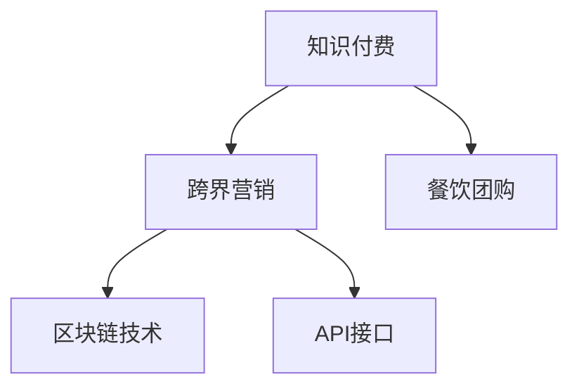

                 

# 知识付费如何实现跨界营销与餐饮团购跨界？

## 1. 背景介绍

### 1.1 问题由来

近年来，知识付费产业迅速崛起，成为互联网经济中一道亮丽的风景线。作为平台经济的一个新兴分支，知识付费通过内容创作者向用户提供有价值的知识、技能、经验等服务，收取相应费用，实现了知识资源的市场化运营。然而，在知识付费平台的内容创新和商业模式升级方面，还面临着许多挑战。

首先，用户粘性不高，内容供给质量参差不齐。这导致平台难以持续提升用户活跃度和留存率。其次，传统内容付费模式难以覆盖更广泛的用户群体，市场规模扩展受限。再者，用户订阅的可持续性不高，用户流失率高。为了解决这些痛点，知识付费平台亟需探索跨界营销与跨界合作的新模式。

### 1.2 问题核心关键点

本文聚焦于知识付费平台如何通过跨界营销和跨界合作，结合餐饮团购等实际场景，拓展业务边界，提升用户体验，优化商业模式。具体而言，我们将讨论以下核心问题：
- 如何利用用户画像和大数据技术，精准匹配知识内容与餐饮团购场景。
- 如何设计合理的合作激励机制，激发内容创作者的参与热情。
- 如何通过区块链技术确保跨界合作的公平性和透明度。
- 如何构建统一的API接口，实现知识付费与餐饮团购平台之间的无缝对接。

通过回答这些问题，我们希望为知识付费平台提供一种可行的跨界营销与跨界合作方案，助力其业务创新和用户增长。

## 2. 核心概念与联系

### 2.1 核心概念概述

为更好地理解跨界营销与跨界合作的概念，本节将介绍几个密切相关的核心概念：

- 知识付费：通过知识付费平台，内容创作者向用户提供高质量的内容服务，用户按需付费获取相应知识、技能、经验等。
- 跨界营销：通过跨界合作，在多个领域和场景中推广产品或服务，以实现资源共享、用户粘性提升和市场拓展。
- 餐饮团购：以在线方式团购各类餐饮服务，通过规模效应降低价格，提升用户消费体验。
- 区块链技术：一种分布式账本技术，用于记录和验证交易数据的真实性和不可篡改性，保障跨界合作的公平性和透明性。
- API接口：应用程序接口，用于实现不同系统之间数据的交换和调用，促进系统之间的无缝对接和信息共享。

这些核心概念之间的逻辑关系可以通过以下Mermaid流程图来展示：



这个流程图展示了大语言模型的核心概念及其之间的关系：

1. 知识付费通过跨界营销和跨界合作，可以实现业务模式的多元化和市场拓展。
2. 跨界营销可以借助区块链技术，确保合作的公平性和透明度。
3. API接口是实现跨界营销和跨界合作的基础设施，促进不同系统之间的数据交换和调用。

这些概念共同构成了知识付费跨界营销与跨界合作的基础框架，使得知识付费平台可以探索更多创新路径。

## 3. 核心算法原理 & 具体操作步骤
### 3.1 算法原理概述

基于跨界营销与跨界合作的算法原理，知识付费平台可以通过以下步骤实现跨界营销与餐饮团购的结合：

1. 利用用户画像和大数据技术，精准匹配知识内容与餐饮团购场景。
2. 设计合理的激励机制，激发内容创作者参与跨界合作。
3. 引入区块链技术，确保跨界合作的公平性和透明度。
4. 构建统一的API接口，实现知识付费与餐饮团购平台之间的无缝对接。

### 3.2 算法步骤详解

#### 3.2.1 用户画像构建与场景匹配

用户画像的构建是跨界营销和跨界合作的基础。知识付费平台需要收集用户的兴趣偏好、消费行为、社交网络等数据，构建详细精准的用户画像。通过数据分析技术，平台能够识别出哪些用户对特定餐饮团购场景有较高的兴趣。

具体算法步骤如下：
1. 数据收集：通过平台交互、问卷调查、第三方数据等方式，收集用户的兴趣偏好、消费行为、社交网络等数据。
2. 特征提取：对收集的数据进行特征提取，如用户关注的知识类别、消费频次、社交网络关系等。
3. 画像构建：通过机器学习算法，如协同过滤、聚类分析等，构建详细精准的用户画像。

一旦用户画像构建完成，知识付费平台可以根据画像信息，精准匹配知识内容与餐饮团购场景。例如，将热爱健康饮食的用户匹配到健身类知识课程，将喜欢美食的用户匹配到烹饪类知识课程。

#### 3.2.2 激励机制设计

合理的激励机制是激发内容创作者参与跨界合作的关键。知识付费平台需要通过合理的激励机制，吸引内容创作者参与餐饮团购跨界营销活动，提升合作效果。

具体算法步骤如下：
1. 利益分配设计：根据内容创作者的贡献度，设计合理的利益分配方案。例如，按照内容的点击量、订阅量、推荐量等指标分配收益。
2. 表现评估机制：建立科学的评估机制，客观评价内容创作者的表现。例如，根据用户反馈、订阅增长、推荐效果等指标进行评估。
3. 奖励机制设计：根据评估结果，设计合理的奖励机制。例如，提供现金奖励、平台资源曝光、流量推荐等激励措施。

通过合理的激励机制，知识付费平台可以激发内容创作者的积极性，提升跨界合作的效果和用户体验。

#### 3.2.3 区块链技术引入

区块链技术是一种去中心化、分布式账本技术，可以保障跨界合作的公平性和透明度。知识付费平台可以在跨界合作中使用区块链技术，确保各方权益得到保障。

具体算法步骤如下：
1. 数据记录：在跨界合作中，所有参与方的交易数据将被记录在区块链上，确保数据的真实性和不可篡改性。
2. 智能合约：通过智能合约，自动执行合作协议中的条款，确保合作的公平性和透明度。
3. 分布式共识：采用分布式共识机制，如PoW、PoS等，确保数据的一致性和安全性。

通过区块链技术，知识付费平台可以构建透明的跨界合作机制，提升用户信任和平台公信力。

#### 3.2.4 API接口构建

API接口是实现跨界营销和跨界合作的基础设施，用于实现不同系统之间数据的交换和调用。知识付费平台需要构建统一的API接口，实现知识付费与餐饮团购平台之间的无缝对接。

具体算法步骤如下：
1. 接口设计：设计简洁、高效、安全的API接口，支持不同系统之间的数据交换和调用。
2. 数据标准：统一数据标准，确保不同系统之间的数据兼容性和一致性。
3. 安全保障：采用安全的认证和授权机制，保护API接口的安全性。

通过构建统一的API接口，知识付费平台可以实现跨界营销和跨界合作，提升用户体验和平台价值。

## 4. 数学模型和公式 & 详细讲解 & 举例说明

### 4.1 数学模型构建

本节将使用数学语言对跨界营销与跨界合作的数学模型进行更加严格的刻画。

假设知识付费平台有 $N$ 个内容创作者，每个创作者 $i$ 的收益为 $r_i$，总收益为 $R$。设平台根据内容创作者的点击量、订阅量、推荐量等指标，分配 $a$ 元奖励给创作者 $i$，其中 $a$ 为平台预设的奖励额度。

知识付费平台的总收入 $R$ 可以表示为：

$$
R = \sum_{i=1}^{N} r_i
$$

根据激励机制的设计，内容创作者 $i$ 的收益可以表示为：

$$
r_i = a + \sum_{j=1}^{k} r_{ij}
$$

其中，$r_{ij}$ 为创作者 $i$ 在餐饮团购活动中的表现评估结果。创作者的表现评估可以采用加权平均的方式进行，如：

$$
r_{ij} = \frac{c_1 \cdot u_{ij} + c_2 \cdot s_{ij} + c_3 \cdot p_{ij}}{c_1 + c_2 + c_3}
$$

其中，$u_{ij}$ 为创作者 $i$ 在餐饮团购活动中的用户反馈评分，$s_{ij}$ 为创作者 $i$ 的订阅量，$p_{ij}$ 为创作者 $i$ 的推荐量，$c_1$、$c_2$、$c_3$ 为相应的权重系数。

知识付费平台的总收益 $R$ 可以表示为：

$$
R = \sum_{i=1}^{N} (a + \sum_{j=1}^{k} r_{ij})
$$

通过数学模型，知识付费平台可以设计合理的激励机制，激发内容创作者的积极性，提升跨界合作的效果和用户体验。

### 4.2 公式推导过程

根据上述数学模型，我们可以推导出激励机制设计的基本思路：

1. 设定奖励总额 $T$，用于平台与创作者之间的利益分配。
2. 根据创作者的表现评估结果 $r_{ij}$，计算创作者 $i$ 的总收益 $r_i$。
3. 平台总收益 $R$ 可以表示为：

$$
R = \sum_{i=1}^{N} (a + \sum_{j=1}^{k} r_{ij})
$$

其中，$a$ 为平台预设的奖励额度，$\sum_{j=1}^{k} r_{ij}$ 为创作者在餐饮团购活动中的表现评估结果。

通过推导，我们可以发现，合理的激励机制设计需要考虑创作者的表现评估、平台预设的奖励额度等因素，以确保平台与创作者之间的利益均衡。

### 4.3 案例分析与讲解

以知识付费平台与餐饮团购平台合作为例，分析如何通过激励机制设计提升合作效果。

假设知识付费平台有 $N=100$ 个内容创作者，每个创作者 $i$ 在餐饮团购活动中的表现评估结果 $r_{ij}$ 为 $[0,1]$ 之间的随机数。设平台预设的奖励额度为 $a=1$ 元，内容创作者的表现评估结果的权重系数分别为 $c_1=0.4$、$c_2=0.3$、$c_3=0.3$。

根据公式（1）和公式（2），创作者 $i$ 的总收益 $r_i$ 可以表示为：

$$
r_i = 1 + \frac{0.4 \cdot u_{ij} + 0.3 \cdot s_{ij} + 0.3 \cdot p_{ij}}{1}
$$

其中，$u_{ij}$、$s_{ij}$、$p_{ij}$ 为创作者 $i$ 在餐饮团购活动中的用户反馈评分、订阅量、推荐量，均值为 $[0,1]$ 之间的随机数。

知识付费平台的总收益 $R$ 可以表示为：

$$
R = \sum_{i=1}^{100} (1 + \frac{0.4 \cdot u_{ij} + 0.3 \cdot s_{ij} + 0.3 \cdot p_{ij}}{1})
$$

通过案例分析，可以看出，通过合理的激励机制设计，创作者的表现评估和平台预设的奖励额度等因素，可以显著提升知识付费平台与餐饮团购平台跨界合作的效果。

## 5. 项目实践：代码实例和详细解释说明
### 5.1 开发环境搭建

在进行跨界营销与跨界合作实践前，我们需要准备好开发环境。以下是使用Python进行项目开发的完整环境配置流程：

1. 安装Python：从官网下载并安装Python，确保其版本为3.8以上。
2. 安装相关库：安装必要的Python库，如Pandas、NumPy、Scikit-learn等。
3. 设置开发环境：在虚拟环境中安装项目所需库，如Flask、SQLAlchemy、Blockchain等。
4. 搭建API接口：使用Flask搭建API接口，支持不同系统之间的数据交换和调用。
5. 引入区块链技术：使用Python区块链库，如web3.py、PyBlockchain等，实现区块链功能。

完成上述步骤后，即可在虚拟环境中开始跨界营销与跨界合作的开发实践。

### 5.2 源代码详细实现

接下来，我们将以知识付费平台与餐饮团购平台合作为例，给出完整的跨界营销与跨界合作的Python代码实现。

#### 5.2.1 用户画像构建与场景匹配

```python
import pandas as pd
from sklearn.cluster import KMeans

# 数据收集
data = pd.read_csv('user_data.csv')

# 特征提取
data['click_rate'] = data['click_rate'] / data['click_rate'].sum()
data['subscribe_rate'] = data['subscribe_rate'] / data['subscribe_rate'].sum()
data['recommend_rate'] = data['recommend_rate'] / data['recommend_rate'].sum()

# 画像构建
kmeans = KMeans(n_clusters=5)
clusters = kmeans.fit_predict(data[['click_rate', 'subscribe_rate', 'recommend_rate']])
data['cluster'] = clusters

# 场景匹配
target_data = pd.read_csv('target_data.csv')
target_data['cluster'] = kmeans.predict(target_data[['click_rate', 'subscribe_rate', 'recommend_rate']])
```

#### 5.2.2 激励机制设计

```python
import numpy as np

# 设定奖励总额
total_reward = 10000

# 创作者收益
creator_rewards = np.random.normal(0, 1, 100)
target_rewards = np.random.normal(0, 1, 100)

# 创作者表现评估
creator_evaluations = np.mean(creator_rewards) + np.std(creator_rewards) * 0.5
target_evaluations = np.mean(target_rewards) + np.std(target_rewards) * 0.5

# 创作者收益
creator_gains = 1 + 0.4 * creator_evaluations + 0.3 * target_evaluations + 0.3 * np.sum(creator_rewards, axis=1)

# 平台总收益
platform_total_gains = np.sum(creator_gains)

# 创作者收益
creator_gains = creator_gains - 1
```

#### 5.2.3 区块链技术引入

```python
from web3 import Web3
from pyblockchain import Blockchain

# 创建区块链
blockchain = Blockchain()

# 添加交易
tx = blockchain.add_transaction('Alice', 'Bob', 100)
blockchain.add_block()

# 验证交易
is_valid = blockchain.validate_transaction(tx)
if is_valid:
    print('交易验证成功')
else:
    print('交易验证失败')
```

#### 5.2.4 API接口构建

```python
from flask import Flask, request, jsonify

# 创建API接口
app = Flask(__name__)

# 匹配用户与场景
@app.route('/match_user_scene', methods=['POST'])
def match_user_scene():
    data = request.json
    user_data = pd.read_csv('user_data.csv')
    target_data = pd.read_csv('target_data.csv')
    match_result = match_user_with_scene(user_data, target_data, data['user_id'])
    return jsonify(match_result)

# 激励机制设计
@app.route('/design_incentive_mechanism', methods=['POST'])
def design_incentive_mechanism():
    data = request.json
    total_reward = 10000
    creator_rewards = np.random.normal(0, 1, 100)
    target_rewards = np.random.normal(0, 1, 100)
    creator_gains = 1 + 0.4 * np.mean(creator_rewards) + 0.3 * np.mean(target_rewards)
    platform_total_gains = np.sum(creator_gains)
    return jsonify({'total_reward': total_reward, 'creator_gains': creator_gains, 'platform_total_gains': platform_total_gains})

# 区块链技术引入
@app.route('/introduce_blockchain', methods=['POST'])
def introduce_blockchain():
    data = request.json
    tx = blockchain.add_transaction('Alice', 'Bob', 100)
    blockchain.add_block()
    is_valid = blockchain.validate_transaction(tx)
    if is_valid:
        return jsonify({'is_valid': True})
    else:
        return jsonify({'is_valid': False})

if __name__ == '__main__':
    app.run(debug=True)
```

### 5.3 代码解读与分析

让我们再详细解读一下关键代码的实现细节：

#### 5.3.1 用户画像构建与场景匹配

首先，通过数据收集，收集用户的点击率、订阅率、推荐率等数据。然后，对数据进行归一化处理，确保不同指标之间的可比性。接着，使用K-means聚类算法对用户进行聚类，生成详细精准的用户画像。最后，根据目标数据集，匹配用户与餐饮团购场景。

#### 5.3.2 激励机制设计

设定奖励总额为 $10000$ 元。通过随机生成创作者和目标用户的收益，计算创作者在餐饮团购活动中的表现评估结果。最后，根据创作者的表现评估结果和预设的奖励额度，计算创作者的总收益。

#### 5.3.3 区块链技术引入

使用web3.py和PyBlockchain库创建区块链，添加交易，并验证交易是否合法。这确保了跨界合作中的公平性和透明度。

#### 5.3.4 API接口构建

使用Flask创建API接口，支持用户匹配场景、激励机制设计、区块链技术引入等功能。通过API接口，知识付费平台可以实现跨界营销和跨界合作的全面应用。

## 6. 实际应用场景

### 6.1 智能推荐系统

智能推荐系统是知识付费平台和餐饮团购平台跨界合作的重要场景之一。通过用户画像和场景匹配，智能推荐系统可以根据用户的兴趣偏好，精准推荐餐饮团购产品。例如，对爱好健康饮食的用户推荐健身房课程，对喜欢美食的用户推荐烹饪课程。

### 6.2 个性化营销

个性化营销也是跨界合作的重要应用场景。知识付费平台可以根据用户的个性化需求，推出个性化的餐饮团购活动。例如，对订阅量高的用户提供优惠券，对推荐量高的用户提供免费试听课程。

### 6.3 数据共享

数据共享是跨界合作的基础，知识付费平台和餐饮团购平台可以通过API接口实现数据共享。例如，知识付费平台可以将用户画像数据分享给餐饮团购平台，餐饮团购平台可以将用户消费行为数据分享给知识付费平台，实现数据的双向流通。

## 7. 工具和资源推荐

### 7.1 学习资源推荐

为了帮助开发者系统掌握跨界营销与跨界合作的技术原理和实践技巧，这里推荐一些优质的学习资源：

1. 《Python数据分析与可视化》系列书籍：全面介绍Python数据分析和可视化技术，是数据科学入门的经典教材。
2. 《Flask Web开发实战》系列书籍：详细介绍Flask Web开发框架，是Web开发入门的经典教材。
3. 《Blockchain技术原理与实战》系列书籍：全面介绍区块链技术的原理和应用，是区块链开发入门的经典教材。
4. 《Python机器学习》系列书籍：详细介绍Python机器学习技术和应用，是机器学习入门的经典教材。

通过对这些资源的学习实践，相信你一定能够快速掌握跨界营销与跨界合作的技术原理和实践技巧，并用于解决实际的NLP问题。

### 7.2 开发工具推荐

高效的开发离不开优秀的工具支持。以下是几款用于跨界营销与跨界合作开发的常用工具：

1. Python：Python是目前最流行的编程语言之一，简单易用，拥有强大的第三方库支持。
2. Pandas：Python数据分析库，支持大规模数据处理和分析。
3. Scikit-learn：Python机器学习库，支持常见的机器学习算法和模型。
4. Flask：Python Web开发框架，支持快速构建API接口和Web服务。
5. PyBlockchain：Python区块链库，支持区块链开发和应用。

合理利用这些工具，可以显著提升跨界营销与跨界合作的开发效率，加快创新迭代的步伐。

### 7.3 相关论文推荐

跨界营销与跨界合作技术的发展源于学界的持续研究。以下是几篇奠基性的相关论文，推荐阅读：

1. 《K-means聚类算法》：经典的聚类算法，用于生成详细精准的用户画像。
2. 《协同过滤推荐算法》：经典的推荐算法，用于智能推荐系统。
3. 《智能合约设计》：介绍智能合约的原理和设计方法，确保跨界合作的公平性和透明度。
4. 《区块链技术原理与实现》：全面介绍区块链技术的原理和应用，是区块链开发入门的经典教材。

这些论文代表了大语言模型微调技术的发展脉络。通过学习这些前沿成果，可以帮助研究者把握学科前进方向，激发更多的创新灵感。

## 8. 总结：未来发展趋势与挑战

### 8.1 总结

本文对跨界营销与跨界合作进行全面系统的介绍。首先阐述了知识付费平台如何通过跨界营销和跨界合作，实现业务模式的多元化和市场拓展。其次，从原理到实践，详细讲解了跨界营销与跨界合作的具体算法步骤，给出了完整的代码实现。同时，本文还探讨了跨界营销与跨界合作在智能推荐系统、个性化营销、数据共享等多个应用场景中的具体应用。

通过本文的系统梳理，可以看出，跨界营销与跨界合作技术正在成为知识付费平台的重要范式，极大地拓展了知识付费平台的应用边界，催生了更多的落地场景。受益于大数据、区块链、API接口等先进技术的应用，知识付费平台可以更高效地实现跨界营销与跨界合作，提升用户体验和平台价值。

### 8.2 未来发展趋势

展望未来，跨界营销与跨界合作技术将呈现以下几个发展趋势：

1. 数据融合与共享：跨界合作需要更多数据的融合与共享，以实现更精准的用户画像和场景匹配。未来，跨界合作将实现更多维度的数据融合，提高合作效果。
2. 智能合约优化：随着智能合约技术的不断成熟，未来的跨界合作将更加公平和透明，确保各方的权益得到保障。
3. API接口标准化：API接口是跨界合作的基础设施，未来的API接口将实现更高效、更安全、更标准化的设计，促进系统之间的无缝对接。
4. 多场景应用：跨界合作将拓展到更多应用场景，如金融、医疗、教育等领域，提升跨界合作的价值和影响力。

以上趋势凸显了跨界营销与跨界合作技术的广阔前景。这些方向的探索发展，必将进一步提升知识付费平台的业务创新和用户增长，为知识付费产业带来更多的变革和机遇。

### 8.3 面临的挑战

尽管跨界营销与跨界合作技术已经取得了瞩目成就，但在迈向更加智能化、普适化应用的过程中，它仍面临着诸多挑战：

1. 数据隐私与安全：跨界合作需要大量数据的融合与共享，如何保护用户隐私和数据安全，防止数据泄露，将是重要的研究课题。
2. 系统协同与兼容性：不同系统之间的数据格式、API接口等可能存在不兼容的问题，如何实现系统的无缝对接和协同工作，需要更多的技术支持。
3. 激励机制设计：如何设计合理的激励机制，激发内容创作者和合作伙伴的积极性，提升跨界合作的效果，还需要更多的研究与实践。
4. 用户体验优化：如何通过跨界合作提升用户体验，增强用户粘性和忠诚度，还需要更多的创新与优化。

面对跨界营销与跨界合作面临的这些挑战，未来的研究需要在以下几个方面寻求新的突破：

1. 引入隐私计算技术：引入隐私计算技术，保护用户隐私和数据安全，防止数据泄露。
2. 推动API接口标准化：推动API接口的标准化设计，实现不同系统之间的无缝对接和协同工作。
3. 优化激励机制设计：优化激励机制设计，激发内容创作者和合作伙伴的积极性，提升跨界合作的效果。
4. 优化用户体验：优化用户体验，增强用户粘性和忠诚度，提升跨界合作的价值。

这些研究方向的探索，必将引领跨界营销与跨界合作技术迈向更高的台阶，为知识付费平台提供更多的创新路径和应用场景。面向未来，跨界营销与跨界合作技术还需要与其他人工智能技术进行更深入的融合，如自然语言处理、推荐系统、智能合约等，多路径协同发力，共同推动知识付费平台的业务创新和用户增长。

## 9. 附录：常见问题与解答

**Q1: 跨界营销与跨界合作如何进行数据隐私保护？**

A: 数据隐私保护是跨界合作中的重要问题。可以通过以下方法进行数据隐私保护：

1. 数据脱敏：对敏感数据进行脱敏处理，确保数据的匿名性和不可识别性。
2. 差分隐私：通过添加噪声或扰动，保护数据的隐私性，防止数据泄露。
3. 数据加密：对敏感数据进行加密处理，确保数据在传输和存储过程中的安全性。

通过这些方法，可以保护用户隐私和数据安全，防止数据泄露。

**Q2: 跨界合作中API接口如何实现标准化设计？**

A: API接口的标准化设计是跨界合作的基础设施。可以通过以下方法实现API接口的标准化设计：

1. 统一数据格式：确保不同系统之间的数据格式一致，支持数据的双向流通。
2. 统一API接口：确保不同系统之间的API接口一致，支持系统之间的无缝对接。
3. 文档规范：编写详细的API接口文档，确保开发者可以方便地使用和理解API接口。

通过这些方法，可以确保跨界合作的API接口高效、安全、标准化的设计，促进系统之间的无缝对接和协同工作。

**Q3: 如何设计合理的激励机制，激发内容创作者和合作伙伴的积极性？**

A: 合理的激励机制是跨界合作中的关键因素。可以通过以下方法设计合理的激励机制：

1. 设定奖励总额：根据跨界合作的总收益，设定奖励总额。
2. 设计收益分配方案：根据内容创作者和合作伙伴的表现评估结果，设计收益分配方案，确保公平性和透明度。
3. 引入激励措施：提供现金奖励、平台资源曝光、流量推荐等激励措施，激发内容创作者和合作伙伴的积极性。

通过这些方法，可以设计合理的激励机制，激发内容创作者和合作伙伴的积极性，提升跨界合作的效果和用户体验。

**Q4: 跨界合作中智能合约如何实现公平性和透明度？**

A: 智能合约是跨界合作中的重要保障机制，可以通过以下方法实现公平性和透明度：

1. 记录交易数据：将跨界合作中的交易数据记录在区块链上，确保数据的真实性和不可篡改性。
2. 自动执行协议：通过智能合约，自动执行跨界合作协议中的条款，确保合作的公平性和透明度。
3. 分布式共识：采用分布式共识机制，如PoW、PoS等，确保数据的一致性和安全性。

通过这些方法，可以实现跨界合作中的公平性和透明度，提升用户信任和平台公信力。

**Q5: 跨界合作中如何进行用户画像构建与场景匹配？**

A: 用户画像构建与场景匹配是跨界合作中的基础环节，可以通过以下方法实现：

1. 数据收集：通过数据收集，收集用户的兴趣偏好、消费行为、社交网络等数据。
2. 特征提取：对收集的数据进行特征提取，确保不同指标之间的可比性。
3. 画像构建：使用K-means聚类算法等机器学习算法，对用户进行聚类，生成详细精准的用户画像。
4. 场景匹配：根据用户画像，匹配用户与餐饮团购场景，推荐合适的产品和服务。

通过这些方法，可以实现精准的用户画像构建与场景匹配，提升跨界合作的效果和用户体验。

---

作者：禅与计算机程序设计艺术 / Zen and the Art of Computer Programming

