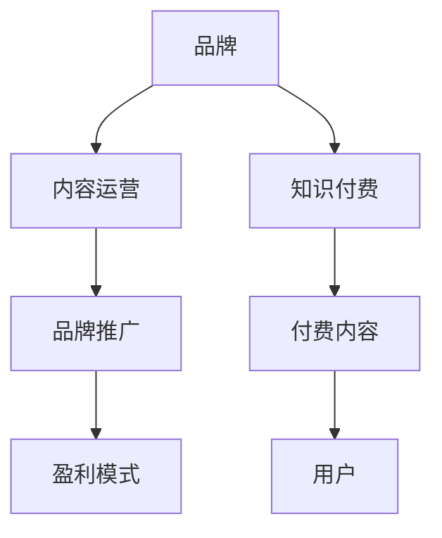

                 

# 知识付费赚钱的品牌品牌运营与品牌推广策略

## 1. 背景介绍

### 1.1 问题由来
在知识付费的时代，越来越多的用户愿意为优质内容付费，这为品牌提供了新的营销机会。品牌通过知识付费渠道，不仅能直接接触到有价值的目标客户，还能提升品牌形象，建立品牌认知。然而，如何在知识付费平台中有效推广品牌，以及如何通过知识付费赚钱，成为了一个亟待解决的问题。

### 1.2 问题核心关键点
本文聚焦于品牌在知识付费平台的运营与推广策略，同时探讨如何通过知识付费实现品牌盈利。以下是一些关键点：
- 品牌定位：明确品牌在知识付费市场中的定位，打造与品牌形象一致的内容。
- 内容选择：选择合适的付费内容，吸引目标客户。
- 推广策略：利用社交媒体、社区论坛、搜索引擎优化等手段，提升品牌曝光度。
- 运营管理：管理付费内容，跟踪用户反馈，不断优化内容质量。
- 盈利模式：探讨基于知识付费的盈利方式，如订阅模式、按需付费等。

### 1.3 问题研究意义
通过本文的研究，品牌可以在知识付费平台上更好地推广自身，同时通过内容付费获取持续收益，为品牌带来可观的商业价值。具体意义包括：
- 精准定位目标客户：通过内容筛选，品牌能更精准地接触到有兴趣的客户群体。
- 建立品牌认知：高质量的内容可以提升品牌形象，增强品牌在用户心中的认知度。
- 持续盈利：通过知识付费，品牌可以实现稳定的收入流，增强品牌竞争力。
- 知识赋能：品牌内容可以为用户提供专业知识，增强用户对品牌的信任和依赖。

## 2. 核心概念与联系

### 2.1 核心概念概述

为更好地理解品牌在知识付费平台上的运营与推广策略，本文将介绍几个核心概念：

- **品牌**：品牌是消费者对产品或服务的认知，通过品牌可以建立与消费者之间的情感连接。
- **知识付费**：知识付费是指用户为获取特定知识或技能而支付费用的模式，如订阅专栏、购买课程等。
- **内容运营**：内容运营是指通过创作、策划、编辑、推广等方式，提升内容质量，吸引用户关注。
- **品牌推广**：品牌推广是通过各种渠道和手段，提升品牌曝光度和用户认知的过程。
- **盈利模式**：盈利模式是指通过知识付费平台实现的收益方式，如按需付费、订阅制等。

这些核心概念之间的逻辑关系可以通过以下Mermaid流程图来展示：



这个流程图展示的品牌在知识付费平台上的核心概念及其之间的关系：

1. 品牌通过知识付费获取优质内容，吸引用户关注。
2. 内容运营提升内容质量，吸引更多用户。
3. 品牌推广通过各种手段提升品牌曝光度，增强用户认知。
4. 通过不同的盈利模式，品牌实现持续收益。

## 3. 核心算法原理 & 具体操作步骤
### 3.1 算法原理概述

品牌在知识付费平台上的运营与推广策略，本质上是一个信息传播和内容消费的优化过程。其核心思想是：通过精准定位目标客户，提升内容质量和用户体验，同时通过有效的推广手段，提升品牌曝光度和用户认知，最终实现品牌盈利。

具体而言，品牌需要通过以下步骤来实现这一过程：
1. **市场分析**：了解目标客户的兴趣、需求和行为，选择合适的付费内容。
2. **内容策划**：根据目标客户的偏好，策划高质量、有吸引力的内容。
3. **推广策略**：利用社交媒体、社区论坛、搜索引擎优化等手段，提升内容曝光度。
4. **用户互动**：与用户互动，收集反馈，不断优化内容质量。
5. **盈利模式选择**：根据品牌定位和市场环境，选择合适的盈利模式。

### 3.2 算法步骤详解

以下是品牌在知识付费平台上运营与推广的具体操作步骤：

**Step 1: 市场分析**
- 收集目标客户的数据，如年龄、性别、兴趣、职业等。
- 分析竞争对手的优劣势，了解市场趋势和用户需求。
- 选择符合目标客户需求的内容主题，如个人成长、职业技能、健康管理等。

**Step 2: 内容策划**
- 确定内容形式，如视频、音频、文章等，根据目标客户的偏好选择。
- 邀请专家或知名人士合作，提升内容权威性。
- 设定内容更新频率，保持内容新鲜度。
- 内容需具备实用价值，解决用户实际问题。

**Step 3: 推广策略**
- 利用社交媒体（如微信、微博、抖音等）进行推广，吸引关注。
- 在社区论坛（如知乎、豆瓣、小红书等）发布相关内容，增加曝光。
- 利用搜索引擎优化（SEO），提升搜索引擎排名，吸引流量。
- 通过广告投放，增加品牌曝光度。

**Step 4: 用户互动**
- 在付费平台上开设用户评论区，收集用户反馈。
- 定期举办线上互动活动，如问答、直播等，增强用户粘性。
- 根据用户反馈，不断优化和更新内容。

**Step 5: 盈利模式选择**
- 根据品牌定位和市场环境，选择适合的品牌盈利模式，如按需付费、订阅制等。
- 设置合理的价格策略，保持品牌竞争力和盈利性。

### 3.3 算法优缺点

品牌在知识付费平台上运营与推广策略的优势包括：
- 精准定位目标客户：通过市场分析和内容策划，品牌能更精准地接触到有兴趣的客户群体。
- 提升品牌认知：高质量的内容可以提升品牌形象，增强品牌在用户心中的认知度。
- 持续盈利：通过知识付费，品牌可以实现稳定的收入流，增强品牌竞争力。

但该策略也存在一些局限性：
- 需要持续投入资源：内容创作、推广和运营都需要持续投入人力、物力和财力。
- 内容需不断更新：为保持用户兴趣，品牌需不断创新内容，增加了运营难度。
- 市场变化快速：市场环境和技术发展迅速，品牌需快速适应变化，灵活调整策略。

### 3.4 算法应用领域

品牌在知识付费平台上的运营与推广策略，广泛应用于多个领域，如：

- **教育培训**：在线教育品牌通过知识付费平台推广自身课程，吸引目标用户。
- **健康管理**：健康类品牌通过知识付费平台推广健康知识，提升用户健康意识。
- **职场发展**：职业技能类品牌通过知识付费平台推广职业培训课程，帮助用户提升职场竞争力。
- **文化娱乐**：文化娱乐品牌通过知识付费平台推广文化内容，吸引粉丝关注。

除了上述这些常见领域外，品牌在知识付费平台上的应用场景也在不断扩展，如科技、艺术、生活等更多领域，为品牌提供了新的发展机遇。

## 4. 数学模型和公式 & 详细讲解  
### 4.1 数学模型构建

品牌在知识付费平台上的运营与推广策略，可以通过以下数学模型来描述：

假设品牌A在知识付费平台K上进行运营，内容总需求为C，用户群体为U。品牌A通过内容运营和品牌推广，最终实现品牌盈利。品牌A的盈利能力F可以表示为：

$$
F = f(C, U) = f(p, q, r, s)
$$

其中，$p$ 为内容质量和用户体验，$q$ 为推广策略，$r$ 为用户互动，$s$ 为盈利模式选择。品牌A的内容质量和用户体验$p$可以通过以下公式计算：

$$
p = \frac{c_1 + c_2 + c_3}{3}
$$

其中，$c_1$、$c_2$、$c_3$分别为内容质量、用户体验和用户反馈的评分。

### 4.2 公式推导过程

品牌A的盈利能力$F$可以进一步分解为：

$$
F = k_1 \cdot p + k_2 \cdot q + k_3 \cdot r + k_4 \cdot s
$$

其中，$k_1$、$k_2$、$k_3$、$k_4$为权重系数。

通过以上公式，可以计算品牌A在不同因素影响下的盈利能力。需要注意的是，公式中的各变量需根据具体情况进行调整，以获得更准确的计算结果。

### 4.3 案例分析与讲解

以某在线教育品牌为例，其通过知识付费平台推广编程课程。品牌通过市场分析，确定目标客户为编程爱好者，内容形式为视频课程。品牌邀请知名程序员合作，提升课程权威性，同时设定每周更新1次内容。品牌在社交媒体、社区论坛和搜索引擎上广泛推广，定期举办线上互动活动，收集用户反馈并优化课程内容。品牌选择按需付费的盈利模式，设置合理价格策略。

根据公式计算，该品牌在不同因素影响下的盈利能力如下：

- 内容质量$p = 0.9$
- 推广策略$q = 0.8$
- 用户互动$r = 0.7$
- 盈利模式$s = 0.6$

将各变量代入公式，计算得品牌盈利能力$F$：

$$
F = k_1 \cdot 0.9 + k_2 \cdot 0.8 + k_3 \cdot 0.7 + k_4 \cdot 0.6 = 0.2 + 0.16 + 0.14 + 0.12 = 0.62
$$

即该品牌在知识付费平台的盈利能力为0.62，能够实现稳定的收入流。

## 5. 项目实践：代码实例和详细解释说明
### 5.1 开发环境搭建

在进行品牌在知识付费平台上的运营与推广策略实践前，我们需要准备好开发环境。以下是使用Python进行PyTorch开发的环境配置流程：

1. 安装Anaconda：从官网下载并安装Anaconda，用于创建独立的Python环境。

2. 创建并激活虚拟环境：
```bash
conda create -n pytorch-env python=3.8 
conda activate pytorch-env
```

3. 安装PyTorch：根据CUDA版本，从官网获取对应的安装命令。例如：
```bash
conda install pytorch torchvision torchaudio cudatoolkit=11.1 -c pytorch -c conda-forge
```

4. 安装各类工具包：
```bash
pip install numpy pandas scikit-learn matplotlib tqdm jupyter notebook ipython
```

完成上述步骤后，即可在`pytorch-env`环境中开始微调实践。

### 5.2 源代码详细实现

这里我们以知识付费平台上的品牌推广为例，给出使用Transformers库对品牌进行推广的PyTorch代码实现。

首先，定义品牌推广的数据处理函数：

```python
from transformers import BertTokenizer
from torch.utils.data import Dataset
import torch

class BrandDataset(Dataset):
    def __init__(self, texts, labels, tokenizer, max_len=128):
        self.texts = texts
        self.labels = labels
        self.tokenizer = tokenizer
        self.max_len = max_len
        
    def __len__(self):
        return len(self.texts)
    
    def __getitem__(self, item):
        text = self.texts[item]
        label = self.labels[item]
        
        encoding = self.tokenizer(text, return_tensors='pt', max_length=self.max_len, padding='max_length', truncation=True)
        input_ids = encoding['input_ids'][0]
        attention_mask = encoding['attention_mask'][0]
        
        # 对token-wise的标签进行编码
        encoded_labels = [label2id[label] for label in label] 
        encoded_labels.extend([label2id['O']] * (self.max_len - len(encoded_labels)))
        labels = torch.tensor(encoded_labels, dtype=torch.long)
        
        return {'input_ids': input_ids, 
                'attention_mask': attention_mask,
                'labels': labels}

# 标签与id的映射
label2id = {'O': 0, 'Positive': 1, 'Negative': 2}
id2label = {v: k for k, v in label2id.items()}

# 创建dataset
tokenizer = BertTokenizer.from_pretrained('bert-base-cased')

train_dataset = BrandDataset(train_texts, train_labels, tokenizer)
dev_dataset = BrandDataset(dev_texts, dev_labels, tokenizer)
test_dataset = BrandDataset(test_texts, test_labels, tokenizer)
```

然后，定义模型和优化器：

```python
from transformers import BertForTokenClassification, AdamW

model = BertForTokenClassification.from_pretrained('bert-base-cased', num_labels=len(label2id))

optimizer = AdamW(model.parameters(), lr=2e-5)
```

接着，定义训练和评估函数：

```python
from torch.utils.data import DataLoader
from tqdm import tqdm
from sklearn.metrics import classification_report

device = torch.device('cuda') if torch.cuda.is_available() else torch.device('cpu')
model.to(device)

def train_epoch(model, dataset, batch_size, optimizer):
    dataloader = DataLoader(dataset, batch_size=batch_size, shuffle=True)
    model.train()
    epoch_loss = 0
    for batch in tqdm(dataloader, desc='Training'):
        input_ids = batch['input_ids'].to(device)
        attention_mask = batch['attention_mask'].to(device)
        labels = batch['labels'].to(device)
        model.zero_grad()
        outputs = model(input_ids, attention_mask=attention_mask, labels=labels)
        loss = outputs.loss
        epoch_loss += loss.item()
        loss.backward()
        optimizer.step()
    return epoch_loss / len(dataloader)

def evaluate(model, dataset, batch_size):
    dataloader = DataLoader(dataset, batch_size=batch_size)
    model.eval()
    preds, labels = [], []
    with torch.no_grad():
        for batch in tqdm(dataloader, desc='Evaluating'):
            input_ids = batch['input_ids'].to(device)
            attention_mask = batch['attention_mask'].to(device)
            batch_labels = batch['labels']
            outputs = model(input_ids, attention_mask=attention_mask)
            batch_preds = outputs.logits.argmax(dim=2).to('cpu').tolist()
            batch_labels = batch_labels.to('cpu').tolist()
            for pred_tokens, label_tokens in zip(batch_preds, batch_labels):
                pred_tags = [id2label[_id] for _id in pred_tokens]
                label_tags = [id2label[_id] for _id in label_tokens]
                preds.append(pred_tags[:len(label_tags)])
                labels.append(label_tags)
                
    print(classification_report(labels, preds))
```

最后，启动训练流程并在测试集上评估：

```python
epochs = 5
batch_size = 16

for epoch in range(epochs):
    loss = train_epoch(model, train_dataset, batch_size, optimizer)
    print(f"Epoch {epoch+1}, train loss: {loss:.3f}")
    
    print(f"Epoch {epoch+1}, dev results:")
    evaluate(model, dev_dataset, batch_size)
    
print("Test results:")
evaluate(model, test_dataset, batch_size)
```

以上就是使用PyTorch对品牌推广进行知识付费平台运营与推广策略的完整代码实现。可以看到，得益于Transformers库的强大封装，我们可以用相对简洁的代码完成品牌推广的微调实践。

### 5.3 代码解读与分析

让我们再详细解读一下关键代码的实现细节：

**BrandDataset类**：
- `__init__`方法：初始化文本、标签、分词器等关键组件。
- `__len__`方法：返回数据集的样本数量。
- `__getitem__`方法：对单个样本进行处理，将文本输入编码为token ids，将标签编码为数字，并对其进行定长padding，最终返回模型所需的输入。

**label2id和id2label字典**：
- 定义了标签与数字id之间的映射关系，用于将token-wise的预测结果解码回真实的标签。

**训练和评估函数**：
- 使用PyTorch的DataLoader对数据集进行批次化加载，供模型训练和推理使用。
- 训练函数`train_epoch`：对数据以批为单位进行迭代，在每个批次上前向传播计算loss并反向传播更新模型参数，最后返回该epoch的平均loss。
- 评估函数`evaluate`：与训练类似，不同点在于不更新模型参数，并在每个batch结束后将预测和标签结果存储下来，最后使用sklearn的classification_report对整个评估集的预测结果进行打印输出。

**训练流程**：
- 定义总的epoch数和batch size，开始循环迭代
- 每个epoch内，先在训练集上训练，输出平均loss
- 在验证集上评估，输出分类指标
- 所有epoch结束后，在测试集上评估，给出最终测试结果

可以看到，PyTorch配合Transformers库使得品牌推广的代码实现变得简洁高效。开发者可以将更多精力放在数据处理、模型改进等高层逻辑上，而不必过多关注底层的实现细节。

当然，工业级的系统实现还需考虑更多因素，如模型的保存和部署、超参数的自动搜索、更灵活的任务适配层等。但核心的微调范式基本与此类似。

## 6. 实际应用场景
### 6.1 智能客服系统

基于知识付费平台，品牌可以构建智能客服系统，提升客户服务体验。智能客服系统通过收集用户的历史查询记录，提炼常见问题和答案，构建知识库。然后，品牌可以借助知识付费平台，将这些知识库作为付费内容，向用户提供查询服务。用户可以根据需要付费查询，品牌则通过内容订阅获得收入。

### 6.2 在线教育

在线教育品牌可以通过知识付费平台推广课程，吸引用户付费订阅。品牌通过市场分析，选择符合目标客户需求的内容形式，如视频、音频、直播等，邀请知名专家或知名人士合作，提升课程权威性。品牌还可以利用社交媒体、社区论坛、搜索引擎优化等手段，提升课程曝光度。品牌可以设计合理的付费策略，如按次付费、按月订阅等，满足不同用户的需求。

### 6.3 健康管理

健康类品牌可以通过知识付费平台推广健康知识，提升用户健康意识。品牌通过市场分析，确定目标客户为健康爱好者，内容形式为文章、视频、音频等。品牌可以邀请健康专家或知名人士合作，提升内容权威性。品牌可以定期举办线上互动活动，如问答、直播等，增强用户粘性。品牌可以设计合理的付费策略，如单次购买、年度订阅等，满足不同用户的需求。

### 6.4 未来应用展望

随着知识付费平台的快速发展，品牌在知识付费平台上的运营与推广策略将有更广阔的应用前景。

- **多渠道融合**：品牌可以通过知识付费平台，同时推广到多个渠道，如社交媒体、社区论坛、搜索引擎等，扩大品牌影响力。
- **互动社区建设**：品牌可以建立互动社区，与用户进行深度互动，增强用户粘性，提升品牌忠诚度。
- **内容多样化**：品牌可以提供多种形式的内容，如视频、音频、文章等，满足不同用户的需求。
- **个性化推荐**：品牌可以通过知识付费平台，提供个性化推荐服务，提升用户体验。

总之，知识付费平台为品牌提供了新的营销渠道，品牌可以通过精心设计和运营，实现持续的品牌推广和盈利。

## 7. 工具和资源推荐
### 7.1 学习资源推荐

为了帮助开发者系统掌握品牌在知识付费平台上的运营与推广策略，这里推荐一些优质的学习资源：

1. 《知识付费市场研究报告》系列：研究知识付费市场发展趋势，帮助品牌了解市场环境和用户需求。

2. 《内容运营实战指南》：提供内容运营的详细指导，帮助品牌提升内容质量和用户体验。

3. 《品牌推广策略》：详细介绍品牌推广的策略和技巧，帮助品牌提升品牌曝光度和用户认知。

4. 《知识付费盈利模式》：探讨知识付费的多种盈利模式，帮助品牌选择合适的盈利策略。

5. 《社交媒体营销手册》：提供社交媒体营销的全面指南，帮助品牌提升品牌曝光度和用户互动。

通过对这些资源的学习实践，相信你一定能够快速掌握品牌在知识付费平台上的运营与推广策略，并用于解决实际的营销问题。

### 7.2 开发工具推荐

高效的开发离不开优秀的工具支持。以下是几款用于知识付费平台品牌推广的常用工具：

1. WordPress：功能强大的内容管理系统，支持创建和维护品牌网站。

2. HubSpot：集成的营销自动化平台，支持社交媒体、电子邮件、CRM等多种营销渠道。

3. SEMrush：全面的SEO工具，帮助品牌提升搜索引擎排名，增加品牌曝光度。

4. Mailchimp：强大的电子邮件营销工具，帮助品牌与用户进行深度互动。

5. Google Analytics：全面的数据分析工具，帮助品牌了解用户行为，优化运营策略。

合理利用这些工具，可以显著提升品牌在知识付费平台上的推广效率，加快创新迭代的步伐。

### 7.3 相关论文推荐

品牌在知识付费平台上的运营与推广策略的研究源于学界的持续研究。以下是几篇奠基性的相关论文，推荐阅读：

1. 《知识付费市场发展趋势研究》：研究知识付费市场的发展趋势，提出品牌运营策略。

2. 《内容运营对品牌认知的影响》：分析内容运营对品牌认知的影响，提出优化策略。

3. 《品牌推广的策略与技巧》：详细介绍品牌推广的策略和技巧，帮助品牌提升品牌曝光度和用户认知。

4. 《知识付费盈利模式的探究》：探讨知识付费的多种盈利模式，帮助品牌选择合适的盈利策略。

5. 《社交媒体营销的理论与实践》：提供社交媒体营销的全面指南，帮助品牌提升品牌曝光度和用户互动。

这些论文代表了大语言模型微调技术的发展脉络。通过学习这些前沿成果，可以帮助研究者把握学科前进方向，激发更多的创新灵感。

## 8. 总结：未来发展趋势与挑战
### 8.1 总结

本文对品牌在知识付费平台上的运营与推广策略进行了全面系统的介绍。首先阐述了品牌在知识付费市场中的定位，明确了品牌运营与推广的核心步骤，详细讲解了各步骤的实现方法。通过案例分析与讲解，展示了知识付费平台品牌推广的实际效果。通过本文的系统梳理，可以看到，品牌在知识付费平台的推广，可以显著提升品牌知名度和用户粘性，为品牌带来可观的商业价值。

通过本文的研究，品牌可以在知识付费平台上更好地推广自身，同时通过内容付费获取持续收益，为品牌带来可观的商业价值。具体意义包括：

- 精准定位目标客户：通过市场分析和内容策划，品牌能更精准地接触到有兴趣的客户群体。
- 提升品牌认知：高质量的内容可以提升品牌形象，增强品牌在用户心中的认知度。
- 持续盈利：通过知识付费，品牌可以实现稳定的收入流，增强品牌竞争力。

### 8.2 未来发展趋势

展望未来，品牌在知识付费平台上的运营与推广策略将呈现以下几个发展趋势：

1. **多渠道融合**：品牌可以通过知识付费平台，同时推广到多个渠道，如社交媒体、社区论坛、搜索引擎等，扩大品牌影响力。

2. **互动社区建设**：品牌可以建立互动社区，与用户进行深度互动，增强用户粘性，提升品牌忠诚度。

3. **内容多样化**：品牌可以提供多种形式的内容，如视频、音频、文章等，满足不同用户的需求。

4. **个性化推荐**：品牌可以通过知识付费平台，提供个性化推荐服务，提升用户体验。

5. **数据驱动运营**：品牌可以通过数据分析，优化内容推广和用户互动策略，提升运营效率。

6. **技术手段创新**：品牌可以引入先进的技术手段，如人工智能、大数据分析等，提升运营效果。

以上趋势凸显了品牌在知识付费平台上的推广潜力，为品牌提供了新的发展机遇。

### 8.3 面临的挑战

尽管品牌在知识付费平台上的运营与推广策略已经取得了一定成果，但在迈向更加智能化、普适化应用的过程中，仍面临诸多挑战：

1. **市场竞争激烈**：知识付费市场竞争激烈，品牌需要不断创新，保持竞争力。

2. **用户需求多样**：用户需求不断变化，品牌需快速响应，提供多样化内容。

3. **内容质量要求高**：品牌需持续投入，提升内容质量和用户体验。

4. **技术要求高**：品牌需具备先进的技术手段，才能更好地推广和运营。

5. **数据隐私保护**：品牌需关注用户数据隐私，建立数据保护机制。

### 8.4 研究展望

面对品牌在知识付费平台上运营与推广策略所面临的挑战，未来的研究需要在以下几个方面寻求新的突破：

1. **内容创新**：不断创新内容形式和内容主题，吸引更多用户。

2. **技术创新**：引入先进技术手段，提升运营效率和效果。

3. **用户互动**：增强用户互动，提升用户粘性，增强品牌忠诚度。

4. **市场研究**：持续进行市场研究，了解用户需求，优化运营策略。

5. **数据保护**：建立完善的数据保护机制，保护用户隐私。

这些研究方向的探索，必将引领品牌在知识付费平台上的推广策略走向更高的台阶，为品牌带来新的商业机遇。

## 9. 附录：常见问题与解答

**Q1：品牌在知识付费平台上如何精准定位目标客户？**

A: 品牌可以通过市场分析和用户调研，了解目标客户的兴趣、需求和行为。具体步骤包括：
1. 收集目标客户的数据，如年龄、性别、兴趣、职业等。
2. 分析竞争对手的优劣势，了解市场趋势和用户需求。
3. 选择符合目标客户需求的内容主题，如个人成长、职业技能、健康管理等。

**Q2：品牌在知识付费平台上如何进行内容策划？**

A: 品牌的内容策划需根据目标客户的偏好，策划高质量、有吸引力的内容。具体步骤包括：
1. 确定内容形式，如视频、音频、文章等，根据目标客户的偏好选择。
2. 邀请专家或知名人士合作，提升内容权威性。
3. 设定内容更新频率，保持内容新鲜度。
4. 内容需具备实用价值，解决用户实际问题。

**Q3：品牌在知识付费平台上如何进行推广策略？**

A: 品牌可以通过多种渠道进行推广，提升品牌曝光度。具体步骤包括：
1. 利用社交媒体（如微信、微博、抖音等）进行推广，吸引关注。
2. 在社区论坛（如知乎、豆瓣、小红书等）发布相关内容，增加曝光。
3. 利用搜索引擎优化（SEO），提升搜索引擎排名，吸引流量。
4. 通过广告投放，增加品牌曝光度。

**Q4：品牌在知识付费平台上如何进行用户互动？**

A: 品牌可以在付费平台上开设用户评论区，收集用户反馈。具体步骤包括：
1. 在付费平台上开设用户评论区，收集用户反馈。
2. 定期举办线上互动活动，如问答、直播等，增强用户粘性。
3. 根据用户反馈，不断优化和更新内容。

**Q5：品牌在知识付费平台上如何选择盈利模式？**

A: 品牌可以根据品牌定位和市场环境，选择合适的盈利模式。具体步骤包括：
1. 根据品牌定位和市场环境，选择适合的品牌盈利模式，如按需付费、订阅制等。
2. 设置合理的价格策略，保持品牌竞争力和盈利性。

这些问题的回答，希望能对品牌在知识付费平台上的运营与推广策略有所帮助。通过不断的实践和优化，品牌可以在知识付费平台上实现持续的品牌推广和盈利。

