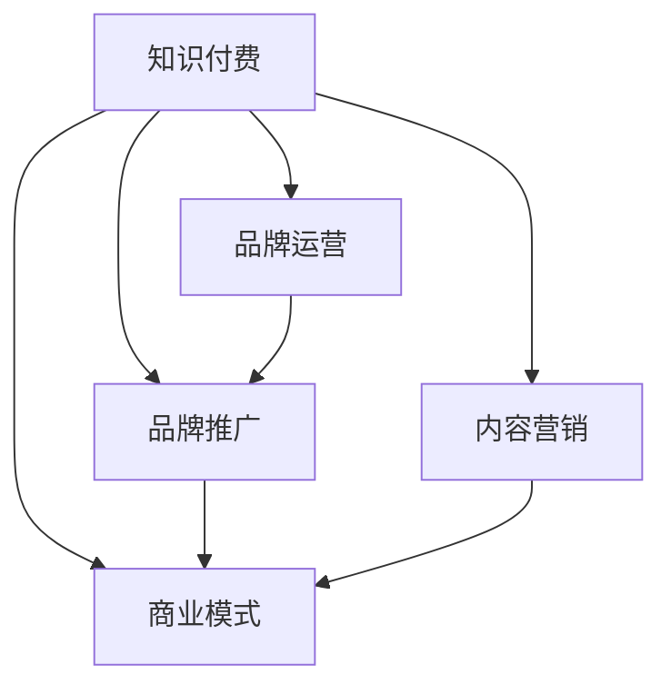

                 

# 知识付费赚钱的品牌品牌运营与品牌推广策略

> 关键词：知识付费,品牌运营,品牌推广,商业模式,内容营销

## 1. 背景介绍

在知识经济蓬勃发展的今天，知识付费已经成为一种重要的内容消费模式。然而，尽管行业发展迅速，但真正能够盈利的知识付费平台屈指可数。究其原因，除了内容质量、技术架构等方面的因素，品牌运营与推广策略的缺失也是关键所在。本文将从品牌运营与推广的视角出发，结合实际案例，系统梳理知识付费品牌的成功要素，探讨如何通过策略组合，实现盈利目标。

## 2. 核心概念与联系

### 2.1 核心概念概述

为更好地理解品牌运营与推广的逻辑，本节将介绍几个密切相关的核心概念：

- **知识付费**：指用户为获取高质量知识内容而支付费用的消费模式。知识付费领域包括在线课程、电子书、语音播客等形式，广泛渗透到教育、健康、心理等多个领域。

- **品牌运营**：指通过一系列策略和手段，提升品牌知名度、美誉度和市场份额的过程。品牌运营是企业战略的重要组成部分，对于知识付费平台尤为重要。

- **品牌推广**：指利用各种手段和渠道，向目标用户传递品牌信息，增加品牌曝光和用户粘性的活动。品牌推广是品牌运营的核心环节之一。

- **商业模式**：指企业通过产品、服务、渠道等元素组合，实现盈利的过程。知识付费平台的商业模式多样，主要包括订阅制、按需制、课程包等。

- **内容营销**：指通过高价值的内容，吸引并锁定用户，最终实现转化的营销方式。内容营销是知识付费平台的核心竞争力之一。

这些概念之间的逻辑关系可以通过以下Mermaid流程图来展示：



这个流程图展示了几大核心概念及其之间的关系：

1. 知识付费平台是品牌运营与推广的基础。
2. 品牌运营和品牌推广共同作用于知识付费，提升平台价值。
3. 商业模式决定品牌运营与推广的投入产出比。
4. 内容营销是品牌运营与推广的核心驱动力。

这些概念共同构成了知识付费品牌运营与推广的完整框架，指导着平台的各个环节。

## 3. 核心算法原理 & 具体操作步骤
### 3.1 算法原理概述

品牌运营与推广的本质是通过有效的策略组合，提升品牌影响力和用户粘性，从而实现盈利目标。这一过程涉及到多个维度，包括品牌定位、用户画像、渠道选择、内容创新等。

### 3.2 算法步骤详解

品牌运营与推广的核心步骤可以概括为以下几步：

**Step 1: 品牌定位与市场调研**

- 分析目标用户群体，确定品牌的定位和差异化策略。
- 进行市场调研，了解竞争对手的优势和不足，找出市场空缺。
- 结合用户需求和市场趋势，确定品牌的发展方向。

**Step 2: 内容策划与内容营销**

- 基于品牌定位，策划高价值的内容主题。
- 通过SEO优化、KOL合作、社交媒体等方式进行内容推广。
- 监测内容效果，及时调整策略。

**Step 3: 渠道选择与品牌曝光**

- 根据目标用户群体的行为习惯，选择适合的推广渠道。
- 利用广告投放、社交媒体、社区运营等手段提升品牌曝光。
- 分析渠道效果，优化投放策略。

**Step 4: 用户粘性提升与转化**

- 建立用户社区，鼓励用户互动和反馈。
- 提供优质服务，增强用户信任和忠诚度。
- 设计有效的转化路径，推动用户从免费用户转为付费用户。

**Step 5: 品牌形象建设与维护**

- 制定品牌形象标准，统一平台视觉和语音风格。
- 建立品牌故事，增加用户对品牌的情感连接。
- 定期评估品牌形象，及时调整策略。

### 3.3 算法优缺点

品牌运营与推广策略具有以下优点：

1. **提升品牌知名度**：通过有效的品牌推广，可以迅速提升平台在目标用户中的认知度。
2. **增强用户粘性**：通过优质的内容和服务，可以显著提升用户留存率。
3. **促进用户转化**：通过科学的用户路径设计，可以有效推动用户从免费向付费的转变。
4. **优化资源配置**：通过精准的渠道选择和内容策划，可以实现营销资源的有效利用。

同时，该方法也存在一定的局限性：

1. **成本高**：品牌运营与推广需要大量资金投入，尤其在大规模推广初期。
2. **效果不确定**：市场变化迅速，品牌运营策略的回报难以预测。
3. **竞争激烈**：知识付费市场竞争激烈，品牌推广效果容易受竞争对手干扰。
4. **效果难以量化**：品牌运营与推广的效果往往难以通过直接数据量化，需要长期跟踪。

尽管存在这些局限性，但就目前而言，品牌运营与推广策略仍然是知识付费平台实现盈利的重要手段。未来相关研究的重点在于如何优化策略组合，降低成本，提高回报，同时兼顾品牌的美誉度和用户的满意度。

### 3.4 算法应用领域

品牌运营与推广策略在知识付费平台的应用广泛，具体包括：

- 课程营销：通过精心策划的课程内容和营销活动，吸引用户订阅。
- 平台品牌建设：建立平台独特的品牌形象，增强用户对平台的认知和信任。
- 用户获取与留存：通过精准的用户画像和有效的营销策略，实现用户的高效获取和长期留存。
- 付费转化：设计合适的付费路径和奖励机制，提升用户的付费意愿和频率。

## 4. 数学模型和公式 & 详细讲解 & 举例说明
### 4.1 数学模型构建

品牌运营与推广的数学模型可以表示为：

$$
R = C \times (1 - \lambda) + C \times \lambda \times f(x)
$$

其中：
- $R$ 为平台的净收入。
- $C$ 为平台的投入成本（包括品牌推广、内容制作等）。
- $\lambda$ 为品牌推广的效果转化率（即用户从推广活动中转为付费用户的比例）。
- $f(x)$ 为推广活动对用户转化的影响函数，$x$ 为推广活动的相关变量（如广告投放次数、内容质量等）。

### 4.2 公式推导过程

通过上述模型，我们可以看出品牌运营与推广的核心在于提升推广效果转化率 $\lambda$ 和推广活动的影响函数 $f(x)$。推广活动的设计和实施需要考虑多方面因素，如推广渠道、内容形式、用户反馈等。

### 4.3 案例分析与讲解

以“得到”平台为例，其品牌运营与推广策略主要包括以下几个方面：

- **课程内容**：“得到”平台汇集了众多知名学者的优质课程内容，涵盖心理学、经济、管理等多个领域。
- **品牌定位**：强调“得到”平台是一个专业的知识分享和学习社区，通过邀请KOL入驻，增加平台的专业性和权威性。
- **推广渠道**：通过社交媒体、搜索引擎、邮件营销等多种渠道进行推广，同时利用微信读书等合作平台扩大用户基础。
- **用户粘性提升**：建立“学以致用”社区，鼓励用户分享学习心得和职业发展经验，增强用户间的互动和信任。

通过这些策略，“得到”平台在短时间内迅速提升了品牌知名度和用户粘性，实现了从免费到付费的高效转化，成为知识付费领域的佼佼者。

## 5. 项目实践：代码实例和详细解释说明
### 5.1 开发环境搭建

在进行品牌运营与推广的实践前，我们需要准备好开发环境。以下是使用Python进行代码实现的流程：

1. 安装Anaconda：从官网下载并安装Anaconda，用于创建独立的Python环境。

2. 创建并激活虚拟环境：
```bash
conda create -n brand-operate python=3.8 
conda activate brand-operate
```

3. 安装相关Python包：
```bash
pip install pandas numpy matplotlib sklearn scikit-learn
```

4. 配置开发环境：
```bash
export PYTHONPATH=$PYTHONPATH:$(pwd)/src
```

完成上述步骤后，即可在`brand-operate`环境中开始品牌运营与推广的实践。

### 5.2 源代码详细实现

下面以“罗辑思维”平台的品牌推广实践为例，展示如何使用Python进行品牌运营与推广的代码实现。

首先，定义品牌推广的预算和投放渠道：

```python
import pandas as pd
import numpy as np

# 定义预算和渠道
budget = 1000000
channels = ['微信', '微博', '搜索引擎']

# 定义各渠道的投放效果
channel_effect = {
    '微信': 0.2,
    '微博': 0.1,
    '搜索引擎': 0.15
}

# 定义用户转化率
conversion_rate = 0.05
```

然后，计算各渠道的投放量：

```python
# 计算各渠道的投放量
channel_cost = [budget / len(channels)] * len(channels)
channel_cost = [channel_cost[i] / channel_effect[channel] for i, channel in enumerate(channels)]

# 计算各渠道的投放效果
channel_roi = [channel_effect[channel] * channel_cost[i] for i, channel in enumerate(channels)]

# 计算总投放效果
total_roi = sum(channel_roi)

# 输出结果
print("各渠道投放量:", channel_cost)
print("各渠道投放效果:", channel_roi)
print("总投放效果:", total_roi)
```

### 5.3 代码解读与分析

让我们再详细解读一下关键代码的实现细节：

**渠道投放量的计算**：
- 定义品牌推广的总预算和各渠道的平均投放成本。
- 根据各渠道的投放效果和成本，计算各渠道的投放量。
- 最后，计算各渠道的实际投放效果，并输出结果。

通过上述代码，可以看出品牌运营与推广的关键在于合理分配预算，优化渠道选择，提高投放效果。在实际操作中，需要根据平台的具体情况和市场变化，灵活调整策略，以达到最优的推广效果。

## 6. 实际应用场景
### 6.1 企业内部培训

企业内部培训是品牌运营与推广的重要场景之一。通过知识付费平台，企业可以为员工提供系统化的培训课程，提高员工的专业能力和工作效率。

具体而言，企业可以结合自身业务需求，选择合适的课程内容，并利用品牌运营与推广策略，吸引员工参与培训。通过微信、企业邮箱等渠道，向员工推广优质课程，设计科学的课程路径和奖励机制，提升员工的参与度和学习效果。

### 6.2 在线教育

在线教育平台通过知识付费模式，为用户提供高质量的在线课程，帮助其提升技能和知识水平。品牌运营与推广策略在在线教育中的应用尤为关键。

在线教育平台可以基于用户画像，设计针对性的课程内容和营销策略，提升平台的吸引力和用户粘性。通过微信、B站、微博等渠道进行推广，扩大平台的覆盖面。同时，建立社区论坛，鼓励用户分享学习心得，增强用户间的互动和信任。

### 6.3 企业内部培训

企业内部培训是品牌运营与推广的重要场景之一。通过知识付费平台，企业可以为员工提供系统化的培训课程，提高员工的专业能力和工作效率。

具体而言，企业可以结合自身业务需求，选择合适的课程内容，并利用品牌运营与推广策略，吸引员工参与培训。通过微信、企业邮箱等渠道，向员工推广优质课程，设计科学的课程路径和奖励机制，提升员工的参与度和学习效果。

## 7. 工具和资源推荐
### 7.1 学习资源推荐

为了帮助开发者系统掌握品牌运营与推广的理论基础和实践技巧，这里推荐一些优质的学习资源：

1. 《品牌运营：从入门到精通》：全面介绍品牌运营的理论和实践，涵盖品牌定位、用户画像、营销策略等内容。

2. 《内容营销：从创意到落地》：详细介绍内容营销的策略和技巧，包括SEO优化、KOL合作、社交媒体等。

3. 《品牌推广：实战策略与案例分析》：通过丰富的案例分析，揭示品牌推广的策略和实施细节。

4. 《营销心理学》：解析用户行为背后的心理机制，帮助品牌运营与推广更科学有效。

5. 《品牌战略：理论与实践》：系统讲解品牌战略的制定和实施，指导品牌运营与推广的全局规划。

通过对这些资源的学习实践，相信你一定能够快速掌握品牌运营与推广的精髓，并用于解决实际的营销问题。

### 7.2 开发工具推荐

高效的开发离不开优秀的工具支持。以下是几款用于品牌运营与推广开发的常用工具：

1. Google Analytics：实时监控网站流量和用户行为，为品牌推广提供数据支持。

2. Hootsuite：社交媒体管理工具，支持多平台发布和监控，提升品牌曝光和互动效果。

3. Mailchimp：电子邮件营销工具，支持自动化邮件营销和用户管理，增强用户粘性。

4. SEMrush：搜索引擎优化和竞争分析工具，帮助品牌运营与推广更精准高效。

5. Buffer：社交媒体管理工具，支持多平台发布和计划，提升品牌曝光和互动效果。

合理利用这些工具，可以显著提升品牌运营与推广的效率和效果，加速品牌价值的实现。

### 7.3 相关论文推荐

品牌运营与推广技术的发展源于学界的持续研究。以下是几篇奠基性的相关论文，推荐阅读：

1. "Brand Equity Management: A Multi-Faceted Perspective" by Aaker and Joachimsthaler：探讨品牌价值管理的理论和实践，提出品牌认知、情感和行为三个维度的品牌管理模型。

2. "The Effectiveness of Social Media in Brand Building" by Milne and Doyle：分析社交媒体在品牌建设中的作用，提出基于用户生成内容（UGC）的品牌推广策略。

3. "Content Marketing: From Strategy to Execution" by David Herbon：系统讲解内容营销的策略和实践，提供丰富的案例和工具。

4. "The Role of Branding in Digital Marketing" by Ashantrakul：探讨品牌在数字营销中的作用，提出基于数字技术的品牌推广策略。

5. "Brand Strategy: What's the Next Move?" by Keller：提出品牌战略的制定和实施框架，指导品牌运营与推广的全局规划。

这些论文代表了大品牌运营与推广技术的发展脉络。通过学习这些前沿成果，可以帮助研究者把握学科前进方向，激发更多的创新灵感。

## 8. 总结：未来发展趋势与挑战
### 8.1 总结

本文对品牌运营与推广的方法进行了全面系统的介绍。首先阐述了品牌运营与推广的战略意义和关键要素，明确了各环节的逻辑关系。其次，从原理到实践，详细讲解了品牌运营与推广的数学模型和操作步骤，给出了实际案例的详细解释说明。同时，本文还广泛探讨了品牌运营与推广在企业内部培训、在线教育等多个行业领域的应用前景，展示了其广阔的应用空间。

通过本文的系统梳理，可以看到，品牌运营与推广策略在大规模知识付费平台中的应用，对于提升平台品牌价值、增强用户粘性、实现盈利目标具有重要意义。

### 8.2 未来发展趋势

展望未来，品牌运营与推广技术将呈现以下几个发展趋势：

1. **多渠道整合**：品牌推广将突破单一渠道的限制，整合多种渠道资源，提升推广效果。
2. **数据驱动决策**：品牌运营与推广将更加依赖数据分析，通过AI和大数据技术，提升决策的科学性和效率。
3. **用户定制化**：品牌推广将更加注重用户个性化需求，提供定制化的营销方案。
4. **互动增强**：品牌运营与推广将更加注重与用户的互动，通过社交媒体、社区论坛等方式，增强用户粘性和品牌忠诚度。
5. **技术融合**：品牌运营与推广将更多地结合AI、区块链等前沿技术，提升品牌运营的智能化水平。

以上趋势凸显了品牌运营与推广技术的广阔前景。这些方向的探索发展，必将进一步提升品牌推广的精准度和效果，为知识付费平台带来更高的市场竞争力和用户满意度。

### 8.3 面临的挑战

尽管品牌运营与推广技术已经取得了一定的成果，但在迈向更加智能化、个性化应用的过程中，它仍面临着诸多挑战：

1. **市场变化快**：市场竞争激烈，品牌运营与推广策略需要快速调整以应对变化。
2. **用户需求多样化**：不同用户群体的需求各异，品牌推广需要更加灵活多样的策略。
3. **数据隐私保护**：用户数据的收集和分析需要遵守隐私法规，保护用户隐私。
4. **技术成本高**：AI和大数据技术的引入，增加了品牌运营与推广的成本。
5. **效果难以量化**：品牌推广的效果难以直接量化，需要长期跟踪和评估。

尽管存在这些挑战，但通过不断优化策略组合，结合技术手段，相信品牌运营与推广将能够克服这些障碍，实现更高的推广效果和用户满意度。

### 8.4 研究展望

面对品牌运营与推广所面临的挑战，未来的研究需要在以下几个方面寻求新的突破：

1. **跨渠道优化**：研究如何跨渠道整合资源，提升品牌推广的整体效果。
2. **用户行为分析**：深入研究用户行为背后的心理机制，提供更加精准的推广策略。
3. **数据隐私保护**：探索如何在品牌运营与推广中更好地保护用户隐私。
4. **AI驱动决策**：研究如何利用AI和大数据技术，提升品牌运营与推广的科学性和效率。
5. **社区互动优化**：研究如何通过社区建设，增强用户粘性和品牌忠诚度。

这些研究方向的探索，必将引领品牌运营与推广技术迈向更高的台阶，为构建安全、可靠、可解释、可控的智能系统铺平道路。面向未来，品牌运营与推广技术还需要与其他人工智能技术进行更深入的融合，如知识表示、因果推理、强化学习等，多路径协同发力，共同推动品牌价值和用户满意度的提升。

## 9. 附录：常见问题与解答
**Q1：品牌运营与推广和内容营销有什么区别？**

A: 品牌运营与推广和内容营销虽然紧密相关，但有所区别。品牌运营与推广的核心在于提升品牌知名度和美誉度，涵盖广告投放、社区建设、客户服务等多个方面。而内容营销则侧重于通过高价值的内容吸引并锁定用户，最终实现转化。两者相辅相成，共同构成品牌运营与推广的完整框架。

**Q2：品牌运营与推广的投入产出比如何计算？**

A: 品牌运营与推广的投入产出比（ROI）可以通过实际效果和成本进行计算。例如，在广告投放中，可以用点击率（CTR）、转化率（CVR）等指标衡量广告效果，再除以广告投放成本，即可得到ROI。

**Q3：品牌运营与推广的策略组合有哪些？**

A: 品牌运营与推广的策略组合包括品牌定位、用户画像、内容策划、渠道选择、用户互动等多个方面。具体策略如KOL合作、社交媒体营销、搜索引擎优化、电子邮件营销等，需要根据平台的具体情况和市场变化灵活调整。

**Q4：品牌运营与推广的效果如何评估？**

A: 品牌运营与推广的效果可以通过多个指标进行评估，如品牌知名度、用户粘性、用户转化率、品牌形象等。通过定期监测这些指标，可以及时调整策略，优化推广效果。

**Q5：品牌运营与推广的成功要素有哪些？**

A: 品牌运营与推广的成功要素包括明确的品牌定位、精准的用户画像、优质的内容策划、有效的渠道选择、良好的用户互动和科学的评估体系。只有在这些要素上做到精准把握，才能实现品牌推广的高效转化。

通过这些常见问题的解答，希望能够帮助读者更全面地理解品牌运营与推广的各个环节和关键要素，进而提升品牌推广的效果和平台竞争力。

---

作者：禅与计算机程序设计艺术 / Zen and the Art of Computer Programming

