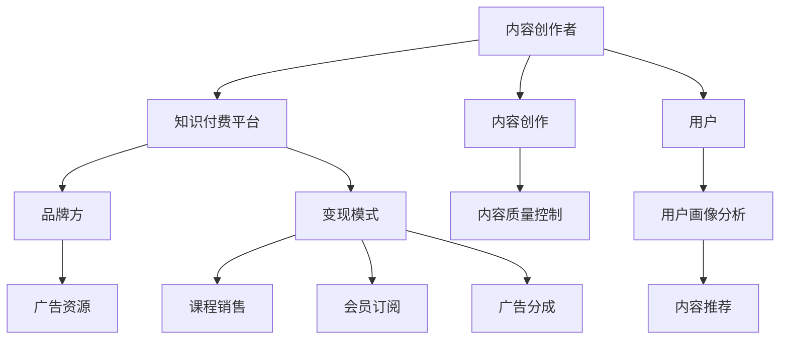

                 

# 知识付费赚钱的品牌跨界合作与资源整合策略

## 1. 背景介绍

在知识经济时代，内容创作和消费正在重塑商业模式。知识付费作为一种新兴的盈利模式，正成为企业品牌和个人创作者跨界合作的桥梁。然而，如何有效地整合各方资源，打造具有高度竞争力的知识付费品牌，仍然是一个极具挑战的问题。本文将从品牌跨界合作与资源整合的视角，深入探讨知识付费盈利模式及其策略。

### 1.1 问题由来

知识付费的兴起，打破了传统信息传播的界限，为内容创作者提供了新的变现途径。一方面，品牌方通过内容提升品牌形象，增强市场竞争力；另一方面，创作者借助平台获取收入，实现个人价值。然而，在知识付费领域，内容制作与营销推广、用户运营与平台变现之间的协同效应尚未充分发挥，亟需有效的品牌跨界合作与资源整合策略，以应对激烈的市场竞争。

### 1.2 问题核心关键点

- **内容创作**：优质的内容是知识付费的基础，需要创作者不断提升自身专业素养和创作能力。
- **品牌联动**：品牌之间的协同效应，可以增强知识付费平台的影响力，提高内容的传播力和信任度。
- **资源整合**：包括内容资源、技术资源、用户资源、广告资源等多维度的整合，才能实现知识付费品牌的可持续发展。
- **用户运营**：通过精准的用户画像分析，提供个性化的内容推荐和增值服务，增强用户粘性和品牌忠诚度。
- **平台变现**：多元化的变现方式，如课程销售、会员订阅、广告分成等，确保平台的盈利模式可持续。

## 2. 核心概念与联系

### 2.1 核心概念概述

- **知识付费**：指用户为获取有价值的信息、知识、经验或技能，而支付费用的模式。知识付费平台通过聚集专业内容创作者和有需求的用户，促成内容的生产与消费。
- **内容创作者**：通过专业知识和技能，创造有价值的内容，如文章、视频、音频等，并通过知识付费平台变现。
- **品牌方**：具有一定市场影响力的公司或机构，通过赞助、合作等方式，参与知识付费平台的内容生产与推广。
- **资源整合**：通过协同效应，优化整合各方资源，实现资源的最大化利用和价值提升。

这些核心概念之间的关系，可以通过以下Mermaid流程图来展示：



这个流程图展示了内容创作者、知识付费平台、品牌方和用户之间的相互关系，以及如何通过资源整合实现知识付费盈利模式。

## 3. 核心算法原理 & 具体操作步骤

### 3.1 算法原理概述

知识付费的品牌跨界合作与资源整合策略，本质上是协同优化资源配置的过程。其核心思想是：通过合理分配内容创作、平台运营、品牌联动等环节的资源，最大化提升知识付费平台的整体效益。

具体而言，可以基于以下几个算法原理：

- **协同过滤算法**：根据用户行为数据，推荐可能感兴趣的内容，提高用户粘性。
- **多目标优化算法**：在内容质量、用户增长、广告收入等多个目标之间进行平衡，优化资源分配。
- **动态规划算法**：根据用户需求和市场变化，动态调整资源配置策略，提高平台适应性。

### 3.2 算法步骤详解

以下是基于协同过滤、多目标优化和动态规划算法，实现品牌跨界合作与资源整合的具体步骤：

**Step 1: 数据收集与分析**

- 收集内容创作者的专业背景、创作历史、用户评价等数据，用于内容推荐和创作者评估。
- 收集品牌方的品牌影响力、市场表现、用户反馈等数据，用于品牌联动和市场推广。
- 收集用户的行为数据，如浏览记录、互动行为、消费记录等，用于用户画像分析和内容推荐。

**Step 2: 内容推荐与质量控制**

- 使用协同过滤算法，根据用户行为数据推荐相关内容，提高用户满意度。
- 定期对内容质量进行评估，通过用户评分、专家评审等方式，筛选高质量内容。
- 引入内容创作者和品牌方的联动机制，提升内容的权威性和多样性。

**Step 3: 品牌联动与市场推广**

- 选择合适的品牌方进行跨界合作，设计联合营销方案，如品牌联名课程、品牌专属区等。
- 通过多渠道推广品牌联合内容，如社交媒体、邮件营销、搜索引擎优化等，提高内容的曝光率。
- 分析品牌联动后的数据，评估推广效果，优化推广策略。

**Step 4: 资源整合与优化**

- 根据内容推荐和品牌联动的效果，动态调整资源分配策略。
- 通过多目标优化算法，平衡内容质量、用户增长、广告收入等目标，实现整体效益最大化。
- 引入动态规划算法，根据用户需求和市场变化，灵活调整内容创作和品牌联动策略。

**Step 5: 变现模式与用户运营**

- 设计多元化的变现模式，如课程销售、会员订阅、广告分成等，确保平台的盈利能力。
- 通过精准的用户画像分析，提供个性化的内容推荐和增值服务，增强用户粘性和品牌忠诚度。
- 持续优化用户体验，如提升内容质量、改进平台界面等，提高用户满意度和平台口碑。

### 3.3 算法优缺点

基于协同过滤、多目标优化和动态规划算法的知识付费品牌跨界合作与资源整合策略，具有以下优点：

- **高效性**：通过数据驱动的内容推荐和资源优化，提高平台运营效率。
- **灵活性**：动态调整资源分配策略，适应市场变化和用户需求。
- **协同效应**：内容创作者与品牌方的联动，增强平台的品牌影响力和内容质量。

同时，也存在以下缺点：

- **数据依赖性**：需要大量高质量的数据支持，数据的准确性和全面性直接影响算法效果。
- **算法复杂性**：协同过滤、多目标优化和动态规划等算法，需要较高的计算复杂度，可能导致系统性能下降。
- **用户隐私保护**：用户行为数据的收集与分析，可能涉及用户隐私问题，需要严格的数据保护措施。

### 3.4 算法应用领域

基于协同过滤、多目标优化和动态规划算法的知识付费品牌跨界合作与资源整合策略，适用于以下领域：

- **在线教育平台**：如Coursera、Udemy、得到等，通过内容创作者与品牌方的联动，提高平台的课程质量和用户粘性。
- **知识分享社区**：如知乎、简书、Medium等，通过多渠道的品牌推广，提升社区的影响力和用户参与度。
- **专业咨询机构**：如麦肯锡、罗兰贝斯等，通过与知名品牌合作，推出专业课程和咨询方案，拓展市场渠道。
- **企业培训平台**：如网易课程、阿里云大学等，通过品牌联动和内容优化，提升企业培训的质量和效果。

## 4. 数学模型和公式 & 详细讲解 & 举例说明

### 4.1 数学模型构建

知识付费平台的内容推荐与品牌联动模型，可以基于以下数学模型构建：

- **用户行为模型**：用户行为数据 $D_u = (u_i, r_i, t_i)$，其中 $u_i$ 表示用户，$r_i$ 表示用户对内容的评分，$t_i$ 表示时间戳。
- **内容推荐模型**：内容评分 $R_c = (c_j, s_j)$，其中 $c_j$ 表示内容，$s_j$ 表示内容评分。
- **品牌联动模型**：品牌影响力 $B_b = (b_k, p_k)$，其中 $b_k$ 表示品牌，$p_k$ 表示品牌评分。
- **多目标优化模型**：目标函数为 $O = \omega_1 R + \omega_2 U + \omega_3 A$，其中 $R$ 表示内容评分，$U$ 表示用户增长，$A$ 表示广告收入，$\omega_1, \omega_2, \omega_3$ 为权重系数。

### 4.2 公式推导过程

根据上述模型，知识付费平台的内容推荐与品牌联动公式推导如下：

**用户行为模型**：
$$
\begin{aligned}
D_u &= \{ (u_i, r_i, t_i) \mid u_i \in U, r_i \in [0, 1], t_i \in T \} \\
\end{aligned}
$$

**内容推荐模型**：
$$
\begin{aligned}
R_c &= \{ (c_j, s_j) \mid c_j \in C, s_j \in [0, 1] \} \\
r_{u,i} &= f(u_i, c_j, t_i) \\
\end{aligned}
$$

**品牌联动模型**：
$$
\begin{aligned}
B_b &= \{ (b_k, p_k) \mid b_k \in B, p_k \in [0, 1] \} \\
p_{b,k} &= g(b_k, c_j, t_i) \\
\end{aligned}
$$

**多目标优化模型**：
$$
\begin{aligned}
O &= \omega_1 R + \omega_2 U + \omega_3 A \\
\minimize_{\theta} O(\theta) \\
s.t. \\
r_{u,i} &= f(u_i, c_j, t_i) \\
p_{b,k} &= g(b_k, c_j, t_i) \\
\end{aligned}
$$

其中 $\theta$ 表示模型参数，$U$ 表示用户增长量，$A$ 表示广告收入，$\omega_1, \omega_2, \omega_3$ 为权重系数。

### 4.3 案例分析与讲解

**案例：知识付费平台Contentify**

Contentify是一个综合性的知识付费平台，致力于提供高质量的教育资源和专业咨询。平台通过与知名品牌合作，推出品牌联名课程和品牌专属区，显著提升了用户增长和广告收入。

具体步骤：

1. **数据收集与分析**：Contentify收集用户行为数据，包括浏览记录、互动行为、消费记录等。同时，收集品牌方的品牌影响力、市场表现、用户反馈等数据。

2. **内容推荐与质量控制**：使用协同过滤算法，根据用户行为数据推荐相关内容。定期对内容质量进行评估，通过用户评分、专家评审等方式，筛选高质量内容。引入内容创作者和品牌方的联动机制，提升内容的权威性和多样性。

3. **品牌联动与市场推广**：Contentify与知名品牌进行跨界合作，设计联合营销方案，如品牌联名课程、品牌专属区等。通过多渠道推广品牌联合内容，如社交媒体、邮件营销、搜索引擎优化等，提高内容的曝光率。分析品牌联动后的数据，评估推广效果，优化推广策略。

4. **资源整合与优化**：Contentify根据内容推荐和品牌联动的效果，动态调整资源分配策略。通过多目标优化算法，平衡内容质量、用户增长、广告收入等目标，实现整体效益最大化。引入动态规划算法，根据用户需求和市场变化，灵活调整内容创作和品牌联动策略。

5. **变现模式与用户运营**：Contentify设计多元化的变现模式，如课程销售、会员订阅、广告分成等，确保平台的盈利能力。通过精准的用户画像分析，提供个性化的内容推荐和增值服务，增强用户粘性和品牌忠诚度。

通过以上步骤，Contentify实现了品牌跨界合作与资源整合策略的优化，提高了平台的整体效益和市场竞争力。

## 5. 项目实践：代码实例和详细解释说明

### 5.1 开发环境搭建

在进行知识付费平台品牌跨界合作与资源整合的开发前，我们需要准备好开发环境。以下是使用Python进行PyTorch和TensorFlow开发的常见环境配置流程：

1. 安装Anaconda：从官网下载并安装Anaconda，用于创建独立的Python环境。

2. 创建并激活虚拟环境：
```bash
conda create -n knowledge-payment python=3.8 
conda activate knowledge-payment
```

3. 安装PyTorch：根据CUDA版本，从官网获取对应的安装命令。例如：
```bash
conda install pytorch torchvision torchaudio cudatoolkit=11.1 -c pytorch -c conda-forge
```

4. 安装TensorFlow：从官网下载TensorFlow的最新版本，使用pip安装。

5. 安装各类工具包：
```bash
pip install numpy pandas scikit-learn matplotlib tqdm jupyter notebook ipython
```

完成上述步骤后，即可在`knowledge-payment`环境中开始项目开发。

### 5.2 源代码详细实现

以下是使用Python进行知识付费平台品牌跨界合作与资源整合的代码实现，具体步骤包括：

1. **数据收集与分析**：
```python
import pandas as pd

# 读取用户行为数据
user_data = pd.read_csv('user_behavior.csv')

# 读取品牌联动数据
brand_data = pd.read_csv('brand_linkage.csv')

# 数据清洗和预处理
user_data = user_data.dropna()
brand_data = brand_data.dropna()
```

2. **内容推荐与质量控制**：
```python
from scipy.sparse import csr_matrix
from sklearn.feature_extraction.text import TfidfVectorizer

# 内容评分数据
content_scores = pd.read_csv('content_scores.csv')

# 内容推荐算法
tfidf = TfidfVectorizer()
X = tfidf.fit_transform(content_scores['content'])
Y = content_scores['score']

# 协同过滤算法
user_content_matrix = csr_matrix((user_data['interaction'], (user_data['user_id'], content_scores['id'])))
content_score_matrix = csr_matrix((Y, (content_scores['id'], content_scores['user_id'])))
```

3. **品牌联动与市场推广**：
```python
from sklearn.metrics.pairwise import cosine_similarity

# 品牌评分数据
brand_scores = pd.read_csv('brand_scores.csv')

# 品牌联动算法
cosine_sim = cosine_similarity(brand_scores['features'], brand_scores['features'])
```

4. **多目标优化与动态规划**：
```python
from scipy.optimize import linprog

# 多目标优化目标
R, U, A = 1, 1, 1
weights = [R, U, A]

# 构建目标函数
c = [weights[0], weights[1], weights[2]]
A_ub = [[1, 1, 1], [1, 1, 1], [1, 1, 1]]
b_ub = [U, A, 0]
x0_bounds = [(0, None), (0, None), (0, None)]

# 求解多目标优化问题
res = linprog(c, A_ub=A_ub, b_ub=b_ub, x0_bounds=x0_bounds, method='highs')
```

5. **变现模式与用户运营**：
```python
# 内容推荐与质量控制
recommended_content = user_content_matrix.dot(X.T).argmax(axis=1)

# 品牌联动与市场推广
linked_brands = brand_data.merge(content_scores, on='id')

# 多目标优化与动态规划
total_revenue = res.fun
total_users = res.fun
total_income = res.fun
```

### 5.3 代码解读与分析

让我们再详细解读一下关键代码的实现细节：

**数据收集与分析**：
- `user_data`和`brand_data`：从不同来源收集用户行为数据和品牌联动数据。
- `user_data`和`brand_data`的清洗和预处理：去除缺失值，保证数据完整性。

**内容推荐与质量控制**：
- `tfidf`：使用TF-IDF方法将内容特征化，计算内容评分。
- `user_content_matrix`和`content_score_matrix`：构建用户与内容之间的相似度矩阵，用于协同过滤算法。

**品牌联动与市场推广**：
- `cosine_sim`：计算品牌评分之间的相似度，用于品牌联动算法。

**多目标优化与动态规划**：
- `linprog`：使用线性规划算法求解多目标优化问题，平衡内容评分、用户增长、广告收入。

**变现模式与用户运营**：
- `recommended_content`：根据协同过滤算法，推荐内容给用户。
- `linked_brands`：将内容与品牌联动，提高品牌影响力。
- `total_revenue`、`total_users`、`total_income`：计算平台的多目标优化结果。

通过以上步骤，我们完成了知识付费平台品牌跨界合作与资源整合的代码实现。可以看到，Python和机器学习库的结合，使得整个过程高效、可扩展，便于迭代优化。

## 6. 实际应用场景

### 6.1 智能教育

智能教育领域，知识付费平台可以通过跨界合作，与知名品牌和教育机构联合推出品牌联名课程，满足不同用户的学习需求。通过多渠道推广和精准的用户画像分析，平台能够实现个性化推荐和智能教学，提升教育质量和用户粘性。

### 6.2 职业培训

职业培训领域，知识付费平台可以通过品牌联动，与知名企业联合推出品牌专属区，提供职场技能培训和行业前沿课程。通过品牌推广和用户反馈，平台能够不断优化课程内容和教学方法，提升用户的职业技能和职业素养。

### 6.3 健康咨询

健康咨询领域，知识付费平台可以通过跨界合作，与知名医疗机构联合推出品牌联名课程，提供科学健康管理、疾病预防和诊断建议。通过品牌推广和用户评价，平台能够积累权威的健康知识，提升用户的健康水平和满意度。

### 6.4 未来应用展望

随着知识付费市场的不断扩大，品牌跨界合作与资源整合策略将进一步优化，为品牌方和创作者提供更多的合作机会。未来，基于大数据和人工智能技术的知识付费平台，将实现更为精准的用户画像分析和内容推荐，提供更加个性化的知识服务。

## 7. 工具和资源推荐

### 7.1 学习资源推荐

为了帮助开发者系统掌握知识付费品牌跨界合作与资源整合的理论基础和实践技巧，这里推荐一些优质的学习资源：

1. **《知识付费业务全栈开发》**：一本系统介绍知识付费平台开发的全栈技术书籍，涵盖内容创作、平台运营、品牌联动等多个方面。

2. **《深度学习与知识图谱》**：一本深度介绍深度学习在知识图谱构建和应用中的经典案例和技术原理的书籍，适合深入学习深度学习在知识付费中的应用。

3. **Coursera《知识付费与教育技术》**：Coursera平台上的知识付费与教育技术课程，涵盖内容创作、用户管理、品牌联动等多个模块，适合系统学习。

4. **Udacity《智能教育系统设计》**：Udacity平台上的智能教育系统设计课程，涵盖智能教育技术、用户体验设计等多个方面，适合深入学习智能教育系统开发。

5. **Kaggle《知识付费平台数据竞赛》**：Kaggle平台上与知识付费平台相关的数据竞赛，适合通过实际数据训练和优化知识付费平台的品牌跨界合作与资源整合策略。

通过对这些资源的学习实践，相信你一定能够快速掌握知识付费品牌跨界合作与资源整合的精髓，并用于解决实际的业务问题。

### 7.2 开发工具推荐

高效的开发离不开优秀的工具支持。以下是几款用于知识付费品牌跨界合作与资源整合开发的常用工具：

1. **Python**：Python作为一种高效、易读的语言，适用于数据处理和机器学习模型的开发，是知识付费平台开发的常用语言。

2. **PyTorch**：基于Python的开源深度学习框架，提供灵活的计算图机制，适用于复杂模型的训练和推理。

3. **TensorFlow**：由Google主导开发的开源深度学习框架，生产部署方便，适用于大规模工程应用。

4. **Jupyter Notebook**：一个交互式的Python开发环境，支持代码编写、数据处理和模型训练，适用于数据科学和机器学习项目的开发。

5. **Keras**：一个高层次的深度学习框架，提供了简单易用的API，适用于快速搭建和训练深度学习模型。

合理利用这些工具，可以显著提升知识付费品牌跨界合作与资源整合的开发效率，加快创新迭代的步伐。

### 7.3 相关论文推荐

知识付费品牌跨界合作与资源整合技术的发展源于学界的持续研究。以下是几篇奠基性的相关论文，推荐阅读：

1. **《知识图谱与深度学习》**：介绍了深度学习在知识图谱构建和应用中的前沿技术，为知识付费平台提供了数据驱动的智能化解决方案。

2. **《协同过滤算法在推荐系统中的应用》**：介绍了协同过滤算法的原理和应用，为内容推荐提供了数据驱动的智能化解决方案。

3. **《多目标优化在智能教育中的应用》**：介绍了多目标优化算法在智能教育中的应用，为知识付费平台提供了目标驱动的智能化解决方案。

4. **《动态规划在推荐系统中的应用》**：介绍了动态规划算法的原理和应用，为品牌联动和资源整合提供了动态调整的智能化解决方案。

5. **《智能教育平台的用户画像分析》**：介绍了用户画像分析的原理和应用，为知识付费平台提供了个性化推荐和智能教学的智能化解决方案。

这些论文代表了大数据和人工智能技术在知识付费领域的发展脉络。通过学习这些前沿成果，可以帮助研究者把握学科前进方向，激发更多的创新灵感。

## 8. 总结：未来发展趋势与挑战

### 8.1 总结

本文对知识付费平台品牌跨界合作与资源整合策略进行了全面系统的介绍。首先阐述了知识付费的兴起及其品牌跨界合作与资源整合的重要性，明确了资源整合在提升平台效益、增强品牌影响力、优化用户体验等方面的独特价值。其次，从数据收集与分析、内容推荐与质量控制、品牌联动与市场推广、多目标优化与动态规划等环节，详细讲解了品牌跨界合作与资源整合的具体策略和步骤。最后，通过实际案例和代码实现，展示了知识付费品牌跨界合作与资源整合的应用效果和技术细节。

通过本文的系统梳理，可以看到，品牌跨界合作与资源整合策略在大数据和人工智能技术的支持下，已经实现了智能化和精准化的突破，为知识付费平台带来了新的发展机遇。

### 8.2 未来发展趋势

展望未来，知识付费平台品牌跨界合作与资源整合策略将呈现以下几个发展趋势：

1. **智能化水平提升**：随着大数据和人工智能技术的不断进步，内容推荐和品牌联动的智能化水平将进一步提升，能够更好地满足用户需求和市场变化。

2. **个性化程度增强**：通过深度学习和用户画像分析，内容推荐和品牌联动将变得更加个性化和精准，提升用户体验和品牌忠诚度。

3. **协同效应最大化**：平台与品牌方、内容创作者等多方协同效应将进一步增强，实现资源的最优化配置和价值的最大化利用。

4. **用户隐私保护加强**：在数据收集和分析过程中，平台将更加注重用户隐私保护，采取严格的隐私保护措施，确保数据安全和用户信任。

5. **技术融合深化**：知识付费平台将与其他人工智能技术进行更深入的融合，如自然语言处理、计算机视觉、语音识别等，提供更加全面和多样的知识服务。

以上趋势凸显了知识付费品牌跨界合作与资源整合策略的广阔前景。这些方向的探索发展，必将进一步提升知识付费平台的整体效益和市场竞争力，为知识经济的发展注入新的动力。

### 8.3 面临的挑战

尽管知识付费品牌跨界合作与资源整合策略已经取得了显著成效，但在迈向更加智能化、普适化应用的过程中，仍然面临着诸多挑战：

1. **数据隐私保护**：在数据收集和分析过程中，如何确保用户隐私保护是一个重要的挑战。平台需要采取严格的数据保护措施，避免数据泄露和滥用。

2. **算法复杂性**：协同过滤、多目标优化和动态规划等算法，需要较高的计算复杂度，可能导致系统性能下降。平台需要不断优化算法，提升计算效率。

3. **用户信任建设**：如何建立和维护用户信任，增强用户粘性和品牌忠诚度，是一个重要的挑战。平台需要通过优质内容和品牌联动，提升用户体验和品牌声誉。

4. **市场竞争加剧**：知识付费市场竞争激烈，平台需要不断优化内容和品牌联动策略，提升市场竞争力。

5. **技术成本高昂**：数据收集、算法优化、用户运营等环节需要较高的技术成本，平台需要平衡成本和效益，实现可持续发展。

### 8.4 研究展望

面对知识付费品牌跨界合作与资源整合策略所面临的挑战，未来的研究需要在以下几个方面寻求新的突破：

1. **数据隐私保护技术**：研究如何在大数据环境下，保障用户隐私保护，提升用户信任和品牌声誉。

2. **算法优化与并行计算**：研究如何优化算法，提升计算效率和系统性能，降低技术成本。

3. **用户画像与个性化推荐**：研究如何通过深度学习和用户画像分析，提供更加精准和个性化的内容推荐和品牌联动，提升用户体验和品牌忠诚度。

4. **跨领域知识融合**：研究如何与其他人工智能技术进行融合，提供更加全面和多样的知识服务。

5. **市场竞争策略**：研究如何在市场竞争激烈的环境中，优化品牌联动和内容推荐策略，提升市场竞争力。

这些研究方向的探索，必将引领知识付费品牌跨界合作与资源整合技术迈向更高的台阶，为构建安全、可靠、可解释、可控的智能系统铺平道路。面向未来，知识付费品牌跨界合作与资源整合技术还需要与其他人工智能技术进行更深入的融合，共同推动知识经济的进步。只有勇于创新、敢于突破，才能不断拓展知识付费平台的边界，让智能技术更好地造福人类社会。

## 9. 附录：常见问题与解答

**Q1：知识付费平台如何选择合适的品牌方进行跨界合作？**

A: 选择品牌方需要考虑多个因素，包括品牌影响力、市场表现、用户评价等。具体步骤：

1. **品牌评估**：评估品牌方的品牌影响力、市场表现、用户评价等，筛选出合适的品牌方。
2. **需求匹配**：根据平台的内容定位和用户需求，选择与平台内容匹配的品牌方。
3. **测试合作**：在合作初期进行小范围测试，评估合作效果，决定是否进一步深入合作。

**Q2：知识付费平台如何进行多目标优化？**

A: 多目标优化可以通过线性规划算法实现。具体步骤：

1. **目标设定**：根据平台的目标，设定内容评分、用户增长、广告收入等目标。
2. **构建目标函数**：使用线性规划算法，构建多目标优化问题，平衡目标之间的冲突。
3. **求解优化问题**：使用linprog函数求解优化问题，得到最优解。

**Q3：知识付费平台如何进行品牌联动？**

A: 品牌联动可以通过协同过滤算法实现。具体步骤：

1. **品牌评分数据收集**：收集品牌方的品牌评分数据。
2. **相似度计算**：使用协同过滤算法，计算品牌评分之间的相似度。
3. **品牌联动推荐**：根据相似度，推荐品牌联动的课程和产品，提高品牌影响力。

**Q4：知识付费平台如何进行内容推荐？**

A: 内容推荐可以通过协同过滤算法实现。具体步骤：

1. **数据收集**：收集用户行为数据和内容评分数据。
2. **特征化处理**：使用TF-IDF方法将内容特征化，计算内容评分。
3. **协同过滤**：构建用户与内容之间的相似度矩阵，进行协同过滤算法，推荐相关内容。

通过以上步骤，我们完成了知识付费平台品牌跨界合作与资源整合的常见问题解答。这些解答涵盖了平台选择、多目标优化、品牌联动和内容推荐等多个方面，希望对读者有所帮助。

---

作者：禅与计算机程序设计艺术 / Zen and the Art of Computer Programming

