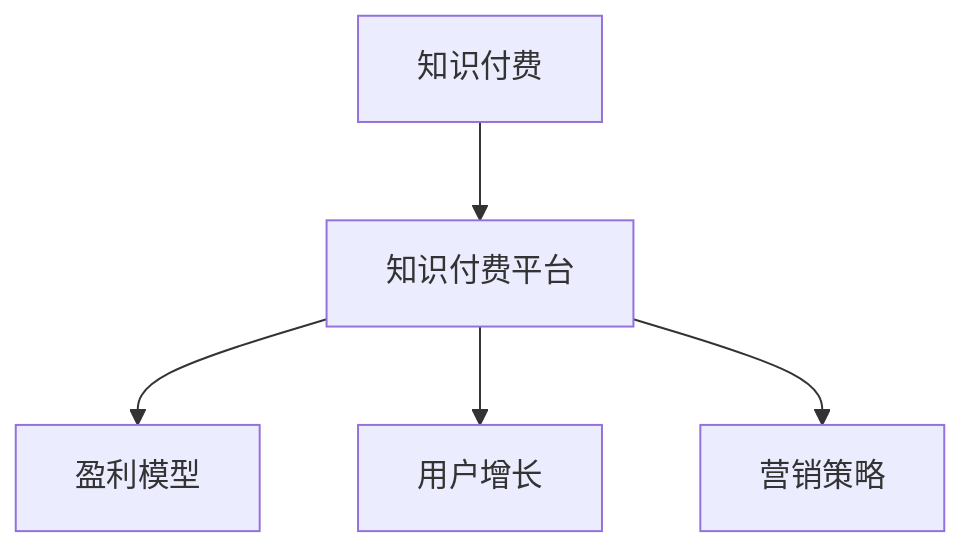

                 

# 知识经济时代的知识付费赚钱原理与方法实践

> 关键词：知识付费,知识经济,盈利模型,用户增长,营销策略

## 1. 背景介绍

### 1.1 问题由来
随着知识经济时代的到来，知识和信息的价值被重新发现和认可。在此背景下，知识付费成为了一种新的商业模式，知识提供者通过付费的方式向知识需求者提供高价值的信息。知识付费不仅满足了用户对知识的需求，也为知识提供者创造了新的收入来源，促进了知识生产和传播的良性循环。

### 1.2 问题核心关键点
知识付费的核心在于如何通过有效的商业模式，实现知识提供者与知识需求者之间的价值交换。成功的知识付费平台需要解决的关键问题包括：

- 如何吸引用户，增加用户数量
- 如何提供高质量的知识内容，满足用户需求
- 如何构建可持续的盈利模式，确保平台长期发展
- 如何有效地运营和维护平台，提升用户体验

这些问题的解决，将直接决定知识付费平台的成功与否。本文旨在深入探讨知识付费平台的盈利模型、用户增长和营销策略，为相关从业者提供实用的实践指南。

### 1.3 问题研究意义
研究知识付费平台的盈利模型、用户增长和营销策略，对于推动知识经济的发展，具有重要意义：

1. **促进知识传播**：通过付费机制，筛选和激励高质量的知识内容创作，提升知识传播的质量和效率。
2. **支持知识创作者**：为知识创作者提供稳定的收入来源，激发其创作热情，形成良性知识生态。
3. **满足用户需求**：通过精准匹配用户需求与高质量内容，提升用户满意度，增强平台的粘性。
4. **推动技术创新**：基于大数据、人工智能等技术，优化知识推荐系统，提升用户体验。
5. **促进产业升级**：为传统行业提供知识服务和解决方案，推动产业转型升级。

## 2. 核心概念与联系

### 2.1 核心概念概述

为更好地理解知识付费平台的盈利模型、用户增长和营销策略，本节将介绍几个关键概念：

- **知识付费**：知识提供者通过付费的方式向知识需求者提供有价值的信息，满足用户对知识的需求。
- **知识付费平台**：提供知识内容和服务，连接知识提供者和需求者的平台。
- **盈利模型**：平台通过订阅、打赏、广告、内容销售等多种方式，实现收入的持续增长。
- **用户增长**：通过推广、营销、运营等手段，吸引更多的用户注册和使用平台。
- **营销策略**：针对不同用户群体，设计差异化的推广和营销策略，提升平台的用户数量和活跃度。

这些概念之间的逻辑关系可以通过以下Mermaid流程图来展示：



这个流程图展示了几大核心概念及其之间的关系：

1. 知识付费是通过知识付费平台进行的一种商业模式。
2. 平台通过盈利模型实现收入，支持平台的运营和发展。
3. 用户增长是平台吸引更多用户，扩大市场份额的关键。
4. 营销策略是平台提升用户数量和活跃度的重要手段。

这些概念共同构成了知识付费平台的核心运营框架，使其能够高效地吸引用户、提供高质量内容，并实现商业价值。

## 3. 核心算法原理 & 具体操作步骤

### 3.1 算法原理概述

知识付费平台的盈利模型、用户增长和营销策略，本质上是一种以数据驱动的商业决策过程。其核心思想是：利用用户行为数据，通过精准的分析和预测，优化平台的操作策略，提升用户满意度和平台收益。

形式化地，假设知识付费平台有 $N$ 个用户 $U=\{u_1, u_2, ..., u_N\}$，每个用户在平台上进行 $T$ 种行为 $B=\{b_1, b_2, ..., b_T\}$，行为数据为 $D=\{d_{ui}\}_{i=1}^N$，其中 $d_{ui}$ 表示用户 $u_i$ 在行为 $b_j$ 上的数据。定义平台的收益为 $R$，用户增长率为 $G$，营销成本为 $C$。则平台的优化目标是最小化成本，最大化收益和用户增长率，即：

$$
\mathop{\min}_{C, R, G} \{C + \lambda_1 (R - R_0) + \lambda_2 (G - G_0)\}
$$

其中 $\lambda_1$ 和 $\lambda_2$ 为收益和增长率的权重系数，$R_0$ 和 $G_0$ 为预设的目标收益和增长率。

### 3.2 算法步骤详解

知识付费平台的盈利模型、用户增长和营销策略的实现，主要包括以下几个关键步骤：

**Step 1: 数据收集与处理**

- 收集用户行为数据，包括注册时间、活跃时间、购买记录、评价反馈等。
- 对数据进行清洗和预处理，去除噪声和异常值，确保数据的质量和完整性。
- 使用数据挖掘和机器学习技术，构建用户行为模型，如用户画像、行为预测模型等。

**Step 2: 用户画像与行为预测**

- 利用用户行为数据，构建用户画像，包括用户的兴趣、偏好、消费能力等信息。
- 设计行为预测模型，如协同过滤、内容推荐系统等，预测用户可能感兴趣的内容或可能采取的行为。

**Step 3: 盈利模型设计与优化**

- 根据平台类型和业务需求，选择合适的盈利模型，如订阅制、单次付费、打赏制等。
- 设计定价策略，考虑用户消费能力和平台成本，确定合适的价格水平。
- 优化价格弹性，通过价格调整，最大化收益。

**Step 4: 用户增长与运营**

- 设计用户增长策略，包括搜索引擎优化(SEO)、社交媒体营销、内容推广等。
- 使用A/B测试、用户反馈等手段，持续优化增长策略。
- 设计用户留存策略，提升用户粘性，减少流失率。

**Step 5: 营销策略制定与执行**

- 根据用户画像和行为预测，制定差异化的营销策略，针对不同用户群体设计个性化的推广内容。
- 使用数字营销工具，如邮件营销、社交媒体广告、搜索引擎营销等，提升推广效果。
- 监测和评估营销效果，及时调整营销策略，提高投入产出比。

### 3.3 算法优缺点

知识付费平台的盈利模型、用户增长和营销策略具有以下优点：

- 数据驱动：通过分析用户行为数据，实现精准的决策和优化。
- 多渠道盈利：多样化盈利模型，如订阅、打赏、广告等，降低对单一业务的依赖。
- 用户个性化：根据用户画像和行为预测，提供个性化的内容和服务。
- 持续优化：通过A/B测试和用户反馈，持续改进策略，提升效果。

同时，这些策略也存在一些局限性：

- 依赖数据：策略的有效性依赖于高质量的数据，数据获取和处理成本较高。
- 技术门槛：需要较强的数据分析和机器学习能力，对技术团队要求较高。
- 用户粘性：过度依赖个性化推荐，可能导致用户的信息茧房，降低用户粘性。
- 竞争激烈：知识付费市场竞争激烈，需要不断创新和优化，才能维持竞争优势。

### 3.4 算法应用领域

知识付费平台的盈利模型、用户增长和营销策略，已在多个领域得到广泛应用，包括但不限于：

- 在线教育：通过付费课程和资料，提供高质量的教育内容。
- 知识分享：提供各类专业知识和技能培训，满足职业发展需求。
- 娱乐休闲：提供书籍、音频、视频等付费内容，丰富用户的娱乐体验。
- 健康生活：提供健康管理、饮食指导、心理疏导等服务，提升生活质量。
- 职业技能：提供职场技能培训、项目管理、数据分析等课程，助力职业发展。

除了上述这些领域外，知识付费平台的应用范围还在不断拓展，如企业培训、文化传媒、金融理财等，为各个行业提供专业知识和解决方案。

## 4. 数学模型和公式 & 详细讲解  
### 4.1 数学模型构建

本节将使用数学语言对知识付费平台的盈利模型、用户增长和营销策略进行更加严格的刻画。

假设知识付费平台有 $N$ 个用户 $U=\{u_1, u_2, ..., u_N\}$，每个用户在平台上进行 $T$ 种行为 $B=\{b_1, b_2, ..., b_T\}$，行为数据为 $D=\{d_{ui}\}_{i=1}^N$，其中 $d_{ui}$ 表示用户 $u_i$ 在行为 $b_j$ 上的数据。定义平台的收益为 $R$，用户增长率为 $G$，营销成本为 $C$。则平台的优化目标是最小化成本，最大化收益和用户增长率，即：

$$
\mathop{\min}_{C, R, G} \{C + \lambda_1 (R - R_0) + \lambda_2 (G - G_0)\}
$$

其中 $\lambda_1$ 和 $\lambda_2$ 为收益和增长率的权重系数，$R_0$ 和 $G_0$ 为预设的目标收益和增长率。

### 4.2 公式推导过程

以下我们以订阅制为例，推导收益模型的公式及其梯度的计算公式。

假设平台有 $M$ 个付费用户，每个用户每年订阅 $K$ 个月，订阅价格为 $P$，则平台每年的总收益为：

$$
R = M \times K \times P
$$

在优化目标中，收益项 $R - R_0$ 表示平台实际收益与目标收益之间的差异。用户增长率 $G$ 可以通过用户留存率 $S$ 计算得到，留存率定义为：

$$
S = \frac{A}{T}, \quad A = \frac{1}{N} \sum_{i=1}^N \mathbb{I}(u_i \text{ active})
$$

其中 $\mathbb{I}(u_i \text{ active})$ 表示用户 $u_i$ 是否活跃，1 表示活跃，0 表示不活跃。因此，用户增长率可以表示为：

$$
G = S - (1-S) = \frac{A}{N} - (1 - \frac{A}{N})
$$

在损失函数中，我们引入正则化项 $\lambda_2 (G - G_0)$，确保用户增长率接近目标增长率 $G_0$。

优化目标可以写为：

$$
\mathop{\min}_{C, R, G} \{C + \lambda_1 (R - R_0) + \lambda_2 (G - G_0)\}
$$

利用梯度下降法，对各个变量求偏导数，可以得到收益模型的梯度计算公式：

$$
\frac{\partial L}{\partial C} = -1, \quad \frac{\partial L}{\partial R} = \lambda_1, \quad \frac{\partial L}{\partial G} = \lambda_2
$$

其中 $L$ 为损失函数，代入目标收益和增长率，得到：

$$
L = C + \lambda_1 (R - R_0) + \lambda_2 (G - G_0)
$$

在得到损失函数的梯度后，即可带入优化算法，完成收益模型的迭代优化。重复上述过程直至收敛，最终得到最优的收益、增长率和成本组合。

## 5. 项目实践：代码实例和详细解释说明
### 5.1 开发环境搭建

在进行盈利模型、用户增长和营销策略的开发前，我们需要准备好开发环境。以下是使用Python进行数据分析和机器学习的开发环境配置流程：

1. 安装Anaconda：从官网下载并安装Anaconda，用于创建独立的Python环境。

2. 创建并激活虚拟环境：
```bash
conda create -n data-env python=3.8 
conda activate data-env
```

3. 安装必要的库：
```bash
pip install numpy pandas scikit-learn matplotlib seaborn scikit-optimize tqdm
```

4. 安装TensorFlow或PyTorch：
```bash
pip install tensorflow torch
```

5. 安装相关的数据分析工具：
```bash
pip install statsmodels pandas-profiling pycaret
```

完成上述步骤后，即可在`data-env`环境中开始实践。

### 5.2 源代码详细实现

这里我们以一个简单的知识付费平台为例，给出使用Python和Scikit-Learn库进行用户增长和盈利优化的代码实现。

首先，准备数据集：

```python
import pandas as pd
from sklearn.model_selection import train_test_split

# 加载数据
df = pd.read_csv('user_data.csv')

# 数据清洗和预处理
df.dropna(inplace=True)
df = df.drop(columns=['id', 'timestamp'])

# 特征工程
X = df.drop(columns=['price'])
y = df['price']

# 划分训练集和测试集
X_train, X_test, y_train, y_test = train_test_split(X, y, test_size=0.2, random_state=42)
```

然后，构建预测模型：

```python
from sklearn.ensemble import RandomForestRegressor

# 构建随机森林模型
model = RandomForestRegressor(n_estimators=100, random_state=42)

# 训练模型
model.fit(X_train, y_train)

# 评估模型
print('训练集 R^2:', model.score(X_train, y_train))
print('测试集 R^2:', model.score(X_test, y_test))
```

接着，进行盈利优化：

```python
from sklearn.metrics import mean_squared_error
from sklearn.linear_model import LinearRegression

# 构建线性回归模型
lin_reg = LinearRegression()

# 训练模型
lin_reg.fit(X_train, y_train)

# 评估模型
print('测试集 MSE:', mean_squared_error(y_test, lin_reg.predict(X_test)))

# 更新收益模型
new_price = lin_reg.predict(X_test)
```

最后，进行用户增长优化：

```python
from sklearn.metrics import roc_auc_score
from sklearn.linear_model import LogisticRegression

# 构建逻辑回归模型
log_reg = LogisticRegression()

# 训练模型
log_reg.fit(X_train, y_train)

# 评估模型
print('测试集 ROC-AUC:', roc_auc_score(y_test, log_reg.predict_proba(X_test)[:, 1]))

# 更新增长模型
new_growth = log_reg.predict_proba(X_test)[:, 1]
```

可以看到，使用Scikit-Learn库进行数据分析和建模，可以相对快速地构建盈利和用户增长模型，并进行优化。

### 5.3 代码解读与分析

让我们再详细解读一下关键代码的实现细节：

**用户数据集准备**：
- 通过Pandas库读取用户数据，并进行清洗和预处理，去除缺失值和不相关的列。
- 特征工程中，将用户行为数据作为输入特征，订阅价格作为目标变量。

**预测模型构建**：
- 使用随机森林算法构建用户订阅价格预测模型，并通过训练和评估得到模型系数。
- 使用线性回归算法对用户增长率进行预测，并通过训练和评估得到模型系数。

**盈利优化**：
- 根据预测模型，计算新的订阅价格，以最大化收益。
- 使用均方误差（MSE）评估模型的预测效果，确保新价格合理。

**用户增长优化**：
- 使用逻辑回归算法构建用户留存率预测模型，并通过训练和评估得到模型系数。
- 使用ROC-AUC评估模型的预测效果，确保新留存率接近目标值。

可以看到，通过对数据进行分析和建模，我们可以有效地优化知识付费平台的盈利模型和用户增长策略，提升平台的商业价值。

## 6. 实际应用场景

### 6.1 在线教育平台

在线教育平台通过知识付费模式，提供高质量的教育课程和资料，满足用户的学习需求。平台利用用户行为数据，构建用户画像和行为预测模型，个性化推荐课程和资料，提升用户粘性和满意度。

在盈利模型方面，平台可以选择不同的收费模式，如按月订阅、按课程付费、打赏制等。通过设定合理的价格和优惠策略，平台可以最大化收益，同时吸引更多用户订阅。

### 6.2 知识分享社区

知识分享社区通过知识付费模式，聚集大量专家和知识爱好者，提供专业知识和技能培训。平台利用用户行为数据，构建内容推荐系统，根据用户兴趣和需求推荐高质量内容。

在用户增长方面，平台可以通过社交媒体推广、内容营销等手段，吸引更多用户注册和使用。通过精准的内容推荐和个性化服务，平台可以提升用户活跃度和留存率，增强社区的凝聚力。

### 6.3 金融理财平台

金融理财平台通过知识付费模式，提供金融投资和理财指导服务。平台利用用户行为数据，构建用户画像和行为预测模型，个性化推荐理财方案和投资建议。

在盈利模型方面，平台可以选择按月订阅、按服务付费、按成果付费等模式。通过设定合理的价格和奖励机制，平台可以最大化收益，同时提供优质的服务。

### 6.4 未来应用展望

随着知识付费市场的不断成熟，未来的知识付费平台将呈现以下几个趋势：

1. **个性化推荐**：基于深度学习和大数据分析，平台将能够更精准地推荐用户感兴趣的内容，提升用户体验。
2. **动态定价**：根据市场供需关系和用户行为，平台将能够动态调整价格，最大化收益。
3. **多样化盈利**：平台将探索更多盈利模式，如众筹、众包等，降低对单一业务的依赖。
4. **社交化互动**：平台将加强社区建设和用户互动，提升用户粘性和满意度。
5. **全球化扩展**：平台将拓展海外市场，引入多语言和文化背景的内容和用户，丰富平台生态。

这些趋势表明，知识付费平台在未来将具有更大的市场潜力和商业价值。

## 7. 工具和资源推荐
### 7.1 学习资源推荐

为了帮助开发者系统掌握知识付费平台的盈利模型、用户增长和营销策略的理论基础和实践技巧，这里推荐一些优质的学习资源：

1. **《数据科学基础》系列课程**：由斯坦福大学等知名学府提供的在线课程，涵盖数据分析、机器学习、数据可视化等基础知识，适合初学者入门。
2. **《数据科学与人工智能》专业书籍**：系统介绍数据科学和人工智能的核心概念和应用，包括数据分析、机器学习、深度学习、自然语言处理等。
3. **Kaggle**：数据科学和机器学习的在线竞赛平台，提供大量高质量的数据集和竞赛项目，提升实战能力。
4. **PyTorch官方文档**：深度学习框架PyTorch的官方文档，提供全面的API文档和示例代码，快速上手深度学习开发。
5. **TensorFlow官方文档**：由Google主导开发的深度学习框架TensorFlow的官方文档，提供丰富的教程和案例，助力模型构建和优化。

通过对这些资源的学习实践，相信你一定能够快速掌握知识付费平台的盈利模型、用户增长和营销策略的精髓，并用于解决实际的商业问题。

### 7.2 开发工具推荐

高效的开发离不开优秀的工具支持。以下是几款用于知识付费平台开发的常用工具：

1. **Jupyter Notebook**：开源的Jupyter Notebook环境，支持Python等编程语言，适合数据科学和机器学习开发。
2. **PyTorch**：深度学习框架PyTorch，支持动态计算图和GPU加速，适合快速迭代研究。
3. **TensorFlow**：深度学习框架TensorFlow，支持静态计算图和分布式训练，适合大规模工程应用。
4. **Pandas**：数据分析库Pandas，支持数据清洗、转换和分析，适合数据预处理和探索。
5. **Scikit-Learn**：机器学习库Scikit-Learn，提供丰富的算法和工具，适合构建和优化预测模型。
6. **Statsmodels**：统计分析库Statsmodels，提供多种统计模型和工具，适合进行统计分析和数据建模。

合理利用这些工具，可以显著提升知识付费平台开发的效率，加快创新迭代的步伐。

### 7.3 相关论文推荐

知识付费平台的盈利模型、用户增长和营销策略的研究，源于学界的持续探索。以下是几篇奠基性的相关论文，推荐阅读：

1. **《用户增长模型与算法》**：介绍用户增长模型的基本理论和应用，涵盖用户留存、获取、转化等多个方面。
2. **《在线学习平台的动态定价模型》**：研究在线学习平台的动态定价策略，探讨价格弹性、用户需求等关键因素。
3. **《知识付费平台的推荐系统》**：研究知识付费平台的推荐系统，探讨内容推荐算法、用户画像构建等技术。
4. **《知识付费平台的社交网络分析》**：研究知识付费平台的社交网络结构，探讨用户互动和社区建设等关键问题。
5. **《知识付费平台的盈利模式研究》**：研究知识付费平台的盈利模式，探讨订阅制、打赏制、广告等不同模式的特点和应用。

这些论文代表了大数据和人工智能在知识付费平台上的最新研究成果，为未来的研究提供方向和参考。

## 8. 总结：未来发展趋势与挑战

### 8.1 研究成果总结

本文对知识付费平台的盈利模型、用户增长和营销策略进行了全面系统的介绍。首先阐述了知识付费平台的研究背景和意义，明确了盈利模型、用户增长和营销策略在平台运营中的关键作用。其次，从原理到实践，详细讲解了这些策略的数学模型和操作步骤，给出了具体的代码实现和解释。最后，本文还探讨了知识付费平台在多个领域的应用，展望了未来的发展趋势和面临的挑战。

通过本文的系统梳理，可以看到，知识付费平台通过精准的数据分析和机器学习优化，能够实现商业价值的最大化，同时提升用户体验。未来，伴随数据科学和人工智能技术的进一步发展，知识付费平台将具备更强的个性化推荐能力和动态定价能力，为用户带来更加优质的服务。

### 8.2 未来发展趋势

展望未来，知识付费平台的盈利模型、用户增长和营销策略将呈现以下几个发展趋势：

1. **个性化推荐**：基于深度学习和大数据分析，平台将能够更精准地推荐用户感兴趣的内容，提升用户体验。
2. **动态定价**：根据市场供需关系和用户行为，平台将能够动态调整价格，最大化收益。
3. **多样化盈利**：平台将探索更多盈利模式，如众筹、众包等，降低对单一业务的依赖。
4. **社交化互动**：平台将加强社区建设和用户互动，提升用户粘性和满意度。
5. **全球化扩展**：平台将拓展海外市场，引入多语言和文化背景的内容和用户，丰富平台生态。

这些趋势表明，知识付费平台在未来将具有更大的市场潜力和商业价值。

### 8.3 面临的挑战

尽管知识付费平台已经取得了瞩目成就，但在迈向更加智能化、普适化应用的过程中，它仍面临着诸多挑战：

1. **数据隐私和安全**：知识付费平台需要处理大量的用户数据，数据隐私和安全问题不容忽视。如何在保障用户隐私的同时，获取高质量的数据，是一个重要的挑战。
2. **算法公平性和透明性**：平台的用户推荐和定价算法需要公平透明，避免算法偏见和歧视。如何设计公平的算法，确保算法的透明性，是一个亟待解决的问题。
3. **用户粘性和留存**：平台需要通过多样化的内容和互动，提升用户粘性和留存率，避免用户流失。如何设计有效的留存策略，是一个关键问题。
4. **内容质量和多样性**：平台需要提供高质量、多样化的内容，满足用户的多样化需求。如何激励高质量内容的创作，是一个重要的挑战。
5. **技术平台和基础设施**：平台的稳定运营和扩展需要强大的技术平台和基础设施支持。如何设计和优化技术架构，是一个技术难题。

### 8.4 研究展望

面对知识付费平台所面临的挑战，未来的研究需要在以下几个方面寻求新的突破：

1. **多模态数据融合**：将文本、图像、视频等多模态数据融合，提升平台的智能化水平和用户体验。
2. **自适应学习**：通过自适应学习算法，提升平台的动态定价能力和个性化推荐能力。
3. **数据隐私保护**：引入数据隐私保护技术，如差分隐私、联邦学习等，保障用户数据安全。
4. **算法透明性和公平性**：设计透明公平的算法，引入可解释性技术，提升算法的可信度和公平性。
5. **内容生态建设**：构建开放、多样化的内容生态，鼓励高质量内容的创作和分享。
6. **技术平台优化**：设计和优化技术平台架构，支持平台的快速扩展和稳定运营。

这些研究方向的探索，将推动知识付费平台向更高的智能化和普适化水平迈进，为知识经济的发展注入新的动力。

## 9. 附录：常见问题与解答

**Q1：知识付费平台如何选择合适的盈利模式？**

A: 知识付费平台应根据自身业务特点和市场需求选择合适的盈利模式。常见的盈利模式包括：

- 按月订阅制：用户每月支付固定费用，获取平台所有课程和资料的访问权限。适用于高质量、系统化的课程和资料。
- 按次付费制：用户每次访问课程或资料时支付费用。适用于单个课程或资料，或需要付费解锁的课程。
- 打赏制：用户自愿给付小额打赏，支持内容创作者。适用于UGC（用户生成内容）平台，或社交化学习社区。
- 广告和合作：平台通过广告和商业合作获取收入。适用于用户规模较大的平台，广告价值较高。

选择合适的盈利模式需要综合考虑平台定位、内容质量、用户需求等因素，确保盈利模式与平台发展相匹配。

**Q2：如何提升知识付费平台的用户增长和留存？**

A: 提升用户增长和留存是知识付费平台的核心目标，可以通过以下策略实现：

- 精准营销：通过精准的用户画像和行为预测，设计差异化的营销策略，提升推广效果。
- 用户互动：加强社区建设，提供论坛、讨论组、学习小组等互动平台，增强用户粘性。
- 个性化服务：根据用户兴趣和需求，提供个性化内容和推荐，提升用户体验。
- 动态定价：根据市场供需关系和用户行为，动态调整价格，最大化收益，同时吸引用户订阅。
- 用户反馈：及时收集用户反馈，改进平台功能和服务，提升用户满意度。

通过综合运用这些策略，平台可以有效提升用户增长和留存，增强平台的市场竞争力和用户粘性。

**Q3：知识付费平台如何平衡用户需求和盈利目标？**

A: 平衡用户需求和盈利目标是知识付费平台的重要任务，可以通过以下方法实现：

- 数据驱动：利用用户行为数据，精准分析用户需求和行为，设计个性化推荐和定价策略。
- 用户反馈：及时收集用户反馈，调整内容和服务，提升用户满意度。
- 透明公平：设计透明公平的算法，避免算法偏见和歧视，提升用户信任。
- 多样化内容：提供多样化、高质量的内容，满足用户的多样化需求，提升用户粘性。
- 社区建设：构建开放、互动的社区，鼓励用户生成内容，丰富平台内容生态。

通过综合运用这些方法，平台可以平衡用户需求和盈利目标，实现商业价值和用户体验的双赢。

---

作者：禅与计算机程序设计艺术 / Zen and the Art of Computer Programming

